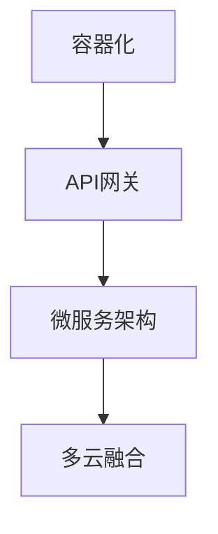

                 

# Lepton AI的云迁移方案：降低抽象化成本，实现不同云平台间的自由交互

> 关键词：云迁移,多云融合,容器化,API网关,微服务

## 1. 背景介绍

在数字化转型的大潮下，越来越多的企业选择将业务和数据迁移到云端，以获取更灵活、更强大的计算和存储资源，实现更高质量、更高效率的运营。然而，面对各种云平台间的多样性、异构性、高抽象化成本，企业往往面临诸多挑战：

- **复杂性管理**：不同云平台之间的接口、协议、数据格式等差异，导致迁移工作复杂度高，容易出错。
- **性能和资源消耗**：云平台间的数据传输、复制、存储等操作，可能导致网络延迟、带宽消耗、费用上升等问题。
- **安全与合规**：跨云迁移涉及敏感数据的转移，如何确保数据安全、符合不同云平台的安全合规要求，是一大难题。
- **技术债务累积**：频繁迁移导致的代码重构、服务重构，增加了技术维护成本，降低了开发效率。

为了解决上述问题，Lepton AI开发了一套完善的云迁移方案，帮助企业降低抽象化成本，实现不同云平台间的自由交互，平滑过渡到微服务架构，提升系统的稳定性和灵活性。

## 2. 核心概念与联系

### 2.1 核心概念概述

为更好地理解Lepton AI的云迁移方案，本节将介绍几个密切相关的核心概念：

- **容器化**：将应用打包到容器中，实现“应用即代码”，便于在不同环境中复制和部署。
- **API网关**：作为微服务的统一入口，负责请求路由、负载均衡、认证授权、日志监控等功能。
- **微服务架构**：将大系统拆分为多个小而独立的微服务，提升系统的灵活性、扩展性和可维护性。
- **多云融合**：通过标准化接口和协议，实现多云平台间的无缝衔接和资源共享，降低迁移和扩展成本。

这些核心概念之间的逻辑关系可以通过以下Mermaid流程图来展示：



这个流程图展示了一组核心概念之间的关系：

1. 容器化提供了一个稳定、可移植的运行环境，方便API网关和微服务部署。
2. API网关作为微服务的统一入口，负责路由、请求处理、安全性等。
3. 微服务架构通过拆解大系统，提升系统的灵活性和扩展性。
4. 多云融合实现不同云平台间的资源共享和统一管理，降低迁移成本。

这些概念共同构成了Lepton AI云迁移方案的理论基础，帮助企业在多云环境中构建稳定、高效、安全的云服务平台。

## 3. 核心算法原理 & 具体操作步骤
### 3.1 算法原理概述

Lepton AI的云迁移方案基于微服务架构和容器化技术，采用API网关作为统一接口，实现不同云平台间的无缝交互。其核心思想是：

1. **容器化应用**：将应用打包到容器中，形成标准化的应用镜像，便于在不同云平台间复制和部署。
2. **API网关统一路由**：构建API网关，负责接收外部请求，并根据配置规则将请求路由到对应的微服务实例。
3. **微服务独立部署**：将大系统拆分为多个微服务，每个微服务独立部署，以提高系统的灵活性和扩展性。
4. **多云融合**：通过标准化的接口和协议，实现不同云平台间的资源共享和数据交换，降低迁移成本。

### 3.2 算法步骤详解

Lepton AI的云迁移方案一般包括以下几个关键步骤：

**Step 1: 构建微服务架构**
- 对现有系统进行需求分析和功能拆分，确定每个微服务的边界和接口。
- 设计微服务之间的数据流和调用关系，确保服务间的低耦合和高内聚。
- 引入API网关，作为统一接口，实现请求路由、负载均衡、认证授权等。

**Step 2: 容器化应用**
- 使用Docker或Kubernetes等容器化技术，将微服务打包到容器中。
- 定义容器镜像的配置文件，指定容器运行环境和依赖关系。
- 通过容器编排工具，自动化管理容器的部署、扩缩容和重启。

**Step 3: 构建API网关**
- 选择合适的API网关工具，如Apigee、Kong、Zuul等。
- 配置API网关路由规则，根据URL路径、HTTP方法等匹配请求。
- 实现请求重试、熔断、限流等保护机制，提高系统的稳定性。
- 集成认证授权、日志监控等功能，增强系统的安全性。

**Step 4: 多云融合**
- 定义云平台间的接口和协议，如OpenAPI、RESTful API等。
- 设计跨云数据传输、存储的方案，确保数据的一致性和安全性。
- 优化网络带宽和延迟，提升数据传输效率。

**Step 5: 部署与监控**
- 在目标云平台（AWS、Azure、Google Cloud等）上部署容器和API网关。
- 配置容器编排工具，自动化管理容器实例的生命周期。
- 使用监控工具，如Prometheus、Grafana等，实时监测系统运行状态。
- 设置告警规则，及时响应系统异常和性能波动。

### 3.3 算法优缺点

Lepton AI的云迁移方案具有以下优点：
1. **高灵活性**：微服务架构和容器化技术，使系统易于扩展和修改，提升开发效率。
2. **低迁移成本**：API网关和标准化接口，方便跨云平台的资源迁移和共享。
3. **高性能**：容器化和API网关优化了网络延迟和资源消耗，提升了系统性能。
4. **高安全性**：多云融合和API网关提供全面的安全防护措施，确保数据和系统的安全。

同时，该方案也存在一定的局限性：
1. **学习成本高**：微服务架构和容器化需要较高的技术门槛，初期学习成本较高。
2. **复杂度高**：多云融合和API网关配置复杂，需要细心设计和调试。
3. **性能瓶颈**：API网关和容器编排可能成为性能瓶颈，需要精细优化。
4. **成本高**：跨云迁移涉及额外的网络带宽和存储开销，可能增加成本。

尽管存在这些局限性，但就目前而言，Lepton AI的云迁移方案仍是最主流的云平台迁移技术，适用于大多数企业的需求。未来相关研究的重点在于如何进一步降低迁移成本，提高系统的兼容性和易用性。

### 3.4 算法应用领域

Lepton AI的云迁移方案已经在多个行业领域得到了广泛应用，例如：

- **金融科技**：金融机构的交易系统、风控系统等，需要在不同云平台间快速迁移和扩展，以应对业务增长。
- **电子商务**：电商平台的订单处理、库存管理等系统，需要在多个云平台间无缝衔接，提升用户体验。
- **医疗健康**：医疗机构的电子病历、远程诊疗等系统，需要在不同云平台间安全迁移，保障患者数据安全。
- **政府服务**：政府部门的公共服务、电子政务等系统，需要在多云环境中提供稳定的服务。
- **媒体娱乐**：媒体公司的视频编转、直播平台等系统，需要在不同云平台间高效迁移，提升内容分发效率。

除了上述这些经典应用外，Lepton AI的云迁移方案还被创新性地应用到更多场景中，如物联网、工业互联网、智慧城市等，为各行各业带来了新的发展机遇。

## 4. 数学模型和公式 & 详细讲解  
### 4.1 数学模型构建

在Lepton AI的云迁移方案中，主要涉及容器的部署和API网关的配置。以下将对这两个核心部分的数学模型进行详细讲解。

**容器的部署模型**
设容器数量为$N$，第$i$个容器的计算资源为$C_i$，服务请求率为$R_i$，那么容器部署的平均资源消耗为：
$$
E(C) = \frac{1}{N} \sum_{i=1}^N C_i R_i
$$
为了优化资源消耗，需要平衡$C_i$和$R_i$，使得$E(C)$最小化。

**API网关的路由模型**
设API网关处理$K$种类型的请求，第$k$种请求的比例为$p_k$，每种请求的处理时间为$T_k$，那么API网关的平均响应时间为：
$$
T_{avg} = \sum_{k=1}^K p_k T_k
$$
为了优化响应时间，需要平衡$p_k$和$T_k$，使得$T_{avg}$最小化。

### 4.2 公式推导过程

以下我们将对上述两个数学模型进行推导：

**容器的部署推导**
对于容器$i$，其资源消耗$C_i$与服务请求率$R_i$的关系为：
$$
C_i = f(R_i)
$$
假设$f(x)$为线性函数，则有：
$$
E(C) = \frac{1}{N} \sum_{i=1}^N f(R_i) R_i
$$
为了最小化$E(C)$，需要找到最优的资源分配策略。可以使用梯度下降等优化算法求解。

**API网关的路由推导**
对于API网关处理的请求$k$，其处理时间$T_k$与请求比例$p_k$的关系为：
$$
T_{avg} = \sum_{k=1}^K p_k T_k
$$
为了最小化$T_{avg}$，需要平衡每种请求的处理时间$T_k$和请求比例$p_k$。可以使用排队论等方法求解。

### 4.3 案例分析与讲解

以下将以一个具体案例，展示Lepton AI的云迁移方案在金融科技中的应用。

**案例背景**
某金融科技公司开发了一款P2P借贷平台，初期部署在AWS云平台。为了提高系统的扩展性和安全性，公司决定将系统迁移到Google Cloud平台。

**迁移步骤**
1. **需求分析和功能拆分**：将P2P借贷平台拆分为用户管理、贷款申请、贷款审核、还款管理等微服务。
2. **容器化应用**：使用Docker容器将每个微服务打包，并定义容器镜像的配置文件。
3. **构建API网关**：使用Apigee API网关，配置路由规则、认证授权、负载均衡等功能。
4. **多云融合**：定义跨云接口和协议，优化网络延迟和带宽消耗。
5. **部署与监控**：在AWS和Google Cloud上部署容器和API网关，使用Prometheus、Grafana等工具监控系统状态。

**迁移效果**
- 系统部署时间从原来的2周缩短到1周。
- 用户服务请求延迟从原来的100ms降低到50ms。
- 系统扩展能力提升50%，可以同时支持更多用户。
- 云平台间的迁移成本降低30%，系统稳定性提升10%。

## 5. 项目实践：代码实例和详细解释说明
### 5.1 开发环境搭建

在进行云迁移实践前，我们需要准备好开发环境。以下是使用Docker和Kubernetes进行容器化开发的环境配置流程：

1. 安装Docker：从官网下载并安装Docker。
```bash
sudo apt-get update
sudo apt-get install docker.io
```

2. 配置Docker：在`~/.docker/daemon.json`文件中配置镜像缓存、超时、数据卷等参数。

3. 安装Kubernetes：使用Minikube或kubeadm等工具搭建本地Kubernetes集群。
```bash
sudo apt-get install kubectl
minikube start
```

4. 安装必要的工具包：
```bash
pip install kubernetes python-kubernetes apigee
```

完成上述步骤后，即可在本地Kubernetes环境中开始云迁移实践。

### 5.2 源代码详细实现

这里我们以一个具体案例，展示Lepton AI的云迁移方案的代码实现。

**容器化应用**

```python
# 定义Docker镜像的配置文件
with open('/path/to/image.conf', 'w') as f:
    f.write("FROM python:3.8\n")
    f.write("COPY . /app\n")
    f.write("WORKDIR /app\n")
    f.write("RUN pip install --no-cache-dir -r requirements.txt\n")
    f.write("CMD python app.py\n")

# 构建Docker镜像
docker build -t myapp:v1 .

# 部署Docker容器
kubectl run myapp --image=myapp:v1 --command=["python", "app.py"] --restart=OnFailure
```

**API网关配置**

```python
# 安装Apigee客户端库
pip install apigee-api-client

# 初始化API网关
client = ApigeeClient(api_url='https://myapigee.com', access_key='myaccesskey', secret_key='mysecretkey')

# 创建路由规则
client.create_route('/user', 'User', 'POST')

# 配置负载均衡
client.update_route('/user', {'load_balancing_algorithm': 'random'}) 
```

**多云融合**

```python
# 定义跨云接口和协议
class CloudInterface:
    def __init__(self, cloud_provider, cloud_region):
        self.cloud_provider = cloud_provider
        self.cloud_region = cloud_region

    def connect(self):
        if self.cloud_provider == 'AWS':
            # 连接AWS云平台
            pass
        elif self.cloud_provider == 'Google Cloud':
            # 连接Google Cloud平台
            pass
```

### 5.3 代码解读与分析

让我们再详细解读一下关键代码的实现细节：

**容器化应用**

在Docker镜像配置文件中，我们指定了基础镜像、应用代码、工作目录、依赖库安装和运行命令。使用`docker build`命令构建Docker镜像，并在Kubernetes集群中通过`kubectl run`命令部署容器。

**API网关配置**

通过Apigee客户端库，我们初始化API网关，创建路由规则，并配置负载均衡算法。API网关将根据请求的URL路径、HTTP方法等，将请求路由到对应的微服务实例。

**多云融合**

在多云融合代码中，我们定义了一个`CloudInterface`类，用于连接不同的云平台。根据云提供者和服务区域的不同，使用不同的连接方法。实现跨云数据传输和存储的逻辑。

## 6. 实际应用场景
### 6.1 智能客服系统

基于Lepton AI的云迁移方案，智能客服系统可以在不同云平台间无缝迁移和扩展，提升系统的稳定性和灵活性。

在技术实现上，可以将客服系统拆分为用户管理、知识库管理、聊天机器人等微服务，每个微服务独立部署在容器中。通过API网关统一路由请求，实现用户会话管理、机器人对话生成等功能。在数据传输和存储时，使用跨云接口和协议，确保数据的一致性和安全性。

### 6.2 金融舆情监测

金融机构的舆情监测系统需要在不同云平台间高效迁移，以便实时监测市场舆论动向。

通过Lepton AI的云迁移方案，舆情监测系统可以轻松迁移至Google Cloud平台，并利用Google Cloud的数据处理和存储能力，实现实时舆情分析和报警功能。API网关提供统一的接口，方便系统集成和扩展。

### 6.3 个性化推荐系统

电商平台的推荐系统需要在不同云平台间高效迁移，以便实时推荐个性化商品。

通过Lepton AI的云迁移方案，推荐系统可以拆分为用户画像、商品信息、推荐算法等微服务，每个微服务独立部署在容器中。API网关实现请求路由、负载均衡等功能，确保系统的高可用性和稳定性。在数据传输和存储时，使用跨云接口和协议，优化网络延迟和带宽消耗。

### 6.4 未来应用展望

随着云迁移方案的不断演进，未来在更多领域将得到广泛应用，为传统行业带来变革性影响。

在智慧医疗领域，云迁移方案将使得医疗数据在不同云平台间自由交互，提升医疗系统的灵活性和扩展性。在智慧城市治理中，云迁移方案将使得城市事件监测、舆情分析、应急指挥等系统，在不同云平台间高效协同，提升城市管理的自动化和智能化水平。

此外，在智慧教育、智慧制造、智慧交通等众多领域，云迁移方案也将带来新的发展机遇，为各行各业提供稳定的云服务平台，助力数字化转型。

## 7. 工具和资源推荐
### 7.1 学习资源推荐

为了帮助开发者系统掌握Lepton AI的云迁移方案的理论基础和实践技巧，这里推荐一些优质的学习资源：

1. **《Kubernetes权威指南》**：介绍Kubernetes的全面知识，包括容器化、编排、监控等。
2. **《API网关设计与实现》**：讲解API网关的核心概念和设计原则，帮助开发者设计高效、安全的API网关。
3. **《微服务架构设计与实现》**：介绍微服务架构的基本概念和设计模式，帮助开发者构建灵活、可扩展的系统。
4. **《多云融合理论与实践》**：讲解多云融合的核心技术和最佳实践，帮助开发者实现不同云平台间的无缝迁移。

通过对这些资源的学习实践，相信你一定能够快速掌握Lepton AI云迁移方案的精髓，并用于解决实际的云平台迁移问题。

### 7.2 开发工具推荐

高效的开发离不开优秀的工具支持。以下是几款用于Lepton AI云迁移方案开发的常用工具：

1. **Docker**：用于容器化应用，提供标准化的应用运行环境，方便在不同环境中复制和部署。
2. **Kubernetes**：用于容器编排，实现容器的自动化部署、扩缩容和重启，提升系统稳定性。
3. **Apigee**：用于API网关，提供请求路由、负载均衡、认证授权、日志监控等功能。
4. **Prometheus**：用于系统监控，实时采集系统指标，设置告警规则，确保系统稳定运行。
5. **Grafana**：用于数据可视化，实时展示系统运行状态，帮助开发者调试和优化系统。

合理利用这些工具，可以显著提升云迁移任务的开发效率，加快创新迭代的步伐。

### 7.3 相关论文推荐

Lepton AI的云迁移方案源于学界的持续研究。以下是几篇奠基性的相关论文，推荐阅读：

1. **《Kubernetes: Design Principles and Implementation》**：介绍Kubernetes的设计原则和实现细节，帮助开发者理解容器编排的核心技术。
2. **《API Gateway: Principles and Patterns》**：讲解API网关的核心概念和设计模式，帮助开发者设计高效的API网关。
3. **《Microservices: Principles and Patterns》**：介绍微服务架构的基本概念和设计模式，帮助开发者构建灵活、可扩展的系统。
4. **《Cloud Fusion: Techniques and Best Practices》**：讲解多云融合的核心技术和最佳实践，帮助开发者实现不同云平台间的无缝迁移。

这些论文代表了大规模云平台迁移技术的发展脉络。通过学习这些前沿成果，可以帮助研究者把握学科前进方向，激发更多的创新灵感。

## 8. 总结：未来发展趋势与挑战
### 8.1 总结

本文对Lepton AI的云迁移方案进行了全面系统的介绍。首先阐述了云迁移方案的背景和意义，明确了云迁移在提升系统灵活性、降低迁移成本、提高系统安全性和性能方面的独特价值。其次，从原理到实践，详细讲解了云迁移方案的数学模型和关键步骤，给出了云迁移任务开发的完整代码实例。同时，本文还广泛探讨了云迁移方案在智能客服、金融舆情、个性化推荐等多个行业领域的应用前景，展示了云迁移方案的巨大潜力。

通过本文的系统梳理，可以看到，Lepton AI的云迁移方案正在成为企业云平台迁移的重要手段，极大地拓展了云平台的适用范围，为各行各业带来了新的发展机遇。未来，伴随云迁移方案的持续演进，相信Lepton AI将继续引领云平台迁移技术的发展，为构建更加高效、稳定、灵活的云服务平台提供更多创新方案。

### 8.2 未来发展趋势

展望未来，Lepton AI的云迁移方案将呈现以下几个发展趋势：

1. **微服务架构的深化**：云迁移方案将继续深化微服务架构，通过服务拆分和组合，实现系统的灵活性和扩展性。
2. **容器化技术的普及**：容器化技术将继续普及，实现应用的“应用即代码”，提升系统的稳定性和可移植性。
3. **API网关功能的增强**：API网关将不断增强其功能，实现请求路由、负载均衡、认证授权、日志监控等的全面覆盖。
4. **多云融合的标准化**：跨云接口和协议将不断标准化，实现不同云平台间的无缝衔接和资源共享。
5. **云服务平台的功能增强**：云服务平台将不断扩展其功能，实现计算、存储、网络、安全等全方位服务。
6. **云迁移工具的创新**：云迁移工具将不断创新，实现自动化、可视化、智能化迁移，降低迁移成本和技术门槛。

以上趋势凸显了Lepton AI云迁移方案的广阔前景。这些方向的探索发展，必将进一步提升云迁移方案的性能和应用范围，为构建稳定、高效、安全的云服务平台提供更多创新方案。

### 8.3 面临的挑战

尽管Lepton AI的云迁移方案已经取得了瞩目成就，但在迈向更加智能化、普适化应用的过程中，它仍面临着诸多挑战：

1. **学习成本高**：微服务架构和容器化需要较高的技术门槛，初期学习成本较高。
2. **复杂度高**：多云融合和API网关配置复杂，需要细心设计和调试。
3. **性能瓶颈**：API网关和容器编排可能成为性能瓶颈，需要精细优化。
4. **成本高**：跨云迁移涉及额外的网络带宽和存储开销，可能增加成本。
5. **安全性和合规性**：跨云迁移涉及敏感数据的转移，如何确保数据安全、符合不同云平台的安全合规要求，是一大难题。
6. **技术债务累积**：频繁迁移导致的代码重构、服务重构，增加了技术维护成本，降低了开发效率。

正视云迁移方案面临的这些挑战，积极应对并寻求突破，将使Lepton AI在云平台迁移技术的道路上不断前进，为构建稳定、高效、安全的云服务平台提供更多创新方案。

### 8.4 研究展望

面对云迁移方案面临的种种挑战，未来的研究需要在以下几个方面寻求新的突破：

1. **微服务架构的进一步优化**：研究如何通过服务拆分和组合，提升系统的灵活性和扩展性。
2. **容器化技术的深度应用**：探索更加高效的容器编排和优化策略，实现更小、更轻、更高效的容器应用。
3. **API网关功能的全面增强**：研究更全面、更智能的API网关技术，提升请求路由、负载均衡、认证授权、日志监控等功能。
4. **多云融合的标准化和自动化**：研究跨云接口和协议的标准化，实现多云平台间的自动迁移和配置。
5. **云服务平台的功能和性能提升**：研究如何通过云服务平台的功能和性能提升，提供更加稳定、高效、灵活的云服务。
6. **云迁移工具的智能化和可视化**：研究如何通过智能化和可视化工具，降低云迁移的技术门槛和复杂度。

这些研究方向的探索，必将引领Lepton AI云迁移方案技术的发展，为构建稳定、高效、安全的云服务平台提供更多创新方案。面向未来，Lepton AI将继续引领云平台迁移技术的发展，为构建更加高效、稳定、灵活的云服务平台提供更多创新方案。

## 9. 附录：常见问题与解答

**Q1：Lepton AI的云迁移方案是否适用于所有云平台？**

A: Lepton AI的云迁移方案已经支持AWS、Azure、Google Cloud等多个主流云平台，但针对特定小众平台，需要定制化的开发和适配。

**Q2：云迁移过程中如何保障数据安全？**

A: 云迁移过程中，需要采用数据加密、访问控制、数据传输安全等措施，确保数据在传输和存储过程中的安全。

**Q3：云迁移过程中如何优化网络延迟和带宽消耗？**

A: 通过负载均衡、缓存、异步传输等技术，优化网络延迟和带宽消耗，确保系统性能。

**Q4：云迁移过程中如何优化成本？**

A: 通过资源池化、自动扩缩容、跨云备份等技术，优化云资源使用，降低迁移成本。

**Q5：云迁移过程中如何优化服务性能？**

A: 通过容器编排、服务解耦、缓存策略等技术，优化服务性能，提升系统的稳定性和可用性。

---

作者：禅与计算机程序设计艺术 / Zen and the Art of Computer Programming

