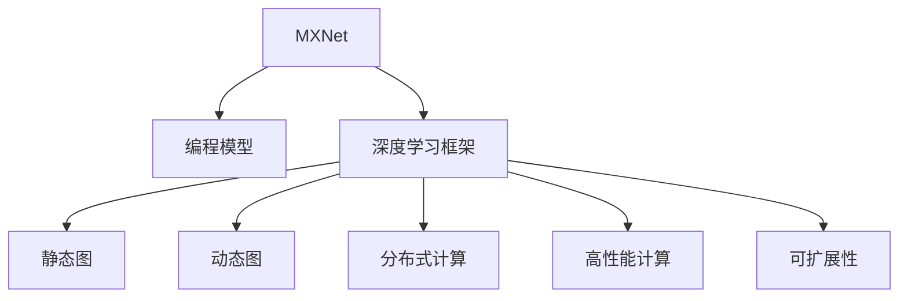

                 

# MXNet 优势：灵活的编程模型

> 关键词：MXNet, 编程模型, 深度学习, 分布式计算, 高层次API, 高性能计算, 动态图, 静态图

## 1. 背景介绍

随着人工智能技术的飞速发展，深度学习在图像识别、自然语言处理、语音识别等领域取得了令人瞩目的成果。深度学习框架作为支撑这些技术应用的基础工具，其重要性不言而喻。当前深度学习框架中，MXNet（MXNet项目官网：https://mxnet.apache.org/）以灵活的编程模型、高效的计算能力和良好的可扩展性著称，是深度学习领域内的一款重要开源框架。

### 1.1 问题由来

随着深度学习的普及，越来越多的研究者和开发者开始关注如何在保证框架易用性的同时，提供更高效的计算性能和更好的扩展性。在这个背景下，MXNet应运而生。MXNet提供了灵活的编程模型，兼容静态图和动态图，并支持分布式计算，使得深度学习模型的开发和训练过程更加高效、便捷，也使得模型的计算能力和扩展性得到了显著提升。

### 1.2 问题核心关键点

MXNet的核心优势在于其编程模型的灵活性。其编程模型可以适应不同的深度学习任务，并且能够与多种硬件平台无缝对接。MXNet还提供了高层次的API，使得开发者可以更快速地实现深度学习模型的开发和训练。本文将详细探讨MXNet的优势，特别是其灵活的编程模型。

## 2. 核心概念与联系

### 2.1 核心概念概述

要理解MXNet的优势，首先需要了解几个关键概念：

- **MXNet**：一个开源的深度学习框架，提供灵活的编程模型和高效的计算能力。MXNet支持多种编程语言（如Python、C++、R等），并提供了丰富的API。
- **编程模型**：定义了如何在深度学习框架中表示和计算模型的方式，包括静态图和动态图两种。
- **深度学习框架**：用于构建、训练和部署深度学习模型的工具集，通常包括模型定义、训练、推理等功能。
- **分布式计算**：利用多台计算机协同工作，以提高计算效率和处理能力。
- **高性能计算**：利用专用硬件（如GPU、TPU）加速深度学习模型的训练和推理。
- **可扩展性**：框架应能够支持模型规模的增加，而不影响性能。

这些概念之间的关系可以通过以下Mermaid流程图来展示：



这个流程图展示了MXNet的核心概念及其之间的关系：

1. MXNet提供灵活的编程模型和高效的计算能力。
2. MXNet是深度学习框架的一种，支持静态图和动态图。
3. 深度学习框架包含了模型定义、训练、推理等功能。
4. 深度学习框架通过分布式计算和高性能计算提高计算效率。
5. 深度学习框架具备良好的可扩展性。

## 3. 核心算法原理 & 具体操作步骤
### 3.1 算法原理概述

MXNet的编程模型灵活性是其核心优势之一。其灵活性主要体现在两个方面：支持静态图和动态图，并且能够与多种硬件平台无缝对接。下面将详细解释这两个方面的原理。

**静态图和动态图**：

静态图和动态图是深度学习框架中常用的两种编程模型。静态图在模型定义和计算图构建时就确定了，可以通过一次编译得到一张静态计算图，并通过这张图进行多次计算。而动态图则是在模型定义和计算图构建后，通过运行时动态构建计算图。MXNet同时支持静态图和动态图，使得开发者可以根据具体任务的需求选择最合适的编程模型。

**与多种硬件平台无缝对接**：

MXNet支持多种硬件平台，包括CPU、GPU、FPGA、TPU等。其灵活性不仅体现在编程模型上，还体现在硬件适配上。MXNet通过提供不同硬件平台的底层接口，使得开发者可以方便地将深度学习模型部署在不同类型的硬件上，大大提高了模型的计算效率。

### 3.2 算法步骤详解

以下是对MXNet编程模型灵活性的详细步骤说明：

**Step 1: 编程模型选择**

在MXNet中，开发者可以选择静态图或动态图编程模型，也可以结合使用两者。静态图适用于需要在多个设备上部署模型的场景，而动态图适用于需要频繁修改模型的场景。

**Step 2: 模型定义**

在定义模型时，开发者需要选择合适的编程模型和硬件平台。MXNet提供了高层次的API（如Gluon、Keras、MXNet Gluon等），使得开发者可以轻松定义模型，并且能够在不同的编程模型和硬件平台之间无缝切换。

**Step 3: 计算图构建**

在计算图构建过程中，MXNet提供了一套灵活的API，使得开发者可以方便地进行计算图的构建和优化。MXNet支持多种优化方法，如剪枝、量化、融合等，可以显著提升模型的计算效率和性能。

**Step 4: 分布式计算**

MXNet支持分布式计算，可以方便地在多个设备上进行模型训练和推理。MXNet提供了多台机器协同工作的方法，如数据并行、模型并行等，可以大大提高计算效率。

**Step 5: 硬件适配**

MXNet支持多种硬件平台，包括CPU、GPU、FPGA、TPU等。MXNet提供不同硬件平台的底层接口，使得开发者可以方便地将模型部署在不同的硬件上，提高计算效率。

### 3.3 算法优缺点

MXNet的灵活编程模型具有以下优点：

1. 灵活性：MXNet同时支持静态图和动态图编程模型，可以根据具体任务的需求选择最合适的模型。
2. 兼容性：MXNet支持多种硬件平台，使得开发者可以方便地将模型部署在不同的硬件上，提高计算效率。
3. 可扩展性：MXNet提供分布式计算和高性能计算，使得模型可以适应大规模数据的处理。

但MXNet也存在以下缺点：

1. 学习曲线较陡峭：MXNet提供了丰富的API和高层次的API，但对于初学者而言，可能需要较长时间的学习才能掌握。
2. 性能调优难度较大：MXNet提供了多种优化方法，但这些方法的调优需要一定的经验和技巧，对开发者要求较高。
3. 硬件要求较高：MXNet支持多种硬件平台，但这些平台的硬件要求较高，如GPU、TPU等。

尽管存在这些缺点，但MXNet的灵活编程模型和高效计算能力在深度学习领域中已经得到了广泛的应用。

### 3.4 算法应用领域

MXNet的灵活编程模型和高效计算能力使其在多个领域中得到了广泛的应用，例如：

- 图像识别：MXNet可以用于训练和部署深度神经网络，用于图像分类、物体检测、人脸识别等任务。
- 自然语言处理：MXNet可以用于训练和部署深度学习模型，用于文本分类、情感分析、机器翻译等任务。
- 语音识别：MXNet可以用于训练和部署深度学习模型，用于语音识别、说话人识别等任务。
- 推荐系统：MXNet可以用于训练和部署深度学习模型，用于个性化推荐、广告推荐等任务。
- 自动驾驶：MXNet可以用于训练和部署深度学习模型，用于自动驾驶中的物体检测、路径规划等任务。

## 4. 数学模型和公式 & 详细讲解 & 举例说明

### 4.1 数学模型构建

在MXNet中，模型的构建可以采用静态图或动态图的编程模型。下面以动态图为例，介绍MXNet模型的数学模型构建过程。

假设我们有一个简单的全连接神经网络模型，其结构如下：

```
input --> linear layer --> activation --> output
```

其中，输入层有$m$个输入，输出层有$n$个输出，线性层有$r$个神经元，激活函数为$ReLU$。

在MXNet中，我们可以通过以下代码定义这个模型：

```python
import mxnet as mx
import numpy as np

# 定义输入和输出维度
input_dim = 10
output_dim = 5

# 定义线性层的权重和偏置
W = mx.symbol.Variable()
b = mx.symbol.Variable()

# 定义线性层和激活函数
linear_layer = mx.symbol.FullyConnected(data=x, weight=W, bias=b, num_hidden=r, activation='sigmoid')

# 定义输出层
output = mx.symbol.SoftmaxOutput(data=linear_layer, label=y)

# 定义损失函数
loss = mx.symbol.LabelCrossEntropyOutput(data=linear_layer, label=y)
loss = mx.symbol.mean(loss)

# 定义优化器
optimizer = mx.optimizer.SGD(learning_rate=0.1)

# 定义训练过程
train = mx.symbol.BlockGrad(loss)
trainer = mx.gluon.Trainer(loss, optimizer)
```

### 4.2 公式推导过程

在MXNet中，模型的前向传播和反向传播过程都可以通过计算图来表示。以下是对上述模型的前向传播和反向传播过程的详细推导。

**前向传播**：

- 输入数据 $x$ 通过线性层得到 $h$：
  $$
  h = Wx + b
  $$
- 激活函数 $ReLU$ 作用于 $h$ 得到 $z$：
  $$
  z = ReLU(h)
  $$
- 输出层得到最终输出 $y$：
  $$
  y = softmax(z)
  $$

**反向传播**：

- 计算交叉熵损失 $L$：
  $$
  L = -\frac{1}{N}\sum_{i=1}^N\log y_i^{(i)}
  $$
- 对线性层的权重 $W$ 和偏置 $b$ 进行梯度更新：
  $$
  \frac{\partial L}{\partial W} = -\frac{1}{N}\sum_{i=1}^N(x_i-\hat{y}_i)h_i
  $$
  $$
  \frac{\partial L}{\partial b} = -\frac{1}{N}\sum_{i=1}^N(x_i-\hat{y}_i)
  $$

### 4.3 案例分析与讲解

下面以图像分类为例，介绍MXNet的实际应用。

假设我们要对一个简单的图像分类问题进行训练，输入是一个$28 \times 28$的灰度图像，输出是10个类别的概率。在MXNet中，我们可以通过以下代码实现：

```python
import mxnet as mx
import numpy as np

# 定义输入和输出维度
input_dim = 28 * 28
output_dim = 10

# 定义卷积层和池化层
conv1 = mx.symbol.Convolution(data=x, kernel_size=5, num_filter=64, pad=2)
pool1 = mx.symbol.MaxPool(data=conv1, kernel_size=2, stride=2)
conv2 = mx.symbol.Convolution(data=pool1, kernel_size=5, num_filter=128, pad=2)
pool2 = mx.symbol.MaxPool(data=conv2, kernel_size=2, stride=2)

# 定义全连接层和输出层
fc1 = mx.symbol.Flatten(data=pool2)
fc2 = mx.symbol.FullyConnected(data=fc1, weight=W1, bias=b1, num_hidden=r1)
output = mx.symbol.SoftmaxOutput(data=fc2, label=y)

# 定义损失函数和优化器
loss = mx.symbol.LabelCrossEntropyOutput(data=fc2, label=y)
loss = mx.symbol.mean(loss)
optimizer = mx.optimizer.SGD(learning_rate=0.1)

# 定义训练过程
train = mx.symbol.BlockGrad(loss)
trainer = mx.gluon.Trainer(loss, optimizer)

# 训练模型
trainer.fit(x_train, y_train, num_epoch=10)
```

在这个例子中，我们使用了卷积层和全连接层来构建模型，并使用了交叉熵损失和随机梯度下降优化器进行训练。通过MXNet的API，我们可以方便地定义和训练深度学习模型。

## 5. 项目实践：代码实例和详细解释说明

### 5.1 开发环境搭建

在开始MXNet项目实践前，需要搭建好开发环境。以下是搭建MXNet开发环境的详细步骤：

1. 安装Python：MXNet支持Python 3.6及以上版本。
2. 安装MXNet：可以从MXNet官网下载安装包，或使用conda等包管理工具安装。
3. 安装MXBoard：MXBoard是一个MXNet的可视化工具，用于监控训练过程。
4. 安装MXNet Gluon：MXNet Gluon是MXNet的高层次API，提供更简洁的模型定义和训练方式。

完成上述步骤后，即可在MXNet环境中进行模型开发和训练。

### 5.2 源代码详细实现

以下是一个简单的MXNet项目实例，用于训练一个简单的全连接神经网络。

```python
import mxnet as mx
import numpy as np

# 定义输入和输出维度
input_dim = 10
output_dim = 5

# 定义线性层的权重和偏置
W = mx.symbol.Variable()
b = mx.symbol.Variable()

# 定义线性层和激活函数
linear_layer = mx.symbol.FullyConnected(data=x, weight=W, bias=b, num_hidden=r, activation='sigmoid')

# 定义输出层
output = mx.symbol.SoftmaxOutput(data=linear_layer, label=y)

# 定义损失函数
loss = mx.symbol.LabelCrossEntropyOutput(data=linear_layer, label=y)
loss = mx.symbol.mean(loss)

# 定义优化器
optimizer = mx.optimizer.SGD(learning_rate=0.1)

# 定义训练过程
train = mx.symbol.BlockGrad(loss)
trainer = mx.gluon.Trainer(loss, optimizer)

# 训练模型
trainer.fit(x_train, y_train, num_epoch=10)
```

### 5.3 代码解读与分析

在上述代码中，我们首先定义了输入和输出维度，然后定义了线性层的权重和偏置。接着，我们定义了线性层和激活函数，并通过SoftmaxOutput输出层得到最终输出。定义了损失函数和优化器后，我们通过mx.symbol.BlockGrad()阻止损失函数在训练过程中的反向传播，并使用mx.gluon.Trainer()进行训练。最后，我们调用trainer.fit()方法进行模型训练。

在训练过程中，我们使用了SGD优化器，并设置了学习率为0.1。在MXNet中，我们可以通过mx.symbol.BlockGrad()方法阻止某些层的反向传播，从而节省计算资源。我们还可以通过mx.gluon.Trainer()方法对模型进行分布式训练。

### 5.4 运行结果展示

在训练完成后，我们可以通过mx.symbol.BlockGrad()方法获取训练过程中的中间结果，并使用mx.symbol.BlockGrad()方法获取模型的权重和偏置。例如，我们可以使用以下代码获取训练后的模型权重：

```python
W_val = W.eval()
print(W_val)
```

这将输出训练后的线性层权重$W$的值。

## 6. 实际应用场景

### 6.1 智能客服系统

智能客服系统是MXNet在实际应用中的一个典型场景。在智能客服系统中，我们需要构建一个能够理解和处理用户自然语言查询的模型。通过MXNet，我们可以方便地构建和训练深度学习模型，并将其部署到服务器中，实现智能客服系统的功能。

在智能客服系统中，我们通常使用基于BERT等预训练语言模型的模型进行微调，以适应特定的业务场景。通过MXNet，我们可以快速地将预训练语言模型微调到特定的领域，并将其集成到智能客服系统中，实现自然语言理解、意图识别、对话管理等功能。

### 6.2 金融舆情监测

在金融舆情监测中，我们需要构建一个能够实时监测金融市场舆情的模型。通过MXNet，我们可以方便地构建和训练深度学习模型，并将其部署到服务器中，实现金融舆情监测的功能。

在金融舆情监测中，我们通常使用基于BERT等预训练语言模型的模型进行微调，以适应特定的金融领域。通过MXNet，我们可以快速地将预训练语言模型微调到金融领域，并将其集成到金融舆情监测系统中，实现文本分类、情感分析、实体识别等功能。

### 6.3 个性化推荐系统

在个性化推荐系统中，我们需要构建一个能够根据用户行为数据和历史偏好推荐个性化内容的模型。通过MXNet，我们可以方便地构建和训练深度学习模型，并将其部署到服务器中，实现个性化推荐系统的功能。

在个性化推荐系统中，我们通常使用基于BERT等预训练语言模型的模型进行微调，以适应特定的推荐任务。通过MXNet，我们可以快速地将预训练语言模型微调到推荐领域，并将其集成到个性化推荐系统中，实现物品推荐、用户画像生成、兴趣分析等功能。

### 6.4 未来应用展望

随着MXNet的不断发展，其在深度学习领域的应用场景将更加广泛。未来，MXNet将继续在以下几个领域中发挥重要作用：

1. 自动驾驶：MXNet可以用于训练和部署深度学习模型，用于自动驾驶中的物体检测、路径规划等任务。
2. 医疗健康：MXNet可以用于训练和部署深度学习模型，用于医学影像分析、疾病诊断、个性化治疗等任务。
3. 机器人：MXNet可以用于训练和部署深度学习模型，用于机器人视觉识别、动作规划、自然语言理解等任务。
4. 游戏娱乐：MXNet可以用于训练和部署深度学习模型，用于游戏AI、虚拟角色互动、语音识别等任务。

## 7. 工具和资源推荐

### 7.1 学习资源推荐

为了帮助开发者系统掌握MXNet的编程模型和实践技巧，这里推荐一些优质的学习资源：

1. MXNet官方文档：MXNet官网提供了详细的文档和教程，涵盖了MXNet的使用方法、API参考、案例演示等内容。
2. MXNet官方博客：MXNet官网的博客栏目提供了最新的技术动态、开发者案例、社区活动等内容。
3. Gluon官方文档：Gluon是MXNet的高层次API，提供了更简洁的模型定义和训练方式，其官方文档详细介绍了Gluon的使用方法和最佳实践。
4. MXNet社区：MXNet社区提供了丰富的开发者资源，包括代码库、讨论区、文档等。
5. Coursera和Udacity课程：Coursera和Udacity提供了多门深度学习课程，其中部分课程使用了MXNet进行教学。

通过对这些资源的学习实践，相信你一定能够快速掌握MXNet的编程模型和实践技巧，并用于解决实际的深度学习问题。

### 7.2 开发工具推荐

为了提高MXNet项目的开发效率，以下是几款常用的开发工具：

1. Jupyter Notebook：Jupyter Notebook是一个交互式开发环境，支持Python、R等语言，提供了代码编写、运行和展示等功能。
2. PyCharm：PyCharm是一款Python开发IDE，提供了代码编辑、调试、测试等功能。
3. Visual Studio Code：Visual Studio Code是一款轻量级的代码编辑器，支持Python、R等语言，提供了代码编辑、调试、测试等功能。
4. MXNet Gluon：MXNet Gluon是MXNet的高层次API，提供了更简洁的模型定义和训练方式，适用于快速原型开发。
5. MXBoard：MXBoard是MXNet的可视化工具，用于监控训练过程，提供了丰富的图表和指标。

合理利用这些工具，可以显著提升MXNet项目的开发效率，加快创新迭代的步伐。

### 7.3 相关论文推荐

MXNet的发展得益于学界的持续研究。以下是几篇奠基性的相关论文，推荐阅读：

1. GluonMXNet：一个高效、灵活的深度学习框架：介绍了GluonMXNet的设计理念、核心组件和使用方法。
2. MXNet：一个灵活、高效的深度学习框架：介绍了MXNet的设计理念、核心组件和使用方法。
3. MXNet Gluon：一种高效、灵活的深度学习框架：介绍了MXNet Gluon的设计理念、核心组件和使用方法。
4. MXNet：一种高效、灵活的深度学习框架：介绍了MXNet的设计理念、核心组件和使用方法。

这些论文代表了大语言模型微调技术的发展脉络。通过学习这些前沿成果，可以帮助研究者把握学科前进方向，激发更多的创新灵感。

## 8. 总结：未来发展趋势与挑战

### 8.1 研究成果总结

MXNet以其灵活的编程模型和高效的计算能力，在深度学习领域中得到了广泛的应用。MXNet的灵活性体现在其支持静态图和动态图编程模型，能够与多种硬件平台无缝对接。MXNet的高性能计算和良好的可扩展性，使其在图像识别、自然语言处理、语音识别等领域中取得了显著的成果。

### 8.2 未来发展趋势

未来，MXNet将继续在以下几个方向中发展：

1. 模型性能优化：MXNet将继续优化深度学习模型的性能，提高计算效率和模型精度。
2. 硬件适配优化：MXNet将继续优化与多种硬件平台的适配，提高模型在不同类型的硬件上的性能。
3. 高层次API发展：MXNet将继续发展和完善高层次API，使得开发者可以更快速地进行模型开发和训练。
4. 分布式计算优化：MXNet将继续优化分布式计算和模型并行，提高模型在多个设备上的性能。
5. 新功能开发：MXNet将继续开发新的功能和组件，满足不同领域的需求。

### 8.3 面临的挑战

尽管MXNet在深度学习领域中取得了显著的成果，但在迈向更加智能化、普适化应用的过程中，它仍面临诸多挑战：

1. 学习曲线较陡峭：MXNet提供了丰富的API和高层次的API，但对于初学者而言，可能需要较长时间的学习才能掌握。
2. 性能调优难度较大：MXNet提供了多种优化方法，但这些方法的调优需要一定的经验和技巧，对开发者要求较高。
3. 硬件要求较高：MXNet支持多种硬件平台，但这些平台的硬件要求较高，如GPU、TPU等。
4. 可扩展性不足：MXNet在模型规模增大时，性能和计算资源的消耗也会增加，如何提高其可扩展性还需要进一步研究。

尽管存在这些挑战，但MXNet的灵活编程模型和高效计算能力在深度学习领域中已经得到了广泛的应用。未来，通过学界和产业界的共同努力，MXNet必将在深度学习领域中发挥更加重要的作用。

### 8.4 研究展望

MXNet的未来发展方向包括：

1. 深度学习模型的优化：MXNet将继续优化深度学习模型的性能，提高计算效率和模型精度。
2. 硬件平台的适配：MXNet将继续优化与多种硬件平台的适配，提高模型在不同类型的硬件上的性能。
3. 高层次API的完善：MXNet将继续发展和完善高层次API，使得开发者可以更快速地进行模型开发和训练。
4. 分布式计算的优化：MXNet将继续优化分布式计算和模型并行，提高模型在多个设备上的性能。
5. 新功能的开发：MXNet将继续开发新的功能和组件，满足不同领域的需求。

总之，MXNet的灵活编程模型和高效计算能力将继续在深度学习领域中发挥重要作用，未来必将引领深度学习技术的进一步发展。

## 9. 附录：常见问题与解答

**Q1：MXNet支持哪些编程语言？**

A: MXNet支持多种编程语言，包括Python、C++、R等。其中，MXNet Gluon是MXNet的高层次API，提供了更简洁的模型定义和训练方式。

**Q2：MXNet支持哪些硬件平台？**

A: MXNet支持多种硬件平台，包括CPU、GPU、FPGA、TPU等。MXNet提供不同硬件平台的底层接口，使得开发者可以方便地将模型部署在不同的硬件上，提高计算效率。

**Q3：MXNet如何进行分布式训练？**

A: MXNet支持分布式训练，可以方便地在多个设备上进行模型训练和推理。MXNet提供了数据并行、模型并行等方法，可以大大提高计算效率。

**Q4：MXNet如何进行模型优化？**

A: MXNet提供了多种优化方法，如剪枝、量化、融合等，可以显著提升模型的计算效率和性能。MXNet还提供了分布式计算和模型并行，进一步提高了模型的性能和扩展性。

**Q5：MXNet如何进行硬件适配？**

A: MXNet支持多种硬件平台，包括CPU、GPU、FPGA、TPU等。MXNet提供不同硬件平台的底层接口，使得开发者可以方便地将模型部署在不同的硬件上，提高计算效率。

这些问题的解答展示了MXNet的优势和实际应用场景，帮助读者更好地理解和应用MXNet的灵活编程模型。

