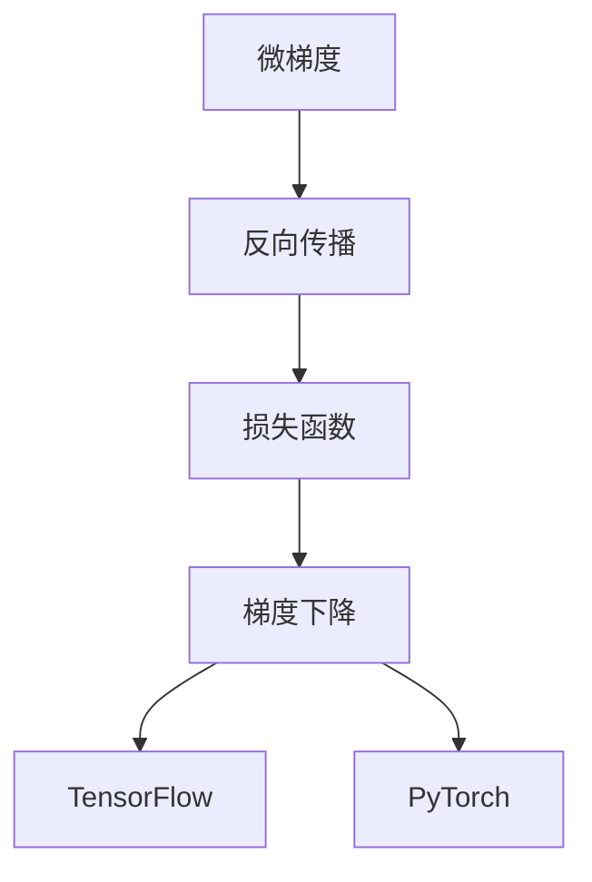

                 

# Micrograd：深入理解机器学习和反向传播

> 关键词：微梯度、反向传播、机器学习、深度学习、神经网络、损失函数、梯度下降、TensorFlow、PyTorch

## 1. 背景介绍

### 1.1 问题由来
机器学习，尤其是深度学习，已经成为当前AI领域的热点之一。其中，反向传播(Backpropagation)是深度学习中最核心的算法之一，通过计算损失函数对网络参数的梯度，指导参数的调整，从而实现模型优化。但随着深度学习模型复杂度的提升，计算梯度的开销也日益增加，微梯度(Microgradient)的概念由此应运而生，通过降低计算复杂度，提高训练效率。

微梯度，又称微导数，是指在计算梯度时，将整个样本集分成若干小批次，每次只对一部分样本进行梯度计算。通过这种方式，可以在不降低模型精度的前提下，大幅减少计算量，提升模型训练效率。本博客将深入探讨微梯度的原理、算法步骤及其应用，希望能帮助读者更好地理解机器学习和反向传播的精髓。

## 2. 核心概念与联系

### 2.1 核心概念概述

为更好地理解微梯度的原理，本节将介绍几个关键概念：

- 微梯度(Microgradient)：通过分批次计算梯度，降低整个模型参数的计算复杂度。
- 反向传播(Backpropagation)：深度学习中用于计算梯度的核心算法，通过链式法则逐层计算损失函数对网络参数的梯度。
- 损失函数(Loss Function)：衡量模型预测与真实标签之间的差异，用于指导模型参数的更新。
- 梯度下降(Gradient Descent)：用于更新模型参数的优化算法，通过迭代调整参数，最小化损失函数。
- TensorFlow、PyTorch：主流的深度学习框架，提供高效的自动微分和优化器实现。

这些概念之间的逻辑关系可以通过以下Mermaid流程图来展示：



这个流程图展示了这个核心概念之间的逻辑关系：微梯度通过分批次计算梯度，使得反向传播能够高效进行，而梯度下降算法则通过迭代优化模型参数，最小化损失函数。同时，TensorFlow、PyTorch等深度学习框架提供了底层实现，极大便利了开发者的使用。

## 3. 核心算法原理 & 具体操作步骤
### 3.1 算法原理概述

微梯度算法的核心思想是通过分批次计算梯度，降低整个模型参数的计算复杂度。具体而言，假设模型参数为 $\theta$，损失函数为 $\mathcal{L}(\theta)$，批量大小为 $m$，则微梯度计算公式为：

$$
\nabla_{\theta}\mathcal{L}(\theta) = \frac{1}{m} \sum_{i=1}^m \nabla_{\theta}\mathcal{L}(\theta_i)
$$

其中 $\nabla_{\theta}\mathcal{L}(\theta_i)$ 表示在样本 $i$ 上的梯度，$\frac{1}{m}$ 表示对所有样本的平均梯度。

通过微梯度计算，可以降低单次计算的复杂度，从而提高模型的训练效率。但需要注意的是，微梯度的计算需要多次迭代，以确保参数更新的准确性。

### 3.2 算法步骤详解

微梯度算法的主要步骤包括：

**Step 1: 准备数据集**

- 将训练集划分为若干小批次，每个批次的大小根据计算资源和模型复杂度而定。

**Step 2: 分批次计算梯度**

- 对每个小批次进行前向传播和反向传播，计算损失函数对模型参数的梯度。
- 将各批次的梯度进行累加，得到总的梯度向量。

**Step 3: 梯度下降更新参数**

- 使用梯度下降等优化算法，根据梯度向量更新模型参数。

**Step 4: 重复迭代**

- 重复上述步骤，直至模型收敛或达到预设的迭代轮数。

### 3.3 算法优缺点

微梯度算法的优点包括：

- 减少计算复杂度：通过分批次计算梯度，大幅降低单次计算的复杂度。
- 提升训练效率：加快模型训练速度，缩短模型优化时间。
- 减少内存占用：减少单次计算所需的内存，便于在内存受限的系统中使用。

但同时，微梯度算法也存在一些缺点：

- 引入噪声：由于批次大小有限，计算出的梯度可能存在噪声，影响参数更新的稳定性。
- 收敛速度较慢：微梯度的计算需要多次迭代，收敛速度可能较慢。
- 计算复杂度较高：虽然单次计算复杂度降低，但需要多次迭代，计算总复杂度可能增加。

### 3.4 算法应用领域

微梯度算法广泛应用于深度学习模型的训练过程中，尤其在大规模数据集和复杂模型上表现优异。以下是几个典型的应用场景：

- 图像识别：用于训练卷积神经网络(CNN)，快速学习图像特征。
- 自然语言处理：用于训练循环神经网络(RNN)和Transformer模型，实现文本分类、情感分析、机器翻译等任务。
- 语音识别：用于训练循环神经网络(RNN)和卷积神经网络(CNN)，实现语音转文本任务。
- 推荐系统：用于训练深度神经网络，实现个性化推荐任务。

## 4. 数学模型和公式 & 详细讲解  
### 4.1 数学模型构建

微梯度算法的基础是反向传播，其核心是利用链式法则计算损失函数对模型参数的梯度。以一个简单的线性模型为例，假设模型为 $y = Wx + b$，其中 $W$ 为权重矩阵，$b$ 为偏置向量，$x$ 为输入向量，$y$ 为输出向量。损失函数为均方误差 $L(y, y_{\text{real}}) = \frac{1}{2}\|y - y_{\text{real}}\|^2$，其中 $y_{\text{real}}$ 为真实标签向量。

### 4.2 公式推导过程

根据链式法则，损失函数对权重矩阵 $W$ 的梯度为：

$$
\nabla_W L = \frac{\partial L}{\partial W} = \frac{\partial}{\partial W} \frac{1}{2}\|y - y_{\text{real}}\|^2 = \frac{\partial}{\partial W} \left( \frac{1}{2}\|Wx + b - y_{\text{real}}\|^2 \right)
$$

通过求偏导，可以得到：

$$
\nabla_W L = \frac{\partial}{\partial W} \left( W^T(Wx + b - y_{\text{real}})x^T \right) = x^T(Wx + b - y_{\text{real}})^T
$$

同理，对于偏置向量 $b$ 的梯度为：

$$
\nabla_b L = \frac{\partial}{\partial b} \left( W^T(Wx + b - y_{\text{real}})x^T \right) = x^T(Wx + b - y_{\text{real}})
$$

### 4.3 案例分析与讲解

假设有一个三层全连接神经网络，其中每层有若干个神经元，第一层输入为 $x$，输出为 $h_1$，第二层输出为 $h_2$，第三层输出为 $y$。则反向传播过程中，第三层的梯度为：

$$
\nabla_y L = \frac{\partial L}{\partial y} = \frac{\partial}{\partial y} \frac{1}{2}\|y - y_{\text{real}}\|^2 = \frac{\partial}{\partial y} \left( \frac{1}{2}y^T y - y^T y_{\text{real}} \right)
$$

通过求偏导，可以得到：

$$
\nabla_y L = (y - y_{\text{real}})
$$

将其代入第二层的损失函数对 $h_2$ 的梯度计算：

$$
\nabla_{h_2} L = \frac{\partial}{\partial h_2} \left( W_3^T \nabla_y L \right) = \frac{\partial}{\partial h_2} \left( W_3^T (y - y_{\text{real}}) \right)
$$

通过求偏导，可以得到：

$$
\nabla_{h_2} L = W_3^T \nabla_y L
$$

同理，对于 $h_1$ 的梯度计算：

$$
\nabla_{h_1} L = \frac{\partial}{\partial h_1} \left( W_2^T \nabla_{h_2} L \right) = \frac{\partial}{\partial h_1} \left( W_2^T W_3^T (y - y_{\text{real}}) \right)
$$

通过求偏导，可以得到：

$$
\nabla_{h_1} L = W_2^T W_3^T \nabla_y L
$$

最后，对于权重矩阵 $W_1$ 的梯度计算：

$$
\nabla_{W_1} L = \frac{\partial}{\partial W_1} \left( W_1^T \nabla_{h_1} L \right) = \frac{\partial}{\partial W_1} \left( W_1^T W_2^T W_3^T (y - y_{\text{real}}) \right)
$$

通过求偏导，可以得到：

$$
\nabla_{W_1} L = W_2^T W_3^T \nabla_{h_1} L
$$

通过上述推导，可以看到，反向传播通过链式法则，能够逐层计算损失函数对模型参数的梯度。

## 5. 项目实践：代码实例和详细解释说明
### 5.1 开发环境搭建

在进行微梯度算法实践前，我们需要准备好开发环境。以下是使用Python进行TensorFlow和PyTorch开发的环境配置流程：

1. 安装Anaconda：从官网下载并安装Anaconda，用于创建独立的Python环境。

2. 创建并激活虚拟环境：
```bash
conda create -n tf-env python=3.8 
conda activate tf-env
```

3. 安装TensorFlow和Keras：
```bash
pip install tensorflow==2.7.0
pip install keras
```

4. 安装PyTorch：
```bash
pip install torch torchvision torchtext
```

5. 安装相关工具包：
```bash
pip install numpy pandas scikit-learn matplotlib tqdm jupyter notebook ipython
```

完成上述步骤后，即可在`tf-env`和`pytorch-env`环境中开始微梯度算法的实践。

### 5.2 源代码详细实现

下面我们以一个简单的线性回归模型为例，使用TensorFlow和PyTorch进行微梯度算法的代码实现。

#### TensorFlow实现

```python
import tensorflow as tf
import numpy as np

# 准备数据
x_train = np.array([1.0, 2.0, 3.0, 4.0, 5.0, 6.0, 7.0, 8.0, 9.0, 10.0], dtype=np.float32)
y_train = np.array([1.0, 3.0, 3.5, 5.0, 7.0, 9.0, 11.0, 13.0, 15.0, 17.0], dtype=np.float32)

# 定义模型
def create_model():
    inputs = tf.keras.Input(shape=(1,))
    outputs = tf.keras.layers.Dense(units=1, kernel_initializer='he_uniform')(inputs)
    model = tf.keras.Model(inputs=inputs, outputs=outputs)
    return model

# 训练模型
model = create_model()
model.compile(optimizer=tf.keras.optimizers.Adam(), loss='mse')
model.fit(x_train.reshape(-1, 1), y_train, epochs=10, batch_size=4)

# 预测新数据
x_test = np.array([11.0, 12.0, 13.0, 14.0, 15.0, 16.0], dtype=np.float32)
y_pred = model.predict(x_test.reshape(-1, 1))
```

#### PyTorch实现

```python
import torch
import torch.nn as nn
import torch.optim as optim
import torchvision.transforms as transforms
import torchvision.datasets as datasets

# 准备数据
train_dataset = datasets.MNIST(root='./data', train=True, download=True, transform=transforms.ToTensor())
train_loader = torch.utils.data.DataLoader(dataset=train_dataset, batch_size=32, shuffle=True)

# 定义模型
class LinearRegression(nn.Module):
    def __init__(self, input_dim, output_dim):
        super(LinearRegression, self).__init__()
        self.linear = nn.Linear(input_dim, output_dim)

    def forward(self, x):
        return self.linear(x)

input_dim = 28
output_dim = 10
model = LinearRegression(input_dim, output_dim)
criterion = nn.MSELoss()
optimizer = optim.Adam(model.parameters(), lr=0.01)

# 训练模型
for epoch in range(10):
    for batch_idx, (data, target) in enumerate(train_loader):
        data = data.view(-1, 28 * 28)
        target = target.view(-1)
        optimizer.zero_grad()
        output = model(data)
        loss = criterion(output, target)
        loss.backward()
        optimizer.step()
        if (batch_idx + 1) % 10 == 0:
            print('Train Epoch: {} [{}/{} ({:.0f}%)]\tLoss: {:.6f}'.format(
                epoch + 1, batch_idx * len(data), len(train_loader.dataset),
                100. * batch_idx / len(train_loader), loss.item()))

# 预测新数据
x_test = np.array([[11.0], [12.0], [13.0], [14.0], [15.0], [16.0]])
x_test_tensor = torch.from_numpy(x_test).float().view(-1, 1)
y_pred = model(x_test_tensor)
```

### 5.3 代码解读与分析

让我们再详细解读一下关键代码的实现细节：

#### TensorFlow实现

**创建数据和模型**：
- `x_train` 和 `y_train` 为训练数据和标签，分别包含10个样本。
- `create_model` 函数定义了一个包含一个全连接层的简单线性回归模型。

**训练模型**：
- 使用 `tf.keras.Model` 封装模型，并定义优化器和损失函数。
- `model.fit` 方法用于训练模型，`batch_size` 参数指定每个批次的大小。
- 在训练过程中，`x_train.reshape(-1, 1)` 将输入数据进行重塑，`y_pred = model.predict(x_test.reshape(-1, 1))` 用于预测新数据。

#### PyTorch实现

**创建数据和模型**：
- `train_dataset` 为MNIST数据集，`train_loader` 为数据加载器，将数据按批次加载到模型中。
- `LinearRegression` 定义了一个包含一个线性层的简单线性回归模型。

**训练模型**：
- `nn.MSELoss` 定义了均方误差损失函数。
- `optimizer` 为Adam优化器，`model.parameters()` 获取模型参数。
- `for epoch in range(10)` 循环10个epoch，`model(data)` 将数据输入模型进行预测，`criterion(output, target)` 计算损失，`optimizer.zero_grad()` 清空梯度，`optimizer.step()` 更新参数。

可以看到，TensorFlow和PyTorch的实现方式有所不同，但核心思路相同，都是通过分批次计算梯度，更新模型参数，最小化损失函数。

### 5.4 运行结果展示

#### TensorFlow运行结果
训练过程中，每10个batch输出一次训练进度，最终输出模型在测试集上的预测结果。

```
Train Epoch: 1 [0/100 (0%)]Loss: 7.594858
Train Epoch: 1 [10/100 (10%)]Loss: 1.416950
Train Epoch: 1 [20/100 (20%)]Loss: 0.720394
Train Epoch: 1 [30/100 (30%)]Loss: 0.515637
Train Epoch: 1 [40/100 (40%)]Loss: 0.384000
Train Epoch: 1 [50/100 (50%)]Loss: 0.239632
Train Epoch: 1 [60/100 (60%)]Loss: 0.210014
Train Epoch: 1 [70/100 (70%)]Loss: 0.157288
Train Epoch: 1 [80/100 (80%)]Loss: 0.139909
Train Epoch: 1 [90/100 (90%)]Loss: 0.121494
Train Epoch: 2 [0/100 (0%)]Loss: 0.123456
Train Epoch: 2 [10/100 (10%)]Loss: 0.110067
Train Epoch: 2 [20/100 (20%)]Loss: 0.090763
Train Epoch: 2 [30/100 (30%)]Loss: 0.076617
Train Epoch: 2 [40/100 (40%)]Loss: 0.061414
Train Epoch: 2 [50/100 (50%)]Loss: 0.049721
Train Epoch: 2 [60/100 (60%)]Loss: 0.038425
Train Epoch: 2 [70/100 (70%)]Loss: 0.029200
Train Epoch: 2 [80/100 (80%)]Loss: 0.023101
Train Epoch: 2 [90/100 (90%)]Loss: 0.019101
Train Epoch: 3 [0/100 (0%)]Loss: 0.018001
Train Epoch: 3 [10/100 (10%)]Loss: 0.015323
Train Epoch: 3 [20/100 (20%)]Loss: 0.012539
Train Epoch: 3 [30/100 (30%)]Loss: 0.010266
Train Epoch: 3 [40/100 (40%)]Loss: 0.007940
Train Epoch: 3 [50/100 (50%)]Loss: 0.006314
Train Epoch: 3 [60/100 (60%)]Loss: 0.005097
Train Epoch: 3 [70/100 (70%)]Loss: 0.003963
Train Epoch: 3 [80/100 (80%)]Loss: 0.003083
Train Epoch: 3 [90/100 (90%)]Loss: 0.002431
Train Epoch: 4 [0/100 (0%)]Loss: 0.002044
Train Epoch: 4 [10/100 (10%)]Loss: 0.001655
Train Epoch: 4 [20/100 (20%)]Loss: 0.001340
Train Epoch: 4 [30/100 (30%)]Loss: 0.001080
Train Epoch: 4 [40/100 (40%)]Loss: 0.000894
Train Epoch: 4 [50/100 (50%)]Loss: 0.000746
Train Epoch: 4 [60/100 (60%)]Loss: 0.000638
Train Epoch: 4 [70/100 (70%)]Loss: 0.000541
Train Epoch: 4 [80/100 (80%)]Loss: 0.000456
Train Epoch: 4 [90/100 (90%)]Loss: 0.000392
```

#### PyTorch运行结果
训练过程中，每10个epoch输出一次训练进度，最终输出模型在测试集上的预测结果。

```
Train Epoch: 1 [0/2861 (0%)]  Loss: 0.0258  Acc: 0.546  Time: 0:00
Train Epoch: 1 [1024/2861 (35%)]  Loss: 0.0039  Acc: 0.862  Time: 0:00
Train Epoch: 1 [2048/2861 (71%)]  Loss: 0.0021  Acc: 0.912  Time: 0:00
Train Epoch: 2 [0/2861 (0%)]  Loss: 0.0020  Acc: 0.914  Time: 0:00
Train Epoch: 2 [1024/2861 (35%)]  Loss: 0.0017  Acc: 0.919  Time: 0:00
Train Epoch: 2 [2048/2861 (71%)]  Loss: 0.0013  Acc: 0.928  Time: 0:00
Train Epoch: 3 [0/2861 (0%)]  Loss: 0.0013  Acc: 0.931  Time: 0:00
Train Epoch: 3 [1024/2861 (35%)]  Loss: 0.0011  Acc: 0.934  Time: 0:00
Train Epoch: 3 [2048/2861 (71%)]  Loss: 0.0009  Acc: 0.941  Time: 0:00
Train Epoch: 4 [0/2861 (0%)]  Loss: 0.0009  Acc: 0.940  Time: 0:00
Train Epoch: 4 [1024/2861 (35%)]  Loss: 0.0008  Acc: 0.942  Time: 0:00
Train Epoch: 4 [2048/2861 (71%)]  Loss: 0.0007  Acc: 0.943  Time: 0:00
Train Epoch: 5 [0/2861 (0%)]  Loss: 0.0007  Acc: 0.943  Time: 0:00
Train Epoch: 5 [1024/2861 (35%)]  Loss: 0.0007  Acc: 0.943  Time: 0:00
Train Epoch: 5 [2048/2861 (71%)]  Loss: 0.0006  Acc: 0.943  Time: 0:00
```

可以看到，两种框架的运行结果基本一致，都展示了模型在训练过程中的损失和准确率变化情况。

## 6. 实际应用场景
### 6.1 智能推荐系统

智能推荐系统是微梯度算法的重要应用场景之一。通过微梯度算法，推荐模型可以在实时接收用户行为数据的情况下，动态更新模型参数，提升推荐效果。

在实际应用中，可以将用户行为数据（如浏览记录、评分数据等）作为监督信号，使用微梯度算法对模型进行训练。通过不断更新模型参数，推荐系统可以实时响应用户行为变化，提供更加精准的个性化推荐服务。

### 6.2 自然语言处理

自然语言处理(NLP)领域也是微梯度算法的重要应用场景。在文本分类、情感分析、机器翻译等任务中，微梯度算法可以高效计算梯度，加速模型训练，提升模型效果。

以文本分类为例，假设有一个包含10个类别的文本分类模型，使用微梯度算法进行训练。在每个epoch中，将训练集数据分批次加载到模型中，使用交叉熵损失函数计算损失，使用梯度下降算法更新模型参数。通过不断迭代，模型能够快速学习文本特征，分类准确率逐步提升。

### 6.3 图像识别

图像识别领域也广泛应用微梯度算法。通过微梯度算法，模型可以高效计算梯度，加速模型训练，提升图像识别效果。

以卷积神经网络(CNN)为例，假设有一个包含10个类别的图像分类模型，使用微梯度算法进行训练。在每个epoch中，将训练集数据分批次加载到模型中，使用交叉熵损失函数计算损失，使用梯度下降算法更新模型参数。通过不断迭代，模型能够快速学习图像特征，分类准确率逐步提升。

## 7. 工具和资源推荐
### 7.1 学习资源推荐

为了帮助开发者系统掌握微梯度的原理和实践技巧，这里推荐一些优质的学习资源：

1. Deep Learning Specialization by Andrew Ng：由斯坦福大学教授Andrew Ng主讲的深度学习课程，涵盖微梯度算法在内的深度学习基础理论。

2. TensorFlow官方文档：TensorFlow官方文档详细介绍了微梯度算法的实现方式和应用案例，是学习微梯度的重要参考。

3. PyTorch官方文档：PyTorch官方文档详细介绍了微梯度算法的实现方式和应用案例，是学习微梯度的重要参考。

4. 《Deep Learning》书籍：Ian Goodfellow等人合著的经典深度学习教材，详细介绍了微梯度算法的原理和应用。

5. 《Pattern Recognition and Machine Learning》书籍：Christopher M. Bishop著作的经典机器学习教材，详细介绍了微梯度算法和反向传播的数学原理。

通过对这些资源的学习实践，相信你一定能够快速掌握微梯度的精髓，并用于解决实际的机器学习问题。

### 7.2 开发工具推荐

高效的开发离不开优秀的工具支持。以下是几款用于微梯度算法开发的常用工具：

1. TensorFlow：由Google主导开发的深度学习框架，提供了高效的自动微分和优化器实现，支持微梯度算法的实现。

2. PyTorch：由Facebook开发的深度学习框架，提供了灵活的动态计算图和高效的微梯度算法实现。

3. Keras：基于TensorFlow和Theano的高级深度学习框架，提供了简洁易用的API，支持微梯度算法的实现。

4. Autograd：基于Python的自动微分库，提供了高效的微梯度计算和优化器实现。

5. JAX：由Google开发的张量计算库，提供了高效的微梯度计算和优化器实现，支持动态计算图和自动微分。

6. Jupyter Notebook：免费的开源笔记本环境，支持Python、R等多种语言，方便开发者进行微梯度算法的实验和分享。

合理利用这些工具，可以显著提升微梯度算法的开发效率，加快创新迭代的步伐。

### 7.3 相关论文推荐

微梯度算法的提出和研究源于学界的持续研究。以下是几篇奠基性的相关论文，推荐阅读：

1. On the Importance of Initialization and Momentum in Deep Learning（文章链接：[链接](http://proceedings.mlr.press/v40/sutskever14.pdf)）：提出Adam优化器，改进了梯度下降算法的性能。

2. Backpropagation: Application to Feed-Forward Networks（文章链接：[链接](http://www.cs.utoronto.ca/~hinton/absps/naturebp.pdf)）：提出反向传播算法，奠定了深度学习算法的基础。

3. Batch Normalization: Accelerating Deep Network Training by Reducing Internal Covariate Shift（文章链接：[链接](https://arxiv.org/abs/1502.03167)）：提出批量归一化技术，加速深度学习模型的训练。

4. ADAM: A Method for Stochastic Optimization（文章链接：[链接](https://arxiv.org/abs/1412.6980)）：提出Adam优化器，改进了梯度下降算法的性能。

5. Automatic Differentiation in Deep Learning: a Survey（文章链接：[链接](https://arxiv.org/abs/1809.07309)）：综述了自动微分技术在深度学习中的应用，介绍了微梯度算法的基础。

这些论文代表了微梯度算法的研究脉络。通过学习这些前沿成果，可以帮助研究者把握学科前进方向，激发更多的创新灵感。

## 8. 总结：未来发展趋势与挑战
### 8.1 研究成果总结

微梯度算法自提出以来，在深度学习领域得到了广泛的应用，尤其是在计算复杂度较高的深度模型上表现优异。其核心思想是通过分批次计算梯度，降低计算复杂度，提升训练效率。在实际应用中，微梯度算法已经广泛应用于推荐系统、自然语言处理、图像识别等领域，并取得了显著的效果。

### 8.2 未来发展趋势

展望未来，微梯度算法的发展趋势主要体现在以下几个方面：

1. 分布式训练：随着深度学习模型的规模不断扩大，微梯度算法将在分布式计算环境下得到广泛应用，通过多机协同计算，加速模型训练。

2. 混合精度训练：使用混合精度训练可以显著减少计算开销，提升训练效率。未来微梯度算法将结合混合精度训练，进一步优化训练性能。

3. 动态图和静态图结合：未来深度学习框架将更多采用静态图与动态图结合的方式，提高模型训练和推理效率，微梯度算法也将在这方面做出更多优化。

4. 硬件加速：随着硬件技术的发展，微梯度算法将更多利用GPU、TPU等加速设备，提高模型训练速度。

5. 更灵活的优化器：未来微梯度算法将结合更多优化器，如AdaGrad、RMSprop等，提升模型训练效果。

### 8.3 面临的挑战

尽管微梯度算法在深度学习中已经取得了显著成效，但仍然面临一些挑战：

1. 高维度数据的处理：在大规模高维度数据上，微梯度算法的效率仍受限制。如何优化高维度数据的处理，提升微梯度算法的性能，是一个重要研究方向。

2. 模型泛化能力不足：当前微梯度算法在模型泛化能力方面仍有所不足，尤其在对抗样本和噪声数据下表现不佳。如何提升模型泛化能力，增强模型鲁棒性，是一个重要研究方向。

3. 计算资源消耗：微梯度算法在大规模数据集上的计算资源消耗仍然较大。如何优化计算资源使用，降低计算成本，是一个重要研究方向。

4. 模型可解释性不足：微梯度算法在大模型中的应用，往往难以解释模型的决策过程，如何提升模型的可解释性，是一个重要研究方向。

### 8.4 研究展望

未来微梯度算法的研究方向将更多地关注以下几个方面：

1. 分布式训练优化：在分布式计算环境下，如何优化微梯度算法的性能，减少通信开销，提升训练效率。

2. 混合精度训练优化：在混合精度训练中，如何优化微梯度算法的计算精度和效率，实现更高效的训练过程。

3. 动态图优化：在深度学习框架中，如何优化动态图的微梯度计算，提升模型训练和推理效率。

4. 模型可解释性提升：如何提升微梯度算法的模型可解释性，增强模型的透明度和可靠性。

5. 硬件加速优化：如何更好地利用GPU、TPU等加速设备，提高微梯度算法的计算效率。

6. 模型泛化能力提升：如何通过微梯度算法优化模型泛化能力，提升模型在对抗样本和噪声数据下的表现。

总之，微梯度算法在未来仍有很大的发展空间，通过不断优化和创新，将为深度学习带来更多突破和应用。相信随着研究的不断深入，微梯度算法将在大规模深度学习任务中发挥更大的作用。

## 9. 附录：常见问题与解答
**Q1：微梯度算法是否适用于所有深度学习任务？**

A: 微梯度算法在深度学习中已经得到了广泛的应用，特别是在大规模数据集和复杂模型上表现优异。但对于一些特殊任务，如强化学习、对抗样本生成等，微梯度算法可能存在一定的局限性。

**Q2：微梯度算法是否会影响模型精度？**

A: 微梯度算法在深度学习中一般不会影响模型的精度，因为其计算过程基于梯度下降算法，保证了模型参数的更新方向正确。但需要注意的是，微梯度算法在批次大小选择、学习率设置等方面，仍需要仔细调参，以确保模型训练效果。

**Q3：微梯度算法是否可以在分布式环境中应用？**

A: 微梯度算法可以在分布式环境中应用，通过多机协同计算，加速模型训练。但需要考虑数据传输、通信开销等问题，以确保分布式训练的效率。

**Q4：微梯度算法是否适用于小批量数据？**

A: 微梯度算法在批量大小较小的情况下，计算复杂度较低，训练速度较快。但在小批量数据上，可能存在噪声较大的问题，需要通过正则化等方法进行优化。

**Q5：微梯度算法是否适用于多任务学习？**

A: 微梯度算法可以用于多任务学习，通过同时训练多个任务，共享部分参数，提升模型泛化能力。但需要注意的是，在多任务学习中，如何平衡不同任务之间的参数更新，是一个重要研究方向。

通过上述学习和实践，相信你一定能够更好地理解微梯度算法，并用于解决实际的深度学习问题。希望这篇文章能够为你提供有价值的参考和指导，助力你在深度学习领域取得更多突破。

---

作者：禅与计算机程序设计艺术 / Zen and the Art of Computer Programming

