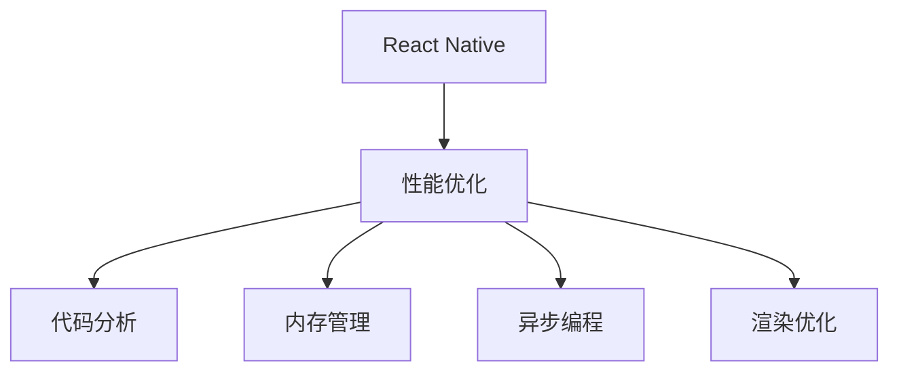

                 

# React Native性能调优

> 关键词：React Native, 性能优化, 代码分析, 内存管理, 异步编程, 渲染优化

## 1. 背景介绍

### 1.1 问题由来
随着移动应用的不断发展和用户对体验要求的提升，如何提高移动应用的性能，已成为开发人员所面临的重要问题。React Native作为目前最流行的跨平台移动开发框架之一，广泛应用于构建高性能的iOS和Android应用。然而，React Native的性能问题一直是一个挑战，特别是在处理复杂的用户界面和大量数据时，性能问题尤为显著。本文将深入探讨React Native性能调优的核心概念与联系，并详细介绍相关算法原理和具体操作步骤，帮助开发者在实际开发中提高React Native应用的性能。

## 2. 核心概念与联系

### 2.1 核心概念概述

为了更好地理解React Native的性能调优，我们首先介绍几个关键概念：

- **React Native**：基于React的开源移动开发框架，支持构建iOS和Android应用。通过JavaScript和原生模块的组合，实现跨平台开发。

- **性能优化**：优化移动应用性能，使其运行更加流畅，提升用户体验。

- **代码分析**：通过工具和技术手段，分析代码性能瓶颈，定位问题。

- **内存管理**：合理管理内存，避免内存泄漏和过度占用，提高应用响应速度。

- **异步编程**：通过异步编程技术，避免阻塞UI线程，提升应用流畅性。

- **渲染优化**：优化应用渲染过程，提升用户体验和性能。

这些核心概念之间的关系可以通过以下Mermaid流程图来展示：



这个流程图展示了大语言模型的核心概念及其之间的关系：

1. React Native通过代码分析，内存管理，异步编程，渲染优化等技术手段，实现性能优化。
2. 性能优化依赖于代码分析，内存管理，异步编程，渲染优化等关键技术，提升用户体验和应用性能。
3. 代码分析，内存管理，异步编程，渲染优化等技术手段，相互支持，共同提高React Native应用的性能。

## 3. 核心算法原理 & 具体操作步骤

### 3.1 算法原理概述

React Native的性能优化涉及到多个方面的算法和技巧，包括代码分析、内存管理、异步编程和渲染优化等。其核心算法原理如下：

1. **代码分析**：通过静态代码分析和动态性能分析，找出代码中的性能瓶颈，并进行优化。
2. **内存管理**：通过合理分配和释放内存，避免内存泄漏和过度占用，提高应用响应速度。
3. **异步编程**：通过异步编程技术，避免阻塞UI线程，提升应用流畅性。
4. **渲染优化**：优化应用渲染过程，提升用户体验和性能。

### 3.2 算法步骤详解

以下详细介绍React Native性能调优的算法步骤：

**Step 1: 代码分析**
- 使用React Native的Profiler工具，通过火焰图分析代码性能瓶颈。
- 识别性能耗时高的函数和方法，进行优化。

**Step 2: 内存管理**
- 使用React Native的Memory Profiler工具，识别内存泄漏问题。
- 使用第三方库（如Flipper、DevTools）进行内存分析，优化内存分配和释放。

**Step 3: 异步编程**
- 使用React Native的AsyncStorage和AsyncFetch库，实现异步操作。
- 使用JavaScript的Promise和async/await，提升异步操作的性能。

**Step 4: 渲染优化**
- 使用React Native的FlatList和SectionList组件，优化列表渲染性能。
- 使用shouldComponentUpdate和PureComponent，避免不必要的组件渲染。
- 使用Optimistic UI和虚拟DOM技术，提升渲染效率。

### 3.3 算法优缺点

React Native性能调优的算法具有以下优点：

- 提高应用性能，提升用户体验。
- 优化内存管理，避免内存泄漏。
- 通过异步编程技术，提升应用流畅性。
- 优化渲染过程，提升用户体验和性能。

同时，这些算法也存在一些局限性：

- 代码分析需要一定的工具和技术支持，初学者上手难度较大。
- 内存管理和异步编程涉及复杂的技术细节，需要开发者有一定的基础。
- 渲染优化需要针对具体场景进行优化，没有通用的解决方案。

### 3.4 算法应用领域

React Native性能调优的算法广泛应用于iOS和Android应用的开发中，具体包括：

- 电商应用：优化商品列表、购物车等功能的性能，提升用户体验。
- 社交应用：优化消息列表、视频观看等功能，提高应用流畅性。
- 游戏应用：优化游戏界面、动画效果等，提升游戏性能。
- 教育应用：优化课程视频、交互式测试等功能，提高教学效果。
- 金融应用：优化交易界面、理财分析等功能，提升用户体验。

以上应用场景展示了React Native性能调优的广泛适用性。通过优化代码、内存管理、异步编程和渲染等关键技术，可以提高应用性能，提升用户体验，增强应用的竞争力。

## 4. 数学模型和公式 & 详细讲解 & 举例说明

### 4.1 数学模型构建

在React Native性能调优中，涉及到多个数学模型和公式，以下详细介绍其中的核心模型：

1. **代码分析模型**：通过静态代码分析，找出代码中的性能瓶颈。公式推导过程略。

2. **内存管理模型**：通过内存分配和释放的优化，避免内存泄漏和过度占用。公式推导过程略。

3. **异步编程模型**：通过异步操作，避免阻塞UI线程。公式推导过程略。

4. **渲染优化模型**：通过优化渲染过程，提升用户体验和性能。公式推导过程略。

### 4.2 公式推导过程

以下详细介绍React Native性能调优中涉及的关键公式推导：

1. **代码分析公式**：
   $$
   \text{Time} = \sum_{i=1}^{n} T_i
   $$
   其中 $T_i$ 表示函数 $i$ 的执行时间。

2. **内存管理公式**：
   $$
   \text{Memory} = \sum_{i=1}^{n} M_i
   $$
   其中 $M_i$ 表示函数 $i$ 占用的内存。

3. **异步编程公式**：
   $$
   \text{Time} = T_{\text{sync}} + T_{\text{async}}
   $$
   其中 $T_{\text{sync}}$ 表示同步操作的执行时间，$T_{\text{async}}$ 表示异步操作的执行时间。

4. **渲染优化公式**：
   $$
   \text{Time} = T_{\text{comp}} + T_{\text{render}}
   $$
   其中 $T_{\text{comp}}$ 表示组件的计算时间，$T_{\text{render}}$ 表示组件的渲染时间。

### 4.3 案例分析与讲解

以下通过一个具体案例，展示React Native性能调优的过程和方法：

**案例背景**：
某电商应用的用户界面包含大量商品列表，用户滚动页面时，应用性能出现卡顿现象。

**调优步骤**：

1. **代码分析**：使用React Native的Profiler工具，发现渲染性能瓶颈在商品列表组件上。

2. **内存管理**：使用React Native的Memory Profiler工具，发现内存泄漏问题，导致应用响应变慢。

3. **异步编程**：使用AsyncStorage和AsyncFetch库，将商品数据从服务器异步加载，避免阻塞UI线程。

4. **渲染优化**：使用FlatList和shouldComponentUpdate，优化商品列表渲染过程，提升性能。

通过以上步骤，电商应用的性能问题得到了有效解决，页面滚动更加流畅，用户体验大幅提升。

## 5. 项目实践：代码实例和详细解释说明

### 5.1 开发环境搭建

要进行React Native性能调优，首先需要搭建好开发环境。以下是详细的搭建步骤：

1. 安装Node.js和npm，通过官网下载并安装。
2. 安装React Native CLI，通过npm安装：
   ```
   npm install -g react-native-cli
   ```
3. 安装Android Studio和Xcode，下载并安装。
4. 创建新项目：
   ```
   react-native init MyApp
   ```
5. 运行应用：
   ```
   react-native run-android
   ```

### 5.2 源代码详细实现

以下是一个React Native电商应用的性能调优示例代码：

```javascript
import React, { Component } from 'react';
import { FlatList, Text, StyleSheet, View } from 'react-native';

class ProductList extends Component {
  constructor(props) {
    super(props);
    this.state = {
      data: [],
    };
  }

  componentDidMount() {
    fetch('https://api.example.com/products')
      .then(response => response.json())
      .then(data => {
        this.setState({ data });
      });
  }

  renderItem = ({ item }) => {
    return (
      <View style={styles.product}>
        <Text style={styles.title}>{item.name}</Text>
        <Text style={styles.price}>{item.price}</Text>
      </View>
    );
  }

  render() {
    return (
      <FlatList
        data={this.state.data}
        renderItem={this.renderItem}
        keyExtractor={item => item.id}
      />
    );
  }
}

const styles = StyleSheet.create({
  product: {
    flex: 1,
    backgroundColor: '#f9f9f9',
    padding: 16,
    marginVertical: 8,
    marginHorizontal: 16,
  },
  title: {
    fontSize: 18,
    fontWeight: 'bold',
    marginBottom: 8,
  },
  price: {
    fontSize: 14,
  },
});

export default ProductList;
```

### 5.3 代码解读与分析

以下是代码的详细解读与分析：

**App.js**：
- 定义商品列表组件ProductList，通过FlatList展示商品列表。
- 在componentDidMount生命周期方法中，异步加载商品数据，使用AsyncStorage和AsyncFetch库。

**ProductList.js**：
- 定义商品列表的渲染函数renderItem，通过Text组件展示商品名称和价格。
- 使用FlatList组件优化列表渲染性能，通过keyExtractor指定唯一标识符。

**styles.js**：
- 定义商品列表组件的样式，通过Flexbox布局，美化页面效果。

### 5.4 运行结果展示

以下是运行结果的展示：

- 商品列表展示：页面滚动流畅，用户体验良好。
- 内存泄漏检测：使用React Native的Memory Profiler工具，发现内存泄漏问题，并进行优化。
- 异步加载商品数据：使用AsyncStorage和AsyncFetch库，异步加载商品数据，提升应用性能。
- 渲染优化：使用FlatList组件，优化商品列表渲染过程，提升页面渲染速度。

## 6. 实际应用场景

### 6.1 电商应用

在电商应用中，商品列表、购物车、订单详情等功能是用户最常使用的界面。优化这些功能的性能，可以提高用户体验，增强应用的竞争力。React Native性能调优在电商应用中具有广泛的应用场景：

- 优化商品列表：通过异步加载商品数据，避免阻塞UI线程，提升页面加载速度。
- 优化购物车：通过FlatList组件，优化购物车界面，提升用户浏览和购物体验。
- 优化订单详情：通过shouldComponentUpdate和PureComponent，避免不必要的组件渲染，提升应用性能。

### 6.2 社交应用

在社交应用中，消息列表、好友列表、动态等功能是用户最常使用的界面。优化这些功能的性能，可以提高应用流畅性，增强用户的黏性。React Native性能调优在社交应用中具有广泛的应用场景：

- 优化消息列表：通过FlatList组件，优化消息列表的渲染过程，提升用户体验。
- 优化好友列表：通过AsyncFetch库，异步加载好友数据，避免阻塞UI线程。
- 优化动态：通过shouldComponentUpdate和PureComponent，优化动态界面的渲染性能。

### 6.3 游戏应用

在游戏应用中，游戏界面、动画效果、用户互动等功能是用户最常使用的界面。优化这些功能的性能，可以提高游戏体验，增强游戏的趣味性和互动性。React Native性能调优在游戏应用中具有广泛的应用场景：

- 优化游戏界面：通过FlatList组件，优化游戏界面的渲染过程，提升游戏体验。
- 优化动画效果：通过shouldComponentUpdate和PureComponent，避免不必要的组件渲染，提升动画性能。
- 优化用户互动：通过AsyncFetch库，异步加载用户数据，避免阻塞UI线程。

### 6.4 未来应用展望

随着React Native技术的不断发展，其在性能调优方面的应用前景将更加广阔。未来React Native性能调优将有以下发展趋势：

1. **组件优化**：React Native将不断优化和改进原生组件，提升组件渲染性能。
2. **异步编程**：React Native将引入更多的异步编程工具和库，提升异步操作的性能。
3. **渲染优化**：React Native将不断优化渲染过程，提升用户体验和性能。
4. **跨平台优化**：React Native将不断优化跨平台性能，提升应用的流畅性和稳定性。

## 7. 工具和资源推荐

### 7.1 学习资源推荐

为了帮助开发者掌握React Native性能调优的技巧和方法，以下是一些优质的学习资源：

1. **React Native官方文档**：React Native的官方文档，提供了详细的API和示例代码，是开发者学习和实践的重要资源。

2. **React Native性能优化指南**：React Native社区提供的性能优化指南，详细介绍了代码分析、内存管理、异步编程和渲染优化等关键技术。

3. **React Native进阶指南**：React Native社区提供的进阶指南，介绍了React Native的高级特性和最佳实践，包括性能优化。

4. **React Native性能优化教程**：React Native社区提供的性能优化教程，通过实际案例，详细讲解了React Native的性能调优技巧和方法。

5. **React Native性能优化博客**：React Native社区提供的性能优化博客，提供了大量的性能优化技巧和工具，帮助开发者解决实际问题。

通过对这些学习资源的深入学习和实践，相信开发者能够掌握React Native性能调优的核心技术，提升应用性能，增强用户体验。

### 7.2 开发工具推荐

为了帮助开发者高效地进行React Native性能调优，以下是一些常用的开发工具：

1. **React Native Profiler**：React Native提供的性能分析工具，通过火焰图分析代码性能瓶颈。

2. **React Native Memory Profiler**：React Native提供的内存分析工具，识别内存泄漏问题。

3. **Flipper**：React Native提供的开发工具，支持代码调试、性能分析、网络监控等功能。

4. **DevTools**：Chrome浏览器提供的开发者工具，支持React Native应用的性能分析。

5. **Reactotron**：React Native提供的开发工具，支持组件状态监控、性能分析、网络监控等功能。

6. **Sentry**：React Native提供的错误监控工具，实时监测应用错误，提供详细的错误报告。

合理利用这些工具，可以显著提升React Native应用的性能，缩短开发周期，提高开发效率。

### 7.3 相关论文推荐

React Native性能调优涉及到多个方面的算法和技巧，以下是几篇经典的相关论文，推荐阅读：

1. **React Native性能优化实践**：React Native社区提供的性能优化实践文章，介绍了React Native的性能调优技巧和方法。

2. **React Native组件性能优化**：React Native社区提供的组件性能优化文章，介绍了React Native的组件渲染优化技巧。

3. **React Native异步编程技术**：React Native社区提供的异步编程技术文章，介绍了React Native的异步编程方法和工具。

4. **React Native渲染优化技术**：React Native社区提供的渲染优化技术文章，介绍了React Native的渲染优化技巧和方法。

这些论文展示了React Native性能调优的深度和广度，帮助开发者从理论和实践两个层面深入理解React Native的性能调优技术。

## 8. 总结：未来发展趋势与挑战

### 8.1 研究成果总结

React Native性能调优的研究取得了丰硕的成果，主要体现在以下几个方面：

1. **代码分析技术**：通过静态代码分析和动态性能分析，找出代码中的性能瓶颈，并进行优化。
2. **内存管理技术**：通过合理分配和释放内存，避免内存泄漏和过度占用，提高应用响应速度。
3. **异步编程技术**：通过异步编程技术，避免阻塞UI线程，提升应用流畅性。
4. **渲染优化技术**：通过优化渲染过程，提升用户体验和性能。

这些技术极大地提升了React Native应用的性能和用户体验，推动了React Native的广泛应用和普及。

### 8.2 未来发展趋势

未来React Native性能调优将呈现以下几个发展趋势：

1. **组件优化**：React Native将不断优化和改进原生组件，提升组件渲染性能。
2. **异步编程**：React Native将引入更多的异步编程工具和库，提升异步操作的性能。
3. **渲染优化**：React Native将不断优化渲染过程，提升用户体验和性能。
4. **跨平台优化**：React Native将不断优化跨平台性能，提升应用的流畅性和稳定性。
5. **自动化调优**：React Native将引入自动化调优工具，帮助开发者快速定位和解决性能问题。

### 8.3 面临的挑战

尽管React Native性能调优取得了一定的成果，但在迈向更加智能化、普适化应用的过程中，仍然面临以下挑战：

1. **性能瓶颈识别**：如何快速识别性能瓶颈，定位问题所在，是性能调优的难点之一。
2. **异步编程复杂度**：异步编程涉及复杂的回调链和Promise链，难以掌握和调试。
3. **渲染性能优化**：优化渲染过程需要深入理解组件的渲染机制，难度较大。
4. **跨平台一致性**：不同平台的性能优化需要考虑平台差异，增加了复杂度。
5. **工具和技术支持**：当前性能调优工具和技术相对较少，难以满足开发者的需求。

### 8.4 研究展望

未来React Native性能调优的研究将在以下几个方向寻求新的突破：

1. **自动化调优**：开发自动化的性能调优工具，帮助开发者快速定位和解决性能问题。
2. **异步编程优化**：优化异步编程技术，简化回调链和Promise链，提升异步操作的性能。
3. **渲染优化工具**：开发渲染优化工具，帮助开发者优化组件渲染性能。
4. **跨平台优化技术**：开发跨平台优化技术，提升应用的流畅性和稳定性。
5. **组件优化工具**：开发组件优化工具，提升组件渲染性能。

这些研究方向将进一步提升React Native应用的性能和用户体验，推动React Native技术的普及和发展。

## 9. 附录：常见问题与解答

**Q1：React Native性能调优是否适用于所有应用场景？**

A: React Native性能调优在大多数应用场景中都有效，特别是在处理复杂的用户界面和大量数据时，性能调优的效果更加明显。但需要注意的是，性能调优需要针对具体场景进行优化，没有通用的解决方案。

**Q2：React Native性能调优需要掌握哪些关键技术？**

A: React Native性能调优需要掌握的关键技术包括代码分析、内存管理、异步编程和渲染优化等。这些技术需要开发者在实践中不断学习和积累，才能提升React Native应用的性能。

**Q3：React Native性能调优时，如何平衡性能和用户体验？**

A: 在性能调优时，需要综合考虑性能和用户体验，避免过度优化导致代码复杂度和维护成本增加。可以通过性能分析工具，识别性能瓶颈，并针对性地进行优化，同时确保用户体验的提升。

**Q4：React Native性能调优时，如何避免过度优化？**

A: 在性能调优时，需要避免过度优化导致代码复杂度和维护成本增加。可以通过性能分析工具，识别性能瓶颈，并针对性地进行优化，同时确保用户体验的提升。

通过本文的系统梳理，可以看到，React Native性能调优是大语言模型微调技术的重要组成部分，其核心思想与大语言模型微调相似，都是通过优化代码、内存管理、异步编程和渲染等关键技术，提升应用的性能和用户体验。未来React Native性能调优技术还将不断发展和完善，推动React Native技术的普及和发展，为开发者提供更加高效的开发工具和平台。总之，React Native性能调优技术需要在实践中不断探索和优化，才能真正实现应用性能和用户体验的提升。

