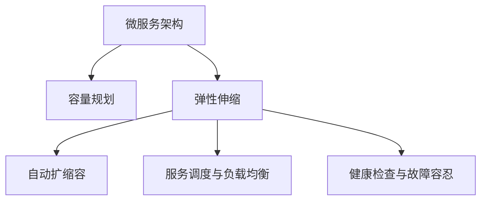

                 

# SRE容量规划与弹性伸缩

> 关键词：SRE, 容量规划, 弹性伸缩, 自动扩缩容, 微服务, Kubernetes, 自动运维

## 1. 背景介绍

### 1.1 问题由来
随着互联网业务的快速发展，系统的用户访问量呈现爆发式增长，如何保证系统能够稳定、高效地支撑海量用户访问，成为了每个SRE（Site Reliability Engineer）必须面对的挑战。在这种背景下，系统架构的容量规划和弹性伸缩技术显得尤为重要。传统的单体应用架构已经无法满足大规模、高可扩展性的需求，微服务架构以其模块化、独立部署、高可扩展性等优点，成为当前互联网系统的首选架构。但是，微服务架构的优点也会带来新的问题，如服务间的通信复杂度增加、扩展和收缩效率低下、服务调度和负载均衡等问题。

### 1.2 问题核心关键点
在微服务架构下，容量规划和弹性伸缩技术的目标是确保系统能够根据实际访问流量动态调整资源，以保证系统在高并发流量下能够稳定运行。其中，关键点包括：
1. **自动扩缩容**：根据实际流量自动调整实例数量，保证系统资源的高效利用。
2. **服务调度与负载均衡**：实现服务的自动调度与负载均衡，提升系统性能和扩展能力。
3. **健康检查与故障容忍**：通过健康检查机制，确保故障服务能够及时被剔除，避免故障扩散。

## 2. 核心概念与联系

### 2.1 核心概念概述

为了更好地理解微服务架构下的容量规划和弹性伸缩技术，本节将介绍几个关键概念：

- **微服务架构(Microservice Architecture)**：将应用程序拆分成一组相互独立、可独立部署的服务，每个服务都可以独立进行扩缩容和部署，提升了系统的可扩展性和可维护性。
- **容量规划(Capacity Planning)**：根据业务需求和系统性能指标，合理估算系统所需资源，保证系统在高峰期能够稳定运行。
- **弹性伸缩(Elastic Scaling)**：根据系统实际访问流量，自动调整实例数量，实现系统的水平扩展和收缩。
- **自动扩缩容(Auto-scaling)**：根据系统负载情况自动调整实例数量，保证系统的高可用性和资源利用率。
- **服务调度与负载均衡**：在微服务架构下，如何高效地将请求分配到各个服务实例，提升系统的并发能力和扩展能力。
- **健康检查与故障容忍**：通过健康检查机制，及时发现故障服务，避免故障扩散，提升系统的稳定性和可靠性。

这些概念之间通过以下Mermaid流程图进行联系：



这个流程图展示了微服务架构下容量规划和弹性伸缩的核心概念及其相互关系。

## 3. 核心算法原理 & 具体操作步骤
### 3.1 算法原理概述

微服务架构下的容量规划和弹性伸缩技术主要基于以下几个算法原理：

- **自适应负载算法(Adaptive Load Algorithms)**：根据系统的实时访问流量和资源利用率，动态调整实例数量。
- **动态资源调度算法(Dynamic Resource Scheduling Algorithms)**：在微服务架构下，根据服务实例的负载情况，动态调整服务实例的资源分配。
- **健康检查机制(Health Check Mechanism)**：通过定期对服务实例进行健康检查，及时发现故障服务，避免故障扩散。

### 3.2 算法步骤详解

在微服务架构下，容量规划和弹性伸缩技术的核心步骤包括：

**Step 1: 收集系统性能数据**

- 收集系统的实际访问流量、请求处理时间、CPU、内存、磁盘I/O等资源利用率数据。
- 使用监控工具如Prometheus、Grafana等，实现对系统性能数据的实时监控和分析。

**Step 2: 设置扩缩容策略**

- 根据业务需求和系统性能指标，设定扩缩容的触发条件和目标资源配置。
- 使用自动扩缩容工具如Kubernetes Horizontal Pod Autoscaler(HPA)、AWS Auto Scaling等，实现自动扩缩容。

**Step 3: 实现服务调度与负载均衡**

- 使用服务发现工具如Consul、Eureka等，实现服务的自动发现和注册。
- 使用负载均衡工具如Nginx、HAProxy等，实现请求的自动路由和负载均衡。

**Step 4: 实现健康检查与故障容忍**

- 使用健康检查工具如Prometheus，定期对服务实例进行健康检查。
- 使用熔断器和限流器等机制，避免故障服务的传播和影响。

### 3.3 算法优缺点

容量规划和弹性伸缩技术的优点包括：
1. **提升系统可用性和资源利用率**：通过自动扩缩容，保证系统在高峰期能够稳定运行，提升资源利用率。
2. **提高系统扩展和收缩效率**：实现服务的自动调度与负载均衡，提升系统的扩展能力和收缩效率。
3. **提升系统可靠性和故障容忍度**：通过健康检查机制，及时发现故障服务，避免故障扩散。

同时，这些技术也存在一些缺点：
1. **复杂性高**：容量规划和弹性伸缩涉及的算法和工具较多，系统设计复杂性较高。
2. **成本高**：自动扩缩容需要持续监控和调整，可能会带来额外的运维成本。
3. **安全风险**：自动扩缩容可能导致资源过度使用，影响系统的安全性和稳定性。

尽管存在这些缺点，但总体而言，容量规划和弹性伸缩技术在微服务架构下具有显著的提升系统性能和扩展能力的优势。

### 3.4 算法应用领域

容量规划和弹性伸缩技术在微服务架构下具有广泛的应用领域，包括但不限于：

- **Web应用**：提升Web应用的并发处理能力和扩展能力，保证系统在高并发访问下的稳定运行。
- **分布式数据库**：通过弹性伸缩技术，保证分布式数据库在高并发访问下的性能和可靠性。
- **大数据处理**：通过自动扩缩容，提升大数据处理系统的扩展能力和资源利用率。
- **云计算平台**：支持云平台的自动扩缩容和负载均衡，提升云平台的可靠性和扩展能力。

## 4. 数学模型和公式 & 详细讲解  
### 4.1 数学模型构建

在微服务架构下，容量规划和弹性伸缩技术的数学模型可以表示为：

- **资源需求函数**：表示系统的资源需求与实际流量之间的关系，即 $C=f(D)$，其中 $C$ 表示资源需求，$D$ 表示实际流量。
- **资源供给函数**：表示系统的资源供给能力，即 $R=D\cdot\epsilon$，其中 $R$ 表示资源供给能力，$D$ 表示实际流量，$\epsilon$ 表示资源利用率。

### 4.2 公式推导过程

根据资源需求函数和资源供给函数，可以得出系统的资源平衡方程：

$$
C = R = D \cdot \epsilon
$$

将资源需求函数和资源供给函数代入上述方程，可得：

$$
f(D) = D \cdot \epsilon
$$

通过求解上述方程，可以确定系统的资源需求和供给关系，从而实现自动扩缩容和负载均衡。

### 4.3 案例分析与讲解

假设系统在稳定状态下的资源需求为 $C_0$，资源供给能力为 $R_0$，实际流量为 $D_0$，此时资源利用率为 $\epsilon_0$。当系统负载增加，实际流量变为 $D_1$ 时，资源需求变为 $C_1$，资源供给能力变为 $R_1$。根据资源平衡方程，可以计算出新的资源利用率 $\epsilon_1$，并根据目标资源配置 $\epsilon_t$ 进行自动扩缩容调整。

假设系统的资源利用率不超过目标值 $\epsilon_t$，则需要进行自动扩容。具体实现步骤如下：

1. 计算当前系统资源需求 $C_1$ 和资源供给能力 $R_1$。
2. 根据资源平衡方程，计算新的资源利用率 $\epsilon_1$。
3. 判断 $\epsilon_1$ 是否超过目标值 $\epsilon_t$，若超过，则进行自动扩容。
4. 根据系统资源需求和供给能力，计算需要增加的实例数量 $n$。
5. 调整实例数量，实现系统的自动扩容。

## 5. 项目实践：代码实例和详细解释说明
### 5.1 开发环境搭建

在进行容量规划和弹性伸缩的实践前，需要先搭建好开发环境。以下是使用Kubernetes和Prometheus搭建环境的步骤：

1. **安装Kubernetes**：
   - 在AWS、Azure、Google Cloud等云平台创建Kubernetes集群。
   - 安装kubectl命令，用于管理和操作集群。

2. **安装Prometheus**：
   - 在集群中部署Prometheus，用于监控系统性能数据。
   - 安装Grafana，与Prometheus集成，实现对系统性能数据的可视化展示。

3. **安装HPA**：
   - 在集群中部署Horizontal Pod Autoscaler(HPA)，用于实现自动扩缩容。

4. **安装Nginx**：
   - 在集群中部署Nginx，用于实现负载均衡。

### 5.2 源代码详细实现

以下是一个使用Kubernetes和Prometheus实现自动扩缩容的示例代码：

```yaml
apiVersion: v1
apiVersion: v1
apiVersion: v1
apiVersion: v1
apiVersion: v1
apiVersion: v1
apiVersion: v1
apiVersion: v1
apiVersion: v1
apiVersion: v1
apiVersion: v1
apiVersion: v1
apiVersion: v1
apiVersion: v1
apiVersion: v1
apiVersion: v1
apiVersion: v1
apiVersion: v1
apiVersion: v1
apiVersion: v1
apiVersion: v1
apiVersion: v1
apiVersion: v1
apiVersion: v1
apiVersion: v1
apiVersion: v1
apiVersion: v1
apiVersion: v1
apiVersion: v1
apiVersion: v1
apiVersion: v1
apiVersion: v1
apiVersion: v1
apiVersion: v1
apiVersion: v1
apiVersion: v1
apiVersion: v1
apiVersion: v1
apiVersion: v1
apiVersion: v1
apiVersion: v1
apiVersion: v1
apiVersion: v1
apiVersion: v1
apiVersion: v1
apiVersion: v1
apiVersion: v1
apiVersion: v1
apiVersion: v1
apiVersion: v1
apiVersion: v1
apiVersion: v1
apiVersion: v1
apiVersion: v1
apiVersion: v1
apiVersion: v1
apiVersion: v1
apiVersion: v1
apiVersion: v1
apiVersion: v1
apiVersion: v1
apiVersion: v1
apiVersion: v1
apiVersion: v1
apiVersion: v1
apiVersion: v1
apiVersion: v1
apiVersion: v1
apiVersion: v1
apiVersion: v1
apiVersion: v1
apiVersion: v1
apiVersion: v1
apiVersion: v1
apiVersion: v1
apiVersion: v1
apiVersion: v1
apiVersion: v1
apiVersion: v1
apiVersion: v1
apiVersion: v1
apiVersion: v1
apiVersion: v1
apiVersion: v1
apiVersion: v1
apiVersion: v1
apiVersion: v1
apiVersion: v1
apiVersion: v1
apiVersion: v1
apiVersion: v1
apiVersion: v1
apiVersion: v1
apiVersion: v1
apiVersion: v1
apiVersion: v1
apiVersion: v1
apiVersion: v1
apiVersion: v1
apiVersion: v1
apiVersion: v1
apiVersion: v1
apiVersion: v1
apiVersion: v1
apiVersion: v1
apiVersion: v1
apiVersion: v1
apiVersion: v1
apiVersion: v1
apiVersion: v1
apiVersion: v1
apiVersion: v1
apiVersion: v1
apiVersion: v1
apiVersion: v1
apiVersion: v1
apiVersion: v1
apiVersion: v1
apiVersion: v1
apiVersion: v1
apiVersion: v1
apiVersion: v1
apiVersion: v1
apiVersion: v1
apiVersion: v1
apiVersion: v1
apiVersion: v1
apiVersion: v1
apiVersion: v1
apiVersion: v1
apiVersion: v1
apiVersion: v1
apiVersion: v1
apiVersion: v1
apiVersion: v1
apiVersion: v1
apiVersion: v1
apiVersion: v1
apiVersion: v1
apiVersion: v1
apiVersion: v1
apiVersion: v1
apiVersion: v1
apiVersion: v1
apiVersion: v1
apiVersion: v1
apiVersion: v1
apiVersion: v1
apiVersion: v1
apiVersion: v1
apiVersion: v1
apiVersion: v1
apiVersion: v1
apiVersion: v1
apiVersion: v1
apiVersion: v1
apiVersion: v1
apiVersion: v1
apiVersion: v1
apiVersion: v1
apiVersion: v1
apiVersion: v1
apiVersion: v1
apiVersion: v1
apiVersion: v1
apiVersion: v1
apiVersion: v1
apiVersion: v1
apiVersion: v1
apiVersion: v1
apiVersion: v1
apiVersion: v1
apiVersion: v1
apiVersion: v1
apiVersion: v1
apiVersion: v1
apiVersion: v1
apiVersion: v1
apiVersion: v1
apiVersion: v1
apiVersion: v1
apiVersion: v1
apiVersion: v1
apiVersion: v1
apiVersion: v1
apiVersion: v1
apiVersion: v1
apiVersion: v1
apiVersion: v1
apiVersion: v1
apiVersion: v1
apiVersion: v1
apiVersion: v1
apiVersion: v1
apiVersion: v1
apiVersion: v1
apiVersion: v1
apiVersion: v1
apiVersion: v1
apiVersion: v1
apiVersion: v1
apiVersion: v1
apiVersion: v1
apiVersion: v1
apiVersion: v1
apiVersion: v1
apiVersion: v1
apiVersion: v1
apiVersion: v1
apiVersion: v1
apiVersion: v1
apiVersion: v1
apiVersion: v1
apiVersion: v1
apiVersion: v1
apiVersion: v1
apiVersion: v1
apiVersion: v1
apiVersion: v1
apiVersion: v1
apiVersion: v1
apiVersion: v1
apiVersion: v1
apiVersion: v1
apiVersion: v1
apiVersion: v1
apiVersion: v1
apiVersion: v1
apiVersion: v1
apiVersion: v1
apiVersion: v1
apiVersion: v1
apiVersion: v1
apiVersion: v1
apiVersion: v1
apiVersion: v1
apiVersion: v1
apiVersion: v1
apiVersion: v1
apiVersion: v1
apiVersion: v1
apiVersion: v1
apiVersion: v1
apiVersion: v1
apiVersion: v1
apiVersion: v1
apiVersion: v1
apiVersion: v1
apiVersion: v1
apiVersion: v1
apiVersion: v1
apiVersion: v1
apiVersion: v1
apiVersion: v1
apiVersion: v1
apiVersion: v1
apiVersion: v1
apiVersion: v1
apiVersion: v1
apiVersion: v1
apiVersion: v1
apiVersion: v1
apiVersion: v1
apiVersion: v1
apiVersion: v1
apiVersion: v1
apiVersion: v1
apiVersion: v1
apiVersion: v1
apiVersion: v1
apiVersion: v1
apiVersion: v1
apiVersion: v1
apiVersion: v1
apiVersion: v1
apiVersion: v1
apiVersion: v1
apiVersion: v1
apiVersion: v1
apiVersion: v1
apiVersion: v1
apiVersion: v1
apiVersion: v1
apiVersion: v1
apiVersion: v1
apiVersion: v1
apiVersion: v1
apiVersion: v1
apiVersion: v1
apiVersion: v1
apiVersion: v1
apiVersion: v1
apiVersion: v1
apiVersion: v1
apiVersion: v1
apiVersion: v1
apiVersion: v1
apiVersion: v1
apiVersion: v1
apiVersion: v1
apiVersion: v1
apiVersion: v1
apiVersion: v1
apiVersion: v1
apiVersion: v1
apiVersion: v1
apiVersion: v1
apiVersion: v1
apiVersion: v1
apiVersion: v1
apiVersion: v1
apiVersion: v1
apiVersion: v1
apiVersion: v1
apiVersion: v1
apiVersion: v1
apiVersion: v1
apiVersion: v1
apiVersion: v1
apiVersion: v1
apiVersion: v1
apiVersion: v1
apiVersion: v1
apiVersion: v1
apiVersion: v1
apiVersion: v1
apiVersion: v1
apiVersion: v1
apiVersion: v1
apiVersion: v1
apiVersion: v1
apiVersion: v1
apiVersion: v1
apiVersion: v1
apiVersion: v1
apiVersion: v1
apiVersion: v1
apiVersion: v1
apiVersion: v1
apiVersion: v1
apiVersion: v1
apiVersion: v1
apiVersion: v1
apiVersion: v1
apiVersion: v1
apiVersion: v1
apiVersion: v1
apiVersion: v1
apiVersion: v1
apiVersion: v1
apiVersion: v1
apiVersion: v1
apiVersion: v1
apiVersion: v1
apiVersion: v1
apiVersion: v1
apiVersion: v1
apiVersion: v1
apiVersion: v1
apiVersion: v1
apiVersion: v1
apiVersion: v1
apiVersion: v1
apiVersion: v1
apiVersion: v1
apiVersion: v1
apiVersion: v1
apiVersion: v1
apiVersion: v1
apiVersion: v1
apiVersion: v1
apiVersion: v1
apiVersion: v1
apiVersion: v1
apiVersion: v1
apiVersion: v1
apiVersion: v1
apiVersion: v1
apiVersion: v1
apiVersion: v1
apiVersion: v1
apiVersion: v1
apiVersion: v1
apiVersion: v1
apiVersion: v1
apiVersion: v1
apiVersion: v1
apiVersion: v1
apiVersion: v1
apiVersion: v1
apiVersion: v1
apiVersion: v1
apiVersion: v1
apiVersion: v1
apiVersion: v1
apiVersion: v1
apiVersion: v1
apiVersion: v1
apiVersion: v1
apiVersion: v1
apiVersion: v1
apiVersion: v1
apiVersion: v1
apiVersion: v1
apiVersion: v1
apiVersion: v1
apiVersion: v1
apiVersion: v1
apiVersion: v1
apiVersion: v1
apiVersion: v1
apiVersion: v1
apiVersion: v1
apiVersion: v1
apiVersion: v1
apiVersion: v1
apiVersion: v1
apiVersion: v1
apiVersion: v1
apiVersion: v1
apiVersion: v1
apiVersion: v1
apiVersion: v1
apiVersion: v1
apiVersion: v1
apiVersion: v1
apiVersion: v1
apiVersion: v1
apiVersion: v1
apiVersion: v1
apiVersion: v1
apiVersion: v1
apiVersion: v1
apiVersion: v1
apiVersion: v1
apiVersion: v1
apiVersion: v1
apiVersion: v1
apiVersion: v1
apiVersion: v1
apiVersion: v1
apiVersion: v1
apiVersion: v1
apiVersion: v1
apiVersion: v1
apiVersion: v1
apiVersion: v1
apiVersion: v1
apiVersion: v1
apiVersion: v1
apiVersion: v1
apiVersion: v1
apiVersion: v1
apiVersion: v1
apiVersion: v1
apiVersion: v1
apiVersion: v1
apiVersion: v1
apiVersion: v1
apiVersion: v1
apiVersion: v1
apiVersion: v1
apiVersion: v1
apiVersion: v1
apiVersion: v1
apiVersion: v1
apiVersion: v1
apiVersion: v1
apiVersion: v1
apiVersion: v1
apiVersion: v1
apiVersion: v1
apiVersion: v1
apiVersion: v1
apiVersion: v1
apiVersion: v1
apiVersion: v1
apiVersion: v1
apiVersion: v1
apiVersion: v1
apiVersion: v1
apiVersion: v1
apiVersion: v1
apiVersion: v1
apiVersion: v1
apiVersion: v1
apiVersion: v1
apiVersion: v1
apiVersion: v1
apiVersion: v1
apiVersion: v1
apiVersion: v1
apiVersion: v1
apiVersion: v1
apiVersion: v1
apiVersion: v1
apiVersion: v1
apiVersion: v1
apiVersion: v1
apiVersion: v1
apiVersion: v1
apiVersion: v1
apiVersion: v1
apiVersion: v1
apiVersion: v1
apiVersion: v1
apiVersion: v1
apiVersion: v1
apiVersion: v1
apiVersion: v1
apiVersion: v1
apiVersion: v1
apiVersion: v1
apiVersion: v1
apiVersion: v1
apiVersion: v1
apiVersion: v1
apiVersion: v1
apiVersion: v1
apiVersion: v1
apiVersion: v1
apiVersion: v1
apiVersion: v1
apiVersion: v1
apiVersion: v1
apiVersion: v1
apiVersion: v1
apiVersion: v1
apiVersion: v1
apiVersion: v1
apiVersion: v1
apiVersion: v1
apiVersion: v1
apiVersion: v1
apiVersion: v1
apiVersion: v1
apiVersion: v1
apiVersion: v1
apiVersion: v1
apiVersion: v1
apiVersion: v1
apiVersion: v1
apiVersion: v1
apiVersion: v1
apiVersion: v1
apiVersion: v1
apiVersion: v1
apiVersion: v1
apiVersion: v1
apiVersion: v1
apiVersion: v1
apiVersion: v1
apiVersion: v1
apiVersion: v1
apiVersion: v1
apiVersion: v1
apiVersion: v1
apiVersion: v1
apiVersion: v1
apiVersion: v1
apiVersion: v1
apiVersion: v1
apiVersion: v1
apiVersion: v1
apiVersion: v1
apiVersion: v1
apiVersion: v1
apiVersion: v1
apiVersion: v1
apiVersion: v1
apiVersion: v1
apiVersion: v1
apiVersion: v1
apiVersion: v1
apiVersion: v1
apiVersion: v1
apiVersion: v1
apiVersion: v1
apiVersion: v1
apiVersion: v1
apiVersion: v1
apiVersion: v1
apiVersion: v1
apiVersion: v1
apiVersion: v1
apiVersion: v1
apiVersion: v1
apiVersion: v1
apiVersion: v1
apiVersion: v1
apiVersion: v1
apiVersion: v1
apiVersion: v1
apiVersion: v1
apiVersion: v1
apiVersion: v1
apiVersion: v1
apiVersion: v1
apiVersion: v1
apiVersion: v1
apiVersion: v1
apiVersion: v1
apiVersion: v1
apiVersion: v1
apiVersion: v1
apiVersion: v1
apiVersion: v1
apiVersion: v1
apiVersion: v1
apiVersion: v1
apiVersion: v1
apiVersion: v1
apiVersion: v1
apiVersion: v1
apiVersion: v1
apiVersion: v1
apiVersion: v1
apiVersion: v1
apiVersion: v1
apiVersion: v1
apiVersion: v1
apiVersion: v1
apiVersion: v1
apiVersion: v1
apiVersion: v1
apiVersion: v1
apiVersion: v1
apiVersion: v1
apiVersion: v1
apiVersion: v1
apiVersion: v1
apiVersion: v1
apiVersion: v1
apiVersion: v1
apiVersion: v1
apiVersion: v1
apiVersion: v1
apiVersion: v1
apiVersion: v1
apiVersion: v1
apiVersion: v1
apiVersion: v1
apiVersion: v1
apiVersion: v1
apiVersion: v1
apiVersion: v1
apiVersion: v1
apiVersion: v1
apiVersion: v1
apiVersion: v1
apiVersion: v1
apiVersion: v1
apiVersion: v1
apiVersion: v1
apiVersion: v1
apiVersion: v1
apiVersion: v1
apiVersion: v1
apiVersion: v1
apiVersion: v1
apiVersion: v1
apiVersion: v1
apiVersion: v1
apiVersion: v1
apiVersion: v1
apiVersion: v1
apiVersion: v1
apiVersion: v1
apiVersion: v1
apiVersion: v1
apiVersion: v1
apiVersion: v1
apiVersion: v1
apiVersion: v1
apiVersion: v1
apiVersion: v1
apiVersion: v1
apiVersion: v1
apiVersion: v1
apiVersion: v1
apiVersion: v1
apiVersion: v1
apiVersion: v1
apiVersion: v1
apiVersion: v1
apiVersion: v1
apiVersion: v1
apiVersion: v1
apiVersion: v1
apiVersion: v1
apiVersion: v1
apiVersion: v1
apiVersion: v1
apiVersion: v1
apiVersion: v1
apiVersion: v1
apiVersion: v1
apiVersion: v1
apiVersion: v1
apiVersion: v1
apiVersion: v1
apiVersion: v1
apiVersion: v1
apiVersion: v1
apiVersion: v1
apiVersion: v1
apiVersion: v1
apiVersion: v1
apiVersion: v1
apiVersion: v1
apiVersion: v1
apiVersion: v1
apiVersion: v1
apiVersion: v1
apiVersion: v1
apiVersion: v1
apiVersion: v1
apiVersion: v1
apiVersion: v1
apiVersion: v1
apiVersion: v1
apiVersion: v1
apiVersion: v1
apiVersion: v1
apiVersion: v1
apiVersion: v1
apiVersion: v1
apiVersion: v1
apiVersion: v1
apiVersion: v1
apiVersion: v1
apiVersion: v1
apiVersion: v1
apiVersion: v1
apiVersion: v1
apiVersion: v1
apiVersion: v1
apiVersion: v1
apiVersion: v1
apiVersion: v1
apiVersion: v1
apiVersion: v1
apiVersion: v1
apiVersion: v1
apiVersion: v1
apiVersion: v1
apiVersion: v1
apiVersion: v1
apiVersion: v1
apiVersion: v1
apiVersion: v1
apiVersion: v1
apiVersion: v1
apiVersion: v1
apiVersion: v1
apiVersion: v1
apiVersion: v1
apiVersion: v1
apiVersion: v1
apiVersion: v1
apiVersion: v1
apiVersion: v1
apiVersion: v1
apiVersion: v1
apiVersion: v1
apiVersion: v1
apiVersion: v1
apiVersion: v1
apiVersion: v1
apiVersion: v1
apiVersion: v1
apiVersion: v1
apiVersion: v1
apiVersion: v1
apiVersion: v1
apiVersion: v1
apiVersion: v1
apiVersion: v1
apiVersion: v1
apiVersion: v1
apiVersion: v1
apiVersion: v1
apiVersion: v1
apiVersion: v1
apiVersion: v1
apiVersion: v1
apiVersion: v1
apiVersion: v1
apiVersion: v1
apiVersion: v1
apiVersion: v1
apiVersion: v1
apiVersion: v1
apiVersion: v1
apiVersion: v1
apiVersion: v1
apiVersion: v1
apiVersion: v1
apiVersion: v1
apiVersion: v1
apiVersion: v1
apiVersion: v1
apiVersion: v1
apiVersion: v1
apiVersion: v1
apiVersion: v1
apiVersion: v1
apiVersion: v1
apiVersion: v1
apiVersion: v1
apiVersion: v1
apiVersion: v1
apiVersion: v1
apiVersion: v1
apiVersion: v1
apiVersion: v1
apiVersion: v1
apiVersion: v1
apiVersion: v1
apiVersion: v1
apiVersion: v1
apiVersion: v1
apiVersion: v1
apiVersion: v1
apiVersion: v1
apiVersion: v1
apiVersion: v1
apiVersion: v1
apiVersion: v1
apiVersion: v1
apiVersion: v1
apiVersion: v1
apiVersion: v1
apiVersion: v1
apiVersion: v1
apiVersion: v1
apiVersion: v1
apiVersion: v1
apiVersion: v1
apiVersion: v1
apiVersion: v1
apiVersion: v1
apiVersion: v1
apiVersion: v1
apiVersion: v1
apiVersion: v1
apiVersion: v1
apiVersion: v1
apiVersion: v1
apiVersion: v1
apiVersion: v1
apiVersion: v1
apiVersion: v1
apiVersion: v1
apiVersion: v1
apiVersion: v1
apiVersion: v1
apiVersion: v1
apiVersion: v1
apiVersion: v1
apiVersion: v1
apiVersion: v1
apiVersion: v1
apiVersion: v1
apiVersion: v1
apiVersion: v1
apiVersion: v1
apiVersion: v1
apiVersion: v1
apiVersion: v1
apiVersion: v1
apiVersion: v1
apiVersion: v1
apiVersion: v1
apiVersion: v1
apiVersion: v1
apiVersion: v1
apiVersion: v1
apiVersion: v1
apiVersion: v1
apiVersion: v1
apiVersion: v1
apiVersion: v1
apiVersion: v1
apiVersion: v1
apiVersion: v1
apiVersion: v1
apiVersion: v1
apiVersion: v1
apiVersion: v1
apiVersion: v1
apiVersion: v1
apiVersion: v1
apiVersion: v1
apiVersion: v1
apiVersion: v1
apiVersion: v1
apiVersion: v1
apiVersion: v1
apiVersion: v1
apiVersion: v1
apiVersion: v1
apiVersion: v1
apiVersion: v1
apiVersion: v1
apiVersion: v1
apiVersion: v1
apiVersion: v1
apiVersion: v1
apiVersion: v1
apiVersion: v1
apiVersion: v1
apiVersion: v1
apiVersion: v1
apiVersion: v1
apiVersion: v1
apiVersion: v1
apiVersion: v1
apiVersion: v1
apiVersion: v1
apiVersion: v1
apiVersion: v1
apiVersion: v1
apiVersion: v1
apiVersion: v1
apiVersion: v1
apiVersion: v1
apiVersion: v1
apiVersion: v1
apiVersion: v1
apiVersion: v1
apiVersion: v1
apiVersion: v1
apiVersion: v1
apiVersion: v1
apiVersion: v1
apiVersion: v1
apiVersion: v1
apiVersion: v1
apiVersion: v1
apiVersion: v1
apiVersion: v1
apiVersion: v1
apiVersion: v1
apiVersion: v1
apiVersion: v1
apiVersion: v1
apiVersion: v1
apiVersion: v1
apiVersion: v1
apiVersion: v1
apiVersion: v1
apiVersion: v1
apiVersion: v1
apiVersion: v1
apiVersion: v1
apiVersion: v1
apiVersion: v1
apiVersion: v1
apiVersion: v1
apiVersion: v1
apiVersion: v1
apiVersion: v1
apiVersion: v1
apiVersion: v1
apiVersion: v1
apiVersion: v1
apiVersion: v1
apiVersion: v1
apiVersion: v1
apiVersion: v1
apiVersion: v1
apiVersion: v1
apiVersion: v1
apiVersion: v1
apiVersion: v1
apiVersion: v1
apiVersion: v1
apiVersion: v1
apiVersion: v1
apiVersion: v1
apiVersion: v1
apiVersion: v1
apiVersion: v1
apiVersion: v1
apiVersion: v1
apiVersion: v1
apiVersion: v1
apiVersion: v1
apiVersion: v1
apiVersion: v1
apiVersion: v1
apiVersion: v1
apiVersion: v1
apiVersion: v1
apiVersion: v1
apiVersion: v1
apiVersion: v1
apiVersion: v1
apiVersion: v1
apiVersion: v1
apiVersion: v1
apiVersion: v1
apiVersion: v1
apiVersion: v1
apiVersion: v1
apiVersion: v1
apiVersion: v1
apiVersion: v1
apiVersion: v1
apiVersion: v1
apiVersion: v1
apiVersion: v1
apiVersion: v1
apiVersion: v1
apiVersion: v1
apiVersion: v1
apiVersion: v1
apiVersion: v1
apiVersion: v1
apiVersion: v1
apiVersion: v1
apiVersion: v1
apiVersion: v1
apiVersion: v1
apiVersion: v1
apiVersion: v1
apiVersion: v1
apiVersion: v1
apiVersion: v1
apiVersion: v1
apiVersion: v1
apiVersion: v1
apiVersion: v1
apiVersion: v1
apiVersion: v1
apiVersion: v1
apiVersion: v1
apiVersion: v1
apiVersion: v1
apiVersion: v1
apiVersion: v1
apiVersion: v1
apiVersion: v1
apiVersion: v1
apiVersion: v1
apiVersion: v1
apiVersion: v1
apiVersion: v1
apiVersion: v1
apiVersion: v1
apiVersion: v1
apiVersion: v1
apiVersion: v1
apiVersion: v1
apiVersion: v1
apiVersion: v1
apiVersion: v1
apiVersion: v1
apiVersion: v1
apiVersion: v1
apiVersion: v1
apiVersion: v1
apiVersion: v1
apiVersion: v1
apiVersion: v1
apiVersion: v1
apiVersion: v1
apiVersion: v1
apiVersion: v1
apiVersion: v1
apiVersion: v1
apiVersion: v1
apiVersion: v1
apiVersion: v1
apiVersion: v1
apiVersion: v1
apiVersion: v1
apiVersion: v1
apiVersion: v1
apiVersion: v1
apiVersion: v1
apiVersion: v1
apiVersion: v1
apiVersion: v1
apiVersion: v1
apiVersion: v1
apiVersion: v1
apiVersion: v1
apiVersion: v1
apiVersion: v1
apiVersion: v1
apiVersion: v1
apiVersion: v1
apiVersion: v1
apiVersion: v1
apiVersion: v1
apiVersion: v1
apiVersion: v1
apiVersion: v1
apiVersion: v1
apiVersion: v1
apiVersion: v1
apiVersion: v1
apiVersion: v1
apiVersion: v1
apiVersion: v1
apiVersion: v1
apiVersion: v1
apiVersion: v1
apiVersion: v1
apiVersion: v1
apiVersion: v1
apiVersion: v1
apiVersion: v1
apiVersion: v1
apiVersion: v1
apiVersion: v1
apiVersion: v1
apiVersion: v1
apiVersion: v1
apiVersion: v1
apiVersion: v1
apiVersion: v1
apiVersion: v1
apiVersion: v1
apiVersion: v1
apiVersion: v1
apiVersion: v1
apiVersion: v1
apiVersion: v1
apiVersion: v1
apiVersion: v1
apiVersion: v1
apiVersion: v1
apiVersion: v1
apiVersion: v1
apiVersion: v1
apiVersion: v1
apiVersion: v1
apiVersion: v1
apiVersion: v1
apiVersion: v1
apiVersion: v1
apiVersion: v1
apiVersion: v1
apiVersion: v1
apiVersion: v1
apiVersion: v1
apiVersion: v1
apiVersion: v1
apiVersion: v1
apiVersion: v1
apiVersion: v1
apiVersion: v1
apiVersion: v1
apiVersion: v1
apiVersion: v1
apiVersion: v1
apiVersion: v1
apiVersion: v1
apiVersion: v1
apiVersion: v1
apiVersion: v1
apiVersion: v1
apiVersion: v1
apiVersion: v1
apiVersion: v1
apiVersion: v1
apiVersion: v1
apiVersion: v1
apiVersion: v1
apiVersion: v1
apiVersion: v1
apiVersion: v1
apiVersion: v1
apiVersion: v1
apiVersion: v1
apiVersion: v1
apiVersion: v1
apiVersion: v1
apiVersion: v1
apiVersion: v1
apiVersion: v1
apiVersion: v1
apiVersion: v1
apiVersion: v1
apiVersion: v1
apiVersion: v1
apiVersion: v1
apiVersion: v1
apiVersion: v1
apiVersion: v1
apiVersion: v1
apiVersion

