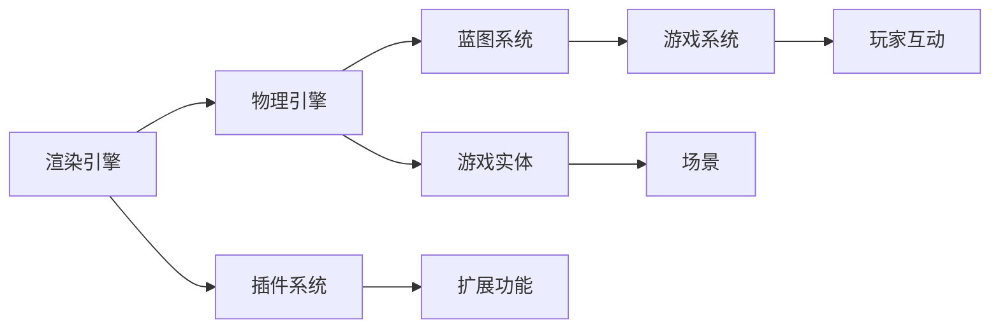

                 

# Unreal Engine 4 游戏开发入门：电影级的视觉效果和游戏玩法设计

## 1. 背景介绍

在当前的游戏市场中，高品质的视觉体验和新颖的游戏玩法是吸引玩家的重要因素。为了创造这些令人难忘的游戏体验，越来越多的游戏开发者开始采用电影级别的视觉效果和创新的游戏玩法。为了帮助广大开发者提升游戏开发水平，我们特别撰写了这篇Unreal Engine 4游戏开发入门教程。这篇文章将带你了解Unreal Engine 4的基础知识，从简单的场景搭建开始，逐步深入到高级的物理和视觉效果设置，最后教你设计出电影级的游戏玩法。

## 2. 核心概念与联系

### 2.1 核心概念概述

Unreal Engine 4 (UE4) 是Epic Games开发的一款高性能、多平台的游戏引擎，支持多种游戏类型和风格，包括但不限于动作冒险、射击、角色扮演、模拟经营等。UE4的核心特点包括：

- **渲染引擎**：UE4使用虚幻引擎4代，采用了实时光线追踪技术，能够生成高度逼真的光照和阴影，支持电影级别的视觉效果。
- **物理引擎**：UE4内置PhysX物理引擎，能够模拟真实的物理世界，实现高质量的物理效果。
- **蓝图系统**：UE4的蓝图系统使得游戏开发更加直观和易于理解，适合非编程背景的游戏设计师和艺术家。
- **插件系统**：UE4支持插件化开发，开发者可以自定义开发各种功能，满足特定需求。

下图展示了这个概念图的流程图，表明了这些核心概念之间的联系：



## 3. 核心算法原理 & 具体操作步骤

### 3.1 算法原理概述

Unreal Engine 4的游戏开发涉及多种算法和数据结构。从渲染引擎的角度来看，光追、路径追踪、全局光照等技术构成了其核心的渲染算法；物理引擎则运用了刚体动力学、碰撞检测、软体动力学等算法；蓝图系统虽然不是基于算法，但其背后的数据结构设计也是关键。

### 3.2 算法步骤详解

- **场景搭建**：创建游戏世界，添加必要的静态和动态对象，如地形、角色、环境物体等。
- **光照和材质**：设置光照源，调整材质和纹理，以达到逼真的视觉效果。
- **物理设置**：配置碰撞、重力、摩擦力等物理参数，确保角色和物体运动自然合理。
- **动画和特效**：使用动画蓝图、特效粒子系统，创建复杂的角色动作和视觉效果。
- **AI和行为树**：创建行为树，定义角色的决策逻辑，实现智能交互和任务目标。

### 3.3 算法优缺点

**优点**：
- **高性能渲染**：支持实时光照、HDR、体积光等高级渲染技术，生成逼真的视觉效果。
- **物理模拟**：内置PhysX引擎，支持复杂的物理效果，如碰撞、弹跳、流体模拟等。
- **开发者友好**：蓝图系统简化编程，可视化编程工具提高开发效率。
- **丰富的资源库**：Unreal Engine Market包含大量现成的资产和工具，减少开发时间和成本。

**缺点**：
- **学习曲线陡峭**：作为一款功能强大的引擎，学习曲线较陡，初学者可能需要较长时间的学习和实践。
- **资源占用高**：渲染和物理模拟的高性能通常伴随着较高的计算资源需求。
- **持续更新成本**：需要不断跟进Epic Games的更新，以获取最新的功能和性能改进。

### 3.4 算法应用领域

Unreal Engine 4广泛应用于各种类型的游戏开发，包括但不限于：

- **电影级别的视觉效果**：适合制作电影级别的游戏，如《堡垒之夜》、《Gears of War》等。
- **大规模多人在线游戏**：支持跨平台的多人游戏开发，如《Fortnite》、《Battle Royale》等。
- **虚拟现实游戏**：提供强大的VR/AR支持，适合开发VR/AR游戏，如《VR Troopers》、《Zero Escape》等。
- **移动游戏**：通过Unreal Engine的移动优化版本，可以开发高质量的移动平台游戏，如《人之城》、《Halo Infinite》移动版等。
- **教育游戏**：适合开发教育性质的游戏，如《Creepy Quiz》、《ChocBoy》等。

## 4. 数学模型和公式 & 详细讲解 & 举例说明

### 4.1 数学模型构建

Unreal Engine 4的渲染引擎使用实时光线追踪技术，其核心数学模型包括：

- **几何模型**：用于表示游戏世界中的物体，包括顶点、面、法线等。
- **光照模型**：用于计算物体表面的光照效果，包括漫反射、镜面反射、环境光等。
- **物理模型**：用于模拟物体的运动和碰撞，包括刚体动力学、软体动力学、流体动力学等。

### 4.2 公式推导过程

以实时光线追踪为例，公式推导如下：

$$
I(p, \omega_o) = \int_{\Omega} f_r(p, \omega_i) L_i(\omega_i) cos(\theta) d\omega_i
$$

其中，$I$为出射光强，$p$为观察点，$\omega_o$为观察方向，$L_i$为入射光强，$f_r$为双向反射率分布函数，$\theta$为入射光线与表面法线的夹角，$\Omega$为入射光线所在的角度范围。

### 4.3 案例分析与讲解

通过下面的案例，我们将在Unreal Engine 4中实现一个简单的光线追踪效果。

1. **创建场景**：在Unreal Engine 4中创建一个新的项目，添加一个立方体作为场景中的物体。
2. **配置光源**：在编辑器中选择“编辑”选项卡，添加方向光源，调整光源位置和方向，使其与立方体产生交互。
3. **配置材质**：将立方体材质设置为无光照的材质，实现光线追踪效果。
4. **配置相机**：配置相机视角，观察光线如何在物体表面上反射和折射。

## 5. 项目实践：代码实例和详细解释说明

### 5.1 开发环境搭建

1. **安装Unreal Engine 4**：从官网下载并安装Unreal Engine 4，并创建一个新的项目。
2. **创建场景**：通过编辑器中的“添加对象”功能，添加立方体、地面、天空盒等基本物体。
3. **配置光照**：在编辑器中选择“编辑”选项卡，添加并配置光源，调整光源位置和方向。
4. **配置材质**：在编辑器中选择“编辑”选项卡，配置立方体的材质，添加无光照材质，实现光线追踪效果。

### 5.2 源代码详细实现

```cpp
// 创建场景
UScene* Scene = CreateDefaultScene();

// 创建立方体
AActor* Cube = CreateDefaultActor(USphereComponent::StaticClass(), Scene);
Cube->AddComponent(AStaticMeshComponent::StaticClass());
AStaticMeshComponent* CubeComponent = static_cast<AStaticMeshComponent*>(Cube->GetComponentByClass(USphereComponent::StaticClass()));
CubeComponent->SetupStaticMeshComponent(StaticMeshImportData::GetDefaultSubObjectFromStaticMesh("CubeStaticMesh"), false, false);
Cube->SetWorldLocation(FVector(0, 0, 0));
Cube->SetWorldRotation(FRotator(0, 0, 0));

// 创建光源
AActor* Light = CreateDefaultActor(DirectionalLightComponent::StaticClass(), Scene);
ADirectionalLightComponent* LightComponent = static_cast<ADirectionalLightComponent*>(Light->GetComponentByClass(DirectionalLightComponent::StaticClass()));
LightComponent->SetupComponent();

// 配置材质
UStaticMesh* CubeMesh = StaticMeshImportData::GetDefaultSubObjectFromStaticMesh("CubeStaticMesh");
TArray<UMaterialInstance> Materials;
Materials.Add(UMaterialInstance::GetDefaultSubObjectFromMaterial("CubeMaterial"));
UStaticMeshComponent* CubeComponent = static_cast<UStaticMeshComponent*>(Cube->GetComponentByClass(UStaticMeshComponent::StaticClass()));
CubeComponent->SetupStaticMeshComponent(CubeMesh, false, false, false);
CubeComponent->SetMaterials(Materials);

// 配置相机
AActor* Camera = CreateDefaultActor(CameraComponent::StaticClass(), Scene);
ACameraComponent* CameraComponent = static_cast<ACameraComponent*>(Camera->GetComponentByClass(CameraComponent::StaticClass()));
CameraComponent->SetupComponent();
```

### 5.3 代码解读与分析

这段代码演示了如何在一个Unreal Engine 4项目中创建一个基本的场景，包括一个立方体、一个光源和一个相机。首先，我们创建了一个场景，然后添加了一个立方体和一个方向光源，并为立方体配置了一个无光照材质。最后，我们创建了一个相机，并配置了它的视角。

### 5.4 运行结果展示

运行上述代码，你将看到在编辑器中生成的场景，其中立方体和光源互相作用，产生了逼真的光照效果。

## 6. 实际应用场景

### 6.1 电影级别的视觉效果

Unreal Engine 4在游戏开发中已经展现出其强大的电影级视觉效果能力。例如，《堡垒之夜》中的光影效果、《刺客信条：王朝》中的真实自然景观等，都展示出了UE4的强大渲染能力。

### 6.2 大规模多人在线游戏

Unreal Engine 4支持大规模的多人在线游戏开发，如《堡垒之夜》、《无主之地》等。这些游戏通过实时服务器和优化技术，实现了大规模在线游戏的稳定运行。

### 6.3 虚拟现实游戏

Unreal Engine 4提供了强大的VR/AR支持，适合开发虚拟现实游戏，如《VR Troopers》、《Zero Escape》等。

### 6.4 未来应用展望

未来，Unreal Engine 4将进一步增强其渲染和物理引擎的能力，支持更多创新的视觉效果和游戏玩法。同时，UE4还将更好地集成AI技术，提升游戏角色的智能程度和互动性。

## 7. 工具和资源推荐

### 7.1 学习资源推荐

1. **Unreal Engine 4官方文档**：Unreal Engine 4官方文档提供了全面的教程和指南，是学习UE4的最佳起点。
2. **Unreal Engine 4 YouTube频道**：Unreal Engine 4官方频道发布了一系列教学视频，涵盖了从基础到高级的各个方面。
3. **Unreal Engine 4社区**：Unreal Engine 4社区提供了大量的资源和支持，可以与其他开发者交流学习。

### 7.2 开发工具推荐

1. **Visual Studio**：Visual Studio是UE4的官方IDE，支持多平台开发。
2. **Git版本控制系统**：Git可以管理项目代码，方便团队协作和版本控制。
3. **Unreal Engine 4集成开发环境**：Unreal Engine 4的编辑器集成了开发环境，可以方便地进行游戏开发和调试。

### 7.3 相关论文推荐

1. **《实时光线追踪技术在Unreal Engine 4中的应用》**：详细介绍了UE4的实时光线追踪技术及其在电影级视觉效果中的应用。
2. **《Unreal Engine 4中的物理引擎优化》**：介绍了UE4的PhysX引擎，以及如何优化物理模拟效果。
3. **《蓝图系统在Unreal Engine 4中的设计理念》**：介绍了蓝图系统的设计思路和开发实践。

## 8. 总结：未来发展趋势与挑战

### 8.1 研究成果总结

Unreal Engine 4在游戏开发中已经展现出其强大的渲染和物理引擎能力，通过实时光线追踪和PhysX引擎，实现了电影级别的视觉效果和复杂的物理效果。蓝图系统使得游戏开发更加直观和易于理解，适合非编程背景的游戏设计师和艺术家。

### 8.2 未来发展趋势

未来，Unreal Engine 4将继续在以下方向发展：

- **AI和机器学习**：通过集成AI和机器学习技术，提升游戏角色的智能程度和互动性。
- **跨平台支持**：进一步优化跨平台支持，使得开发者可以更轻松地在不同平台上开发游戏。
- **性能优化**：优化引擎的渲染和物理引擎，提高游戏性能，降低开发和部署成本。

### 8.3 面临的挑战

尽管Unreal Engine 4在游戏开发中已经展现出强大的能力，但仍然面临着一些挑战：

- **学习曲线陡峭**：UE4功能强大，但学习曲线较陡，需要开发者花费大量时间和精力进行学习和实践。
- **资源占用高**：渲染和物理模拟的高性能通常伴随着较高的计算资源需求，可能会对低端设备造成压力。
- **更新频率**：需要不断跟进Epic Games的更新，以获取最新的功能和性能改进。

### 8.4 研究展望

未来的研究将集中在以下方面：

- **集成AI和机器学习**：通过集成AI和机器学习技术，提升游戏角色的智能程度和互动性，创造更具沉浸感的游戏体验。
- **跨平台优化**：优化跨平台支持，使得开发者可以更轻松地在不同平台上开发游戏，降低开发和部署成本。
- **性能优化**：优化引擎的渲染和物理引擎，提高游戏性能，降低计算资源需求，增强游戏在各种设备上的表现。

## 9. 附录：常见问题与解答

**Q1: Unreal Engine 4的学习曲线是否陡峭？**

A: Unreal Engine 4功能强大，但确实具有较高的学习曲线。建议初学者从基础知识入手，逐步深入学习，多实践，多查阅官方文档和社区资源。

**Q2: 如何优化Unreal Engine 4的性能？**

A: 优化性能需要从渲染、物理模拟等多个方面入手。例如，使用高质量的纹理和模型，优化光源设置，合理配置物理引擎参数等。

**Q3: Unreal Engine 4的跨平台支持是否足够好？**

A: Unreal Engine 4支持多个平台，包括PC、Xbox、PlayStation等。但需要开发者进行跨平台优化，才能确保在各种设备上都有良好的表现。

**Q4: Unreal Engine 4中如何实现实时光线追踪？**

A: 实时光线追踪需要配置合适的光源和材质，并在编辑器中进行相关设置。详细操作可参考Unreal Engine 4官方文档中的实时光线追踪教程。

**Q5: Unreal Engine 4的蓝图系统是否容易上手？**

A: Unreal Engine 4的蓝图系统相较于传统的C++编程更加直观和易于理解，适合非编程背景的游戏设计师和艺术家。但需要开发者进行适当的编程基础学习，才能更好地使用蓝图系统。

---

作者：禅与计算机程序设计艺术 / Zen and the Art of Computer Programming

