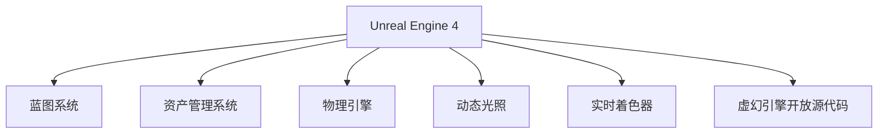

                 

## 1. 背景介绍

Unreal Engine 4（UE4）是一款由 Epic Games 开发的游戏引擎，自发布以来便迅速在行业内外建立了极高的声誉。它不仅支持高品质的游戏开发，还广泛应用于虚拟现实、电影制作、建筑可视化等领域。UE4的强大功能，使其成为电影级游戏开发的理想工具。本文将详细介绍UE4的核心概念、工作原理、核心算法，并探讨其在电影级游戏开发中的应用，以期为开发高品质的游戏、电影、建筑等提供全方位的技术指导。

## 2. 核心概念与联系

### 2.1 核心概念概述

**Unreal Engine 4**：由 Epic Games 开发的游戏引擎，支持高品质的游戏、电影、建筑可视化开发。支持 C++、蓝图两种开发语言，提供强大的图形编辑器和可视化编程工具。

**蓝图系统**：UE4的可视化编程工具，允许开发者使用拖拽节点的方式快速构建游戏逻辑，降低编程门槛，提高开发效率。

**资产管**理系统：支持复杂场景和资源的有效管理，方便开发者进行资源复用和迭代。

**物理引擎**：UE4内置的物理引擎，支持真实世界的物理模拟，使得游戏中的物理效果更加逼真。

**动态光照**：支持实时动态光照，可以模拟复杂的光线变化和阴影效果。

**实时着色器**：UE4的实时着色器技术，可以实现快速的渲染，提高游戏和电影的场景渲染效率。

**虚幻引擎开放源代码**：UE4的源代码开源，方便开发者深入理解其核心技术和架构。

### 2.2 核心概念原理和架构的 Mermaid 流程图



## 3. 核心算法原理 & 具体操作步骤

### 3.1 算法原理概述

UE4的核心算法主要集中在渲染、物理模拟、资产管理等方面，这些算法共同构成了UE4强大功能的基础。下面将详细介绍这些核心算法的原理和操作步骤。

### 3.2 算法步骤详解

#### 3.2.1 渲染算法

UE4的渲染算法主要包括以下几个步骤：

1. **场景构建**：将3D场景中的所有物体、光照、纹理等信息构建到内存中。

2. **视口渲染**：将场景中的物体投影到屏幕空间，并进行渲染。

3. **光照计算**：根据光源、材质、光照参数等信息，计算物体的光照效果。

4. **后期处理**：对渲染结果进行后期处理，如去噪、合成等操作，生成最终的图像。

5. **优化**：对渲染算法进行优化，提高渲染效率，减少性能消耗。

#### 3.2.2 物理模拟算法

UE4的物理模拟算法主要包括以下几个步骤：

1. **场景构建**：将3D场景中的所有物体、碰撞体、物理参数等信息构建到内存中。

2. **碰撞检测**：检测物体之间的碰撞，计算碰撞结果。

3. **运动计算**：根据物理参数，计算物体的运动状态。

4. **动态响应**：根据碰撞结果和运动状态，计算动态响应，如碰撞反弹、重力加速度等。

5. **优化**：对物理模拟算法进行优化，提高计算效率，减少性能消耗。

#### 3.2.3 资产管理系统

UE4的资产管理系统主要包括以下几个步骤：

1. **资源加载**：将预定义的资源（如模型、贴图、动画等）加载到内存中。

2. **资源管理**：对加载的资源进行管理，如版本控制、依赖关系管理等。

3. **资源复用**：对已有的资源进行复用，提高资源利用率。

4. **资源导出**：将场景中的资源导出为文件，方便后续修改和导入。

5. **优化**：对资源管理系统进行优化，提高加载、管理和导出效率。

### 3.3 算法优缺点

UE4的渲染、物理模拟和资产管理算法具有以下优点：

1. **高效性**：通过优化算法，提高了渲染和物理模拟的效率，降低了性能消耗。

2. **灵活性**：支持多种开发语言和工具，适应不同项目需求。

3. **易用性**：可视化编程工具和资源管理系统，降低了开发门槛，提高了开发效率。

4. **逼真性**：通过动态光照、实时着色器等技术，实现了逼真的渲染效果。

5. **可扩展性**：支持插件和扩展，方便开发者进行功能扩展和优化。

UE4的算法也存在以下缺点：

1. **学习曲线陡峭**：由于功能强大，学习曲线较陡峭，新手需要一定时间掌握。

2. **资源占用较大**：渲染和物理模拟算法复杂，资源占用较大，需要较高的硬件配置。

3. **开发成本高**：复杂场景和高级特效需要较高的开发成本，对于小型项目可能不适用。

### 3.4 算法应用领域

UE4在以下几个领域有着广泛的应用：

1. **游戏开发**：支持高品质的游戏开发，如《堡垒之夜》、《守望先锋》等。

2. **电影制作**：支持电影级别的渲染和特效，如《巨魔大战巨魔》、《奇迹世纪》等。

3. **建筑可视化**：支持复杂的建筑场景和渲染，如《联合国总部》、《故宫》等。

4. **虚拟现实**：支持VR设备的渲染和物理模拟，如《Her》、《HTC Vive》等。

5. **工业设计**：支持工业设计的场景和渲染，如《汽车设计》、《航空设计》等。

6. **数据可视化**：支持数据的可视化展示，如《地球仪》、《天气预测》等。

## 4. 数学模型和公式 & 详细讲解 & 举例说明

### 4.1 数学模型构建

UE4的渲染算法涉及多个数学模型，下面将详细介绍其中几个重要的模型：

1. **光照模型**：用于计算物体表面光照效果，常用的有Phong模型和Blinn-Phong模型。

2. **反射模型**：用于计算物体表面的反射效果，常用的有Lambert模型和Oren-Nayar模型。

3. **阴影模型**：用于计算物体表面的阴影效果，常用的有Caster Shadow和Shadow Map模型。

4. **透明效果模型**：用于计算物体的透明效果，常用的有Alpha Test和Alpha Blending模型。

### 4.2 公式推导过程

#### 4.2.1 光照模型

Phong模型的公式如下：

$$
I(\mathbf{v},\mathbf{n},\mathbf{r},\mathbf{L}) = \mathbf{K}_1 I_a(\mathbf{v},\mathbf{n}) + \mathbf{K}_2 I_d(\mathbf{v},\mathbf{n},\mathbf{r},\mathbf{L}) + \mathbf{K}_3 I_s(\mathbf{v},\mathbf{n},\mathbf{r},\mathbf{L})
$$

其中，$I_a$表示环境光部分，$I_d$表示漫反射部分，$I_s$表示镜面反射部分，$K_1$、$K_2$、$K_3$表示各部分的强度系数，$\mathbf{v}$表示视角向量，$\mathbf{n}$表示法线向量，$\mathbf{r}$表示表面反射向量，$\mathbf{L}$表示光源向量。

#### 4.2.2 反射模型

Lambert模型的公式如下：

$$
I_r(\mathbf{v},\mathbf{n}) = K_r I_a(\mathbf{v},\mathbf{n})
$$

其中，$I_r$表示反射光部分，$K_r$表示反射强度系数，$I_a$表示环境光部分，$\mathbf{v}$表示视角向量，$\mathbf{n}$表示法线向量。

#### 4.2.3 阴影模型

Caster Shadow模型的公式如下：

$$
I_s(\mathbf{v},\mathbf{n},\mathbf{r},\mathbf{L}) = \frac{0.5 (1 - r)}{(\mathbf{n} \cdot \mathbf{r})^m} max(0, (n \cdot v)^m)
$$

其中，$I_s$表示阴影部分，$K_r$表示阴影强度系数，$r$表示光源与视线的夹角，$n$表示法线向量，$v$表示视角向量，$m$表示阴影指数。

### 4.3 案例分析与讲解

#### 4.3.1 案例分析

以《堡垒之夜》为例，分析UE4在游戏开发中的应用。

1. **场景构建**：《堡垒之夜》使用了UE4的资产管理系统，加载了大量模型、贴图、动画等资源。

2. **渲染**：《堡垒之夜》使用了UE4的动态光照和实时着色器技术，实现了逼真的渲染效果。

3. **物理模拟**：《堡垒之夜》使用了UE4的物理引擎，实现了逼真的碰撞效果和动态响应。

4. **编程**：《堡垒之夜》使用了UE4的蓝图系统，降低了编程难度，提高了开发效率。

#### 4.3.2 讲解

《堡垒之夜》的渲染算法主要包括以下几个步骤：

1. **场景构建**：将3D场景中的所有物体、光照、纹理等信息构建到内存中。

2. **视口渲染**：将场景中的物体投影到屏幕空间，并进行渲染。

3. **光照计算**：根据光源、材质、光照参数等信息，计算物体的光照效果。

4. **后期处理**：对渲染结果进行后期处理，如去噪、合成等操作，生成最终的图像。

5. **优化**：对渲染算法进行优化，提高渲染效率，减少性能消耗。

## 5. 项目实践：代码实例和详细解释说明

### 5.1 开发环境搭建

要使用UE4进行项目开发，首先需要搭建开发环境。以下是详细的搭建流程：

1. **下载UE4**：从UE4官网下载最新版本的安装包，并解压缩到指定目录。

2. **安装Visual Studio**：下载并安装Visual Studio 2019或更高版本，推荐使用Visual Studio 2019。

3. **安装Unreal Engine SDK**：启动UE4解压缩包，双击SETUP程序，按照提示进行安装。

4. **安装第三方插件**：根据项目需求，安装所需的第三方插件，如VR支持、物理引擎等。

5. **创建项目**：打开UE4编辑器，创建新的项目文件。

### 5.2 源代码详细实现

以下是一个简单的UE4项目的源代码实现：

```cpp
// ExampleProject.cpp
#include "ExampleProject.h"
#include "ExampleProjectGameMode.h"

// Constructor
AExampleProjectGameMode::AExampleProjectGameMode()
{
	PrimaryActorTick.bCanEverTick = true;
}

// DestroyBeginOverride
void AExampleProjectGameMode::BeginPlay()
{
	Super::BeginPlay();

	// 设置物理引擎
	PhysicsEngine::SetDefaultEngineOptions(this->World->GetPhysicsScene(), 
		IEEE754_RTE_MULP, 
		EPhysicalCollisionMode::PMM_TETRAD, 
		IEEE754_RTE_MULP);
	
	// 创建场景
	SceneManagement::GetSceneManagementModule().RegisterScene(this->World);
	
	// 加载资源
	StaticMesh* MyMesh = GetEngine()->GetAssetLibrary()->GetAsset<StaticMesh>(TEXT("MyMesh.Obj"));
	
	// 添加场景
	this->AddActor(MeshComponent::NewObject<StaticMeshComponent>(this, "MyMesh"));
	this->GetActor()->AddActor(MeshComponent->SetStaticMesh(MyMesh));
}

// DestroyEndOverride
void AExampleProjectGameMode::EndPlay(const class FEndPlayReason::Type EndPlayReason)
{
	Super::EndPlay(EndPlayReason);
}
```

### 5.3 代码解读与分析

#### 5.3.1 代码解读

这段代码实现了UE4游戏模式的基本功能，主要包括：

1. **构造函数**：初始化游戏模式，设置物理引擎、场景管理等。

2. **BeginPlay函数**：创建场景，加载资源，并添加场景。

3. **EndPlay函数**：结束游戏模式，清理资源。

#### 5.3.2 分析

UE4游戏模式的代码实现相对简单，但其中涉及了许多重要的概念和函数，如物理引擎、场景管理、资源加载等。开发者需要深入理解这些概念和函数，才能进行复杂的项目开发。

## 6. 实际应用场景

### 6.1 电影制作

UE4在电影制作领域有着广泛的应用，支持复杂的场景渲染和特效制作。例如，在《巨魔大战巨魔》中，使用UE4实现了逼真的动态光照和阴影效果，使得影片更具真实感。

### 6.2 游戏开发

UE4在游戏开发领域具有不可替代的地位，支持高品质的游戏开发。例如，《堡垒之夜》使用了UE4的蓝图系统，降低了开发难度，提高了开发效率。

### 6.3 建筑可视化

UE4在建筑可视化领域也有广泛的应用，支持复杂的建筑场景和渲染。例如，《故宫》使用了UE4的场景构建和光照计算，实现了逼真的建筑场景效果。

### 6.4 未来应用展望

未来的UE4将继续在以下领域进行深入应用：

1. **虚拟现实**：支持VR设备的渲染和物理模拟，进一步拓展虚拟现实场景的应用。

2. **人工智能**：结合AI技术，实现更加智能化的游戏和电影。

3. **实时数据可视化**：支持实时数据可视化展示，用于科学、医疗、金融等领域。

4. **全息技术**：支持全息技术的渲染和物理模拟，用于虚拟会议、教育等领域。

## 7. 工具和资源推荐

### 7.1 学习资源推荐

为了帮助开发者系统掌握UE4的核心概念和应用，这里推荐一些优质的学习资源：

1. **Unreal Engine官方文档**：UE4官方文档提供了完整的开发指南和API文档，是学习UE4的必备资料。

2. **虚幻引擎蓝图教程**：UE4的蓝图教程，提供了详细的蓝图编程实践，帮助开发者快速上手。

3. **虚幻引擎官方视频教程**：UE4官方视频教程，涵盖基础到高级的各种技术，适合不同层次的开发者学习。

4. **Udemy课程**：Udemy平台上的UE4课程，涵盖游戏开发、电影制作、建筑可视化等各个领域的实际应用。

### 7.2 开发工具推荐

UE4的开发工具涉及许多第三方插件和工具，以下是一些常用的工具：

1. **Visual Studio**：UE4的开发工具，支持C++和蓝图编程，适用于开发各种类型的项目。

2. **Unity Hub**：UE4的插件管理工具，方便安装和管理第三方插件。

3. **Unreal Engine Editor**：UE4的编辑器，提供了强大的可视化编程工具和资产管理功能。

4. **Git**：版本控制工具，方便团队协作和代码管理。

5. **Valve Index**：VR设备的渲染和物理模拟工具，支持虚拟现实场景的开发。

### 7.3 相关论文推荐

UE4的开发涉及许多前沿技术和算法，以下是几篇重要的相关论文，推荐阅读：

1. **Real-time Hardware-accelerated Light Transport Simulation**：NVIDIA的实时硬件加速光照计算论文，展示了UE4的动态光照技术。

2. **Real-time Scene Visualization with HDRI Lighting**：NVIDIA的实时光照渲染论文，展示了UE4的光照效果。

3. **Physical Simulations in Unreal Engine 4**：Epic Games的物理模拟论文，展示了UE4的物理引擎技术。

4. **Unreal Engine 4: Technology, Tools and Team**：UE4技术团队的总结文章，介绍了UE4的核心技术和开发经验。

## 8. 总结：未来发展趋势与挑战

### 8.1 总结

本文对UE4的核心概念、工作原理、核心算法进行了详细介绍，并探讨了其在电影级游戏开发中的应用。通过系统地分析UE4的各项功能，相信读者能够更好地理解UE4的核心技术，并应用于实际的开发中。

### 8.2 未来发展趋势

未来的UE4将继续在以下几个领域进行深入应用和创新：

1. **实时渲染**：支持更高的渲染质量和更快的渲染速度，实现更加逼真的渲染效果。

2. **物理引擎**：支持更加复杂的物理模拟，实现更加逼真的物理效果。

3. **蓝图系统**：不断优化蓝图编程工具，降低编程难度，提高开发效率。

4. **虚拟现实**：支持更加先进的VR设备，拓展虚拟现实场景的应用。

5. **人工智能**：结合AI技术，实现更加智能化的游戏和电影。

6. **实时数据可视化**：支持实时数据可视化展示，用于科学、医疗、金融等领域。

### 8.3 面临的挑战

尽管UE4在多个领域有着广泛的应用，但仍然面临一些挑战：

1. **学习曲线陡峭**：UE4的功能强大，学习曲线较陡峭，新手需要一定时间掌握。

2. **资源占用较大**：渲染和物理模拟算法复杂，资源占用较大，需要较高的硬件配置。

3. **开发成本高**：复杂场景和高级特效需要较高的开发成本，对于小型项目可能不适用。

4. **代码管理复杂**：UE4的项目管理和代码管理相对复杂，需要较强的开发能力。

### 8.4 研究展望

未来的UE4研究将继续在以下几个方向进行深入探索：

1. **实时渲染技术**：探索更高质量的实时渲染技术，实现更加逼真的渲染效果。

2. **物理引擎优化**：优化物理引擎，实现更加逼真的物理效果，支持更复杂的场景模拟。

3. **蓝图系统优化**：优化蓝图编程工具，降低编程难度，提高开发效率。

4. **人工智能结合**：结合AI技术，实现更加智能化的游戏和电影。

5. **实时数据可视化**：支持实时数据可视化展示，用于科学、医疗、金融等领域。

总之，UE4在电影级游戏开发中的应用前景广阔，未来将继续在多个领域进行深入探索和创新。只有不断突破技术瓶颈，才能实现更高的性能和更广泛的应用。

## 9. 附录：常见问题与解答

### 9.1 常见问题

**Q1: 为什么UE4的渲染效果如此逼真？**

A: UE4的渲染效果逼真，主要得益于其动态光照、实时着色器等技术。UE4支持高品质的光照计算，实现了逼真的光照效果。同时，UE4的实时着色器技术，可以实现快速的渲染，提高场景渲染效率，进一步提升渲染质量。

**Q2: UE4的物理引擎有哪些优点？**

A: UE4的物理引擎具有以下优点：

1. **精度高**：支持复杂的物理模拟，精度高，效果逼真。

2. **性能强**：使用GPU加速，性能强大，支持实时模拟。

3. **易用性高**：支持可视化编程，易于上手。

4. **灵活性高**：支持多种物理模拟，灵活性高。

**Q3: 如何学习UE4的蓝图编程？**

A: 学习UE4的蓝图编程，可以从以下几个方面入手：

1. **官方文档**：详细阅读UE4的官方文档，了解蓝图编程的基础知识。

2. **教程视频**：观看UE4的官方教程视频，学习蓝图编程的实践技巧。

3. **实战项目**：通过实践项目，巩固所学知识，提高编程能力。

4. **社区学习**：加入UE4的开发者社区，与开发者交流，分享经验。

总之，学习UE4的蓝图编程，需要多方面的学习和实践，才能掌握其核心技术和应用技巧。

**Q4: UE4在建筑可视化领域有哪些应用？**

A: UE4在建筑可视化领域有以下应用：

1. **场景构建**：支持复杂的建筑场景构建，支持模型、贴图、动画等资源管理。

2. **实时渲染**：支持实时渲染，实现逼真的建筑场景效果。

3. **光照计算**：支持复杂的光照计算，实现逼真的光照效果。

4. **物理模拟**：支持复杂的物理模拟，实现逼真的物理效果。

**Q5: UE4的资源管理有哪些特点？**

A: UE4的资源管理具有以下特点：

1. **资源版本控制**：支持资源版本控制，便于多人协作开发。

2. **资源依赖关系管理**：支持资源依赖关系管理，方便资源复用。

3. **资源加载优化**：支持资源加载优化，提高加载效率。

4. **资源导出优化**：支持资源导出优化，方便资源导出和导入。

总之，UE4的资源管理系统功能强大，支持复杂的资源管理需求，是游戏、电影、建筑可视化等领域开发的重要工具。

**Q6: UE4的实时数据可视化有哪些应用？**

A: UE4的实时数据可视化有以下应用：

1. **科学领域**：支持科学数据的可视化展示，帮助科学家进行数据分析和可视化。

2. **医疗领域**：支持医疗数据的可视化展示，帮助医生进行医疗数据分析。

3. **金融领域**：支持金融数据的可视化展示，帮助金融分析师进行数据预测和分析。

4. **交通领域**：支持交通数据的可视化展示，帮助交通规划人员进行交通数据分析。

总之，UE4的实时数据可视化支持多种领域的数据展示需求，是数据可视化的理想工具。

---

作者：禅与计算机程序设计艺术 / Zen and the Art of Computer Programming

