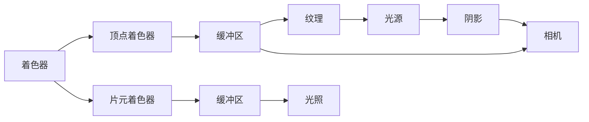

                 

# WebGL：浏览器中的3D图形渲染

## 1. 背景介绍

WebGL（Web Graphics Library）是基于OpenGL ES 2.0标准的浏览器端3D图形渲染API。它为Web开发者提供了一组强大的工具，允许在网页中进行高质量的3D图形渲染。WebGL的应用场景广泛，涵盖从简单的动态图表、数据可视化到复杂的游戏、虚拟现实（VR）等领域。

WebGL的引入，打破了传统3D渲染技术（如DirectX、OpenGL）仅限于桌面或移动端的限制，使得Web应用能够实现更为复杂、美观的3D效果。在WebGL中，开发者可以使用JavaScript与底层的GPU进行交互，生成逼真的3D场景，从而极大地丰富了Web的视觉体验。

## 2. 核心概念与联系

### 2.1 核心概念概述

为了更好地理解WebGL，我们需要先介绍几个核心概念：

- **着色器（Shader）**：着色器是WebGL中执行计算的主要单元，分为顶点着色器和片元着色器。顶点着色器负责处理顶点的坐标、颜色等数据，片元着色器则处理像素的颜色和透明度等信息。
- **缓冲区（Buffer）**：缓冲区用于存储顶点、索引、颜色等数据，是WebGL渲染的基础。
- **纹理（Texture）**：纹理是图像或视频中的像素数据，可以应用于物体表面，增加逼真度。
- **光照（Lighting）**：光照用于模拟光源对物体表面光线反射的模拟，使得场景更加立体感。
- **阴影（Shadow）**：阴影用于模拟光源被物体遮挡后的阴影效果，增强场景的真实感。
- **相机（Camera）**：相机用于控制视图的角度和位置，使观察者能够在虚拟世界中自由移动。

这些概念相互关联，共同构成了WebGL渲染的核心体系。通过这些工具，开发者可以实现丰富的3D图形效果。

### 2.2 核心概念原理和架构的 Mermaid 流程图



这个流程图展示了WebGL渲染的基本流程：

1. 着色器处理顶点数据。
2. 顶点着色器和片元着色器分别处理顶点和像素数据。
3. 缓冲区存储顶点、索引、颜色等数据。
4. 纹理增加物体表面的逼真度。
5. 光照和阴影模拟光源的照射和遮挡效果。
6. 相机控制视图角度和位置，使得观察者能够自由移动。

## 3. 核心算法原理 & 具体操作步骤

### 3.1 算法原理概述

WebGL渲染的基本原理是将3D模型转换为2D图形，通过着色器、缓冲区、纹理等工具进行渲染。WebGL渲染过程主要包括以下几个步骤：

1. 创建和编译着色器程序。
2. 设置顶点坐标和颜色等属性。
3. 生成和填充缓冲区。
4. 设置纹理和光源。
5. 进行渲染操作。

### 3.2 算法步骤详解

#### 3.2.1 创建和编译着色器程序

在WebGL中，创建着色器程序需要以下步骤：

1. 创建着色器对象。

```javascript
var vertexShader = gl.createShader(gl.VERTEX_SHADER);
var fragmentShader = gl.createShader(gl.FRAGMENT_SHADER);
```

2. 加载和编译着色器代码。

```javascript
gl.shaderSource(vertexShader, vertexShaderSource);
gl.shaderSource(fragmentShader, fragmentShaderSource);
gl.compileShader(vertexShader);
gl.compileShader(fragmentShader);
```

3. 创建和编译着色器程序。

```javascript
var shaderProgram = gl.createProgram();
gl.attachShader(shaderProgram, vertexShader);
gl.attachShader(shaderProgram, fragmentShader);
gl.linkProgram(shaderProgram);
gl.useProgram(shaderProgram);
```

#### 3.2.2 设置顶点坐标和颜色等属性

设置顶点坐标和颜色等属性，可以通过以下代码实现：

```javascript
var positionBuffer = gl.createBuffer();
gl.bindBuffer(gl.ARRAY_BUFFER, positionBuffer);
gl.bufferData(gl.ARRAY_BUFFER, new Float32Array(positionData), gl.STATIC_DRAW);

var colorBuffer = gl.createBuffer();
gl.bindBuffer(gl.ARRAY_BUFFER, colorBuffer);
gl.bufferData(gl.ARRAY_BUFFER, new Float32Array(colorData), gl.STATIC_DRAW);
```

#### 3.2.3 生成和填充缓冲区

生成和填充缓冲区，可以通过以下代码实现：

```javascript
var indexBuffer = gl.createBuffer();
gl.bindBuffer(gl.ELEMENT_ARRAY_BUFFER, indexBuffer);
gl.bufferData(gl.ELEMENT_ARRAY_BUFFER, new Uint16Array(indexData), gl.STATIC_DRAW);
```

#### 3.2.4 设置纹理和光源

设置纹理和光源，可以通过以下代码实现：

```javascript
var texture = gl.createTexture();
gl.bindTexture(gl.TEXTURE_2D, texture);
gl.texImage2D(gl.TEXTURE_2D, 0, gl.RGBA, gl.RGBA, gl.UNSIGNED_BYTE, image);

var light = gl.createShader(gl.FRAGMENT_SHADER);
gl.shaderSource(light, lightShaderSource);
gl.compileShader(light);
gl.attachShader(shaderProgram, light);
gl.linkProgram(shaderProgram);
```

#### 3.2.5 进行渲染操作

进行渲染操作，可以通过以下代码实现：

```javascript
gl.enableVertexAttribArray(positionAttribute);
gl.bindBuffer(gl.ARRAY_BUFFER, positionBuffer);
gl.vertexAttribPointer(positionAttribute, 3, gl.FLOAT, false, 0, 0);

gl.bindBuffer(gl.ELEMENT_ARRAY_BUFFER, indexBuffer);

gl.drawElements(gl.TRIANGLES, indexData.length, gl.UNSIGNED_SHORT, 0);
```

### 3.3 算法优缺点

WebGL的优点在于其跨平台性、兼容性以及JavaScript的简单易用性。缺点则在于其性能依赖于浏览器的兼容性，不同浏览器的实现可能存在差异。

#### 3.3.1 优点

- **跨平台性**：WebGL可以在多个平台（如Web浏览器、Android、iOS等）上运行，无需修改代码。
- **兼容性**：WebGL被多个浏览器厂商支持，包括Chrome、Firefox、Safari、Edge等。
- **简单易用**：WebGL使用JavaScript进行编程，无需学习新的编程语言，易于上手。
- **高性能**：WebGL支持GPU加速，能够实现高效的图形渲染。

#### 3.3.2 缺点

- **兼容性问题**：不同浏览器的WebGL实现可能存在差异，导致性能不稳定。
- **兼容性限制**：某些高级特性可能不被所有浏览器支持。
- **依赖于GPU**：WebGL依赖于浏览器的GPU加速，在一些低性能设备上可能表现不佳。
- **学习成本**：虽然WebGL简单易用，但其底层原理和渲染机制相对复杂，需要一定的学习成本。

### 3.4 算法应用领域

WebGL的应用领域非常广泛，涵盖以下几个方面：

- **游戏开发**：WebGL可以用于开发复杂的3D游戏，实现逼真的场景效果和交互体验。
- **虚拟现实（VR）**：WebGL与VR设备结合，可以提供沉浸式的虚拟现实体验。
- **数据可视化**：WebGL可以用于创建动态、交互式的数据可视化图表。
- **地理信息系统（GIS）**：WebGL可以用于展示地球表面和其他地理数据，实现地理信息的可视化。
- **模拟仿真**：WebGL可以用于模拟各种物理现象，如流体、火、爆炸等。
- **教育培训**：WebGL可以用于创建虚拟实验室、虚拟教室等教育培训应用。

## 4. 数学模型和公式 & 详细讲解

### 4.1 数学模型构建

WebGL渲染过程中涉及大量的数学计算，包括向量、矩阵、颜色等。以下是WebGL渲染中常用的数学模型：

- **坐标系转换**：将世界坐标转换为视图坐标，再转换为屏幕坐标。
- **矩阵变换**：使用旋转、缩放、平移等矩阵进行变换。
- **光照计算**：计算光照效果，包括漫反射、镜面反射、环境光等。
- **阴影计算**：计算光源被物体遮挡后的阴影效果。

### 4.2 公式推导过程

#### 4.2.1 坐标系转换

坐标系转换是WebGL渲染中非常重要的一环。以下是坐标系转换的基本公式：

$$
\begin{aligned}
&\text{View matrix} = \text{lookAt}(\text{eye}, \text{center}, \text{up}) \\
&\text{Projection matrix} = \text{perspective}(\text{fovy}, \text{aspect}, \text{zNear}, \text{zFar}) \\
&\text{Model matrix} = \text{scale}(\text{scale}) \cdot \text{rotate}(\text{rotate}) \cdot \text{translate}(\text{translate})
\end{aligned}
$$

其中，`lookAt`、`perspective`、`scale`、`rotate`、`translate`等函数用于创建不同的变换矩阵。

#### 4.2.2 矩阵变换

矩阵变换是WebGL渲染中的关键步骤。以下是矩阵变换的基本公式：

$$
\begin{aligned}
&\text{View matrix} = \text{lookAt}(\text{eye}, \text{center}, \text{up}) \\
&\text{Projection matrix} = \text{perspective}(\text{fovy}, \text{aspect}, \text{zNear}, \text{zFar}) \\
&\text{Model matrix} = \text{scale}(\text{scale}) \cdot \text{rotate}(\text{rotate}) \cdot \text{translate}(\text{translate})
\end{aligned}
$$

其中，`lookAt`、`perspective`、`scale`、`rotate`、`translate`等函数用于创建不同的变换矩阵。

#### 4.2.3 光照计算

光照计算是WebGL渲染中的核心步骤。以下是光照计算的基本公式：

$$
\text{I}(\text{P}, \text{L}) = \text{ diffuse } \cdot (\text{L} \cdot \text{N}) + \text{ specular } \cdot (\text{R} \cdot \text{V}^T \cdot \text{L})^n
$$

其中，`diffuse`、`specular`、`L`、`N`、`R`、`V`等变量分别代表漫反射系数、镜面反射系数、光源方向、法线方向、反射向量、视角向量等。

#### 4.2.4 阴影计算

阴影计算是WebGL渲染中的关键步骤。以下是阴影计算的基本公式：

$$
\text{S} = \text{C} - \text{L} \cdot \text{N}^T
$$

其中，`C`、`L`、`N`等变量分别代表光源向量、法线向量等。

### 4.3 案例分析与讲解

#### 4.3.1 三棱柱渲染

以下是一个简单的三棱柱渲染案例：

```javascript
// 创建着色器程序
var vertexShader = gl.createShader(gl.VERTEX_SHADER);
var fragmentShader = gl.createShader(gl.FRAGMENT_SHADER);
gl.shaderSource(vertexShader, vertexShaderSource);
gl.shaderSource(fragmentShader, fragmentShaderSource);
gl.compileShader(vertexShader);
gl.compileShader(fragmentShader);
var shaderProgram = gl.createProgram();
gl.attachShader(shaderProgram, vertexShader);
gl.attachShader(shaderProgram, fragmentShader);
gl.linkProgram(shaderProgram);
gl.useProgram(shaderProgram);

// 设置顶点坐标和颜色等属性
var positionBuffer = gl.createBuffer();
gl.bindBuffer(gl.ARRAY_BUFFER, positionBuffer);
gl.bufferData(gl.ARRAY_BUFFER, new Float32Array(positionData), gl.STATIC_DRAW);

var colorBuffer = gl.createBuffer();
gl.bindBuffer(gl.ARRAY_BUFFER, colorBuffer);
gl.bufferData(gl.ARRAY_BUFFER, new Float32Array(colorData), gl.STATIC_DRAW);

// 设置纹理和光源
var texture = gl.createTexture();
gl.bindTexture(gl.TEXTURE_2D, texture);
gl.texImage2D(gl.TEXTURE_2D, 0, gl.RGBA, gl.RGBA, gl.UNSIGNED_BYTE, image);

var light = gl.createShader(gl.FRAGMENT_SHADER);
gl.shaderSource(light, lightShaderSource);
gl.compileShader(light);
gl.attachShader(shaderProgram, light);
gl.linkProgram(shaderProgram);

// 进行渲染操作
gl.enableVertexAttribArray(positionAttribute);
gl.bindBuffer(gl.ARRAY_BUFFER, positionBuffer);
gl.vertexAttribPointer(positionAttribute, 3, gl.FLOAT, false, 0, 0);

gl.bindBuffer(gl.ELEMENT_ARRAY_BUFFER, indexBuffer);
gl.drawElements(gl.TRIANGLES, indexData.length, gl.UNSIGNED_SHORT, 0);
```

## 5. 项目实践：代码实例和详细解释说明

### 5.1 开发环境搭建

为了进行WebGL开发，我们需要准备好开发环境。以下是WebGL开发环境搭建流程：

1. 安装Node.js：从官网下载并安装Node.js，用于运行JavaScript代码。

2. 安装WebGL库：通过npm安装WebGL库，例如：

```bash
npm install webgl
```

3. 安装WebGL引擎：通过npm安装WebGL引擎，例如：

```bash
npm install three
```

4. 安装浏览器开发工具：通过浏览器开发工具（如Chrome DevTools）进行调试和渲染测试。

### 5.2 源代码详细实现

以下是一个简单的WebGL渲染示例：

```javascript
// 创建着色器程序
var vertexShader = gl.createShader(gl.VERTEX_SHADER);
var fragmentShader = gl.createShader(gl.FRAGMENT_SHADER);
gl.shaderSource(vertexShader, vertexShaderSource);
gl.shaderSource(fragmentShader, fragmentShaderSource);
gl.compileShader(vertexShader);
gl.compileShader(fragmentShader);
var shaderProgram = gl.createProgram();
gl.attachShader(shaderProgram, vertexShader);
gl.attachShader(shaderProgram, fragmentShader);
gl.linkProgram(shaderProgram);
gl.useProgram(shaderProgram);

// 设置顶点坐标和颜色等属性
var positionBuffer = gl.createBuffer();
gl.bindBuffer(gl.ARRAY_BUFFER, positionBuffer);
gl.bufferData(gl.ARRAY_BUFFER, new Float32Array(positionData), gl.STATIC_DRAW);

var colorBuffer = gl.createBuffer();
gl.bindBuffer(gl.ARRAY_BUFFER, colorBuffer);
gl.bufferData(gl.ARRAY_BUFFER, new Float32Array(colorData), gl.STATIC_DRAW);

// 设置纹理和光源
var texture = gl.createTexture();
gl.bindTexture(gl.TEXTURE_2D, texture);
gl.texImage2D(gl.TEXTURE_2D, 0, gl.RGBA, gl.RGBA, gl.UNSIGNED_BYTE, image);

var light = gl.createShader(gl.FRAGMENT_SHADER);
gl.shaderSource(light, lightShaderSource);
gl.compileShader(light);
gl.attachShader(shaderProgram, light);
gl.linkProgram(shaderProgram);

// 进行渲染操作
gl.enableVertexAttribArray(positionAttribute);
gl.bindBuffer(gl.ARRAY_BUFFER, positionBuffer);
gl.vertexAttribPointer(positionAttribute, 3, gl.FLOAT, false, 0, 0);

gl.bindBuffer(gl.ELEMENT_ARRAY_BUFFER, indexBuffer);
gl.drawElements(gl.TRIANGLES, indexData.length, gl.UNSIGNED_SHORT, 0);
```

### 5.3 代码解读与分析

在上述代码中，我们通过WebGL API实现了简单的三棱柱渲染：

1. 创建和编译着色器程序。
2. 设置顶点坐标和颜色等属性。
3. 生成和填充缓冲区。
4. 设置纹理和光源。
5. 进行渲染操作。

### 5.4 运行结果展示

运行上述代码，在浏览器中可以看到一个简单的三棱柱。通过调整参数，可以进一步增强渲染效果，例如添加纹理、光源等。

## 6. 实际应用场景

### 6.1 游戏开发

WebGL在游戏开发中有着广泛应用。例如，WebGL可以用于开发复杂的三维游戏，如《刺客信条：起源》等。在WebGL中，开发者可以使用JavaScript控制游戏逻辑和渲染过程，实现逼真的视觉效果和交互体验。

### 6.2 虚拟现实（VR）

WebGL与VR设备结合，可以提供沉浸式的虚拟现实体验。例如，WebGL可以用于开发VR游戏、虚拟旅游等应用。通过WebGL，开发者可以创建逼真的虚拟场景，使得用户能够在虚拟世界中自由移动和交互。

### 6.3 数据可视化

WebGL可以用于创建动态、交互式的数据可视化图表。例如，WebGL可以用于展示股票价格、气象数据等。通过WebGL，开发者可以实时更新数据，并添加交互功能，使得用户能够更加直观地理解数据。

### 6.4 地理信息系统（GIS）

WebGL可以用于展示地球表面和其他地理数据，实现地理信息的可视化。例如，WebGL可以用于展示地图、地形等。通过WebGL，开发者可以展示大量地理数据，并提供交互功能，使用户能够自由缩放和移动。

## 7. 工具和资源推荐

### 7.1 学习资源推荐

为了帮助开发者系统掌握WebGL的原理和实践技巧，这里推荐一些优质的学习资源：

1. WebGL Fundamentals：官方文档，详细介绍了WebGL的基础知识和API使用。
2. Three.js官方文档：WebGL库Three.js的官方文档，提供了丰富的示例和API参考。
3. WebGL Rendering Pipeline：由WebGL专家编写的书籍，介绍了WebGL渲染管线的工作原理和优化技巧。
4. WebGL Tutorial：一个详细的WebGL教程，涵盖了从基础到高级的各个方面。
5. WebGL Book：一本全面的WebGL书籍，介绍了WebGL的各个方面，包括原理、API、开发技巧等。

### 7.2 开发工具推荐

以下是几款用于WebGL开发的常用工具：

1. Three.js：一个流行的WebGL库，提供了丰富的API和示例，方便开发者进行开发。
2. Babylon.js：一个基于WebGL的游戏引擎，提供了高性能的渲染和物理模拟功能。
3. A-Frame：一个基于WebVR的框架，提供了简单易用的API，方便开发者进行VR开发。
4. Blend4Web：一个基于WebGL的可视化工具，提供了丰富的可视化组件和交互功能。
5. PlayCanvas：一个基于WebGL的游戏引擎，提供了跨平台支持和社区资源。

### 7.3 相关论文推荐

WebGL的快速发展得益于学界的持续研究。以下是几篇奠基性的相关论文，推荐阅读：

1. WebGL：A Web API for OpenGL ES 2.0：介绍WebGL的API设计和实现。
2. The OpenGL ES 3.0.2 API for WebGL：介绍OpenGL ES 3.0的WebGL实现。
3. WebGL 2.0 Programmable Rendering Pipelines for Modern Graphics：介绍WebGL 2.0的特性和应用。
4. WebGL Best Practices：介绍WebGL的最佳实践和性能优化技巧。
5. WebGL Shaders：介绍WebGL着色器的编程技巧和优化方法。

## 8. 总结：未来发展趋势与挑战

### 8.1 研究成果总结

WebGL自诞生以来，已经取得了巨大的发展，被广泛应用于游戏开发、虚拟现实、数据可视化等多个领域。通过WebGL，开发者能够实现高质量的3D渲染效果，提升用户的视觉体验。

### 8.2 未来发展趋势

展望未来，WebGL的发展趋势如下：

1. WebGL 3.0：WebGL 3.0正在开发中，预计将引入更多高级特性，例如多采样、反射、体积渲染等。
2. WebGPU：WebGPU是一个基于GPU的Web图形API，旨在取代WebGL，提供更好的性能和兼容性。
3. WebVR：WebVR是WebGL与虚拟现实技术的结合，将提供更加沉浸式的VR体验。
4. WebAR：WebAR是WebGL与增强现实技术的结合，将提供更加丰富的交互体验。
5. WebGL与其他技术的融合：WebGL将与其他技术如WebAssembly、WebSockets等结合，提供更加丰富和高效的应用场景。

### 8.3 面临的挑战

虽然WebGL取得了显著的发展，但其发展仍面临一些挑战：

1. 性能瓶颈：WebGL在复杂场景下的性能表现仍然有限，需要进一步优化。
2. 兼容性问题：不同浏览器的WebGL实现可能存在差异，导致性能不稳定。
3. 学习成本：WebGL的学习曲线较陡，需要开发者具备一定的图形编程和数学知识。
4. 社区支持：WebGL社区相对较小，开发者需要自行解决一些问题。

### 8.4 研究展望

未来，WebGL的研究方向包括：

1. 性能优化：通过优化渲染管线、使用高级技术等手段，提升WebGL的性能。
2. 兼容性改进：通过统一的WebGL标准，提高不同浏览器的兼容性。
3. 社区建设：通过社区建设，吸引更多开发者参与WebGL的开发和应用。
4. 新特性引入：引入更多高级特性，如WebGPU、WebAR等，拓展WebGL的应用场景。
5. 与其他技术的融合：与WebAssembly、WebSockets等技术结合，提供更加丰富和高效的应用场景。

总之，WebGL作为Web浏览器端3D图形渲染的核心技术，将持续演进，为开发者提供更加丰富和高效的应用场景。通过不断优化和创新，WebGL必将在未来发展中发挥更大的作用。

## 9. 附录：常见问题与解答

**Q1：WebGL的性能瓶颈主要有哪些？**

A: WebGL的性能瓶颈主要包括以下几个方面：

1. GPU性能：WebGL的渲染效果很大程度上依赖于GPU的性能，如果GPU性能不足，渲染效果将大打折扣。
2. 渲染管线复杂度：复杂场景的渲染管线可能导致性能下降，需要进行优化。
3. 纹理加载：大量纹理的加载和渲染可能导致性能瓶颈，需要进行优化。
4. 帧率限制：高帧率需要较高的计算资源，需要进行优化。
5. 跨平台兼容性：不同浏览器的WebGL实现可能存在差异，需要进行兼容性优化。

**Q2：WebGL与WebGPU有什么区别？**

A: WebGPU是WebGL的后续版本，其区别主要包括以下几个方面：

1. 更强的图形性能：WebGPU支持更高级的图形API，如多采样、反射、体积渲染等，提供更好的图形性能。
2. 更低的延迟：WebGPU支持异步渲染，降低渲染延迟。
3. 更好的兼容性：WebGPU采用统一的API标准，提供更好的兼容性。
4. 更低的学习成本：WebGPU使用更简单易用的API，降低学习成本。
5. 更广泛的应用场景：WebGPU支持更多的应用场景，如AR、VR等。

**Q3：WebGL开发过程中需要注意哪些性能优化技巧？**

A: WebGL开发过程中需要注意以下性能优化技巧：

1. 减少渲染管线复杂度：简化渲染管线，减少不必要的计算和渲染。
2. 使用低精度纹理：使用低精度纹理，减少内存和渲染负担。
3. 使用异步渲染：使用异步渲染技术，降低渲染延迟。
4. 使用多线程：使用多线程技术，提高渲染效率。
5. 使用纹理压缩：使用纹理压缩技术，减少内存占用。
6. 使用延迟渲染：使用延迟渲染技术，提高渲染效率。

**Q4：WebGL中的着色器编程需要注意哪些技巧？**

A: WebGL中的着色器编程需要注意以下技巧：

1. 选择合适的着色器语言：选择合适的着色器语言（如GLSL），编写高效的着色器代码。
2. 避免过度使用循环：避免过度使用循环，提高着色器性能。
3. 使用局部变量：使用局部变量，减少内存占用。
4. 使用向量操作：使用向量操作，提高计算效率。
5. 避免不必要的计算：避免不必要的计算，减少渲染负担。
6. 使用缓存：使用缓存技术，提高渲染效率。

总之，WebGL作为Web浏览器端3D图形渲染的核心技术，将持续演进，为开发者提供更加丰富和高效的应用场景。通过不断优化和创新，WebGL必将在未来发展中发挥更大的作用。

---

作者：禅与计算机程序设计艺术 / Zen and the Art of Computer Programming

