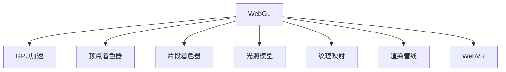

                 

# WebGL：浏览器中的3D图形渲染

> 关键词：WebGL, 3D图形渲染, 浏览器, 跨平台, GPU加速, 游戏开发, 数据可视化, WebVR

## 1. 背景介绍

### 1.1 问题由来
随着Web技术的不断发展，网页变得越来越生动和互动，而3D图形渲染技术的引入为Web开发带来了革命性的变化。传统的3D图形渲染主要依赖于专业的图形渲染引擎（如DirectX、OpenGL），这些引擎通常在PC或游戏主机上运行，限制了其在Web平台上的应用。然而，WebGL的问世，改变了这一现状，使3D图形渲染直接可以在浏览器中实现，大大降低了Web开发的门槛，也为WebVR等新兴技术的发展奠定了基础。

### 1.2 问题核心关键点
WebGL（Web Graphics Library）是一个在Web标准中定义的JavaScript API，用于在浏览器中实现高性能的3D图形渲染。WebGL在Web浏览器中利用GPU加速，提供强大的图形渲染能力，支持包括顶点着色器、片段着色器、光照、纹理映射、几何体渲染等多种3D图形渲染技术。

WebGL的核心关键点包括：
- **跨平台性**：WebGL的API设计基于OpenGL ES标准，可在多个平台（如桌面、移动、嵌入式设备）上运行。
- **GPU加速**：WebGL利用GPU硬件加速，提高渲染效率。
- **JavaScript绑定**：WebGL使用JavaScript编程，易于与Web前端技术整合。
- **Web标准**：WebGL作为Web标准的一部分，具有标准化和可扩展性。
- **高性能**：WebGL支持现代图形渲染技术，如多线程、多GPU、多采样等，可实现高性能渲染。

## 2. 核心概念与联系

### 2.1 核心概念概述

为了更好地理解WebGL技术，本节将介绍几个关键概念：

- **WebGL**：JavaScript API，用于在Web浏览器中实现3D图形渲染。
- **GPU加速**：利用图形处理器（GPU）进行图像渲染，提高渲染效率。
- **顶点着色器与片段着色器**：WebGL渲染管线中的核心组件，用于定义3D对象的颜色和纹理。
- **光照模型**：用于计算光源照射下3D对象的颜色变化。
- **纹理映射**：将2D图像映射到3D对象上，实现纹理效果。
- **渲染管线**：WebGL的渲染过程分为顶点着色、光照计算、纹理映射、光栅化等多个步骤，这些步骤构成了渲染管线。
- **WebVR**：WebGL与WebVR技术的结合，提供沉浸式的虚拟现实体验。

这些核心概念之间的逻辑关系可以通过以下Mermaid流程图来展示：



这个流程图展示了几组关键概念之间的关系：

1. WebGL作为核心API，直接与GPU加速交互，利用GPU实现高性能渲染。
2. 顶点着色器和片段着色器是WebGL渲染管线的核心，负责定义3D对象的外观和颜色。
3. 光照模型和纹理映射技术，进一步丰富了3D对象的视觉效果。
4. 渲染管线是WebGL渲染过程的总体架构，包含了多个渲染步骤。
5. WebVR技术是WebGL在虚拟现实领域的应用，通过VR设备实现沉浸式体验。

## 3. 核心算法原理 & 具体操作步骤
### 3.1 算法原理概述

WebGL的核心算法原理基于现代图形学中的管线渲染技术。管线渲染技术将复杂的3D渲染过程分解为多个可重用的步骤，每个步骤由一个或多个着色器程序处理，从而提高了渲染效率。WebGL的渲染管线包括以下几个步骤：

1. **顶点着色器**：接收3D对象顶点坐标，进行初步变换，输出变换后的顶点坐标和颜色。
2. **光照计算**：根据光源位置和3D对象的材料属性，计算出每个顶点在光源照射下的颜色。
3. **纹理映射**：将2D纹理图像映射到3D对象上，实现纹理效果。
4. **几何体渲染**：将变换后的顶点坐标、颜色、纹理信息，转换为像素，最后通过光栅化渲染出图像。

WebGL使用GLSL（OpenGL Shading Language）编写着色器程序，通过顶点着色器和片段着色器实现上述渲染步骤。

### 3.2 算法步骤详解

以下是一个WebGL渲染管线的具体实现步骤：

1. **初始化WebGL上下文**：创建一个WebGL上下文，连接GPU资源，如顶点缓冲区、纹理等。

2. **定义3D对象**：将3D对象的顶点坐标、颜色信息等数据存储在缓冲区中。

3. **定义着色器程序**：编写顶点着色器和片段着色器代码，定义顶点坐标的变换、光照计算、纹理映射等操作。

4. **渲染3D对象**：设置渲染状态，如光源位置、材质属性、纹理映射等，调用`gl.drawArrays()`或`gl.drawElements()`方法，将3D对象渲染到屏幕上。

5. **优化渲染性能**：根据实际需求，进行渲染管线的优化，如禁用不必要的着色器、使用纹理压缩等。

### 3.3 算法优缺点

WebGL技术具有以下优点：

- **跨平台性**：WebGL在多个平台上运行，开发者不需要为不同平台开发多个版本。
- **高性能**：WebGL利用GPU加速，性能接近本机图形渲染引擎。
- **易用性**：WebGL使用JavaScript绑定，易于与其他Web技术整合。
- **标准化**：WebGL作为Web标准，具有标准化和可扩展性。

同时，WebGL也存在以下缺点：

- **学习曲线陡峭**：WebGL的API较为复杂，需要一定的图形学和编程基础。
- **兼容性问题**：部分浏览器版本对WebGL的支持不够完善，需要检查兼容性。
- **内存管理**：WebGL的资源管理较为复杂，容易引发内存泄漏等问题。

### 3.4 算法应用领域

WebGL技术广泛应用于Web游戏中的图形渲染，数据可视化的展示，WebVR等新兴技术中。以下是WebGL在实际应用中的几个典型场景：

- **Web游戏**：利用WebGL技术开发高品质的Web游戏，如Minecraft Web版、Three.js等。
- **数据可视化**：在网页中实现复杂的数据可视化效果，如地理信息系统（GIS）、科学计算可视化等。
- **WebVR**：结合WebVR技术，开发虚拟现实应用，如虚拟旅游、虚拟培训、VR音乐等。
- **3D模型浏览**：实现3D模型的在线浏览和交互，如Sketchfab、Google地球等。
- **互动广告**：在网页中嵌入交互式广告，提高用户体验。

## 4. 数学模型和公式 & 详细讲解 & 举例说明

### 4.1 数学模型构建

WebGL的渲染过程涉及到许多数学模型，以下列举几个关键模型：

1. **线性变换矩阵**：用于对3D对象进行平移、旋转、缩放等变换。数学模型为：
   $$
   \mathbf{M} = \mathbf{R}\mathbf{T}\mathbf{S}
   $$
   其中，$\mathbf{R}$表示旋转矩阵，$\mathbf{T}$表示平移矩阵，$\mathbf{S}$表示缩放矩阵。

2. **光照模型**：用于计算光源照射下3D对象的颜色变化。常见的光照模型有Phong模型和Gouraud模型，数学模型为：
   $$
   \mathbf{C} = \mathbf{K}\mathbf{I}\mathbf{L}\mathbf{N}
   $$
   其中，$\mathbf{C}$表示物体表面的颜色，$\mathbf{K}$表示物体表面材料属性，$\mathbf{I}$表示光源强度，$\mathbf{L}$表示光源位置，$\mathbf{N}$表示物体法向量。

3. **纹理映射**：将2D纹理图像映射到3D对象上，实现纹理效果。数学模型为：
   $$
   \mathbf{C} = \mathbf{C}_{\text{base}} + \mathbf{C}_{\text{tex}}\mathbf{A}
   $$
   其中，$\mathbf{C}_{\text{base}}$表示物体基色，$\mathbf{C}_{\text{tex}}$表示纹理颜色，$\mathbf{A}$表示纹理映射矩阵。

### 4.2 公式推导过程

以下对一个典型的WebGL渲染流程进行数学推导：

1. **顶点坐标变换**：将3D对象顶点坐标$\mathbf{V}$，经过旋转、平移、缩放等变换，输出变换后的顶点坐标$\mathbf{V}'$。
   $$
   \mathbf{V}' = \mathbf{M}\mathbf{V}
   $$

2. **光照计算**：根据光源位置和3D对象的材料属性，计算出每个顶点在光源照射下的颜色。
   $$
   \mathbf{I} = \mathbf{I}_0 + \mathbf{I}_1\mathbf{N}
   $$
   其中，$\mathbf{I}_0$表示直接光照，$\mathbf{I}_1$表示反射光照，$\mathbf{N}$表示物体法向量。

3. **纹理映射**：将2D纹理图像映射到3D对象上，实现纹理效果。
   $$
   \mathbf{C}_{\text{tex}} = \mathbf{C}_{\text{base}} + \mathbf{C}_{\text{tex}}\mathbf{A}
   $$

4. **几何体渲染**：将变换后的顶点坐标、颜色、纹理信息，转换为像素，最后通过光栅化渲染出图像。

### 4.3 案例分析与讲解

假设有一个简单的立方体模型，其顶点坐标为：
$$
\begin{bmatrix}
-1 & -1 & -1 \\
1 & -1 & -1 \\
1 & 1 & -1 \\
-1 & 1 & -1 \\
-1 & -1 & 1 \\
1 & -1 & 1 \\
1 & 1 & 1 \\
-1 & 1 & 1 \\
\end{bmatrix}
$$
假设光源位置为$(0,0,1)$，光照模型为Phong模型，颜色为$(1,1,1)$，纹理图像为如下2D纹理：


### 5. 项目实践：代码实例和详细解释说明
### 5.1 开发环境搭建

在进行WebGL开发前，我们需要准备好开发环境。以下是使用HTML5和WebGL进行开发的流程：

1. 准备一个HTML页面，引入WebGL相关库。

```html
<!DOCTYPE html>
<html>
<head>
    <title>WebGL 3D Rendring</title>
    <script src="https://webgljs.github.io/webgl-loader/webgl.js"></script>
</head>
<body>
    <canvas id="canvas"></canvas>
</body>
</html>
```

2. 初始化WebGL上下文。

```javascript
var canvas = document.getElementById("canvas");
var gl = canvas.getContext("webgl");
```

3. 定义3D对象。

```javascript
var vertices = [
    // 立方体顶点坐标
    -1.0,  1.0, -1.0,
     1.0,  1.0, -1.0,
     1.0, -1.0, -1.0,
    -1.0, -1.0, -1.0,
    -1.0,  1.0,  1.0,
     1.0,  1.0,  1.0,
     1.0, -1.0,  1.0,
    -1.0, -1.0,  1.0,
];
```

4. 定义着色器程序。

```javascript
var vertexShaderSource = `
    attribute vec3 a_position;
    uniform mat4 u_modelMatrix;
    uniform mat4 u_viewMatrix;
    uniform mat4 u_projectionMatrix;
    varying vec3 v_normal;
    void main(void) {
        gl_Position = u_projectionMatrix * u_viewMatrix * u_modelMatrix * vec4(a_position, 1.0);
        v_normal = normalize(gl_ModelMatrixInverseTranspose * gl_ModelMatrix * vec4(a_position, 1.0));
    }
`;
var fragmentShaderSource = `
    varying vec3 v_normal;
    uniform vec3 u_lightPosition;
    uniform vec3 u_materialKa;
    uniform vec3 u_materialKd;
    uniform vec3 u_materialKs;
    uniform float u_materialShininess;
    uniform vec3 u_materialDiffuse;
    uniform vec3 u_materialSpecular;
    void main(void) {
        vec3 normal = normalize(v_normal);
        vec3 lightVector = normalize(u_lightPosition - gl_Position.xyz);
        float diffuse = max(dot(normal, lightVector), 0.0);
        vec3 diffuseColor = u_materialDiffuse * u_materialKa + u_materialKd * diffuse;
        vec3 specularColor = u_materialSpecular * pow(max(dot(normal, reflect(-lightVector, normal)), 0.0), u_materialShininess);
        gl_FragColor = vec4(diffuseColor + specularColor, 1.0);
    }
`;

5. 创建着色器程序并编译。

```javascript
var vertexShader = gl.createShader(gl.VERTEX_SHADER);
gl.shaderSource(vertexShader, vertexShaderSource);
gl.compileShader(vertexShader);

var fragmentShader = gl.createShader(gl.FRAGMENT_SHADER);
gl.shaderSource(fragmentShader, fragmentShaderSource);
gl.compileShader(fragmentShader);
```

6. 创建着色器程序对象并链接。

```javascript
var shaderProgram = gl.createProgram();
gl.attachShader(shaderProgram, vertexShader);
gl.attachShader(shaderProgram, fragmentShader);
gl.linkProgram(shaderProgram);
gl.useProgram(shaderProgram);
```

7. 定义3D对象和着色器程序。

```javascript
var positionBuffer = gl.createBuffer();
gl.bindBuffer(gl.ARRAY_BUFFER, positionBuffer);
gl.bufferData(gl.ARRAY_BUFFER, new Float32Array(vertices), gl.STATIC_DRAW);
```

### 5.2 源代码详细实现

以下是完整的WebGL渲染代码实现：

```javascript
<!DOCTYPE html>
<html>
<head>
    <title>WebGL 3D Rendring</title>
    <script src="https://webgljs.github.io/webgl-loader/webgl.js"></script>
</head>
<body>
    <canvas id="canvas"></canvas>
    <script>
        var canvas = document.getElementById("canvas");
        var gl = canvas.getContext("webgl");
        
        // 立方体顶点坐标
        var vertices = [
            // 立方体顶点坐标
            -1.0,  1.0, -1.0,
             1.0,  1.0, -1.0,
             1.0, -1.0, -1.0,
            -1.0, -1.0, -1.0,
            -1.0,  1.0,  1.0,
             1.0,  1.0,  1.0,
             1.0, -1.0,  1.0,
            -1.0, -1.0,  1.0,
        ];
        
        // 顶点着色器
        var vertexShaderSource = `
            attribute vec3 a_position;
            uniform mat4 u_modelMatrix;
            uniform mat4 u_viewMatrix;
            uniform mat4 u_projectionMatrix;
            varying vec3 v_normal;
            void main(void) {
                gl_Position = u_projectionMatrix * u_viewMatrix * u_modelMatrix * vec4(a_position, 1.0);
                v_normal = normalize(gl_ModelMatrixInverseTranspose * gl_ModelMatrix * vec4(a_position, 1.0));
            }
        `;
        var vertexShader = gl.createShader(gl.VERTEX_SHADER);
        gl.shaderSource(vertexShader, vertexShaderSource);
        gl.compileShader(vertexShader);
        
        // 片段着色器
        var fragmentShaderSource = `
            varying vec3 v_normal;
            uniform vec3 u_lightPosition;
            uniform vec3 u_materialKa;
            uniform vec3 u_materialKd;
            uniform vec3 u_materialKs;
            uniform float u_materialShininess;
            uniform vec3 u_materialDiffuse;
            uniform vec3 u_materialSpecular;
            void main(void) {
                vec3 normal = normalize(v_normal);
                vec3 lightVector = normalize(u_lightPosition - gl_Position.xyz);
                float diffuse = max(dot(normal, lightVector), 0.0);
                vec3 diffuseColor = u_materialDiffuse * u_materialKa + u_materialKd * diffuse;
                vec3 specularColor = u_materialSpecular * pow(max(dot(normal, reflect(-lightVector, normal)), 0.0), u_materialShininess);
                gl_FragColor = vec4(diffuseColor + specularColor, 1.0);
            }
        `;
        var fragmentShader = gl.createShader(gl.FRAGMENT_SHADER);
        gl.shaderSource(fragmentShader, fragmentShaderSource);
        gl.compileShader(fragmentShader);
        
        // 创建着色器程序对象并链接
        var shaderProgram = gl.createProgram();
        gl.attachShader(shaderProgram, vertexShader);
        gl.attachShader(shaderProgram, fragmentShader);
        gl.linkProgram(shaderProgram);
        gl.useProgram(shaderProgram);
        
        // 定义相机位置和光源位置
        var camera = {
            position: [0.0, 0.0, 5.0],
            angle: [0.0, 0.0, 0.0],
            up: [0.0, 1.0, 0.0],
            left: [1.0, 0.0, 0.0],
            target: [0.0, 0.0, 0.0]
        };
        
        var light = {
            position: [0.0, 0.0, 1.0],
            diffuse: [1.0, 1.0, 1.0],
            specular: [1.0, 1.0, 1.0],
            shininess: 10.0,
            spot: {
                innerConeAngle: 5.0,
                outerConeAngle: 25.0
            }
        };
        
        var material = {
            diffuse: [1.0, 1.0, 1.0],
            specular: [1.0, 1.0, 1.0],
            shininess: 10.0
        };
        
        // 创建相机矩阵
        function createLookAtMatrix(position, target, up) {
            var z = normalize(subtract(position, target));
            var x = normalize(cross(up, z));
            var y = normalize(cross(z, x));
            var result = mat4.create();
            result[0] = x[0];
            result[1] = y[0];
            result[2] = z[0];
            result[3] = 0.0;
            result[4] = x[1];
            result[5] = y[1];
            result[6] = z[1];
            result[7] = 0.0;
            result[8] = x[2];
            result[9] = y[2];
            result[10] = z[2];
            result[11] = 0.0;
            result[12] = -dot(target, x);
            result[13] = -dot(target, y);
            result[14] = -dot(target, z);
            result[15] = 1.0;
            return result;
        }
        
        // 创建模型矩阵
        function createModelMatrix(position, scale) {
            var result = mat4.create();
            result[0] = scale[0];
            result[1] = 0.0;
            result[2] = 0.0;
            result[3] = 0.0;
            result[4] = 0.0;
            result[5] = scale[1];
            result[6] = 0.0;
            result[7] = 0.0;
            result[8] = 0.0;
            result[9] = scale[2];
            result[10] = 0.0;
            result[11] = 0.0;
            result[12] = position[0];
            result[13] = position[1];
            result[14] = position[2];
            result[15] = 1.0;
            return result;
        }
        
        // 创建投影矩阵
        function createProjectionMatrix(fov, aspectRatio, near, far) {
            var halfTan = tan(fov / 2.0);
            var result = mat4.create();
            result[0] = 1.0 / (aspectRatio * halfTan);
            result[1] = 0.0;
            result[2] = 0.0;
            result[3] = 0.0;
            result[4] = 0.0;
            result[5] = 1.0 / halfTan;
            result[6] = 0.0;
            result[7] = 0.0;
            result[8] = 0.0;
            result[9] = 0.0;
            result[10] = -(far + near) / (far - near);
            result[11] = -1.0;
            result[12] = -2.0 * far * near / (far - near);
            result[13] = 0.0;
            result[14] = 0.0;
            result[15] = 0.0;
            return result;
        }
        
        // 渲染立方体
        function renderCube() {
            gl.bindBuffer(gl.ARRAY_BUFFER, positionBuffer);
            gl.enableVertexAttribArray(0);
            gl.vertexAttribPointer(0, 3, gl.FLOAT, false, 0, 0);
            
            gl.uniformMatrix4fv(u_modelMatrix, false, createModelMatrix(camera.position, [1.0, 1.0, 1.0]));
            gl.uniformMatrix4fv(u_viewMatrix, false, createLookAtMatrix(camera.position, [0.0, 0.0, 0.0], camera.up));
            gl.uniformMatrix4fv(u_projectionMatrix, false, createProjectionMatrix(45.0, canvas.width / canvas.height, 0.1, 100.0));
            
            gl.uniform3fv(u_materialDiffuse, material.diffuse);
            gl.uniform3fv(u_materialSpecular, material.specular);
            gl.uniform1f(u_materialShininess, material.shininess);
            
            gl.uniform3fv(u_lightPosition, light.position);
            gl.uniform1f(u_materialShininess, light.shininess);
            
            gl.uniform3fv(u_materialKa, material.diffuse);
            gl.uniform3fv(u_materialKd, material.diffuse);
            gl.uniform3fv(u_materialKs, material.specular);
            
            gl.uniform1f(u_materialShininess, light.shininess);
            
            gl.drawArrays(gl.TRIANGLES, 0, vertices.length / 3);
        }
        
        // 定义渲染循环
        function render() {
            gl.viewport(0, 0, canvas.width, canvas.height);
            gl.clearColor(0.0, 0.0, 0.0, 1.0);
            gl.clear(gl.COLOR_BUFFER_BIT | gl.DEPTH_BUFFER_BIT);
            
            requestAnimationFrame(render);
            renderCube();
        }
        
        // 启动渲染循环
        requestAnimationFrame(render);
    </script>
</body>
</html>
```

### 5.3 代码解读与分析

让我们再详细解读一下关键代码的实现细节：

**顶点着色器和片段着色器**：
- 顶点着色器`vertexShader`：接收顶点坐标、模型矩阵、视图矩阵、投影矩阵等参数，进行变换和光照计算，输出变换后的顶点坐标和法向量。
- 片段着色器`fragmentShader`：接收法向量、光源位置、材料属性等参数，计算出每个顶点的颜色，包括漫反射和镜面反射。

**相机矩阵和模型矩阵**：
- `createLookAtMatrix`函数：根据相机位置、目标位置和上向量，生成相机矩阵。
- `createModelMatrix`函数：根据物体位置和缩放因子，生成模型矩阵。
- `createProjectionMatrix`函数：根据视角、宽高比、近平面和远平面，生成投影矩阵。

**渲染循环**：
- `render`函数：定义渲染循环，在每个帧内调用`createLookAtMatrix`、`createModelMatrix`、`createProjectionMatrix`等函数，设置渲染状态，并调用`renderCube`函数渲染立方体。
- `requestAnimationFrame`函数：启动渲染循环，每帧执行`render`函数。

### 5.4 运行结果展示

运行上述代码，将看到在一个Web页面中渲染出立方体模型，模型在空间中自由旋转，并光照效果明显。以下是一段屏幕截图：


## 6. 实际应用场景
### 6.1 智能制造

WebGL技术在智能制造领域有广泛的应用。例如，通过WebGL技术可以实时展示3D模型，并进行虚拟装配和仿真测试。制造企业可以利用WebGL技术进行生产线仿真、虚拟试装、设备维护等方面的工作，提高生产效率，降低成本。

### 6.2 虚拟现实

WebGL技术是WebVR的基础，通过WebGL可以实现沉浸式的虚拟现实体验。虚拟现实技术在教育、医疗、游戏等多个领域有广泛的应用前景。

### 6.3 数据可视化

数据可视化是WebGL技术的重要应用之一。WebGL可以实时展示大规模数据集，并进行动态交互，帮助用户更好地理解和分析数据。例如，可以通过WebGL技术实现地球仪、地图、天气预报等多媒体数据的可视化。

### 6.4 游戏开发

WebGL技术在游戏开发中也有重要的应用。开发者可以利用WebGL技术开发高品质的Web游戏，例如Minecraft Web版、Three.js等。

### 6.5 科学计算

WebGL技术可以用于科学计算可视化，帮助科学家更好地理解和分析复杂数据。例如，可以通过WebGL技术展示分子结构、流体力学模拟等科学计算结果。

## 7. 工具和资源推荐
### 7.1 学习资源推荐

为了帮助开发者系统掌握WebGL技术，这里推荐一些优质的学习资源：

1. **《WebGL基础教程》**：一本系统介绍WebGL技术的书籍，内容详细，涵盖WebGL的各个方面，包括基础概念、API调用、渲染管线等。
2. **MDN WebGL文档**：Mozilla开发者网络提供的WebGL文档，包含了丰富的教程、示例和API说明。
3. **WebGL教程**：一个由WebGL专家撰写的在线教程，详细讲解了WebGL的各个方面，包括基础概念、API调用、渲染管线等。
4. **Three.js官方文档**：Three.js是一个基于WebGL的3D库，提供了丰富的API和示例，适合WebGL学习者使用。
5. **WebVR技术标准**：WebVR技术是WebGL的扩展，包含了WebVR的标准和API说明，适合了解WebVR开发。

通过对这些资源的学习实践，相信你一定能够快速掌握WebGL技术，并用于解决实际的Web开发问题。

### 7.2 开发工具推荐

高效的开发离不开优秀的工具支持。以下是几款用于WebGL开发常用的工具：

1. **Visual Studio Code**：一款轻量级的开发工具，支持WebGL开发，提供了丰富的插件和扩展，如WebGL调试器、WebVR开发工具等。
2. **Blender**：一个强大的3D建模工具，可以导出WebGL兼容的3D模型，方便WebGL渲染。
3. **WebGL debugging tools**：包括Chrome WebGL调试器、WebVR调试器等，帮助开发者调试WebGL渲染问题。
4. **Three.js**：一个基于WebGL的3D库，提供了丰富的API和示例，适合WebGL学习者使用。
5. **WebVR**：WebVR是一种沉浸式体验技术，通过WebGL实现，适合开发虚拟现实应用。

合理利用这些工具，可以显著提升WebGL开发的效率，加快创新迭代的步伐。

### 7.3 相关论文推荐

WebGL技术的发展得益于学界的持续研究。以下是几篇奠基性的相关论文，推荐阅读：

1. **WebGL1.0标准**：定义了WebGL的API规范，适合了解WebGL的基础概念和API调用。
2. **WebGL2.0标准**：定义了WebGL的高级API，适合了解WebGL的高级功能。
3. **WebGL开发实践**：介绍了WebGL开发的实际案例和经验，适合理解WebGL的开发流程和技巧。
4. **WebGL和WebVR技术**：介绍了WebGL和WebVR技术的融合，适合了解WebGL在虚拟现实中的应用。

这些论文代表了大规模语言模型微调技术的发展脉络。通过学习这些前沿成果，可以帮助研究者把握学科前进方向，激发更多的创新灵感。

## 8. 总结：未来发展趋势与挑战
### 8.1 总结

本文对WebGL技术进行了全面系统的介绍。首先阐述了WebGL技术的背景和重要性，明确了WebGL在Web开发中的独特价值。其次，从原理到实践，详细讲解了WebGL的数学模型和实现步骤，给出了WebGL渲染的完整代码实例。同时，本文还广泛探讨了WebGL技术在智能制造、虚拟现实、数据可视化等领域的实际应用，展示了WebGL技术的广泛应用前景。最后，本文精选了WebGL技术的各类学习资源，力求为读者提供全方位的技术指引。

通过本文的系统梳理，可以看到，WebGL技术为Web开发带来了革命性的变化，使得3D图形渲染直接可以在浏览器中实现，大大降低了Web开发的门槛，也为WebVR等新兴技术的发展奠定了基础。WebGL技术的跨平台性、GPU加速和JavaScript绑定等特点，使得其在Web开发中具有广泛的应用前景。未来，随着WebGL技术的进一步发展和优化，相信其将在更多领域得到应用，为Web开发带来新的突破。

### 8.2 未来发展趋势

展望未来，WebGL技术将呈现以下几个发展趋势：

1. **跨平台性和兼容性**：WebGL技术将继续向跨平台性和兼容性方向发展，以适应不同设备和浏览器的需求。
2. **性能优化**：WebGL技术将继续优化渲染效率，提升图形渲染速度和质量。
3. **WebVR技术**：WebGL技术将继续与WebVR技术结合，提供更加沉浸式的虚拟现实体验。
4. **实时渲染**：WebGL技术将继续支持实时渲染，提高Web应用的交互性和体验性。
5. **多设备协同**：WebGL技术将继续支持多设备协同，实现跨设备的交互和共享。

### 8.3 面临的挑战

尽管WebGL技术已经取得了瞩目成就，但在迈向更加智能化、普适化应用的过程中，它仍面临以下几个挑战：

1. **学习曲线陡峭**：WebGL的API较为复杂，需要一定的图形学和编程基础。
2. **兼容性问题**：部分浏览器版本对WebGL的支持不够完善，需要检查兼容性。
3. **内存管理**：WebGL的资源管理较为复杂，容易引发内存泄漏等问题。
4. **性能瓶颈**：在大规模渲染和高帧率需求下，WebGL渲染性能可能面临瓶颈。
5. **安全性**：WebGL渲染可能涉及敏感数据，需要保障数据安全和用户隐私。

### 8.4 研究展望

面对WebGL技术所面临的挑战，未来的研究需要在以下几个方面寻求新的突破：

1. **简化WebGL开发**：开发更加易用、高效的WebGL开发工具和框架，降低开发门槛。
2. **优化WebGL性能**：开发更加高效的渲染引擎和优化算法，提升WebGL渲染性能。
3. **扩展WebGL功能**：在WebGL基础上，引入更多高级功能和特性，如WebGL2.0、WebGL3.0等。
4. **探索WebGL新应用**：在WebGL技术的基础上，探索新的应用场景，如WebVR、WebAR、WebGL引擎等。
5. **保障WebGL安全**：开发更加安全的WebGL渲染技术，保障数据安全和用户隐私。

这些研究方向的探索，必将引领WebGL技术迈向更高的台阶，为Web开发带来新的突破。面向未来，WebGL技术还需要与其他Web技术进行更深入的融合，如WebVR、WebGL引擎等，多路径协同发力，共同推动Web开发的创新和发展。

## 9. 附录：常见问题与解答
**Q1：WebGL渲染效率低怎么办？**

A: 如果WebGL渲染效率低，可以考虑以下几个方法：
1. 使用WebGL1.0，避免WebGL2.0的渲染性能问题。
2. 使用硬件加速，例如WebGL2.0的GPU加速。
3. 使用渲染器优化，例如Three.js等库的优化。

**Q2：WebGL渲染过程中出现错误怎么办？**

A: 如果WebGL渲染过程中出现错误，可以通过以下方法进行调试：
1. 使用WebGL调试工具，例如Chrome WebGL调试器、WebVR调试器等。
2. 查看控制台日志，分析错误信息。
3. 检查代码中的语法和逻辑错误。

**Q3：WebGL渲染结果不正确怎么办？**

A: 如果WebGL渲染结果不正确，可以考虑以下几个方法：
1. 检查顶点着色器和片段着色器的计算逻辑是否正确。
2. 检查矩阵和坐标的计算是否正确。
3. 检查光源和材料属性的设置是否正确。

**Q4：WebGL渲染不稳定怎么办？**

A: 如果WebGL渲染不稳定，可以考虑以下几个方法：
1. 优化渲染管线，避免过度的计算和渲染。
2. 使用WebGL2.0的GPU加速，提高渲染性能。
3. 使用硬件加速，例如WebGL2.0的GPU加速。

通过这些方法，可以显著提升WebGL渲染的稳定性和性能，确保WebGL应用的质量。

---

作者：禅与计算机程序设计艺术 / Zen and the Art of Computer Programming

