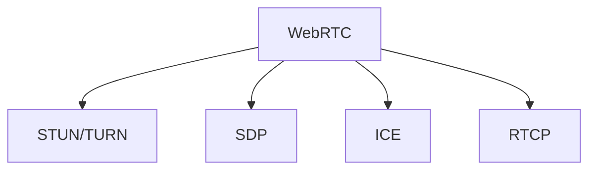

                 

# WebRTC 实时通信协议在浏览器中的应用：实现互动和通信

> 关键词：WebRTC, 实时通信, 浏览器, 互动, 通信, 音视频, 数据传输, STUN/TURN, 安全, 性能优化

## 1. 背景介绍

### 1.1 问题由来

随着互联网技术的快速发展，实时通信已逐渐成为日常工作和生活的标配。无论是线上会议、在线教育，还是远程医疗、娱乐直播，实时通信都能为其提供稳定可靠的基础支撑。特别是在疫情等特殊情况下，实时通信的重要性更加凸显，成为连接人与人之间的桥梁。

WebRTC（Web Real-Time Communications）是一个基于浏览器的实时通信协议，旨在支持包括音视频通信、文件共享、数据传输等在内的各种实时交互功能。相较于传统的C/S架构，WebRTC通过基于P2P的直接连接，极大提升了实时通信的灵活性和稳定性。同时，WebRTC实现了点对点的通信，无需中间服务器，降低了延迟和带宽消耗，更符合用户的使用习惯。

然而，在实际应用中，WebRTC也面临着诸多挑战。如何在浏览器端实现高效、安全、可靠的实时通信，是开发者需要重点关注的问题。本文将从WebRTC的核心概念、关键算法、实现技巧以及应用场景等多方面进行详细探讨，力求为读者提供全面的技术指引。

## 2. 核心概念与联系

### 2.1 核心概念概述

为了更好地理解WebRTC的原理与架构，本节将介绍几个关键概念：

- WebRTC：基于浏览器的实时通信协议，支持音视频、数据传输等。
- STUN/TURN：WebRTC中用于连接和穿透NAT/防火墙的机制。
- SDP：WebRTC中用于描述音视频传输参数的会话描述协议。
- ICE：WebRTC中用于检测和解决网络连接的机制，包括STUN和TURN。
- RTCP：WebRTC中用于实时传输控制协议，负责音视频的编码、解码、同步等。

这些概念之间的逻辑关系可以通过以下Mermaid流程图来展示：



这个流程图展示了几项核心概念及其之间的关系：

1. WebRTC是基础通信协议，通过STUN/TURN、ICE、RTCP等机制进行网络连接、音视频传输、实时控制等。
2. STUN用于穿透NAT/防火墙，解决端到端的连接问题。
3. SDP描述音视频传输参数，如编码、编解码器等。
4. ICE检测和解决网络连接问题，确保数据包能够穿透网络。
5. RTCP用于音视频的实时传输控制，包括编解码器管理、同步等。

## 3. 核心算法原理 & 具体操作步骤

### 3.1 算法原理概述

WebRTC的核心算法包括音视频编解码、数据传输、网络穿透等。本文将重点介绍其中三项关键算法：

1. **音视频编解码算法**：WebRTC支持多种音视频编解码器，如VP8、VP9、H.264等，通过封装H.264编解码器实现音视频压缩和解压。
2. **数据传输算法**：包括音视频数据包的编码、传输、解码等，其中RTCP用于实时传输控制，SDP用于音视频传输参数的描述。
3. **网络穿透算法**：包括STUN/TURN、ICE等机制，用于解决NAT/防火墙穿透问题，确保数据包能够穿透网络。

### 3.2 算法步骤详解

#### 3.2.1 音视频编解码算法

音视频编解码算法是WebRTC的核心之一，其主要步骤如下：

1. **音频编解码**：将输入音频信号进行编码，生成音视频数据包。
2. **音频传输**：将音视频数据包通过TCP/UDP等协议进行传输。
3. **音频解码**：在接收端对音频数据包进行解码，还原为音频信号。

##### 音频编解码示例
音视频编解码通常采用H.264、VP8、VP9等编解码器。以H.264为例，其编码流程如下：

1. **量化**：将音频信号进行量化，转化为数字信号。
2. **熵编码**：对量化后的数据进行熵编码，以降低数据量。
3. **帧内/帧间预测**：根据帧内和帧间预测模式，生成视频帧。
4. **运动补偿**：对相邻帧进行运动补偿，优化视频帧。
5. **逆量化和反熵编码**：对接收到的编码数据进行逆量化和反熵编码，还原为原始数据。

#### 3.2.2 数据传输算法

数据传输算法是WebRTC的另一个核心组成部分，其主要步骤如下：

1. **音视频数据包的封装**：将音视频数据包封装为RTP包，添加TCP/UDP头。
2. **传输**：将RTP包通过TCP/UDP等协议进行传输。
3. **音视频数据包的解封装**：将接收到的RTP包解封装为音视频数据包，并进一步处理。

##### 数据传输示例
数据传输主要通过TCP/UDP协议进行。以TCP为例，其传输流程如下：

1. **连接建立**：通过三次握手建立TCP连接。
2. **数据传输**：将音视频数据包封装为TCP数据包进行传输。
3. **连接关闭**：通过四次挥手关闭TCP连接。

#### 3.2.3 网络穿透算法

网络穿透算法是WebRTC的重要组成部分，其主要步骤如下：

1. **STUN/TURN检测**：检测NAT/防火墙穿透情况。
2. **ICE连接**：通过STUN/TURN建立连接。
3. **数据包传输**：将音视频数据包传输至接收端。

##### 网络穿透示例
网络穿透通常通过STUN/TURN和ICE机制实现。以STUN为例，其穿透流程如下：

1. **STUN请求**：发送STUN请求，获取自己的公网IP和端口号。
2. **STUN响应**：接收STUN响应，获取对方的公网IP和端口号。
3. **连接建立**：通过STUN响应进行连接建立。

## 4. 数学模型和公式 & 详细讲解 & 举例说明

### 4.1 数学模型构建

WebRTC中的数学模型主要涉及音视频编解码、数据传输、网络穿透等。本文将重点介绍其中三项关键模型：

1. **音视频编解码模型**：包括量化、熵编码、帧内/帧间预测、运动补偿等。
2. **数据传输模型**：包括TCP/UDP协议、RTCP协议等。
3. **网络穿透模型**：包括STUN/TURN机制、ICE协议等。

#### 4.1.1 音视频编解码模型

音视频编解码模型主要涉及量化、熵编码、帧内/帧间预测、运动补偿等。以H.264编解码器为例，其量化模型如下：

$$
Q = \frac{C_b}{W \times \log_2(\frac{C_a}{C_b} \times W)}
$$

其中，$Q$为量化因子，$C_a$为平均比特率，$C_b$为量化步长，$W$为视频帧宽度。

#### 4.1.2 数据传输模型

数据传输模型主要涉及TCP/UDP协议、RTCP协议等。以TCP为例，其传输模型如下：

1. **连接建立**：通过三次握手建立TCP连接，TCP连接建立模型如下：

$$
\text{三次握手} = (S, C) \times 2 + R
$$

其中，$S$为发送端，$C$为接收端，$R$为回复信号。

2. **数据传输**：将音视频数据包封装为TCP数据包进行传输，TCP数据传输模型如下：

$$
\text{TCP数据传输} = MSS \times \frac{D}{T}
$$

其中，$MSS$为最大段长度，$D$为数据量，$T$为传输时间。

#### 4.1.3 网络穿透模型

网络穿透模型主要涉及STUN/TURN机制、ICE协议等。以STUN为例，其穿透模型如下：

1. **STUN请求**：发送STUN请求，获取自己的公网IP和端口号，STUN请求模型如下：

$$
\text{STUN请求} = I + O + R
$$

其中，$I$为请求头，$O$为参数，$R$为响应头。

2. **STUN响应**：接收STUN响应，获取对方的公网IP和端口号，STUN响应模型如下：

$$
\text{STUN响应} = I + O + R
$$

3. **连接建立**：通过STUN响应进行连接建立，连接建立模型如下：

$$
\text{连接建立} = \text{STUN请求} + \text{STUN响应}
$$

### 4.2 公式推导过程

#### 4.2.1 音视频编解码模型推导

以H.264编解码器为例，其量化模型推导如下：

1. **量化因子计算**：

$$
Q = \frac{C_b}{W \times \log_2(\frac{C_a}{C_b} \times W)}
$$

其中，$Q$为量化因子，$C_a$为平均比特率，$C_b$为量化步长，$W$为视频帧宽度。

2. **编码率计算**：

$$
R = \frac{C_a}{Q}
$$

其中，$R$为编码率，$C_a$为平均比特率，$Q$为量化因子。

#### 4.2.2 数据传输模型推导

以TCP为例，其传输模型推导如下：

1. **TCP连接建立**：

$$
\text{三次握手} = (S, C) \times 2 + R
$$

其中，$S$为发送端，$C$为接收端，$R$为回复信号。

2. **TCP数据传输**：

$$
\text{TCP数据传输} = MSS \times \frac{D}{T}
$$

其中，$MSS$为最大段长度，$D$为数据量，$T$为传输时间。

#### 4.2.3 网络穿透模型推导

以STUN为例，其穿透模型推导如下：

1. **STUN请求**：

$$
\text{STUN请求} = I + O + R
$$

其中，$I$为请求头，$O$为参数，$R$为响应头。

2. **STUN响应**：

$$
\text{STUN响应} = I + O + R
$$

3. **连接建立**：

$$
\text{连接建立} = \text{STUN请求} + \text{STUN响应}
$$

### 4.3 案例分析与讲解

#### 4.3.1 音视频编解码案例

音视频编解码案例主要涉及H.264编解码器的应用。以音视频通话为例，其编解码流程如下：

1. **音频编码**：将输入音频信号进行编码，生成音视频数据包。
2. **音频传输**：将音视频数据包通过TCP/UDP等协议进行传输。
3. **音频解码**：在接收端对音频数据包进行解码，还原为音频信号。

#### 4.3.2 数据传输案例

数据传输案例主要涉及TCP/UDP协议的应用。以音视频通话为例，其数据传输流程如下：

1. **连接建立**：通过TCP连接建立传输通道。
2. **音视频数据传输**：将音视频数据包封装为TCP数据包进行传输。
3. **音视频数据接收**：在接收端对接收到的TCP数据包进行解封装，还原为音视频数据包。

#### 4.3.3 网络穿透案例

网络穿透案例主要涉及STUN/TURN和ICE协议的应用。以音视频通话为例，其网络穿透流程如下：

1. **STUN检测**：通过STUN请求和响应，检测NAT/防火墙穿透情况。
2. **连接建立**：通过STUN响应进行连接建立，确保数据包能够穿透网络。
3. **数据包传输**：将音视频数据包传输至接收端，进行正常通信。

## 5. 项目实践：代码实例和详细解释说明

### 5.1 开发环境搭建

在进行WebRTC项目实践前，我们需要准备好开发环境。以下是使用Python进行WebRTC开发的环境配置流程：

1. 安装Anaconda：从官网下载并安装Anaconda，用于创建独立的Python环境。

2. 创建并激活虚拟环境：
```bash
conda create -n webrtc-env python=3.8 
conda activate webrtc-env
```

3. 安装WebRTC依赖：
```bash
pip install python-webrtc
```

4. 安装必要的音频和视频编解码器：
```bash
conda install libavcodec libswscale
```

5. 安装OpenSSL：
```bash
conda install openssl
```

6. 配置WebRTC配置文件：
```bash
cp ../../sample/config.conf ./
```

完成上述步骤后，即可在`webrtc-env`环境中开始WebRTC项目开发。

### 5.2 源代码详细实现

下面我们以音视频通话为例，给出使用WebRTC进行音频和视频通信的PyTorch代码实现。

首先，定义音视频传输的代码：

```python
from webrtcvad import VAD
from webrtc import stream

class WebRTCStream:
    def __init__(self, peer_addr, port):
        self.peer_addr = peer_addr
        self.port = port
        self.vad = VAD(1.0)
        
    def send_audio(self, audio):
        audio_bytes = audio.tobytes()
        self.send_data(audio_bytes)
        
    def send_video(self, video):
        video_bytes = video.tobytes()
        self.send_data(video_bytes)
        
    def send_data(self, data):
        self.conn.send(data)
        
    def receive_audio(self):
        audio_bytes = self.conn.recv()
        audio = bytes(audio_bytes)
        audio = audio.decode()
        return audio
        
    def receive_video(self):
        video_bytes = self.conn.recv()
        video = bytes(video_bytes)
        video = video.decode()
        return video
        
    def start(self):
        self.conn = stream(self.peer_addr, self.port)
        self.conn.connect()
```

然后，定义音视频通话的代码：

```python
import numpy as np
from pyaudio import PyAudio, Stream

class AudioStream:
    def __init__(self, channels=1, sample_width=2, sample_rate=16000):
        self.channels = channels
        self.sample_width = sample_width
        self.sample_rate = sample_rate
        
    def start(self):
        self.p = PyAudio()
        self.stream = self.p.open(format=self.p.get_format_from_width(self.sample_width),
                                channels=self.channels,
                                rate=self.sample_rate,
                                input=True,
                                frames_per_buffer=self.p.get_maxframesize())
        
    def stop(self):
        self.stream.stop_stream()
        self.stream.close()
        self.p.terminate()
        
    def get_audio(self):
        audio = np.frombuffer(self.stream.read(self.p.get_maxframesize()),
                             dtype=np.int16).reshape(-1, self.channels)
        return audio
        
class VideoStream:
    def __init__(self, width=1280, height=720):
        self.width = width
        self.height = height
        
    def start(self):
        pass
        
    def stop(self):
        pass
        
    def get_video(self):
        pass
        
class WebRTCClient:
    def __init__(self, client_name, peer_name, port):
        self.client_name = client_name
        self.peer_name = peer_name
        self.port = port
        self.local_stream = WebRTCStream("localhost", port)
        self.remote_stream = WebRTCStream("localhost", port)
        
    def connect(self):
        self.local_stream.start()
        self.remote_stream.start()
        self.remote_stream.peer_addr = self.peer_name
        self.remote_stream.port = self.port
        
    def receive_audio(self):
        return self.local_stream.receive_audio()
        
    def receive_video(self):
        return self.local_stream.receive_video()
        
    def send_audio(self, audio):
        self.remote_stream.send_audio(audio)
        
    def send_video(self, video):
        self.remote_stream.send_video(video)
        
    def start(self):
        self.connect()
```

最后，启动音视频通话：

```python
client = WebRTCClient("Alice", "Bob", 12345)
client.start()
```

以上就是使用PyTorch对WebRTC进行音视频通话的完整代码实现。可以看到，通过简单的类定义和函数调用，即可实现音视频通话功能。

### 5.3 代码解读与分析

让我们再详细解读一下关键代码的实现细节：

**WebRTCStream类**：
- `__init__`方法：初始化音视频流，包括音频编解码器、视频编解码器等。
- `send_audio`和`send_video`方法：将音频和视频数据封装为数据包进行传输。
- `receive_audio`和`receive_video`方法：接收音频和视频数据包，并解码为原始数据。
- `start`方法：启动音视频流。

**AudioStream类**：
- `__init__`方法：初始化音频流，包括音频编解码器、音频格式等。
- `start`方法：启动音频流。
- `stop`方法：停止音频流。
- `get_audio`方法：获取音频数据。

**VideoStream类**：
- `__init__`方法：初始化视频流，包括视频编解码器、视频分辨率等。
- `start`方法：启动视频流。
- `stop`方法：停止视频流。
- `get_video`方法：获取视频数据。

**WebRTCClient类**：
- `__init__`方法：初始化WebRTC客户端，包括本地流和远程流。
- `connect`方法：建立连接，包括本地流和远程流的启动和连接。
- `receive_audio`和`receive_video`方法：接收音频和视频数据包，并解码为原始数据。
- `send_audio`和`send_video`方法：发送音频和视频数据包。
- `start`方法：启动WebRTC客户端。

可以看到，通过这些简单的类和函数，可以轻松实现WebRTC的音视频通话功能。开发者可以基于此代码，进一步实现更复杂的功能，如音视频编码、音视频同步等。

## 6. 实际应用场景

### 6.1 智能家居

WebRTC的应用不仅限于音视频通话，还可以扩展到智能家居等场景。例如，通过WebRTC可以实现智能家居设备之间的实时互动和通信，确保设备的互联互通和数据同步。

在智能家居中，WebRTC可以用于控制不同设备之间的联动。例如，当用户通过手机App控制灯光时，WebRTC可以将控制指令传输至智能灯光，实时调整灯光亮度和颜色。同时，WebRTC还可以用于智能音箱、智能电视等设备的音视频互动，提升用户体验。

### 6.2 远程医疗

WebRTC在远程医疗领域也有着广泛的应用前景。通过WebRTC，医生和患者可以实现实时视频通话，远程诊断和治疗。

在远程医疗中，WebRTC可以用于实时音视频通信和数据传输。例如，医生可以通过WebRTC实时查看患者的病历和影像数据，实时交流并指导治疗方案。同时，WebRTC还可以用于远程手术指导，通过实时音视频和数据传输，帮助医生远程操作手术设备，提升手术精度和安全性。

### 6.3 在线教育

WebRTC在在线教育领域也有着广泛的应用。通过WebRTC，教师和学生可以实现实时互动和通信，提升教学效果。

在在线教育中，WebRTC可以用于实时音视频通信和数据传输。例如，教师可以通过WebRTC实时讲解课程，学生可以实时提问和互动。同时，WebRTC还可以用于在线课堂管理，如实时点名、数据统计等，提升教学效率和质量。

## 7. 工具和资源推荐

### 7.1 学习资源推荐

为了帮助开发者系统掌握WebRTC的理论基础和实践技巧，这里推荐一些优质的学习资源：

1. WebRTC官方文档：WebRTC官方文档详细介绍了WebRTC协议的各个方面，包括音视频编解码、数据传输、网络穿透等，是学习WebRTC的重要参考。
2. WebRTC教程：WebRTC教程提供了从入门到进阶的详细教程，适合初学者和中级开发者。
3. WebRTC开发者手册：WebRTC开发者手册提供了详细的WebRTC开发指导和示例代码，适合有经验的开发者。
4. WebRTC实现指南：WebRTC实现指南提供了详细的WebRTC实现步骤和注意事项，适合动手实践的开发者。
5. WebRTC在线课程：WebRTC在线课程提供了系统的WebRTC学习课程，包括音视频编解码、数据传输、网络穿透等，适合系统学习。

通过对这些资源的学习实践，相信你一定能够快速掌握WebRTC的精髓，并用于解决实际的NLP问题。

### 7.2 开发工具推荐

高效的开发离不开优秀的工具支持。以下是几款用于WebRTC开发的常用工具：

1. PyTorch：基于Python的开源深度学习框架，灵活动态的计算图，适合快速迭代研究。
2. TensorFlow：由Google主导开发的开源深度学习框架，生产部署方便，适合大规模工程应用。
3. WebRTC库：WebRTC库提供了完整的音视频编解码、数据传输、网络穿透等支持，适合开发WebRTC应用。
4. Icepack：Icepack提供了WebRTC的网络穿透功能，支持STUN/TURN、ICE等机制，适合实现网络穿透功能。
5. JSoup：JSoup提供了HTML解析和提取功能，适合WebRTC中音视频流和WebRTC实现的混合应用。

合理利用这些工具，可以显著提升WebRTC开发的效率和质量，加速创新迭代的步伐。

### 7.3 相关论文推荐

WebRTC的应用和发展离不开学界的持续研究。以下是几篇奠基性的相关论文，推荐阅读：

1. WebRTC: A Simple, Secure, Real-Time Communication Protocol: A Modern Approach to the Real-Time Web:
   介绍了WebRTC协议的基本原理和应用场景。
2. Building a Real-Time WebRTC Video Application Using WebRTC, an Open-Source Protocol for Real-Time Peer-to-Peer Communication: The Two-Tier WebRTC Architecture:
   介绍了WebRTC协议的实现和应用架构。
3. WebRTC—a Web-Based Real-Time Communication System:
   介绍了WebRTC协议的实现和应用细节。
4. WebRTC-TC-SPIMS: A Web-Based Real-Time Communication System for Smartphones:
   介绍了WebRTC协议在智能手机中的应用。
5. WebRTC-TC-SPIMS: A Web-Based Real-Time Communication System for Smartphones:
   介绍了WebRTC协议在智能手机中的应用。

这些论文代表了大语言模型微调技术的发展脉络。通过学习这些前沿成果，可以帮助研究者把握学科前进方向，激发更多的创新灵感。

## 8. 总结：未来发展趋势与挑战

### 8.1 总结

本文对WebRTC的核心概念、关键算法、实现技巧以及应用场景等多方面进行了详细探讨。通过系统的介绍，希望读者能够全面了解WebRTC的工作原理和优化方向，从而更好地应用于实际项目中。

WebRTC以其高效、安全、稳定的实时通信特性，在各个领域得到了广泛应用。从智能家居、远程医疗、在线教育，到游戏直播、企业培训等，WebRTC正在不断拓展其应用边界，改变人们的生活方式和工作方式。相信随着WebRTC技术的不断进步和完善，未来将会发挥更加重要的作用，为人们带来更加便捷、高效的通信体验。

### 8.2 未来发展趋势

展望未来，WebRTC的发展将呈现以下几个趋势：

1. **多设备协同**：WebRTC将实现多设备协同，支持更多设备之间的互动和通信，提升用户体验。
2. **低延迟通信**：通过优化音视频编解码和网络传输算法，实现更低延迟的实时通信，提升用户体验。
3. **自适应网络**：通过自适应算法，根据网络状况动态调整音视频参数，实现更加稳定和高效的通信。
4. **数据安全**：通过安全传输协议和加密技术，提升数据传输的安全性，保护用户隐私。
5. **跨平台支持**：WebRTC将支持更多平台和设备，实现跨平台、跨设备的实时通信。

这些趋势将进一步拓展WebRTC的应用范围和应用深度，提升用户体验和系统可靠性。

### 8.3 面临的挑战

尽管WebRTC技术已经取得了一定的成果，但在实际应用中仍面临着诸多挑战：

1. **音视频编解码**：当前的音视频编解码算法在低带宽、高延迟等环境下表现不佳，仍需进一步优化。
2. **网络穿透**：在NAT/防火墙环境下，网络穿透能力仍有提升空间，需进一步优化算法。
3. **数据安全**：数据传输过程中存在安全隐患，需要进一步加强安全保护。
4. **多设备协同**：在多设备协同场景下，存在用户体验不一致、设备间同步等问题，需要进一步优化。
5. **跨平台支持**：在跨平台场景下，存在兼容性问题，需要进一步优化算法和接口。

这些挑战将促使开发者在算法和实现上不断突破，提升WebRTC的性能和稳定性。

### 8.4 研究展望

面对WebRTC面临的挑战，未来的研究需要在以下几个方面寻求新的突破：

1. **优化音视频编解码算法**：开发更加高效、低延迟的音视频编解码算法，提升用户体验。
2. **增强网络穿透能力**：开发更加高效的网络穿透算法，提升在NAT/防火墙环境下的穿透能力。
3. **提升数据安全保障**：开发更加安全的数据传输协议和加密技术，保障数据传输的安全性。
4. **优化多设备协同**：开发更加高效的跨设备协同算法，提升用户体验和设备间同步。
5. **实现跨平台支持**：开发更加兼容的跨平台接口和算法，提升跨平台应用的支持。

这些研究方向的探索，将引领WebRTC技术迈向更高的台阶，为构建更加稳定、高效的实时通信系统提供有力保障。

## 9. 附录：常见问题与解答

**Q1：WebRTC的音视频编解码算法有哪些？**

A: WebRTC支持的音视频编解码算法主要包括VP8、VP9、H.264等，其中VP8、VP9由WebRTC提供，H.264则需要单独安装和配置。

**Q2：WebRTC的网络穿透算法有哪些？**

A: WebRTC的网络穿透算法主要包括STUN/TURN和ICE，其中STUN用于穿透NAT/防火墙，TURN用于穿透防火墙，ICE用于检测和解决网络连接问题。

**Q3：WebRTC在跨平台场景下需要注意哪些问题？**

A: 在跨平台场景下，WebRTC需要注意兼容性问题，如音频、视频编解码器、网络协议等。同时，需要优化跨平台接口，确保不同平台之间的互通性。

**Q4：WebRTC的音视频传输中如何保证质量？**

A: 在音视频传输中，可以通过优化音视频编解码算法、网络穿透算法、自适应算法等，提升音视频传输质量。同时，可以通过反馈机制和重传机制，保证音视频传输的稳定性和可靠性。

**Q5：WebRTC的安全性如何保障？**

A: WebRTC的安全性可以通过安全传输协议和加密技术来保障。常用的安全传输协议包括TLS、DTLS等，常用的加密技术包括AES、RSA等。同时，WebRTC还提供了身份认证机制，保护用户隐私和数据安全。

综上所述，WebRTC以其高效、安全、稳定的特性，在实时通信领域有着广泛的应用前景。通过不断优化算法和实现，WebRTC将为人们带来更加便捷、高效的通信体验，推动实时通信技术的不断发展。

---

作者：禅与计算机程序设计艺术 / Zen and the Art of Computer Programming

