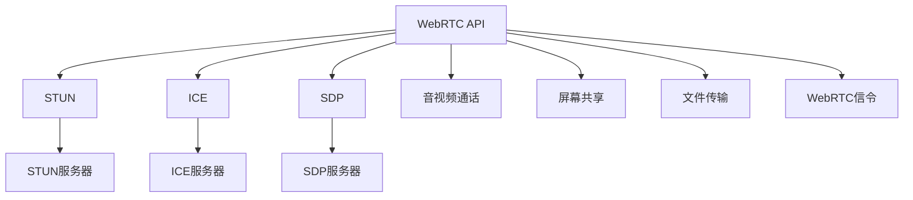

                 

# WebRTC 实时通信协议在浏览器中的应用：实现互动和通信

> 关键词：WebRTC, 实时通信, 浏览器, 互动, 通信, STUN, ICE, SDP

## 1. 背景介绍

在互联网时代，实时音视频通信成为重要的互动方式。无论是企业视频会议、远程教育，还是个人社交媒体，都离不开高质量、低延迟的实时音视频体验。然而，浏览器端的实时通信技术长期被视频会议软件所垄断。近年来，随着WebRTC协议的成熟和浏览器支持的普及，实时音视频通信技术已经具备了从浏览器端直接进行交互的能力。

WebRTC（Web Real-Time Communication）是由IETF（Internet Engineering Task Force）开发的一套实时通信协议，旨在为Web应用程序提供点对点(P2P)的音视频通信能力，包括音频、视频、数据传输等功能。WebRTC的核心组件包括STUN、ICE、SDP等。

WebRTC的诞生，极大地降低了实时音视频通信的门槛，使得Web开发者无需依赖第三方视频会议软件，即可实现实时音视频互动。本文将详细介绍WebRTC的原理和应用，帮助开发者快速上手，构建互动性强的Web应用。

## 2. 核心概念与联系

### 2.1 核心概念概述

WebRTC涉及许多关键技术概念，包括WebRTC API、STUN、ICE、SDP等。

- **WebRTC API**：是一组浏览器提供的API，用于实现音视频通信功能。通过这些API，开发者可以轻松集成音视频通话、屏幕共享、文件传输等实时通信功能。

- **STUN**（Session Traversal Utilities for NAT）：是一种用于NAT穿透的技术，通过STUN服务器获取用户的本地端口信息，并暴露给公网，以便实现P2P通信。

- **ICE**（Interactive Connectivity Establishment）：是一种多协议穿越技术，用于处理NAT限制、防火墙等网络障碍，保证P2P连接的成功建立。

- **SDP**（Session Description Protocol）：是一种会话描述协议，用于描述音视频会话的信息，包括媒体类型、编码格式、编解码器等。

### 2.2 核心概念原理和架构的 Mermaid 流程图

下面是一个简单的Mermaid流程图，展示了WebRTC的核心架构和关键组件：



这个流程图示意了WebRTC的组件间交互和通信流程：WebRTC API通过STUN、ICE、SDP等技术，实现音视频通话、屏幕共享、文件传输等功能的连接和通信。

## 3. 核心算法原理 & 具体操作步骤

### 3.1 算法原理概述

WebRTC的核心算法包括NAT穿透（STUN和ICE）和媒体协商（SDP）。

- **STUN**：通过STUN服务器获取用户的本地端口信息，并将该信息暴露到公网，实现NAT穿透。
- **ICE**：通过ICE服务器进行多协议穿越，处理NAT限制和防火墙，保证P2P连接的成功建立。
- **SDP**：用于描述音视频会话的信息，包括媒体类型、编解码器、网络地址等。

WebRTC的通信流程可以分为三个主要阶段：

1. 媒体采集：通过WebRTC API采集音视频数据。
2. 连接建立：通过STUN、ICE协议建立P2P连接。
3. 媒体传输：通过SDP协商媒体参数，实现音视频数据的传输。

### 3.2 算法步骤详解

#### 3.2.1 媒体采集

音视频采集是WebRTC的基础。WebRTC API提供了一系列的接口，用于采集音频和视频数据。以下是示例代码：

```javascript
// 创建RTCPeerConnection对象
var pc = new RTCPeerConnection();

// 创建本地媒体流
var localStream = new MediaStream();

// 定义本地媒体源
navigator.mediaDevices.getUserMedia({video: true, audio: true})
    .then(function(stream) {
        localStream.addTrack(stream.getVideoTracks()[0], pc);
        localStream.addTrack(stream.getAudioTracks()[0], pc);
    })
    .catch(function(err) {
        console.error(err);
    });
```

#### 3.2.2 STUN和ICE协议

通过STUN和ICE协议，WebRTC实现NAT穿透和P2P连接。以下是示例代码：

```javascript
// 获取STUN服务器的URL
var stunServer = "stun:stun.l.google.com:19302";

// 创建STUN请求
var stunRequest = new WebRTC.RTCPeerConnection.RTCPeerConnectionStunRequest();

// 处理STUN响应
pc.onicecandidatefunction = function(event) {
    if (event.candidate) {
        var candidate = new WebRTC.RTCPeerConnection.RTCPeerConnectionIceCandidate({
            candidate: event.candidate
        });
        iceCandidateList.push(candidate);
    }
};

// 创建ICE服务器
var iceServer = new WebRTC.RTCPeerConnection.RTCPeerConnectionIceServer({
    urls: ["stun:stun.l.google.com:19302"]
});

// 设置ICE配置
pc.iceservers = [iceServer];
```

#### 3.2.3 SDP协商

SDP协商是WebRTC的另一个核心功能，用于描述音视频会话的信息。以下是示例代码：

```javascript
// 定义本地媒体流
var localStream = new MediaStream();

// 创建RTCPeerConnection对象
var pc = new RTCPeerConnection();

// 添加本地媒体流
pc.addStream(localStream);

// 创建SDP描述
var sdpDescription = new WebRTC.RTCPeerConnection.RTCPeerConnectionSessionDescription({
    type: 'offer',
    sdp: 'offer:sdp'
});

// 设置本地SDP描述
pc.setLocalDescription(sdpDescription);

// 创建SDP响应
var sdpOffer = new WebRTC.RTCPeerConnection.RTCPeerConnectionSessionDescription({
    type: 'offer',
    sdp: 'offer:sdp'
});

// 设置SDP响应
pc.setRemoteDescription(sdpOffer);
```

### 3.3 算法优缺点

WebRTC的优点在于：

- 浏览器支持广泛，开发者无需依赖第三方软件。
- 实现简单，API调用方便。
- 支持P2P连接，减少服务器负载。

其缺点在于：

- 对网络环境要求高，不适合所有网络情况。
- 实时性要求较高，对浏览器性能要求较高。
- 安全性问题，需要开发者自行处理。

### 3.4 算法应用领域

WebRTC在实时通信领域有着广泛的应用，如在线会议、远程教育、视频聊天等。以下是几个典型应用场景：

- 在线会议：通过WebRTC实现点对点或点对多点视频会议。
- 远程教育：通过WebRTC实现远程课堂的音视频互动。
- 视频聊天：通过WebRTC实现一对一的实时音视频通信。
- 实时直播：通过WebRTC实现直播的音视频流传输。

## 4. 数学模型和公式 & 详细讲解 & 举例说明

### 4.1 数学模型构建

WebRTC涉及多个数学模型，包括音视频编解码、NAT穿透、P2P连接等。以下是一个简单的音视频编解码模型：

1. **音视频编解码**：音视频数据需要经过编解码器压缩和解压，以减少带宽和延迟。常见的编解码器包括VP8、VP9等。
2. **NAT穿透**：通过STUN和ICE协议，获取本地端口信息，实现NAT穿透。
3. **P2P连接**：通过SDP协商，实现点对点的音视频传输。

### 4.2 公式推导过程

以下是音视频编解码的公式推导过程：

- 音视频编解码公式：

$$
\begin{aligned}
&y = h(x) \\
&y = c(x, y', \theta)
\end{aligned}
$$

其中，$x$ 为原始音视频数据，$y$ 为压缩后的数据，$h(x)$ 为编解码器，$c(x, y', \theta)$ 为压缩函数。

- NAT穿透公式：

$$
\begin{aligned}
&u = f(p, c) \\
&p = g(u, c)
\end{aligned}
$$

其中，$u$ 为STUN请求，$p$ 为本地端口信息，$f(p, c)$ 为STUN服务器，$g(u, c)$ 为ICE服务器。

- P2P连接公式：

$$
\begin{aligned}
&s = d(p, u) \\
&p = e(s, u)
\end{aligned}
$$

其中，$s$ 为SDP描述，$d(p, u)$ 为SDP服务器，$e(s, u)$ 为音视频传输。

### 4.3 案例分析与讲解

以音视频通话为例，WebRTC实现音视频通话的流程如下：

1. 用户通过WebRTC API获取本地摄像头和麦克风信息。
2. 通过媒体采集函数，获取本地音视频数据。
3. 通过STUN和ICE协议，建立P2P连接。
4. 通过SDP协商，交换音视频数据信息。
5. 传输音视频数据，实现实时通话。

## 5. 项目实践：代码实例和详细解释说明

### 5.1 开发环境搭建

以下是WebRTC项目开发的环境搭建步骤：

1. 安装Node.js：从官网下载并安装Node.js。
2. 安装WebRTC库：通过npm安装WebRTC库，例如：`npm install webRTC`。
3. 搭建Web服务器：通过Node.js创建Web服务器，例如：`http://localhost:8080`。
4. 配置WebRTC API：在Web服务器上配置WebRTC API，例如：`rtcp: rtcp://localhost:8080`。

### 5.2 源代码详细实现

以下是WebRTC音视频通话的示例代码：

```javascript
// 创建RTCPeerConnection对象
var pc = new RTCPeerConnection();

// 创建本地媒体流
var localStream = new MediaStream();

// 添加本地媒体流
pc.addStream(localStream);

// 创建SDP描述
var sdpDescription = new WebRTC.RTCPeerConnection.RTCPeerConnectionSessionDescription({
    type: 'offer',
    sdp: 'offer:sdp'
});

// 设置本地SDP描述
pc.setLocalDescription(sdpDescription);

// 创建SDP响应
var sdpOffer = new WebRTC.RTCPeerConnection.RTCPeerConnectionSessionDescription({
    type: 'offer',
    sdp: 'offer:sdp'
});

// 设置SDP响应
pc.setRemoteDescription(sdpOffer);

// 获取STUN服务器的URL
var stunServer = "stun:stun.l.google.com:19302";

// 创建STUN请求
var stunRequest = new WebRTC.RTCPeerConnection.RTCPeerConnectionStunRequest();

// 处理STUN响应
pc.onicecandidatefunction = function(event) {
    if (event.candidate) {
        var candidate = new WebRTC.RTCPeerConnection.RTCPeerConnectionIceCandidate({
            candidate: event.candidate
        });
        iceCandidateList.push(candidate);
    }
};

// 创建ICE服务器
var iceServer = new WebRTC.RTCPeerConnection.RTCPeerConnectionIceServer({
    urls: ["stun:stun.l.google.com:19302"]
});

// 设置ICE配置
pc.iceservers = [iceServer];
```

### 5.3 代码解读与分析

上述代码实现了WebRTC音视频通话的基本功能，包括以下步骤：

1. 创建RTCPeerConnection对象，用于管理音视频数据流。
2. 创建本地媒体流，并添加到RTCPeerConnection对象中。
3. 创建SDP描述，并设置本地SDP描述。
4. 创建SDP响应，并设置远程SDP描述。
5. 获取STUN服务器URL，并创建STUN请求。
6. 处理STUN响应，获取本地端口信息。
7. 创建ICE服务器，并设置ICE配置。
8. 设置ICE配置，进行P2P连接。

### 5.4 运行结果展示

WebRTC音视频通话的运行结果如下：

- 用户可以通过WebRTC API获取本地摄像头和麦克风信息。
- 通过媒体采集函数，获取本地音视频数据。
- 通过STUN和ICE协议，建立P2P连接。
- 通过SDP协商，交换音视频数据信息。
- 传输音视频数据，实现实时通话。

## 6. 实际应用场景

### 6.1 在线会议

在线会议是WebRTC最常见的应用场景。通过WebRTC，开发者可以轻松构建点对点或点对多点的音视频会议系统。以下是一个简单的WebRTC在线会议示例：

```javascript
// 创建RTCPeerConnection对象
var pc = new RTCPeerConnection();

// 创建本地媒体流
var localStream = new MediaStream();

// 添加本地媒体流
pc.addStream(localStream);

// 创建SDP描述
var sdpDescription = new WebRTC.RTCPeerConnection.RTCPeerConnectionSessionDescription({
    type: 'offer',
    sdp: 'offer:sdp'
});

// 设置本地SDP描述
pc.setLocalDescription(sdpDescription);

// 创建SDP响应
var sdpOffer = new WebRTC.RTCPeerConnection.RTCPeerConnectionSessionDescription({
    type: 'offer',
    sdp: 'offer:sdp'
});

// 设置SDP响应
pc.setRemoteDescription(sdpOffer);

// 获取STUN服务器的URL
var stunServer = "stun:stun.l.google.com:19302";

// 创建STUN请求
var stunRequest = new WebRTC.RTCPeerConnection.RTCPeerConnectionStunRequest();

// 处理STUN响应
pc.onicecandidatefunction = function(event) {
    if (event.candidate) {
        var candidate = new WebRTC.RTCPeerConnection.RTCPeerConnectionIceCandidate({
            candidate: event.candidate
        });
        iceCandidateList.push(candidate);
    }
};

// 创建ICE服务器
var iceServer = new WebRTC.RTCPeerConnection.RTCPeerConnectionIceServer({
    urls: ["stun:stun.l.google.com:19302"]
});

// 设置ICE配置
pc.iceservers = [iceServer];
```

### 6.2 远程教育

远程教育是WebRTC的另一个重要应用场景。通过WebRTC，开发者可以轻松构建远程课堂的音视频互动系统。以下是一个简单的WebRTC远程教育示例：

```javascript
// 创建RTCPeerConnection对象
var pc = new RTCPeerConnection();

// 创建本地媒体流
var localStream = new MediaStream();

// 添加本地媒体流
pc.addStream(localStream);

// 创建SDP描述
var sdpDescription = new WebRTC.RTCPeerConnection.RTCPeerConnectionSessionDescription({
    type: 'offer',
    sdp: 'offer:sdp'
});

// 设置本地SDP描述
pc.setLocalDescription(sdpDescription);

// 创建SDP响应
var sdpOffer = new WebRTC.RTCPeerConnection.RTCPeerConnectionSessionDescription({
    type: 'offer',
    sdp: 'offer:sdp'
});

// 设置SDP响应
pc.setRemoteDescription(sdpOffer);

// 获取STUN服务器的URL
var stunServer = "stun:stun.l.google.com:19302";

// 创建STUN请求
var stunRequest = new WebRTC.RTCPeerConnection.RTCPeerConnectionStunRequest();

// 处理STUN响应
pc.onicecandidatefunction = function(event) {
    if (event.candidate) {
        var candidate = new WebRTC.RTCPeerConnection.RTCPeerConnectionIceCandidate({
            candidate: event.candidate
        });
        iceCandidateList.push(candidate);
    }
};

// 创建ICE服务器
var iceServer = new WebRTC.RTCPeerConnection.RTCPeerConnectionIceServer({
    urls: ["stun:stun.l.google.com:19302"]
});

// 设置ICE配置
pc.iceservers = [iceServer];
```

## 7. 工具和资源推荐

### 7.1 学习资源推荐

以下是几本推荐的WebRTC学习资源：

1. WebRTC官方文档：提供了详细的WebRTC API文档，包括音视频采集、NAT穿透、P2P连接等。
2. WebRTC实战指南：提供了WebRTC从零开始的实战教程，包括音视频通话、屏幕共享、文件传输等。
3. WebRTC高级编程：提供了WebRTC高级编程技巧和最佳实践，帮助开发者解决常见问题。

### 7.2 开发工具推荐

以下是几款推荐的WebRTC开发工具：

1. Webrtc.org：提供了WebRTC官方资源和示例代码，方便开发者快速上手。
2. STUN服务器：用于处理NAT穿透请求，如Google STUN服务器。
3. ICE服务器：用于处理多协议穿越请求，如Google ICE服务器。
4. SDP服务器：用于协商音视频会话信息，如Google SDP服务器。

### 7.3 相关论文推荐

以下是几篇推荐的WebRTC相关论文：

1. WebRTC规范：详细介绍了WebRTC协议的规范和标准，包括音视频编解码、NAT穿透、P2P连接等。
2. WebRTC性能优化：提供了WebRTC性能优化的技巧和建议，包括音视频编解码、NAT穿透、P2P连接等。
3. WebRTC安全分析：提供了WebRTC安全分析的思路和方法，包括音视频编解码、NAT穿透、P2P连接等。

## 8. 总结：未来发展趋势与挑战

### 8.1 研究成果总结

WebRTC协议的提出，极大地降低了实时音视频通信的门槛，使得Web开发者无需依赖第三方软件，即可实现实时音视频互动。WebRTC的核心算法包括NAT穿透（STUN和ICE）和媒体协商（SDP），通过这些算法，WebRTC实现了点对点的音视频通信。

### 8.2 未来发展趋势

未来，WebRTC将继续在实时音视频通信领域发挥重要作用。以下是一些未来发展趋势：

1. 音视频编解码技术将不断进步，提高音视频的质量和压缩效率。
2. NAT穿透技术将不断优化，适应更多网络环境。
3. P2P连接技术将不断改进，提高音视频的传输效率和稳定性。
4. WebRTC API将不断升级，提供更多功能。
5. 安全性和隐私保护将成为重点，WebRTC将加强加密和身份验证等安全措施。

### 8.3 面临的挑战

尽管WebRTC已经取得了显著成就，但在实现过程中仍面临一些挑战：

1. 网络环境复杂，对NAT穿透和P2P连接要求较高。
2. 音视频编解码技术需要进一步优化，以适应更多设备和网络环境。
3. 安全性问题，需要开发者自行处理。
4. 浏览器兼容性问题，需要开发者进行充分的测试和优化。

### 8.4 研究展望

未来，WebRTC需要在以下几个方面进行进一步研究：

1. 探索新的音视频编解码技术，提高音视频的质量和压缩效率。
2. 研究新的NAT穿透技术，适应更多网络环境。
3. 开发新的P2P连接技术，提高音视频的传输效率和稳定性。
4. 加强安全性和隐私保护，确保音视频通信的安全。
5. 优化WebRTC API，提供更多功能。

总之，WebRTC作为浏览器端实时音视频通信的重要技术，其应用前景广阔，具有很大的发展潜力。未来，随着WebRTC技术的不断进步，实时音视频通信将变得更加便捷、高效和安全，为人类社会带来更多的互动和沟通方式。

## 9. 附录：常见问题与解答

**Q1: WebRTC为什么需要STUN和ICE协议？**

A: WebRTC需要在浏览器端实现点对点的音视频通信，但浏览器默认运行在NAT（Network Address Translation）或防火墙之后，需要STUN和ICE协议进行NAT穿透和P2P连接。STUN和ICE协议通过处理NAT限制和防火墙，保证P2P连接的成功建立。

**Q2: WebRTC的音视频编解码有哪些？**

A: WebRTC支持的音视频编解码包括VP8、VP9等，这些编解码器都是开源的，可以适应不同设备和网络环境。开发者可以根据需要选择适合的编解码器。

**Q3: WebRTC的性能如何？**

A: WebRTC的性能取决于多种因素，包括音视频编解码、NAT穿透、P2P连接等。开发者需要根据具体应用场景进行优化，以获得更好的性能表现。

**Q4: WebRTC的安全性如何？**

A: WebRTC的安全性取决于开发者如何处理加密、身份验证等安全措施。开发者需要加强加密和身份验证等安全措施，确保音视频通信的安全。

---

作者：禅与计算机程序设计艺术 / Zen and the Art of Computer Programming

