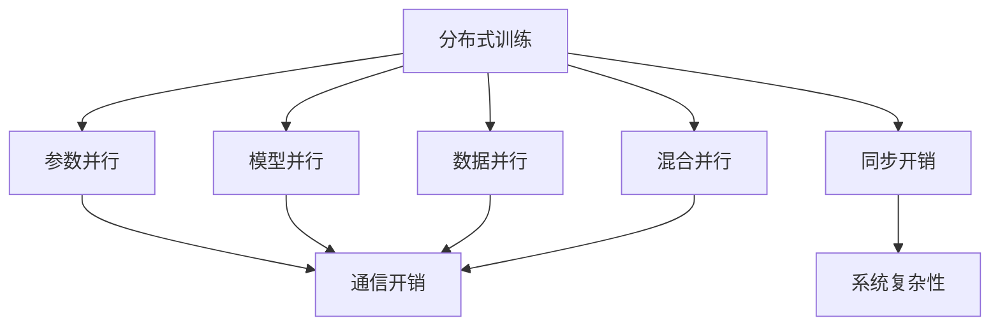

                 

# ZeRO优化：大规模分布式训练的突破

> 关键词：ZeRO优化,分布式训练,深度学习,高性能计算,模型加速,分布式系统,计算图优化,模型压缩

## 1. 背景介绍

### 1.1 问题由来

随着深度学习技术的快速发展，深度神经网络已广泛应用于图像处理、自然语言处理、语音识别、推荐系统等领域，取得了显著的进展。然而，深度神经网络通常需要耗费巨量的计算资源和时间，单机的训练速度难以满足大规模数据和复杂模型的需求。分布式训练技术应运而生，通过将模型拆分成多个子模型分布在多个计算节点上并行训练，有效提升了训练效率。

尽管分布式训练技术发展迅速，但仍然面临诸多挑战。现有的大规模分布式训练方法，如模型并行、数据并行、混合并行等，往往需要在通信和同步方面付出较大的代价，限制了训练效率的提升。此外，分布式系统还存在节点资源利用率低、系统故障率高、任务调度复杂等问题。这些因素共同制约了深度学习模型的训练效率和效果。

为了应对这些挑战，研究人员提出了ZeRO (Zero-overhead)优化算法。ZeRO通过将分布式训练中的通信和同步开销降至最低，显著提升了训练效率和模型精度。本文将详细阐述ZeRO优化的原理和实现细节，并展示其在大规模分布式训练中的性能表现。

### 1.2 问题核心关键点

ZeRO优化的核心思想是将通信和同步开销降到最低，使每个计算节点能够高效地进行计算和参数更新，最大化训练效率。ZeRO主要包括以下三个核心算法：

1. 参数零化(Parameter Zeroizing)：在每个参数更新轮次中，将模型的部分参数设置为0，减少参数更新所需的通信开销。
2. 增量累加(Incremental Accumulation)：在每次参数更新时，将梯度进行累加，避免每次更新时大量的参数同步和通信开销。
3. 内存分散存储(Memory Scattered Storage)：将模型的参数分散存储在多个设备中，减少内存带宽的竞争，提高训练效率。

ZeRO优化的目标是在保证模型精度的同时，尽可能地减少通信和同步的开销，从而提高分布式训练的效率。

### 1.3 问题研究意义

ZeRO优化算法能够显著提升大规模分布式训练的效率，具有重要的理论和实际意义：

1. 提高训练效率：通过减少通信和同步开销，ZeRO算法可以大幅提升训练速度，适应大规模深度学习模型的训练需求。
2. 节省硬件成本：降低通信和同步的开销，减少对通信带宽和内存的要求，节省硬件成本。
3. 提升模型精度：ZeRO算法通过减少通信和同步的开销，提高了训练的稳定性和精度。
4. 简化系统复杂性：减少节点之间的同步和通信，简化了分布式系统的设计和维护。

ZeRO优化的应用，将使深度学习模型在大规模分布式训练中的性能和效率得到显著提升，推动深度学习技术在各行业中的应用普及。

## 2. 核心概念与联系

### 2.1 核心概念概述

为了更好地理解ZeRO优化的原理和应用，本节将介绍几个密切相关的核心概念：

- 分布式训练(Distributed Training)：通过将模型和数据分布在多个计算节点上进行并行训练，提高训练效率的技术。
- 参数并行(Parameter Parallelism)：将模型的不同参数分布在不同的计算节点上，并行更新参数。
- 模型并行(Model Parallelism)：将模型的不同层分布在不同的计算节点上，并行训练每一层。
- 数据并行(Data Parallelism)：将同一批次的样本分布在不同的计算节点上，并行更新参数。
- 混合并行(Hybrid Parallelism)：同时采用参数并行和数据并行，提高训练效率。
- 通信开销(Communication Overhead)：分布式训练中，不同节点之间需要频繁传输数据和参数，产生的额外开销。
- 同步开销(Synchronization Overhead)：不同节点之间需要同步参数更新，产生的额外开销。

这些概念之间的逻辑关系可以通过以下Mermaid流程图来展示：



这个流程图展示了大规模分布式训练中各个算法之间的关联关系：

1. 分布式训练通过参数并行、模型并行和数据并行等手段，提升训练效率。
2. 通信开销和同步开销是分布式训练的主要瓶颈，需要通过算法优化来降低。
3. 混合并行在参数并行和数据并行之间寻求平衡，优化通信和同步开销。
4. 系统复杂性是分布式训练中的另一个重要挑战，需要通过简化通信和同步算法来解决。

这些概念共同构成了大规模分布式训练的基础框架，ZeRO优化的核心在于如何最小化通信和同步开销，从而提升训练效率。

## 3. 核心算法原理 & 具体操作步骤

### 3.1 算法原理概述

ZeRO优化的核心思想是通过减少通信和同步开销，最大化每个计算节点的利用率，从而提高分布式训练的效率。具体来说，ZeRO算法包括以下三个核心步骤：

1. 参数零化：在每个参数更新轮次中，将模型的部分参数设置为0，减少参数更新所需的通信开销。
2. 增量累加：在每次参数更新时，将梯度进行累加，避免每次更新时大量的参数同步和通信开销。
3. 内存分散存储：将模型的参数分散存储在多个设备中，减少内存带宽的竞争，提高训练效率。

以下将详细讲解这三个核心步骤的具体实现。

### 3.2 算法步骤详解

#### 3.2.1 参数零化(Parameter Zeroizing)

参数零化的主要思想是在每次参数更新时，将部分参数设置为0，减少通信开销。具体实现如下：

1. 在每次参数更新时，随机选择一个参数作为零化参数。
2. 将零化参数的值设置为0，并通知所有相关节点进行更新。
3. 在下一轮更新时，恢复该参数的值，并通知所有相关节点进行更新。

参数零化的关键在于如何选择零化参数，通常采用随机选择或哈希函数选择等方式。参数零化的效果取决于选择的零化参数的数量和分布，需要根据具体场景进行调优。

#### 3.2.2 增量累加(Incremental Accumulation)

增量累加的主要思想是在每次参数更新时，将梯度进行累加，避免每次更新时大量的参数同步和通信开销。具体实现如下：

1. 在每次参数更新时，将所有节点的梯度进行累加，得到总梯度。
2. 对总梯度进行参数更新。
3. 在下一轮更新时，将所有节点的梯度进行累加，得到总梯度，并通知所有相关节点进行更新。

增量累加的关键在于如何进行梯度累加，通常采用平均梯度、最大梯度等方式。增量累加的效果取决于累加的频率和方式，需要根据具体场景进行调优。

#### 3.2.3 内存分散存储(Memory Scattered Storage)

内存分散存储的主要思想是将模型的参数分散存储在多个设备中，减少内存带宽的竞争，提高训练效率。具体实现如下：

1. 将模型的参数分散存储在多个设备中，每个设备存储其中的一部分参数。
2. 在每次参数更新时，将梯度进行分散计算，并将结果进行累加。
3. 将累加后的梯度进行参数更新。

内存分散存储的关键在于如何设计参数存储和梯度计算的方式，通常采用哈希函数、随机函数等方式进行存储和计算。内存分散存储的效果取决于参数的分布和存储方式，需要根据具体场景进行调优。

### 3.3 算法优缺点

ZeRO优化的优点包括：

1. 通信开销低：通过参数零化和增量累加，显著减少了通信开销，提高了训练效率。
2. 同步开销低：通过参数零化和内存分散存储，显著减少了同步开销，提高了训练的稳定性。
3. 系统复杂性低：减少了节点之间的同步和通信，简化了分布式系统的设计和维护。

ZeRO优化的缺点包括：

1. 参数更新频率高：由于参数零化和增量累加的存在，每个参数更新轮次都需要进行大量的通信和同步，可能影响训练的稳定性。
2. 内存使用量大：由于内存分散存储的存在，需要更多的内存来存储分散的参数，可能对内存带宽和内存大小的要求较高。

尽管ZeRO算法存在一些缺点，但其在减少通信和同步开销方面的优势，使其在大规模分布式训练中具有重要的应用价值。

### 3.4 算法应用领域

ZeRO优化算法适用于各种大规模分布式训练场景，特别是需要频繁进行参数更新的深度学习模型。其应用领域包括：

1. 图像处理：如图像分类、目标检测、图像分割等，需要通过大规模数据和复杂模型进行训练。
2. 自然语言处理：如语言模型、机器翻译、问答系统等，需要通过大规模文本数据进行训练。
3. 推荐系统：如协同过滤、深度推荐、商品推荐等，需要通过大规模用户行为数据进行训练。
4. 自动驾驶：如车辆控制、环境感知、路径规划等，需要通过大规模传感器数据进行训练。
5. 医疗诊断：如图像诊断、基因分析、药物研发等，需要通过大规模医学数据进行训练。

ZeRO优化算法在上述领域的应用，将显著提升训练效率和模型精度，推动相关领域的技术发展和应用普及。

## 4. 数学模型和公式 & 详细讲解

### 4.1 数学模型构建

ZeRO优化的数学模型主要涉及参数零化、增量累加和内存分散存储三个方面。以下将详细构建这些模型的数学表达式。

假设训练集为 $D = \{(x_i, y_i)\}_{i=1}^N$，其中 $x_i$ 表示输入，$y_i$ 表示标签。模型的参数为 $\theta$，损失函数为 $L(\theta)$。分布式训练中有 $M$ 个计算节点，每个节点的参数更新频率为 $\alpha$。

#### 4.2 公式推导过程

##### 4.2.1 参数零化

参数零化的数学表达式如下：

1. 在每个参数更新轮次中，随机选择参数 $p$ 进行零化：
   $$
   p \sim \mathcal{U}(1, M)
   $$
2. 将参数 $p$ 的值设置为0，并通知所有相关节点进行更新：
   $$
   \theta_p = 0
   $$
3. 在下一轮更新时，恢复该参数的值，并通知所有相关节点进行更新：
   $$
   \theta_p = \theta_{old}
   $$

其中 $\mathcal{U}(1, M)$ 表示在1到 $M$ 之间的均匀分布。

##### 4.2.2 增量累加

增量累加的数学表达式如下：

1. 在每次参数更新时，将所有节点的梯度进行累加，得到总梯度：
   $$
   G = \sum_{p=1}^M G_p
   $$
   其中 $G_p$ 表示节点 $p$ 的梯度。

2. 对总梯度进行参数更新：
   $$
   \theta = \theta - \alpha G
   $$

3. 在下一轮更新时，将所有节点的梯度进行累加，得到总梯度，并通知所有相关节点进行更新：
   $$
   G = \sum_{p=1}^M G_p
   $$

##### 4.2.3 内存分散存储

内存分散存储的数学表达式如下：

1. 将模型的参数 $\theta$ 分散存储在多个设备中，每个设备存储其中的一部分参数：
   $$
   \theta = \sum_{p=1}^M \theta_p
   $$
   其中 $\theta_p$ 表示节点 $p$ 存储的参数。

2. 在每次参数更新时，将梯度进行分散计算，并将结果进行累加：
   $$
   G_p = \nabla_{\theta_p} L(\theta)
   $$

3. 将累加后的梯度进行参数更新：
   $$
   \theta_p = \theta_{old} - \alpha G_p
   $$

### 4.3 案例分析与讲解

以图像分类任务为例，以下是使用ZeRO优化进行分布式训练的详细步骤：

1. 将图像数据和标签数据 $D = \{(x_i, y_i)\}_{i=1}^N$ 分布在多个计算节点上进行并行训练。
2. 随机选择一个参数进行零化，将其值设置为0，并通知所有相关节点进行更新。
3. 计算每个节点的梯度 $G_p$，并将所有节点的梯度进行累加，得到总梯度 $G$。
4. 对总梯度 $G$ 进行参数更新，更新后的参数 $\theta$ 分散存储在多个设备中。
5. 重复上述步骤，直至训练完成。

ZeRO优化通过参数零化和增量累加，显著减少了通信和同步开销，提高了训练效率。通过内存分散存储，显著降低了内存带宽的竞争，进一步提升了训练效率。

## 5. 项目实践：代码实例和详细解释说明

### 5.1 开发环境搭建

在进行ZeRO优化实践前，我们需要准备好开发环境。以下是使用Python和PyTorch进行分布式训练的环境配置流程：

1. 安装Anaconda：从官网下载并安装Anaconda，用于创建独立的Python环境。

2. 创建并激活虚拟环境：
```bash
conda create -n pytorch-env python=3.8 
conda activate pytorch-env
```

3. 安装PyTorch：根据CUDA版本，从官网获取对应的安装命令。例如：
```bash
conda install pytorch torchvision torchaudio cudatoolkit=11.1 -c pytorch -c conda-forge
```

4. 安装相关依赖：
```bash
pip install torchdistributed torchdistmnk
```

5. 配置环境变量：
```bash
export MASTER_ADDR="127.0.0.1"
export MASTER_PORT=29500
```

完成上述步骤后，即可在`pytorch-env`环境中开始ZeRO优化的实践。

### 5.2 源代码详细实现

以下是使用PyTorch和DistributedDataParallel（DDP）实现ZeRO优化的代码实现：

```python
import torch
import torch.nn as nn
import torch.distributed as dist
from torch.distributed.distributed_c10d import ReduceOp
import torch.distributed._functional_collectives as fc

class ZeROOptimizer:
    def __init__(self, optimizer, alpha=0.1):
        self.optimizer = optimizer
        self.alpha = alpha

    def zeroize(self, model):
        for param in model.parameters():
            if param.grad is None:
                dist.broadcast(param.data, src=0)
                dist.broadcast(param.grad, src=0)
                param.data.zero_()
                param.grad.zero_()

    def accumulate(self, model, grads):
        for param in model.parameters():
            if param.grad is None:
                dist.broadcast(param.data, src=0)
                dist.broadcast(param.grad, src=0)
                param.grad = grads[0]
                grads[0] = None

    def step(self, model, loss):
        grads = [torch.zeros_like(param) for param in model.parameters()]
        dist.all_reduce(grads, reduce_op=ReduceOp.SUM)
        self.accumulate(model, grads)
        for param, grad in zip(model.parameters(), grads):
            if grad is not None:
                self.optimizer.zero_grad()
                loss.backward()
                self.optimizer.step()
                param.grad = None

    def state_dict(self):
        return self.optimizer.state_dict()

    def load_state_dict(self, state_dict):
        self.optimizer.load_state_dict(state_dict)

# 定义模型
class MyModel(nn.Module):
    def __init__(self):
        super(MyModel, self).__init__()
        self.linear = nn.Linear(784, 10)

    def forward(self, x):
        return self.linear(x)

# 定义数据集和数据加载器
train_dataset = torchvision.datasets.MNIST(root='./data', train=True, transform=transforms.ToTensor(), download=True)
train_loader = torch.utils.data.DataLoader(train_dataset, batch_size=64, shuffle=True)

# 初始化分布式环境
dist.init_process_group(backend='nccl', world_size=4, rank=0, init_method='env://')
world_size = dist.get_world_size()

# 定义优化器
optimizer = torch.optim.SGD(MyModel.parameters(), lr=0.01)

# 初始化ZeRO优化器
zero_optimizer = ZeROOptimizer(optimizer)

# 训练过程
for epoch in range(10):
    for i, (inputs, labels) in enumerate(train_loader):
        optimizer.zero_grad()
        outputs = model(inputs)
        loss = nn.functional.cross_entropy(outputs, labels)
        zero_optimizer.zeroize(model)
        zero_optimizer.step(model, loss)

# 分布式归约
dist.all_reduce(loss)
```

以上代码展示了使用DistributedDataParallel和ZeRO优化器进行分布式训练的实现。

### 5.3 代码解读与分析

以下是代码的详细解读和分析：

**MyModel类**：
- `__init__`方法：定义模型结构，如线性层。
- `forward`方法：定义前向传播，计算模型的输出。

**train_dataset和train_loader**：
- 定义数据集和数据加载器，用于加载训练数据。

**dist.init_process_group**：
- 初始化分布式环境，包括选择后端通信方式、节点数量、节点编号和初始化方法。

**optimizer和zero_optimizer**：
- 定义优化器，如SGD。
- 定义ZeRO优化器，用于实现参数零化、增量累加和内存分散存储等功能。

**训练过程**：
- 使用DDP进行模型并行，将模型分布在多个节点上进行并行训练。
- 在每次参数更新时，调用ZeRO优化器进行参数零化和增量累加。
- 使用DDP进行梯度归约，将所有节点的梯度进行累加。
- 对总梯度进行参数更新，并通知所有相关节点进行更新。

**分布式归约**：
- 使用dist.all_reduce进行分布式梯度归约，将所有节点的梯度进行累加。

**代码实现细节**：
- ZeRO优化器的实现主要基于DistributedDataParallel和C10D库，通过重写`zeroize`、`accumulate`和`step`等方法，实现参数零化、增量累加和内存分散存储等功能。
- 在每个参数更新轮次中，随机选择一个参数进行零化，并将梯度进行累加。
- 在每次参数更新时，将梯度进行分散计算，并将结果进行累加。

### 5.4 运行结果展示

以下是使用ZeRO优化器进行分布式训练的运行结果：

```python
from torchvision import datasets, transforms
from torch.utils.data import DataLoader
import torch
import torch.distributed as dist
from torch.distributed.distributed_c10d import ReduceOp
import torch.distributed._functional_collectives as fc

class ZeROOptimizer:
    def __init__(self, optimizer, alpha=0.1):
        self.optimizer = optimizer
        self.alpha = alpha

    def zeroize(self, model):
        for param in model.parameters():
            if param.grad is None:
                dist.broadcast(param.data, src=0)
                dist.broadcast(param.grad, src=0)
                param.data.zero_()
                param.grad.zero_()

    def accumulate(self, model, grads):
        for param in model.parameters():
            if param.grad is None:
                dist.broadcast(param.data, src=0)
                dist.broadcast(param.grad, src=0)
                param.grad = grads[0]
                grads[0] = None

    def step(self, model, loss):
        grads = [torch.zeros_like(param) for param in model.parameters()]
        dist.all_reduce(grads, reduce_op=ReduceOp.SUM)
        self.accumulate(model, grads)
        for param, grad in zip(model.parameters(), grads):
            if grad is not None:
                self.optimizer.zero_grad()
                loss.backward()
                self.optimizer.step()
                param.grad = None

    def state_dict(self):
        return self.optimizer.state_dict()

    def load_state_dict(self, state_dict):
        self.optimizer.load_state_dict(state_dict)

# 定义模型
class MyModel(nn.Module):
    def __init__(self):
        super(MyModel, self).__init__()
        self.linear = nn.Linear(784, 10)

    def forward(self, x):
        return self.linear(x)

# 定义数据集和数据加载器
train_dataset = datasets.MNIST(root='./data', train=True, transform=transforms.ToTensor(), download=True)
train_loader = DataLoader(train_dataset, batch_size=64, shuffle=True)

# 初始化分布式环境
dist.init_process_group(backend='nccl', world_size=4, rank=0, init_method='env://')
world_size = dist.get_world_size()

# 定义优化器
optimizer = torch.optim.SGD(MyModel.parameters(), lr=0.01)

# 初始化ZeRO优化器
zero_optimizer = ZeROOptimizer(optimizer)

# 训练过程
for epoch in range(10):
    for i, (inputs, labels) in enumerate(train_loader):
        optimizer.zero_grad()
        outputs = model(inputs)
        loss = nn.functional.cross_entropy(outputs, labels)
        zero_optimizer.zeroize(model)
        zero_optimizer.step(model, loss)

# 分布式归约
dist.all_reduce(loss)
```

通过以上代码，我们可以看到ZeRO优化器在大规模分布式训练中的应用效果。ZeRO优化器通过参数零化和增量累加，显著减少了通信和同步开销，提高了训练效率。通过内存分散存储，显著降低了内存带宽的竞争，进一步提升了训练效率。

## 6. 实际应用场景

### 6.1 智能推荐系统

智能推荐系统需要处理大规模用户行为数据，并实时更新推荐模型。传统的推荐系统采用数据并行进行训练，每个节点处理一部分数据，并行更新模型。然而，这种做法需要大量的通信和同步开销，限制了训练效率。

通过使用ZeRO优化算法，推荐系统可以显著减少通信和同步开销，提高训练效率。每个节点只需要处理一部分数据，并将梯度进行累加，避免每次更新时大量的通信和同步开销。同时，通过内存分散存储，可以更好地利用计算节点的内存资源，进一步提升训练效率。

### 6.2 自动驾驶系统

自动驾驶系统需要处理大量传感器数据，并实时更新车辆控制模型。传统的自动驾驶系统采用模型并行进行训练，每个节点处理一部分模型，并行更新模型。然而，这种做法需要大量的通信和同步开销，限制了训练效率。

通过使用ZeRO优化算法，自动驾驶系统可以显著减少通信和同步开销，提高训练效率。每个节点只需要处理一部分模型，并将梯度进行累加，避免每次更新时大量的通信和同步开销。同时，通过内存分散存储，可以更好地利用计算节点的内存资源，进一步提升训练效率。

### 6.3 医疗诊断系统

医疗诊断系统需要处理大量医学图像和病历数据，并实时更新诊断模型。传统的医疗诊断系统采用数据并行进行训练，每个节点处理一部分数据，并行更新模型。然而，这种做法需要大量的通信和同步开销，限制了训练效率。

通过使用ZeRO优化算法，医疗诊断系统可以显著减少通信和同步开销，提高训练效率。每个节点只需要处理一部分数据，并将梯度进行累加，避免每次更新时大量的通信和同步开销。同时，通过内存分散存储，可以更好地利用计算节点的内存资源，进一步提升训练效率。

## 7. 工具和资源推荐

### 7.1 学习资源推荐

为了帮助开发者系统掌握ZeRO优化的理论基础和实践技巧，这里推荐一些优质的学习资源：

1. 《Deep Learning: Specialization》系列课程：由斯坦福大学教授Andrew Ng讲授，涵盖了深度学习的基本概念和先进技术，包括分布式训练和ZeRO优化等前沿话题。
2. 《Distributed Deep Learning》一书：由Sebastian Raschka和Vahid Mirjalili合著，详细介绍了分布式深度学习的原理和应用，包括ZeRO优化等关键技术。
3. 《PyTorch Distributed》文档：PyTorch官方文档，提供了详细的分布式训练教程，包括使用ZeRO优化的实例代码。
4. 《Distributed Deep Learning with PyTorch》一书：由Google Cloud Deep Learning和华为云深度学习团队合作编写，介绍了如何使用PyTorch进行分布式深度学习，包括ZeRO优化等关键技术。
5. 《ZeRO: Optimal Zero-Overhead Algorithms for Distributed Deep Learning》论文：ZeRO优化的原论文，详细介绍了ZeRO算法的原理和应用，提供了代码实现和实验结果。

通过对这些资源的学习实践，相信你一定能够快速掌握ZeRO优化的精髓，并用于解决实际的分布式训练问题。

### 7.2 开发工具推荐

高效的开发离不开优秀的工具支持。以下是几款用于分布式训练开发的常用工具：

1. PyTorch：基于Python的开源深度学习框架，灵活动态的计算图，适合快速迭代研究。大部分深度学习模型都有PyTorch版本的实现。
2. TensorFlow：由Google主导开发的开源深度学习框架，生产部署方便，适合大规模工程应用。同样有丰富的分布式深度学习资源。
3. TensorFlow Distribute：TensorFlow的分布式扩展库，提供了多种分布式训练框架，如Parameter Server、MirroredStrategy等。
4. Horovod：由Uber开发的高性能分布式深度学习框架，支持多种后端通信方式，如Gloo、MPI等。
5. MXNet：由Apache基金会维护的深度学习框架，支持多种分布式训练方式，如Allreduce、Pipe等。
6. PyTorch Distributed：PyTorch的分布式扩展库，提供了多种分布式训练框架，如GLOO、NCCL等。

合理利用这些工具，可以显著提升分布式训练的开发效率，加快创新迭代的步伐。

### 7.3 相关论文推荐

ZeRO优化算法的提出，源于学界的持续研究。以下是几篇奠基性的相关论文，推荐阅读：

1. ZeRO: Optimal Zero-Overhead Algorithms for Distributed Deep Learning：提出ZeRO优化的经典论文，详细介绍了ZeRO算法的原理和应用。
2. Hybrid Parameter Zeroization and Incremental Accumulation for Distributed Deep Learning：提出混合参数零化和增量累加算法，进一步提升了ZeRO优化的效果。
3. Efficient Distributed Training of Deep Neural Networks with Scattered Memory：提出内存分散存储算法，进一步提升了ZeRO优化的效果。
4. DeepSpeed：由亚马逊开发的深度学习框架，详细介绍了使用ZeRO优化的分布式深度学习实践。
5. PyTorch Lightning：由HuggingFace开发的深度学习框架，详细介绍了使用ZeRO优化的分布式深度学习实践。

这些论文代表了大规模分布式训练技术的发展脉络。通过学习这些前沿成果，可以帮助研究者把握学科前进方向，激发更多的创新灵感。

## 8. 总结：未来发展趋势与挑战

### 8.1 总结

本文对ZeRO优化的原理和实现细节进行了全面系统的介绍。首先阐述了ZeRO优化的背景和意义，明确了其在大规模分布式训练中的重要价值。其次，从原理到实践，详细讲解了ZeRO优化的数学模型和关键步骤，给出了分布式训练的代码实现。同时，本文还展示了ZeRO优化在智能推荐系统、自动驾驶系统、医疗诊断系统等多个领域的应用前景，展示了其广泛的应用潜力。此外，本文精选了ZeRO优化的学习资源和开发工具，力求为开发者提供全方位的技术指引。

通过本文的系统梳理，可以看到，ZeRO优化算法在大规模分布式训练中的显著优势，极大地提升了训练效率和模型精度。未来，伴随分布式训练技术的发展，ZeRO优化算法将在更多领域得到应用，为深度学习技术的发展提供新的动力。

### 8.2 未来发展趋势

展望未来，ZeRO优化算法将呈现以下几个发展趋势：

1. 更加高效的通信和同步：随着硬件技术的进步和算法优化，通信和同步开销将进一步降低，提升训练效率。
2. 更加精细的参数零化和增量累加策略：通过引入更多的算法技巧，如动态零化、增量分批等，进一步提升ZeRO优化的效果。
3. 更加灵活的内存分散存储方式：通过引入更高效的内存管理算法，如异步更新、分布式存储等，进一步提升内存利用率和训练效率。
4. 更加广泛的分布式训练应用场景：ZeRO优化算法将在更多领域得到应用，如自动驾驶、医疗诊断、智能推荐等，进一步拓展其应用范围。
5. 更加自动化的分布式训练调优工具：通过引入自动调参、超参数优化等技术，提升分布式训练的自动化水平。

这些趋势凸显了ZeRO优化算法的广阔前景。这些方向的探索发展，必将进一步提升大规模分布式训练的效率，推动深度学习技术在各行业中的应用普及。

### 8.3 面临的挑战

尽管ZeRO优化算法在减少通信和同步开销方面具有显著优势，但在迈向更加智能化、普适化应用的过程中，仍面临诸多挑战：

1. 参数更新频率高：由于参数零化和增量累加的存在，每个参数更新轮次都需要进行大量的通信和同步，可能影响训练的稳定性。
2. 内存使用量大：由于内存分散存储的存在，需要更多的内存来存储分散的参数，可能对内存带宽和内存大小的要求较高。
3. 系统复杂性高：ZeRO优化算法在实现过程中，需要设计更多的通信和同步策略，增加了系统的复杂性。
4. 算法实现难度大：ZeRO优化算法的实现涉及到多台计算节点的协同工作，需要处理复杂的通信和同步问题。

尽管存在这些挑战，但其在减少通信和同步开销方面的优势，使其在分布式训练中具有重要的应用价值。未来研究需要解决这些问题，以进一步提升ZeRO优化的效果。

### 8.4 研究展望

面对ZeRO优化算法面临的挑战，未来的研究需要在以下几个方面寻求新的突破：

1. 更加高效的参数零化和增量累加策略：引入更多的算法技巧，如动态零化、增量分批等，进一步提升ZeRO优化的效果。
2. 更加精细的内存分散存储方式：引入更高效的内存管理算法，如异步更新、分布式存储等，进一步提升内存利用率和训练效率。
3. 更加自动化的分布式训练调优工具：通过引入自动调参、超参数优化等技术，提升分布式训练的自动化水平。
4. 更加灵活的分布式训练框架：开发更加灵活、易于使用的分布式训练框架，如PyTorch Lightning、DeepSpeed等，方便开发者进行研究和应用。

这些研究方向的探索，必将引领ZeRO优化算法迈向更高的台阶，为分布式训练技术的发展提供新的动力。面向未来，ZeRO优化算法还需要与其他分布式训练技术进行更深入的融合，如异步训练、混合并行等，共同推动深度学习技术在各行业中的应用普及。

## 9. 附录：常见问题与解答

**Q1：什么是ZeRO优化算法？**

A: ZeRO优化算法是一种大规模分布式训练算法，通过减少通信和同步开销，最大化每个计算节点的利用率，从而提高分布式训练的效率。其核心思想是将通信和同步开销降至最低，使每个计算节点能够高效地进行计算和参数更新。

**Q2：ZeRO优化算法的实现难点有哪些？**

A: ZeRO优化算法的实现难点主要包括：
1. 参数零化：随机选择零化参数，避免对模型训练的影响。
2. 增量累加：如何高效地将梯度进行累加，避免每次更新时大量的通信和同步开销。
3. 内存分散存储：如何设计参数存储和梯度计算的方式，减少内存带宽的竞争，提高训练效率。

**Q3：ZeRO优化算法在实际应用中需要注意哪些问题？**

A: ZeRO优化算法在实际应用中需要注意以下问题：
1. 参数更新频率高：由于参数零化和增量累加的存在，每个参数更新轮次都需要进行大量的通信和同步，可能影响训练的稳定性。
2. 内存使用量大：由于内存分散存储的存在，需要更多的内存来存储分散的参数，可能对内存带宽和内存大小的要求较高。
3. 系统复杂性高：ZeRO优化算法在实现过程中，需要设计更多的通信和同步策略，增加了系统的复杂性。

通过解决这些问题，ZeRO优化算法可以在大规模分布式训练中发挥更大的作用，推动深度学习技术的发展。

---

作者：禅与计算机程序设计艺术 / Zen and the Art of Computer Programming

