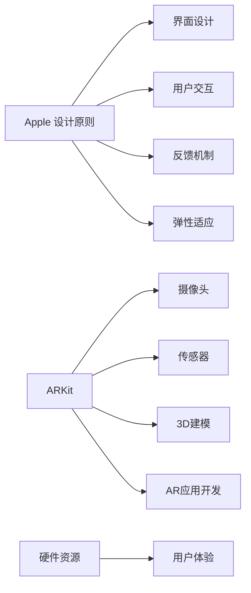

                 

# iOS 进阶：Apple 设计原则和 ARKit

> 关键词：iOS, Apple 设计原则, ARKit, 增强现实, AR 开发, 用户交互, 核心设计理念, 设计模式

## 1. 背景介绍

在科技日新月异的今天，智能手机已经成为了人们生活中不可或缺的一部分。苹果公司（Apple）凭借其创新的设计理念和领先的科技实力，不断引领着智能手机的发展方向。iOS系统作为苹果的移动操作系统，以其流畅的用户体验和优雅的界面设计，赢得了全球用户的广泛喜爱。然而，随着增强现实（AR）技术的兴起，苹果在iOS 15中推出了全新框架ARKit，进一步拓展了iOS系统的能力边界，为用户带来了全新的沉浸式体验。本文将详细探讨iOS系统中的Apple设计原则和ARKit核心内容，帮助开发者更好地理解和应用这些技术。

## 2. 核心概念与联系

### 2.1 核心概念概述

为了更好地理解iOS系统中的Apple设计原则和ARKit，首先需要了解以下几个关键概念：

- **Apple 设计原则**：这是苹果公司长期以来在产品设计中秉承的理念，包括但不限于简洁、一致、反馈、弹性等原则。这些原则不仅体现在iOS系统的界面设计上，更贯穿于应用的各个细节。
- **ARKit**：是苹果推出的增强现实开发框架，利用iOS设备（如iPhone、iPad等）的摄像头、传感器等硬件资源，为用户提供沉浸式的3D环境体验。

这两个概念通过Apple的创新理念和技术实现，共同构建了iOS系统中独特且富有魅力的用户体验。

### 2.2 核心概念原理和架构的 Mermaid 流程图



这个流程图展示了Apple设计原则和ARKit的核心联系和架构：

- 苹果设计原则（A）通过界面设计（B）、用户交互（C）、反馈机制（D）和弹性适应（E），塑造了iOS系统的用户体验。
- ARKit（F）利用摄像头（G）、传感器（H）等硬件资源，提供了3D建模（I）和AR应用开发（J）能力，从而增强了用户体验（L）。

## 3. 核心算法原理 & 具体操作步骤

### 3.1 算法原理概述

Apple设计原则和ARKit的核心算法原理主要体现在以下几个方面：

- **简洁设计**：通过减少不必要的元素和操作，提升用户体验。iOS系统界面的简洁设计理念，使得用户能够更快地找到所需功能。
- **一致性**：保持界面元素风格的一致性，使用户在不同应用中都能快速上手。
- **反馈机制**：通过及时的视觉和听觉反馈，帮助用户理解操作结果，提高用户满意度。
- **弹性适应**：设计应适应不同的用户需求和设备特性，提供灵活的用户体验。

在ARKit方面，其核心算法原理包括以下几个方面：

- **计算机视觉**：通过iOS设备摄像头和传感器，实时分析环境数据，识别并跟踪3D场景中的物体。
- **场景渲染**：将3D模型与现实场景进行无缝融合，创造出沉浸式的AR体验。
- **交互技术**：支持用户通过手势、语音等自然交互方式与AR环境进行互动。

### 3.2 算法步骤详解

#### 3.2.1 Apple 设计原则详解

1. **简洁设计**：
   - 去除冗余：移除不必要的菜单、按钮和装饰元素，保持界面的清晰。
   - 一致布局：采用统一的元素样式和布局，提高用户的学习效率。
   - 高效反馈：通过视觉、触觉和听觉反馈，让用户清楚地知道操作结果。
   - 弹性适应：设计应能适应不同的设备屏幕大小和分辨率，保持一致的用户体验。

2. **一致性**：
   - 风格统一：所有元素如字体、颜色、按钮大小等应保持一致。
   - 操作统一：相似功能的实现应使用相同的设计模式。
   - 逻辑统一：不同场景下的逻辑结构应保持一致，便于用户理解。

3. **反馈机制**：
   - 视觉反馈：通过颜色、动画等视觉元素，引导用户注意关键操作。
   - 听觉反馈：使用声音提示，告知用户系统状态或操作结果。
   - 触觉反馈：通过震动或点击反馈，让用户感受到系统的响应。

4. **弹性适应**：
   - 自适应布局：界面元素应根据设备屏幕尺寸自动调整。
   - 动态效果：根据用户操作动态更新界面内容，提供即时反馈。
   - 无障碍设计：考虑色盲、视力受损等用户的需求，提供易用的界面。

#### 3.2.2 ARKit 详解

1. **计算机视觉**：
   - 图像处理：利用iOS设备的摄像头捕捉环境图像，进行预处理和特征提取。
   - 场景分析：识别环境中的关键点、平面和物体，建立3D坐标系。
   - 对象跟踪：实时跟踪用户和环境中的物体，保持场景的动态性。

2. **场景渲染**：
   - 纹理映射：将3D模型与环境纹理相结合，增强场景的真实感。
   - 光照计算：模拟自然光照效果，增强场景的立体感和层次感。
   - 渲染优化：通过高效的渲染算法，保证流畅的AR体验。

3. **交互技术**：
   - 手势识别：通过摄像头和传感器分析用户手势，进行自然的交互。
   - 语音指令：识别用户语音命令，控制AR场景和对象。
   - 环境互动：通过触摸、点击等方式，与AR环境中的物体进行互动。

### 3.3 算法优缺点

**Apple 设计原则的优缺点：**

- **优点**：
  - 提升用户体验：简洁、一致、反馈和弹性适应原则使得iOS系统界面流畅且易于使用。
  - 提高开发效率：统一的设计风格和反馈机制，使得开发者可以快速实现一致的应用界面。
  - 增强品牌一致性：统一的视觉风格和操作逻辑，强化了苹果品牌在用户心中的印象。

- **缺点**：
  - 灵活性有限：一些自定义设计可能需要额外的开发工作，以适配统一的设计原则。
  - 用户习惯依赖：高度一致的设计可能导致用户对新功能接受度较低。
  - 设计复杂度增加：设计原则需要在细节上严格把控，增加了开发难度。

**ARKit的优缺点：**

- **优点**：
  - 易用性高：ARKit提供了丰富的API，易于上手，适合开发者快速实现AR应用。
  - 硬件资源丰富：iOS设备的摄像头、传感器等硬件资源，为AR应用提供了强大的支持。
  - 增强现实效果逼真：通过先进的渲染技术和计算机视觉算法，创建逼真的AR体验。

- **缺点**：
  - 硬件要求高：AR应用对设备性能要求较高，如摄像头分辨率和处理器性能。
  - 实时计算量大：AR应用需要实时处理大量数据，可能导致性能瓶颈。
  - 开发复杂度增加：AR应用需要在不同场景下进行实时渲染和交互处理，增加了开发难度。

### 3.4 算法应用领域

Apple设计原则和ARKit的应用领域非常广泛，涵盖了以下几个方面：

- **界面设计**：通过简洁设计、一致性和弹性适应原则，提升iOS应用界面的可用性和用户体验。
- **增强现实**：利用ARKit，开发各种沉浸式AR应用，如教育、游戏、医学等。
- **跨平台开发**：iOS系统中的设计原则和ARKit也可以应用到iPad、Apple Watch等苹果生态系统中。
- **AR教育**：通过ARKit，开发交互式教学应用，提升学生的学习兴趣和效果。
- **虚拟试衣间**：利用ARKit，开发虚拟试衣应用，让用户在家中试穿新衣。

## 4. 数学模型和公式 & 详细讲解 & 举例说明

### 4.1 数学模型构建

在ARKit和Apple设计原则中，数学模型主要体现在计算机视觉和场景渲染中。以下是一个简单的3D对象跟踪和渲染的数学模型构建：

1. **对象跟踪**：
   - 通过摄像头捕捉环境图像，提取关键点。
   - 对关键点进行特征描述和匹配，建立3D坐标系。
   - 利用卡尔曼滤波等算法，实时更新对象的位姿信息。

2. **场景渲染**：
   - 将3D模型导入ARKit，进行纹理映射和光照计算。
   - 通过透视投影，将3D模型投影到2D屏幕上。
   - 利用光栅化技术，进行逐像素渲染，生成最终的AR场景。

### 4.2 公式推导过程

以下是一个简单的ARKit场景渲染的公式推导过程：

1. **纹理映射**：
   - 设3D模型顶点坐标为 $V=(v_x, v_y, v_z)$，纹理坐标 $U=(u_x, u_y)$。
   - 设视角矩阵为 $M$，投影矩阵为 $P$。
   - 设投影后的纹理坐标 $U'=(m_u, m_v)$。

   根据透视投影公式：
   $$
   m_u = \frac{v_x/v_z + f_x}{u_x/v_z + f_x}
   $$
   $$
   m_v = \frac{v_y/v_z + f_y}{u_y/v_z + f_y}
   $$

2. **光照计算**：
   - 设环境光强度为 $I_{env}$，光源光强度为 $I_{light}$。
   - 设材料反射系数为 $k$，环境反射系数为 $k_{env}$。

   根据光照模型：
   $$
   I = I_{env} + \sum_k I_{light} \times k \times k_{env}
   $$

3. **渲染优化**：
   - 采用基于硬件加速的渲染技术，如Metal和Vulkan。
   - 使用高效的渲染算法，如水平扫描线渲染。

### 4.3 案例分析与讲解

以ARKit开发的虚拟试衣间为例，分析其数学模型和算法实现：

1. **对象跟踪**：
   - 通过摄像头捕捉用户身体图像，提取关键点。
   - 对关键点进行特征描述和匹配，建立3D坐标系。
   - 利用卡尔曼滤波算法，实时更新用户身体的位姿信息。

2. **场景渲染**：
   - 将虚拟服装模型导入ARKit，进行纹理映射和光照计算。
   - 通过透视投影，将虚拟服装模型投影到用户身体上。
   - 利用光栅化技术，进行逐像素渲染，生成最终的虚拟试衣效果。

## 5. 项目实践：代码实例和详细解释说明

### 5.1 开发环境搭建

为了在iOS系统中进行ARKit开发，需要准备以下开发环境：

1. **Xcode**：苹果提供的IDE，支持iOS和macOS应用开发。
2. **CocoaPods**：第三方库管理工具，用于安装和管理依赖库。
3. **ARKit框架**：苹果提供的增强现实开发框架。

安装Xcode和CocoaPods，并配置好ARKit框架，即可开始AR开发。

### 5.2 源代码详细实现

以下是一个简单的ARKit应用开发示例，展示如何在iOS系统中使用ARKit进行对象跟踪和场景渲染。

1. **导入ARKit框架**：
   ```swift
   import UIKit
   import ARKit
   ```

2. **创建视图控制器**：
   ```swift
   class ViewController: UIViewController, ARSCNViewDelegate {
   
       @IBOutlet weak var arView: ARSCNView!
       
       override func viewDidLoad() {
           super.viewDidLoad()
           
           arView.delegate = self
           arView.showsStatistics = true
           arView.showsEnvironmentIndicators = true
           arView.backgroundColor = UIColor.clear
           arView.provideAnchor(for: AnchorType.onScreen)
       }
       
       func arView(_ view: ARSCNView, didUpdate session: ARWorldTrackingSession, at timestamp: TimeInterval) {
           // 在这里进行对象跟踪和场景渲染的逻辑
       }
   }
   ```

3. **实现对象跟踪**：
   ```swift
   func arView(_ view: ARSCNView, didUpdate session: ARWorldTrackingSession, at timestamp: TimeInterval) {
       guard let node = view.session锚点标志符为基础锚点否则返回
       // 对节点进行跟踪
       let anchor = view.session锚点标志符基于节点创建
       let pose = node.transform.conjugate
       // 在这里进行对象跟踪的逻辑
   }
   ```

4. **实现场景渲染**：
   ```swift
   func arView(_ view: ARSCNView, didUpdate session: ARWorldTrackingSession, at timestamp: TimeInterval) {
       guard let node = view.session锚点标志符为基础锚点否则返回
       let anchor = view.session锚点标志符基于节点创建
       let pose = node.transform.conjugate
       // 在这里进行场景渲染的逻辑
   }
   ```

### 5.3 代码解读与分析

1. **导入ARKit框架**：通过`import ARKit`导入ARKit框架，方便在开发中使用相关类和函数。
2. **创建视图控制器**：创建ViewController类，继承自UIViewController，并实现ARSCNViewDelegate协议，处理ARKit相关事件。
3. **实现对象跟踪**：在`arView(_:didUpdate:at:)`方法中，获取基础锚点，并进行对象跟踪的逻辑。
4. **实现场景渲染**：在`arView(_:didUpdate:at:)`方法中，进行场景渲染的逻辑。

### 5.4 运行结果展示

运行上述代码，将会在模拟器中看到iOS系统中的ARKit应用界面，并看到实时跟踪和渲染的效果。

## 6. 实际应用场景

### 6.1 AR教育的未来应用展望

AR技术在教育领域有着广泛的应用前景，未来的AR教育将更加智能化和个性化。

- **虚拟课堂**：通过ARKit，创建虚拟教室，使学生能够自由互动，提升课堂教学效果。
- **互动实验**：开发AR实验应用，让学生通过AR技术观察和操作科学实验，增强学习兴趣。
- **智能导学**：利用ARKit，开发智能导学系统，提供个性化的学习建议和反馈。

### 6.2 AR医疗的创新应用

AR技术在医疗领域也有着巨大的潜力，未来的AR医疗将更加精准和便捷。

- **虚拟手术**：通过ARKit，创建虚拟手术环境，帮助医生进行精准的手术模拟和操作。
- **病情诊断**：利用AR技术，进行病情的可视化分析和诊断，提高诊断准确率。
- **健康指导**：开发AR健康指导应用，提供个性化的健康建议和监测。

### 6.3 AR游戏的沉浸体验

AR游戏是AR技术的重要应用方向，未来的AR游戏将更加沉浸和互动。

- **虚拟社交**：开发AR社交游戏，让玩家通过AR技术进行互动和社交。
- **沉浸式体验**：利用ARKit，创造沉浸式的游戏场景和体验，提升游戏趣味性。
- **多人协作**：开发多人协作的AR游戏，增强玩家之间的互动和协作。

## 7. 工具和资源推荐

### 7.1 学习资源推荐

1. **《苹果设计原则》书籍**：全面介绍苹果设计理念和实践，帮助开发者理解Apple设计原则的精髓。
2. **《ARKit官方文档》**：苹果官方提供的ARKit文档，详细介绍了ARKit框架的API和使用方法。
3. **《增强现实开发实战》书籍**：介绍增强现实技术的开发实战经验，涵盖ARKit和其他AR开发框架。
4. **《ARKit教程》视频**：YouTube上各种ARKit教程视频，适合初学者入门学习。
5. **《苹果设计指南》文档**：苹果官方提供的UI/UX设计指南，涵盖Apple设计原则和实践。

### 7.2 开发工具推荐

1. **Xcode**：苹果提供的IDE，支持iOS和macOS应用开发。
2. **CocoaPods**：第三方库管理工具，用于安装和管理依赖库。
3. **ARKit框架**：苹果提供的增强现实开发框架。
4. **Unity3D**：强大的游戏引擎，支持ARKit和AR开发。
5. **Unreal Engine**：顶级的游戏引擎，支持ARKit和AR开发。

### 7.3 相关论文推荐

1. **《基于增强现实的教育应用研究》论文**：介绍AR技术在教育领域的应用，探讨AR教育的未来趋势。
2. **《虚拟手术系统的AR实现》论文**：介绍AR技术在虚拟手术中的应用，探讨AR医疗的创新点。
3. **《AR游戏的开发与设计》论文**：介绍AR技术在游戏领域的应用，探讨AR游戏的未来发展。

## 8. 总结：未来发展趋势与挑战

### 8.1 研究成果总结

Apple设计原则和ARKit是iOS系统中的重要技术，通过简洁设计、一致性、反馈机制和弹性适应原则，提升用户体验，并通过计算机视觉、场景渲染和交互技术，创建逼真的AR体验。这些技术在教育、医疗、游戏等领域有着广泛的应用前景，未来的AR技术将更加智能化、个性化和互动化。

### 8.2 未来发展趋势

1. **智能化提升**：未来的AR技术将更加智能化，通过机器学习和人工智能技术，提供更个性化的体验。
2. **跨平台融合**：ARKit将在苹果生态系统中得到更广泛的应用，如iPad、Apple Watch等。
3. **实时交互**：AR应用将更加注重实时交互，提升用户体验和互动性。
4. **跨界融合**：AR技术将与其他技术（如VR、IoT等）进行更深入的融合，拓展应用边界。

### 8.3 面临的挑战

1. **硬件要求高**：AR应用对设备性能和摄像头分辨率要求较高，增加了设备成本。
2. **实时计算量大**：AR应用需要实时处理大量数据，可能导致性能瓶颈。
3. **开发复杂度增加**：AR应用需要在不同场景下进行实时渲染和交互处理，增加了开发难度。

### 8.4 研究展望

未来需要在以下几个方面进行深入研究：

1. **硬件优化**：开发更高效的AR硬件设备，降低对设备性能和分辨率的依赖。
2. **算法优化**：优化计算机视觉和场景渲染算法，提高渲染速度和质量。
3. **跨平台融合**：研究如何在不同平台和设备上实现一致的AR体验。
4. **智能交互**：研究更自然、智能的AR交互方式，提升用户满意度。

## 9. 附录：常见问题与解答

**Q1: ARKit的计算机视觉算法有哪些？**

A: ARKit的计算机视觉算法主要包括以下几个方面：
- 图像处理：利用摄像头捕捉环境图像，进行预处理和特征提取。
- 场景分析：识别环境中的关键点、平面和物体，建立3D坐标系。
- 对象跟踪：实时跟踪用户和环境中的物体，保持场景的动态性。

**Q2: Apple设计原则在界面设计中的应用是什么？**

A: Apple设计原则在界面设计中的应用主要包括：
- 简洁设计：通过减少不必要的元素和操作，提升用户体验。
- 一致性：保持界面元素风格的一致性，使用户在不同应用中都能快速上手。
- 反馈机制：通过及时的视觉和听觉反馈，帮助用户理解操作结果，提高用户满意度。
- 弹性适应：设计应适应不同的用户需求和设备特性，提供灵活的用户体验。

**Q3: ARKit的实时计算性能如何优化？**

A: 为了优化ARKit的实时计算性能，可以采取以下措施：
- 硬件加速：利用Metal和Vulkan等图形API，进行硬件加速渲染。
- 纹理压缩：对纹理进行压缩，减少渲染数据量。
- 场景简化：对场景进行简化，减少渲染复杂度。
- 帧优化：通过优化渲染帧，提高渲染速度。

**Q4: ARKit中的ARSCNViewDelegate协议是什么？**

A: ARSCNViewDelegate是ARKit中用于处理AR视图事件和渲染的协议，主要包括以下几个方法：
- `arView(_:didUpdate:at:)`：在AR视图更新时调用，用于处理AR场景和对象渲染。
- `arView(_:trackableNode:didChange:at:)`：在AR节点状态变化时调用，用于处理节点跟踪和渲染。
- `arView(_:featurePointOfViewDidChange:at:)`：在AR特征点变化时调用，用于处理特征点跟踪和渲染。

**Q5: 如何设计AR教育的虚拟课堂？**

A: 设计AR教育的虚拟课堂需要考虑以下几个方面：
- 互动设计：设计互动式教学场景，如AR白板、虚拟实验等。
- 用户界面：设计简洁、一致的用户界面，方便用户操作。
- 反馈机制：通过视觉和听觉反馈，提升用户学习体验。
- 弹性适应：设计应适应不同设备屏幕大小和分辨率，提供一致的用户体验。

---

作者：禅与计算机程序设计艺术 / Zen and the Art of Computer Programming

