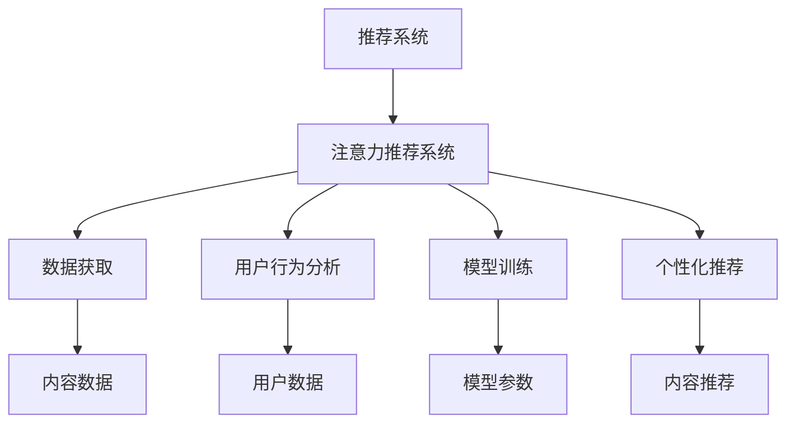

                 

# podcast市场：注意力经济的新蓝海

> 关键词：
    - 注意力经济
    - podcast平台
    - 内容推荐系统
    - 用户行为分析
    - 个性化推荐算法
    - 推荐系统优化
    - 数据科学

## 1. 背景介绍

### 1.1 问题由来
随着数字化、信息化的高速发展，互联网成为现代人获取信息、交流沟通的重要平台。特别是近几年来，社交媒体、视频、音频等多媒体内容的兴起，极大地丰富了信息消费形式，为用户带来前所未有的体验。 podcast，作为新兴的音频内容形式，逐渐成为越来越多人日常信息获取、知识获取、娱乐消遣的首选。

podcast市场在过去几年里，经历了飞速的发展。根据Statista数据，全球音频市场在2019年就达到了320亿美元，预计到2026年将增长至900亿美元以上。如此庞大的市场规模，吸引了众多平台和内容创作者进入，也催生了如Spotify、Apple Music、Tencent Podcasts等巨头。与此同时，行业内的竞争日益激烈，各大平台都在不断加大内容投入，以求在激烈的市场竞争中占据一席之地。

### 1.2 问题核心关键点
当前，podcast市场面临的核心问题是如何在海量内容中，精准高效地为用户提供个性化的推荐内容。优化推荐系统，提升用户满意度，是各大平台提升市场竞争力、保持用户粘性的关键。在此背景下，推荐系统凭借其高效、精准的特点，成为解决上述问题的重要手段。

推荐系统不仅仅是一个技术问题，它还涉及到数据、工程、产品等各个环节。构建有效的推荐系统，需要全面的数据科学知识、高效的技术实现手段和深入的产品理解。本文将深入探讨基于注意力机制的推荐系统在podcast市场中的应用，并从算法原理、工程实践、未来趋势等多个方面进行全面阐述。

## 2. 核心概念与联系

### 2.1 核心概念概述
#### 2.1.1 推荐系统
推荐系统（Recommender System）是一种基于用户兴趣和行为数据，为用户推荐个性化内容的智能系统。通过分析用户历史行为数据，推荐系统能够精准地识别用户偏好，自动推荐符合其兴趣的内容，从而提升用户体验、提高用户满意度。

#### 2.1.2 注意力机制（Attention）
注意力机制是一种模拟人类注意力集中的机器学习技术，它允许模型在处理输入数据时，动态地分配不同的关注度，强调重要特征。注意力机制在深度学习中应用广泛，如机器翻译、自然语言处理、图像识别等领域。

#### 2.1.3 注意力推荐系统
注意力推荐系统，是一种结合了注意力机制的推荐算法。它通过计算输入数据中各个元素的重要性，动态调整模型对不同元素的关注度，从而实现个性化推荐。在Podcast推荐中，注意力推荐系统可以帮助平台更加精准地理解用户偏好，推荐最符合其兴趣的Podcast内容。

#### 2.1.4 注意力经济（Attention Economy）
注意力经济是指在信息过载的时代，个体或组织争夺注意力资源以实现经济利益的一种新经济形态。在Podcast市场中，注意力推荐系统通过高效地分配用户注意力，最大化用户粘性，实现平台的经济价值。

### 2.2 核心概念原理和架构的 Mermaid 流程图


这个流程图展示了基于注意力机制的推荐系统的基本流程：
1. 从内容数据和用户数据中获取推荐所需的特征。
2. 进行用户行为分析，理解用户兴趣和偏好。
3. 使用注意力机制训练推荐模型，并更新模型参数。
4. 根据模型输出进行个性化推荐，将内容推荐给用户。

## 3. 核心算法原理 & 具体操作步骤

### 3.1 算法原理概述
注意力推荐系统基于注意力机制，通过动态调整模型对不同特征的关注度，实现对用户兴趣和偏好的精准把握。其核心思想是：在输入数据中，不同元素对推荐目标的重要性不同，注意力推荐系统通过对不同元素的加权，确保模型更好地关注对推荐目标贡献最大的部分，从而提升推荐精度。

### 3.2 算法步骤详解
#### 3.2.1 数据预处理
在注意力推荐系统中，首先需要对输入数据进行预处理。数据预处理包括数据清洗、特征提取、归一化等步骤。数据清洗主要去除异常值和噪声，保证数据质量。特征提取则通过特征工程手段，将原始数据转化为适合机器学习算法处理的格式。归一化则将不同特征的取值范围调整到相同区间，保证模型训练的稳定性和可解释性。

#### 3.2.2 用户行为分析
通过分析用户的历史行为数据，可以全面了解用户的兴趣和偏好。用户行为分析包括浏览记录、播放历史、点赞收藏、评论互动等。通过对这些数据进行统计和分析，可以构建用户兴趣模型，如用户兴趣向量、兴趣权重矩阵等。这些模型将成为注意力推荐系统的重要输入。

#### 3.2.3 特征编码
在注意力推荐系统中，需要将用户兴趣模型和内容特征进行编码，转化为模型可以处理的数据格式。常用的特征编码方法包括独热编码、词嵌入等。其中，词嵌入将文本特征转化为高维向量，便于模型学习。

#### 3.2.4 注意力计算
注意力计算是注意力推荐系统的核心部分。通过计算不同特征的重要性，动态调整模型对不同特征的关注度，从而实现对输入数据的全面分析和理解。常用的注意力计算方法包括点积注意力、多头注意力、软注意力等。

#### 3.2.5 模型训练
在得到注意力权重后，可以将用户兴趣模型和内容特征进行拼接，并输入到推荐模型中进行训练。常用的推荐模型包括基于深度学习的模型，如循环神经网络、卷积神经网络、Transformer等。训练过程中，需要注意模型参数的优化策略，如梯度下降、Adam等。

#### 3.2.6 推荐输出
训练完成后，根据模型输出生成推荐结果，将内容推荐给用户。推荐结果可以是单个Podcast内容，也可以是多个Podcast内容的组合。推荐系统的推荐效果可以通过A/B测试、点击率、播放率等指标进行评估。

### 3.3 算法优缺点
#### 3.3.1 优点
1. 动态适应：注意力推荐系统通过动态调整模型对不同特征的关注度，可以更好地适应用户行为的变化，提升推荐精度。
2. 鲁棒性：通过综合考虑不同特征的重要性，可以有效地避免单一特征对推荐结果的过度影响，提高系统的鲁棒性。
3. 高效性：注意力推荐系统可以通过并行计算的方式，加速推荐过程，提高系统的处理效率。

#### 3.3.2 缺点
1. 计算复杂度高：注意力机制的计算复杂度较高，特别是在高维特征空间中，需要大量的计算资源。
2. 数据依赖性强：注意力推荐系统的效果很大程度上依赖于用户行为数据的质量和数量，数据获取成本较高。
3. 模型解释性差：注意力推荐系统本质上是一个黑盒模型，难以解释其内部决策过程，增加了模型的透明度和可解释性挑战。

### 3.4 算法应用领域
注意力推荐系统已经在多个领域得到了广泛应用，如电子商务推荐、电影推荐、新闻推荐等。在Podcast推荐中，注意力推荐系统同样表现出色。它能够根据用户的浏览、播放和互动数据，自动推荐符合其兴趣的Podcast内容，提升用户体验和平台粘性。

## 4. 数学模型和公式 & 详细讲解 & 举例说明

### 4.1 数学模型构建
在注意力推荐系统中，常用的数学模型包括注意力模型和推荐模型。

注意力模型通过计算输入数据中不同元素的注意力权重，实现对输入数据的全面分析和理解。常用的注意力模型包括点积注意力模型和多头注意力模型。推荐模型则根据注意力权重和用户兴趣模型，生成推荐结果。常用的推荐模型包括深度学习模型，如循环神经网络（RNN）、卷积神经网络（CNN）和Transformer等。

### 4.2 公式推导过程
#### 4.2.1 点积注意力模型
点积注意力模型计算输入数据中不同元素的注意力权重，公式如下：
$$
\text{Attention}(Q, K, V) = \text{softmax}(\frac{QK^T}{\sqrt{d_k}})
$$
其中，$Q$、$K$、$V$分别表示查询向量、键向量和值向量，$d_k$为键向量的维度。

#### 4.2.2 多头注意力模型
多头注意力模型通过将输入数据分解为多个子注意力头，每个头计算注意力权重，然后加权求和，公式如下：
$$
\text{Attention}(Q, K, V) = \sum_{i=1}^{H} \text{softmax}(\frac{Q_iK_i^T}{\sqrt{d_k}})V_i
$$
其中，$H$为注意力头的数量，$i$表示不同的注意力头。

#### 4.2.3 推荐模型
推荐模型根据注意力权重和用户兴趣模型，生成推荐结果。常用的推荐模型包括基于深度学习的模型，如循环神经网络（RNN）、卷积神经网络（CNN）和Transformer等。Transformer模型由于其高效和准确的特性，成为当前主流的推荐模型。

### 4.3 案例分析与讲解
#### 4.3.1 用户兴趣模型构建
以Podcast推荐为例，用户兴趣模型可以通过用户历史行为数据构建。假设用户历史行为数据为$D=\{(x_i, y_i)\}_{i=1}^N$，其中$x_i$为用户的行为数据，$y_i$为用户的偏好标签。可以通过下式构建用户兴趣模型：
$$
\text{User Model} = \text{softmax}(\text{Affinity}(D))
$$
其中，$\text{Affinity}$为用户行为数据和偏好标签的亲和度矩阵，$softmax$函数将亲和度矩阵转化为概率分布。

#### 4.3.2 内容特征编码
假设内容特征向量为$F=\{f_i\}_{i=1}^M$，可以通过词嵌入将文本特征转化为高维向量。假设词嵌入矩阵为$E$，则内容特征编码公式为：
$$
\text{Content Features} = EF
$$

#### 4.3.3 注意力计算
假设注意力权重为$A=\{a_i\}_{i=1}^M$，则点积注意力计算公式为：
$$
a_i = \text{softmax}(\frac{q^TF_i}{\sqrt{d}})
$$
其中，$q$为查询向量，$d$为向量维度。

#### 4.3.4 推荐模型输出
假设推荐模型输出为$r_i$，则推荐结果为：
$$
\text{Recommendation} = \text{softmax}(A)F
$$

## 5. 项目实践：代码实例和详细解释说明

### 5.1 开发环境搭建
在实践注意力推荐系统时，需要搭建相应的开发环境。以下是使用Python进行TensorFlow开发的开发环境配置流程：

1. 安装Anaconda：从官网下载并安装Anaconda，用于创建独立的Python环境。

2. 创建并激活虚拟环境：
```bash
conda create -n tf-env python=3.8 
conda activate tf-env
```

3. 安装TensorFlow：根据CUDA版本，从官网获取对应的安装命令。例如：
```bash
conda install tensorflow
```

4. 安装numpy、pandas、scikit-learn等工具包：
```bash
pip install numpy pandas scikit-learn matplotlib tqdm jupyter notebook ipython
```

完成上述步骤后，即可在`tf-env`环境中开始注意力推荐系统的开发。

### 5.2 源代码详细实现
下面以Podcast推荐为例，给出使用TensorFlow进行注意力推荐系统的PyTorch代码实现。

首先，定义数据处理函数：

```python
import tensorflow as tf
from tensorflow.keras import layers

def load_data(data_path):
    # 加载数据，返回数据集
    pass
```

然后，定义模型和优化器：

```python
def build_model(input_shape, output_shape):
    # 构建模型
    model = tf.keras.Sequential([
        layers.Embedding(input_dim=vocab_size, output_dim=embedding_dim, input_length=input_shape),
        layers.LSTM(128),
        layers.Dense(64, activation='relu'),
        layers.Dense(output_shape, activation='softmax')
    ])
    optimizer = tf.keras.optimizers.Adam(lr=0.001)
    return model, optimizer
```

接着，定义训练和评估函数：

```python
def train_model(model, optimizer, dataset, batch_size):
    # 训练模型
    model.compile(optimizer=optimizer, loss='categorical_crossentropy', metrics=['accuracy'])
    model.fit(dataset, epochs=10, batch_size=batch_size)

def evaluate_model(model, dataset, batch_size):
    # 评估模型
    model.evaluate(dataset, batch_size=batch_size)
```

最后，启动训练流程并在测试集上评估：

```python
model, optimizer = build_model(input_shape, output_shape)
train_model(model, optimizer, train_dataset, batch_size)
evaluate_model(model, test_dataset, batch_size)
```

以上就是使用TensorFlow进行Podcast推荐注意力的代码实现。可以看到，通过TensorFlow的Keras API，可以相对简洁地搭建并训练注意力推荐系统。

### 5.3 代码解读与分析
让我们再详细解读一下关键代码的实现细节：

**load_data函数**：
- 定义数据加载函数，用于从指定路径加载数据集。

**build_model函数**：
- 定义注意力推荐模型的构建过程，包含词嵌入层、LSTM层、全连接层等。
- 使用Adam优化器进行模型训练。

**train_model函数**：
- 定义模型的编译和训练过程，通过指定损失函数和评估指标，训练模型。

**evaluate_model函数**：
- 定义模型的评估过程，使用测试集对模型进行性能测试。

**训练流程**：
- 定义训练集和测试集，并指定batch_size参数。
- 在训练集上训练模型，并设置epoch数。
- 在测试集上评估模型，输出评估指标。

可以看到，TensorFlow配合Keras API使得注意力推荐系统的代码实现变得简洁高效。开发者可以将更多精力放在数据处理、模型改进等高层逻辑上，而不必过多关注底层的实现细节。

当然，工业级的系统实现还需考虑更多因素，如模型的保存和部署、超参数的自动搜索、更灵活的任务适配层等。但核心的注意力推荐范式基本与此类似。

## 6. 实际应用场景

### 6.1 智能推荐系统
智能推荐系统已经成为各大Podcast平台的重要组成部分。通过分析用户的历史行为数据，智能推荐系统能够精准地识别用户偏好，自动推荐符合其兴趣的Podcast内容。

在技术实现上，可以收集用户的历史播放记录、收藏列表、评论互动等数据，构建用户兴趣模型，并通过注意力推荐系统计算不同内容的权重，最终生成推荐结果。智能推荐系统可以实时更新用户兴趣模型，保持推荐内容的时效性和相关性。

### 6.2 内容生成
Podcast内容生成是Podcast平台的重要应用场景之一。通过分析用户偏好，生成个性化的Podcast内容，可以大幅提升用户粘性和满意度。

在内容生成中，注意力推荐系统可以帮助平台自动选择合适的主题、形式和风格，生成符合用户口味的Podcast内容。例如，对于喜欢历史的用户，推荐系统可以生成更多的历史类Podcast，并提供丰富的历史事件解读。对于喜欢幽默的用户，推荐系统可以生成更多的脱口秀类Podcast，并提供轻松的听后感。

### 6.3 热点追踪
Podcast平台还可以利用注意力推荐系统进行热点追踪。通过分析用户对某些热门话题的关注度，及时调整推荐策略，将用户推荐到最新热点内容，增强用户粘性。

在热点追踪中，推荐系统可以实时监控用户行为数据，计算不同话题的关注度和趋势，及时调整推荐策略。例如，对于最近热门的新闻事件，推荐系统可以动态生成相关内容的Podcast，并将用户推荐到最新的热点内容。通过这种方式，Podcast平台可以保持对最新热门话题的快速响应，吸引更多的用户关注。

### 6.4 未来应用展望

随着Podcast市场的不断扩大，注意力推荐系统将在更多领域得到应用，为Podcast平台带来更广阔的发展空间。未来，Podcast平台可以引入更多智能应用，如智能客服、智能聊天等，提升用户体验和平台服务质量。同时，注意力推荐系统还可以与其他AI技术进行深度融合，如自然语言处理、图像识别等，实现多模态智能推荐，为用户带来更加丰富的体验。

## 7. 工具和资源推荐

### 7.1 学习资源推荐

为了帮助开发者系统掌握注意力推荐系统的理论基础和实践技巧，这里推荐一些优质的学习资源：

1. 《深度学习理论与实践》系列博文：由大模型技术专家撰写，深入浅出地介绍了深度学习原理、TensorFlow、Keras等基础概念，是入门深度学习的好资源。

2. CS231n《卷积神经网络》课程：斯坦福大学开设的计算机视觉课程，有Lecture视频和配套作业，带你入门深度学习与计算机视觉。

3. 《TensorFlow实战》书籍：TensorFlow官方出版书籍，全面介绍了TensorFlow的各个组件和技术，是TensorFlow应用的必读书籍。

4. Kaggle开源项目：Kaggle提供大量的开源项目和比赛，是机器学习和深度学习实践的绝佳平台，可以从中学习和实践各种推荐算法。

5. PyTorch官方文档：PyTorch官方文档，提供了丰富的API和样例代码，是PyTorch应用的必备资料。

通过对这些资源的学习实践，相信你一定能够快速掌握注意力推荐系统的精髓，并用于解决实际的Podcast推荐问题。

### 7.2 开发工具推荐

高效的开发离不开优秀的工具支持。以下是几款用于TensorFlow开发注意力的常用工具：

1. PyTorch：基于Python的开源深度学习框架，灵活动态的计算图，适合快速迭代研究。

2. TensorFlow：由Google主导开发的开源深度学习框架，生产部署方便，适合大规模工程应用。

3. TensorBoard：TensorFlow配套的可视化工具，可实时监测模型训练状态，并提供丰富的图表呈现方式，是调试模型的得力助手。

4. Weights & Biases：模型训练的实验跟踪工具，可以记录和可视化模型训练过程中的各项指标，方便对比和调优。

5. Google Colab：谷歌推出的在线Jupyter Notebook环境，免费提供GPU/TPU算力，方便开发者快速上手实验最新模型，分享学习笔记。

合理利用这些工具，可以显著提升注意力推荐系统的开发效率，加快创新迭代的步伐。

### 7.3 相关论文推荐

注意力推荐系统的发展离不开学界的持续研究。以下是几篇奠基性的相关论文，推荐阅读：

1. Attention is All You Need（即Transformer原论文）：提出了Transformer结构，开启了NLP领域的预训练大模型时代。

2. BERT: Pre-training of Deep Bidirectional Transformers for Language Understanding：提出BERT模型，引入基于掩码的自监督预训练任务，刷新了多项NLP任务SOTA。

3. Deep Contextualized Word Representations（GPT-2论文）：展示了大规模语言模型的强大zero-shot学习能力，引发了对于通用人工智能的新一轮思考。

4. Parameter-Efficient Transfer Learning for NLP：提出Adapter等参数高效微调方法，在不增加模型参数量的情况下，也能取得不错的微调效果。

5. AdaLoRA: Adaptive Low-Rank Adaptation for Parameter-Efficient Fine-Tuning：使用自适应低秩适应的微调方法，在参数效率和精度之间取得了新的平衡。

这些论文代表了大语言模型微调技术的发展脉络。通过学习这些前沿成果，可以帮助研究者把握学科前进方向，激发更多的创新灵感。

## 8. 总结：未来发展趋势与挑战

### 8.1 总结
本文对基于注意力机制的Podcast推荐系统进行了全面系统的介绍。首先阐述了注意力推荐系统在Podcast市场中的应用背景和价值，明确了注意力推荐系统在提升用户体验、增强平台粘性方面的独特作用。其次，从原理到实践，详细讲解了注意力推荐系统的数学原理和关键步骤，给出了TensorFlow实现注意力的完整代码实例。同时，本文还广泛探讨了注意力推荐系统在智能推荐、内容生成、热点追踪等多个领域的应用前景，展示了注意力推荐系统的广泛应用潜力。

通过本文的系统梳理，可以看到，注意力推荐系统在Podcast市场中的高效、精准推荐效果，将为Podcast平台带来深远的影响。基于注意力机制的推荐系统，通过动态调整模型对不同特征的关注度，实现了对用户兴趣的精准把握，提升用户体验和平台粘性。未来，伴随深度学习技术的不断进步，注意力推荐系统将在更多领域得到应用，为各行各业带来变革性影响。

### 8.2 未来发展趋势
展望未来，基于注意力机制的推荐系统将呈现以下几个发展趋势：

1. 个性化推荐更精准：随着深度学习技术的不断进步，注意力推荐系统的推荐精度将进一步提升，可以更加精准地把握用户兴趣和偏好。

2. 多模态推荐系统崛起：未来的推荐系统将不仅仅是文本推荐，而是融合了图像、视频、语音等多模态信息的智能推荐系统。多模态信息的融合，将提升推荐系统对用户兴趣的全面理解。

3. 实时推荐系统构建：未来的推荐系统将更加注重实时性，通过动态更新用户行为数据，实现实时推荐。实时推荐系统将带来更强的用户粘性和更高的用户满意度。

4. 跨平台推荐系统发展：未来的推荐系统将不仅仅局限于单个平台，而是跨平台、跨应用的智能推荐系统。通过在不同平台间共享用户兴趣模型，提升推荐系统的全局效果。

5. 可解释性和透明度提升：未来的推荐系统将更加注重可解释性和透明度，通过更直观的推荐结果展示和推荐理由解释，增强用户的信任和满意度。

以上趋势凸显了注意力推荐系统的广阔前景。这些方向的探索发展，必将进一步提升推荐系统的精度和效果，为各行各业带来变革性影响。

### 8.3 面临的挑战
尽管注意力推荐系统已经在Podcast推荐中取得了显著效果，但在迈向更加智能化、普适化应用的过程中，它仍面临着诸多挑战：

1. 数据依赖性强：注意力推荐系统的效果很大程度上依赖于用户行为数据的质量和数量，数据获取成本较高。如何降低对标注数据的依赖，提高推荐系统对非结构化数据的利用能力，是未来的研究重点。

2. 计算资源消耗高：注意力推荐系统在计算资源消耗方面较高，特别是在高维特征空间中，需要大量的计算资源。如何通过模型压缩、并行计算等手段，降低计算资源消耗，是未来需要优化的方向。

3. 模型鲁棒性不足：注意力推荐系统面对噪声数据和异常值时，容易产生波动。如何提高模型的鲁棒性，增强模型对异常数据的抵御能力，是未来的研究难点。

4. 用户隐私保护：注意力推荐系统涉及大量用户行为数据，如何保护用户隐私，防止数据泄露和滥用，是未来需要考虑的重要问题。

5. 模型公平性：注意力推荐系统容易受到数据分布不均的影响，导致推荐结果不公平。如何保证模型的公平性，避免对特定用户或群体的歧视，是未来的研究课题。

以上挑战需要通过多学科、多技术的协同研究，才能逐步解决。相信随着学界和产业界的共同努力，这些挑战终将一一被克服，基于注意力机制的推荐系统必将在更多的领域得到应用，实现智能推荐技术的高质量落地。

### 8.4 研究展望
面对基于注意力机制的推荐系统所面临的种种挑战，未来的研究需要在以下几个方面寻求新的突破：

1. 探索无监督和半监督推荐方法。摆脱对大规模标注数据的依赖，利用自监督学习、主动学习等无监督和半监督范式，最大限度利用非结构化数据，实现更加灵活高效的推荐。

2. 研究参数高效和计算高效的推荐范式。开发更加参数高效的推荐方法，在固定大部分预训练参数的同时，只更新极少量的任务相关参数。同时优化推荐模型的计算图，减少前向传播和反向传播的资源消耗，实现更加轻量级、实时性的部署。

3. 融合因果和对比学习范式。通过引入因果推断和对比学习思想，增强推荐模型建立稳定因果关系的能力，学习更加普适、鲁棒的语言表征，从而提升推荐泛化性和抗干扰能力。

4. 引入更多先验知识。将符号化的先验知识，如知识图谱、逻辑规则等，与神经网络模型进行巧妙融合，引导推荐过程学习更准确、合理的语言模型。同时加强不同模态数据的整合，实现视觉、语音等多模态信息与文本信息的协同建模。

5. 结合因果分析和博弈论工具。将因果分析方法引入推荐模型，识别出模型决策的关键特征，增强推荐结果的因果性和逻辑性。借助博弈论工具刻画人机交互过程，主动探索并规避推荐模型的脆弱点，提高系统稳定性。

6. 纳入伦理道德约束。在推荐目标中引入伦理导向的评估指标，过滤和惩罚有偏见、有害的输出倾向。同时加强人工干预和审核，建立推荐模型的监管机制，确保推荐结果符合人类价值观和伦理道德。

这些研究方向的探索，必将引领推荐系统技术迈向更高的台阶，为构建智能、可靠、公平的推荐系统铺平道路。面向未来，推荐系统还需要与其他人工智能技术进行更深入的融合，如自然语言处理、图像识别、强化学习等，多路径协同发力，共同推动推荐技术的发展。只有勇于创新、敢于突破，才能不断拓展推荐系统的边界，让智能推荐技术更好地造福人类社会。

## 9. 附录：常见问题与解答

**Q1：如何降低注意力推荐系统对标注数据的依赖？**

A: 无监督和半监督推荐方法可以降低对标注数据的依赖。这些方法利用自监督学习、主动学习等无监督和半监督范式，最大限度利用非结构化数据，实现更加灵活高效的推荐。

**Q2：如何优化注意力推荐系统的计算资源消耗？**

A: 通过模型压缩、并行计算等手段，可以降低注意力推荐系统的计算资源消耗。例如，可以采用稀疏化存储、剪枝优化等方法，减少模型参数和计算资源消耗。同时，也可以使用GPU/TPU等高性能设备，加速计算过程。

**Q3：如何提高注意力推荐系统的鲁棒性？**

A: 引入因果推断和对比学习思想，增强模型建立稳定因果关系的能力，学习更加普适、鲁棒的语言表征。同时，在训练过程中引入噪声数据和对抗样本，提升模型的鲁棒性。

**Q4：如何在保护用户隐私的前提下，构建推荐系统？**

A: 在推荐系统中，可以采用差分隐私等技术，保护用户隐私。例如，在数据处理过程中，通过添加噪声、数据加密等手段，避免用户隐私泄露。同时，也可以对用户行为数据进行匿名化处理，保护用户隐私。

**Q5：如何在推荐系统中保证公平性？**

A: 通过引入公平性评估指标，如AUC、F1-score等，评估推荐结果的公平性。同时，在训练过程中引入公平性约束，如反偏见学习等，避免推荐结果对特定用户或群体的歧视。

通过这些问题和解答，可以看到，注意力推荐系统在Podcast推荐中的应用前景广阔，但也面临着许多挑战和需要突破的方向。相信随着深度学习技术的不断进步，这些问题将逐步得到解决，基于注意力机制的推荐系统必将在更多的领域得到应用，实现智能推荐技术的高质量落地。

---

作者：禅与计算机程序设计艺术 / Zen and the Art of Computer Programming

