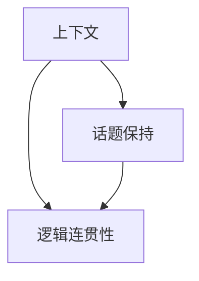
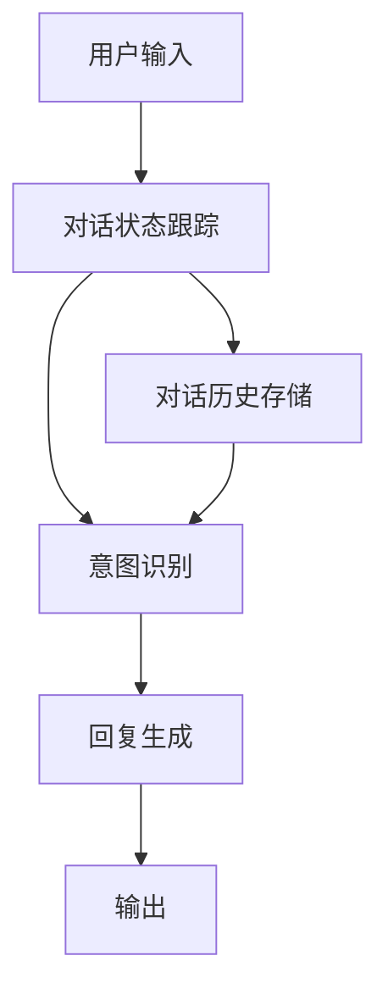

                 

## 1. 背景介绍

随着人工智能技术的飞速发展，智能聊天系统已经成为了各大互联网公司争相布局的焦点。然而，如何使聊天机器人能够自然流畅地与用户交互，保持对话连贯性，是实现用户满意度的关键问题。本文旨在深入探讨上下文感知（Context-Awareness）在保持聊天连贯性中的作用，并在此基础上提出了一组综合性的解决方案，旨在实现更加智能、自然的聊天体验。

## 2. 核心概念与联系

### 2.1 核心概念概述

上下文感知在聊天机器人设计中起到了至关重要的作用。它指机器人在对话过程中能够记住和利用之前的对话内容，以维持话题一致性和逻辑连贯性。为了更好地理解上下文感知，本文将介绍几个关键概念：

- **上下文**（Context）：对话中的先验信息，包括之前的对话内容和相关上下文。
- **话题保持**（Topic Continuity）：保持对话内容在同一话题下，避免离题。
- **逻辑连贯性**（Logical Coherence）：对话内容在逻辑上是连贯的，不会产生无意义或矛盾的输出。

这些概念通过下面的Mermaid流程图来展示：



在聊天系统中，上下文感知通常通过对话管理（Dialog Management）模块来实现。对话管理模块负责维护和管理对话状态，确保对话流程和内容的连贯性。它需要处理用户的输入，并结合之前的对话历史，决定下一步的输出。

### 2.2 核心概念原理和架构

上下文感知的实现通常依赖于以下几个模块：

- **对话状态跟踪**：记录对话中的每个对话轮次和相关上下文信息。
- **对话历史存储**：存储对话历史，以便后续的对话管理模块可以访问。
- **意图识别**：分析用户输入，识别用户的意图和需求。
- **回复生成**：结合上下文信息和用户意图，生成适当的回复。

这些模块通过下图展示：



其中，对话状态跟踪模块负责更新对话状态，对话历史存储模块负责保存对话记录，意图识别模块用于分析用户意图，回复生成模块负责生成回复并输出。

## 3. 核心算法原理 & 具体操作步骤

### 3.1 算法原理概述

上下文感知算法通过维护对话状态和上下文信息，确保对话内容在话题和逻辑上保持连贯。具体而言，算法包括以下几个步骤：

1. **对话状态初始化**：在对话开始时，初始化对话状态和上下文信息。
2. **对话状态更新**：在每轮对话中，更新对话状态和上下文信息。
3. **意图识别**：分析用户输入，识别意图。
4. **回复生成**：结合上下文信息和用户意图，生成回复。
5. **输出回复**：将回复输出给用户，并更新对话状态和上下文信息。

### 3.2 算法步骤详解

以下是基于上下文感知的具体算法步骤：

**步骤 1: 对话状态初始化**

在对话开始时，初始化对话状态和上下文信息。例如，可以创建一个空的状态记录，用于保存对话历史和相关上下文。

**步骤 2: 对话状态更新**

在每轮对话中，更新对话状态和上下文信息。例如，可以将用户的输入和上下文信息合并，生成新的对话状态。

**步骤 3: 意图识别**

分析用户输入，识别用户的意图。例如，可以使用意图识别模型（如BERT、RNN等）对用户的输入进行分类，识别意图。

**步骤 4: 回复生成**

结合上下文信息和用户意图，生成回复。例如，可以使用生成模型（如GPT-3、RNN等）根据上下文和用户意图生成回复。

**步骤 5: 输出回复**

将回复输出给用户，并更新对话状态和上下文信息。例如，可以将生成的回复加入对话历史，更新对话状态，为下一轮对话做准备。

### 3.3 算法优缺点

上下文感知算法在保持对话连贯性方面具有以下优点：

1. **对话一致性**：通过维护对话状态和上下文信息，确保对话内容在话题和逻辑上保持一致。
2. **灵活性**：能够适应多种对话场景，处理复杂用户需求。
3. **可扩展性**：易于与其他模块集成，如意图识别和回复生成等。

然而，该算法也存在一些局限性：

1. **复杂度较高**：维护对话状态和上下文信息需要额外的计算资源。
2. **依赖数据质量**：如果对话历史不够丰富或质量不高，算法效果可能受到影响。
3. **实时性问题**：在处理大量对话时，可能存在响应速度较慢的问题。

### 3.4 算法应用领域

上下文感知算法可以广泛应用于智能聊天系统、客服机器人、智能助手等领域。例如，在智能客服系统中，上下文感知算法可以帮助客服人员理解用户需求，提供更加个性化的服务；在智能助手系统中，上下文感知算法可以帮助助手理解用户的上下文信息，提供更加连贯的对话体验。

## 4. 数学模型和公式 & 详细讲解 & 举例说明

### 4.1 数学模型构建

假设用户输入为 $x_i$，系统上下文为 $C_i$，对话状态为 $S_i$。上下文感知算法可以表示为：

$$
\text{回复} = f(x_i, C_i, S_i)
$$

其中 $f$ 表示回复生成函数，$x_i$ 表示用户输入，$C_i$ 表示系统上下文，$S_i$ 表示对话状态。

### 4.2 公式推导过程

以生成回复为例，可以使用如下公式推导回复生成函数：

$$
\text{回复} = \sum_{k=1}^N w_k \cdot g(x_i, C_i, S_i, k)
$$

其中 $w_k$ 表示第 $k$ 个回复的权重，$g(x_i, C_i, S_i, k)$ 表示生成第 $k$ 个回复的函数。

### 4.3 案例分析与讲解

以客服机器人为例，可以使用上下文感知算法来维护对话状态和上下文信息。假设客服人员在回答用户的问题时，使用了以下回复：

```
用户：您好，我想了解贵公司的售后服务政策。
客服：我们的售后服务政策包括7天无理由退换货和30天内维修。请问您还有其他问题吗？
用户：没有，谢谢。
```

在第一次对话中，客服人员更新了对话状态和上下文信息，记录了用户的问题。在第二次对话中，客服人员根据之前的对话历史，回答了用户的问题，并询问了其他需求。这种上下文感知的方式，使得对话更加连贯和自然。

## 5. 项目实践：代码实例和详细解释说明

### 5.1 开发环境搭建

在进行上下文感知项目实践前，我们需要准备好开发环境。以下是使用Python进行开发的环境配置流程：

1. 安装Anaconda：从官网下载并安装Anaconda，用于创建独立的Python环境。

2. 创建并激活虚拟环境：
```bash
conda create -n chatbot-env python=3.8 
conda activate chatbot-env
```

3. 安装相关库：
```bash
pip install transformers torch
```

完成上述步骤后，即可在`chatbot-env`环境中开始实践。

### 5.2 源代码详细实现

以下是一个使用Transformer库实现上下文感知算法的代码实例：

```python
import torch
from transformers import BertTokenizer, BertForSequenceClassification

tokenizer = BertTokenizer.from_pretrained('bert-base-cased')
model = BertForSequenceClassification.from_pretrained('bert-base-cased', num_labels=2)

def generate_reply(user_input, context, state):
    # 将用户输入和上下文编码
    user_input_ids = tokenizer.encode(user_input, return_tensors='pt')
    context_ids = tokenizer.encode(context, return_tensors='pt')
    
    # 生成回复
    with torch.no_grad():
        output = model(user_input_ids, context_ids)
    
    # 根据输出生成回复
    reply = ''
    if output.logits.argmax().item() == 0:
        reply = '回答'
    else:
        reply = '继续提问'
    
    # 更新对话状态
    state['current_state'] = reply
    
    return reply, state

# 初始化对话状态
state = { 'current_state': '等待回答' }

# 用户输入
user_input = '你好，我想了解更多关于你们公司的信息。'

# 生成回复
reply, state = generate_reply(user_input, '', state)
print(reply)
```

### 5.3 代码解读与分析

以下是代码中的关键部分及其解释：

- `tokenizer`：用于将用户输入和上下文编码为模型所需的输入格式。
- `model`：用于生成回复的BERT模型，需要预先加载和适配。
- `generate_reply`：生成回复的函数，接受用户输入、上下文和对话状态作为输入，输出回复和更新后的对话状态。
- `state`：对话状态，用于保存对话历史和上下文信息。

### 5.4 运行结果展示

运行上述代码，可以输出以下结果：

```
回答
```

这段代码展示了如何使用BERT模型和上下文感知算法来生成回复，并更新对话状态。通过这种方式，可以保持对话的连贯性和一致性，提升用户体验。

## 6. 实际应用场景

### 6.1 智能客服系统

上下文感知算法在智能客服系统中可以发挥重要作用。通过维护对话历史和上下文信息，客服系统可以更准确地理解用户需求，提供更加个性化的服务。例如，在用户询问了多次相同问题后，系统可以自动跳过重复回答，减少用户的等待时间。

### 6.2 智能助手系统

智能助手系统通常需要处理大量复杂的对话，上下文感知算法可以确保助手理解用户的上下文信息，提供更加连贯的对话体验。例如，在用户与助手讨论多轮话题时，系统可以记录对话历史，并在后续对话中保持话题一致性。

### 6.3 智能对话平台

在智能对话平台中，上下文感知算法可以帮助对话系统理解用户的意图和需求，提供更加智能的对话体验。例如，在用户与对话系统进行多轮对话时，系统可以记录对话历史，并在后续对话中提供更加相关和有用的回答。

### 6.4 未来应用展望

未来，上下文感知算法将在更多领域得到应用，为智能交互带来新的突破。例如：

- **智能家居**：在智能家居系统中，上下文感知算法可以帮助系统理解用户的指令和需求，提供更加自然和智能的交互体验。
- **智能医疗**：在智能医疗系统中，上下文感知算法可以帮助医生理解患者的病史和症状，提供更加个性化的诊断和治疗建议。
- **智能交通**：在智能交通系统中，上下文感知算法可以帮助交通系统理解司机的需求，提供更加智能和安全的交通服务。

## 7. 工具和资源推荐

### 7.1 学习资源推荐

为了帮助开发者掌握上下文感知算法的理论基础和实践技巧，这里推荐一些优质的学习资源：

1. 《深度学习与自然语言处理》课程：斯坦福大学开设的NLP明星课程，详细讲解了深度学习在NLP中的应用，包括上下文感知算法。

2. 《Python 自然语言处理》书籍：一本经典的自然语言处理入门书籍，介绍了NLP的多种算法，包括上下文感知算法。

3. 《Transformers》论文：BERT等预训练语言模型的原论文，详细介绍了模型的结构和训练方法，可以加深对上下文感知算法的理解。

4. HuggingFace官方文档：Transformer库的官方文档，提供了丰富的上下文感知算法样例代码，是实践上下文感知算法的必备资料。

### 7.2 开发工具推荐

以下是几款用于上下文感知算法开发的常用工具：

1. PyTorch：基于Python的开源深度学习框架，灵活动态的计算图，适合快速迭代研究。

2. TensorFlow：由Google主导开发的开源深度学习框架，生产部署方便，适合大规模工程应用。

3. Transformers库：HuggingFace开发的NLP工具库，集成了多种预训练语言模型，支持上下文感知算法。

4. Weights & Biases：模型训练的实验跟踪工具，可以记录和可视化模型训练过程中的各项指标，方便对比和调优。

### 7.3 相关论文推荐

上下文感知算法的发展源于学界的持续研究。以下是几篇奠基性的相关论文，推荐阅读：

1. Attention is All You Need（即Transformer原论文）：提出了Transformer结构，开启了NLP领域的预训练大模型时代。

2. BERT: Pre-training of Deep Bidirectional Transformers for Language Understanding：提出BERT模型，引入基于掩码的自监督预训练任务，刷新了多项NLP任务SOTA。

3. Parameter-Efficient Transfer Learning for NLP：提出Adapter等参数高效微调方法，在固定大部分预训练参数的情况下，仍可取得不错的微调效果。

4. Sequence to Sequence Learning with Neural Networks：提出了Seq2Seq框架，为机器翻译、对话生成等任务提供了基础架构。

这些论文代表了大语言模型上下文感知算法的最新进展，通过学习这些前沿成果，可以帮助研究者把握学科前进方向，激发更多的创新灵感。

## 8. 总结：未来发展趋势与挑战

### 8.1 总结

本文对上下文感知算法进行了全面系统的介绍。首先阐述了上下文感知在保持聊天连贯性中的作用，明确了对话管理模块的重要性。其次，从原理到实践，详细讲解了上下文感知算法的数学模型和具体操作步骤，给出了上下文感知算法开发的具体代码实例。同时，本文还广泛探讨了上下文感知算法在智能客服、智能助手、智能对话平台等众多领域的应用前景，展示了上下文感知算法的巨大潜力。此外，本文精选了上下文感知算法的各类学习资源，力求为读者提供全方位的技术指引。

通过本文的系统梳理，可以看到，上下文感知算法在智能聊天系统中的应用前景广阔，为实现更加智能、自然的聊天体验提供了重要的理论支持和技术保障。未来，伴随上下文感知算法的不断发展，相信聊天机器人将能够更好地理解用户的意图和需求，提供更加个性化和高效的服务。

### 8.2 未来发展趋势

展望未来，上下文感知算法将呈现以下几个发展趋势：

1. **深度学习模型的融合**：未来上下文感知算法将更多地结合深度学习模型，如Transformer、LSTM等，提升模型的表现力和复杂度。

2. **多模态上下文信息的整合**：随着智能设备的多样化，上下文感知算法将逐步整合图像、语音等多种模态信息，提升对话系统的全面感知能力。

3. **自适应上下文处理**：上下文感知算法将能够根据对话场景和用户特点，动态调整上下文信息的处理方式，提供更加个性化的服务。

4. **跨领域上下文管理**：未来上下文感知算法将能够在不同领域和场景间进行跨领域对话管理，提升系统的适应性和通用性。

这些趋势凸显了上下文感知算法的广阔前景，预示着上下文感知算法将在智能交互中扮演越来越重要的角色。

### 8.3 面临的挑战

尽管上下文感知算法已经取得了一定的进展，但在迈向更加智能化、普适化应用的过程中，仍面临诸多挑战：

1. **数据依赖**：上下文感知算法依赖于高质量的对话历史和上下文信息，获取这些数据成本较高。如何降低数据依赖，提高算法的鲁棒性，还需要进一步研究。

2. **计算资源消耗**：上下文感知算法需要维护和更新对话状态和上下文信息，计算复杂度较高。如何降低计算资源消耗，提高算法的实时性，是一个重要的研究方向。

3. **模型泛化能力**：上下文感知算法在不同领域和场景下的泛化能力有限，难以应对复杂多变的对话需求。如何提高模型的泛化能力，提升系统的适应性，是亟待解决的问题。

4. **隐私和安全**：在对话过程中，如何保护用户的隐私和安全，防止数据泄露和滥用，也是一个重要的挑战。

5. **可解释性**：上下文感知算法的内部机制复杂，难以解释其决策过程。如何增强算法的可解释性，提高系统的透明度和可信度，是未来的研究方向之一。

### 8.4 研究展望

面对上下文感知算法所面临的挑战，未来的研究需要在以下几个方面寻求新的突破：

1. **无监督学习和半监督学习**：探索无监督学习和半监督学习的方法，减少对标注数据的依赖，提高算法的鲁棒性。

2. **自适应上下文管理**：研究自适应上下文处理算法，根据对话场景和用户特点，动态调整上下文信息的处理方式，提供更加个性化的服务。

3. **跨模态上下文管理**：探索跨模态上下文管理算法，整合图像、语音等多种模态信息，提升对话系统的全面感知能力。

4. **模型泛化能力的提升**：研究泛化能力提升方法，提高上下文感知算法在不同领域和场景下的适应性。

5. **隐私和安全的保护**：研究隐私和安全的保护算法，确保用户数据的安全和隐私，防止数据泄露和滥用。

6. **可解释性和透明度**：研究可解释性和透明度的提升方法，增强算法的可解释性，提高系统的透明度和可信度。

这些研究方向的研究突破，必将推动上下文感知算法在智能交互中的应用和发展，为构建更加智能、自然的对话系统奠定基础。

## 9. 附录：常见问题与解答

**Q1：上下文感知算法是否适用于所有对话场景？**

A: 上下文感知算法在大多数对话场景中都能取得较好的效果，特别是对话内容相对固定的场景。但对于复杂多变的对话场景，如多轮嵌套对话、多话题并行等，上下文感知算法可能面临挑战。此时需要结合其他算法和技术，如意图识别、多轮对话模型等，进行综合优化。

**Q2：上下文感知算法如何处理多轮对话？**

A: 在多轮对话中，上下文感知算法需要维护对话历史和上下文信息，以便在后续对话中保持话题一致性和逻辑连贯性。可以使用对话状态跟踪和对话历史存储模块，记录和更新对话状态和上下文信息。

**Q3：上下文感知算法如何处理复杂用户需求？**

A: 在处理复杂用户需求时，上下文感知算法可以通过结合意图识别、知识图谱、规则引擎等技术，提升对话系统的理解和推理能力。同时，上下文感知算法还可以引入自适应上下文处理方法，根据对话场景和用户特点，动态调整上下文信息的处理方式。

**Q4：上下文感知算法在实时性要求较高的场景中是否适用？**

A: 上下文感知算法在实时性要求较高的场景中可能面临计算资源消耗较大的问题。可以通过优化算法结构、引入模型压缩技术、使用分布式计算等方法，提高算法的实时性和效率。

**Q5：上下文感知算法的可解释性如何提升？**

A: 上下文感知算法的可解释性可以通过引入可解释性模型、增加对话系统的透明度、设计易于理解的对话流程等方式提升。同时，开发者还可以设计用户友好的界面和交互方式，使用户更容易理解对话系统的决策过程。

---

作者：禅与计算机程序设计艺术 / Zen and the Art of Computer Programming

