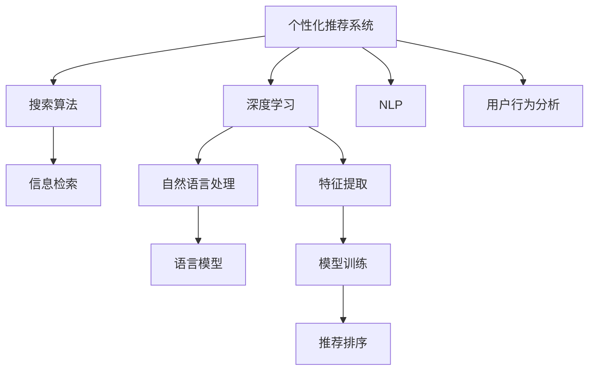

                 

# 个性化AI搜索：挑战与机遇

> 关键词：
个性化推荐系统, 搜索算法, 信息检索, 深度学习, 自然语言处理, 算法优化, 可解释性, 应用场景

## 1. 背景介绍

### 1.1 问题由来

随着互联网技术的飞速发展，信息爆炸成为不争的事实，海量数据的出现为搜索引擎的个性化推荐功能提供了基础。用户通常期望在浏览网页、购买商品或阅读新闻时，得到与其兴趣、行为或意图高度相关的结果。因此，个性化搜索系统的建设变得尤为重要。

当前，个性化搜索主要依赖机器学习模型进行构建。具体来说，通过用户的点击行为、浏览历史、购买记录等数据，学习用户的兴趣偏好，并以此为基础，进行内容推荐。但是，这些传统方法在面对海量的数据和复杂的用户需求时，常常显得力不从心。

深度学习的发展为个性化搜索带来了新的希望。深度神经网络可以处理复杂数据，从中学习到用户的潜在兴趣，并进行智能推荐。特别是在自然语言处理(NLP)领域的进展，进一步增强了个性化搜索的精准度和相关性。

### 1.2 问题核心关键点

个性化搜索的核心在于理解用户意图，从庞大的数据海中快速准确地检索到用户感兴趣的信息。具体而言，需要考虑以下几个方面：

- **数据处理与分析**：如何高效地从用户行为数据中提取有价值的信息，形成用户画像。
- **推荐算法**：如何构建和优化推荐算法，实现个性化推荐。
- **搜索算法**：如何优化信息检索算法，保证搜索结果的准确性和相关性。
- **用户体验**：如何设计界面和交互方式，提升用户体验，增强系统粘性。
- **模型可解释性**：如何提高推荐系统的透明度，让用户理解和信任推荐结果。

本文将重点探讨基于深度学习的个性化搜索算法，分析其在信息检索、推荐系统等场景下的应用和挑战，并展望未来发展的趋势。

## 2. 核心概念与联系

### 2.1 核心概念概述

为更好地理解个性化AI搜索算法，本节将介绍几个密切相关的核心概念：

- **个性化推荐系统**：通过分析用户的历史行为和兴趣偏好，向用户推荐可能感兴趣的内容。
- **搜索算法**：根据用户查询，在信息库中快速检索相关文档或内容。
- **深度学习**：一种从数据中学习抽象特征和模式的人工智能方法，能够处理复杂非结构化数据。
- **自然语言处理(NLP)**：使计算机能够理解、处理和生成人类语言的技术。
- **信息检索**：在大型数据库中快速、准确地检索信息。
- **模型可解释性**：确保推荐系统的决策过程可被用户理解和信任。

这些概念之间的逻辑关系可以通过以下Mermaid流程图来展示：



这个流程图展示了个性化搜索系统的核心概念及其之间的关系：

1. 用户行为分析：通过分析用户的历史行为数据，形成用户画像。
2. 深度学习与特征提取：使用深度学习模型，从用户行为数据中提取特征，捕捉用户的兴趣偏好。
3. 模型训练与推荐排序：基于提取的特征，训练深度学习模型，并利用模型进行推荐排序，输出结果。
4. 信息检索与自然语言处理：在推荐结果基础上，进行信息检索，利用自然语言处理技术提升搜索结果的精准度。
5. 用户体验：通过用户界面设计，提升用户体验，增强系统粘性。

## 3. 核心算法原理 & 具体操作步骤

### 3.1 算法原理概述

个性化AI搜索的算法原理主要依赖深度学习模型，特别是通过自然语言处理(NLP)技术，理解和处理用户的查询意图。具体来说，步骤如下：

1. **用户行为分析**：通过用户的浏览历史、购买记录等数据，学习用户的兴趣偏好。
2. **特征提取**：将用户行为数据转化为高维特征向量，供深度学习模型处理。
3. **模型训练**：利用用户特征和查询标签，训练深度学习模型，形成个性化推荐模型。
4. **推荐排序**：根据用户的查询，利用训练好的模型进行推荐排序，输出最相关的结果。
5. **信息检索**：在推荐结果的基础上，使用信息检索技术，找到最匹配的文档或内容。

### 3.2 算法步骤详解

具体来说，基于深度学习的个性化搜索算法可以分为以下步骤：

**Step 1: 用户行为分析**
- 收集用户的历史行为数据，如浏览记录、点击行为、搜索历史、购买记录等。
- 使用TF-IDF、协同过滤等方法，提取用户的兴趣特征。
- 利用聚类算法，对用户进行分类，形成用户画像。

**Step 2: 特征提取**
- 对用户行为数据进行预处理，去除噪声和冗余信息。
- 利用自然语言处理技术，如词袋模型、TF-IDF、Word2Vec等，将文本数据转化为高维特征向量。
- 使用卷积神经网络(CNN)、循环神经网络(RNN)或Transformer等深度学习模型，对特征进行提取和编码。

**Step 3: 模型训练**
- 使用监督学习算法，如多层感知器(MLP)、支持向量机(SVM)等，训练推荐模型。
- 使用深度学习模型，如神经网络、卷积神经网络、循环神经网络等，对特征进行深度学习，捕捉用户兴趣。
- 在训练过程中，使用交叉验证、网格搜索等方法，选择最优的模型超参数。

**Step 4: 推荐排序**
- 根据用户的查询，提取查询关键词。
- 利用训练好的模型，预测用户对不同内容的兴趣程度。
- 使用排序算法，如最大似然排序、基于学习的排序等，对预测结果进行排序，输出最相关的推荐结果。

**Step 5: 信息检索**
- 利用信息检索算法，如倒排索引、TF-IDF、BM25等，在信息库中快速检索相关文档。
- 结合自然语言处理技术，对检索结果进行文本匹配，提高搜索结果的准确性和相关性。

### 3.3 算法优缺点

基于深度学习的个性化搜索算法具有以下优点：

1. 高度准确性：深度学习模型可以从大规模数据中学习到复杂的特征表示，从而提高推荐和搜索的准确性。
2. 自适应性：通过不断学习用户行为，深度学习模型能够适应用户的兴趣变化，提供更精准的推荐和搜索。
3. 高效性：深度学习模型能够并行处理大量数据，加速推荐和搜索的计算速度。

同时，也存在一些缺点：

1. 数据依赖性：深度学习模型需要大量的标注数据进行训练，标注成本较高。
2. 计算资源需求高：深度学习模型通常需要高性能的计算资源，包括GPU/TPU等。
3. 模型复杂度：深度学习模型结构复杂，需要大量的超参数调整，可能导致过拟合。
4. 可解释性不足：深度学习模型通常是"黑盒"系统，缺乏透明度，难以解释其决策过程。

### 3.4 算法应用领域

基于深度学习的个性化搜索算法已经在多个领域得到广泛应用，具体包括：

- **电子商务**：如Amazon、淘宝等电商平台，通过个性化推荐，提升用户购物体验。
- **新闻媒体**：如谷歌新闻、今日头条等新闻平台，通过个性化推荐，提供用户感兴趣的新闻内容。
- **社交网络**：如微信、微博等社交平台，通过个性化推荐，增强用户粘性和互动性。
- **视频平台**：如YouTube、爱奇艺等视频平台，通过个性化推荐，提高用户观看体验。
- **内容推荐**：如Netflix、Spotify等内容平台，通过个性化推荐，提升用户满意度。

## 4. 数学模型和公式 & 详细讲解 & 举例说明

### 4.1 数学模型构建

为了更好地理解基于深度学习的个性化搜索算法，我们需要使用数学语言进行更加严格的刻画。

假设用户行为数据为 $X=\{x_1,x_2,\cdots,x_n\}$，每个用户行为 $x_i$ 表示为一个高维向量 $x_i \in \mathbb{R}^d$。根据用户的兴趣特征，我们将用户分为 $k$ 个类别，每个类别的兴趣特征表示为一个高维向量 $y_i \in \mathbb{R}^d$。

定义推荐模型为 $M_{\theta}:\mathcal{X} \rightarrow \mathcal{Y}$，其中 $\theta$ 为模型参数。模型的输出为 $\hat{y}=M_{\theta}(x)$，表示模型对用户兴趣的预测。

### 4.2 公式推导过程

假设使用多层感知器(MLP)作为推荐模型，其结构为：

$$
\hat{y} = M_{\theta}(x) = W_Lh_{L-1} + b_L
$$

其中 $h_{L-1}$ 为隐藏层特征，$W_L,b_L$ 为全连接层权重和偏置。

在训练过程中，我们希望最小化预测误差 $L(M_{\theta},X)$：

$$
L(M_{\theta},X) = \frac{1}{N}\sum_{i=1}^N \ell(\hat{y}_i,y_i)
$$

其中 $\ell(\cdot,\cdot)$ 为损失函数，如均方误差、交叉熵等。

使用随机梯度下降(SGD)算法，优化目标函数 $L(M_{\theta},X)$，得到：

$$
\theta \leftarrow \theta - \eta\nabla_{\theta}L(M_{\theta},X)
$$

其中 $\eta$ 为学习率。

### 4.3 案例分析与讲解

以一个简单的推荐系统为例，使用神经网络模型进行推荐排序：

假设用户查询为 $q$，每个商品的特征表示为 $x_1,x_2,\cdots,x_m$，模型的输出为 $y_1,y_2,\cdots,y_m$，表示商品 $x_i$ 的推荐程度。模型的损失函数为交叉熵：

$$
\ell(M_{\theta},X) = -\frac{1}{N}\sum_{i=1}^N \sum_{j=1}^m y_j \log \hat{y}_j
$$

使用随机梯度下降算法，最小化损失函数：

$$
\theta \leftarrow \theta - \eta\nabla_{\theta}L(M_{\theta},X)
$$

在训练过程中，需要不断调整学习率 $\eta$、批次大小、迭代轮数等超参数，以获得最优的推荐结果。

## 5. 项目实践：代码实例和详细解释说明

### 5.1 开发环境搭建

在进行个性化搜索算法开发前，我们需要准备好开发环境。以下是使用Python进行TensorFlow开发的环境配置流程：

1. 安装Anaconda：从官网下载并安装Anaconda，用于创建独立的Python环境。

2. 创建并激活虚拟环境：
```bash
conda create -n tf-env python=3.8 
conda activate tf-env
```

3. 安装TensorFlow：根据CUDA版本，从官网获取对应的安装命令。例如：
```bash
conda install tensorflow
```

4. 安装各类工具包：
```bash
pip install numpy pandas scikit-learn matplotlib tqdm jupyter notebook ipython
```

完成上述步骤后，即可在`tf-env`环境中开始开发。

### 5.2 源代码详细实现

下面我们以个性化推荐系统为例，给出使用TensorFlow进行模型开发的PyTorch代码实现。

首先，定义推荐模型：

```python
import tensorflow as tf
from tensorflow.keras import layers

model = tf.keras.Sequential([
    layers.Dense(128, activation='relu'),
    layers.Dense(1, activation='sigmoid')
])
```

然后，定义训练函数：

```python
def train_epoch(model, dataset, batch_size, optimizer):
    model.compile(optimizer=optimizer, loss='binary_crossentropy', metrics=['accuracy'])
    model.fit(dataset, batch_size=batch_size, epochs=10, validation_split=0.2)
```

接着，定义评估函数：

```python
def evaluate(model, dataset, batch_size):
    model.evaluate(dataset, batch_size=batch_size)
```

最后，启动训练流程并在测试集上评估：

```python
epochs = 10
batch_size = 16

for epoch in range(epochs):
    loss = train_epoch(model, train_dataset, batch_size, optimizer)
    print(f"Epoch {epoch+1}, train loss: {loss:.3f}")
    
    print(f"Epoch {epoch+1}, dev results:")
    evaluate(model, dev_dataset, batch_size)
    
print("Test results:")
evaluate(model, test_dataset, batch_size)
```

以上就是使用TensorFlow进行个性化推荐系统微调的完整代码实现。可以看到，TensorFlow提供了一套简洁高效的API，使得模型的构建和训练变得简便易用。

### 5.3 代码解读与分析

让我们再详细解读一下关键代码的实现细节：

**Sequential模型**：
- `Sequential` 是TensorFlow的高层API，用于定义顺序神经网络模型。
- 定义了一个包含两个全连接层的神经网络，第一个层有128个神经元，使用ReLU激活函数，第二个层有1个神经元，使用sigmoid激活函数，输出预测结果。

**train_epoch函数**：
- `compile` 方法用于编译模型，指定优化器和损失函数。
- `fit` 方法用于训练模型，指定训练集、批次大小、迭代轮数等。
- `validation_split` 参数指定验证集的划分比例。

**evaluate函数**：
- `evaluate` 方法用于评估模型，输出训练集和验证集的损失和准确率。

**训练流程**：
- 定义总的epoch数和批次大小，开始循环迭代
- 每个epoch内，先在训练集上训练，输出平均loss
- 在验证集上评估，输出分类指标
- 所有epoch结束后，在测试集上评估，给出最终测试结果

可以看到，TensorFlow提供了一套灵活易用的API，使得模型的构建和训练变得简便易用。开发者可以将更多精力放在数据处理、模型改进等高层逻辑上，而不必过多关注底层的实现细节。

当然，工业级的系统实现还需考虑更多因素，如模型的保存和部署、超参数的自动搜索、更灵活的任务适配层等。但核心的微调范式基本与此类似。

## 6. 实际应用场景

### 6.1 智能客服系统

个性化搜索技术可以广泛应用于智能客服系统的构建。传统客服往往需要配备大量人力，高峰期响应缓慢，且一致性和专业性难以保证。通过个性化搜索技术，智能客服系统可以7x24小时不间断服务，快速响应客户咨询，用自然流畅的语言解答各类常见问题。

在技术实现上，可以收集企业内部的历史客服对话记录，将问题和最佳答复构建成监督数据，在此基础上对预训练模型进行微调。微调后的模型能够自动理解用户意图，匹配最合适的答案模板进行回复。对于客户提出的新问题，还可以接入检索系统实时搜索相关内容，动态组织生成回答。如此构建的智能客服系统，能大幅提升客户咨询体验和问题解决效率。

### 6.2 金融舆情监测

金融机构需要实时监测市场舆论动向，以便及时应对负面信息传播，规避金融风险。传统的人工监测方式成本高、效率低，难以应对网络时代海量信息爆发的挑战。基于个性化搜索技术的文本分类和情感分析技术，为金融舆情监测提供了新的解决方案。

具体而言，可以收集金融领域相关的新闻、报道、评论等文本数据，并对其进行主题标注和情感标注。在此基础上对预训练语言模型进行微调，使其能够自动判断文本属于何种主题，情感倾向是正面、中性还是负面。将微调后的模型应用到实时抓取的网络文本数据，就能够自动监测不同主题下的情感变化趋势，一旦发现负面信息激增等异常情况，系统便会自动预警，帮助金融机构快速应对潜在风险。

### 6.3 个性化推荐系统

当前的推荐系统往往只依赖用户的历史行为数据进行物品推荐，无法深入理解用户的真实兴趣偏好。基于个性化搜索技术的推荐系统可以更好地挖掘用户行为背后的语义信息，从而提供更精准、多样的推荐内容。

在实践中，可以收集用户浏览、点击、评论、分享等行为数据，提取和用户交互的物品标题、描述、标签等文本内容。将文本内容作为模型输入，用户的后续行为（如是否点击、购买等）作为监督信号，在此基础上微调预训练语言模型。微调后的模型能够从文本内容中准确把握用户的兴趣点。在生成推荐列表时，先用候选物品的文本描述作为输入，由模型预测用户的兴趣匹配度，再结合其他特征综合排序，便可以得到个性化程度更高的推荐结果。

### 6.4 未来应用展望

随着个性化搜索技术的发展，其应用场景将不断扩展，带来更多创新和机遇：

1. **智慧医疗**：基于个性化搜索技术的医疗问答、病历分析、药物研发等应用，将提升医疗服务的智能化水平，辅助医生诊疗，加速新药开发进程。
2. **智能教育**：微调后的推荐系统可应用于作业批改、学情分析、知识推荐等方面，因材施教，促进教育公平，提高教学质量。
3. **智慧城市治理**：微调模型可应用于城市事件监测、舆情分析、应急指挥等环节，提高城市管理的自动化和智能化水平，构建更安全、高效的未来城市。
4. **智能娱乐**：个性化搜索技术在文娱传媒、游戏等领域，可以根据用户喜好推荐电影、音乐、游戏等娱乐内容，提升用户体验。
5. **智能办公**：在办公场景中，推荐系统可以推荐合适的文档、工具、同事等信息，提高工作效率。

未来，伴随深度学习技术的不断进步，个性化搜索技术将在更多领域得到应用，为各行各业带来变革性影响。

## 7. 工具和资源推荐

### 7.1 学习资源推荐

为了帮助开发者系统掌握深度学习在个性化搜索中的应用，这里推荐一些优质的学习资源：

1. **《深度学习基础》系列博文**：由深度学习领域的专家撰写，深入浅出地介绍了深度学习的基本原理、常用模型和算法。
2. **CS231n《深度学习计算机视觉》课程**：斯坦福大学开设的计算机视觉课程，涵盖深度学习在图像、视频等领域的应用。
3. **《自然语言处理》书籍**：涵盖NLP的基本概念和经典模型，是理解个性化搜索技术的重要基础。
4. **TensorFlow官方文档**：提供全面的API文档和教程，方便开发者快速上手TensorFlow。
5. **Kaggle数据集**：包含丰富的NLP、推荐系统等数据集，适合进行模型训练和评估。

通过对这些资源的学习实践，相信你一定能够快速掌握深度学习在个性化搜索中的应用，并用于解决实际的NLP问题。

### 7.2 开发工具推荐

高效的开发离不开优秀的工具支持。以下是几款用于深度学习开发和训练的工具：

1. **TensorFlow**：由Google主导开发的深度学习框架，提供灵活的API和丰富的工具库。
2. **PyTorch**：Facebook开发的深度学习框架，提供动态计算图和便捷的开发环境。
3. **MXNet**：由Apache开发的深度学习框架，支持分布式训练和多语言支持。
4. **Keras**：基于TensorFlow和Theano的高级API，方便模型构建和训练。
5. **Jupyter Notebook**：提供交互式编程环境，方便开发和调试。

合理利用这些工具，可以显著提升深度学习模型的开发效率，加速创新迭代的步伐。

### 7.3 相关论文推荐

深度学习在个性化搜索技术的发展源于学界的持续研究。以下是几篇奠基性的相关论文，推荐阅读：

1. **Attention is All You Need**（即Transformer原论文）：提出了Transformer结构，开启了深度学习在NLP领域的预训练范式。
2. **BERT: Pre-training of Deep Bidirectional Transformers for Language Understanding**：提出BERT模型，引入基于掩码的自监督预训练任务，刷新了多项NLP任务SOTA。
3. **Recurrent Neural Network for Pairwise Preference Estimation**：提出使用RNN模型进行推荐排序，取得了较好的效果。
4. **The Embedding of Named Entities in Knowledge Base Populated by Wikipedia and Web Search Engines**：提出使用词向量表示实体，改进推荐排序。
5. **Hierarchical Topic Model for Scalable Collaborative Filtering**：提出使用层次化主题模型改进协同过滤推荐系统。

这些论文代表了个性化搜索技术的发展脉络。通过学习这些前沿成果，可以帮助研究者把握学科前进方向，激发更多的创新灵感。

## 8. 总结：未来发展趋势与挑战

### 8.1 总结

本文对基于深度学习的个性化搜索算法进行了全面系统的介绍。首先阐述了个性化搜索系统的研究背景和意义，明确了深度学习在推荐和搜索中的应用价值。其次，从原理到实践，详细讲解了推荐系统的数学模型和关键步骤，给出了推荐系统开发的完整代码实例。同时，本文还广泛探讨了推荐系统在智能客服、金融舆情、个性化推荐等多个行业领域的应用前景，展示了深度学习在个性化搜索领域的广阔前景。

通过本文的系统梳理，可以看到，基于深度学习的个性化搜索技术正在成为NLP领域的重要范式，极大地拓展了推荐系统的应用边界，催生了更多的落地场景。未来，伴随深度学习技术的不断进步，推荐系统必将在更广阔的应用领域大放异彩，深刻影响人类的生产生活方式。

### 8.2 未来发展趋势

展望未来，个性化搜索技术将呈现以下几个发展趋势：

1. **深度学习模型优化**：随着深度学习模型的不断优化，推荐和搜索的准确性和效率将进一步提升。
2. **跨领域应用拓展**：个性化搜索技术将扩展到更多领域，如智慧医疗、智能教育、智慧城市等。
3. **多模态融合**：将视觉、语音、文本等多模态数据结合，提高推荐和搜索的全面性和多样性。
4. **联邦学习**：通过联邦学习技术，保护用户隐私的同时，提升推荐和搜索的个性化程度。
5. **可解释性增强**：提高推荐和搜索的透明度，使用户理解系统的决策过程。
6. **实时性提升**：通过流计算技术，实现推荐和搜索的实时处理，提升用户体验。

以上趋势凸显了个性化搜索技术的广阔前景。这些方向的探索发展，必将进一步提升推荐系统的性能和应用范围，为人类认知智能的进化带来深远影响。

### 8.3 面临的挑战

尽管个性化搜索技术已经取得了瞩目成就，但在迈向更加智能化、普适化应用的过程中，它仍面临着诸多挑战：

1. **数据隐私问题**：如何在保护用户隐私的前提下，获取高质量的推荐和搜索数据，是一个重要难题。
2. **模型复杂度**：深度学习模型通常结构复杂，需要大量的超参数调整，可能导致过拟合。
3. **计算资源消耗**：深度学习模型需要高性能的计算资源，如GPU/TPU等，如何在有限的资源条件下提升性能，是一个关键问题。
4. **可解释性不足**：深度学习模型通常是"黑盒"系统，缺乏透明度，难以解释其决策过程。
5. **跨领域泛化能力**：当前推荐和搜索模型往往局限于特定的领域，如何提高其跨领域泛化能力，是一个重要研究方向。
6. **多模态数据融合**：将视觉、语音、文本等多模态数据结合，提高推荐和搜索的全面性和多样性，是一个重要研究方向。

正视个性化搜索面临的这些挑战，积极应对并寻求突破，将是个性化搜索技术走向成熟的必由之路。相信随着学界和产业界的共同努力，这些挑战终将一一被克服，个性化搜索技术必将在构建人机协同的智能时代中扮演越来越重要的角色。

### 8.4 研究展望

面对个性化搜索技术所面临的种种挑战，未来的研究需要在以下几个方面寻求新的突破：

1. **探索无监督和半监督学习**：摆脱对大规模标注数据的依赖，利用自监督学习、主动学习等无监督和半监督范式，最大限度利用非结构化数据，实现更加灵活高效的推荐和搜索。
2. **研究参数高效和计算高效的推荐和搜索算法**：开发更加参数高效的推荐和搜索算法，在固定大部分预训练参数的同时，只更新极少量的任务相关参数。同时优化推荐和搜索算法的计算图，减少前向传播和反向传播的资源消耗，实现更加轻量级、实时性的部署。
3. **引入更多先验知识**：将符号化的先验知识，如知识图谱、逻辑规则等，与神经网络模型进行巧妙融合，引导推荐和搜索过程学习更准确、合理的语言模型。同时加强不同模态数据的整合，实现视觉、语音等多模态信息与文本信息的协同建模。
4. **结合因果分析和博弈论工具**：将因果分析方法引入推荐和搜索模型，识别出模型决策的关键特征，增强推荐和搜索结果的因果性和逻辑性。借助博弈论工具刻画人机交互过程，主动探索并规避模型的脆弱点，提高系统稳定性。
5. **纳入伦理道德约束**：在推荐和搜索模型训练目标中引入伦理导向的评估指标，过滤和惩罚有偏见、有害的输出倾向。同时加强人工干预和审核，建立模型行为的监管机制，确保输出符合人类价值观和伦理道德。

这些研究方向的探索，必将引领个性化搜索技术迈向更高的台阶，为构建安全、可靠、可解释、可控的智能系统铺平道路。面向未来，深度学习技术还需要与其他人工智能技术进行更深入的融合，如知识表示、因果推理、强化学习等，多路径协同发力，共同推动推荐和搜索系统的进步。只有勇于创新、敢于突破，才能不断拓展深度学习技术的边界，让智能技术更好地造福人类社会。

## 9. 附录：常见问题与解答

**Q1：如何提高个性化推荐系统的推荐效果？**

A: 提高个性化推荐系统的推荐效果，可以从以下几个方面进行优化：

1. **数据质量**：收集高质量、多样化的用户行为数据，消除噪声和冗余信息。
2. **特征工程**：设计有效的特征提取方法，提取用户兴趣的深度特征。
3. **模型优化**：选择合适的深度学习模型和超参数，进行模型优化和调参。
4. **上下文感知**：考虑上下文信息，如时间、地点、事件等，提升推荐效果。
5. **多模型集成**：通过多模型集成，综合不同模型的优点，提升推荐准确性。

**Q2：个性化推荐系统如何处理长尾问题？**

A: 长尾问题是推荐系统中常见的挑战之一，可以通过以下方法来解决：

1. **基于协同过滤的推荐**：协同过滤方法可以较好地处理长尾问题，因为它可以利用用户群体的集体智慧，发现隐藏在长尾中的少数用户的需求。
2. **使用深度学习模型**：深度学习模型可以从大量数据中学习到复杂的特征表示，提高长尾物品的推荐准确性。
3. **引入元学习**：通过元学习技术，提前学习长尾物品的表示，提升推荐效果。
4. **多级推荐**：采用多级推荐策略，先通过全局推荐找到长尾物品，再进行更详细的推荐。

**Q3：推荐系统中如何处理稀疏数据？**

A: 推荐系统中的稀疏数据问题可以通过以下方法来解决：

1. **矩阵分解**：使用矩阵分解方法，将用户-物品的交互矩阵分解为低秩矩阵，提高推荐效果。
2. **隐语义模型**：使用隐语义模型，将用户行为转化为隐向量表示，提升推荐效果。
3. **邻域过滤**：通过邻域过滤方法，利用与目标用户相似的其他用户的行为数据，进行推荐。
4. **分布式学习**：通过分布式学习技术，分散计算负载，提高推荐效率。

**Q4：推荐系统如何实现实时推荐？**

A: 实现实时推荐，需要以下几个步骤：

1. **实时数据采集**：使用流式数据采集技术，实时获取用户行为数据。
2. **实时模型训练**：利用流式计算技术，实时训练推荐模型。
3. **实时推荐排序**：根据实时数据和模型，实时生成推荐结果。
4. **实时反馈处理**：对用户的实时反馈进行实时处理，更新推荐模型。

**Q5：推荐系统中如何处理冷启动问题？**

A: 冷启动问题是推荐系统中常见的挑战之一，可以通过以下方法来解决：

1. **基于内容的推荐**：利用物品的属性和特征，进行基于内容的推荐。
2. **基于特征工程的推荐**：利用用户的兴趣特征，进行推荐。
3. **基于社交网络的推荐**：利用社交网络中的信息，进行推荐。
4. **基于深度学习的推荐**：利用深度学习模型，学习用户的兴趣和行为，进行推荐。

通过本文的系统梳理，可以看到，基于深度学习的个性化搜索技术正在成为NLP领域的重要范式，极大地拓展了推荐系统的应用边界，催生了更多的落地场景。未来，伴随深度学习技术的不断进步，推荐系统必将在更广阔的应用领域大放异彩，深刻影响人类的生产生活方式。

---

作者：禅与计算机程序设计艺术 / Zen and the Art of Computer Programming

