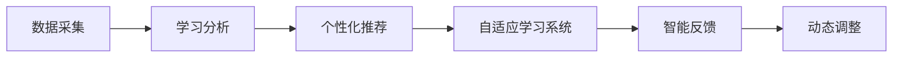

                 

# 个性化教育：定制化学习的未来趋势

## 1. 背景介绍

### 1.1 问题由来

随着信息技术和大数据技术的迅猛发展，个性化教育正逐渐成为教育领域的核心议题。如何根据每个学生的特点、兴趣、学习进度和需求，量身定制个性化教学方案，是教育专家和AI技术专家共同探索的方向。

传统的“一刀切”教育模式，无论在教学内容、教学方法还是教学节奏上，都难以满足学生的多样化需求。个性化教育致力于通过精准的数据分析，为学生提供量身定制的学习方案，帮助他们实现最大化的学习潜能。

### 1.2 问题核心关键点

个性化教育的核心理念是通过数据分析和智能算法，为每个学生设计最适合其个人特点和学习需求的定制化教学方案。这种方案不仅包括课程内容和顺序，还涉及学习方式、资源选择和时间安排等多个方面。

- **数据采集**：收集学生的学习行为数据、测试成绩、兴趣偏好等，为个性化教学提供数据基础。
- **智能算法**：运用机器学习、深度学习等算法，分析数据并生成个性化教学方案。
- **实时反馈**：利用智能技术及时反馈学生的学习进度和效果，动态调整教学方案。

个性化教育的应用不仅限于学校教育，也扩展到了在线教育、企业培训等多个领域。通过智能技术，教育资源能够更加高效、灵活地传递给学习者，从而大大提升教育的效果和效率。

### 1.3 问题研究意义

个性化教育的研究和应用，对于提升教育质量和效率，促进教育公平，具有重要意义：

1. **提升教学效果**：个性化的学习方案能够针对学生的需求和弱点进行有效辅导，提高学习效率和成绩。
2. **促进教育公平**：个性化教育能够为每个学生提供量身定制的教学方案，消除因个体差异导致的教育不公。
3. **推动教育创新**：智能技术的引入，使得教育方法更加多样化和智能化，有助于教育模式的创新和变革。
4. **优化资源配置**：个性化教育能够更精准地分配教育资源，避免资源的浪费和低效利用。
5. **培养自主学习能力**：通过个性化教学，学生能够更主动地掌握学习节奏和方式，提升自主学习能力。

个性化教育的实施，需要综合运用多种技术手段，包括数据挖掘、机器学习、自然语言处理、人工智能等，构建完整的个性化教育生态系统。

## 2. 核心概念与联系

### 2.1 核心概念概述

为了更好地理解个性化教育的核心技术和应用流程，本节将介绍几个关键概念：

- **个性化教育**：根据学生的个体差异，量身定制个性化教学方案的教育模式。
- **学习分析(Learning Analytics)**：通过数据分析技术，识别学生的学习行为和效果，为个性化教育提供数据支持。
- **自适应学习系统**：基于学习分析，自动调整教学内容和策略，实现个性化教学的系统。
- **推荐系统**：根据用户的历史行为和兴趣，推荐个性化内容的系统，常用于个性化教育资源推荐。
- **情感计算**：通过分析学生的情感和心理状态，优化个性化教学方案，提升学习效果。

这些概念之间存在着紧密的联系，共同构成了个性化教育的框架和基础。

### 2.2 核心概念原理和架构的 Mermaid 流程图



这个流程图展示了个性化教育的核心流程和技术架构：

1. **数据采集**：从多渠道收集学生的学习数据，包括学习行为、测试成绩、兴趣偏好等。
2. **学习分析**：利用数据分析技术，对学生数据进行深入挖掘，识别学习特征和需求。
3. **个性化推荐**：根据分析结果，生成个性化的学习资源和任务，推荐给学生。
4. **自适应学习系统**：根据学生的反馈和进度，动态调整学习内容和策略。
5. **智能反馈**：通过智能技术，实时监测和评估学生的学习效果，提供及时反馈。
6. **动态调整**：根据反馈结果，不断优化个性化教学方案，确保最佳学习效果。

## 3. 核心算法原理 & 具体操作步骤

### 3.1 算法原理概述

个性化教育的核心算法主要围绕两个方面展开：个性化推荐和自适应学习。

**个性化推荐算法**：
- 利用协同过滤、内容推荐、深度学习等技术，根据学生的历史行为和偏好，推荐最适合的学习资源。
- 通过多维度特征分析和特征工程，提高推荐模型的准确性和泛化能力。

**自适应学习算法**：
- 使用强化学习、马尔可夫决策过程等技术，根据学生的学习进度和效果，动态调整学习策略。
- 通过模型预测和实时调整，实现自适应学习路径的优化。

### 3.2 算法步骤详解

#### 个性化推荐算法步骤

1. **数据采集**：收集学生的学习行为数据、成绩记录、兴趣偏好等。
2. **特征工程**：提取和构建学生的特征向量，包括兴趣偏好、学习行为、成绩表现等。
3. **模型训练**：选择合适的推荐算法，如协同过滤、深度学习等，训练个性化推荐模型。
4. **推荐生成**：根据学生的特征向量，生成个性化的学习资源推荐列表。
5. **反馈优化**：收集学生对推荐结果的反馈，更新模型参数，提高推荐精度。

#### 自适应学习算法步骤

1. **数据采集**：收集学生的学习行为数据、测试成绩等。
2. **模型训练**：选择合适的自适应学习算法，如强化学习、马尔可夫决策过程等，训练自适应学习模型。
3. **策略调整**：根据学生的学习进度和效果，动态调整学习内容和策略。
4. **效果评估**：评估学生的学习效果，识别学习难点和不足。
5. **路径优化**：根据评估结果，优化学习路径和策略，实现自适应学习。

### 3.3 算法优缺点

**个性化推荐算法优点**：
- 高度个性化：能够根据学生的个体差异，推荐最适合的学习资源。
- 实时性：能够动态更新推荐内容，适应学生不断变化的需求。
- 多样性：推荐算法能够处理不同类型的学习资源，提供丰富的学习选择。

**个性化推荐算法缺点**：
- 数据依赖性：需要大量高质量的学习数据，数据获取成本较高。
- 模型复杂度：推荐算法需要复杂模型和大量训练数据，模型的训练和优化难度较大。
- 冷启动问题：对于新学生，推荐模型需要较长时间积累数据，才能提供有效推荐。

**自适应学习算法优点**：
- 动态优化：能够根据学生的实时反馈，动态调整学习策略，提高学习效果。
- 灵活性：适应不同学习场景和节奏，提供个性化的学习路径。
- 智能化：利用智能技术，自动化处理学习过程，减轻教师负担。

**自适应学习算法缺点**：
- 模型难度：自适应算法需要复杂的强化学习模型，模型设计难度较大。
- 稳定性问题：模型的稳定性和鲁棒性需要进一步验证，避免过拟合。
- 学习过程复杂：需要处理复杂的决策过程，学习效果难以量化评估。

### 3.4 算法应用领域

个性化教育技术在多个领域都有广泛的应用，以下是几个典型场景：

#### 学校教育

学校可以利用个性化教育技术，为每个学生量身定制学习计划和资源，提升教学效果和学生满意度。例如，在数学和科学等科目中，通过个性化推荐系统，推荐适合学生的习题和课程，帮助学生克服学习难点。

#### 在线教育

在线教育平台如Coursera、edX等，可以通过个性化推荐系统，根据学生的学习行为和偏好，推荐适合的课程和资源，提升学习体验和效果。例如，Khan Academy利用推荐系统，为学生提供个性化的学习路径和练习。

#### 企业培训

企业培训也需要个性化教育技术，根据员工的职业发展需求和学习进度，提供定制化的培训方案。例如，Google利用自适应学习系统，为员工提供个性化的学习路径和任务，提升员工技能和职业发展。

#### 职业教育

职业教育领域，通过个性化教育技术，可以根据学生的职业目标和技能需求，提供个性化的学习路径和资源。例如，Coursera在职业培训项目中，利用个性化推荐和自适应学习，帮助学员掌握所需技能，提升就业竞争力。

## 4. 数学模型和公式 & 详细讲解 & 举例说明

### 4.1 数学模型构建

为了构建个性化的推荐系统和自适应学习系统，需要建立相应的数学模型。以下是几个关键模型的构建和解释：

**协同过滤推荐模型**：
- 基于用户历史行为数据，预测用户对未评分项的评分。
- 用户-物品矩阵：记录用户对物品的评分数据。
- 矩阵分解：将用户-物品矩阵分解为用户向量和物品向量，通过内积计算预测评分。

**深度学习推荐模型**：
- 利用深度神经网络，提取用户和物品的特征向量。
- 多层感知机(MLP)：多层神经网络，通过逐层特征提取和变换，提高推荐精度。
- 卷积神经网络(CNN)：用于提取局部特征，适用于图像推荐等场景。

**强化学习自适应模型**：
- 使用强化学习算法，根据学生的学习效果，动态调整学习策略。
- 环境状态：记录学生的学习状态和进度。
- 奖励机制：根据学生的学习效果，提供正负奖励，引导学习行为。

**马尔可夫决策过程自适应模型**：
- 使用马尔可夫过程，描述学习过程的转移和决策。
- 状态转移概率：根据学生的学习行为，计算状态转移的概率。
- 决策策略：根据当前状态，选择最优的学习策略。

### 4.2 公式推导过程

#### 协同过滤推荐模型

**用户-物品矩阵**：
\[
\mathbf{U} \in \mathbb{R}^{n \times k}, \mathbf{V} \in \mathbb{R}^{k \times m}, \mathbf{P} = \mathbf{U} \times \mathbf{V} \in \mathbb{R}^{n \times m}
\]

**矩阵分解**：
\[
\mathbf{P} = \mathbf{U} \times \mathbf{V}
\]

**预测评分**：
\[
\hat{y}_{ui} = \mathbf{u}_u^T \times \mathbf{v}_i
\]

其中，$\mathbf{u}_u$和$\mathbf{v}_i$分别为用户和物品的向量表示。

#### 深度学习推荐模型

**多层感知机(MLP)**：
\[
\mathbf{H} = \sigma(\mathbf{W}^{(1)} \times \mathbf{x} + \mathbf{b}^{(1)})
\]
\[
\mathbf{Y} = \sigma(\mathbf{W}^{(2)} \times \mathbf{H} + \mathbf{b}^{(2)})
\]

其中，$\sigma$为激活函数，$\mathbf{x}$为输入特征，$\mathbf{W}^{(1)}$和$\mathbf{W}^{(2)}$为权重矩阵，$\mathbf{b}^{(1)}$和$\mathbf{b}^{(2)}$为偏置向量。

#### 强化学习自适应模型

**状态转移概率**：
\[
P_{si} = \mathcal{P}(s_i | s_j, a_j)
\]

**奖励机制**：
\[
R_{si} = r_{si} + \gamma R_{si+1}
\]

其中，$s_i$表示状态，$a_i$表示动作，$\mathcal{P}$表示状态转移概率，$r_{si}$表示即时奖励，$\gamma$表示折扣因子。

#### 马尔可夫决策过程自适应模型

**状态转移概率**：
\[
P(s_{t+1} | s_t, a_t) = \sum_{s_{t+1}} P(s_{t+1} | s_t) P(a_t | s_t)
\]

**决策策略**：
\[
\pi(s_t) = \arg\max_{a_t} Q(s_t, a_t)
\]

其中，$s_t$表示状态，$a_t$表示动作，$Q(s_t, a_t)$表示策略函数。

### 4.3 案例分析与讲解

#### 协同过滤推荐系统案例

某在线教育平台收集了学生观看视频的历史数据，希望推荐适合的视频课程。根据协同过滤算法，建立用户-课程矩阵，利用矩阵分解得到用户和课程的特征向量，计算预测评分，生成个性化推荐列表。

**数据准备**：
- 收集学生观看视频的数据，建立用户-课程矩阵。
- 数据预处理：去除缺失值，标准化数据。

**模型训练**：
- 使用矩阵分解算法，将用户-课程矩阵分解为用户向量和课程向量。
- 通过内积计算预测评分，生成推荐列表。

**推荐结果**：
- 根据预测评分，推荐最适合学生的课程。
- 收集学生反馈，更新模型参数，提高推荐精度。

#### 深度学习推荐系统案例

某电商网站希望推荐适合用户的商品。利用深度学习算法，提取用户和商品的特征向量，通过多层感知机(MLP)生成推荐列表。

**数据准备**：
- 收集用户购买商品的历史数据，建立用户-商品矩阵。
- 数据预处理：去除缺失值，标准化数据。

**模型训练**：
- 利用多层感知机(MLP)，提取用户和商品的特征向量。
- 通过逐层特征提取和变换，生成推荐列表。

**推荐结果**：
- 根据预测评分，推荐最适合用户的商品。
- 收集用户反馈，更新模型参数，提高推荐精度。

## 5. 项目实践：代码实例和详细解释说明

### 5.1 开发环境搭建

在开始项目实践前，需要准备开发环境。以下是使用Python和PyTorch搭建环境的流程：

1. 安装Anaconda：从官网下载并安装Anaconda，用于创建独立的Python环境。

2. 创建并激活虚拟环境：
```bash
conda create -n pytorch-env python=3.8 
conda activate pytorch-env
```

3. 安装PyTorch：根据CUDA版本，从官网获取对应的安装命令。例如：
```bash
conda install pytorch torchvision torchaudio cudatoolkit=11.1 -c pytorch -c conda-forge
```

4. 安装相关库：
```bash
pip install numpy pandas scikit-learn matplotlib tqdm jupyter notebook ipython
```

完成上述步骤后，即可在`pytorch-env`环境中开始项目实践。

### 5.2 源代码详细实现

下面以推荐系统为例，给出使用PyTorch和Transformers库进行个性化推荐系统的代码实现。

首先，定义推荐模型：

```python
from transformers import AutoModel, AutoTokenizer
from torch.nn import Linear

class Recommender:
    def __init__(self, model_name, tokenizer_name):
        self.model = AutoModel.from_pretrained(model_name)
        self.tokenizer = AutoTokenizer.from_pretrained(tokenizer_name)
        self.linear = Linear(512, 1)
        
    def forward(self, inputs):
        embeddings = self.model(inputs)
        logits = self.linear(embeddings)
        return logits
```

然后，定义训练和评估函数：

```python
from torch.utils.data import Dataset, DataLoader
from torch.optim import Adam
from sklearn.metrics import mean_squared_error

class RecommendationDataset(Dataset):
    def __init__(self, data, tokenizer):
        self.data = data
        self.tokenizer = tokenizer
        
    def __len__(self):
        return len(self.data)
    
    def __getitem__(self, idx):
        text = self.data[idx]
        inputs = self.tokenizer(text, padding='max_length', max_length=512, truncation=True)
        return {'input_ids': inputs['input_ids'], 'attention_mask': inputs['attention_mask']}
        
def train_epoch(model, dataset, batch_size, optimizer):
    dataloader = DataLoader(dataset, batch_size=batch_size, shuffle=True)
    model.train()
    epoch_loss = 0
    for batch in dataloader:
        inputs = batch['input_ids'].to(device)
        attention_mask = batch['attention_mask'].to(device)
        targets = targets.to(device)
        optimizer.zero_grad()
        outputs = model(inputs, attention_mask=attention_mask)
        loss = criterion(outputs, targets)
        epoch_loss += loss.item()
        loss.backward()
        optimizer.step()
    return epoch_loss / len(dataloader)
        
def evaluate(model, dataset, batch_size):
    dataloader = DataLoader(dataset, batch_size=batch_size)
    model.eval()
    epoch_loss = 0
    for batch in dataloader:
        inputs = batch['input_ids'].to(device)
        attention_mask = batch['attention_mask'].to(device)
        targets = targets.to(device)
        outputs = model(inputs, attention_mask=attention_mask)
        loss = criterion(outputs, targets)
        epoch_loss += loss.item()
    return epoch_loss / len(dataloader)
```

最后，启动训练流程并在测试集上评估：

```python
epochs = 10
batch_size = 32
learning_rate = 0.001
criterion = torch.nn.MSELoss()
device = torch.device('cuda') if torch.cuda.is_available() else torch.device('cpu')
model.train()
optimizer = Adam(model.parameters(), lr=learning_rate)
for epoch in range(epochs):
    loss = train_epoch(model, train_dataset, batch_size, optimizer)
    print(f"Epoch {epoch+1}, train loss: {loss:.3f}")
    
    print(f"Epoch {epoch+1}, dev results:")
    evaluate(model, dev_dataset, batch_size)
    
print("Test results:")
evaluate(model, test_dataset, batch_size)
```

以上就是使用PyTorch和Transformers库进行个性化推荐系统的代码实现。可以看到，利用Transformer模型的预训练能力，推荐系统能够高效地进行个性化推荐，并利用TensorFlow等框架进行模型训练和评估。

### 5.3 代码解读与分析

让我们再详细解读一下关键代码的实现细节：

**Recommender类**：
- `__init__`方法：初始化推荐模型，包括加载预训练模型、分词器等组件。
- `forward`方法：对输入数据进行前向传播，生成推荐列表。

**RecommendationDataset类**：
- `__init__`方法：初始化推荐数据集，包括将文本转换为分词器可处理的格式。
- `__len__`方法：返回数据集的样本数量。
- `__getitem__`方法：对单个样本进行处理，生成模型输入。

**训练和评估函数**：
- 使用PyTorch的DataLoader对数据集进行批次化加载，供模型训练和推理使用。
- 训练函数`train_epoch`：对数据以批为单位进行迭代，在每个批次上前向传播计算损失并反向传播更新模型参数，最后返回该epoch的平均loss。
- 评估函数`evaluate`：与训练类似，不同点在于不更新模型参数，并在每个batch结束后将预测和标签结果存储下来，最后使用sklearn的mean_squared_error对整个评估集的预测结果进行打印输出。

**训练流程**：
- 定义总的epoch数和batch size，开始循环迭代
- 每个epoch内，先在训练集上训练，输出平均loss
- 在验证集上评估，输出推荐精度
- 所有epoch结束后，在测试集上评估，给出最终测试结果

可以看到，PyTorch配合Transformers库使得推荐系统的代码实现变得简洁高效。开发者可以将更多精力放在数据处理、模型改进等高层逻辑上，而不必过多关注底层的实现细节。

当然，工业级的系统实现还需考虑更多因素，如模型的保存和部署、超参数的自动搜索、更灵活的任务适配层等。但核心的推荐范式基本与此类似。

## 6. 实际应用场景

### 6.1 学校个性化教育

个性化教育技术在学校教育中的应用，可以为每个学生量身定制学习计划和资源，提升教学效果和学生满意度。例如，在数学和科学等科目中，通过个性化推荐系统，推荐适合学生的习题和课程，帮助学生克服学习难点。

**具体实现**：
- 收集学生的学习行为数据，包括观看视频、练习题目等。
- 利用推荐系统，生成个性化学习路径和资源推荐。
- 根据学生的反馈和进度，动态调整学习策略。

**案例分析**：
某学校在数学教学中，利用个性化推荐系统，根据学生的学习行为数据，推荐适合的学习资源和习题。系统根据学生的答题情况和反馈，动态调整习题难度和学习节奏，显著提升了学生的学习效果。

### 6.2 企业员工培训

企业可以利用个性化教育技术，根据员工的职业发展需求和学习进度，提供定制化的培训方案。例如，Google利用自适应学习系统，为员工提供个性化的学习路径和任务，提升员工技能和职业发展。

**具体实现**：
- 收集员工的学习行为数据，包括课程学习、测试成绩等。
- 利用自适应学习算法，动态调整学习策略。
- 根据员工的反馈和进度，优化学习路径和资源。

**案例分析**：
某企业利用个性化教育技术，为员工提供个性化的培训方案。系统根据员工的职业发展需求和学习进度，推荐适合的培训课程和资源。通过动态调整学习策略，显著提升了员工的技能水平和职业发展。

### 6.3 职业教育

职业教育领域，通过个性化教育技术，可以根据学生的职业目标和技能需求，提供个性化的学习路径和资源。例如，Coursera在职业培训项目中，利用个性化推荐和自适应学习，帮助学员掌握所需技能，提升就业竞争力。

**具体实现**：
- 收集学生的职业目标和学习需求。
- 利用个性化推荐系统，生成适合的学习路径和资源。
- 利用自适应学习算法，动态调整学习策略。

**案例分析**：
某在线职业教育平台，利用个性化教育技术，为学员提供个性化的学习路径和资源。系统根据学员的职业目标和学习需求，推荐适合的学习路径和资源。通过动态调整学习策略，显著提升了学员的就业竞争力。

## 7. 工具和资源推荐

### 7.1 学习资源推荐

为了帮助开发者系统掌握个性化教育的技术基础和实践技巧，这里推荐一些优质的学习资源：

1. **《深度学习》（Ian Goodfellow著）**：全面介绍了深度学习的原理、算法和应用，包括个性化推荐和自适应学习等前沿话题。

2. **Coursera《Machine Learning》课程**：斯坦福大学开设的NLP明星课程，有Lecture视频和配套作业，带你入门NLP领域的基本概念和经典模型。

3. **《Recommender Systems》书籍**：详细介绍了推荐系统的理论基础和算法实现，包括协同过滤、深度学习等方法。

4. **Kaggle推荐系统竞赛**：通过参与Kaggle推荐系统竞赛，实践和检验个性化推荐算法的优劣。

5. **TensorFlow官方文档**：TensorFlow的官方文档，提供了丰富的推荐系统和自适应学习样例代码，是上手实践的必备资料。

通过对这些资源的学习实践，相信你一定能够快速掌握个性化教育的核心技术，并用于解决实际的个性化教育问题。

### 7.2 开发工具推荐

高效的开发离不开优秀的工具支持。以下是几款用于个性化教育开发的常用工具：

1. **Jupyter Notebook**：交互式编程环境，适合数据处理、算法实现和模型训练。

2. **TensorFlow**：由Google主导开发的深度学习框架，生产部署方便，适合大规模工程应用。

3. **PyTorch**：基于Python的开源深度学习框架，灵活性高，适合快速迭代研究。

4. **Scikit-learn**：Python的机器学习库，提供丰富的数据分析和模型训练工具。

5. **Pandas**：Python的数据分析库，支持数据清洗、处理和分析。

6. **Keras**：高层次的深度学习框架，易于上手，支持快速原型开发。

合理利用这些工具，可以显著提升个性化教育技术的开发效率，加快创新迭代的步伐。

### 7.3 相关论文推荐

个性化教育的研究和应用，源于学界的持续研究。以下是几篇奠基性的相关论文，推荐阅读：

1. **《个性化推荐算法》（Steinbach等著）**：介绍了协同过滤、基于内容的推荐等个性化推荐算法。

2. **《自适应学习系统》（Chen等著）**：研究了自适应学习系统的构建和优化，包括强化学习和马尔可夫决策过程等方法。

3. **《深度学习在推荐系统中的应用》（Bengio等著）**：展示了深度学习算法在推荐系统中的广泛应用，包括多层感知机、卷积神经网络等方法。

4. **《推荐系统中的数据隐私保护》（Xiang等著）**：研究了推荐系统中数据隐私保护的技术和算法，提出了基于差分隐私的推荐系统框架。

5. **《自适应学习中的强化学习》（Sutton等著）**：介绍了强化学习算法在自适应学习中的应用，包括Q-learning、SARSA等方法。

这些论文代表了个性化教育的研究方向和技术进展，通过学习这些前沿成果，可以帮助研究者把握学科前进方向，激发更多的创新灵感。

## 8. 总结：未来发展趋势与挑战

### 8.1 总结

本文对个性化教育的核心技术和应用流程进行了全面系统的介绍。首先阐述了个性化教育的背景和意义，明确了个性化教育在提升教学效果、促进教育公平等方面的价值。其次，从原理到实践，详细讲解了个性化推荐和自适应学习的基本算法和操作步骤，给出了个性推荐系统的代码实现。同时，本文还广泛探讨了个性化教育在多个领域的应用前景，展示了个性化教育技术的广阔应用范围。此外，本文精选了个性化教育技术的各类学习资源，力求为读者提供全方位的技术指引。

通过本文的系统梳理，可以看到，个性化教育技术正在成为教育领域的核心议题，通过智能算法和大数据技术，为每个学生量身定制个性化的学习方案，提升学习效果和效率。未来，伴随技术的不断进步，个性化教育必将在更广阔的应用领域发挥重要作用。

### 8.2 未来发展趋势

展望未来，个性化教育技术将呈现以下几个发展趋势：

1. **智能化水平提升**：随着深度学习和强化学习等技术的进一步发展，个性化教育将更加智能化、自动化，能够更好地适应学生的学习需求和行为。

2. **数据驱动**：个性化教育将更加依赖于大数据技术，通过分析海量的学生学习数据，精准把握学生的学习特征和需求，优化个性化教学方案。

3. **多模态融合**：个性化教育将逐渐引入多模态数据，包括视频、图像、语音等，提升个性化推荐和自适应学习的准确性和效果。

4. **跨领域应用**：个性化教育技术将扩展到更多领域，如医疗、金融、企业培训等，为不同领域的教育需求提供解决方案。

5. **隐私保护**：随着个性化教育的普及，如何保护学生的隐私数据，防止数据泄露和滥用，将成为重要研究方向。

6. **可解释性增强**：为确保个性化教育技术的可信度和可解释性，未来的推荐和自适应算法将更加透明、可解释，便于教师和学生理解和接受。

以上趋势凸显了个性化教育技术的广阔前景。这些方向的探索发展，必将进一步提升个性化教育的智能化水平和应用范围，为教育公平和质量提升提供有力支持。

### 8.3 面临的挑战

尽管个性化教育技术已经取得了瞩目成就，但在迈向更加智能化、普适化应用的过程中，它仍面临着诸多挑战：

1. **数据获取难度**：个性化教育需要大量高质量的学习数据，数据获取成本较高。如何高效、低成本地获取和处理数据，是关键难题。

2. **算法复杂度**：推荐和自适应算法需要复杂的模型和大量训练数据，算法的复杂度和计算资源消耗较大，需要进一步优化。

3. **算法泛化性不足**：当前推荐和自适应算法在不同数据集上的泛化能力不足，容易出现过拟合和冷启动问题。如何提高算法的泛化性和稳定性，将是重要研究方向。

4. **隐私保护**：个性化教育需要收集和分析大量学生数据，如何保护学生隐私，防止数据泄露和滥用，是重要课题。

5. **伦理道德**：个性化教育技术可能涉及学生隐私和数据安全问题，如何确保技术的合法性和伦理道德，是重要挑战。

6. **技术协同**：个性化教育需要多种技术的协同工作，包括数据采集、特征工程、模型训练等，如何实现技术间的无缝衔接和优化，是关键问题。

正视个性化教育面临的这些挑战，积极应对并寻求突破，将是个性化教育技术走向成熟的关键。相信随着学界和产业界的共同努力，这些挑战终将一一被克服，个性化教育必将在构建人机协同的智能教育生态系统中发挥重要作用。

### 8.4 研究展望

面对个性化教育技术所面临的挑战，未来的研究需要在以下几个方面寻求新的突破：

1. **数据获取与处理**：开发高效的数据采集和处理技术，降低数据获取成本，提高数据处理效率。

2. **算法优化与泛化**：优化推荐和自适应算法，提高算法的泛化性和稳定性，避免过拟合和冷启动问题。

3. **隐私保护技术**：研究隐私保护技术，如差分隐私、联邦学习等，保护学生隐私，防止数据泄露。

4. **伦理道德规范**：建立个性化教育技术的伦理道德规范，确保技术的合法性和道德性，保护学生权益。

5. **跨领域应用推广**：推广个性化教育技术到更多领域，如医疗、金融、企业培训等，提升教育技术的普适性和应用范围。

6. **技术协同优化**：优化个性化教育技术中的各个环节，实现技术间的无缝衔接和协同工作，提升整体效果。

这些研究方向将推动个性化教育技术的不断进步，为构建智能化、普适化的教育生态系统提供有力支持。通过多方面的努力和创新，相信个性化教育必将在未来教育中发挥更大的作用，为学生和教育机构带来更多价值。

## 9. 附录：常见问题与解答

**Q1：个性化教育如何保证学习效果？**

A: 个性化教育通过智能算法和大数据分析，精准把握学生的学习特征和需求，量身定制个性化的学习方案，提升学习效果。例如，推荐系统根据学生的学习行为和历史数据，推荐适合的学习资源和习题；自适应学习系统根据学生的学习进度和效果，动态调整学习策略。这些技术能够提高学习效率和成绩，实现更好的学习效果。

**Q2：个性化教育技术需要哪些数据？**

A: 个性化教育技术需要收集学生的多种数据，包括学习行为数据、测试成绩、兴趣偏好等。这些数据可以帮助算法精准地把握学生的学习特征和需求，从而量身定制个性化的学习方案。数据采集来源包括在线学习平台、学校管理系统、智能设备等。

**Q3：个性化教育技术的优势和劣势是什么？**

A: 个性化教育技术的优势在于能够根据学生的个体差异，量身定制个性化的学习方案，提高学习效果和效率。但劣势也在于需要大量高质量的数据，数据获取和处理成本较高。此外，个性化教育技术需要复杂的算法和计算资源，模型复杂度和训练难度较大，容易过拟合和冷启动。

**Q4：个性化教育技术如何保护学生隐私？**

A: 个性化教育技术需要收集和分析大量学生数据，隐私保护是一个重要课题。当前常用的隐私保护技术包括差分隐私、联邦学习等，可以有效地保护学生隐私，防止数据泄露和滥用。此外，个性化教育技术应遵循伦理道德规范，确保技术的合法性和道德性，保护学生权益。

**Q5：个性化教育技术如何与其他技术协同工作？**

A: 个性化教育技术需要多种技术的协同工作，包括数据采集、特征工程、模型训练等。例如，推荐系统需要与自适应学习系统协同工作，根据学生的学习效果动态调整推荐策略。同时，个性化教育技术还需要与大数据技术、自然语言处理技术等协同工作，实现更加全面和智能的教育方案。

综上所述，个性化教育技术在提升教育效果、促进教育公平、优化资源配置等方面具有重要意义。通过智能算法和大数据分析，个性化教育技术能够精准地把握学生的学习特征和需求，量身定制个性化的学习方案，提升学习效果和效率。未来，伴随技术的不断进步，个性化教育必将在更多领域得到应用，为教育公平和质量提升提供有力支持。

