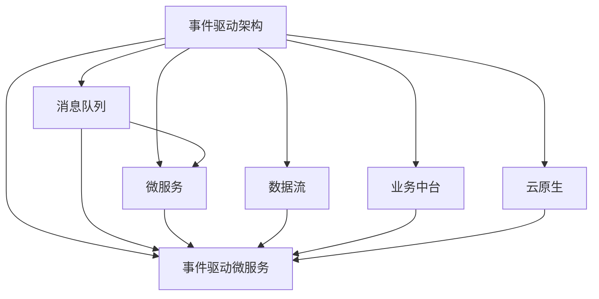
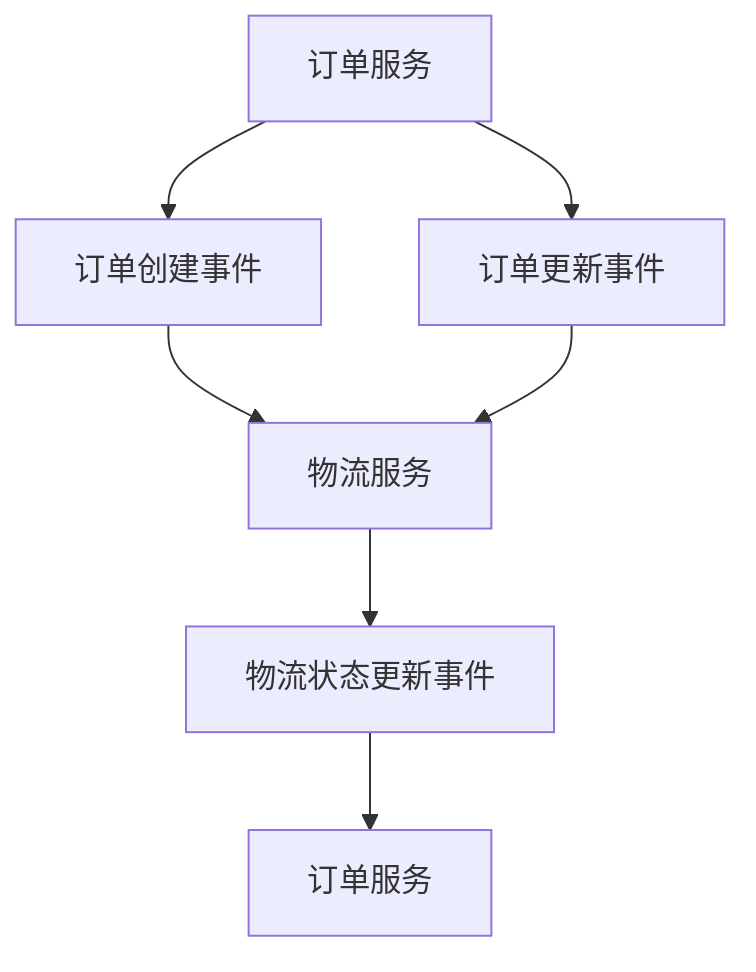

                 

# 事件驱动架构：构建响应式系统

> 关键词：事件驱动, 响应式系统, 消息队列, 微服务, 事件驱动微服务, 数据流, 业务中台, 云原生

## 1. 背景介绍

### 1.1 问题由来

在传统的单体应用架构中，应用组件直接相互调用，依赖于同步通信和状态共享。这种架构存在许多问题：

1. **高耦合性**：组件间依赖关系复杂，修改其中一个组件可能会导致整个系统瘫痪。
2. **可扩展性差**：单个应用的扩展受限于物理硬件资源，难以横向扩展。
3. **系统冗余高**：为了避免故障，组件间需要大量冗余复制，增加了系统复杂性和维护成本。
4. **故障隔离困难**：单个组件的故障容易引发全系统故障，故障定位和恢复复杂。

事件驱动架构（Event-Driven Architecture, EDA）通过引入消息队列、异步通信等机制，以事件为中心构建系统，有效解决了这些问题。EDA将组件解耦，使系统更具弹性和可扩展性，故障隔离更加容易。

### 1.2 问题核心关键点

事件驱动架构的核心思想是将系统拆分为多个组件，组件通过消息队列进行通信，每个组件专注于自身业务逻辑的实现，不需要了解其他组件的实现细节。这种架构不仅提高了系统的可扩展性和可维护性，还能通过事件驱动机制实现复杂的业务流程和异步处理。

EDA的核心要素包括：

1. **消息队列**：用于异步通信的机制，保证组件间的松耦合。
2. **微服务**：将系统拆分为多个独立运行的微服务，每个服务负责特定的业务功能。
3. **事件驱动微服务**：基于消息队列的消息驱动微服务，实现高效的异步通信。
4. **数据流**：描述事件在系统中流动的过程，包含数据的来源、流向和处理逻辑。
5. **业务中台**：用于提供共用的业务能力，减少组件间的重复开发和维护。
6. **云原生**：基于云平台构建的事件驱动架构，支持弹性伸缩和自动扩展。

### 1.3 问题研究意义

研究事件驱动架构对于提升系统的灵活性和可维护性，促进业务创新，具有重要意义：

1. **提升系统灵活性**：通过解耦组件，系统能够快速应对业务变化，适应市场竞争。
2. **提高系统可维护性**：组件独立运行，互不影响，方便模块化开发和维护。
3. **促进业务创新**：系统能够快速部署新功能，满足用户需求变化。
4. **降低开发和运维成本**：通过自动化和标准化，减少人工干预，提升效率。
5. **提高系统可靠性**：组件间的故障相互隔离，单一故障不会引发全系统崩溃。

## 2. 核心概念与联系

### 2.1 核心概念概述

为更好地理解事件驱动架构，本节将介绍几个密切相关的核心概念：

- **事件驱动架构**：通过事件流驱动组件进行通信和协作的架构模式。
- **消息队列**：用于异步通信的数据结构，支持解耦、异步处理和分布式系统构建。
- **微服务**：将应用拆分为多个独立运行的微服务，每个服务独立部署和管理。
- **事件驱动微服务**：基于消息队列进行事件驱动的微服务，支持异步通信和分布式协作。
- **数据流**：描述事件在系统中流动的过程，包含数据的来源、流向和处理逻辑。
- **业务中台**：提供共用的业务能力，减少组件间的重复开发和维护。
- **云原生**：基于云平台构建的事件驱动架构，支持弹性伸缩和自动扩展。

这些概念之间的逻辑关系可以通过以下Mermaid流程图来展示：



这个流程图展示了大语言模型的核心概念及其之间的关系：

1. 事件驱动架构通过消息队列进行组件间通信，解耦组件。
2. 微服务是事件驱动架构的重要组成部分，每个微服务负责特定的业务功能。
3. 事件驱动微服务基于消息队列进行异步通信，实现分布式系统。
4. 数据流描述了事件在系统中流动的过程，包含数据的来源、流向和处理逻辑。
5. 业务中台提供共用的业务能力，减少组件间的重复开发和维护。
6. 云原生支持事件驱动架构的弹性伸缩和自动扩展。

这些概念共同构成了事件驱动架构的基础框架，使其能够在各种场景下发挥强大的功能。通过理解这些核心概念，我们可以更好地把握事件驱动架构的工作原理和优化方向。

## 3. 核心算法原理 & 具体操作步骤
### 3.1 算法原理概述

事件驱动架构的算法原理主要基于消息队列和异步通信机制。其核心思想是：将系统拆分为多个独立的微服务，通过消息队列进行异步通信，实现组件间的解耦合。具体而言：

1. **事件触发**：系统中的各个组件通过事件触发器（如消息队列）发布事件，通知其他组件进行相应的处理。
2. **事件处理**：接收事件的组件根据事件类型执行相应的业务逻辑。
3. **事件流传递**：事件在系统中按需传递，保证数据流动的正确性和及时性。
4. **组件解耦**：各个组件独立运行，互不影响，提高了系统的可维护性和扩展性。

### 3.2 算法步骤详解

基于事件驱动架构的算法步骤主要包括：

**Step 1: 系统拆分**
- 将系统按照业务功能拆分为多个微服务，每个服务负责特定的业务逻辑。
- 设计微服务之间的接口，定义好数据格式和通信协议。

**Step 2: 消息队列部署**
- 选择适合的消息队列技术，如Kafka、RabbitMQ等，进行部署和配置。
- 定义消息队列的主题和分区，确保消息的可靠传递和分发。

**Step 3: 事件驱动微服务开发**
- 使用消息队列技术进行组件间通信，开发事件驱动的微服务。
- 实现业务逻辑，确保消息的可靠传递和处理。

**Step 4: 数据流设计**
- 设计数据流图，描述事件在系统中流动的过程。
- 确保数据流的正确性和完整性，避免数据丢失或重复。

**Step 5: 业务中台建设**
- 构建业务中台，提供共用的业务能力，减少组件间的重复开发和维护。
- 设计API接口，确保业务的快速接入和扩展。

**Step 6: 云原生架构部署**
- 基于云平台进行事件驱动架构的部署和扩展。
- 使用云原生技术，如Kubernetes、Istio等，实现自动扩展和故障恢复。

### 3.3 算法优缺点

事件驱动架构具有以下优点：

1. **高可扩展性**：微服务独立运行，互不影响，可以水平扩展。
2. **高可靠性**：组件间的故障相互隔离，单个故障不会引发全系统崩溃。
3. **低耦合性**：组件间通过消息队列进行通信，解耦合性强。
4. **灵活性高**：系统可以方便地进行功能扩展和业务创新。

然而，事件驱动架构也存在一些缺点：

1. **复杂性高**：系统设计需要考虑消息队列、事件流等复杂机制，增加了系统的复杂性。
2. **性能消耗高**：消息队列的处理需要消耗额外的计算资源，性能消耗较大。
3. **开发成本高**：开发和测试组件间的通信需要投入额外的工作量。

尽管存在这些局限性，但就目前而言，事件驱动架构仍然是构建响应式系统的最佳范式。未来相关研究的重点在于如何进一步优化消息队列、提高系统的可扩展性和性能，同时兼顾组件解耦和业务中台的建设。

### 3.4 算法应用领域

事件驱动架构已经在多个领域得到了广泛应用，覆盖了几乎所有常见的系统架构：

1. **金融系统**：用于处理大规模交易和实时监控，支持弹性和容错。
2. **电子商务**：用于商品推荐、订单管理等，提高系统的响应性和灵活性。
3. **物流系统**：用于订单处理、物流跟踪等，支持异步处理和实时更新。
4. **医疗系统**：用于患者预约、病历管理等，提高系统的可靠性和可扩展性。
5. **政务系统**：用于信息发布、数据共享等，支持高效的数据流动和业务协同。

除了上述这些经典应用外，事件驱动架构还被创新性地应用到更多场景中，如可控消息流、区块链、物联网等，为系统架构设计带来了新的思路。随着事件驱动架构的持续演进，相信在更多领域得到应用，为系统设计和开发带来新的可能性。

## 4. 数学模型和公式 & 详细讲解  
### 4.1 数学模型构建

事件驱动架构的数学模型主要基于消息队列和异步通信机制。其核心思想是：将系统拆分为多个独立的微服务，通过消息队列进行异步通信，实现组件间的解耦合。具体而言：

1. **事件触发**：系统中的各个组件通过事件触发器（如消息队列）发布事件，通知其他组件进行相应的处理。
2. **事件处理**：接收事件的组件根据事件类型执行相应的业务逻辑。
3. **事件流传递**：事件在系统中按需传递，保证数据流动的正确性和及时性。
4. **组件解耦**：各个组件独立运行，互不影响，提高了系统的可维护性和扩展性。

### 4.2 公式推导过程

以下我们以一个简单的电商订单系统为例，推导事件驱动架构的数学模型。

假设系统中有两个组件：订单服务（Order Service）和物流服务（Logistics Service）。订单服务负责处理订单信息，物流服务负责跟踪物流状态。

**事件定义**：
- 订单创建事件：当订单信息创建时，订单服务向物流服务发送创建订单事件。
- 订单更新事件：当订单信息更新时，订单服务向物流服务发送更新订单事件。
- 物流状态更新事件：当物流状态更新时，物流服务向订单服务发送物流状态更新事件。

**数据流图**：


**数学模型**：
设事件驱动架构中的事件流由事件 $E_i$ 组成，每个事件 $E_i$ 包含数据 $D_i$ 和处理函数 $F_i$。事件驱动架构的数学模型可以表示为：

$$
\mathcal{M} = \{E_i | E_i = (D_i, F_i)\}
$$

其中 $D_i$ 表示事件数据，$F_i$ 表示事件处理函数。事件流 $E_i$ 在系统中流动，最终完成数据处理。

**公式推导**：
1. **事件触发**：当事件 $E_i$ 触发时，事件流模型可以表示为：

$$
\mathcal{M} = \{E_i | E_i = (D_i, F_i)\}
$$

2. **事件处理**：当事件 $E_i$ 到达组件时，事件流模型可以表示为：

$$
\mathcal{M} = \{E_i | E_i = (D_i, F_i)\}
$$

3. **事件流传递**：当事件 $E_i$ 在系统中流动时，事件流模型可以表示为：

$$
\mathcal{M} = \{E_i | E_i = (D_i, F_i)\}
$$

4. **组件解耦**：当事件 $E_i$ 在组件间传递时，事件流模型可以表示为：

$$
\mathcal{M} = \{E_i | E_i = (D_i, F_i)\}
$$

通过上述推导，可以看出事件驱动架构的数学模型是基于事件流的，事件流在系统中流动，完成数据处理和业务逻辑执行。这种模型保证了系统的解耦合性和可扩展性，同时支持异步通信和分布式协作。

### 4.3 案例分析与讲解

以电子商务系统为例，事件驱动架构的应用场景主要包括以下几个方面：

1. **订单管理**：当订单创建、更新或删除时，系统通过订单服务向物流服务发送事件，通知物流服务进行相应的处理。
2. **物流跟踪**：当物流状态更新时，物流服务向订单服务发送事件，通知订单服务进行相应的处理。
3. **库存管理**：当订单创建或更新时，系统通过库存服务向订单服务发送事件，通知库存服务进行相应的处理。
4. **用户管理**：当用户登录或退出时，系统通过用户服务向订单服务发送事件，通知订单服务进行相应的处理。

通过事件驱动架构，电子商务系统实现了组件间的高效通信和异步处理，提高了系统的响应性和灵活性。同时，组件解耦合性保证了系统的可扩展性和可维护性。

## 5. 项目实践：代码实例和详细解释说明
### 5.1 开发环境搭建

在进行事件驱动架构的实践前，我们需要准备好开发环境。以下是使用Python进行Kafka开发的环境配置流程：

1. 安装Anaconda：从官网下载并安装Anaconda，用于创建独立的Python环境。

2. 创建并激活虚拟环境：
```bash
conda create -n event-driven-env python=3.8 
conda activate event-driven-env
```

3. 安装Kafka和Kafkacat：
```bash
conda install kafka-python
conda install kafkacat
```

4. 安装各类工具包：
```bash
pip install numpy pandas scikit-learn matplotlib tqdm jupyter notebook ipython
```

完成上述步骤后，即可在`event-driven-env`环境中开始事件驱动架构的实践。

### 5.2 源代码详细实现

下面我们以订单管理系统为例，给出使用Kafka实现事件驱动架构的Python代码实现。

首先，定义订单服务和物流服务的Kafka主题：

```python
from kafka import KafkaProducer

# 定义Kafka主题
ORDER_TOPIC = 'order-topic'
LOGISTICS_TOPIC = 'logistics-topic'

# 创建Kafka生产者
producer = KafkaProducer(bootstrap_servers='localhost:9092')
```

然后，定义订单服务的事件处理函数：

```python
from kafka import KafkaConsumer

# 定义订单服务的事件处理函数
def handle_order_event(event):
    # 解析事件数据
    event_data = json.loads(event['value'])
    
    # 根据事件类型执行相应处理
    if event_data['type'] == 'order-create':
        # 创建订单
        order_id = create_order(event_data['data'])
        # 发送物流服务创建订单事件
        send_logistics_event('order-create', order_id)
    elif event_data['type'] == 'order-update':
        # 更新订单
        update_order(event_data['data'])
    elif event_data['type'] == 'order-delete':
        # 删除订单
        delete_order(event_data['data'])
    else:
        # 其他事件
        pass

# 定义订单服务的事件处理函数
def send_logistics_event(event_type, order_id):
    # 发送物流服务事件
    event_data = {'order_id': order_id, 'type': event_type}
    event = {'key': str(order_id), 'value': json.dumps(event_data)}
    producer.send(LOGISTICS_TOPIC, key=str(order_id), value=json.dumps(event))
```

接着，定义物流服务的事件处理函数：

```python
from kafka import KafkaConsumer

# 定义物流服务的事件处理函数
def handle_logistics_event(event):
    # 解析事件数据
    event_data = json.loads(event['value'])
    
    # 根据事件类型执行相应处理
    if event_data['type'] == 'logistics-update':
        # 更新物流状态
        update_logistics(event_data['data'])
    else:
        # 其他事件
        pass

# 定义物流服务的事件处理函数
def update_logistics(event_data):
    # 更新物流状态
    logistics_id = event_data['data']['logistics_id']
    # 发送订单服务物流状态更新事件
    send_order_event('logistics-update', logistics_id)
```

最后，启动事件驱动架构的Kafka客户端，监听订单和物流服务的事件：

```python
from kafka import KafkaConsumer

# 创建Kafka消费者
consumer = KafkaConsumer('order-topic', bootstrap_servers='localhost:9092', auto_offset_reset='earliest')

# 定义事件处理函数
def handle_order_event(event):
    # 解析事件数据
    event_data = json.loads(event['value'])
    
    # 根据事件类型执行相应处理
    if event_data['type'] == 'order-create':
        # 创建订单
        order_id = create_order(event_data['data'])
        # 发送物流服务创建订单事件
        send_logistics_event('order-create', order_id)
    elif event_data['type'] == 'order-update':
        # 更新订单
        update_order(event_data['data'])
    elif event_data['type'] == 'order-delete':
        # 删除订单
        delete_order(event_data['data'])
    else:
        # 其他事件
        pass

# 定义事件处理函数
def send_logistics_event(event_type, order_id):
    # 发送物流服务事件
    event_data = {'order_id': order_id, 'type': event_type}
    event = {'key': str(order_id), 'value': json.dumps(event_data)}
    producer.send(LOGISTICS_TOPIC, key=str(order_id), value=json.dumps(event))

# 监听订单服务事件
for message in consumer:
    handle_order_event(message)
```

以上就是使用Kafka实现事件驱动架构的完整代码实现。可以看到，得益于Kafka的强大异步通信能力和丰富的客户端API，事件驱动架构的代码实现变得简洁高效。

### 5.3 代码解读与分析

让我们再详细解读一下关键代码的实现细节：

**订单服务**：
- 定义Kafka主题和生产者。
- 定义事件处理函数 `handle_order_event`，解析事件数据并根据类型执行相应处理。
- 定义事件发送函数 `send_logistics_event`，向物流服务发送创建、更新或删除订单事件。

**物流服务**：
- 定义Kafka主题和生产者。
- 定义事件处理函数 `handle_logistics_event`，解析事件数据并根据类型执行相应处理。
- 定义事件发送函数 `send_order_event`，向订单服务发送物流状态更新事件。

**事件驱动架构的启动**：
- 创建Kafka消费者，监听订单主题，解析订单事件。
- 定义事件处理函数 `handle_order_event`，根据事件类型执行相应处理。
- 启动事件处理函数，监听订单和物流服务的事件，并根据事件类型执行相应处理。

可以看到，Kafka的事件驱动架构代码实现简洁高效，通过异步通信实现了组件间的解耦合，支持事件驱动的微服务。开发者可以将更多精力放在业务逻辑和数据流的优化上，而不必过多关注底层的通信实现。

当然，工业级的系统实现还需考虑更多因素，如消息队列的安全性、可靠性、性能等，但核心的事件驱动架构基本与此类似。通过Kafka等先进的技术，可以实现高可靠、高扩展的事件驱动架构。

## 6. 实际应用场景
### 6.1 智能客服系统

基于事件驱动架构的智能客服系统，可以广泛应用于智能客服系统的构建。传统客服往往需要配备大量人力，高峰期响应缓慢，且一致性和专业性难以保证。而使用事件驱动架构的智能客服系统，可以7x24小时不间断服务，快速响应客户咨询，用自然流畅的语言解答各类常见问题。

在技术实现上，可以收集企业内部的历史客服对话记录，将问题和最佳答复构建成事件，在系统中传播。智能客服系统根据事件的流动路径，自动匹配最合适的答案模板进行回复。对于客户提出的新问题，还可以接入检索系统实时搜索相关内容，动态组织生成回答。如此构建的智能客服系统，能大幅提升客户咨询体验和问题解决效率。

### 6.2 金融舆情监测

金融机构需要实时监测市场舆论动向，以便及时应对负面信息传播，规避金融风险。传统的人工监测方式成本高、效率低，难以应对网络时代海量信息爆发的挑战。基于事件驱动架构的文本分类和情感分析技术，为金融舆情监测提供了新的解决方案。

具体而言，可以收集金融领域相关的新闻、报道、评论等文本数据，并对其进行主题标注和情感标注。在系统中创建相关事件，并将其发布到事件队列中。系统自动监测事件队列中的最新事件，通过文本分类和情感分析技术，判断文本属于何种主题，情感倾向是正面、中性还是负面。将分析结果通知决策系统，系统自动预警，帮助金融机构快速应对潜在风险。

### 6.3 个性化推荐系统

当前的推荐系统往往只依赖用户的历史行为数据进行物品推荐，无法深入理解用户的真实兴趣偏好。基于事件驱动架构的个性化推荐系统，可以更好地挖掘用户行为背后的语义信息，从而提供更精准、多样的推荐内容。

在实践中，可以收集用户浏览、点击、评论、分享等行为数据，提取和用户交互的物品标题、描述、标签等文本内容。将文本内容作为事件，并将其发布到事件队列中。系统自动监测事件队列中的最新事件，通过文本分类和情感分析技术，理解用户的兴趣点。在生成推荐列表时，先用候选物品的文本描述作为事件，由系统预测用户的兴趣匹配度，再结合其他特征综合排序，便可以得到个性化程度更高的推荐结果。

### 6.4 未来应用展望

随着事件驱动架构的发展，未来其在更多领域得到应用，为传统行业带来变革性影响：

在智慧医疗领域，基于事件驱动架构的医疗问答、病历分析、药物研发等应用将提升医疗服务的智能化水平，辅助医生诊疗，加速新药开发进程。

在智能教育领域，基于事件驱动架构的作业批改、学情分析、知识推荐等应用，因材施教，促进教育公平，提高教学质量。

在智慧城市治理中，基于事件驱动架构的城市事件监测、舆情分析、应急指挥等应用，提高城市管理的自动化和智能化水平，构建更安全、高效的未来城市。

此外，在企业生产、社会治理、文娱传媒等众多领域，基于事件驱动架构的人工智能应用也将不断涌现，为经济社会发展注入新的动力。相信随着技术的日益成熟，事件驱动架构必将在构建人机协同的智能时代中扮演越来越重要的角色。

## 7. 工具和资源推荐
### 7.1 学习资源推荐

为了帮助开发者系统掌握事件驱动架构的理论基础和实践技巧，这里推荐一些优质的学习资源：

1. 《事件驱动架构设计》系列博文：由事件驱动架构专家撰写，深入浅出地介绍了事件驱动架构的基本概念、核心要素和实践案例。

2. 《Event-Driven Microservices in Practice》书籍：Event-Driven Microservices的作者所著，全面介绍了如何使用Event-Driven Microservices进行NLP任务开发，包括事件驱动架构在内的诸多范式。

3. Kubernetes官方文档：Kubernetes的官方文档，提供了完整的Kafka和Event-Driven Microservices部署指南，是实践事件驱动架构的必备资料。

4. Kafka官方文档：Kafka的官方文档，提供了丰富的API接口和开发工具，支持高效的事件驱动架构开发。

5. Weights & Biases：模型训练的实验跟踪工具，可以记录和可视化事件驱动架构的训练过程，方便对比和调优。与主流深度学习框架无缝集成。

通过这些资源的学习实践，相信你一定能够快速掌握事件驱动架构的精髓，并用于解决实际的NLP问题。
###  7.2 开发工具推荐

高效的开发离不开优秀的工具支持。以下是几款用于事件驱动架构开发的常用工具：

1. Kafka：开源的消息队列系统，支持高可靠、高吞吐量的异步通信。

2. Kafkacat：Kafka的命令行工具，支持事件驱动架构的快速部署和调试。

3. Spring Boot：基于Spring框架的微服务开发框架，支持Kafka和Event-Driven Microservices的开发。

4. Apache Camel：开源的企业集成框架，支持多种数据源和协议的集成，适用于事件驱动架构的开发。

5. Weights & Biases：模型训练的实验跟踪工具，可以记录和可视化事件驱动架构的训练过程，方便对比和调优。与主流深度学习框架无缝集成。

6. TensorBoard：TensorFlow配套的可视化工具，可实时监测事件驱动架构的训练状态，并提供丰富的图表呈现方式，是调试模型的得力助手。

合理利用这些工具，可以显著提升事件驱动架构的开发效率，加快创新迭代的步伐。

### 7.3 相关论文推荐

事件驱动架构的研究源于学界的持续研究。以下是几篇奠基性的相关论文，推荐阅读：

1. The Event-Driven Architecture: A Survey and Taxonomy：对事件驱动架构进行全面综述，定义了事件驱动架构的基本概念和核心要素。

2. Event-Driven Microservices for Financial Systems：将事件驱动架构应用于金融系统，展示其在高可用性、高扩展性方面的优势。

3. Event-Driven Architecture for E-commerce Systems：将事件驱动架构应用于电子商务系统，展示其在高灵活性、高可靠性方面的优势。

4. Event-Driven Architecture for Logistics Systems：将事件驱动架构应用于物流系统，展示其在高异步处理、高实时性方面的优势。

5. Event-Driven Architecture for Healthcare Systems：将事件驱动架构应用于医疗系统，展示其在高可靠、高安全方面的优势。

这些论文代表了大语言模型微调技术的发展脉络。通过学习这些前沿成果，可以帮助研究者把握学科前进方向，激发更多的创新灵感。

## 8. 总结：未来发展趋势与挑战

### 8.1 总结

本文对事件驱动架构进行了全面系统的介绍。首先阐述了事件驱动架构的研究背景和意义，明确了事件驱动架构在提升系统的灵活性和可维护性，促进业务创新方面的独特价值。其次，从原理到实践，详细讲解了事件驱动架构的数学原理和关键步骤，给出了事件驱动架构任务开发的完整代码实例。同时，本文还广泛探讨了事件驱动架构在智能客服、金融舆情、个性化推荐等多个领域的应用前景，展示了事件驱动架构的巨大潜力。此外，本文精选了事件驱动架构的相关学习资源，力求为读者提供全方位的技术指引。

通过本文的系统梳理，可以看到，事件驱动架构正在成为构建响应式系统的最佳范式，极大地提升了系统的灵活性和可维护性，促进了业务创新。事件驱动架构在传统行业的应用，也将带来颠覆性的变化，推动行业向智能化、数字化转型。

### 8.2 未来发展趋势

展望未来，事件驱动架构将呈现以下几个发展趋势：

1. **分布式系统支持**：随着Kubernetes等容器技术的普及，事件驱动架构将更加容易部署和扩展。基于云平台的事件驱动架构，将支持更大的系统规模和更复杂的应用场景。

2. **微服务组件优化**：微服务组件的性能优化和可靠性提升将成为研究热点。通过负载均衡、自动扩展、故障恢复等技术，提高微服务的可靠性和扩展性。

3. **数据流处理优化**：数据流的管理和优化将更加重要。通过高效的流处理引擎和数据存储，保证数据流的可靠性和实时性。

4. **事件驱动架构与其他技术的融合**：事件驱动架构将与其他先进技术如区块链、IoT等深度融合，拓展应用场景和功能。

5. **事件驱动架构的安全和隐私保护**：随着事件驱动架构的普及，安全性、隐私保护等问题将更加重要。如何保障数据和系统的安全，成为重要的研究方向。

6. **事件驱动架构的标准化和规范化**：事件驱动架构的标准化和规范化将有助于提高系统的可互操作性和可维护性。

以上趋势凸显了事件驱动架构的广阔前景。这些方向的探索发展，必将进一步提升事件驱动架构的性能和应用范围，为构建高效、可靠、智能的系统奠定基础。

### 8.3 面临的挑战

尽管事件驱动架构已经取得了瞩目成就，但在迈向更加智能化、普适化应用的过程中，它仍面临着诸多挑战：

1. **系统复杂性**：事件驱动架构涉及的消息队列、事件流等机制，增加了系统的复杂性，开发和维护成本较高。

2. **性能消耗高**：消息队列的处理需要消耗额外的计算资源，性能消耗较大，难以处理大规模的数据流。

3. **可靠性问题**：消息队列在分布式环境下的可靠性问题，如消息丢失、重复处理等，需要进一步研究。

4. **安全性不足**：事件驱动架构的分布式特性，容易受到网络攻击和数据泄漏等安全威胁。

5. **资源消耗高**：事件驱动架构的部署和维护需要大量计算资源，难以在低成本环境中运行。

尽管存在这些挑战，但就目前而言，事件驱动架构仍然是构建响应式系统的最佳范式。未来相关研究的重点在于如何进一步优化消息队列、提高系统的可扩展性和性能，同时兼顾组件解耦和业务中台的建设。

### 8.4 研究展望

面对事件驱动架构所面临的种种挑战，未来的研究需要在以下几个方面寻求新的突破：

1. **异步通信优化**：进一步优化异步通信机制，提高系统的响应性和处理效率。

2. **数据流管理**：优化数据流的管理和处理，提高数据流处理的可靠性和实时性。

3. **微服务组件优化**：优化微服务组件的设计和实现，提高系统的可靠性和可维护性。

4. **事件驱动架构的安全和隐私保护**：保障数据和系统的安全性，研究事件驱动架构的隐私保护机制。

5. **事件驱动架构与其他技术的融合**：与其他先进技术如区块链、IoT等深度融合，拓展应用场景和功能。

6. **事件驱动架构的标准化和规范化**：研究事件驱动架构的标准化和规范化，提高系统的可互操作性和可维护性。

这些研究方向将引领事件驱动架构技术向更高层次发展，推动事件驱动架构在更多领域得到应用。相信随着学界和产业界的共同努力，事件驱动架构必将在构建高效、可靠、智能的系统方面发挥越来越重要的作用。

## 9. 附录：常见问题与解答

**Q1：事件驱动架构的实现难度是否很大？**

A: 事件驱动架构的实现难度较大，需要开发和维护多个微服务，涉及到消息队列、事件流等复杂机制。但随着技术的不断发展，开发工具和框架的成熟，事件驱动架构的实现变得越来越容易。

**Q2：事件驱动架构的性能消耗是否很大？**

A: 事件驱动架构的性能消耗较大，特别是在消息队列的部署和维护方面。但通过优化消息队列的设计和使用，如使用Kafka、RabbitMQ等高性能消息队列，可以提高系统的性能。

**Q3：事件驱动架构的可扩展性如何？**

A: 事件驱动架构具有良好的可扩展性，可以通过增加微服务实例、优化消息队列设计等方式进行水平扩展。但需要针对具体应用场景进行优化，确保系统的稳定性和可靠性。

**Q4：事件驱动架构的安全性如何？**

A: 事件驱动架构的安全性需要特别关注。需要采取如加密通信、访问控制等措施，保障数据和系统的安全。同时，需要对系统进行定期安全审计和风险评估。

**Q5：事件驱动架构的开发成本是否很高？**

A: 事件驱动架构的开发成本较高，需要开发多个微服务，并维护复杂的事件流和消息队列。但通过合理的开发方法和工具，可以显著降低开发成本，提高开发效率。

通过这些问题的解答，可以看到事件驱动架构在实现和应用中面临的挑战，但同时也有许多解决方案和优化方法，可以提高系统的性能和可靠性，保障系统的安全性和可扩展性。相信随着技术的不断进步，事件驱动架构必将在更多领域得到应用，推动系统的创新和优化。

---

作者：禅与计算机程序设计艺术 / Zen and the Art of Computer Programming

