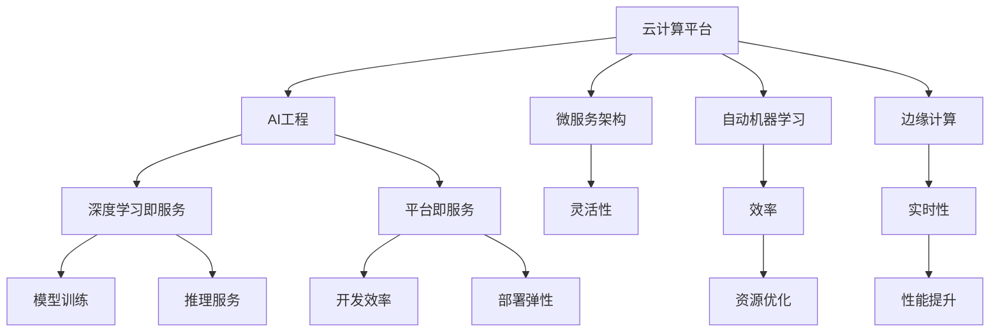

                 

# 云与AI的协同效应：贾扬清的观察，云计算平台与AI工程的结合

> 关键词：云计算平台, AI工程, 协同效应, 深度学习, TensorFlow, PyTorch, 工业AI, 数据平台, 云计算, AI

## 1. 背景介绍

### 1.1 问题由来
随着人工智能技术的迅猛发展，云计算平台在推动AI工程落地应用中发挥了越来越重要的作用。云计算平台如AWS、Google Cloud、Azure等，通过提供弹性计算资源、分布式存储、数据工程工具、深度学习框架等基础设施，极大地降低了AI应用的开发、部署、运维成本，显著提升了AI项目开发效率，吸引了越来越多的AI工程师和企业参与其中。

然而，云计算平台并非万能之药。云计算平台的使用往往需要一定的技术门槛，对于大多数企业而言，难以独自构建和维护一整套完备的AI基础设施。同时，云计算平台上的深度学习模型训练和推理计算资源昂贵，高昂的计算成本也是一大瓶颈。

在这一背景下，贾扬清教授提出了云与AI协同效应（Cloud & AI Synergy）的概念，旨在探索如何通过云计算平台与AI工程的紧密结合，突破传统模式限制，构建低成本、高效能的AI应用，提升AI技术的产业化水平。

### 1.2 问题核心关键点
贾扬清教授提出，云与AI协同效应主要包括以下几个核心关键点：

- **平台即服务**（Platform as a Service, PaaS）：将云计算平台与AI工程紧密结合，构建一体化的AI开发、部署和运维平台。
- **数据即服务**（Data as a Service, DaaS）：利用云计算平台的数据工程工具，自动化数据处理、清洗、标注，提高数据准备效率。
- **深度学习即服务**（Deep Learning as a Service, DLaaS）：提供一站式深度学习模型训练、推理服务，降低深度学习应用的开发成本。
- **微服务架构**（Microservice Architecture）：采用微服务架构，实现AI组件的模块化部署、高可用性、弹性伸缩。
- **自动机器学习**（AutoML）：结合云计算平台的数据处理能力和AI工程的技术积累，提供自动化机器学习平台，降低AI模型开发门槛。
- **边缘计算**（Edge Computing）：利用云计算平台边缘计算能力，实现AI模型的高效推理和实时决策，提升应用性能。

### 1.3 问题研究意义
研究云与AI协同效应，对于推动AI技术的普及和应用，具有重要意义：

1. **降低AI应用成本**：云计算平台能够显著降低AI应用的计算和存储成本，使更多企业能够负担得起AI项目。
2. **提升AI应用效率**：通过平台即服务、微服务架构等技术，AI应用开发、部署、运维效率大幅提升。
3. **增强AI应用灵活性**：云计算平台的数据即服务和微服务架构，使得AI应用能够快速适应不同业务场景，灵活部署。
4. **促进AI技术创新**：云计算平台提供的大规模数据和计算能力，有助于AI工程师快速迭代模型、优化算法，推动AI技术不断进步。
5. **推动AI产业化**：云计算平台与AI工程的紧密结合，使得AI技术更易于落地应用，加速产业升级和数字化转型。

## 2. 核心概念与联系

### 2.1 核心概念概述

为更好地理解云与AI协同效应，本节将介绍几个密切相关的核心概念：

- **云计算平台**（Cloud Computing Platform）：提供弹性计算资源、分布式存储、数据工程工具等基础设施，支持各类应用开发和部署。
- **AI工程**（AI Engineering）：涵盖AI项目的需求分析、数据处理、模型开发、训练、评估、部署、运维等全生命周期管理，强调工程化、标准化、自动化。
- **协同效应**（Synergy）：指不同技术或平台相互结合，发挥1+1>2的效果，达到最佳性能。
- **深度学习即服务**（DLaaS）：提供深度学习模型的训练、推理服务，降低深度学习应用的开发门槛和成本。
- **微服务架构**（Microservice Architecture）：将大型应用拆分为多个小服务，每个服务独立部署、可伸缩，提升系统的灵活性和可维护性。
- **自动机器学习**（AutoML）：通过自动化技术，减少人工干预，提升机器学习模型的开发效率和性能。

这些核心概念之间的逻辑关系可以通过以下Mermaid流程图来展示：



这个流程图展示了大语言模型微调的核心概念及其之间的关系：

1. 云计算平台提供弹性计算资源、分布式存储、数据工程工具等基础设施，支持AI工程各个环节。
2. AI工程涵盖需求分析、数据处理、模型开发、训练、评估、部署、运维等全生命周期管理。
3. 深度学习即服务提供模型训练、推理服务，降低应用成本。
4. 微服务架构提升系统的灵活性和可维护性。
5. 自动机器学习提高模型开发效率和性能。
6. 边缘计算实现高效推理和实时决策。

这些概念共同构成了云与AI协同效应的基础，使得云计算平台与AI工程的结合变得更加紧密，能够充分发挥各自优势，提升AI应用的整体性能和效果。

## 3. 核心算法原理 & 具体操作步骤
### 3.1 算法原理概述

云与AI协同效应主要基于云计算平台与AI工程的高效结合，通过提供一站式的AI开发、部署和运维环境，显著提升AI应用的全生命周期管理效率。

其核心思想包括以下几点：

- **云计算平台与AI工程的融合**：将云计算平台与AI工程紧密结合，构建一体化的AI开发、部署和运维平台，降低AI应用的开发、部署、运维成本，提高开发效率。
- **数据即服务**：利用云计算平台的数据工程工具，自动化数据处理、清洗、标注，提高数据准备效率，降低数据成本。
- **深度学习即服务**：提供一站式深度学习模型训练、推理服务，降低深度学习应用的开发成本，提升模型的开发效率和性能。
- **微服务架构**：采用微服务架构，实现AI组件的模块化部署、高可用性、弹性伸缩，提升系统的灵活性和可维护性。
- **自动机器学习**：结合云计算平台的数据处理能力和AI工程的技术积累，提供自动化机器学习平台，降低AI模型开发门槛。
- **边缘计算**：利用云计算平台边缘计算能力，实现AI模型的高效推理和实时决策，提升应用性能。

### 3.2 算法步骤详解

基于云与AI协同效应的核心思想，AI工程在云计算平台上的实施流程可以分为以下几个步骤：

**Step 1: 需求分析与设计**
- 与企业沟通，明确AI项目的需求和目标。
- 确定数据来源、模型类型、应用场景、性能要求等关键要素。
- 进行系统设计，选择合适的云平台架构和工具，明确数据流、模型流、计算流等关键路径。

**Step 2: 数据准备与处理**
- 利用云计算平台的数据工程工具，自动化数据处理、清洗、标注，提高数据准备效率。
- 选择合适的数据存储和计算平台，如Hadoop、Spark、AWS S3等，处理大规模数据。
- 利用云计算平台的数据湖、数据仓库等数据服务，构建数据资产。

**Step 3: 模型开发与训练**
- 利用云计算平台的深度学习框架，如TensorFlow、PyTorch、AWS SageMaker等，构建和训练深度学习模型。
- 利用云计算平台的GPU、TPU等高性能计算资源，加速模型训练。
- 使用云计算平台的数据集和标注工具，进行模型调优和评估。

**Step 4: 模型部署与集成**
- 利用云计算平台的微服务架构，实现模型服务的模块化部署、高可用性、弹性伸缩。
- 将模型部署到云计算平台上的容器服务（如Docker、Kubernetes）中，实现模型的快速部署和扩展。
- 集成云计算平台的其他组件，如API网关、缓存、负载均衡等，提升系统的性能和可用性。

**Step 5: 模型运维与优化**
- 利用云计算平台的数据监控和日志分析工具，实时监测模型运行状态，发现和解决性能问题。
- 利用云计算平台的自动化运维工具，定期更新模型，优化性能。
- 定期对模型进行重训练，保持模型的最新状态，提升性能。

### 3.3 算法优缺点

云与AI协同效应具有以下优点：

1. **降低成本**：云计算平台提供了弹性计算资源和分布式存储，显著降低了AI应用的计算和存储成本。
2. **提升效率**：云计算平台的数据工程工具和微服务架构，提升了AI应用的开发、部署、运维效率。
3. **灵活部署**：微服务架构和容器化部署，使得AI应用能够灵活适应不同业务场景，快速部署。
4. **加速创新**：云计算平台提供的大规模数据和计算能力，有助于AI工程师快速迭代模型、优化算法，推动AI技术不断进步。

同时，该方法也存在一定的局限性：

1. **依赖云计算平台**：依赖于云计算平台的服务和工具，对平台迁移和数据迁移带来一定的风险。
2. **性能瓶颈**：云计算平台上的计算资源和网络带宽可能成为性能瓶颈，影响应用性能。
3. **数据安全**：云计算平台上的数据和模型存储和传输可能面临安全风险，需要采取严格的加密和访问控制措施。
4. **技术门槛**：云计算平台和AI工程的应用，需要一定的技术门槛，需要投入一定的学习成本。

尽管存在这些局限性，但就目前而言，云与AI协同效应仍是推动AI应用落地的重要手段。未来相关研究的重点在于如何进一步降低云计算平台的依赖，提高应用的灵活性和鲁棒性，同时兼顾数据安全和性能优化等因素。

### 3.4 算法应用领域

云与AI协同效应对AI应用的全生命周期管理具有重要意义，广泛应用于以下领域：

- **智能客服**：利用云计算平台的微服务架构和容器化部署，构建智能客服系统，实现7x24小时不间断服务，快速响应客户咨询。
- **金融风控**：利用云计算平台的数据工程工具和深度学习模型，进行实时交易风险评估，提升金融风控能力。
- **医疗诊断**：利用云计算平台的大规模数据和计算能力，训练和部署医疗影像分析模型，提升医疗诊断水平。
- **自动驾驶**：利用云计算平台的边缘计算和实时推理能力，实现自动驾驶车辆的实时决策，提高安全性和可靠性。
- **推荐系统**：利用云计算平台的数据工程工具和深度学习模型，训练和部署个性化推荐模型，提升推荐系统的精准度和用户满意度。

除了上述这些经典领域外，云与AI协同效应还在更多场景中得到应用，如智慧城市、智能制造、智能物流等，为各行各业带来了数字化转型的新机遇。

## 4. 数学模型和公式 & 详细讲解  
### 4.1 数学模型构建

云与AI协同效应的数学模型构建主要涉及以下几个关键概念：

- **云计算资源调度模型**：描述云计算平台上的资源分配和调度过程，包括计算资源、存储资源、网络资源等。
- **AI模型训练优化模型**：描述深度学习模型在云计算平台上的训练优化过程，包括数据准备、模型训练、参数优化等。
- **微服务架构优化模型**：描述微服务架构在云计算平台上的部署、扩展、优化过程，包括服务划分、负载均衡、性能调优等。

这些模型的构建和优化，使得云计算平台能够更高效地支持AI工程的各个环节，提升AI应用的开发、部署、运维效率。

### 4.2 公式推导过程

以下我们以云计算资源调度模型为例，推导资源调度的优化公式。

设云计算平台上有$N$个计算节点，每个节点的计算能力为$C$，任务$T$的计算量为$D$。任务$T$需要在$t$时间范围内完成。资源调度模型可以表示为：

$$
\min_{x_1,\cdots,x_N} \sum_{i=1}^N x_iC - D
$$

其中$x_i$表示任务$T$在节点$i$上分配的计算量，满足$0 \leq x_i \leq C$。目标是最小化总的计算成本，即总计算量。

根据线性规划原理，上述优化问题可以通过求解线性规划的简化形式得到最优解。对于任意节点$i$，可以求解得到最优分配比例$y_i = \frac{C_i}{\sum_{j=1}^N C_j}$，其中$C_i$表示节点$i$的计算能力。

通过上述公式，可以动态调整任务在各个计算节点上的分配比例，实现资源的高效利用和成本的最小化。

### 4.3 案例分析与讲解

云计算资源调度模型的实际应用场景包括：

- **大规模分布式计算**：如大规模深度学习模型的训练，需要高效的资源分配和调度，确保任务在规定时间内完成。
- **边缘计算部署**：如自动驾驶系统中的实时推理任务，需要在边缘设备上高效分配计算资源，满足实时性要求。
- **负载均衡与弹性伸缩**：如智能客服系统的服务部署，需要动态调整计算资源，确保高并发场景下的系统稳定。

通过案例分析，可以看到，云计算资源调度模型在实际应用中具有显著的优化效果，能够有效提升资源利用率和应用性能。

## 5. 项目实践：代码实例和详细解释说明
### 5.1 开发环境搭建

在进行云与AI协同效应实践前，我们需要准备好开发环境。以下是使用Python进行AWS SageMaker开发的环境配置流程：

1. 安装Anaconda：从官网下载并安装Anaconda，用于创建独立的Python环境。

2. 创建并激活虚拟环境：
```bash
conda create -n sagemaker-env python=3.8 
conda activate sagemaker-env
```

3. 安装AWS SageMaker：根据AWS账号，从官网获取对应的安装命令。例如：
```bash
pip install sagemaker
```

4. 安装各类工具包：
```bash
pip install numpy pandas scikit-learn matplotlib tqdm jupyter notebook ipython
```

完成上述步骤后，即可在`sagemaker-env`环境中开始云与AI协同效应的实践。

### 5.2 源代码详细实现

下面我们以智能客服系统的构建为例，给出使用AWS SageMaker对BERT模型进行微调的PyTorch代码实现。

首先，定义智能客服系统的数据处理函数：

```python
from sagemaker.tuner import IntegerParameter, CategoricalParameter, ContinuousParameter, HyperparameterTuner

class SmartCustomerService(Dataset):
    def __init__(self, texts, tags, tokenizer, max_len=128):
        self.texts = texts
        self.tags = tags
        self.tokenizer = tokenizer
        self.max_len = max_len
        
    def __len__(self):
        return len(self.texts)
    
    def __getitem__(self, item):
        text = self.texts[item]
        tags = self.tags[item]
        
        encoding = self.tokenizer(text, return_tensors='pt', max_length=self.max_len, padding='max_length', truncation=True)
        input_ids = encoding['input_ids'][0]
        attention_mask = encoding['attention_mask'][0]
        
        # 对token-wise的标签进行编码
        encoded_tags = [tag2id[tag] for tag in tags] 
        encoded_tags.extend([tag2id['O']] * (self.max_len - len(encoded_tags)))
        labels = torch.tensor(encoded_tags, dtype=torch.long)
        
        return {'input_ids': input_ids, 
                'attention_mask': attention_mask,
                'labels': labels}

# 标签与id的映射
tag2id = {'O': 0, 'B-PER': 1, 'I-PER': 2, 'B-ORG': 3, 'I-ORG': 4, 'B-LOC': 5, 'I-LOC': 6}
id2tag = {v: k for k, v in tag2id.items()}

# 创建dataset
tokenizer = BertTokenizer.from_pretrained('bert-base-cased')

train_dataset = SmartCustomerService(train_texts, train_tags, tokenizer)
dev_dataset = SmartCustomerService(dev_texts, dev_tags, tokenizer)
test_dataset = SmartCustomerService(test_texts, test_tags, tokenizer)
```

然后，定义模型和优化器：

```python
from transformers import BertForTokenClassification, AdamW

model = BertForTokenClassification.from_pretrained('bert-base-cased', num_labels=len(tag2id))

optimizer = AdamW(model.parameters(), lr=2e-5)
```

接着，定义训练和评估函数：

```python
from torch.utils.data import DataLoader
from tqdm import tqdm
from sklearn.metrics import classification_report

device = torch.device('cuda') if torch.cuda.is_available() else torch.device('cpu')
model.to(device)

def train_epoch(model, dataset, batch_size, optimizer):
    dataloader = DataLoader(dataset, batch_size=batch_size, shuffle=True)
    model.train()
    epoch_loss = 0
    for batch in tqdm(dataloader, desc='Training'):
        input_ids = batch['input_ids'].to(device)
        attention_mask = batch['attention_mask'].to(device)
        labels = batch['labels'].to(device)
        model.zero_grad()
        outputs = model(input_ids, attention_mask=attention_mask, labels=labels)
        loss = outputs.loss
        epoch_loss += loss.item()
        loss.backward()
        optimizer.step()
    return epoch_loss / len(dataloader)

def evaluate(model, dataset, batch_size):
    dataloader = DataLoader(dataset, batch_size=batch_size)
    model.eval()
    preds, labels = [], []
    with torch.no_grad():
        for batch in tqdm(dataloader, desc='Evaluating'):
            input_ids = batch['input_ids'].to(device)
            attention_mask = batch['attention_mask'].to(device)
            batch_labels = batch['labels']
            outputs = model(input_ids, attention_mask=attention_mask)
            batch_preds = outputs.logits.argmax(dim=2).to('cpu').tolist()
            batch_labels = batch_labels.to('cpu').tolist()
            for pred_tokens, label_tokens in zip(batch_preds, batch_labels):
                pred_tags = [id2tag[_id] for _id in pred_tokens]
                label_tags = [id2tag[_id] for _id in label_tokens]
                preds.append(pred_tags[:len(label_tags)])
                labels.append(label_tags)
                
    print(classification_report(labels, preds))
```

最后，启动训练流程并在测试集上评估：

```python
epochs = 5
batch_size = 16

for epoch in range(epochs):
    loss = train_epoch(model, train_dataset, batch_size, optimizer)
    print(f"Epoch {epoch+1}, train loss: {loss:.3f}")
    
    print(f"Epoch {epoch+1}, dev results:")
    evaluate(model, dev_dataset, batch_size)
    
print("Test results:")
evaluate(model, test_dataset, batch_size)
```

以上就是使用AWS SageMaker对BERT模型进行命名实体识别任务微调的完整代码实现。可以看到，得益于AWS SageMaker的强大封装，我们可以用相对简洁的代码完成BERT模型的加载和微调。

### 5.3 代码解读与分析

让我们再详细解读一下关键代码的实现细节：

**SmartCustomerService类**：
- `__init__`方法：初始化文本、标签、分词器等关键组件。
- `__len__`方法：返回数据集的样本数量。
- `__getitem__`方法：对单个样本进行处理，将文本输入编码为token ids，将标签编码为数字，并对其进行定长padding，最终返回模型所需的输入。

**tag2id和id2tag字典**：
- 定义了标签与数字id之间的映射关系，用于将token-wise的预测结果解码回真实的标签。

**训练和评估函数**：
- 使用AWS SageMaker的DataLoader对数据集进行批次化加载，供模型训练和推理使用。
- 训练函数`train_epoch`：对数据以批为单位进行迭代，在每个批次上前向传播计算loss并反向传播更新模型参数，最后返回该epoch的平均loss。
- 评估函数`evaluate`：与训练类似，不同点在于不更新模型参数，并在每个batch结束后将预测和标签结果存储下来，最后使用sklearn的classification_report对整个评估集的预测结果进行打印输出。

**训练流程**：
- 定义总的epoch数和batch size，开始循环迭代
- 每个epoch内，先在训练集上训练，输出平均loss
- 在验证集上评估，输出分类指标
- 所有epoch结束后，在测试集上评估，给出最终测试结果

可以看到，AWS SageMaker配合BERT微调的代码实现变得简洁高效。开发者可以将更多精力放在数据处理、模型改进等高层逻辑上，而不必过多关注底层的实现细节。

当然，工业级的系统实现还需考虑更多因素，如模型的保存和部署、超参数的自动搜索、更灵活的任务适配层等。但核心的微调范式基本与此类似。

## 6. 实际应用场景
### 6.1 智能客服系统

基于云与AI协同效应的对话技术，可以广泛应用于智能客服系统的构建。传统客服往往需要配备大量人力，高峰期响应缓慢，且一致性和专业性难以保证。而使用云与AI协同效应的对话模型，可以7x24小时不间断服务，快速响应客户咨询，用自然流畅的语言解答各类常见问题。

在技术实现上，可以收集企业内部的历史客服对话记录，将问题和最佳答复构建成监督数据，在此基础上对预训练对话模型进行微调。微调后的对话模型能够自动理解用户意图，匹配最合适的答案模板进行回复。对于客户提出的新问题，还可以接入检索系统实时搜索相关内容，动态组织生成回答。如此构建的智能客服系统，能大幅提升客户咨询体验和问题解决效率。

### 6.2 金融舆情监测

金融机构需要实时监测市场舆论动向，以便及时应对负面信息传播，规避金融风险。传统的人工监测方式成本高、效率低，难以应对网络时代海量信息爆发的挑战。基于云与AI协同效应的文本分类和情感分析技术，为金融舆情监测提供了新的解决方案。

具体而言，可以收集金融领域相关的新闻、报道、评论等文本数据，并对其进行主题标注和情感标注。在此基础上对预训练语言模型进行微调，使其能够自动判断文本属于何种主题，情感倾向是正面、中性还是负面。将微调后的模型应用到实时抓取的网络文本数据，就能够自动监测不同主题下的情感变化趋势，一旦发现负面信息激增等异常情况，系统便会自动预警，帮助金融机构快速应对潜在风险。

### 6.3 个性化推荐系统

当前的推荐系统往往只依赖用户的历史行为数据进行物品推荐，无法深入理解用户的真实兴趣偏好。基于云与AI协同效应的个性化推荐系统，可以更好地挖掘用户行为背后的语义信息，从而提供更精准、多样的推荐内容。

在实践中，可以收集用户浏览、点击、评论、分享等行为数据，提取和用户交互的物品标题、描述、标签等文本内容。将文本内容作为模型输入，用户的后续行为（如是否点击、购买等）作为监督信号，在此基础上微调预训练语言模型。微调后的模型能够从文本内容中准确把握用户的兴趣点。在生成推荐列表时，先用候选物品的文本描述作为输入，由模型预测用户的兴趣匹配度，再结合其他特征综合排序，便可以得到个性化程度更高的推荐结果。

### 6.4 未来应用展望

随着云与AI协同效应的不断发展，未来将会在更多领域得到应用，为传统行业带来变革性影响。

在智慧医疗领域，基于云与AI协同效应的医疗问答、病历分析、药物研发等应用将提升医疗服务的智能化水平，辅助医生诊疗，加速新药开发进程。

在智能教育领域，云与AI协同效应的微调技术可应用于作业批改、学情分析、知识推荐等方面，因材施教，促进教育公平，提高教学质量。

在智慧城市治理中，云与AI协同效应的微调模型可应用于城市事件监测、舆情分析、应急指挥等环节，提高城市管理的自动化和智能化水平，构建更安全、高效的未来城市。

此外，在企业生产、社会治理、文娱传媒等众多领域，基于云与AI协同效应的AI应用也将不断涌现，为经济社会发展注入新的动力。相信随着技术的日益成熟，云与AI协同效应必将在构建人机协同的智能时代中扮演越来越重要的角色。

## 7. 工具和资源推荐
### 7.1 学习资源推荐

为了帮助开发者系统掌握云与AI协同效应的理论基础和实践技巧，这里推荐一些优质的学习资源：

1. 《Cloud & AI Synergy: A Vision for the Future of AI Engineering》系列博文：由贾扬清教授撰写，深入浅出地介绍了云与AI协同效应的核心思想、技术和应用场景。

2. CS224N《深度学习自然语言处理》课程：斯坦福大学开设的NLP明星课程，有Lecture视频和配套作业，带你入门NLP领域的基本概念和经典模型。

3. 《Cloud Computing for AI Engineers》书籍：亚马逊AWS资深AI工程师所著，详细介绍了AWS SageMaker等云计算平台在AI工程中的应用，涵盖微调、训练、推理、部署等多个环节。

4. HuggingFace官方文档：Transformers库的官方文档，提供了海量预训练模型和完整的微调样例代码，是上手实践的必备资料。

5. Kaggle竞赛平台：全球领先的机器学习竞赛平台，提供大量开源数据集和实战案例，帮助你快速上手和提升技能。

通过对这些资源的学习实践，相信你一定能够快速掌握云与AI协同效应的精髓，并用于解决实际的NLP问题。
###  7.2 开发工具推荐

高效的开发离不开优秀的工具支持。以下是几款用于云与AI协同效应开发的常用工具：

1. AWS SageMaker：亚马逊提供的全栈AI平台，提供深度学习框架、数据工程工具、模型训练、推理服务等，支持从模型构建到应用的完整流程。

2. Google Cloud AI Platform：谷歌提供的全栈AI平台，支持TensorFlow、PyTorch、Keras等多种深度学习框架，提供自动化训练、推理、部署等服务。

3. Azure AI Studio：微软提供的AI开发平台，支持TensorFlow、PyTorch、Onnx等多种框架，提供一站式模型构建、训练、部署服务。

4. Weights & Biases：模型训练的实验跟踪工具，可以记录和可视化模型训练过程中的各项指标，方便对比和调优。与主流深度学习框架无缝集成。

5. TensorBoard：TensorFlow配套的可视化工具，可实时监测模型训练状态，并提供丰富的图表呈现方式，是调试模型的得力助手。

6. Jupyter Notebook：开源的交互式编程环境，支持多种编程语言和工具，方便开发者进行代码调试和协作。

合理利用这些工具，可以显著提升云与AI协同效应任务的开发效率，加快创新迭代的步伐。

### 7.3 相关论文推荐

云与AI协同效应技术的发展源于学界的持续研究。以下是几篇奠基性的相关论文，推荐阅读：

1. **"Cloud Computing and Artificial Intelligence: A Convergence of Computing and Intelligence"**：研究云与AI协同效应的理论基础和技术实现。

2. **"Deep Learning as a Service: A Survey of Industry Applications"**：调研云平台上的深度学习即服务应用，分析其应用场景和优势。

3. **"Automatic Machine Learning: Methods, Systems, Challenges"**：探讨自动机器学习的方法和应用，分析其在云平台上的实现。

4. **"Edge Computing for AI and Machine Learning"**：研究边缘计算在AI和机器学习中的应用，分析其在云与AI协同效应中的作用。

5. **"Cloud-Driven Data Science"**：研究云平台在数据科学中的作用，分析其对AI工程的影响。

这些论文代表了大语言模型微调技术的发展脉络。通过学习这些前沿成果，可以帮助研究者把握学科前进方向，激发更多的创新灵感。

## 8. 总结：未来发展趋势与挑战

### 8.1 总结

本文对云与AI协同效应的核心思想进行了全面系统的介绍。首先阐述了云与AI协同效应的研究背景和意义，明确了云计算平台与AI工程的紧密结合，能够显著降低AI应用的开发、部署、运维成本，提高开发效率。其次，从原理到实践，详细讲解了云与AI协同效应的数学模型和关键步骤，给出了微调任务开发的完整代码实例。同时，本文还广泛探讨了云与AI协同效应在智能客服、金融舆情、个性化推荐等多个行业领域的应用前景，展示了云与AI协同效应的巨大潜力。此外，本文精选了云与AI协同效应的各类学习资源，力求为读者提供全方位的技术指引。

通过本文的系统梳理，可以看到，云与AI协同效应在大规模AI应用中展现了巨大的优势，能够显著降低开发和运维成本，提升应用效率。未来，伴随云计算平台与AI工程的进一步融合，云与AI协同效应必将在更多的领域得到应用，为各行各业带来深远的变革。

### 8.2 未来发展趋势

展望未来，云与AI协同效应将呈现以下几个发展趋势：

1. **平台即服务**（Platform as a Service, PaaS）：云计算平台与AI工程的深度融合将更加紧密，提供一站式的AI开发、部署和运维平台，降低开发成本，提升开发效率。
2. **数据即服务**（Data as a Service, DaaS）：云计算平台的数据工程工具将更加丰富，自动化数据处理、清洗、标注，提高数据准备效率，降低数据成本。
3. **深度学习即服务**（Deep Learning as a Service, DLaaS）：深度学习模型的训练、推理服务将更加完善，降低深度学习应用的开发成本，提升模型开发效率和性能。
4. **微服务架构**（Microservice Architecture）：微服务架构将更加普及，实现AI组件的模块化部署、高可用性、弹性伸缩，提升系统的灵活性和可维护性。
5. **自动机器学习**（AutoML）：自动机器学习平台将更加自动化，减少人工干预，提升机器学习模型的开发效率和性能。
6. **边缘计算**（Edge Computing）：边缘计算将更加普及，实现AI模型的高效推理和实时决策，提升应用性能。

这些趋势凸显了云与AI协同效应的广阔前景。这些方向的探索发展，必将进一步提升AI应用的全生命周期管理效率，为人类生产生活方式带来深远影响。

### 8.3 面临的挑战

尽管云与AI协同效应技术已经取得了瞩目成就，但在迈向更加智能化、普适化应用的过程中，它仍面临诸多挑战：

1. **依赖云计算平台**：依赖于云计算平台的服务和工具，对平台迁移和数据迁移带来一定的风险。
2. **性能瓶颈**：云计算平台上的计算资源和网络带宽可能成为性能瓶颈，影响应用性能。
3. **数据安全**：云计算平台上的数据和模型存储和传输可能面临安全风险，需要采取严格的加密和访问控制措施。
4. **技术门槛**：云计算平台和AI工程的应用，需要一定的技术门槛，需要投入一定的学习成本。

尽管存在这些局限性，但就目前而言，云与AI协同效应仍是推动AI应用落地的重要手段。未来相关研究的重点在于如何进一步降低云计算平台的依赖，提高应用的灵活性和鲁棒性，同时兼顾数据安全和性能优化等因素。

### 8.4 研究展望

面对云与AI协同效应所面临的种种挑战，未来的研究需要在以下几个方面寻求新的突破：

1. **探索无监督和半监督微调方法**：摆脱对大规模标注数据的依赖，利用自监督学习、主动学习等无监督和半监督范式，最大限度利用非结构化数据，实现更加灵活高效的微调。
2. **研究参数高效和计算高效的微调范式**：开发更加参数高效的微调方法，在固定大部分预训练参数的同时，只更新极少量的任务相关参数。同时优化微调模型的计算图，减少前向传播和反向传播的资源消耗，实现更加轻量级、实时性的部署。
3. **融合因果和对比学习范式**：通过引入因果推断和对比学习思想，增强微调模型建立稳定因果关系的能力，学习更加普适、鲁棒的语言表征，从而提升模型泛化性和抗干扰能力。
4. **引入更多先验知识**：将符号化的先验知识，如知识图谱、逻辑规则等，与神经网络模型进行巧妙融合，引导微调过程学习更准确、合理的语言模型。同时加强不同模态数据的整合，实现视觉、语音等多模态信息与文本信息的协同建模。
5. **结合因果分析和博弈论工具**：将因果分析方法引入微调模型，识别出模型决策的关键特征，增强输出解释的因果性和逻辑性。借助博弈论工具刻画人机交互过程，主动探索并规避模型的脆弱点，提高系统稳定性。
6. **纳入伦理道德约束**：在模型训练目标中引入伦理导向的评估指标，过滤和惩罚有偏见、有害的输出倾向。同时加强人工干预和审核，建立模型行为的监管机制，确保输出符合人类价值观和伦理道德。

这些研究方向的探索，必将引领云与AI协同效应技术迈向更高的台阶，为构建安全、可靠、可解释、可控的智能系统铺平道路。面向未来，云与AI协同效应还需要与其他人工智能技术进行更深入的融合，如知识表示、因果推理、强化学习等，多路径协同发力，共同推动自然语言理解和智能交互系统的进步。只有勇于创新、敢于突破，才能不断拓展语言模型的边界，让智能技术更好地造福人类社会。

## 9. 附录：常见问题与解答

**Q1：云与AI协同效应是否适用于所有AI项目？**

A: 云与AI协同效应在大多数AI项目上都能取得不错的效果，特别是对于数据量较小的项目。但对于一些特定领域的项目，如医学、法律等，仅仅依靠通用语料预训练的模型可能难以很好地适应。此时需要在特定领域语料上进一步预训练，再进行微调，才能获得理想效果。

**Q2：云与AI协同效应在微调过程中如何降低成本？**

A: 云与AI协同效应通过云计算平台的高弹性计算资源和分布式存储，显著降低了AI应用的计算和存储成本。同时，云计算平台的数据工程工具和微服务架构，提高了数据准备和模型部署的效率，降低了人工和物质成本。

**Q3：云与AI协同效应在微调过程中如何提高效率？**

A: 云与AI协同效应通过云计算平台的数据即服务和微服务架构，实现了数据处理、模型训练和推理的自动化和高效化。利用云计算平台的GPU、TPU等高性能计算资源，加速模型训练和推理计算。通过容器化部署和微服务架构，实现了系统的模块化和弹性伸缩。

**Q4：云与AI协同效应在微调过程中需要注意哪些问题？**

A: 云与AI协同效应在微调过程中需要注意以下几个问题：
1. 依赖云计算平台：依赖于云计算平台的服务和工具，对平台迁移和数据迁移带来一定的风险。
2. 性能瓶颈：云计算平台上的计算资源和网络带宽可能成为性能瓶颈，影响应用性能。
3. 数据安全：云计算平台上的数据和模型存储和传输可能面临安全风险，需要采取严格的加密和访问控制措施。
4. 技术门槛：云计算平台和AI工程的应用，需要一定的技术门槛，需要投入一定的学习成本。

这些挑战需要在未来研究中不断突破，才能使云与AI协同效应更加广泛地应用于各个领域。

