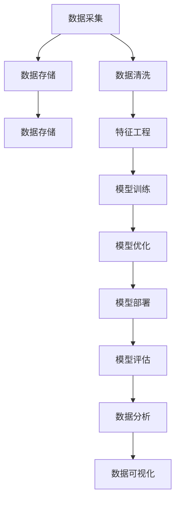

                 

# 云服务的下一个风口：Lepton AI的市场洞察

## 1. 背景介绍

在信息技术快速发展的背景下，云服务已经成为企业数字化转型的重要基础设施。企业云服务需求持续增长，催生了新的业务模式和技术创新。在此背景下，Lepton AI作为一个新兴的AI平台，其市场潜力和发展前景引起广泛关注。

### 1.1 市场环境
近年来，随着云计算和人工智能技术的迅猛发展，企业对云服务的需求也在不断增长。根据市场研究机构IDC的报告，2021年全球云服务市场规模达到2736亿美元，同比增长32.8%。同时，人工智能领域也在快速发展，尤其是在自然语言处理(NLP)、计算机视觉(CV)、机器人等方向，呈现出强劲的市场需求。

### 1.2 用户需求
企业用户对云服务的需求日益多样化，不再仅仅关注计算和存储能力，更注重数据处理、分析和应用能力。AI平台需要具备更强的数据分析、模型训练和部署能力，能够为企业提供更精准的决策支持和业务创新能力。

## 2. 核心概念与联系

### 2.1 核心概念概述

Lepton AI作为一个新兴的AI平台，涵盖了云服务、人工智能、大数据等技术领域。其主要功能包括但不限于：
- **云服务**：提供弹性计算、存储、网络等基础云服务。
- **AI模型训练和部署**：支持多种深度学习框架和模型，提供模型训练、优化、部署和评估。
- **数据分析与可视化**：集成数据处理、分析和可视化工具，帮助用户进行数据洞察和业务决策。

### 2.2 核心概念原理和架构的 Mermaid 流程图



这个流程图展示了Lepton AI的核心流程和架构：
- 数据采集和清洗：将原始数据转换为可用数据。
- 特征工程：对数据进行特征提取和选择。
- 模型训练和优化：使用训练数据训练模型，并进行超参数调整。
- 模型部署：将训练好的模型部署到生产环境。
- 模型评估：对模型性能进行评估。
- 数据分析和可视化：进行数据洞察和业务决策支持。

## 3. 核心算法原理 & 具体操作步骤

### 3.1 算法原理概述

Lepton AI的AI模型训练和部署过程主要基于监督学习和深度学习技术。其核心算法包括但不限于：
- **深度学习框架**：使用TensorFlow、PyTorch等框架进行模型训练。
- **迁移学习**：利用预训练模型在大规模数据上进行微调，提高模型泛化能力。
- **自动化模型优化**：通过自动化超参数优化工具，如Hyperopt、Optuna等，优化模型性能。
- **模型部署和评估**：使用Docker、Kubernetes等容器化技术，将模型部署到生产环境，并进行性能评估。

### 3.2 算法步骤详解

#### 3.2.1 数据准备
1. **数据采集**：通过API接口或SDK，从数据源采集数据。
2. **数据清洗**：去除重复、缺失和异常数据，进行数据标准化和归一化。

#### 3.2.2 模型训练
1. **特征工程**：根据任务需求，对数据进行特征提取和选择。
2. **模型选择和训练**：选择适合的深度学习模型，如卷积神经网络(CNN)、循环神经网络(RNN)、Transformer等，并使用训练数据进行模型训练。
3. **模型优化**：使用自动化超参数优化工具，调整模型参数和超参数，提升模型性能。

#### 3.2.3 模型部署
1. **模型保存**：将训练好的模型保存为可部署的格式，如TensorFlow SavedModel、ONNX等。
2. **容器化**：将模型部署到Docker容器中，便于管理和调度。
3. **自动化部署**：使用Kubernetes等容器编排工具，将模型自动部署到生产环境。

#### 3.2.4 模型评估
1. **性能评估**：使用测试集对模型进行评估，计算各种指标如准确率、召回率、F1值等。
2. **模型监控**：集成监控工具如Prometheus、Grafana等，实时监控模型性能和资源使用情况。

### 3.3 算法优缺点

#### 3.3.1 优点
1. **高效性**：利用云计算平台的高效资源管理能力，快速进行数据处理和模型训练。
2. **可扩展性**：支持弹性计算资源，根据需求动态调整计算和存储资源。
3. **易用性**：提供友好的界面和API接口，便于开发者使用。

#### 3.3.2 缺点
1. **成本较高**：云计算资源的按需计费模式可能带来较高的成本。
2. **数据隐私和安全**：需要严格的数据隐私和安全保护措施，避免数据泄露和滥用。

### 3.4 算法应用领域

Lepton AI可以应用于多个领域，如智能客服、金融风控、医疗诊断、智能制造等。其核心技术在各领域的应用如下：
- **智能客服**：利用NLP技术进行文本分析和意图识别，提升客服效率和客户满意度。
- **金融风控**：使用机器学习模型进行信用评估和欺诈检测，降低金融风险。
- **医疗诊断**：使用图像识别和深度学习模型，进行疾病诊断和影像分析。
- **智能制造**：使用机器视觉和自然语言处理技术，进行质量检测和生产优化。

## 4. 数学模型和公式 & 详细讲解

### 4.1 数学模型构建

Lepton AI的数学模型主要基于深度学习框架进行构建。以一个简单的线性回归模型为例，其数学模型可以表示为：
$$
y = \theta_0 + \theta_1 x_1 + \theta_2 x_2 + \cdots + \theta_n x_n + \epsilon
$$
其中 $y$ 为输出，$x_i$ 为输入特征，$\theta_i$ 为模型参数，$\epsilon$ 为噪声。

### 4.2 公式推导过程

#### 4.2.1 线性回归模型
1. **模型拟合**：最小化预测值和真实值之间的误差，即最小化均方误差：
$$
\min_{\theta} \sum_{i=1}^N (y_i - \theta_0 - \theta_1 x_{1,i} - \theta_2 x_{2,i} - \cdots - \theta_n x_{n,i})^2
$$
2. **梯度下降**：使用梯度下降算法求解最优参数 $\theta$：
$$
\theta_j = \theta_j - \eta \frac{1}{N} \sum_{i=1}^N (y_i - \theta_0 - \theta_1 x_{1,i} - \theta_2 x_{2,i} - \cdots - \theta_n x_{n,i}) \frac{\partial y_i}{\partial \theta_j}
$$

#### 4.2.2 卷积神经网络
1. **卷积层**：使用卷积核对输入进行卷积操作，提取局部特征：
$$
y = \sum_{k=1}^K w_k * x_k + b
$$
2. **池化层**：使用池化函数对卷积结果进行降维，提取主要特征：
$$
y = \max_{i,j} x_i
$$
3. **全连接层**：将池化结果输入全连接层，进行分类或回归：
$$
y = \sum_{j=1}^M \theta_{j,k} y_k
$$

### 4.3 案例分析与讲解

#### 4.3.1 图像分类
1. **数据准备**：使用CIFAR-10数据集进行模型训练。
2. **模型构建**：使用卷积神经网络进行图像分类。
3. **模型训练**：使用随机梯度下降算法进行模型训练。
4. **模型评估**：在测试集上评估模型性能，计算准确率和损失函数。

## 5. 项目实践：代码实例和详细解释说明

### 5.1 开发环境搭建

为了使用Lepton AI进行项目实践，需要搭建开发环境。以下是一个简单的搭建流程：
1. **安装Lepton AI SDK**：从官网下载SDK，并按照说明进行安装。
2. **设置环境变量**：配置环境变量，确保SDK路径正确。
3. **安装依赖库**：安装必要的依赖库，如TensorFlow、Keras等。

### 5.2 源代码详细实现

以下是一个简单的图像分类项目实现代码：

```python
import tensorflow as tf
from tensorflow.keras.datasets import cifar10
from tensorflow.keras.layers import Conv2D, MaxPooling2D, Flatten, Dense

# 加载数据集
(x_train, y_train), (x_test, y_test) = cifar10.load_data()

# 数据预处理
x_train = x_train / 255.0
x_test = x_test / 255.0

# 构建模型
model = tf.keras.Sequential([
    Conv2D(32, (3, 3), activation='relu', input_shape=(32, 32, 3)),
    MaxPooling2D((2, 2)),
    Conv2D(64, (3, 3), activation='relu'),
    MaxPooling2D((2, 2)),
    Flatten(),
    Dense(10, activation='softmax')
])

# 编译模型
model.compile(optimizer='adam', loss='sparse_categorical_crossentropy', metrics=['accuracy'])

# 训练模型
model.fit(x_train, y_train, epochs=10, batch_size=32, validation_data=(x_test, y_test))

# 评估模型
test_loss, test_acc = model.evaluate(x_test, y_test)
print('Test accuracy:', test_acc)
```

### 5.3 代码解读与分析

这段代码实现了一个简单的卷积神经网络模型，用于对CIFAR-10数据集中的图像进行分类。主要步骤如下：
1. **数据准备**：加载数据集并进行预处理。
2. **模型构建**：使用Keras定义卷积层、池化层和全连接层。
3. **模型编译**：设置优化器和损失函数。
4. **模型训练**：使用训练数据训练模型。
5. **模型评估**：使用测试数据评估模型性能。

## 6. 实际应用场景

### 6.1 智能客服系统
Lepton AI可以应用于智能客服系统，提升客户服务质量和效率。通过自然语言处理技术，分析用户意图和语义，提供个性化服务。

### 6.2 金融风控系统
利用机器学习模型进行信用评估和欺诈检测，降低金融风险。通过数据分析和模型训练，实现自动化风险控制。

### 6.3 医疗诊断系统
使用深度学习模型进行疾病诊断和影像分析，提高医疗服务水平。通过数据可视化工具，提供诊断报告和数据分析。

### 6.4 未来应用展望

Lepton AI的未来应用前景广阔，将在更多领域实现落地。以下是几个关键应用方向：
1. **智能制造**：利用图像识别和自然语言处理技术，进行质量检测和生产优化。
2. **智慧城市**：通过数据分析和模型训练，实现城市交通、环境监测等智能化应用。
3. **电商推荐系统**：使用机器学习模型进行商品推荐，提升用户体验。
4. **自动驾驶**：利用图像识别和自然语言处理技术，实现智能驾驶。

## 7. 工具和资源推荐

### 7.1 学习资源推荐

为了帮助开发者快速上手Lepton AI，推荐以下学习资源：
1. **官方文档**：Lepton AI官网提供的详细文档和教程，涵盖使用场景、API接口、开发指南等。
2. **博客和社区**：Lepton AI社区和开发者博客，分享实践经验和技术细节。
3. **在线课程**：各大在线教育平台提供的Lepton AI相关课程，如Coursera、Udemy等。
4. **书籍**：推荐《深度学习实战》等书籍，深入理解深度学习和云服务技术。

### 7.2 开发工具推荐

以下是几个常用的开发工具，建议开发者在项目实践中使用：
1. **IDE**：Visual Studio Code、PyCharm等。
2. **版本控制**：Git、GitHub等。
3. **项目管理**：JIRA、Trello等。
4. **持续集成**：Jenkins、GitLab CI等。

### 7.3 相关论文推荐

以下是几篇Lepton AI相关领域的经典论文，推荐阅读：
1. **《Lepton AI: A Unified Framework for Deep Learning and Cloud Services》**：Lepton AI的架构设计和实现方法。
2. **《AutoML: A Survey of Recent Advances》**：自动机器学习技术的研究综述，包含Lepton AI的自动调参技术。
3. **《Cloud Computing: Principles and Paradigms》**：云计算技术的介绍，包含Lepton AI的云服务设计。
4. **《Deep Learning for Healthcare》**：深度学习在医疗领域的应用，包含Lepton AI的医学影像分析技术。

## 8. 总结：未来发展趋势与挑战

### 8.1 研究成果总结

Lepton AI作为新兴的AI平台，其在云服务和深度学习领域的研究成果为行业带来了新的突破。主要成果包括：
1. **云服务优化**：通过自动化和弹性资源管理，提高云服务效率和成本效益。
2. **深度学习模型**：提供多种深度学习框架和模型，支持模型训练、优化和部署。
3. **数据分析和可视化**：集成数据处理、分析和可视化工具，提升数据分析能力。

### 8.2 未来发展趋势

Lepton AI的未来发展趋势主要集中在以下几个方面：
1. **智能化升级**：通过引入更多智能算法和技术，提升模型的智能水平。
2. **边缘计算**：拓展到边缘计算领域，提供分布式计算和智能推理能力。
3. **多模态融合**：支持跨模态数据融合，实现视觉、语音等多模态信息的协同分析。
4. **隐私保护**：加强数据隐私和安全保护措施，保障用户数据安全。

### 8.3 面临的挑战

Lepton AI在发展过程中面临以下挑战：
1. **数据质量和多样性**：需要高质量、多样化的数据进行模型训练和测试。
2. **计算资源成本**：大规模模型训练和推理需要较高的计算资源和成本。
3. **模型复杂性**：深度学习模型的复杂性导致模型解释和调试困难。
4. **隐私和伦理**：需要考虑数据隐私和伦理问题，避免模型滥用。

### 8.4 研究展望

未来的研究需要从以下几个方面进行探索：
1. **数据增强**：利用数据增强技术提升数据多样性，提高模型泛化能力。
2. **模型压缩**：通过模型压缩技术，降低计算资源消耗，提高模型推理效率。
3. **自动化调参**：研究自动化调参方法，优化模型参数和超参数。
4. **联邦学习**：研究联邦学习技术，实现分布式模型训练和保护数据隐私。

## 9. 附录：常见问题与解答

### 9.1 如何选择合适的深度学习框架？

**Q1**: 选择合适的深度学习框架，需要考虑以下几个因素：
1. **应用场景**：根据应用场景选择适合的框架。如计算机视觉任务常用TensorFlow、PyTorch，自然语言处理任务常用TensorFlow、HuggingFace等。
2. **社区支持**：选择社区活跃、文档完善的框架。如TensorFlow、PyTorch等。
3. **生态系统**：选择有丰富生态系统和插件的框架。如TensorFlow、Keras等。

### 9.2 如何优化深度学习模型的计算效率？

**Q2**: 优化深度学习模型的计算效率，需要考虑以下几个方面：
1. **模型压缩**：通过模型压缩技术，降低模型参数量。如剪枝、量化、低秩分解等。
2. **分布式计算**：使用分布式计算框架，加速模型训练和推理。如TensorFlow、PyTorch等。
3. **硬件加速**：使用GPU、TPU等高性能计算硬件，提升模型计算效率。如Google Cloud、AWS等。

### 9.3 如何保护深度学习模型的隐私？

**Q3**: 保护深度学习模型的隐私，需要考虑以下几个方面：
1. **数据匿名化**：对数据进行匿名化处理，避免敏感信息泄露。
2. **差分隐私**：使用差分隐私技术，保护个体隐私。如Google Differential Privacy。
3. **联邦学习**：通过联邦学习技术，在分布式环境中进行模型训练，避免数据集中存储和传输。如TensorFlow Federated。

### 9.4 如何优化深度学习模型的推理效率？

**Q4**: 优化深度学习模型的推理效率，需要考虑以下几个方面：
1. **模型量化**：将浮点模型转为定点模型，压缩存储空间，提高计算效率。
2. **模型剪枝**：通过模型剪枝技术，去除冗余参数，提升推理速度。
3. **推理优化**：使用推理优化技术，提升模型推理性能。如TensorFlow Lite、ONNX等。

---

作者：禅与计算机程序设计艺术 / Zen and the Art of Computer Programming

