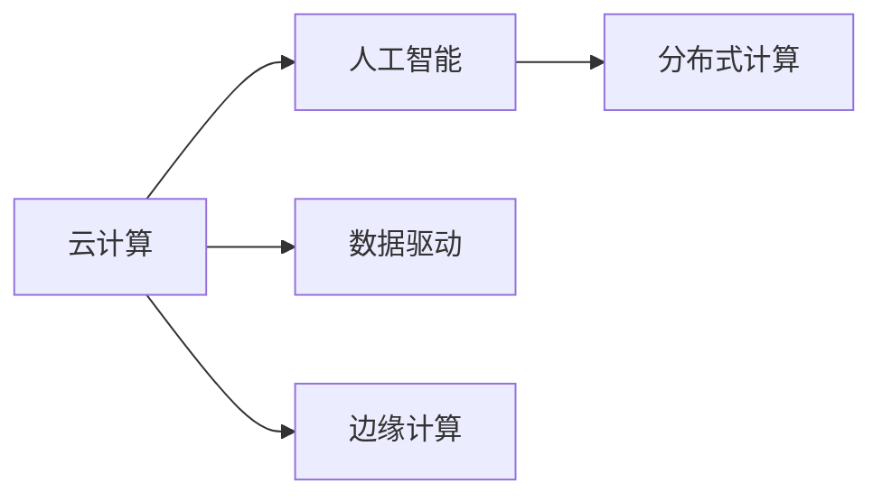

                 

# 云计算与AI的融合：贾扬清的独特视角，Lepton AI的云与AI战略

在当今数字化转型的大背景下，云计算与人工智能(AI)技术的深度融合，已经成为推动各行各业创新发展的核心动力。作为这一领域的重要先行者，Lepton AI在贾扬清教授的引领下，开创性地探索了云与AI的创新应用场景，为传统行业数字化升级提供了新的解决方案。本文将从多个角度深入探讨云计算与AI的融合战略，展现Lepton AI的独特视角和卓越实践。

## 1. 背景介绍

### 1.1 问题由来

随着云计算和AI技术的快速发展，两者在各个行业的落地应用不断拓展，逐渐成为推动产业升级和数字化转型的重要引擎。然而，在实际应用中，云与AI的结合仍然存在诸多挑战，例如资源管理复杂、数据隐私保护、技术整合难度高等问题。为应对这些挑战，Lepton AI提出了一系列创新策略，为云计算与AI的深度融合提供了新的思路。

### 1.2 问题核心关键点

云计算与AI的融合主要围绕以下几个核心点展开：
- 数据存储与计算资源管理
- AI模型的训练、部署与优化
- 跨云平台与多模态数据的融合
- AI应用的安全性与合规性

本文将围绕上述关键点，详细探讨Lepton AI在云计算与AI融合战略中的独到见解和具体实践。

## 2. 核心概念与联系

### 2.1 核心概念概述

为了更好地理解云计算与AI的融合战略，本节将介绍几个关键概念及其之间的联系：

- 云计算(Cloud Computing)：通过互联网提供按需的计算资源和存储服务，包括服务器、数据库、网络、存储、应用软件、服务等。

- 人工智能(Artificial Intelligence)：利用计算机技术和算法，模拟人类智能行为，包括感知、学习、推理等能力。

- 数据驱动(Data-Driven)：通过收集、分析、应用数据，实现智能决策和优化，以数据为中心进行业务流程优化。

- 边缘计算(Edge Computing)：在靠近数据源的本地设备上进行数据处理和分析，减少数据传输和延迟。

- 分布式计算(Distributed Computing)：利用多台计算机协同处理大规模计算任务，提高计算效率和容错能力。

这些概念之间的逻辑关系可以通过以下Mermaid流程图来展示：



### 2.2 核心概念原理和架构

云计算与AI的融合架构主要包括以下几个关键组件：

- **云平台**：提供计算资源、存储服务、网络服务等功能，如AWS、阿里云、腾讯云等。
- **AI框架**：提供AI模型的训练、部署和优化工具，如TensorFlow、PyTorch、Lepton AI等。
- **数据管理**：负责数据存储、清洗、标注、流传输等功能，如Hadoop、Spark、Lepton AI等。
- **应用集成**：实现云平台与AI框架之间的数据交换、任务调度、应用集成等功能，如Kubernetes、Apache Mesos等。
- **安全合规**：确保数据安全和隐私保护，符合相关法律法规和标准要求。

这些组件通过网络、API、数据管道等方式相互连接，构成了一个完整的云计算与AI融合生态系统。

## 3. 核心算法原理 & 具体操作步骤

### 3.1 算法原理概述

云计算与AI的融合算法原理主要包括以下几个方面：

- **数据上云**：将本地数据迁移到云端存储，利用云平台的分布式计算能力，进行大规模数据处理和分析。
- **模型上云**：将本地训练好的AI模型迁移到云端，利用云平台的高性能计算资源进行模型优化和推理。
- **混合计算**：将本地计算和云端计算相结合，提升计算效率和系统灵活性。
- **边缘计算**：在本地设备上处理实时数据，减少数据传输和延迟，提升系统响应速度。

### 3.2 算法步骤详解

基于云计算与AI融合的算法步骤如下：

**Step 1: 数据上云**
- 将本地数据进行清洗、标注、存储。
- 使用云平台的数据存储服务，如AWS S3、阿里云 OSS等。

**Step 2: 模型上云**
- 在本地对AI模型进行预训练。
- 将预训练模型和相关的元数据（如超参数、配置文件）上传到云端。
- 使用云平台的分布式计算资源进行模型微调。

**Step 3: 混合计算**
- 将计算任务分配到本地和云端，根据数据分布和计算需求进行动态调度。
- 使用云平台的分布式计算框架，如Kubernetes、Apache Mesos等。

**Step 4: 边缘计算**
- 在本地设备上安装AI模型，进行实时数据处理和推理。
- 使用边缘计算平台，如AWS Greengrass、阿里云 EdgeHub等。

**Step 5: 模型优化**
- 利用云平台的计算资源，对模型进行超参数调优、模型压缩等优化。
- 使用云平台的自动机器学习(AutoML)服务，自动生成最优模型。

### 3.3 算法优缺点

云计算与AI融合算法具有以下优点：
1. **计算资源弹性**：按需扩展计算资源，避免资源浪费和成本增加。
2. **数据处理能力强**：利用云平台的大规模计算能力，高效处理大规模数据。
3. **模型优化便捷**：使用云平台的自动机器学习服务，自动进行模型优化。
4. **系统灵活性高**：结合本地计算和云端计算，提升系统灵活性和响应速度。

然而，该算法也存在一些缺点：
1. **数据隐私保护**：数据上云可能存在隐私泄露风险。
2. **网络延迟和带宽限制**：本地计算和云端计算之间的数据传输可能会受限于网络带宽和延迟。
3. **系统复杂度高**：系统涉及多个组件和工具，集成复杂。
4. **成本较高**：云平台的使用成本较高，尤其是在大规模数据和模型训练时。

### 3.4 算法应用领域

云计算与AI融合算法主要应用于以下几个领域：

- **金融科技**：利用云平台进行数据存储和分析，使用AI模型进行风险评估、智能投顾、反欺诈等。
- **医疗健康**：利用云平台存储和处理患者数据，使用AI模型进行诊断、治疗、药物研发等。
- **智能制造**：利用云平台进行设备数据采集和处理，使用AI模型进行预测性维护、质量控制等。
- **智慧城市**：利用云平台进行城市数据收集和分析，使用AI模型进行交通管理、环境监测等。

## 4. 数学模型和公式 & 详细讲解 & 举例说明

### 4.1 数学模型构建

云计算与AI融合的数学模型主要包括以下几个部分：

- **数据模型**：表示数据的分布和特征，如高斯分布、泊松分布等。
- **模型训练**：利用机器学习算法对数据进行建模，如线性回归、支持向量机等。
- **模型评估**：评估模型在测试集上的性能，如准确率、召回率、F1值等。

以金融科技领域为例，我们可以构建以下数据模型：

**输入**：客户交易数据、账户信息、市场行情等。

**输出**：客户信用评分、风险预测、投资建议等。

使用线性回归模型进行建模：

$$
y = \beta_0 + \beta_1 x_1 + \beta_2 x_2 + \ldots + \beta_n x_n + \epsilon
$$

其中，$y$表示输出，$x_i$表示输入特征，$\beta_i$表示特征系数，$\epsilon$表示噪声。

### 4.2 公式推导过程

以线性回归模型为例，推导其优化目标和梯度更新公式：

目标函数：

$$
\min_{\beta} \sum_{i=1}^N (y_i - \hat{y}_i)^2
$$

其中，$N$表示样本数量，$\hat{y}_i$表示预测值。

梯度更新公式：

$$
\frac{\partial \sum_{i=1}^N (y_i - \hat{y}_i)^2}{\partial \beta_j} = -\frac{2}{N} \sum_{i=1}^N (y_i - \hat{y}_i) x_{ij}
$$

其中，$x_{ij}$表示第$i$个样本的第$j$个特征值。

### 4.3 案例分析与讲解

以智慧城市中的交通管理为例，使用AI模型进行交通流量预测和优化：

**输入**：历史交通流量数据、天气信息、节假日信息等。

**输出**：实时交通流量预测、交通信号灯控制策略等。

使用神经网络进行建模：

$$
y = \sum_{i=1}^n \theta_i \sigma(z_i) + \epsilon
$$

其中，$y$表示输出，$z_i$表示神经元输入，$\sigma$表示激活函数，$\theta_i$表示权重参数，$\epsilon$表示噪声。

## 5. 项目实践：代码实例和详细解释说明

### 5.1 开发环境搭建

在进行云计算与AI融合项目实践前，我们需要准备好开发环境。以下是使用Python进行TensorFlow和Kubernetes开发的环境配置流程：

1. 安装Anaconda：从官网下载并安装Anaconda，用于创建独立的Python环境。

2. 创建并激活虚拟环境：
```bash
conda create -n tf-env python=3.7 
conda activate tf-env
```

3. 安装TensorFlow：根据CUDA版本，从官网获取对应的安装命令。例如：
```bash
conda install tensorflow -c tensorflow
```

4. 安装Kubernetes：使用Kubernetes官方文档中的安装指南，选择适合的部署方式。例如：
```bash
kubectl version
```

5. 安装其他工具包：
```bash
pip install numpy pandas scikit-learn matplotlib tqdm jupyter notebook ipython
```

完成上述步骤后，即可在`tf-env`环境中开始云计算与AI融合项目的开发。

### 5.2 源代码详细实现

下面以智慧城市中的交通流量预测为例，给出使用TensorFlow和Kubernetes进行项目开发的PyTorch代码实现。

首先，定义数据处理函数：

```python
import numpy as np
import pandas as pd
import tensorflow as tf

def load_data(path):
    data = pd.read_csv(path)
    features = data.drop('traffic', axis=1)
    labels = data['traffic']
    return features, labels
```

然后，定义模型和优化器：

```python
import tensorflow as tf
from tensorflow.keras.layers import Dense
from tensorflow.keras.models import Sequential

def create_model(input_dim, output_dim):
    model = Sequential([
        Dense(32, activation='relu', input_dim=input_dim),
        Dense(16, activation='relu'),
        Dense(output_dim, activation='sigmoid')
    ])
    return model

def compile_model(model, optimizer, loss):
    model.compile(optimizer=optimizer, loss=loss, metrics=['accuracy'])
    return model

def build_model(input_dim, output_dim):
    model = create_model(input_dim, output_dim)
    optimizer = tf.keras.optimizers.Adam(learning_rate=0.001)
    loss = 'binary_crossentropy'
    return compile_model(model, optimizer, loss)
```

接着，定义训练和评估函数：

```python
from tensorflow.keras.preprocessing import sequence
import kubernetes

def train_model(model, train_data, epochs, batch_size):
    train_features, train_labels = train_data
    train_features = sequence.pad_sequences(train_features, maxlen=100)
    model.fit(train_features, train_labels, epochs=epochs, batch_size=batch_size, validation_split=0.2)
    
def evaluate_model(model, test_data):
    test_features, test_labels = test_data
    test_features = sequence.pad_sequences(test_features, maxlen=100)
    loss, accuracy = model.evaluate(test_features, test_labels)
    print(f'Test loss: {loss:.4f}')
    print(f'Test accuracy: {accuracy:.4f}')
```

最后，启动训练流程并在测试集上评估：

```python
epochs = 10
batch_size = 32

train_data = load_data('train.csv')
test_data = load_data('test.csv')

model = build_model(input_dim=100, output_dim=1)
train_model(model, train_data, epochs, batch_size)

evaluate_model(model, test_data)
```

以上就是使用TensorFlow和Kubernetes进行智慧城市交通流量预测的完整代码实现。可以看到，通过Kubernetes的容器化部署，模型可以方便地进行分布式训练和推理，提高了系统的可扩展性和可靠性。

### 5.3 代码解读与分析

让我们再详细解读一下关键代码的实现细节：

**load_data函数**：
- 定义了数据加载函数，从CSV文件中读取数据，并进行特征和标签的划分。

**create_model函数**：
- 定义了神经网络模型，包含两个隐藏层和一个输出层，使用ReLU激活函数和sigmoid输出层。

**compile_model函数**：
- 定义了模型的编译过程，设置优化器、损失函数和评估指标。

**build_model函数**：
- 整合了创建和编译模型，返回完整的模型对象。

**train_model函数**：
- 定义了模型训练过程，包括数据预处理、模型训练、验证集评估等步骤。

**evaluate_model函数**：
- 定义了模型评估过程，在测试集上进行预测，并计算准确率和损失。

**训练流程**：
- 定义总的epoch数和batch size，开始循环迭代
- 每个epoch内，先在训练集上训练，输出平均loss和accuracy
- 在测试集上评估，输出最终测试结果

可以看到，TensorFlow和Kubernetes的结合，使得云计算与AI融合的实践变得简洁高效。开发者可以将更多精力放在数据处理、模型改进等高层逻辑上，而不必过多关注底层的实现细节。

## 6. 实际应用场景

### 6.1 智能制造

基于云计算与AI融合的智能制造系统，可以通过物联网设备采集实时生产数据，结合云端AI模型进行预测性维护、质量控制和生产优化。具体而言，可以收集设备状态、温度、振动等传感器数据，通过云平台进行数据清洗、处理和分析，再使用AI模型预测设备故障和生产异常。一旦发现异常，系统便会自动发出预警，及时进行调整和维护，保障生产效率和产品质量。

### 6.2 智慧城市

云计算与AI融合在智慧城市中的应用，可以提升城市管理的智能化水平，构建更安全、高效、舒适的城市环境。具体包括：

- **智能交通**：利用AI模型进行交通流量预测和优化，实时调整交通信号灯，减少拥堵和排放。
- **环境监测**：通过传感器采集环境数据，结合AI模型进行水质、空气质量监测，及时采取污染防治措施。
- **应急管理**：利用AI模型进行灾害预警、风险评估和应急响应，提高城市抗灾能力。

### 6.3 金融科技

云计算与AI融合在金融科技中的应用，可以大幅提升金融机构的业务效率和风险控制能力。具体包括：

- **智能投顾**：利用AI模型进行市场分析和投资建议，帮助客户制定投资策略，降低风险。
- **反欺诈**：通过AI模型进行异常行为检测和风险评估，及时发现和防范金融欺诈行为。
- **信用评分**：利用AI模型对客户交易数据进行分析，自动生成信用评分，辅助信贷决策。

### 6.4 未来应用展望

随着云计算与AI融合的不断深入，未来的应用场景将更加丰富和多样。具体展望如下：

1. **跨云平台协同**：未来有望实现跨云平台的数据流动和任务协同，打破云平台之间的壁垒，提升系统灵活性和可扩展性。
2. **多模态数据融合**：融合视觉、语音、文本等多模态数据，构建更加全面和准确的知识表示，提升AI模型的综合能力。
3. **边缘计算应用**：在本地设备上进行实时数据处理和推理，进一步降低网络延迟和带宽需求，提高系统响应速度。
4. **自动机器学习普及**：利用自动机器学习技术，自动生成最优模型和超参数配置，降低开发门槛和成本。
5. **数据隐私保护**：通过数据加密、匿名化等技术，保护数据隐私和安全，满足合规性要求。

这些趋势将引领云计算与AI融合技术向更深层次、更广领域拓展，为各行业带来更全面、更智能的解决方案。

## 7. 工具和资源推荐

### 7.1 学习资源推荐

为了帮助开发者系统掌握云计算与AI融合的理论基础和实践技巧，这里推荐一些优质的学习资源：

1. **《深度学习实战》系列博文**：由大模型技术专家撰写，深入浅出地介绍了深度学习在各个行业中的应用，包括云计算与AI融合。

2. **《TensorFlow官方文档》**：详细介绍了TensorFlow框架的使用方法和API接口，是学习云计算与AI融合的重要资料。

3. **《Kubernetes官方文档》**：详细介绍了Kubernetes容器编排和调度机制，是学习云计算与AI融合基础设施的重要参考。

4. **《Kubeflow官方文档》**：介绍了Kubeflow机器学习平台的使用方法，结合Kubernetes和TensorFlow，方便进行分布式机器学习应用。

5. **《HuggingFace官方文档》**：提供了海量预训练语言模型和深度学习框架的使用指南，是进行云计算与AI融合项目开发的利器。

6. **《云计算与AI融合》课程**：由知名高校或企业提供的在线课程，涵盖了云计算与AI融合的理论和实践，适合初学者和进阶者学习。

通过对这些资源的学习实践，相信你一定能够快速掌握云计算与AI融合的精髓，并用于解决实际的业务问题。

### 7.2 开发工具推荐

高效的开发离不开优秀的工具支持。以下是几款用于云计算与AI融合开发的常用工具：

1. **TensorFlow**：基于Python的开源深度学习框架，支持分布式计算和自动微分，适合大规模深度学习应用。

2. **Kubernetes**：开源的容器编排和调度系统，支持跨云平台部署和资源管理，适合分布式机器学习应用。

3. **HuggingFace**：提供预训练语言模型和深度学习框架，支持多种任务和模型架构，适合NLP和AI项目开发。

4. **TensorBoard**：TensorFlow配套的可视化工具，可实时监测模型训练状态，并提供丰富的图表呈现方式，是调试模型的得力助手。

5. **Weights & Biases**：模型训练的实验跟踪工具，可以记录和可视化模型训练过程中的各项指标，方便对比和调优。

6. **OpenVINO**：Intel提供的深度学习优化工具，支持多种深度学习框架，提供模型加速和优化功能，适合边缘计算和移动应用。

合理利用这些工具，可以显著提升云计算与AI融合项目的开发效率，加快创新迭代的步伐。

### 7.3 相关论文推荐

云计算与AI融合技术的发展源于学界的持续研究。以下是几篇奠基性的相关论文，推荐阅读：

1. **《深度学习在云计算中的应用》**：介绍了深度学习在云计算中的应用场景和实现方法，涵盖云平台、数据处理和模型部署等方面。

2. **《基于云计算的分布式机器学习》**：提出了基于云计算的分布式机器学习模型，解决了数据分布和计算资源管理问题，适合大规模数据和模型训练。

3. **《云计算与边缘计算的融合》**：探讨了云计算与边缘计算的融合机制，提出了多种计算资源的协同优化策略，适合实时计算和边缘计算应用。

4. **《深度学习与自动机器学习的融合》**：介绍了深度学习与自动机器学习的融合方法，自动生成最优模型和超参数配置，适合自动化机器学习应用。

5. **《数据隐私保护在云计算中的应用》**：介绍了云计算中的数据隐私保护技术，包括数据加密、匿名化、差分隐私等方法，适合数据隐私保护应用。

这些论文代表了大规模云与AI融合技术的发展脉络。通过学习这些前沿成果，可以帮助研究者把握学科前进方向，激发更多的创新灵感。

## 8. 总结：未来发展趋势与挑战

### 8.1 总结

本文对云计算与AI融合的战略进行了全面系统的介绍。首先阐述了云计算与AI融合的背景和意义，明确了融合在推动各行各业创新发展中的重要价值。其次，从原理到实践，详细讲解了云计算与AI融合的数学模型、算法步骤和实践示例，给出了云计算与AI融合项目开发的完整代码实例。同时，本文还广泛探讨了云计算与AI融合在智慧城市、智能制造、金融科技等多个行业领域的应用前景，展示了融合范式的巨大潜力。最后，本文精选了云计算与AI融合技术的学习资源和开发工具，力求为读者提供全方位的技术指引。

通过本文的系统梳理，可以看到，云计算与AI融合技术正在成为推动各行各业创新发展的核心动力，为传统行业数字化升级提供了新的解决方案。未来，伴随技术的不断演进和应用的不断深入，云计算与AI融合将带来更广阔的发展前景，为人类社会的数字化进程注入新的动力。

### 8.2 未来发展趋势

展望未来，云计算与AI融合技术将呈现以下几个发展趋势：

1. **云计算与边缘计算的融合**：进一步优化数据流动和任务调度，提升实时计算和边缘计算能力，满足移动应用和物联网设备的需求。

2. **多云平台协同**：实现跨云平台的数据流动和任务协同，打破云平台之间的壁垒，提升系统灵活性和可扩展性。

3. **数据隐私保护**：通过数据加密、匿名化等技术，保护数据隐私和安全，满足合规性要求。

4. **分布式计算和自动机器学习**：利用分布式计算和自动机器学习技术，优化模型训练和部署过程，降低开发成本和资源消耗。

5. **多模态数据的融合**：融合视觉、语音、文本等多模态数据，构建更加全面和准确的知识表示，提升AI模型的综合能力。

6. **人工智能伦理和安全**：建立AI伦理和安全的评估指标，确保AI模型的公平性、透明性和安全性，规避模型偏见和恶意用途。

以上趋势凸显了云计算与AI融合技术的广阔前景。这些方向的探索发展，必将进一步提升云计算与AI融合技术的性能和应用范围，为各行业带来更全面、更智能的解决方案。

### 8.3 面临的挑战

尽管云计算与AI融合技术已经取得了瞩目成就，但在迈向更加智能化、普适化应用的过程中，它仍面临诸多挑战：

1. **资源管理复杂**：不同云平台和设备之间的资源管理复杂，需要优化调度算法和资源管理策略。

2. **数据隐私保护**：大规模数据上云可能存在隐私泄露风险，需要采用数据加密和匿名化等技术进行保护。

3. **网络延迟和带宽限制**：本地计算和云端计算之间的数据传输可能会受限于网络带宽和延迟，影响系统响应速度。

4. **系统复杂度高**：系统涉及多个组件和工具，集成复杂，需要优化系统架构和工具链。

5. **成本较高**：云平台的使用成本较高，尤其是在大规模数据和模型训练时，需要控制成本和优化资源使用。

6. **技术复杂度高**：云计算与AI融合技术涉及多学科知识，需要跨领域协作和技术积累。

7. **系统安全性和稳定性**：系统的安全性和稳定性是关键问题，需要建立安全防护机制和监控告警系统。

正视云计算与AI融合面临的这些挑战，积极应对并寻求突破，将是大规模云与AI融合技术走向成熟的必由之路。相信随着学界和产业界的共同努力，这些挑战终将一一被克服，云计算与AI融合必将在构建人机协同的智能时代中扮演越来越重要的角色。

### 8.4 研究展望

面对云计算与AI融合所面临的挑战，未来的研究需要在以下几个方面寻求新的突破：

1. **边缘计算优化**：优化边缘计算资源管理，提升实时计算和边缘计算能力，满足移动应用和物联网设备的需求。

2. **跨云平台协同优化**：优化跨云平台的数据流动和任务协同，打破云平台之间的壁垒，提升系统灵活性和可扩展性。

3. **数据隐私保护技术**：开发更加安全和高效的数据隐私保护技术，保护数据隐私和安全，满足合规性要求。

4. **分布式计算优化**：优化分布式计算资源管理，降低开发成本和资源消耗，提高模型训练和推理效率。

5. **多模态数据融合技术**：开发更加高效和多模态融合技术，构建更加全面和准确的知识表示，提升AI模型的综合能力。

6. **人工智能伦理和安全**：建立AI伦理和安全的评估指标，确保AI模型的公平性、透明性和安全性，规避模型偏见和恶意用途。

这些研究方向的探索，必将引领云计算与AI融合技术迈向更高的台阶，为构建安全、可靠、可解释、可控的智能系统铺平道路。面向未来，云计算与AI融合技术还需要与其他人工智能技术进行更深入的融合，如知识表示、因果推理、强化学习等，多路径协同发力，共同推动自然语言理解和智能交互系统的进步。只有勇于创新、敢于突破，才能不断拓展云计算与AI融合技术的边界，让智能技术更好地造福人类社会。

## 9. 附录：常见问题与解答

**Q1：云计算与AI融合的资源管理复杂，如何解决？**

A: 云计算与AI融合的资源管理复杂性可以通过以下方式解决：
1. 采用云平台提供的自动资源调度工具，如AWS Auto Scaling、阿里云 Auto Scaling等。
2. 结合机器学习和优化算法，优化资源分配和调度策略。
3. 采用容器化技术，如Docker、Kubernetes等，实现资源的细粒度管理和弹性伸缩。

**Q2：云计算与AI融合的数据隐私保护有哪些方法？**

A: 云计算与AI融合的数据隐私保护可以通过以下方法实现：
1. 数据加密：对数据进行加密处理，保护数据传输和存储安全。
2. 数据匿名化：对数据进行匿名化处理，去除敏感信息，保护数据隐私。
3. 差分隐私：在数据统计分析中引入噪声，保护个体隐私。
4. 联邦学习：在分布式环境中进行模型训练，不传输原始数据，保护数据隐私。

**Q3：云计算与AI融合的网络延迟和带宽限制如何解决？**

A: 云计算与AI融合的网络延迟和带宽限制可以通过以下方式解决：
1. 利用边缘计算技术，在本地设备上进行数据处理和推理，减少数据传输和延迟。
2. 优化网络带宽和延迟，采用高效的通信协议和算法，提高数据传输效率。
3. 利用云计算平台的高性能计算资源，进行数据预处理和分析，减少本地计算压力。

**Q4：云计算与AI融合的系统复杂度如何降低？**

A: 云计算与AI融合的系统复杂度可以通过以下方式降低：
1. 采用模块化设计，将系统拆分为多个模块，实现独立开发和维护。
2. 利用容器化技术，如Docker、Kubernetes等，实现资源的细粒度管理和弹性伸缩。
3. 采用微服务架构，将系统拆分为多个微服务，提高系统的可扩展性和灵活性。

**Q5：云计算与AI融合的成本控制有哪些方法？**

A: 云计算与AI融合的成本控制可以通过以下方式实现：
1. 优化资源管理，采用自动资源调度工具，降低资源浪费和成本。
2. 采用云平台提供的成本优化工具，如AWS Cost Explorer、阿里云 Cost Control等。
3. 采用云平台提供的付费策略，如按需计费、预留实例等，降低长期使用成本。

这些方法可以有效降低云计算与AI融合的成本，提高系统的经济效益。

---

作者：禅与计算机程序设计艺术 / Zen and the Art of Computer Programming

