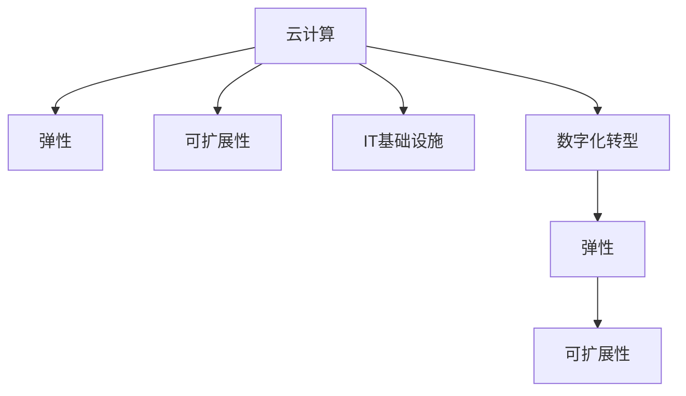

                 

# 云计算在企业数字化转型中的作用：灵活性与可扩展性

> 关键词：云计算,数字化转型,弹性,可扩展性,企业IT,云计算安全,云平台,DevOps,大数据

## 1. 背景介绍

### 1.1 问题由来
近年来，随着企业数字化转型的不断深入，企业对于IT基础设施的灵活性和可扩展性的需求日益增长。传统的企业IT架构难以应对快速变化的业务需求和数据量的激增，云服务以其高度的灵活性和可扩展性成为企业的首选。特别是随着云计算技术的不断成熟，云服务已经被广泛应用于企业信息化建设的各个环节。

### 1.2 问题核心关键点
云计算在企业数字化转型中扮演了关键角色，其灵活性和可扩展性使得企业能够更快速地响应市场变化和业务需求，降低IT成本，提高运营效率。然而，云计算也带来了新的挑战，如安全性、合规性、数据治理等，需要企业在采用云计算服务时进行综合考量。

### 1.3 问题研究意义
深入理解云计算的灵活性和可扩展性，有助于企业更好地规划云计算的引入和应用，优化IT架构，提升业务竞争力。本文将从多个角度深入探讨云计算在企业数字化转型中的作用，包括云计算的灵活性、可扩展性、安全性、经济性等，并提供实践建议，帮助企业更好地利用云计算服务。

## 2. 核心概念与联系

### 2.1 核心概念概述

为更好地理解云计算在企业数字化转型中的作用，本节将介绍几个密切相关的核心概念：

- **云计算(Cloud Computing)**：指通过互联网提供计算资源和服务的一种计算模式。用户可以通过互联网访问云端资源，按需使用，按使用量付费。

- **弹性(Scalability)**：指系统能够根据业务负载的变化，自动调整资源分配，保证业务连续性和高效运行的能力。

- **可扩展性(Extensibility)**：指系统能够方便地增加新功能或扩展现有功能，而无需大量修改现有架构的能力。

- **IT基础设施(IT Infrastructure)**：指企业IT系统中的硬件、软件、网络和安全等基础设施，是企业信息化建设的基础。

- **数字化转型(Digital Transformation)**：指企业利用云计算、大数据、人工智能等新兴技术，对业务流程、组织结构、客户体验等进行全面重塑，以提高效率和竞争力的过程。

这些核心概念之间的逻辑关系可以通过以下Mermaid流程图来展示：



这个流程图展示云计算与其他核心概念之间的相互关系：

1. 云计算为弹性与可扩展性提供了技术基础。
2. 云计算与IT基础设施紧密结合，是企业数字化转型的基础设施。
3. 云计算与数字化转型相互作用，共同推动企业转型升级。

## 3. 核心算法原理 & 具体操作步骤

### 3.1 算法原理概述

云计算的灵活性和可扩展性是其核心优势之一，主要由其架构和资源管理机制共同实现。具体而言，云计算通过以下几个关键特性实现灵活性和可扩展性：

1. **按需服务(On-Demand Service)**：用户根据实际需求，按需购买云资源，避免资源浪费和过度配置。
2. **自动扩展(Auto-Scaling)**：系统能够根据负载变化自动调整资源分配，保证系统的高可用性和高效运行。
3. **弹性负载均衡(Elastic Load Balancing)**：将请求均匀分配到多个服务器上，提高系统吞吐量和稳定性。
4. **弹性伸缩(Elastic Scaling)**：根据业务负载变化动态调整资源，保证系统稳定运行。

### 3.2 算法步骤详解

云计算实现灵活性和可扩展性的关键步骤包括：

1. **资源池化**：将云基础设施资源抽象成池，通过虚拟化技术实现资源的统一管理和调度。
2. **服务抽象**：将底层物理资源封装成云服务，提供统一的服务接口，方便用户按需使用。
3. **自动调整**：通过监控工具实时监控系统负载，根据负载变化自动调整资源分配。
4. **负载均衡**：通过负载均衡器将请求均匀分配到多个实例上，提高系统吞吐量和稳定性。
5. **弹性伸缩**：根据业务负载变化动态调整实例数量和规格，保证系统高效运行。

### 3.3 算法优缺点

云计算在实现灵活性和可扩展性方面具有以下优点：

1. **灵活性高**：按需购买云资源，避免资源浪费，根据业务需求快速调整。
2. **成本低**：按使用量付费，避免一次性投资和硬件升级，降低IT成本。
3. **可扩展性强**：自动调整资源分配，根据业务负载变化动态伸缩实例数量和规格。
4. **易管理**：统一的接口和监控工具，方便管理和维护。

同时，云计算也存在以下缺点：

1. **安全性不足**：云平台可能存在安全漏洞，数据泄露风险增加。
2. **依赖服务商**：云平台的服务和功能依赖于云服务商，可能存在服务中断和数据丢失的风险。
3. **治理复杂**：云环境的复杂性和多样性，增加了数据治理和合规管理的难度。

### 3.4 算法应用领域

云计算的灵活性和可扩展性已在多个领域得到广泛应用，包括：

- **企业信息化**：将企业业务系统迁移到云端，实现IT架构的弹性化和自动化。
- **数据处理**：大数据分析、存储、处理等，通过弹性伸缩和自动扩展满足海量数据的处理需求。
- **应用开发**：敏捷开发、DevOps、容器化等，加速应用交付和迭代。
- **云计算安全**：数据加密、身份认证、访问控制等，保障云平台的安全性。
- **云平台运维**：监控、故障排除、性能优化等，提高云平台的高可用性和高效运行。

## 4. 数学模型和公式 & 详细讲解 & 举例说明

### 4.1 数学模型构建

云计算的灵活性和可扩展性可以通过数学模型来量化和分析。以下是一个简化的云计算系统模型：

假设一个云计算系统有 $n$ 个云服务器，每个服务器处理能力为 $c$，平均负载为 $L$。设云平台的弹性系数为 $k$，则系统的总处理能力为 $n \times c$。

系统的总负载 $L$ 可以通过以下公式计算：

$$
L = \sum_{i=1}^n l_i
$$

其中 $l_i$ 表示第 $i$ 个服务器的负载。

### 4.2 公式推导过程

当系统负载 $L$ 增加时，根据弹性系数 $k$，系统自动调整服务器数量，满足以下关系：

$$
n = \frac{L}{c} \times k
$$

其中 $k$ 为弹性系数，通常取值为 1.2 到 2 之间，保证系统有一定的冗余度。

系统的总处理能力 $C$ 可以根据服务器数量和处理能力计算：

$$
C = n \times c = \frac{L}{c} \times k \times c = k \times L
$$

当负载 $L$ 增加时，系统自动增加服务器数量，满足以下关系：

$$
n_{\text{new}} = \frac{L_{\text{new}}}{c} \times k
$$

其中 $L_{\text{new}}$ 表示新的负载。

新的总处理能力 $C_{\text{new}}$ 可以根据新的服务器数量和处理能力计算：

$$
C_{\text{new}} = n_{\text{new}} \times c = \frac{L_{\text{new}}}{c} \times k \times c = k \times L_{\text{new}}
$$

### 4.3 案例分析与讲解

以下通过一个具体案例，分析云计算如何实现灵活性和可扩展性：

假设一个企业使用云平台处理订单处理任务，订单处理量为 $L_0$，初始服务器数量为 $n_0$，每个服务器的处理能力为 $c$。

初始系统的总处理能力为：

$$
C_0 = n_0 \times c
$$

当订单处理量增加到 $L_1$ 时，云平台自动调整服务器数量，满足以下关系：

$$
n_1 = \frac{L_1}{c} \times k
$$

新的总处理能力为：

$$
C_1 = n_1 \times c = \frac{L_1}{c} \times k \times c = k \times L_1
$$

当订单处理量再次增加到 $L_2$ 时，云平台再次调整服务器数量，满足以下关系：

$$
n_2 = \frac{L_2}{c} \times k
$$

新的总处理能力为：

$$
C_2 = n_2 \times c = \frac{L_2}{c} \times k \times c = k \times L_2
$$

可以看出，通过弹性系数 $k$，云平台能够自动调整服务器数量和处理能力，满足不断变化的业务需求。

## 5. 项目实践：代码实例和详细解释说明

### 5.1 开发环境搭建

在进行云计算项目实践前，我们需要准备好开发环境。以下是使用AWS搭建云计算环境的步骤：

1. 在AWS管理控制台中创建EC2实例，选择适当的实例类型、操作系统、网络配置等。
2. 安装云平台所需的依赖软件，如OpenStack、Docker、Kubernetes等。
3. 配置云平台监控和日志工具，如CloudWatch、ElasticSearch等。
4. 部署应用程序，并进行性能测试和优化。

### 5.2 源代码详细实现

以下是一个使用AWS云平台部署应用系统的示例代码：

```python
import boto3

# 创建EC2实例
ec2 = boto3.client('ec2')
instance = ec2.run_instances(
    ImageId='ami-0123456789abcdef0',
    InstanceType='t2.micro',
    MinCount=1,
    MaxCount=1
)

# 创建Elastic Load Balancer
elb = boto3.client('elbv2')
elb_load_balancer = elb.create_load_balancer(
    Name='my-load-balancer',
    Subnets=['subnet-0123456789abcdef0', 'subnet-0123456789abcdef1']
)

# 创建Elastic Container Service
ecs = boto3.client('ecs')
ecs_cluster = ecs.create_cluster(
    name='my-ecs-cluster',
    launch_type='EC2',
    network_configuration={
        'awsvpcConfiguration': {
            'awsvpcSubnets': ['subnet-0123456789abcdef0', 'subnet-0123456789abcdef1'],
            'awsvpcSecurityGroups': ['sg-0123456789abcdef0', 'sg-0123456789abcdef1']
        }
    }
)

# 部署应用容器
ecs_task = ecs.create_task_definition(
    family='my-app-container',
    container_definitions={
        'container': {
            'name': 'my-app-container',
            'image': 'my-app-image',
            'memory': 256,
            'cpu': 1
        }
    }
)

ecs_run_task = ecs.run_task(
    cluster='my-ecs-cluster',
    taskDefinition='my-app-container',
    count=1
)
```

### 5.3 代码解读与分析

上述代码示例展示了使用AWS云平台部署应用系统的基本步骤：

1. **创建EC2实例**：使用AWS SDK创建EC2实例，设置实例类型、操作系统和网络配置。
2. **创建Elastic Load Balancer**：创建Elastic Load Balancer，将请求均匀分配到多个实例上。
3. **创建Elastic Container Service**：创建Elastic Container Service，将应用容器化部署在ECS上。
4. **部署应用容器**：创建ECS任务定义，并运行容器实例。

### 5.4 运行结果展示

在运行上述代码后，AWS控制台将显示创建的EC2实例、Elastic Load Balancer和Elastic Container Service。应用容器将在EC2实例上运行，并由Elastic Load Balancer进行负载均衡和监控。

## 6. 实际应用场景

### 6.1 弹性伸缩
弹性伸缩是云计算实现灵活性和可扩展性的重要特性之一。以下是一个实际应用场景：

**企业订单系统**：一家电商平台的企业订单系统采用AWS云平台进行部署，初始部署2个EC2实例，每个实例处理能力为1核CPU、256MB内存。当订单处理量增加到1万/秒时，系统自动增加2个EC2实例，总处理能力增加到2核CPU、512MB内存。当订单处理量进一步增加到5万/秒时，系统自动增加4个EC2实例，总处理能力增加到4核CPU、1GB内存。

### 6.2 动态扩缩容
动态扩缩容是云计算实现灵活性和可扩展性的另一个关键特性。以下是一个实际应用场景：

**企业视频会议系统**：一家企业的视频会议系统采用AWS云平台进行部署，初始部署3个EC2实例，每个实例处理能力为1核CPU、1GB内存。当视频会议参与人数增加到100人时，系统自动增加2个EC2实例，总处理能力增加到6核CPU、2GB内存。当视频会议参与人数进一步增加到200人时，系统自动增加4个EC2实例，总处理能力增加到10核CPU、3GB内存。当视频会议结束，参与人数减少到20人时，系统自动减少2个EC2实例，总处理能力减少到4核CPU、1GB内存。

## 7. 工具和资源推荐

### 7.1 学习资源推荐

为帮助开发者深入理解云计算的灵活性和可扩展性，以下是几本优秀的学习资源：

1. **《云计算基础》**：详细介绍了云计算的基本概念、架构、应用场景等，适合初学者入门。
2. **《云平台架构设计》**：介绍了AWS、阿里云、腾讯云等主要云平台的设计原则和最佳实践，适合云计算架构师参考。
3. **《微服务架构设计》**：介绍了微服务架构的基本概念、设计模式和实践方法，适合云计算开发人员参考。
4. **《云原生技术栈》**：介绍了云原生技术栈的架构、组件和最佳实践，适合云计算开发人员参考。
5. **《DevOps实践指南》**：介绍了DevOps的基本概念、工具链和实践方法，适合云计算开发人员参考。

### 7.2 开发工具推荐

高效的工具是云计算开发不可或缺的一部分。以下是几款常用的云计算开发工具：

1. **AWS CLI**：AWS的命令行工具，方便进行云平台的操作和管理。
2. **CloudFormation**：AWS的云形成工具，支持使用YAML文件定义云平台资源。
3. **Kubernetes**：开源容器编排系统，支持云平台的弹性伸缩和应用部署。
4. **Docker**：容器化技术，支持应用和服务的打包、分发和管理。
5. **Ansible**：自动化配置工具，支持云平台的自动化配置和部署。

### 7.3 相关论文推荐

云计算的灵活性和可扩展性是云计算技术的重要研究方向。以下是几篇重要的相关论文，推荐阅读：

1. **《云计算的弹性设计》**：介绍了云计算弹性设计的原理和实现方法，适合云计算架构师参考。
2. **《云平台资源管理》**：介绍了云平台资源管理的机制和实践方法，适合云计算开发人员参考。
3. **《云平台扩展性研究》**：介绍了云平台扩展性的设计和优化方法，适合云计算架构师参考。
4. **《云原生系统的架构设计》**：介绍了云原生系统的架构设计原则和实践方法，适合云计算开发人员参考。
5. **《微服务架构的性能优化》**：介绍了微服务架构的性能优化方法，适合云计算开发人员参考。

## 8. 总结：未来发展趋势与挑战

### 8.1 总结

本文对云计算在企业数字化转型中的作用进行了全面系统的介绍。云计算的灵活性和可扩展性是其核心优势之一，使得企业能够更快速地响应市场变化和业务需求，降低IT成本，提高运营效率。通过具体案例和数学模型，深入探讨了云计算的弹性伸缩和动态扩缩容机制，提供了丰富的学习资源和开发工具，以帮助企业更好地利用云计算服务。

通过本文的系统梳理，可以看到，云计算技术已经成为企业数字化转型的重要基础设施，其灵活性和可扩展性使得企业能够更好地应对市场变化和业务需求，提升IT系统的效率和可靠性。未来，云计算技术将继续与大数据、人工智能等新兴技术深度融合，为企业数字化转型提供更强大的动力。

### 8.2 未来发展趋势

展望未来，云计算的灵活性和可扩展性将呈现以下几个发展趋势：

1. **多云融合**：企业可以同时使用多个云平台，实现资源的跨平台共享和互操作，提升系统的灵活性和可靠性。
2. **混合云架构**：将企业自有的数据中心与云平台进行深度融合，实现业务的高可用性和弹性伸缩。
3. **容器化生态**：容器化技术将成为云计算的核心技术，通过Kubernetes等容器编排系统实现应用的自动化部署和运维。
4. **云原生架构**：采用微服务、DevOps等云原生技术，提升系统的灵活性和可扩展性，加速应用的交付和迭代。
5. **边缘计算**：通过边缘计算技术，将云平台的计算资源扩展到边缘节点，提升系统的响应速度和可靠性。

### 8.3 面临的挑战

尽管云计算的灵活性和可扩展性已经取得了显著成效，但在实际应用中仍面临诸多挑战：

1. **安全性不足**：云平台可能存在安全漏洞，数据泄露风险增加。
2. **治理复杂**：云环境的复杂性和多样性，增加了数据治理和合规管理的难度。
3. **成本高昂**：云平台的服务和功能依赖于云服务商，可能存在服务中断和数据丢失的风险。
4. **迁移困难**：企业自有的IT系统向云平台迁移时，可能面临资源适配、数据迁移等问题。
5. **技能缺乏**：云计算开发人员需要掌握新的技术栈和工具链，对现有技能提出了更高的要求。

### 8.4 研究展望

为了应对云计算面临的挑战，未来需要从以下几个方面进行研究：

1. **增强安全性**：采用先进的加密、身份认证、访问控制等技术，提升云平台的安全性。
2. **优化治理**：采用云平台统一的数据治理和合规管理工具，简化云环境的治理复杂性。
3. **降低成本**：采用云平台提供的自动扩展、负载均衡、弹性伸缩等功能，降低云平台的运营成本。
4. **简化迁移**：采用云平台提供的迁移工具和模板，简化企业自有的IT系统向云平台的迁移。
5. **提升技能**：加强云计算技术的培训和认证，提升开发人员的云平台技能和经验。

这些研究方向将推动云计算技术不断进步，为企业数字化转型提供更强大的动力。只有勇于创新、敢于突破，才能不断拓展云计算的边界，让云计算技术更好地造福企业和社会。

## 9. 附录：常见问题与解答

**Q1：云计算的灵活性和可扩展性如何实现？**

A: 云计算的灵活性和可扩展性主要通过以下机制实现：

1. **按需服务**：根据实际需求，按需购买云资源，避免资源浪费。
2. **自动调整**：通过监控工具实时监控系统负载，自动调整资源分配。
3. **弹性伸缩**：根据业务负载变化动态调整资源，满足不断变化的业务需求。

**Q2：云计算有哪些常见的安全问题？**

A: 云计算面临的主要安全问题包括：

1. **数据泄露**：云平台可能存在安全漏洞，导致数据泄露。
2. **身份认证**：用户身份认证机制不完善，导致账户被非法访问。
3. **访问控制**：访问控制机制不完善，导致未经授权的访问。
4. **数据隐私**：数据存储和传输过程中可能被窃取或篡改。
5. **服务中断**：云平台服务中断可能导致业务不可用。

**Q3：如何保障云计算的安全性？**

A: 保障云计算的安全性需要采取以下措施：

1. **数据加密**：对数据进行加密存储和传输，防止数据泄露。
2. **身份认证**：采用多因素认证、单点登录等机制，确保用户身份认证的安全。
3. **访问控制**：采用角色权限管理、访问控制列表等机制，确保访问控制的安全。
4. **监控告警**：实时监控云平台的安全状态，设置异常告警阈值，及时发现和响应安全事件。
5. **合规审计**：定期对云平台进行合规审计，确保符合相关法规和标准。

**Q4：云计算的治理复杂性如何简化？**

A: 简化云计算的治理复杂性需要采取以下措施：

1. **统一管理**：采用云平台统一的资源管理工具，简化资源管理复杂性。
2. **自动化配置**：采用自动化配置工具，简化资源的自动化配置和部署。
3. **监控告警**：实时监控云平台的安全状态和性能指标，设置异常告警阈值，及时发现和响应问题。
4. **合规审计**：定期对云平台进行合规审计，确保符合相关法规和标准。

**Q5：云计算的扩展性如何提升？**

A: 提升云计算的扩展性需要采取以下措施：

1. **弹性伸缩**：根据业务负载变化动态调整资源，提升系统的弹性伸缩能力。
2. **自动扩展**：通过自动扩展机制，根据负载变化自动增加或减少资源。
3. **负载均衡**：将请求均匀分配到多个实例上，提高系统的负载均衡能力。
4. **资源池化**：将云基础设施资源抽象成池，通过虚拟化技术实现资源的统一管理和调度。

---

作者：禅与计算机程序设计艺术 / Zen and the Art of Computer Programming

