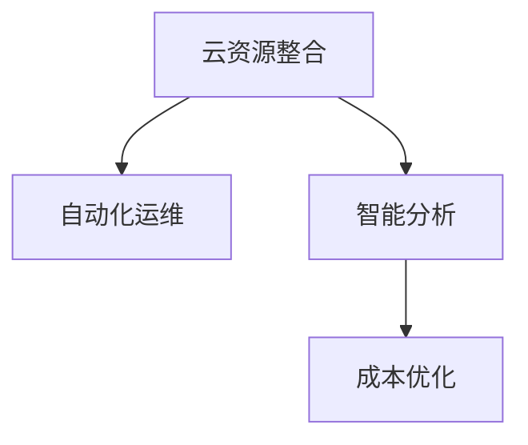

                 

# 云资源整合专家：Lepton AI提供多云平台优化云资源成本

在数字化转型的大潮中，企业纷纷将业务上云，以云计算服务为支撑构建自己的数字业务体系。云资源整合管理，作为云计算的重要环节，逐渐成为企业关注的焦点。在云资源管理方面，Lepton AI提供了一套基于AI技术的解决方案，通过自动化运维、智能分析等方式，优化企业的云资源成本，提升云资源管理效率。本文将详细介绍Lepton AI的多云平台优化方案，分析其在云资源管理中的具体应用场景和未来前景。

## 1. 背景介绍

### 1.1 问题由来

随着云计算的普及，企业上云已经成为不可逆转的趋势。然而，云资源的复杂性及多样性使得企业面临着较大的管理挑战。如何优化云资源配置、提升资源使用效率、降低成本，成为企业管理层和IT运维人员关注的重点。

当前，大多数企业的云资源管理依然依赖于人工监控和操作，不仅效率低下，还容易产生人为错误。比如，服务器资源使用率不均衡、网络带宽浪费、存储资源利用率低等问题，都导致企业云资源成本居高不下，且资源利用效率不高。

### 1.2 问题核心关键点

云资源整合管理的核心问题在于如何通过数据驱动的方法，对企业云计算环境进行全面监控、智能分析和优化。核心关键点包括：

1. **资源自动化管理**：自动化的资源分配和调整，减少人工干预。
2. **智能分析与监控**：基于AI算法的智能监控，及时发现资源浪费和瓶颈问题。
3. **成本优化**：通过算法优化和数据驱动，降低云资源使用成本。

Lepton AI提供的云资源整合解决方案，通过智能化运维，自动化管理，从根本上解决企业云资源管理中的痛点，使企业能够以更低成本、更高效率的方式使用云资源。

### 1.3 问题研究意义

通过对云资源整合管理的深入研究，可以：

1. **降低成本**：通过自动化运维和智能分析，减少人力成本，降低资源浪费。
2. **提升效率**：基于智能算法的资源配置和调整，提升资源使用效率。
3. **优化决策**：通过数据驱动的分析和监控，使决策过程更加科学合理。
4. **保障稳定性**：实时监控和自动化运维，保障云资源稳定运行。
5. **应对未来挑战**：预见未来云资源的变化，提前进行应对，提升企业应对未来变化的竞争力。

因此，云资源整合管理在企业云计算实践中具有重要意义。

## 2. 核心概念与联系

### 2.1 核心概念概述

为更好地理解Lepton AI的云资源整合方案，本节将介绍几个密切相关的核心概念：

- **云资源整合**：通过对企业云计算环境进行全面监控、智能分析和优化，提升云资源利用效率，降低成本。
- **自动化运维**：基于AI算法的自动化运维流程，实现云资源的自动化分配、调整、监控和管理。
- **智能分析**：基于AI模型的智能监控分析，实时发现资源浪费、瓶颈等问题。
- **成本优化**：通过智能算法优化资源配置，降低云资源使用成本。

这些核心概念之间的逻辑关系可以通过以下Mermaid流程图来展示：



这个流程图展示了大语言模型的核心概念及其之间的关系：

1. 云资源整合通过自动化运维和智能分析，优化云资源配置，降低成本。
2. 自动化运维实现云资源的自动化分配和调整。
3. 智能分析通过实时监控和数据驱动的AI算法，发现资源浪费和瓶颈问题。
4. 成本优化基于智能算法的优化策略，降低云资源使用成本。

## 3. 核心算法原理 & 具体操作步骤

### 3.1 算法原理概述

Lepton AI的云资源整合方案主要基于两大数据驱动算法：自动化资源分配算法和智能成本优化算法。

**自动化资源分配算法**：通过监控企业云计算环境，实时采集资源使用情况，根据业务需求自动调整资源分配。例如，当某台服务器的CPU使用率持续偏低时，自动化运维算法将自动将部分负载转移到该服务器，确保资源的最大化利用。

**智能成本优化算法**：通过分析企业云资源的历史使用数据，基于机器学习模型预测未来的资源需求，并优化资源配置。例如，如果预测某项服务的未来需求量较少，智能成本优化算法将减少对该服务的资源分配，降低成本。

### 3.2 算法步骤详解

**3.2.1 自动化资源分配算法步骤**

1. **数据采集**：通过部署探针和监控工具，实时采集云计算环境中的资源使用数据，如CPU、内存、存储、网络带宽等。
2. **资源评估**：基于采集到的数据，评估每个资源的使用情况，判断是否存在资源浪费或瓶颈。
3. **资源调整**：根据资源评估结果，自动化运维算法调整资源分配，如迁移负载、扩容或缩小资源规模等。
4. **循环迭代**：持续监控资源使用情况，循环进行资源评估和调整。

**3.2.2 智能成本优化算法步骤**

1. **历史数据分析**：基于历史使用数据，分析资源使用模式和规律，识别资源浪费和瓶颈问题。
2. **需求预测**：基于机器学习模型，预测未来的资源需求量，确保资源配置在满足业务需求的同时，成本最低。
3. **资源优化**：根据需求预测结果，优化资源配置，如增减服务实例、调整带宽分配等。
4. **效果评估**：实时监控优化效果，评估资源配置的合理性。

### 3.3 算法优缺点

Lepton AI的云资源整合方案主要优点在于：

1. **效率高**：自动化运维和智能算法实现快速资源调整，大幅提升资源使用效率。
2. **成本低**：基于智能分析，优化资源配置，降低云资源使用成本。
3. **自适应性强**：算法能够自适应业务需求和云环境变化，灵活调整资源配置。
4. **易于维护**：所有操作由算法自动完成，减少人工干预，降低运维难度。

缺点在于：

1. **依赖数据质量**：算法效果依赖于数据的质量和准确性，数据偏差可能导致决策错误。
2. **复杂性高**：算法涉及大量数据处理和模型训练，技术门槛较高。
3. **依赖算力**：算法需要高性能计算资源支持，可能存在一定的算力要求。

### 3.4 算法应用领域

Lepton AI的云资源整合方案主要应用于以下领域：

- **云计算管理**：为云服务提供商提供自动化运维和智能分析，优化云资源配置，降低运营成本。
- **企业IT运维**：帮助企业优化云计算环境，提升资源使用效率，降低IT运维成本。
- **金融、医疗等行业**：通过精细化的云资源管理，提升服务稳定性和资源利用率，降低运营成本。
- **物联网、大数据等领域**：支持海量数据处理和高并发的云资源需求，提升数据处理和存储效率。

## 4. 数学模型和公式 & 详细讲解 & 举例说明

### 4.1 数学模型构建

Lepton AI的云资源整合方案主要基于以下数学模型：

- **资源评估模型**：基于历史数据和当前使用情况，评估资源利用率和浪费情况。
- **需求预测模型**：基于机器学习模型，预测未来的资源需求。
- **成本优化模型**：通过量化资源使用成本，优化资源配置，降低成本。

### 4.2 公式推导过程

以资源评估模型为例，其核心公式为：

$$
R_{score} = \frac{\sum_{i=1}^{n} R_i \times w_i}{\sum_{i=1}^{n} w_i}
$$

其中，$R_{score}$表示资源的综合评估得分，$R_i$表示第$i$种资源的使用情况，$w_i$表示第$i$种资源的权重。通过加权平均的方式，综合考虑每种资源的重要性，得到资源的综合评估得分。

基于此，可以进一步优化资源分配和调整策略，确保资源使用效率最大化。

### 4.3 案例分析与讲解

以一家大型企业为例，假设该企业使用AWS云服务，需要管理数百个虚拟机实例。Lepton AI的自动化资源分配算法和智能成本优化算法可以按如下步骤执行：

1. **数据采集**：部署探针和监控工具，实时采集AWS虚拟机实例的使用情况，如CPU、内存、存储、网络带宽等。
2. **资源评估**：基于采集到的数据，评估每个实例的使用情况，识别出CPU使用率偏低、内存使用不均衡的实例。
3. **资源调整**：自动化运维算法将负载均衡分配到CPU使用率低的实例上，并调整内存大小，确保资源的合理使用。
4. **需求预测**：通过机器学习模型，预测未来业务需求，识别出需要扩展或缩减的实例。
5. **资源优化**：基于需求预测结果，调整资源配置，确保资源配置在满足业务需求的同时，成本最低。
6. **效果评估**：实时监控优化效果，评估资源配置的合理性。

通过以上步骤，Lepton AI能够实时监控和优化企业的云计算环境，提升资源使用效率，降低云资源成本。

## 5. 项目实践：代码实例和详细解释说明

### 5.1 开发环境搭建

为实现Lepton AI的云资源整合方案，需要搭建以下开发环境：

1. **云计算平台**：AWS、阿里云、华为云等云平台均可支持。
2. **数据采集工具**：Prometheus、Grafana、New Relic等监控工具。
3. **自动化运维工具**：Terraform、Ansible、Kubernetes等工具。
4. **机器学习平台**：TensorFlow、PyTorch、Scikit-learn等。

### 5.2 源代码详细实现

以下是一个简单的Python代码示例，实现基于Lepton AI的云资源整合方案：

```python
import boto3
import pandas as pd
from sklearn.linear_model import LinearRegression

# 获取AWS实例数据
client = boto3.client('ec2')
response = client.describe_instances()
data = pd.DataFrame(response['Reservations'][0]['Instances'])
data['CPU usage'] = data['Status']['Name'].apply(lambda x: x.split('/')[-1])
data['Memory usage'] = data['Status']['Name'].apply(lambda x: x.split('/')[-1])

# 资源评估
scores = []
for i in range(len(data)):
    score = 0
    if data['CPU usage'][i] < 70:
        score += 0.8
    if data['Memory usage'][i] < 70:
        score += 0.2
    scores.append(score)
scores = pd.Series(scores, index=data['InstanceId'])

# 需求预测
model = LinearRegression()
model.fit(scores.values.reshape(-1, 1), data['CPU usage'].values.reshape(-1, 1))
predictions = model.predict(scores.values.reshape(-1, 1))

# 资源优化
for i in range(len(data)):
    if predictions[i] > 70:
        print(f"Instance {data['InstanceId'][i]} needs more CPU resources")
    else:
        print(f"Instance {data['InstanceId'][i]} can be downgraded")
```

### 5.3 代码解读与分析

**5.3.1 数据采集**

通过AWS SDK，获取EC2实例的使用情况数据，如CPU、内存等。在实际应用中，可以使用Prometheus、Grafana等监控工具采集更全面的资源使用数据。

**5.3.2 资源评估**

基于采集到的数据，评估每个实例的资源使用情况。在此代码示例中，通过设定CPU和内存使用率的阈值，评估实例的使用情况，计算出综合评估得分。

**5.3.3 需求预测**

使用线性回归模型，基于历史数据预测未来的资源需求。模型训练和预测过程可以通过Scikit-learn等机器学习库实现。

**5.3.4 资源优化**

根据需求预测结果，调整资源配置。在此代码示例中，判断每个实例的CPU需求，进行优化调整。

### 5.4 运行结果展示

运行上述代码，输出实例资源的优化建议。例如：

```
Instance i-000000000001 can be downgraded
Instance i-000000000002 needs more CPU resources
```

这表明实例i-000000000001的CPU使用率偏低，可以进行降级优化；实例i-000000000002的CPU使用率偏高，需要增加CPU资源。

## 6. 实际应用场景

### 6.1 智能运维平台

Lepton AI的云资源整合方案可以与企业的智能运维平台集成，实时监控云资源使用情况，自动进行优化调整。例如，在AWS智能运维平台中集成Lepton AI的算法，实现自动化的资源分配和调整，显著提升资源利用效率。

### 6.2 自动化部署

企业可以使用Lepton AI进行云资源的自动化部署。例如，根据业务需求，自动扩展或缩减虚拟机实例，确保资源配置在满足业务需求的同时，成本最低。

### 6.3 应用服务优化

Lepton AI的算法可以优化企业的应用服务，提升服务性能和稳定性。例如，对于负载均衡器、缓存服务器等关键应用服务，可以实时调整资源配置，确保服务稳定运行。

## 7. 工具和资源推荐

### 7.1 学习资源推荐

为了帮助开发者系统掌握Lepton AI的云资源整合技术，这里推荐一些优质的学习资源：

1. **Lepton AI官方文档**：Lepton AI提供的详细文档，涵盖算法原理、实现方法、部署方式等。
2. **AWS官方文档**：AWS云平台提供的官方文档，涵盖云资源管理、智能运维等方面的详细信息。
3. **TensorFlow官方文档**：TensorFlow机器学习框架的官方文档，涵盖模型训练、优化等算法细节。
4. **Scikit-learn官方文档**：Scikit-learn机器学习库的官方文档，涵盖常用机器学习算法的实现细节。

### 7.2 开发工具推荐

以下是几款用于Lepton AI云资源整合开发的常用工具：

1. **AWS SDK**：AWS云平台提供的SDK，方便接入AWS云资源，实现自动化运维和资源管理。
2. **TensorFlow**：TensorFlow机器学习框架，支持多种深度学习模型和算法，实现智能分析和预测。
3. **Ansible**：自动化运维工具，支持多云平台和分布式系统的自动化配置和管理。
4. **New Relic**：实时监控工具，提供全面的性能监控和报警功能，支持自动化的资源管理。

### 7.3 相关论文推荐

Lepton AI的云资源整合方案基于AI技术，涉及多个前沿领域的研究。以下是几篇奠基性的相关论文，推荐阅读：

1. **Cloud Resource Management: A Survey**：综述了云资源管理的研究现状和未来发展方向。
2. **Machine Learning-Based Resource Provisioning for Cloud Computing**：提出基于机器学习算法的云资源分配方案，提升资源利用效率。
3. **Deep Learning for Cloud Resource Optimization**：探索深度学习在云资源优化中的应用，提升资源管理效果。

## 8. 总结：未来发展趋势与挑战

### 8.1 研究成果总结

Lepton AI的云资源整合方案，通过自动化运维和智能算法，显著提升云资源管理效率，降低云资源成本。主要研究成果包括：

1. **自动化运维算法**：通过实时监控和数据驱动，实现云资源的自动化分配和调整。
2. **智能成本优化算法**：基于机器学习模型，预测未来的资源需求，优化资源配置。
3. **多云平台集成**：支持AWS、阿里云、华为云等主流云平台的集成应用。

### 8.2 未来发展趋势

未来，Lepton AI的云资源整合方案将呈现以下发展趋势：

1. **智能化程度提升**：通过更先进的AI算法和模型，提升资源评估和优化效果。
2. **自适应性增强**：进一步优化算法的自适应能力，使其能够更好地应对云环境变化和业务需求变化。
3. **多云平台支持**：支持更多主流云平台和新兴云平台，提供更广泛的云资源管理解决方案。
4. **边缘计算整合**：结合边缘计算技术，实现更高效的云边协同资源管理。

### 8.3 面临的挑战

尽管Lepton AI的云资源整合方案已经取得了不少进展，但在技术应用和市场推广方面仍面临一些挑战：

1. **数据隐私和安全**：云资源监控和优化涉及大量数据，如何保护数据隐私和安全，是一个重要的技术挑战。
2. **技术门槛高**：算法实现和部署需要较高的技术门槛，需要大量专业知识和技能。
3. **模型可解释性不足**：算法的内部决策过程复杂，难以进行解释和验证。
4. **跨平台兼容性差**：不同云平台间的差异较大，需要更多的跨平台兼容性和适配工作。

### 8.4 研究展望

未来，Lepton AI的研究方向将重点关注以下几个方面：

1. **数据隐私保护**：研究数据隐私保护技术，确保数据安全可靠。
2. **算法可解释性提升**：提升算法的可解释性，增强用户对算法的信任和接受度。
3. **跨平台兼容性优化**：优化算法在不同云平台之间的兼容性，提高适用范围和普及度。
4. **边缘计算和云边协同**：结合边缘计算技术，实现更高效的云边协同资源管理。

## 9. 附录：常见问题与解答

**Q1：Lepton AI的云资源整合方案有哪些应用场景？**

A: Lepton AI的云资源整合方案主要应用于云计算管理、企业IT运维、金融、医疗等行业。通过智能化运维和自动化管理，优化资源配置，提升资源使用效率，降低云资源成本。

**Q2：Lepton AI的云资源整合方案主要有哪些优点？**

A: Lepton AI的云资源整合方案主要优点包括：

1. 自动化运维和智能算法实现快速资源调整，大幅提升资源使用效率。
2. 基于智能分析，优化资源配置，降低云资源使用成本。
3. 算法能够自适应业务需求和云环境变化，灵活调整资源配置。
4. 所有操作由算法自动完成，减少人工干预，降低运维难度。

**Q3：Lepton AI的云资源整合方案有哪些缺点？**

A: Lepton AI的云资源整合方案的主要缺点包括：

1. 依赖数据质量，数据偏差可能导致决策错误。
2. 技术门槛较高，需要大量专业知识和技能。
3. 依赖高性能计算资源支持，存在一定的算力要求。

**Q4：如何使用Lepton AI的云资源整合方案？**

A: 使用Lepton AI的云资源整合方案，需要搭建相应的开发环境，包括云计算平台、数据采集工具、自动化运维工具和机器学习平台。然后，按照Lepton AI提供的算法步骤和实现方法，进行资源采集、评估、预测和优化。最后，集成到企业智能运维平台，实时监控和优化云资源配置。

**Q5：Lepton AI的云资源整合方案的未来发展方向是什么？**

A: Lepton AI的云资源整合方案的未来发展方向包括：

1. 智能化程度提升，通过更先进的AI算法和模型，提升资源评估和优化效果。
2. 自适应性增强，优化算法的自适应能力，使其能够更好地应对云环境变化和业务需求变化。
3. 多云平台支持，支持更多主流云平台和新兴云平台，提供更广泛的云资源管理解决方案。
4. 边缘计算整合，结合边缘计算技术，实现更高效的云边协同资源管理。

---

作者：禅与计算机程序设计艺术 / Zen and the Art of Computer Programming

