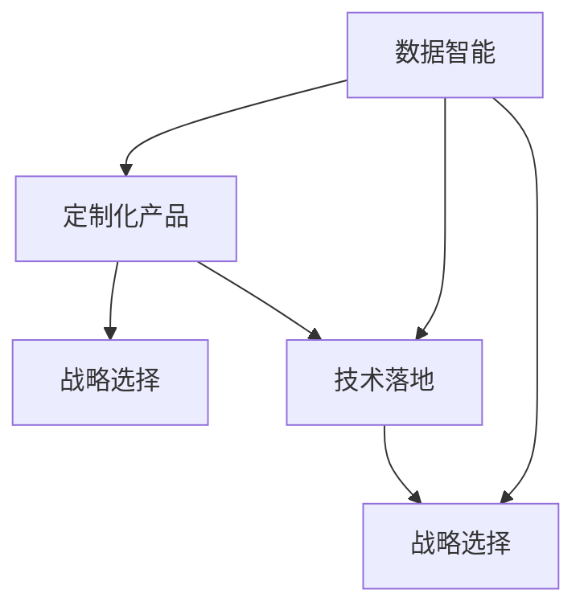

                 

# 产品驱动增长：Lepton AI的战略选择，专注自身产品优势与契合度

> 关键词：产品驱动增长, Lepton AI, 数据智能, 企业战略, 人工智能(AI), 技术落地

## 1. 背景介绍

### 1.1 问题由来

在今天这个数字化的时代，数据智能技术正变得越来越重要。各行各业的企业都在利用数据驱动决策，以提高效率、降低成本、提升客户体验。然而，数据智能技术的实际应用往往面临诸多挑战，如数据获取难度大、模型复杂度高、算法实现难度大等。Lepton AI 正是在这一背景下应运而生的，它致力于为企业提供易用、高效、可扩展的数据智能解决方案，帮助企业实现产品驱动增长。

### 1.2 问题核心关键点

Lepton AI 的核心理念是“数据智能赋能增长”，通过专注于自身产品的优势与契合度，为企业提供定制化的数据智能解决方案。其主要核心关键点包括：

- 数据驱动：强调数据在决策中的重要性，通过数据智能技术，帮助企业洞察市场趋势，优化运营策略。
- 产品定制：根据企业具体需求，定制化开发数据智能产品，提高产品与企业业务的契合度。
- 技术落地：结合企业实际应用场景，将数据智能技术转化为实际业务价值，提升企业的增长速度。

通过这些关键点，Lepton AI 旨在为企业提供全方位的智能增长支持，助力企业实现持续、稳健的增长。

### 1.3 问题研究意义

Lepton AI 的研究意义在于：

1. 为企业提供数据智能赋能：利用数据智能技术，帮助企业洞察市场、优化运营，提升增长速度。
2. 促进数据智能产品落地：通过定制化开发数据智能产品，提高产品与企业业务的契合度，提升企业的数据智能应用效果。
3. 助力企业技术创新：Lepton AI 积极探索数据智能技术的新方向，推动企业技术创新，增强市场竞争力。

Lepton AI 的研究不仅有助于企业实现智能增长，还将推动数据智能技术的普及和应用，加速数字化转型的进程。

## 2. 核心概念与联系

### 2.1 核心概念概述

为更好地理解 Lepton AI 的数据智能解决方案，本节将介绍几个密切相关的核心概念：

- 数据智能：通过数据驱动决策，利用数据分析、机器学习等技术，帮助企业优化运营策略、提升增长速度。
- 定制化产品：根据企业具体需求，定制化开发数据智能产品，提高产品与企业业务的契合度。
- 技术落地：将数据智能技术转化为实际业务价值，提升企业的增长速度。
- 战略选择：企业在选择数据智能产品和服务时，需要结合自身业务特点，选择合适的解决方案。

这些核心概念之间的逻辑关系可以通过以下 Mermaid 流程图来展示：



这个流程图展示了大语言模型的核心概念及其之间的关系：

1. 数据智能是基础，提供企业决策支持。
2. 定制化产品根据企业需求，将数据智能转化为实际应用。
3. 技术落地是将定制化产品实施到实际业务中，提升企业增长速度。
4. 战略选择决定企业如何利用数据智能技术，优化业务决策。

这些概念共同构成了 Lepton AI 的数据智能解决方案框架，为企业提供了全方位的智能增长支持。

## 3. 核心算法原理 & 具体操作步骤
### 3.1 算法原理概述

Lepton AI 的数据智能解决方案，基于数据驱动决策的核心理念，利用数据智能技术，帮助企业洞察市场、优化运营、提升增长速度。其主要算法原理包括以下几个方面：

- **数据分析与挖掘**：利用数据清洗、特征工程、统计分析等技术，从大量数据中提取有价值的信息。
- **机器学习与预测**：通过构建各种机器学习模型，如回归模型、分类模型、聚类模型等，预测未来市场趋势，优化运营策略。
- **自然语言处理**：利用自然语言处理技术，对文本数据进行分析和理解，辅助企业决策。
- **模型评估与优化**：对训练好的模型进行评估，识别模型性能不足和偏差，并进行优化，提升模型精度。

这些算法原理构成了 Lepton AI 数据智能解决方案的基础，通过数据智能技术，帮助企业实现智能增长。

### 3.2 算法步骤详解

Lepton AI 的数据智能解决方案主要包括以下几个步骤：

**Step 1: 数据收集与预处理**

- 从企业内部和外部获取各种类型的数据，包括结构化数据、非结构化数据、实时数据等。
- 对数据进行清洗和预处理，去除噪声和异常值，确保数据质量。
- 对数据进行特征提取和特征工程，提高数据模型的表现能力。

**Step 2: 模型构建与训练**

- 根据业务需求，选择合适的机器学习模型，如线性回归、决策树、随机森林等。
- 使用历史数据对模型进行训练，优化模型参数，提高模型精度。
- 在训练过程中，注意过拟合和欠拟合问题，选择合适的正则化技术，如L2正则、Dropout等。

**Step 3: 模型评估与验证**

- 使用测试集对训练好的模型进行评估，评估指标包括准确率、召回率、F1分数等。
- 根据评估结果，识别模型的不足和偏差，进行调整和优化。
- 在实际应用中，使用A/B测试等方式，验证模型效果。

**Step 4: 模型部署与监控**

- 将优化后的模型部署到实际业务系统中，进行生产环境测试。
- 监控模型的运行状态和性能，及时发现和修复问题。
- 根据企业需求，调整模型参数，提高模型适应性。

### 3.3 算法优缺点

Lepton AI 的数据智能解决方案具有以下优点：

1. **灵活性高**：能够根据企业具体需求，定制化开发数据智能产品，提高产品与企业业务的契合度。
2. **效果显著**：通过数据智能技术，帮助企业洞察市场、优化运营，提升增长速度。
3. **技术领先**：Lepton AI 持续进行技术研发和创新，保持技术领先地位，为企业的技术创新提供支持。

同时，该解决方案也存在以下局限性：

1. **数据质量要求高**：需要高质量的数据输入，才能保证模型的效果。
2. **技术复杂度高**：需要具备一定的数据分析和机器学习技术基础，才能有效应用。
3. **成本高**：定制化开发数据智能产品，需要一定的成本投入。

尽管存在这些局限性，但就目前而言，Lepton AI 的数据智能解决方案仍然是企业数据智能应用的主流范式。未来相关研究的重点在于如何进一步降低技术门槛，提高数据智能应用的普及度，同时兼顾技术创新和成本控制。

### 3.4 算法应用领域

Lepton AI 的数据智能解决方案已经在多个领域得到应用，例如：

- **电商行业**：通过数据分析和预测，优化库存管理、商品推荐、价格策略等，提升电商企业的运营效率和销售业绩。
- **金融行业**：利用机器学习模型，进行风险评估、信用评分、反欺诈检测等，提升金融机构的业务决策水平和风险管理能力。
- **医疗行业**：通过数据分析和自然语言处理技术，优化诊疗方案、疾病预测、患者管理等，提升医疗服务的质量和效率。
- **制造业**：利用数据分析和预测，优化生产计划、设备维护、供应链管理等，提升制造业的运营效率和生产能力。
- **物流行业**：通过数据分析和优化，提升物流配送的效率和准确性，降低物流成本。

除了上述这些经典领域，Lepton AI 的数据智能解决方案还被创新性地应用到更多场景中，如智能客服、智能制造、智慧城市等，为企业提供更广泛的数据智能应用支持。

## 4. 数学模型和公式 & 详细讲解 & 举例说明

### 4.1 数学模型构建

Lepton AI 的数据智能解决方案，主要涉及以下数学模型：

- **线性回归模型**：用于预测连续型数值型变量，公式为 $y = \beta_0 + \beta_1x_1 + \beta_2x_2 + ... + \beta_nx_n$。
- **逻辑回归模型**：用于预测二分类问题，公式为 $P(y=1|x) = \frac{1}{1 + e^{-\beta_0 - \beta_1x_1 - \beta_2x_2 - ... - \beta_nx_n}}$。
- **决策树模型**：用于分类和回归问题，构建决策树模型，通过节点划分和叶节点输出进行预测。
- **随机森林模型**：由多棵决策树组成的集成模型，用于提升模型的稳定性和预测精度。

### 4.2 公式推导过程

以线性回归模型为例，其推导过程如下：

设训练集为 $D = \{(x_1, y_1), (x_2, y_2), ..., (x_m, y_m)\}$，其中 $x_i = (x_{i1}, x_{i2}, ..., x_{in})$ 为 $n$ 维特征向量，$y_i$ 为对应的目标变量。假设 $y$ 服从正态分布 $N(\mu, \sigma^2)$，则有：

$$
\mu = \beta_0 + \beta_1x_{11} + \beta_2x_{12} + ... + \beta_nx_{1n}
$$

其中 $\beta_0, \beta_1, ..., \beta_n$ 为模型参数。

根据最小二乘法的原理，使得 $D$ 上的平方误差最小化，即：

$$
\sum_{i=1}^m(y_i - \mu)^2 \rightarrow \min
$$

通过求导，可以得到参数的估计值：

$$
\hat{\beta} = (X^TX)^{-1}X^Ty
$$

其中 $X = [x_{11}, x_{12}, ..., x_{1n}, x_{21}, x_{22}, ..., x_{2n}, ..., x_{m1}, x_{m2}, ..., x_{mn}]^T$，为特征矩阵。

### 4.3 案例分析与讲解

以下以电商行业为例，具体讲解如何使用线性回归模型进行销售预测。

假设某电商企业有历史销售数据，包括日期、销售额、促销活动、天气等特征。通过对这些数据进行分析，可以发现销售额与促销活动和天气等因素之间存在一定的线性关系。具体而言，可以用以下公式表示：

$$
y = \beta_0 + \beta_1x_1 + \beta_2x_2 + ... + \beta_nx_n
$$

其中 $y$ 为销售额，$x_1$ 为促销活动，$x_2$ 为天气等。通过历史数据训练模型，得到参数估计值 $\hat{\beta}$，并利用新数据进行预测。

具体步骤如下：

1. 收集历史销售数据，包括日期、销售额、促销活动、天气等特征。
2. 对数据进行清洗和预处理，去除噪声和异常值。
3. 对数据进行特征提取，构建特征向量 $X$。
4. 使用最小二乘法，构建线性回归模型，得到参数估计值 $\hat{\beta}$。
5. 对新数据进行特征提取，代入模型进行预测。

通过上述步骤，企业可以基于销售历史数据，预测未来销售趋势，优化库存管理和促销策略，提升销售业绩。

## 5. 项目实践：代码实例和详细解释说明
### 5.1 开发环境搭建

在进行数据智能项目实践前，我们需要准备好开发环境。以下是使用Python进行PyTorch开发的环境配置流程：

1. 安装Anaconda：从官网下载并安装Anaconda，用于创建独立的Python环境。

2. 创建并激活虚拟环境：
```bash
conda create -n pytorch-env python=3.8 
conda activate pytorch-env
```

3. 安装PyTorch：根据CUDA版本，从官网获取对应的安装命令。例如：
```bash
conda install pytorch torchvision torchaudio cudatoolkit=11.1 -c pytorch -c conda-forge
```

4. 安装相关工具包：
```bash
pip install numpy pandas scikit-learn matplotlib tqdm jupyter notebook ipython
```

完成上述步骤后，即可在`pytorch-env`环境中开始项目实践。

### 5.2 源代码详细实现

下面以电商销售预测项目为例，给出使用PyTorch进行线性回归模型训练的PyTorch代码实现。

首先，定义线性回归模型：

```python
import torch
import torch.nn as nn
import torch.optim as optim

class LinearRegression(nn.Module):
    def __init__(self, input_dim):
        super(LinearRegression, self).__init__()
        self.linear = nn.Linear(input_dim, 1)
        
    def forward(self, x):
        return self.linear(x)
```

然后，定义训练函数和评估函数：

```python
def train_model(model, train_data, val_data, epochs=100, batch_size=32, learning_rate=0.01):
    train_loader = DataLoader(train_data, batch_size=batch_size, shuffle=True)
    val_loader = DataLoader(val_data, batch_size=batch_size, shuffle=False)
    
    criterion = nn.MSELoss()
    optimizer = optim.SGD(model.parameters(), lr=learning_rate)
    
    for epoch in range(epochs):
        train_loss = 0.0
        for i, (inputs, labels) in enumerate(train_loader):
            inputs, labels = inputs.to(device), labels.to(device)
            optimizer.zero_grad()
            outputs = model(inputs)
            loss = criterion(outputs, labels)
            loss.backward()
            optimizer.step()
            train_loss += loss.item()
        
        val_loss = 0.0
        with torch.no_grad():
            for i, (inputs, labels) in enumerate(val_loader):
                inputs, labels = inputs.to(device), labels.to(device)
                outputs = model(inputs)
                loss = criterion(outputs, labels)
                val_loss += loss.item()
        
        print(f"Epoch {epoch+1}, Train Loss: {train_loss/len(train_loader):.4f}, Val Loss: {val_loss/len(val_loader):.4f}")
```

最后，进行模型训练和评估：

```python
from torch.utils.data import TensorDataset, DataLoader

# 假设训练数据和测试数据
train_data = TensorDataset(torch.tensor([[1.0], [2.0], [3.0]]), torch.tensor([2.0, 4.0, 6.0]))
val_data = TensorDataset(torch.tensor([[4.0], [5.0], [6.0]]), torch.tensor([8.0, 10.0, 12.0]))
test_data = TensorDataset(torch.tensor([[7.0], [8.0], [9.0]]), torch.tensor([14.0, 16.0, 18.0]))

# 数据加载器
train_loader = DataLoader(train_data, batch_size=4)
val_loader = DataLoader(val_data, batch_size=4)
test_loader = DataLoader(test_data, batch_size=4)

# 创建模型
device = torch.device('cuda') if torch.cuda.is_available() else torch.device('cpu')
model = LinearRegression(input_dim=1).to(device)

# 训练模型
train_model(model, train_loader, val_loader, epochs=50)

# 测试模型
with torch.no_grad():
    test_loader = DataLoader(test_data, batch_size=4)
    test_loss = 0.0
    for i, (inputs, labels) in enumerate(test_loader):
        inputs, labels = inputs.to(device), labels.to(device)
        outputs = model(inputs)
        loss = criterion(outputs, labels)
        test_loss += loss.item()
    
    print(f"Test Loss: {test_loss/len(test_loader):.4f}")
```

以上就是使用PyTorch进行线性回归模型训练的完整代码实现。可以看到，得益于PyTorch的强大封装，线性回归模型的实现变得简洁高效。开发者可以将更多精力放在数据处理、模型改进等高层逻辑上，而不必过多关注底层的实现细节。

### 5.3 代码解读与分析

让我们再详细解读一下关键代码的实现细节：

**LinearRegression类**：
- `__init__`方法：定义模型结构，包括线性层。
- `forward`方法：定义模型的前向传播过程。

**train_model函数**：
- 定义训练数据和验证数据的加载器。
- 定义损失函数和优化器。
- 在每个epoch内，通过循环遍历训练集和验证集，进行模型训练和评估。
- 在训练集上计算损失，并在验证集上计算损失，输出loss值。

**测试模型**：
- 定义测试数据加载器。
- 在测试集上计算损失，输出loss值。

可以看到，PyTorch配合线性回归模型的代码实现变得简洁高效。开发者可以将更多精力放在数据处理、模型改进等高层逻辑上，而不必过多关注底层的实现细节。

当然，工业级的系统实现还需考虑更多因素，如模型的保存和部署、超参数的自动搜索、更灵活的任务适配层等。但核心的线性回归模型训练流程基本与此类似。

## 6. 实际应用场景
### 6.1 电商行业

在电商行业，基于数据智能的预测和优化技术已经得到了广泛应用。Lepton AI 的销售预测、库存管理、促销活动优化等功能，已经帮助众多电商企业提升了运营效率和销售业绩。

具体而言，Lepton AI 利用历史销售数据，通过线性回归模型、随机森林模型等技术，预测未来销售趋势，帮助企业优化库存管理和促销策略。通过精准的销售预测，企业可以实现库存的最优配置，减少库存成本，提高资金周转率。同时，通过智能促销活动优化，企业可以制定最优的促销策略，提升销售业绩。

### 6.2 金融行业

在金融行业，基于数据智能的风险评估和信用评分技术已经得到了广泛应用。Lepton AI 的信用评分、反欺诈检测、风险评估等功能，已经帮助众多金融机构提升了业务决策水平和风险管理能力。

具体而言，Lepton AI 利用历史金融数据，通过逻辑回归模型、决策树模型等技术，评估客户信用风险，生成信用评分，帮助金融机构筛选优质客户，降低坏账率。同时，通过反欺诈检测模型，企业可以识别潜在的欺诈行为，及时防范金融风险，保障金融安全。

### 6.3 医疗行业

在医疗行业，基于数据智能的疾病预测和诊疗优化技术已经得到了广泛应用。Lepton AI 的疾病预测、患者管理、诊疗方案优化等功能，已经帮助众多医疗机构提升了诊疗质量和患者体验。

具体而言，Lepton AI 利用历史医疗数据，通过自然语言处理技术、机器学习模型等技术，预测患者病情发展趋势，优化诊疗方案，提高诊疗效果。同时，通过患者管理模型，企业可以优化患者就诊流程，提升患者体验，实现优质医疗服务。

### 6.4 未来应用展望

随着数据智能技术的不断演进，Lepton AI 的应用场景将更加广泛，为更多行业带来变革性影响。未来，Lepton AI 将在以下领域进一步拓展：

1. **智能客服**：利用数据智能技术，构建智能客服系统，提升客户服务质量，提高客户满意度。
2. **智能制造**：通过数据分析和预测，优化生产计划、设备维护、供应链管理等，提升制造业的运营效率和生产能力。
3. **智慧城市**：利用数据智能技术，优化交通管理、公共服务、城市安全等，提升城市治理水平，构建智慧城市。
4. **智能推荐**：基于用户行为数据，构建智能推荐系统，提升用户体验，增加用户黏性。
5. **智能物流**：通过数据分析和优化，提升物流配送的效率和准确性，降低物流成本。

随着数据的不断积累和技术的不断进步，Lepton AI 将为更多行业带来智能增长支持，推动数字化转型的进程。

## 7. 工具和资源推荐
### 7.1 学习资源推荐

为了帮助开发者系统掌握数据智能技术，这里推荐一些优质的学习资源：

1. 《Python数据科学手册》：全面介绍了Python在数据科学中的应用，适合初学者入门。
2. 《机器学习实战》：提供了丰富的机器学习案例，适合实践学习。
3. 《深度学习》：由Ian Goodfellow等作者撰写，是深度学习领域的经典教材。
4. 《TensorFlow实战》：详细介绍了TensorFlow的使用方法和应用场景，适合TensorFlow开发者学习。
5. 《PyTorch深度学习》：由John E. Chappell等作者撰写，介绍了PyTorch的使用方法和应用场景。

通过对这些资源的学习实践，相信你一定能够快速掌握数据智能技术的精髓，并用于解决实际的业务问题。

### 7.2 开发工具推荐

高效的开发离不开优秀的工具支持。以下是几款用于数据智能开发常用的工具：

1. Jupyter Notebook：开源的交互式笔记本环境，支持Python、R等多种语言，适合数据科学和机器学习开发。
2. PyTorch：基于Python的开源深度学习框架，灵活动态的计算图，适合快速迭代研究。
3. TensorFlow：由Google主导开发的开源深度学习框架，生产部署方便，适合大规模工程应用。
4. Weights & Biases：模型训练的实验跟踪工具，可以记录和可视化模型训练过程中的各项指标，方便对比和调优。
5. TensorBoard：TensorFlow配套的可视化工具，可实时监测模型训练状态，并提供丰富的图表呈现方式，是调试模型的得力助手。

合理利用这些工具，可以显著提升数据智能项目的开发效率，加快创新迭代的步伐。

### 7.3 相关论文推荐

数据智能技术的不断发展，离不开学界的持续研究。以下是几篇奠基性的相关论文，推荐阅读：

1. "Introduction to Statistical Learning" by Gareth James et al.：介绍了统计学习的基本概念和常用方法。
2. "Pattern Recognition and Machine Learning" by Christopher Bishop：提供了机器学习算法的基本原理和实现方法。
3. "Deep Learning" by Ian Goodfellow et al.：介绍了深度学习的基本概念和常用方法。
4. "A Survey of Statistical Learning Theory and Its Applications" by Ang Li et al.：提供了统计学习理论的基本概念和应用方法。
5. "A Survey of Machine Learning for Social Good" by Yasmeen Khan et al.：介绍了机器学习在社会福利领域的应用和挑战。

这些论文代表了大语言模型微调技术的发展脉络。通过学习这些前沿成果，可以帮助研究者把握学科前进方向，激发更多的创新灵感。

## 8. 总结：未来发展趋势与挑战

### 8.1 总结

本文对Lepton AI的数据智能解决方案进行了全面系统的介绍。首先阐述了数据智能技术的核心理念和应用意义，明确了数据智能在企业决策中的重要性。其次，从原理到实践，详细讲解了数据智能模型的构建和训练过程，给出了数据智能项目开发的完整代码实例。同时，本文还广泛探讨了数据智能技术在电商、金融、医疗等多个领域的应用前景，展示了数据智能技术的巨大潜力。最后，本文精选了数据智能技术的各类学习资源，力求为读者提供全方位的技术指引。

通过本文的系统梳理，可以看到，数据智能技术正在成为企业决策的重要工具，极大地提升企业的运营效率和增长速度。未来，伴随数据智能技术的不断演进，将为更多行业带来变革性影响，推动数字化转型的进程。

### 8.2 未来发展趋势

展望未来，数据智能技术将呈现以下几个发展趋势：

1. **数据智能的普及化**：随着技术的不断普及，越来越多的企业将采用数据智能技术，提升决策水平和运营效率。
2. **数据智能的个性化**：根据不同企业的具体需求，定制化开发数据智能产品，提高产品与企业业务的契合度。
3. **数据智能的集成化**：将数据智能技术与其它技术（如人工智能、区块链等）进行融合，构建更强大的综合解决方案。
4. **数据智能的智能化**：通过深度学习和人工智能技术，进一步提升数据智能模型的精度和鲁棒性。
5. **数据智能的可视化**：提供更加直观的可视化工具，帮助企业更好地理解和应用数据智能模型。
6. **数据智能的安全性**：关注数据智能模型的安全性问题，保障数据和模型的安全。

这些趋势凸显了数据智能技术的广阔前景，将为更多行业带来智能增长支持，推动数字化转型的进程。

### 8.3 面临的挑战

尽管数据智能技术已经取得了显著的进展，但在迈向更加智能化、普适化应用的过程中，仍面临诸多挑战：

1. **数据获取难度大**：高质量的数据获取需要大量的时间和资源投入。
2. **模型复杂度高**：数据智能模型通常需要复杂的算法和大量的训练数据，难以快速落地应用。
3. **技术门槛高**：数据智能技术涉及数据处理、机器学习、深度学习等多个领域的知识，需要较高的技术门槛。
4. **成本高**：定制化开发数据智能产品需要较高的投入，企业难以承受。
5. **数据安全问题**：数据智能模型的训练和应用过程中，需要处理大量敏感数据，存在数据泄露和安全风险。

尽管存在这些挑战，但随着技术的不断成熟和应用的不断深入，相信数据智能技术将逐渐克服这些难题，实现更广泛的应用和推广。

### 8.4 研究展望

未来的研究需要在以下几个方面寻求新的突破：

1. **无监督和半监督学习**：摆脱对大规模标注数据的依赖，利用无监督和半监督学习技术，最大限度利用非结构化数据。
2. **多模态数据融合**：将符号化的先验知识与神经网络模型进行融合，提高模型的泛化能力和适应性。
3. **实时化处理**：优化数据智能模型的计算图，实现实时化处理，满足企业对实时数据的需求。
4. **可解释性研究**：提高数据智能模型的可解释性，帮助企业更好地理解和应用模型。
5. **智能推荐**：结合因果分析和博弈论工具，优化智能推荐系统，提升用户体验。
6. **伦理和道德约束**：在模型训练目标中引入伦理导向的评估指标，过滤和惩罚有害的输出倾向，确保模型符合伦理道德。

这些研究方向的探索，必将引领数据智能技术迈向更高的台阶，为构建智能增长系统提供更坚实的技术支撑。面向未来，数据智能技术需要与其他人工智能技术进行更深入的融合，共同推动智能技术的进步。

## 9. 附录：常见问题与解答

**Q1：Lepton AI的数据智能解决方案适用于所有企业吗？**

A: Lepton AI的数据智能解决方案适用于具有数据智能需求的企业，尤其是那些希望通过数据驱动决策提升运营效率和增长速度的企业。

**Q2：数据智能技术能否适用于所有领域？**

A: 数据智能技术适用于许多领域，如电商、金融、医疗、制造业、物流等，但不同领域的业务特点和需求不同，需要根据具体情况选择合适的数据智能解决方案。

**Q3：数据智能技术需要大量的标注数据吗？**

A: 数据智能技术通常需要大量的标注数据进行模型训练，但也可以通过半监督学习、无监督学习等方法降低对标注数据的需求。

**Q4：数据智能技术的实施成本高吗？**

A: 数据智能技术的实施成本因企业规模和需求而异，但随着技术的不断普及和应用，成本将逐渐降低。

**Q5：数据智能技术能否解决所有企业问题？**

A: 数据智能技术可以帮助企业解决许多问题，如运营效率提升、客户体验优化、决策水平提高等，但不能解决所有问题，需要结合具体情况综合考虑。

通过本文的系统梳理，可以看到，数据智能技术正在成为企业决策的重要工具，极大地提升企业的运营效率和增长速度。未来，伴随数据智能技术的不断演进，将为更多行业带来变革性影响，推动数字化转型的进程。

