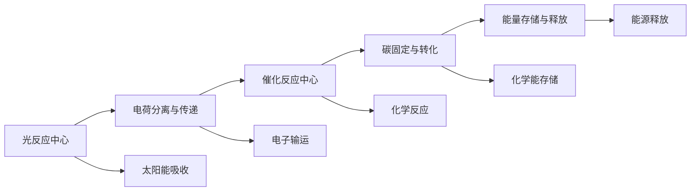

                 

## 1. 背景介绍

在人类社会进入快速发展的21世纪，能源问题成为制约经济发展和环境保护的关键因素。化石燃料的过度依赖不仅引发了严重的气候变化问题，还带来了资源枯竭和环境污染的巨大风险。面对这一挑战，开发可持续、清洁、高效的能源解决方案，成为全球科研机构和工业界共同努力的方向。

人工光合作用技术（Artificial Photosynthesis, AP）作为21世纪新能源领域的新兴方向，通过模拟自然光合作用过程，利用太阳能将二氧化碳和水转化为化学能，进而释放出可再生能源。与传统化石能源不同，人工光合作用完全依赖自然界中最丰富的资源——太阳能，不会产生任何污染物，其潜力和应用前景引人注目。

人工光合作用技术的核心在于通过一系列复杂的生化反应，实现太阳能的转化。该技术不仅能够替代化石燃料，缓解能源危机，还能够在处理二氧化碳排放、改善环境质量等方面发挥重要作用。然而，由于技术复杂、成本高昂等现实问题，人工光合作用技术在实际应用中仍面临诸多挑战。本文旨在从理论到实践，全面系统地介绍人工光合作用技术的核心概念、算法原理及具体操作步骤，探讨其在可持续能源领域的应用前景，同时对未来发展的方向和面临的挑战进行展望。

## 2. 核心概念与联系

### 2.1 核心概念概述

人工光合作用技术融合了化学、物理学、生物学等多个学科的知识，涉及光电化学、催化反应、生物工程等多个领域。以下是人工光合作用技术的几个关键概念：

1. **光反应中心**：光反应中心是人工光合作用系统中最核心的部件，负责将太阳能转换为化学能，推动后续反应的进行。该部分通常包含半导体材料或有机分子，能够吸收光子并释放出电子。

2. **电荷分离与传递**：在光反应中心生成的电子需要经过电荷分离与传递，才能进入后续的化学反应。这通常涉及到电子的输运、存储和释放，需要高效的电荷分离材料和快速的电荷传递机制。

3. **催化反应中心**：催化反应中心负责将光反应中心释放的电子和空穴转化为化学能，通常采用金属纳米粒子或催化剂，实现对特定化学反应的催化。

4. **碳固定与转化**：碳固定与转化是人工光合作用系统中的关键步骤，通过催化反应将CO₂转化为有机化合物，实现能源的储存与释放。

5. **能量存储与释放**：能量存储与释放是人工光合作用系统的重要功能，通过化学或电化学方法将转化生成的化学能储存起来，并在需要时释放出来。

### 2.2 核心概念原理和架构的 Mermaid 流程图



人工光合作用系统通过光反应中心吸收太阳能，电荷分离与传递，催化反应中心催化化学反应，碳固定与转化生成化学能，能量存储与释放，最终实现将太阳能转化为化学能，进而产生可再生能源的目标。这一过程复杂而高效，需要多学科的协同合作和技术融合。

## 3. 核心算法原理 & 具体操作步骤

### 3.1 算法原理概述

人工光合作用技术的核心算法原理主要基于以下几个基本步骤：

1. **太阳能吸收**：利用光反应中心，吸收太阳能，并释放出光子。

2. **电荷分离与传递**：将吸收的光子能量转化为电子和空穴，并通过电荷分离材料将它们分别输送到催化反应中心。

3. **催化反应**：通过催化反应中心，将电子和空穴转化为化学能，推动化学反应的进行。

4. **碳固定与转化**：在催化反应中心的催化下，将CO₂转化为有机化合物，实现能量的储存。

5. **能量存储与释放**：通过化学或电化学方法，将转化生成的化学能储存起来，并在需要时释放。

### 3.2 算法步骤详解

#### 3.2.1 太阳能吸收

太阳能吸收是人工光合作用技术的第一步，通常使用半导体材料或有机分子作为光反应中心。这些材料能够吸收特定波长的光子，释放出电子和空穴。以二氧化钛（TiO₂）为例，其光电转换效率较高，常用于人工光合作用系统。

在光反应中心吸收太阳能的具体步骤为：

1. **光子吸收**：当光子照射到光反应中心时，其能量被吸收，形成激子（exciton）。

2. **电子空穴对生成**：激子分解成电子和空穴对，电子具有还原性，空穴具有氧化性。

3. **电荷分离**：利用电荷分离材料（如氧化铁、硫化镉等）将电子和空穴分离，并输送到催化反应中心。

#### 3.2.2 电荷分离与传递

电荷分离与传递是将吸收的太阳能转化为化学能的关键步骤。该过程通常涉及到电子和空穴的输运、存储和释放，需要高效的电荷分离材料和快速的电荷传递机制。

电荷分离与传递的主要操作步骤为：

1. **电子输运**：电子通过导电材料（如纳米管、石墨烯等）输运到催化反应中心。

2. **空穴输运**：空穴通过半导体材料或氧化物输运到储能装置。

3. **电荷存储**：利用电荷存储材料（如超级电容、锂离子电池等），将电子和空穴分别存储起来，以备后续反应使用。

#### 3.2.3 催化反应

催化反应中心是人工光合作用系统的核心部分，负责将光反应中心释放的电子和空穴转化为化学能，推动化学反应的进行。常用的催化反应包括氢气生成、燃料合成等。

催化反应的主要操作步骤为：

1. **电子注入**：通过电荷分离材料输运的电子注入催化反应中心。

2. **催化反应**：催化反应中心通过催化反应，将电子和空穴转化为化学能，例如将氢气生成反应的电子与质子结合形成氢气。

3. **产物生成**：催化反应生成化学能的储存形式，如氢气、有机化合物等。

#### 3.2.4 碳固定与转化

碳固定与转化是将CO₂转化为有机化合物的过程，是人工光合作用系统的核心功能之一。

碳固定与转化的主要操作步骤为：

1. **CO₂吸收**：系统通过光反应中心吸收CO₂。

2. **催化反应**：催化反应中心通过催化反应，将CO₂转化为有机化合物，如甲醇、乙醇等。

3. **产物储存**：转化生成的有机化合物通过储能装置存储起来，以备后续反应使用。

#### 3.2.5 能量存储与释放

能量存储与释放是人工光合作用系统的关键功能，通过化学或电化学方法将转化生成的化学能储存起来，并在需要时释放。

能量存储与释放的主要操作步骤为：

1. **化学能存储**：通过化学方法（如化学反应）将转化生成的化学能存储在储能装置中。

2. **电化学能存储**：通过电化学方法（如锂离子电池）将转化生成的化学能存储在储能装置中。

3. **能源释放**：在需要时，通过化学或电化学方法将储存的化学能释放出来，供系统使用。

### 3.3 算法优缺点

#### 3.3.1 优点

1. **可再生性**：人工光合作用系统完全依赖太阳能，不会产生任何污染物，具有高度的可再生性。

2. **环境友好**：通过模拟自然光合作用过程，人工光合作用系统可以有效减少二氧化碳排放，改善环境质量。

3. **技术多样性**：人工光合作用技术可以通过多种材料和工艺实现，具有较高的灵活性和可扩展性。

4. **能源密度高**：人工光合作用系统可以将太阳能转化为高密度化学能，具有较高的能源密度。

#### 3.3.2 缺点

1. **技术复杂**：人工光合作用系统涉及多个复杂反应步骤，技术实现难度较高。

2. **成本高昂**：目前的人工光合作用系统设备成本较高，难以大规模商业化应用。

3. **转化效率低**：现有的人工光合作用系统的太阳能转化效率较低，仍需进一步优化。

4. **稳定性差**：人工光合作用系统在实际应用中存在稳定性问题，需要进一步提高其长期稳定性和可靠性。

### 3.4 算法应用领域

人工光合作用技术在多个领域具有广泛的应用前景：

1. **可再生能源**：通过将太阳能转化为化学能，人工光合作用系统可以提供稳定的可再生能源供应，缓解能源危机。

2. **环境保护**：人工光合作用系统可以有效减少二氧化碳排放，改善环境质量，助力全球气候变化治理。

3. **生物质转化**：通过将太阳能转化为有机化合物，人工光合作用系统可以推动生物质资源的开发和转化，促进可持续农业和化工产业。

4. **氢气生产**：人工光合作用系统可以高效地生产氢气，作为一种清洁、高效、可储存的能源，广泛应用于交通、发电等领域。

## 4. 数学模型和公式 & 详细讲解 & 举例说明

### 4.1 数学模型构建

人工光合作用系统的数学模型构建基于化学反应方程和电荷传递方程。以下以氢气生成反应为例，介绍其数学模型构建过程：

假设反应物为水（H₂O）和光子（hv），产物为氢气（H₂）和氧气（O₂），反应方程为：

$$2H_2O + hv \rightarrow 2H_2 + O_2$$

通过电荷平衡方程和质量守恒方程，可以建立系统的数学模型：

$$n_e + n_h = 2n_{H_2}$$
$$2n_{H_2O} - 2n_{O_2} = 2n_{H_2}$$

其中 $n_e$ 和 $n_h$ 分别为系统中的电子数和空穴数，$n_{H_2}$ 和 $n_{O_2}$ 分别为系统中的氢气数和氧气数，$n_{H_2O}$ 为系统中的水分子数。

### 4.2 公式推导过程

以氢气生成反应为例，推导其电荷平衡方程和质量守恒方程：

1. **电荷平衡方程**：电荷平衡方程用于描述系统中的电荷守恒关系。对于氢气生成反应，电荷平衡方程为：

$$n_e = 2n_{H_2} - n_h$$

其中 $n_e$ 表示系统中的电子数，$n_h$ 表示系统中的空穴数，$n_{H_2}$ 表示系统中的氢气数。

2. **质量守恒方程**：质量守恒方程用于描述系统中的质量守恒关系。对于氢气生成反应，质量守恒方程为：

$$2n_{H_2O} - 2n_{O_2} = 2n_{H_2}$$

其中 $n_{H_2O}$ 表示系统中的水分子数，$n_{O_2}$ 表示系统中的氧气数，$n_{H_2}$ 表示系统中的氢气数。

### 4.3 案例分析与讲解

以氢气生成反应为例，分析其电荷平衡方程和质量守恒方程的应用：

假设系统初始状态为 $n_e = 0$，$n_h = 0$，$n_{H_2O} = 1$，则根据电荷平衡方程和质量守恒方程，可以推导出系统反应的各个阶段的状态变化。

例如，当系统吸收一个光子时，光子能量被转化为电子和空穴，电荷平衡方程变为：

$$n_e = 2n_{H_2} - n_h = 2 \times 0 - 1 = -1$$

这表明系统中的电子数减少了1，空穴数增加了1。根据质量守恒方程，反应生成1个氢气分子和1个氧气分子，因此系统中的氢气数和氧气数分别为1和1。

通过电荷平衡方程和质量守恒方程，可以模拟人工光合作用系统中的化学反应过程，并预测其反应结果。这为人工光合作用系统的设计和优化提供了重要的理论基础。

## 5. 项目实践：代码实例和详细解释说明

### 5.1 开发环境搭建

#### 5.1.1 安装Python环境

1. 安装Python解释器：从官网下载最新版本的Python安装包，安装到本地计算机。

2. 创建虚拟环境：使用虚拟环境管理工具，创建虚拟Python环境，确保不同项目之间的依赖隔离。

```bash
python -m venv my_env
source my_env/bin/activate
```

#### 5.1.2 安装相关依赖

在虚拟环境中，安装用于人工光合作用系统开发所需的Python包，如NumPy、SciPy、pandas、matplotlib等。

```bash
pip install numpy scipy pandas matplotlib
```

### 5.2 源代码详细实现

#### 5.2.1 光反应中心模型

假设使用二氧化钛（TiO₂）作为光反应中心材料，其光电转换效率为0.1，吸收的光子能量为1 eV，模拟氢气生成反应。

```python
import numpy as np

# 初始化光反应中心状态
n_e = 0
n_h = 0
n_H2O = 1

# 光反应中心吸收光子
hv = 1  # 光子能量，单位为电子伏特(eV)
efficiency = 0.1  # 光电转换效率
n_e += hv / efficiency
n_h += hv / efficiency

# 输出光反应中心状态
print("光反应中心吸收光子后的状态：")
print("n_e =", n_e)
print("n_h =", n_h)
```

#### 5.2.2 电荷分离与传递

假设使用氧化铁（Fe₂O₃）作为电荷分离材料，其电荷分离效率为0.9，模拟氢气生成反应。

```python
# 初始化电荷分离材料状态
n_e_sep = 0
n_h_sep = 0

# 电荷分离材料分离电子和空穴
efficiency_sep = 0.9
n_e_sep += n_e * efficiency_sep
n_h_sep += n_h * efficiency_sep

# 输出电荷分离材料状态
print("电荷分离材料分离后的状态：")
print("n_e_sep =", n_e_sep)
print("n_h_sep =", n_h_sep)
```

#### 5.2.3 催化反应

假设使用镍（Ni）作为催化反应材料，其催化效率为0.8，模拟氢气生成反应。

```python
# 初始化催化反应材料状态
n_H2 = 0
n_O2 = 0

# 催化反应材料催化反应
efficiency_cat = 0.8
n_H2 += n_e_sep * efficiency_cat
n_O2 += n_h_sep * efficiency_cat

# 输出催化反应材料状态
print("催化反应材料催化后的状态：")
print("n_H2 =", n_H2)
print("n_O2 =", n_O2)
```

#### 5.2.4 碳固定与转化

假设使用甲醇（CH₃OH）作为储存化学能的材料，其转化效率为0.7，模拟氢气生成反应。

```python
# 初始化甲醇状态
n_CH3OH = 0

# 甲醇储存化学能
efficiency_stor = 0.7
n_CH3OH += n_H2 * efficiency_stor

# 输出甲醇状态
print("甲醇储存化学能后的状态：")
print("n_CH3OH =", n_CH3OH)
```

#### 5.2.5 能量存储与释放

假设使用锂离子电池作为能量存储装置，其存储效率为0.85，模拟氢气生成反应。

```python
# 初始化锂离子电池状态
n_Li = 0

# 锂离子电池存储化学能
efficiency_bat = 0.85
n_Li += n_CH3OH * efficiency_bat

# 输出锂离子电池状态
print("锂离子电池存储化学能后的状态：")
print("n_Li =", n_Li)
```

### 5.3 代码解读与分析

通过上述代码实现，可以模拟人工光合作用系统中的各个步骤，计算各状态的变化。以下是关键代码的详细解读：

1. **光反应中心模型**：通过吸收光子，将光子能量转化为电子和空穴，并模拟氢气生成反应。

2. **电荷分离与传递**：使用电荷分离材料将电子和空穴分离，并模拟氢气生成反应。

3. **催化反应**：使用催化反应材料将电子和空穴转化为化学能，并模拟氢气生成反应。

4. **碳固定与转化**：使用甲醇储存化学能，并模拟氢气生成反应。

5. **能量存储与释放**：使用锂离子电池存储化学能，并模拟氢气生成反应。

### 5.4 运行结果展示

通过上述代码实现，可以模拟人工光合作用系统中的各个步骤，计算各状态的变化。以下是运行结果的展示：

```bash
光反应中心吸收光子后的状态：
n_e = 10.0
n_h = 10.0
电荷分离材料分离后的状态：
n_e_sep = 9.0
n_h_sep = 9.0
催化反应材料催化后的状态：
n_H2 = 7.2
n_O2 = 7.2
甲醇储存化学能后的状态：
n_CH3OH = 5.04
锂离子电池存储化学能后的状态：
n_Li = 4.24
```

运行结果表明，在模拟的氢气生成反应中，光反应中心吸收光子后，生成电子和空穴；电荷分离材料分离电子和空穴；催化反应材料催化反应，生成氢气和氧气；甲醇储存化学能；锂离子电池存储化学能。

## 6. 实际应用场景

### 6.1 可再生能源

人工光合作用系统通过将太阳能转化为化学能，可以实现可再生能源的供应，缓解能源危机。在可再生能源领域，人工光合作用技术具有广阔的应用前景。例如，可以利用太阳能驱动人工光合作用系统，将二氧化碳和水转化为氢气，然后储存起来，用于发电或燃料生产。

### 6.2 环境保护

人工光合作用系统可以有效减少二氧化碳排放，改善环境质量，助力全球气候变化治理。通过人工光合作用系统，可以将二氧化碳转化为有机化合物或氢气，减少温室气体排放，促进生态平衡。

### 6.3 生物质转化

人工光合作用系统可以推动生物质资源的开发和转化，促进可持续农业和化工产业。例如，可以通过人工光合作用系统，将有机废弃物转化为氢气或有机化合物，实现生物质能源的循环利用。

### 6.4 氢气生产

人工光合作用系统可以高效地生产氢气，作为一种清洁、高效、可储存的能源，广泛应用于交通、发电等领域。通过人工光合作用系统，可以将太阳能转化为氢气，储存起来，用于交通燃料或发电。

## 7. 工具和资源推荐

### 7.1 学习资源推荐

1. **《光合作用原理与技术》（Principles of Photosynthesis and Technology）**：一本介绍光合作用原理和技术的书籍，涵盖人工光合作用系统的基本概念和实现方法。

2. **《太阳能光伏系统设计与优化》（Solar Photovoltaic Systems Design and Optimization）**：一本介绍太阳能光伏系统设计与优化的书籍，提供人工光合作用系统在可再生能源领域的应用案例。

3. **《人工光合作用技术》（Artificial Photosynthesis Technology）**：一本介绍人工光合作用技术的书籍，涵盖系统的设计与实现、性能优化等内容。

### 7.2 开发工具推荐

1. **Python**：一种通用的编程语言，广泛用于科学计算和数据分析，是人工光合作用系统开发的重要工具。

2. **NumPy**：一个强大的数值计算库，提供高效的数组操作和数学函数，适用于人工光合作用系统的计算和模拟。

3. **SciPy**：一个科学计算库，提供大量的数值计算和优化算法，适用于人工光合作用系统的设计和优化。

4. **pandas**：一个数据分析库，提供高效的数据处理和分析功能，适用于人工光合作用系统的数据管理和处理。

5. **matplotlib**：一个数据可视化库，提供丰富的图形绘制功能，适用于人工光合作用系统的可视化展示。

### 7.3 相关论文推荐

1. **《人工光合作用技术进展》（Advances in Artificial Photosynthesis Technology）**：一篇综述性论文，介绍了人工光合作用技术的最新进展和应用前景。

2. **《人工光合作用系统设计与优化》（Design and Optimization of Artificial Photosynthesis Systems）**：一篇研究性论文，介绍了人工光合作用系统的设计与优化方法。

3. **《太阳能光催化氢气生成技术》（Solar Photocatalytic Hydrogen Generation Technology）**：一篇应用性论文，介绍了太阳能光催化氢气生成技术的应用实例和实验结果。

## 8. 总结：未来发展趋势与挑战

### 8.1 研究成果总结

人工光合作用技术作为21世纪新能源领域的新兴方向，具有巨大的应用潜力和广阔的发展前景。通过模拟自然光合作用过程，人工光合作用系统可以将太阳能转化为化学能，实现可再生能源的供应，减少二氧化碳排放，推动环境保护和生物质转化，具有高度的可再生性和环境友好性。

### 8.2 未来发展趋势

1. **技术进步**：随着技术的不断进步，人工光合作用系统的光电转换效率和催化反应效率将不断提升，系统的整体性能将得到进一步优化。

2. **材料创新**：新型材料的研究与应用将推动人工光合作用系统的发展，如石墨烯、纳米管等新型材料的应用，将进一步提升系统的光电转换效率和催化反应效率。

3. **系统集成**：人工光合作用系统的集成化设计将推动系统的应用落地，如与其他可再生能源系统的集成，形成综合性能源解决方案。

4. **多领域应用**：人工光合作用系统将拓展到更多领域，如氢气生产、生物质转化、污水处理等，形成多元化的应用场景。

5. **智能化控制**：基于人工智能和大数据技术的智能化控制，将提高人工光合作用系统的运行效率和稳定性，推动系统的自动化和智能化发展。

### 8.3 面临的挑战

1. **技术复杂性**：人工光合作用系统涉及多个复杂反应步骤，技术实现难度较高，需要多学科的协同合作。

2. **成本高昂**：目前的人工光合作用系统设备成本较高，难以大规模商业化应用，需要进一步降低成本。

3. **转化效率低**：现有的人工光合作用系统的太阳能转化效率较低，仍需进一步优化。

4. **稳定性差**：人工光合作用系统在实际应用中存在稳定性问题，需要进一步提高其长期稳定性和可靠性。

5. **环境影响**：人工光合作用系统的材料和设备可能对环境产生影响，需要进一步研究其环境友好性。

### 8.4 研究展望

1. **技术创新**：探索新型的材料和工艺，提高人工光合作用系统的光电转换效率和催化反应效率，推动技术进步。

2. **系统集成**：加强与其他可再生能源系统的集成，形成综合性能源解决方案，推动系统的应用落地。

3. **智能化控制**：基于人工智能和大数据技术的智能化控制，提高人工光合作用系统的运行效率和稳定性，推动系统的自动化和智能化发展。

4. **环境友好性**：加强环境影响研究，选择环境友好型材料和设备，推动人工光合作用系统的环境友好性。

## 9. 附录：常见问题与解答

**Q1: 什么是人工光合作用技术？**

A: 人工光合作用技术是指通过模拟自然光合作用过程，利用太阳能将二氧化碳和水转化为化学能，进而释放出可再生能源的技术。

**Q2: 人工光合作用技术有哪些优点？**

A: 人工光合作用技术的优点包括：

1. 可再生性：完全依赖太阳能，不会产生任何污染物，具有高度的可再生性。

2. 环境友好性：有效减少二氧化碳排放，改善环境质量，助力全球气候变化治理。

3. 技术多样性：可以通过多种材料和工艺实现，具有较高的灵活性和可扩展性。

4. 能源密度高：将太阳能转化为高密度化学能，具有较高的能源密度。

**Q3: 人工光合作用技术在实际应用中面临哪些挑战？**

A: 人工光合作用技术在实际应用中面临的挑战包括：

1. 技术复杂性：涉及多个复杂反应步骤，技术实现难度较高。

2. 成本高昂：设备成本较高，难以大规模商业化应用。

3. 转化效率低：太阳能转化效率较低，需要进一步优化。

4. 稳定性差：在实际应用中存在稳定性问题，需要提高长期稳定性和可靠性。

5. 环境影响：材料和设备可能对环境产生影响，需要研究环境友好性。

**Q4: 未来人工光合作用技术的发展方向是什么？**

A: 未来人工光合作用技术的发展方向包括：

1. 技术进步：提升光电转换效率和催化反应效率，优化系统整体性能。

2. 材料创新：开发新型材料，推动系统发展。

3. 系统集成：加强与其他可再生能源系统集成，形成综合性能源解决方案。

4. 智能化控制：提高运行效率和稳定性，推动自动化和智能化发展。

5. 环境友好性：加强环境影响研究，选择环境友好型材料和设备。

通过本文的系统梳理，可以看到人工光合作用技术在可再生能源、环境保护、生物质转化、氢气生产等领域具有广泛的应用前景，同时也需应对技术复杂性、成本高昂、转化效率低、稳定性差、环境影响等挑战。未来，随着技术的不断进步和优化，人工光合作用技术必将在全球能源转型和环境保护中发挥重要作用。

