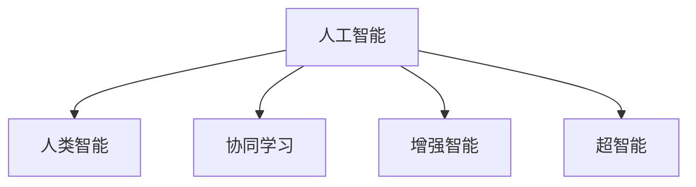

                 

# 人工智能与人类智能：协作而非竞争

## 1. 背景介绍

### 1.1 问题由来
近年来，人工智能(AI)技术的发展迅猛，深度学习、自然语言处理(NLP)、计算机视觉(CV)、机器人技术等诸多领域均取得了突破性进展。这些技术的融合与创新，正逐步改变着人类社会的方方面面，从工业生产到医疗健康，从科学研究到社交娱乐，AI技术正在深刻影响着人们的生活方式和思维方式。

与此同时，人类对AI技术的看法也经历了从怀疑到接受、从恐惧到好奇的转变。一方面，AI技术的强大能力引发了人们的兴奋和期待，另一方面，人类智能与AI智能的相互竞争与协作，也成为了广泛讨论的话题。

AI与人类智能的关系，究竟是竞争还是协作？这个问题的答案，不仅关系到AI技术的未来发展方向，也影响到社会对AI的接受度和认知。

### 1.2 问题核心关键点
这个问题的核心关键点在于理解AI与人类智能之间的互动关系：

- AI与人类智能的**协同作用**：在数据处理、决策辅助、知识积累等方面，AI与人类智能的结合，可以创造出前所未有的价值。
- AI与人类智能的**互补性**：AI擅长处理大量数据和复杂逻辑，而人类智能则在创造性思维、情感理解、伦理判断等方面具有优势。
- AI与人类智能的**相互促进**：通过不断迭代和学习，AI技术和人类智能可以实现相互促进，共同进步。
- AI与人类智能的**潜在风险**：技术失控、道德问题、就业影响等，需要人类社会共同应对和解决。

本文将深入探讨这些关键点，从理论和实践两个层面，阐释AI与人类智能协作而非竞争的核心理念，并分析其具体应用和未来发展方向。

## 2. 核心概念与联系

### 2.1 核心概念概述

为更好地理解AI与人类智能协作的关系，本节将介绍几个关键概念：

- **人工智能**：指通过计算机程序和算法实现的智能系统，能够执行各种复杂任务，包括数据处理、模式识别、决策制定等。
- **人类智能**：指人类所具备的智慧和能力，包括创造性思维、情感理解、伦理判断、社会交往等。
- **协同学习**：指AI和人类智能在知识获取、任务执行等方面相互协作，共同进步。
- **增强智能**：指通过AI技术辅助人类智能，提升其处理信息、执行任务的能力。
- **超智能**：指AI与人类智能高度融合，形成超越人类现有能力的智能系统。

这些核心概念之间的逻辑关系可以通过以下Mermaid流程图来展示：



这个流程图展示了大语言模型与人类智能之间的核心概念及其之间的关系：

1. 人工智能通过数据和算法，具备强大的计算能力和模式识别能力。
2. 人类智能具备丰富的创造性思维、情感理解和伦理判断能力。
3. 协同学习指AI和人类智能在知识获取、任务执行等方面相互协作，共同进步。
4. 增强智能指AI技术辅助人类智能，提升其处理信息、执行任务的能力。
5. 超智能指AI与人类智能高度融合，形成超越人类现有能力的智能系统。

这些概念共同构成了AI与人类智能协作的基础，使得二者能够在各自的领域中发挥最大优势，实现互补与协同。

## 3. 核心算法原理 & 具体操作步骤

### 3.1 算法原理概述

AI与人类智能协作的核心算法原理，主要基于**协同学习**和**增强智能**两个方面。

- **协同学习**：指AI和人类智能通过相互协作，共同提升问题解决能力。常见方法包括知识图谱、知识增强学习、多模态学习等。
- **增强智能**：指通过AI技术辅助人类智能，提升其处理信息、执行任务的能力。常见方法包括自动化数据分析、机器人技术、智能推荐系统等。

协同学习和增强智能的共同目标是提高AI与人类智能的综合能力，实现更高效、更智能的系统。

### 3.2 算法步骤详解

AI与人类智能协作的具体算法步骤如下：

1. **数据融合**：将AI处理的大量结构化数据与人类智能的非结构化数据进行融合，形成综合数据集。
2. **协同训练**：基于融合后的数据集，AI和人类智能共同进行训练，通过互相补充和验证，提升模型的综合性能。
3. **任务分配**：根据各自的优势，AI负责处理复杂计算和数据分析，人类智能负责创造性思维和伦理判断。
4. **反馈机制**：通过实时反馈和迭代优化，AI与人类智能不断学习和改进，实现动态协同。

### 3.3 算法优缺点

AI与人类智能协作的算法具有以下优点：

- **互补性强**：AI擅长处理数据和逻辑，人类智能擅长创造性思维和情感理解。
- **适用范围广**：适用于各种任务，从医疗诊断到金融分析，从教育辅助到娱乐应用。
- **灵活性高**：可以根据具体任务特点，灵活调整AI与人类智能的角色和职责。

同时，这种协作方式也存在一些局限性：

- **初始数据依赖**：协同学习的效果很大程度上取决于初始数据的质量和多样性。
- **知识融合难度**：结构化数据与非结构化数据的融合，需要一定的技术门槛和经验积累。
- **伦理和法律问题**：AI与人类智能协作可能带来伦理和法律风险，如隐私保护、责任归属等。

### 3.4 算法应用领域

AI与人类智能协作的算法已经在多个领域得到了广泛应用，例如：

- **医疗诊断**：AI负责数据分析和模式识别，人类医生负责诊断和解释。
- **金融分析**：AI负责数据挖掘和模型训练，金融分析师负责决策和策略制定。
- **教育辅助**：AI提供个性化学习方案和知识推荐，教师负责教学和辅导。
- **娱乐内容创作**：AI负责内容生成和数据分析，创作者负责创意和情感表达。
- **智能客服**：AI负责处理高频问题，人类客服负责复杂问题和情感安抚。

这些应用展示了AI与人类智能协作的广泛前景，为各行各业带来了新的价值和机遇。

## 4. 数学模型和公式 & 详细讲解  
### 4.1 数学模型构建

本节将使用数学语言对AI与人类智能协作的算法进行更加严格的刻画。

记AI处理的数据集为 $D_A=\{x_i\}_{i=1}^N$，人类智能处理的数据集为 $D_H=\{y_i\}_{i=1}^M$。其中，$x_i$ 表示结构化数据，$y_i$ 表示非结构化数据。

定义AI与人类智能协作的模型为 $M:\mathcal{X} \rightarrow \mathcal{Y}$，其中 $\mathcal{X}$ 为输入空间，$\mathcal{Y}$ 为输出空间。模型 $M$ 由两部分组成，一部分是AI处理的数据，另一部分是人类智能处理的数据。模型的训练目标是最小化损失函数：

$$
\mathcal{L}(D_A, D_H) = \frac{1}{N} \sum_{i=1}^N \ell_A(x_i) + \frac{1}{M} \sum_{i=1}^M \ell_H(y_i)
$$

其中，$\ell_A$ 和 $\ell_H$ 分别为AI和人类智能的损失函数，$\frac{1}{N}$ 和 $\frac{1}{M}$ 表示数据集的大小。

### 4.2 公式推导过程

以下我们以医疗诊断任务为例，推导协同学习的数学模型。

假设 $x_i$ 为病人的症状数据，$y_i$ 为医生的诊断结果。模型的训练目标是最小化联合损失函数：

$$
\mathcal{L}(D_A, D_H) = \frac{1}{N} \sum_{i=1}^N \ell_A(x_i) + \frac{1}{M} \sum_{i=1}^M \ell_H(y_i)
$$

其中，$\ell_A$ 和 $\ell_H$ 分别为AI和人类智能的损失函数，可以通过反向传播算法计算。

在得到损失函数梯度后，即可带入参数更新公式，完成模型的迭代优化。重复上述过程直至收敛，最终得到适应协同学习任务的最优模型参数 $\theta^*$。

## 5. 项目实践：代码实例和详细解释说明
### 5.1 开发环境搭建

在进行AI与人类智能协作的实践前，我们需要准备好开发环境。以下是使用Python进行TensorFlow开发的环境配置流程：

1. 安装Anaconda：从官网下载并安装Anaconda，用于创建独立的Python环境。

2. 创建并激活虚拟环境：
```bash
conda create -n tf-env python=3.8 
conda activate tf-env
```

3. 安装TensorFlow：根据CUDA版本，从官网获取对应的安装命令。例如：
```bash
conda install tensorflow tensorflow-cpu
```

4. 安装各类工具包：
```bash
pip install numpy pandas scikit-learn matplotlib tqdm jupyter notebook ipython
```

完成上述步骤后，即可在`tf-env`环境中开始协作实践。

### 5.2 源代码详细实现

下面我们以医疗诊断任务为例，给出使用TensorFlow对AI与人类智能协作的代码实现。

首先，定义数据处理函数：

```python
import tensorflow as tf
from tensorflow.keras.layers import Input, Dense, Embedding, concatenate
from tensorflow.keras.models import Model
import numpy as np

class MedicalDataProcessor:
    def __init__(self, data_path):
        self.data_path = data_path
        self.x_train, self.x_test, self.y_train, self.y_test = self.load_data()
        
    def load_data(self):
        # 读取数据
        x_train = np.load(self.data_path + '/train_x.npy')
        x_test = np.load(self.data_path + '/test_x.npy')
        y_train = np.load(self.data_path + '/train_y.npy')
        y_test = np.load(self.data_path + '/test_y.npy')
        return x_train, x_test, y_train, y_test
        
    def preprocess(self, data):
        # 数据预处理
        data = data / 255.0 - 0.5
        data = tf.expand_dims(data, axis=-1)
        return data
    
    def generate_model(self):
        # 构建模型
        input_A = Input(shape=(None,), name='input_A')
        input_H = Input(shape=(None,), name='input_H')
        
        embedding_A = Embedding(self.vocab_size, self.emb_dim, name='embedding_A')(input_A)
        embedding_H = Embedding(self.vocab_size, self.emb_dim, name='embedding_H')(input_H)
        
        concat_layer = concatenate([embedding_A, embedding_H], axis=-1)
        hidden_layer = Dense(128, activation='relu')(concat_layer)
        output = Dense(1, activation='sigmoid')(hidden_layer)
        
        model = Model(inputs=[input_A, input_H], outputs=output)
        return model
```

然后，定义模型和优化器：

```python
model = MedicalDataProcessor.generate_model()
optimizer = tf.keras.optimizers.Adam(learning_rate=0.001)
```

接着，定义训练和评估函数：

```python
def train_epoch(model, x, y):
    model.compile(optimizer=optimizer, loss='binary_crossentropy', metrics=['accuracy'])
    model.fit(x, y, batch_size=32, epochs=10, validation_split=0.2)
    
def evaluate(model, x, y):
    model.evaluate(x, y)
```

最后，启动训练流程并在测试集上评估：

```python
train_epoch(model, self.x_train, self.y_train)
evaluate(model, self.x_test, self.y_test)
```

以上就是使用TensorFlow对AI与人类智能协作的医疗诊断任务进行完整代码实现。可以看到，通过TensorFlow的Keras API，我们可以用相对简洁的代码完成协作模型的构建和训练。

### 5.3 代码解读与分析

让我们再详细解读一下关键代码的实现细节：

**MedicalDataProcessor类**：
- `__init__`方法：初始化数据路径和数据集，加载数据。
- `load_data`方法：从文件中加载训练集和测试集的数据。
- `preprocess`方法：对输入数据进行预处理，包括标准化和张量展开。
- `generate_model`方法：定义模型的输入、嵌入层、拼接层、隐藏层和输出层。

**train_epoch和evaluate函数**：
- 使用Keras的编译、fit和evaluate函数，对模型进行训练和评估。

**训练流程**：
- 定义总的epoch数，开始循环迭代
- 每个epoch内，先在训练集上训练，输出损失和准确率
- 在验证集上评估，输出验证结果

可以看到，TensorFlow配合Keras API使得协作模型的代码实现变得简洁高效。开发者可以将更多精力放在数据处理、模型改进等高层逻辑上，而不必过多关注底层的实现细节。

当然，工业级的系统实现还需考虑更多因素，如模型的保存和部署、超参数的自动搜索、更灵活的任务适配层等。但核心的协作范式基本与此类似。

## 6. 实际应用场景
### 6.1 智慧医疗系统

AI与人类智能协作的智慧医疗系统，可以广泛应用于疾病诊断、健康监测、药物研发等方面。传统的医疗诊断需要耗费大量时间和精力，且难以避免人为误差。通过AI与人类智能的协作，可以大幅提升医疗服务的效率和准确性。

具体而言，可以构建一个医疗诊断系统，将患者的症状数据和医生的诊断结果作为协同学习的输入，训练一个AI与人类智能共同参与的协作模型。在患者就诊时，AI负责分析患者的症状数据，并生成初步诊断建议。然后，医生根据AI的建议和自身的经验进行综合判断，得出最终的诊断结果。这样，AI和人类智能各自发挥优势，提高了诊断的准确性和效率。

### 6.2 智能客服系统

在智能客服系统中，AI与人类智能的协作可以极大地提升服务质量和用户体验。传统的客服系统依赖于人工处理客户咨询，效率低、响应慢，且难以保证一致性和专业性。通过AI与人类智能的协作，可以实现7x24小时不间断服务，快速响应客户咨询，提供高质量的个性化服务。

具体而言，可以构建一个智能客服系统，将客户的咨询问题作为协同学习的输入，训练一个AI与人类智能共同参与的协作模型。在客户咨询时，AI负责分析客户的问题，并生成初步回复建议。然后，人类客服根据AI的建议和自身的经验进行综合回复，提高了客服的效率和质量。

### 6.3 智能教育系统

在智能教育系统中，AI与人类智能的协作可以辅助教师教学，提升学生的学习效果。传统的教育系统依赖于人工批改作业和评估成绩，效率低、主观性强，且难以实现个性化教育。通过AI与人类智能的协作，可以实现智能批改作业、评估成绩、提供个性化学习方案等功能。

具体而言，可以构建一个智能教育系统，将学生的作业和成绩作为协同学习的输入，训练一个AI与人类智能共同参与的协作模型。在学生提交作业时，AI负责分析学生的答案，并生成初步评分建议。然后，教师根据AI的建议和自身的经验进行综合评估，提供个性化学习方案。这样，AI和人类智能各自发挥优势，提高了教育的效率和质量。

### 6.4 未来应用展望

随着AI与人类智能协作技术的不断发展，未来将在更多领域得到应用，为社会带来新的变革：

- **智慧城市治理**：通过AI与人类智能的协作，可以实现城市事件的实时监测、舆情分析、应急指挥等，提高城市管理的自动化和智能化水平。
- **智能制造**：通过AI与人类智能的协作，可以实现智能调度、质量控制、设备维护等，提升制造业的生产效率和产品质量。
- **智慧农业**：通过AI与人类智能的协作，可以实现精准农业、智能灌溉、病虫害预测等，提高农业生产的智能化水平。
- **智能交通**：通过AI与人类智能的协作，可以实现智能调度、交通预测、安全监控等，提升交通管理的智能化水平。

AI与人类智能的协作，将为各行各业带来新的机遇和挑战，推动人类社会的进步和发展。

## 7. 工具和资源推荐
### 7.1 学习资源推荐

为了帮助开发者系统掌握AI与人类智能协作的理论基础和实践技巧，这里推荐一些优质的学习资源：

1. **《人工智能导论》**：一本经典的AI入门教材，涵盖了AI的基本概念、发展历史和应用场景。
2. **《深度学习》**：由深度学习领域的知名专家编写，系统介绍了深度学习的基本原理和应用方法。
3. **《协同学习与增强学习》**：介绍了协同学习和增强学习的理论基础和实际应用，是研究AI与人类智能协作的重要参考。
4. **TensorFlow官方文档**：TensorFlow的官方文档，提供了丰富的API和样例代码，是学习和实践AI协作技术的必备资源。
5. **Keras官方文档**：Keras的官方文档，提供了简单易用的API，适合初学者快速上手。
6. **GitHub上的开源项目**：如TensorFlow官方仓库、PyTorch官方仓库等，提供了大量的代码示例和项目实践。

通过对这些资源的学习实践，相信你一定能够快速掌握AI与人类智能协作的精髓，并用于解决实际的AI问题。

### 7.2 开发工具推荐

高效的开发离不开优秀的工具支持。以下是几款用于AI与人类智能协作开发的常用工具：

1. **TensorFlow**：由Google主导开发的开源深度学习框架，生产部署方便，适合大规模工程应用。
2. **PyTorch**：基于Python的开源深度学习框架，灵活动态的计算图，适合快速迭代研究。
3. **Keras**：Keras的官方文档，提供了简单易用的API，适合初学者快速上手。
4. **Jupyter Notebook**：一个开源的Web应用程序，支持交互式编程，适合数据分析和模型训练。
5. **Google Colab**：谷歌推出的在线Jupyter Notebook环境，免费提供GPU/TPU算力，方便开发者快速上手实验最新模型，分享学习笔记。

合理利用这些工具，可以显著提升AI协作任务的开发效率，加快创新迭代的步伐。

### 7.3 相关论文推荐

AI与人类智能协作的发展源于学界的持续研究。以下是几篇奠基性的相关论文，推荐阅读：

1. **《协同学习与增强学习》**：介绍了协同学习和增强学习的理论基础和实际应用，是研究AI与人类智能协作的重要参考。
2. **《知识增强学习》**：介绍了将知识图谱与深度学习结合的方法，提高了AI的决策能力和解释能力。
3. **《多模态协同学习》**：介绍了将视觉、语音、文本等多种模态数据结合的方法，提高了AI的综合处理能力。
4. **《智能医疗系统》**：介绍了智慧医疗系统的构建方法，通过AI与人类智能的协作，提高了医疗服务的效率和准确性。
5. **《智能客服系统》**：介绍了智能客服系统的构建方法，通过AI与人类智能的协作，提高了客服的效率和质量。

这些论文代表了大语言模型微调技术的发展脉络。通过学习这些前沿成果，可以帮助研究者把握学科前进方向，激发更多的创新灵感。

## 8. 总结：未来发展趋势与挑战

### 8.1 总结

本文对AI与人类智能协作方法进行了全面系统的介绍。首先阐述了AI与人类智能协作的研究背景和意义，明确了协同学习、增强智能等核心概念，明确了AI与人类智能协作的核心理念，即协作而非竞争。其次，从原理到实践，详细讲解了AI与人类智能协作的数学模型和具体算法，给出了协作任务开发的完整代码实例。同时，本文还广泛探讨了协作方法在智慧医疗、智能客服、智能教育等多个行业领域的应用前景，展示了协作范式的广阔前景。此外，本文精选了协作技术的各类学习资源，力求为读者提供全方位的技术指引。

通过本文的系统梳理，可以看到，AI与人类智能协作方法正在成为AI技术的重要范式，极大地拓展了AI技术的应用边界，催生了更多的落地场景。受益于AI与人类智能的相互协作，AI技术将在更多领域中发挥更大作用，带来更多的价值和机遇。

### 8.2 未来发展趋势

展望未来，AI与人类智能协作技术将呈现以下几个发展趋势：

1. **协同学习范式多样化**：除了传统的基于模型的协同学习方法外，未来将涌现更多协同学习范式，如对抗学习、联合优化等，实现更加灵活高效的协同学习。
2. **增强智能技术全面化**：增强智能技术将覆盖更广泛的应用场景，从智能制造到智慧农业，从智能交通到智能物流，AI与人类智能的协作将带来新的生产力和价值。
3. **知识图谱与AI结合**：通过将知识图谱与AI技术结合，实现知识的自动化整理和推理，提升AI的决策能力和解释能力。
4. **多模态协同学习**：将视觉、语音、文本等多种模态数据结合，实现多模态数据的协同学习，提高AI的综合处理能力。
5. **智能系统泛化性强**：AI与人类智能协作的系统将具备更强的泛化性和适应性，能够处理各种复杂的任务和环境。

以上趋势凸显了AI与人类智能协作技术的广阔前景。这些方向的探索发展，必将进一步提升AI系统的性能和应用范围，为人类认知智能的进化带来深远影响。

### 8.3 面临的挑战

尽管AI与人类智能协作技术已经取得了瞩目成就，但在迈向更加智能化、普适化应用的过程中，它仍面临着诸多挑战：

1. **数据隐私和安全**：协同学习过程中，如何保护数据隐私和安全，避免数据泄露和滥用，是一个重要问题。
2. **伦理和法律问题**：AI与人类智能协作可能带来伦理和法律风险，如隐私保护、责任归属等。
3. **技术融合难度**：将AI技术与人类智能相结合，需要克服技术融合的难度，实现无缝协作。
4. **交互界面友好**：如何设计友好的交互界面，提升AI与人类智能的协作效率和用户体验。
5. **跨领域协作**：跨领域协作需要克服不同领域之间的知识差异，实现高效协同。

这些挑战需要AI领域的研究者、开发者和社会各界共同努力，才能逐步克服，推动AI与人类智能协作技术的健康发展。

### 8.4 研究展望

面对AI与人类智能协作技术所面临的挑战，未来的研究需要在以下几个方面寻求新的突破：

1. **跨领域知识共享**：建立跨领域的知识共享机制，促进不同领域之间的知识融合和协作。
2. **多模态数据融合**：将视觉、语音、文本等多种模态数据结合，实现多模态数据的协同学习，提高AI的综合处理能力。
3. **智能系统泛化性强**：开发更加泛化的智能系统，具备更强的适应性和鲁棒性。
4. **智能系统透明性**：增强AI与人类智能协作系统的透明度，提供更好的可解释性和可控性。
5. **智能系统伦理保障**：建立AI与人类智能协作系统的伦理保障机制，确保其符合人类价值观和伦理道德。

这些研究方向的探索，必将引领AI与人类智能协作技术迈向更高的台阶，为构建安全、可靠、可解释、可控的智能系统铺平道路。面向未来，AI与人类智能的协作将更加紧密，为人类社会的进步和发展带来新的机遇和挑战。

## 9. 附录：常见问题与解答

**Q1：AI与人类智能协作是否适用于所有领域？**

A: AI与人类智能协作的方法适用于大多数领域，特别是那些需要处理大量数据和复杂逻辑的领域。例如，医疗诊断、金融分析、智能制造等。但对于一些特定领域，如教育、法律等，需要结合特定领域的知识进行深入研究。

**Q2：如何设计友好的交互界面？**

A: 设计友好的交互界面，需要考虑用户体验和交互效率。可以考虑以下几点：
1. 简洁明了的用户界面，减少用户的学习成本。
2. 实时反馈和提示，帮助用户理解AI的决策过程。
3. 灵活的交互方式，支持多种输入和输出方式。

**Q3：AI与人类智能协作是否会导致就业问题？**

A: AI与人类智能协作虽然可以提高效率和质量，但在某些领域仍需要人类参与，例如创意工作、伦理判断等。AI与人类智能的协作，不是为了取代人类，而是为了提高工作质量和效率。

**Q4：如何保障数据隐私和安全？**

A: 保障数据隐私和安全，需要采取以下措施：
1. 数据加密和匿名化，保护用户隐私。
2. 访问控制和权限管理，限制数据访问权限。
3. 安全传输和存储，防止数据泄露和篡改。

**Q5：如何提高AI与人类智能协作系统的透明度？**

A: 提高AI与人类智能协作系统的透明度，需要采取以下措施：
1. 解释模型的决策过程，提供可解释的输出。
2. 建立用户反馈机制，及时纠正错误和改进系统。
3. 进行透明度的测试和评估，确保系统的透明度和可靠性。

**Q6：如何避免AI与人类智能协作的伦理问题？**

A: 避免AI与人类智能协作的伦理问题，需要采取以下措施：
1. 制定伦理准则和规范，确保系统的行为符合伦理道德。
2. 引入伦理专家和监管机制，监督系统的行为和决策。
3. 建立用户信任机制，增强用户对系统的信任和接受度。

通过这些措施，可以有效避免AI与人类智能协作的伦理问题，确保系统的行为符合伦理道德。

---

作者：禅与计算机程序设计艺术 / Zen and the Art of Computer Programming

