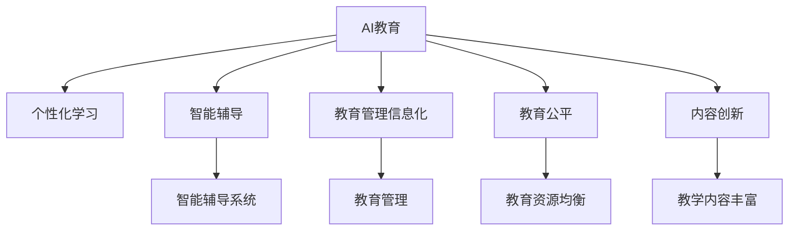

                 

## 1. 背景介绍

### 1.1 问题由来
进入21世纪，人工智能(AI)技术迅猛发展，对社会各行各业产生了深远影响。作为推动科技进步和经济发展的重要力量，教育领域也不例外。随着AI技术的广泛应用，教育模式和教学方法正在发生革命性的变化，传统教育面临巨大挑战。

### 1.2 问题核心关键点
AI在教育中的应用涉及诸多核心关键点，包括：

1. **个性化教学**：通过智能分析学生的学习行为和偏好，提供个性化的学习路径和资源。
2. **智能辅导**：利用AI自动生成评估和反馈，提供精准的辅导建议，帮助学生克服学习难点。
3. **智能管理**：优化学校资源配置和日常管理，提升教育系统的运营效率。
4. **教育公平**：通过AI技术，缩小城乡、区域和贫富差距，实现教育资源的均衡分布。
5. **内容创新**：生成新颖丰富的教学内容，提升学生的学习兴趣和动力。

这些问题共同构成了AI在教育领域的研究和应用方向，旨在通过科技手段优化教育资源，提升教育质量，实现教育公平，推动教育创新。

### 1.3 问题研究意义
AI时代的教育变革，将极大地提升教育质量和效率，打破传统教育的壁垒，促进教育公平，激发学生的创新潜力。AI技术在教育中的应用，将有助于培养符合新时代需求的人才，为社会的发展注入新的活力。

## 2. 核心概念与联系

### 2.1 核心概念概述

为更好地理解AI在教育中的应用，本节将介绍几个密切相关的核心概念：

- **人工智能教育(AI in Education, AIEd)**：利用人工智能技术提升教育水平和学习效果的实践活动。涵盖智能分析、智能辅导、智能管理等多个方面。
- **个性化学习(Adaptive Learning)**：根据学生的学习行为、能力和偏好，动态调整学习内容、路径和资源，满足个性化的学习需求。
- **智能辅导系统(Intelligent Tutoring Systems, ITS)**：通过AI技术自动生成评估和反馈，提供个性化、及时的学习辅导，帮助学生掌握知识。
- **教育管理信息化(EdTech)**：利用AI技术优化学校资源配置、学生管理、教学评估等，提高教育管理效率。
- **教育公平(Education Equity)**：通过AI技术平衡教育资源的分布，缩小城乡、区域和贫富差距，实现教育机会的公平。
- **内容创新(Content Creation)**：利用AI生成丰富的教学资源，包括自动生成的练习题、互动式学习工具等，提升教学内容的趣味性和互动性。

这些核心概念之间的逻辑关系可以通过以下Mermaid流程图来展示：



这个流程图展示了几大核心概念及其之间的关系：

1. AI教育通过个性化学习、智能辅导、教育管理信息化、教育公平和内容创新等多个途径，提升教育质量和学习效果。
2. 个性化学习是AI教育的核心，通过智能分析学生的需求，提供定制化的学习方案。
3. 智能辅导系统利用AI技术，实时提供评估和反馈，帮助学生掌握知识。
4. 教育管理信息化通过优化资源配置和日常管理，提升教育系统的运营效率。
5. 教育公平旨在缩小城乡、区域和贫富差距，实现教育资源的均衡分布。
6. 内容创新通过生成新颖丰富的教学资源，提升学生的学习兴趣和动力。

这些核心概念共同构成了AI在教育领域的实施框架，使得AI技术能够从多个维度推动教育变革。

## 3. 核心算法原理 & 具体操作步骤
### 3.1 算法原理概述

AI在教育中的应用，主要基于机器学习、深度学习和大数据技术。其核心思想是通过对学生学习数据、教学资源和教学过程的深入分析，构建个性化的学习路径，提供智能化的辅导和评估，优化教育资源配置，提升教育公平性和教学内容的创新性。

形式化地，假设教育系统中的学习对象为 $L$，教学资源为 $R$，教学过程为 $P$，学习目标为 $T$。AI系统的目标是通过对 $L$、$R$、$P$ 的深度学习，自动生成学习路径 $LP$、评估策略 $E$ 和教学资源推荐 $RE$，使得学习路径满足学生 $L$ 的学习目标 $T$，同时优化教学过程 $P$ 的效率和公平性。

### 3.2 算法步骤详解

AI在教育中的实施，通常包括以下几个关键步骤：

**Step 1: 数据收集与预处理**
- 收集学生的学习行为数据，包括在线学习记录、作业成绩、参与度等。
- 收集教学资源数据，如教材、习题、视频等。
- 收集教学过程数据，如课堂互动、作业批改、学生反馈等。
- 对数据进行清洗、标注、归一化等预处理，确保数据的质量和一致性。

**Step 2: 特征提取与建模**
- 利用机器学习或深度学习模型，从数据中提取关键特征，如学生的学习风格、知识掌握程度、情感状态等。
- 使用深度学习模型，如神经网络、Transformer等，建立学习路径、评估策略和资源推荐模型。

**Step 3: 个性化学习路径生成**
- 根据学生特征和学习目标，动态生成个性化的学习路径，包括学习内容、顺序、时间和资源等。
- 利用强化学习等方法，不断优化学习路径，提升学习效果和学生满意度。

**Step 4: 智能辅导与评估**
- 利用智能辅导系统，实时分析学生的学习状态，自动生成评估和反馈。
- 结合教师的人工干预，提供精准的辅导建议，帮助学生克服学习难点。

**Step 5: 教育管理与优化**
- 利用AI技术优化学校资源配置和日常管理，如智能排课、考勤管理、课程评估等。
- 通过数据分析，发现教育系统中的瓶颈和问题，提出改进措施，提升教育管理效率。

**Step 6: 教育公平与均衡**
- 利用AI技术，分析教育资源分布的差异，识别影响教育公平的因素。
- 优化教育资源配置，如通过在线教育、远程教育等方式，缩小城乡、区域和贫富差距。

**Step 7: 教学内容创新**
- 利用AI生成新颖丰富的教学资源，如自动生成的练习题、互动式学习工具等。
- 结合教师的经验和创意，不断创新教学内容，提升教学内容的趣味性和互动性。

### 3.3 算法优缺点

AI在教育中的应用，具有以下优点：

1. **个性化学习**：通过数据分析，提供定制化的学习路径和资源，满足不同学生的个性化需求。
2. **智能辅导**：利用AI自动生成评估和反馈，提供精准的辅导建议，帮助学生克服学习难点。
3. **教育管理信息化**：优化学校资源配置和日常管理，提高教育系统的运营效率。
4. **教育公平**：通过AI技术，平衡教育资源的分布，实现教育机会的公平。
5. **内容创新**：利用AI生成丰富的教学资源，提升教学内容的趣味性和互动性。

同时，该方法也存在一定的局限性：

1. **数据隐私**：学生学习数据的隐私保护是一个重要问题，需要采取严格的数据保护措施。
2. **模型偏差**：AI模型可能存在偏见和偏差，需要对其进行公平性评估和校正。
3. **技术门槛**：AI技术的实施需要一定的技术基础和资源投入，可能对中小学校造成一定的挑战。
4. **师生互动**：AI系统无法完全替代教师的作用，师生互动仍然是教育的重要环节。
5. **数据质量**：教育数据的准确性和完整性直接影响AI系统的性能，数据质量需严格保证。

尽管存在这些局限性，但就目前而言，AI在教育中的应用仍是大势所趋。未来相关研究的重点在于如何进一步降低技术门槛，提高数据质量，解决数据隐私问题，以进一步提升AI在教育中的效果和应用范围。

### 3.4 算法应用领域

AI在教育中的应用领域非常广泛，涵盖了从学前教育到高等教育、从基础教育到职业教育等多个层次。以下是几个典型的应用场景：

- **学前教育**：通过智能玩具和互动应用，激发幼儿的学习兴趣，提供个性化的早期教育资源。
- **基础教育**：利用AI分析学生的学习行为和偏好，提供定制化的学习路径和资源，提升课堂教学效果。
- **职业教育**：利用AI生成职业培训课程和模拟场景，提供技能训练和岗位适配，提升职业教育和培训效果。
- **终身学习**：利用AI提供个性化学习建议和资源，支持成人自我提升和职业发展。
- **特殊教育**：利用AI提供针对性的评估和辅导，支持残疾学生和其他有特殊需求的学习者。

## 4. 数学模型和公式 & 详细讲解  
### 4.1 数学模型构建

本节将使用数学语言对AI在教育中的应用进行更加严格的刻画。

假设教育系统中的学习对象为 $L$，教学资源为 $R$，教学过程为 $P$，学习目标为 $T$。定义学习路径为 $LP$，评估策略为 $E$，教学资源推荐为 $RE$。目标是构建一个模型 $M$，使得 $LP(E,L,P,RE)=T$，同时优化 $P$ 的效率和公平性。

数学模型为：

$$
M: L \times R \times P \rightarrow LP \times E \times RE
$$

其中 $LP$、$E$、$RE$ 为输出，分别表示学习路径、评估策略和教学资源推荐。

### 4.2 公式推导过程

以下我们以智能辅导系统的构建为例，推导智能辅导模型的公式及其梯度计算。

假设学生 $L$ 的当前学习状态为 $L_s$，学习目标为 $T_s$，智能辅导系统的目标是通过学习路径 $LP_s$、评估策略 $E_s$ 和资源推荐 $RE_s$，使学生 $L_s$ 达到学习目标 $T_s$，同时优化学习过程 $P_s$。

智能辅导系统的损失函数为：

$$
\ell(M_s, L_s, E_s, RE_s, T_s) = \max_{T_s} [\mathcal{L}_s(T_s|L_s, LP_s, E_s, RE_s)]
$$

其中 $\mathcal{L}_s$ 为学生 $L_s$ 在当前学习路径 $LP_s$、评估策略 $E_s$ 和资源推荐 $RE_s$ 下，达到学习目标 $T_s$ 的可能性。

利用最大似然估计，目标是最小化损失函数：

$$
\mathcal{L}_s(T_s|L_s, LP_s, E_s, RE_s) = -\log P(T_s|L_s, LP_s, E_s, RE_s)
$$

其中 $P(T_s|L_s, LP_s, E_s, RE_s)$ 为学生 $L_s$ 在当前学习路径、评估策略和资源推荐下，达到学习目标 $T_s$ 的概率。

利用神经网络模型，如深度神经网络或长短时记忆网络，可以高效地计算上述概率。具体步骤如下：

1. 将学生 $L_s$ 的当前学习状态 $L_s$ 输入网络，得到学生状态表示 $L_s'$。
2. 利用学习路径 $LP_s$ 和评估策略 $E_s$，生成下一个学习状态 $L_s''$。
3. 利用资源推荐 $RE_s$ 和学生状态表示 $L_s'$，生成下一个学习资源 $R_s'$。
4. 利用生成后的学习状态 $L_s''$ 和资源 $R_s'$，计算学生 $L_s$ 达到学习目标 $T_s$ 的概率 $P(T_s|L_s, LP_s, E_s, RE_s)$。

利用反向传播算法，计算损失函数 $\ell(M_s, L_s, E_s, RE_s, T_s)$ 的梯度，并更新模型参数 $M_s$，从而不断优化智能辅导系统的性能。

## 5. 项目实践：代码实例和详细解释说明
### 5.1 开发环境搭建

在进行AI教育系统的开发前，我们需要准备好开发环境。以下是使用Python进行TensorFlow开发的环境配置流程：

1. 安装Anaconda：从官网下载并安装Anaconda，用于创建独立的Python环境。

2. 创建并激活虚拟环境：
```bash
conda create -n aiedu-env python=3.8 
conda activate aiedu-env
```

3. 安装TensorFlow：根据CUDA版本，从官网获取对应的安装命令。例如：
```bash
conda install tensorflow -c pytorch -c conda-forge
```

4. 安装各类工具包：
```bash
pip install numpy pandas scikit-learn matplotlib tqdm jupyter notebook ipython
```

完成上述步骤后，即可在`aiedu-env`环境中开始AI教育系统的开发。

### 5.2 源代码详细实现

下面我们以智能辅导系统的开发为例，给出使用TensorFlow进行AI教育开发的PyTorch代码实现。

首先，定义智能辅导系统的输入和输出：

```python
import tensorflow as tf
from tensorflow.keras.layers import Input, Dense, LSTM

# 定义输入
input_student = Input(shape=(10,), name='input_student')
input_target = Input(shape=(1,), name='input_target')
input_path = Input(shape=(10,), name='input_path')
input_strategy = Input(shape=(10,), name='input_strategy')
input_resource = Input(shape=(10,), name='input_resource')

# 定义输出
output_student = Dense(10, activation='relu', name='output_student')
output_path = Dense(10, activation='relu', name='output_path')
output_strategy = Dense(10, activation='relu', name='output_strategy')
output_resource = Dense(10, activation='relu', name='output_resource')

# 定义模型
model = tf.keras.Model(inputs=[input_student, input_target, input_path, input_strategy, input_resource],
                      outputs=[output_student, output_path, output_strategy, output_resource])

# 编译模型
model.compile(loss='mse', optimizer='adam')
```

然后，定义模型训练函数：

```python
def train_model(model, train_data, epochs=100, batch_size=32):
    model.fit(train_data, epochs=epochs, batch_size=batch_size)
```

接着，定义模型评估函数：

```python
def evaluate_model(model, test_data):
    test_loss, test_acc = model.evaluate(test_data)
    print(f'Test accuracy: {test_acc:.2f}')
```

最后，启动训练流程并在测试集上评估：

```python
epochs = 10
batch_size = 32

train_data = ... # 准备训练数据
test_data = ... # 准备测试数据

model = ... # 构建智能辅导系统模型
train_model(model, train_data, epochs, batch_size)

evaluate_model(model, test_data)
```

以上就是使用TensorFlow进行智能辅导系统开发的完整代码实现。可以看到，得益于TensorFlow的强大封装，我们可以用相对简洁的代码完成模型构建和训练。

### 5.3 代码解读与分析

让我们再详细解读一下关键代码的实现细节：

**模型定义**：
- `Input` 定义模型的输入，包括学生状态、目标、路径、策略和资源。
- `Dense` 定义模型的输出，包括学生状态表示、路径、策略和资源表示。
- `tf.keras.Model` 定义完整的智能辅导系统模型。

**模型编译**：
- 使用均方误差损失函数 `mse`，Adam优化器进行模型编译。

**模型训练**：
- 使用 `fit` 方法进行模型训练，设置训练轮数和批大小。

**模型评估**：
- 使用 `evaluate` 方法评估模型在测试集上的性能。

**训练流程**：
- 定义训练轮数和批大小，准备训练数据和测试数据。
- 构建智能辅导系统模型。
- 使用 `train_model` 函数进行模型训练。
- 使用 `evaluate_model` 函数在测试集上评估模型性能。

可以看到，TensorFlow提供了强大的模型构建和训练功能，使得AI教育系统的开发变得更加便捷高效。

当然，工业级的系统实现还需考虑更多因素，如模型的保存和部署、超参数的自动搜索、更灵活的任务适配层等。但核心的AI教育模型基本与此类似。

## 6. 实际应用场景
### 6.1 智能辅导系统

智能辅导系统是AI在教育中应用最为广泛的场景之一。通过智能辅导系统，学生可以随时随地获取个性化的学习建议和资源，提升学习效果。

在技术实现上，可以收集学生的学习行为数据，如在线学习记录、作业成绩、参与度等，利用AI模型进行分析和建模。模型可以输出学生的学习路径、评估策略和资源推荐，实时提供个性化的辅导建议。对于复杂的学习问题，系统还可以接入教师的人工干预，综合提供精准的辅导服务。

### 6.2 教育公平

教育公平是AI在教育中应用的另一个重要方向。通过AI技术，可以实现教育资源的均衡分布，缩小城乡、区域和贫富差距。

在技术实现上，可以收集不同地区、不同学校的教育数据，利用AI模型进行分析和建模。模型可以识别影响教育公平的关键因素，如教师资质、教育资源、学生家庭背景等，提出改进措施，优化教育资源的配置。例如，可以通过在线教育、远程教育等方式，将优质教育资源传递到偏远地区，提升教育公平性。

### 6.3 教学内容创新

AI在教育中的应用，不仅限于个性化学习和智能辅导，还可以用于教学内容的创新。利用AI生成新颖丰富的教学资源，提升教学内容的趣味性和互动性。

在技术实现上，可以收集不同学科的教学数据，利用AI模型进行分析和建模。模型可以生成自动生成的练习题、互动式学习工具等，增强教学内容的趣味性和互动性。同时，还可以结合教师的经验和创意，不断创新教学内容，提升学生的学习兴趣和动力。

### 6.4 未来应用展望

随着AI技术的不断进步，基于AI的教育应用将进一步扩展，带来更加智能、高效、公平的教育模式。

在智能辅导方面，未来的智能辅导系统将更加个性化、智能化，能够实时分析学生的学习状态和需求，提供精准的辅导建议。同时，智能辅导系统还将具备自适应学习能力，根据学生的反馈不断优化评估策略和资源推荐，提升学习效果。

在教育公平方面，未来的AI系统将能够深入分析教育资源分布的差异，提出更有效的改进措施，实现教育机会的公平。例如，通过智能排课系统优化教师资源配置，通过智能评估系统实时监控教育质量，提升教育系统的公平性。

在教学内容创新方面，未来的AI系统将能够生成更加丰富、多样、有趣的学习资源，提升教学内容的趣味性和互动性。同时，AI系统还将具备自适应生成能力，根据学生的学习进度和兴趣，动态生成个性化的学习资源。

## 7. 工具和资源推荐
### 7.1 学习资源推荐

为了帮助开发者系统掌握AI在教育中的应用理论基础和实践技巧，这里推荐一些优质的学习资源：

1. 《AI in Education: Fundamentals and Applications》系列博文：由AI教育领域的专家撰写，深入浅出地介绍了AI在教育中的应用，包括个性化学习、智能辅导、教育管理等。

2. CS223《AI in Education》课程：斯坦福大学开设的AI教育明星课程，有Lecture视频和配套作业，带你入门AI在教育中的应用。

3. 《AI for Education》书籍：详细介绍了AI在教育中的各种应用场景，从数据收集、模型构建到实际部署，适合进阶学习。

4. AI in Education official website：提供了丰富的教育AI案例、论文和资源，是学习AI教育的绝佳平台。

5. TED-Ed教育视频：通过丰富的教育视频，展示了AI在教育中的实际应用案例，直观感受AI技术带来的变革。

通过对这些资源的学习实践，相信你一定能够快速掌握AI在教育中的应用精髓，并用于解决实际的AI教育问题。

### 7.2 开发工具推荐

高效的开发离不开优秀的工具支持。以下是几款用于AI教育系统开发的常用工具：

1. TensorFlow：由Google主导开发的开源深度学习框架，生产部署方便，适合大规模工程应用。可以用于构建各种类型的AI教育模型。

2. PyTorch：基于Python的开源深度学习框架，灵活动态的计算图，适合快速迭代研究。适合用于构建智能辅导系统等教育模型。

3. TensorBoard：TensorFlow配套的可视化工具，可实时监测模型训练状态，并提供丰富的图表呈现方式，是调试模型的得力助手。

4. Weights & Biases：模型训练的实验跟踪工具，可以记录和可视化模型训练过程中的各项指标，方便对比和调优。与主流深度学习框架无缝集成。

5. Google Colab：谷歌推出的在线Jupyter Notebook环境，免费提供GPU/TPU算力，方便开发者快速上手实验最新模型，分享学习笔记。

合理利用这些工具，可以显著提升AI教育系统的开发效率，加快创新迭代的步伐。

### 7.3 相关论文推荐

AI在教育中的应用涉及多个前沿研究方向，以下是几篇奠基性的相关论文，推荐阅读：

1. 《Adaptive Learning with Neurosynaptic Systems》：提出了基于神经网络的学习路径生成方法，通过智能分析学生的学习行为，提供个性化的学习路径和资源。

2. 《Personalized Education Technologies: A Review and Future Directions》：详细综述了个性化教育技术的发展现状和未来趋势，探讨了AI在个性化学习中的应用。

3. 《Artificial Intelligence for Fair Education》：提出了利用AI技术提升教育公平性的方法，包括智能排课、在线教育等。

4. 《Intelligent Tutoring Systems: An Overview of History, Models, and Future Directions》：详细介绍了智能辅导系统的历史、模型和未来发展方向，是了解智能辅导系统的必读书籍。

5. 《Content Generation with Artificial Intelligence: Current Trends and Future Directions》：探讨了利用AI生成新颖丰富的教学内容的方法，如自动生成的练习题、互动式学习工具等。

这些论文代表了大语言模型微调技术的发展脉络。通过学习这些前沿成果，可以帮助研究者把握学科前进方向，激发更多的创新灵感。

## 8. 总结：未来发展趋势与挑战
### 8.1 总结

本文对AI在教育中的应用进行了全面系统的介绍。首先阐述了AI在教育中的研究背景和应用意义，明确了AI在教育变革中的重要价值。其次，从原理到实践，详细讲解了AI教育的核心概念和关键步骤，给出了AI教育系统的完整代码实例。同时，本文还广泛探讨了AI在教育中的多种应用场景，展示了AI技术的广泛潜力。

通过本文的系统梳理，可以看到，AI在教育中的应用正引领教育模式的深刻变革，极大地提升了教育质量和学习效果，缩小了教育资源的不公平分布，提升了教学内容的趣味性和互动性。AI技术在教育中的应用，为培养适应新时代需求的人才，推动教育公平，提升教育效率，提供了新的路径和机遇。

### 8.2 未来发展趋势

展望未来，AI在教育中的应用将呈现以下几个发展趋势：

1. **个性化学习**：通过更深入的数据分析和更智能的模型构建，提供更加个性化的学习路径和资源，满足不同学生的学习需求。
2. **智能辅导系统**：未来的智能辅导系统将更加智能化、自适应化，能够实时分析学生的学习状态和需求，提供精准的辅导建议。
3. **教育公平**：AI技术将进一步缩小城乡、区域和贫富差距，实现教育资源的均衡分布，提升教育公平性。
4. **教学内容创新**：利用AI生成更多新颖、丰富、有趣的学习资源，提升教学内容的趣味性和互动性。
5. **多模态教育**：将语音、视频、图像等多模态数据与文本数据结合，提供更加立体、全面的教育体验。
6. **终身学习**：利用AI技术，构建终身学习平台，支持成人自我提升和职业发展，实现人人皆可学习的目标。

以上趋势凸显了AI在教育领域的广阔前景。这些方向的探索发展，必将进一步提升教育质量和学习效果，实现教育公平，推动教育创新。

### 8.3 面临的挑战

尽管AI在教育中的应用已经取得了显著成效，但在迈向更加智能化、普适化应用的过程中，仍面临诸多挑战：

1. **数据隐私**：学生学习数据的隐私保护是一个重要问题，需要采取严格的数据保护措施。
2. **模型偏差**：AI模型可能存在偏见和偏差，需要对其进行公平性评估和校正。
3. **技术门槛**：AI技术的实施需要一定的技术基础和资源投入，可能对中小学校造成一定的挑战。
4. **师生互动**：AI系统无法完全替代教师的作用，师生互动仍然是教育的重要环节。
5. **数据质量**：教育数据的准确性和完整性直接影响AI系统的性能，数据质量需严格保证。

尽管存在这些挑战，但随着技术的不断进步和应用的广泛推广，AI在教育中的效果和应用范围必将进一步提升。未来相关研究的重点在于如何进一步降低技术门槛，提高数据质量，解决数据隐私问题，以进一步提升AI在教育中的效果和应用范围。

### 8.4 研究展望

面对AI在教育中面临的挑战，未来的研究需要在以下几个方面寻求新的突破：

1. **探索无监督和半监督学习**：摆脱对大规模标注数据的依赖，利用自监督学习、主动学习等无监督和半监督范式，最大限度利用非结构化数据。
2. **研究参数高效和计算高效的微调范式**：开发更加参数高效的微调方法，在固定大部分预训练参数的同时，只更新极少量的任务相关参数。同时优化微调模型的计算图，减少前向传播和反向传播的资源消耗。
3. **融合因果和对比学习范式**：通过引入因果推断和对比学习思想，增强AI系统建立稳定因果关系的能力，学习更加普适、鲁棒的语言表征。
4. **引入更多先验知识**：将符号化的先验知识，如知识图谱、逻辑规则等，与神经网络模型进行巧妙融合，引导AI系统学习更准确、合理的语言模型。同时加强不同模态数据的整合，实现视觉、语音等多模态信息与文本信息的协同建模。
5. **结合因果分析和博弈论工具**：将因果分析方法引入AI系统，识别出系统决策的关键特征，增强输出解释的因果性和逻辑性。借助博弈论工具刻画人机交互过程，主动探索并规避系统的脆弱点，提高系统稳定性。
6. **纳入伦理道德约束**：在模型训练目标中引入伦理导向的评估指标，过滤和惩罚有偏见、有害的输出倾向。同时加强人工干预和审核，建立模型行为的监管机制，确保输出符合人类价值观和伦理道德。

这些研究方向的探索，必将引领AI在教育中的应用迈向更高的台阶，为构建安全、可靠、可解释、可控的智能教育系统铺平道路。面向未来，AI在教育中的应用还需要与其他人工智能技术进行更深入的融合，如知识表示、因果推理、强化学习等，多路径协同发力，共同推动教育模式的进步。只有勇于创新、敢于突破，才能不断拓展AI教育的应用边界，让智能技术更好地造福教育事业。

## 9. 附录：常见问题与解答

**Q1：AI在教育中的应用是否适用于所有学科？**

A: AI在教育中的应用不仅限于文科、理科等传统学科，还包括艺术、体育等学科。AI技术可以帮助教师进行个性化教学设计，提供定制化的学习资源，提升教学效果。

**Q2：如何评估AI教育系统的性能？**

A: AI教育系统的性能评估可以从多个方面进行，包括学习效果、学习效率、学生满意度等。常见的评估指标包括学业成绩提升、学习时间减少、学生反馈评分等。

**Q3：AI教育系统的实施需要哪些资源？**

A: AI教育系统的实施需要一定的技术基础和资源投入，包括高性能计算设备、数据收集和处理工具、教师和学生的配合等。学校可以根据实际情况，逐步引入和优化AI教育系统。

**Q4：AI教育系统如何平衡个性化与普适性？**

A: AI教育系统需要在个性化与普适性之间找到平衡点。通过设定个性化的学习路径和资源，满足不同学生的学习需求，同时保持整体学习目标的一致性。教师和系统可以协同工作，综合考虑学生的个性化需求和整体学习目标。

**Q5：AI教育系统如何应对数据隐私问题？**

A: 数据隐私是AI教育系统中一个重要问题。可以通过数据匿名化、加密存储、访问控制等技术手段，保障学生学习数据的隐私和安全。同时，可以与家长和学生签订隐私协议，确保数据使用的透明度和合法性。

通过本文的系统梳理，可以看到，AI在教育中的应用正引领教育模式的深刻变革，极大地提升了教育质量和学习效果，缩小了教育资源的不公平分布，提升了教学内容的趣味性和互动性。AI技术在教育中的应用，为培养适应新时代需求的人才，推动教育公平，提升教育效率，提供了新的路径和机遇。随着技术的不断进步和应用的广泛推广，AI在教育中的效果和应用范围必将进一步提升。

总之，AI在教育中的应用是大势所趋，但同时也面临着数据隐私、模型偏差、技术门槛等诸多挑战。未来相关研究的重点在于如何进一步降低技术门槛，提高数据质量，解决数据隐私问题，以进一步提升AI在教育中的效果和应用范围。只有勇于创新、敢于突破，才能不断拓展AI教育的应用边界，让智能技术更好地造福教育事业。

---

作者：禅与计算机程序设计艺术 / Zen and the Art of Computer Programming

