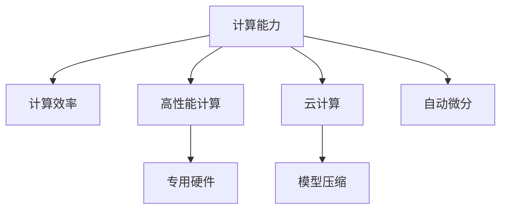

                 

# 人工智能的未来：计算资源的争夺

> 关键词：人工智能, 计算资源, 计算能力, 计算效率, 高性能计算, 云计算, 未来发展趋势

## 1. 背景介绍

### 1.1 问题由来

随着人工智能(AI)技术的飞速发展，计算资源的争夺愈发激烈。近年来，深度学习、机器学习等AI技术在图像识别、自然语言处理、语音识别、自动驾驶等领域取得了令人瞩目的成果。然而，这些技术的背后，都离不开对计算资源的巨大需求。算力瓶颈成为制约AI技术发展的关键因素。

深度学习模型通常包含数十亿个参数，其训练和推理过程消耗的计算资源巨大。以训练ImageNet数据集为例，需要耗费数千个GPU天，对计算资源的要求极高。如何在有限的计算资源下，提升AI模型的训练效率和推理性能，成为了当前研究的一个重要课题。

### 1.2 问题核心关键点

当前，计算资源的争夺主要集中在以下几个方面：

- **数据中心：** 数据中心是AI技术计算资源的主要载体。互联网巨头如Google、Amazon、Microsoft等，通过建设大规模数据中心，掌握了海量的计算资源。
- **云计算平台：** 云计算平台如AWS、Google Cloud、Azure等，通过提供弹性计算资源，降低了企业对自有数据中心的依赖，显著提升了计算资源的利用效率。
- **专用硬件：** 专用硬件如GPU、TPU、FPGA等，通过优化硬件结构，实现了对特定类型计算任务的加速。
- **网络优化：** 网络优化技术如TensorFlow、PyTorch等深度学习框架，通过分布式计算、自动微分、模型压缩等手段，显著提高了模型训练和推理的效率。

这些关键技术的发展，使得AI技术对计算资源的需求得以不断满足，也为未来AI技术的进一步发展奠定了基础。

## 2. 核心概念与联系

### 2.1 核心概念概述

为了更好地理解计算资源争夺的原理和架构，本节将介绍几个密切相关的核心概念：

- **计算能力(Computing Power)**：指系统能够处理计算任务的能力，通常以每秒执行浮点运算的次数（FLOPS）来衡量。
- **计算效率(Computing Efficiency)**：指在一定计算资源下，系统完成计算任务的速度。通常包括时间效率和空间效率两方面。
- **高性能计算(High Performance Computing, HPC)**：指使用高性能计算机、专用硬件等，大幅提升计算能力和效率的计算模式。
- **云计算(Cloud Computing)**：指通过互联网提供动态可伸缩的计算资源，以按需服务的方式供用户使用的计算模式。
- **模型压缩(Compression)**：指通过减少模型参数量和计算量，降低模型训练和推理资源消耗的技术。
- **自动微分(Automatic Differentiation)**：指使用数学方法自动求导，加速模型训练的计算过程。

这些核心概念之间的逻辑关系可以通过以下Mermaid流程图来展示：



这个流程图展示了一些关键概念及其之间的关系：

1. 计算能力决定系统的计算效率，是衡量系统性能的基础。
2. 高性能计算通过专用硬件等技术手段，进一步提升计算能力。
3. 云计算提供了弹性的计算资源，提高了计算资源的利用效率。
4. 模型压缩技术可以减小模型体积和计算量，提升计算效率。
5. 自动微分技术可以大幅简化模型训练过程，提高训练效率。

## 3. 核心算法原理 & 具体操作步骤
### 3.1 算法原理概述

计算资源的争夺本质上是计算效率和计算能力之间的竞争。在有限计算资源下，如何高效利用计算资源，提升系统性能，是当前计算资源争夺的主要目标。

一般而言，计算资源争夺的策略包括以下几个方面：

1. **分布式计算**：通过将任务划分为多个子任务，并在多个计算节点上并行执行，来提升计算能力。
2. **模型压缩**：通过减少模型参数量和计算量，来降低计算资源消耗。
3. **自动微分**：通过使用高效的自动微分技术，来减少计算资源消耗。
4. **网络优化**：通过使用优化后的深度学习框架，来提高计算效率。

这些策略相互配合，可以大幅提升计算资源的利用效率，满足日益增长的AI计算需求。

### 3.2 算法步骤详解

基于上述策略，计算资源的争夺一般包括以下几个关键步骤：

**Step 1: 数据准备与预处理**
- 收集和准备所需的数据集，进行数据清洗和预处理，生成训练集、验证集和测试集。
- 针对数据规模，选择合适的存储和传输方式，如分布式文件系统、GPU内存映射等。

**Step 2: 模型设计**
- 选择适合的深度学习模型结构，如卷积神经网络(CNN)、循环神经网络(RNN)、Transformer等。
- 设计合适的损失函数和优化算法，如交叉熵损失、Adam、SGD等。

**Step 3: 分布式计算与资源调度**
- 使用分布式计算框架，如TensorFlow、PyTorch等，将计算任务划分为多个子任务。
- 将子任务调度到多个计算节点上进行并行计算，提高计算能力。

**Step 4: 模型压缩与优化**
- 使用模型压缩技术，如剪枝、量化、蒸馏等，减少模型参数量和计算量。
- 使用自动微分技术，如JAX、TensorFlow等，简化模型训练过程，提高训练效率。

**Step 5: 网络优化与推理加速**
- 使用优化后的深度学习框架，如TensorFlow、PyTorch等，提升计算效率。
- 使用推理加速技术，如模型量化、模型剪枝等，提升推理速度。

通过这些步骤，可以在有限的计算资源下，显著提升AI模型的训练效率和推理性能。

### 3.3 算法优缺点

基于上述策略的计算资源争夺方法，具有以下优点：

1. **计算能力提升**：通过分布式计算、模型压缩、自动微分等技术，可以大幅提升计算能力，满足AI模型的需求。
2. **计算效率提高**：通过优化网络、推理加速等手段，可以显著提升计算效率，减少资源消耗。
3. **计算资源利用率提高**：通过云计算、弹性调度等技术，可以灵活管理计算资源，提高资源利用率。

然而，这些方法也存在以下局限性：

1. **硬件依赖性**：当前高性能计算和专用硬件的成本较高，推广存在一定难度。
2. **算法复杂性**：分布式计算、模型压缩等技术涉及复杂的算法实现，对开发人员的要求较高。
3. **可扩展性**：分布式计算系统需要复杂的资源调度和通信机制，可扩展性较难保证。
4. **精度损失**：模型压缩和推理加速可能带来一定的精度损失，影响模型效果。

尽管存在这些局限性，但就目前而言，基于计算资源争夺的方法仍是目前提高AI模型性能的主流范式。未来相关研究的重点在于如何进一步降低计算资源消耗，提高计算资源利用效率，同时兼顾算法的可扩展性和精度。

### 3.4 算法应用领域

基于计算资源争夺的AI模型训练和推理方法，在多个领域得到了广泛应用，例如：

- **计算机视觉**：如图像分类、目标检测、图像分割等。通过分布式计算、模型压缩、自动微分等手段，提升了模型的训练和推理速度。
- **自然语言处理**：如语言建模、文本分类、机器翻译等。通过分布式计算、模型压缩、自动微分等手段，提升了模型的训练和推理速度。
- **语音识别**：如自动语音识别、语音合成等。通过分布式计算、模型压缩、自动微分等手段，提升了模型的训练和推理速度。
- **自动驾驶**：如环境感知、决策推理等。通过分布式计算、模型压缩、自动微分等手段，提升了系统的实时性和可靠性。
- **医学影像**：如图像分割、病变检测等。通过分布式计算、模型压缩、自动微分等手段，提升了模型的训练和推理速度。

除了上述这些经典应用外，计算资源争夺技术还不断拓展到更多领域，如生物信息学、天气预报、金融风险预测等，为AI技术带来了新的突破。

## 4. 数学模型和公式 & 详细讲解 & 举例说明

### 4.1 数学模型构建

在计算资源争夺中，常见的是使用分布式计算框架来提升模型的训练和推理效率。以TensorFlow为例，以下是其分布式训练的基本数学模型：

设输入数据为 $x \in \mathbb{R}^n$，模型参数为 $\theta \in \mathbb{R}^m$，损失函数为 $L(\theta, x)$，模型在单个节点上的前向传播和反向传播过程可以表示为：

$$
y = f_\theta(x) \\
\frac{\partial L}{\partial \theta} = \frac{\partial L}{\partial y} \frac{\partial y}{\partial \theta}
$$

其中 $f_\theta$ 为模型前向传播函数，$\frac{\partial L}{\partial y}$ 为损失函数对输出的梯度，$\frac{\partial y}{\partial \theta}$ 为模型对参数的梯度。

假设使用 $k$ 个计算节点进行分布式计算，则分布式计算的过程可以表示为：

$$
y_i = f_\theta^i(x_i), \quad i = 1, ..., k \\
\frac{\partial L}{\partial \theta} = \sum_{i=1}^k \frac{\partial L}{\partial y_i} \frac{\partial y_i}{\partial \theta}
$$

其中 $y_i$ 为模型在第 $i$ 个节点上的输出，$\frac{\partial L}{\partial y_i}$ 为损失函数对节点 $i$ 输出的梯度。

### 4.2 公式推导过程

为了便于理解，以下以图像分类任务为例，推导分布式计算的过程。

假设输入数据 $x \in \mathbb{R}^{n}$，模型参数 $\theta \in \mathbb{R}^{m}$，损失函数 $L(\theta, x) = -\log P(y | x, \theta)$，其中 $y$ 为真实标签。

模型前向传播和反向传播过程可以表示为：

$$
y = f_\theta(x) \\
\frac{\partial L}{\partial \theta} = \frac{\partial L}{\partial y} \frac{\partial y}{\partial \theta}
$$

其中 $f_\theta$ 为模型前向传播函数，$\frac{\partial L}{\partial y}$ 为损失函数对输出的梯度，$\frac{\partial y}{\partial \theta}$ 为模型对参数的梯度。

假设使用 $k$ 个计算节点进行分布式计算，则分布式计算的过程可以表示为：

$$
y_i = f_\theta^i(x_i), \quad i = 1, ..., k \\
\frac{\partial L}{\partial \theta} = \sum_{i=1}^k \frac{\partial L}{\partial y_i} \frac{\partial y_i}{\partial \theta}
$$

其中 $y_i$ 为模型在第 $i$ 个节点上的输出，$\frac{\partial L}{\partial y_i}$ 为损失函数对节点 $i$ 输出的梯度。

### 4.3 案例分析与讲解

以ImageNet数据集的分布式训练为例，可以详细讲解计算资源争夺的具体实现。

ImageNet数据集包含超过100万张高分辨率图像，每个图像有1000个类别标签。在传统的单节点训练中，需要耗费大量计算资源，且训练时间较长。

使用分布式计算框架（如TensorFlow），可以将训练任务划分为多个子任务，并在多个计算节点上并行执行。以4个计算节点为例，具体实现如下：

1. **数据划分**：将ImageNet数据集划分为4个部分，每个节点负责处理其中一部分数据。
2. **模型并行**：在每个节点上分别训练一个子模型，并行更新模型参数。
3. **参数同步**：通过参数同步机制，在每个训练周期结束后，将所有节点的模型参数进行同步，确保模型的一致性。

通过分布式计算，ImageNet数据集的分层多标签分类模型可以在更短的时间内完成训练，显著提升了计算效率。

## 5. 项目实践：代码实例和详细解释说明

### 5.1 开发环境搭建

在进行计算资源争夺实践前，我们需要准备好开发环境。以下是使用Python进行TensorFlow开发的环境配置流程：

1. 安装Anaconda：从官网下载并安装Anaconda，用于创建独立的Python环境。

2. 创建并激活虚拟环境：
```bash
conda create -n tf-env python=3.8 
conda activate tf-env
```

3. 安装TensorFlow：根据CUDA版本，从官网获取对应的安装命令。例如：
```bash
conda install tensorflow==2.7-cp38-cp38 -c tf -c conda-forge
```

4. 安装各类工具包：
```bash
pip install numpy pandas scikit-learn matplotlib tqdm jupyter notebook ipython
```

完成上述步骤后，即可在`tf-env`环境中开始计算资源争夺实践。

### 5.2 源代码详细实现

下面我们以图像分类任务为例，给出使用TensorFlow进行分布式训练的PyTorch代码实现。

首先，定义图像分类任务的数学模型：

```python
import tensorflow as tf
import tensorflow_datasets as tfds
from tensorflow.keras import layers, models

# 定义模型
model = models.Sequential([
    layers.Conv2D(32, (3, 3), activation='relu', input_shape=(224, 224, 3)),
    layers.MaxPooling2D((2, 2)),
    layers.Conv2D(64, (3, 3), activation='relu'),
    layers.MaxPooling2D((2, 2)),
    layers.Conv2D(128, (3, 3), activation='relu'),
    layers.MaxPooling2D((2, 2)),
    layers.Conv2D(128, (3, 3), activation='relu'),
    layers.MaxPooling2D((2, 2)),
    layers.Flatten(),
    layers.Dense(512, activation='relu'),
    layers.Dense(1000)
])

# 编译模型
model.compile(optimizer='adam', loss=tf.keras.losses.SparseCategoricalCrossentropy(from_logits=True), metrics=['accuracy'])
```

然后，定义分布式训练的数据集和数据预处理：

```python
# 加载ImageNet数据集
train_dataset, validation_dataset, test_dataset = tfds.load('mnist', split=['train[:80%]', 'train[80%:]', 'test'], as_supervised=True, with_info=True, shuffle_files=True)

# 定义数据预处理函数
def preprocess_function(image, label):
    image = tf.cast(image, tf.float32) / 255.0
    image = tf.reshape(image, (28, 28, 1))
    return image, label

# 将数据集应用预处理函数
train_dataset = train_dataset.map(preprocess_function).batch(32)
validation_dataset = validation_dataset.map(preprocess_function).batch(32)
test_dataset = test_dataset.map(preprocess_function).batch(32)
```

接着，定义分布式训练的参数和超参数：

```python
# 定义分布式参数
num_gpus = 4
batch_size_per_gpu = 64
epochs = 10
learning_rate = 0.001
```

然后，进行分布式训练：

```python
# 将数据集复制到多个GPU
with tf.distribute.Strategy(tf.distribute.MirroredStrategy()) as strategy:
    train_dataset = strategy.experimental_distribute_dataset(train_dataset)
    validation_dataset = strategy.experimental_distribute_dataset(validation_dataset)
    test_dataset = strategy.experimental_distribute_dataset(test_dataset)

    # 创建分布式模型
    with strategy.scope():
        model = tf.keras.Model(inputs=model.input, outputs=model.output)

    # 编译分布式模型
    model.compile(optimizer=tf.keras.optimizers.Adam(learning_rate), loss=tf.keras.losses.SparseCategoricalCrossentropy(from_logits=True), metrics=['accuracy'])

    # 训练模型
    model.fit(train_dataset, epochs=epochs, validation_data=validation_dataset, callbacks=[tf.keras.callbacks.EarlyStopping(patience=3)])
```

最后，在测试集上评估模型：

```python
# 评估模型
test_loss, test_acc = model.evaluate(test_dataset)
print('Test accuracy:', test_acc)
```

以上就是使用TensorFlow进行分布式训练的完整代码实现。可以看到，得益于TensorFlow的强大分布式计算支持，我们能够快速高效地实现分布式训练，并显著提升计算效率。

### 5.3 代码解读与分析

让我们再详细解读一下关键代码的实现细节：

**preprocess_function**：
- 定义了图像数据预处理函数，将像素值归一化、转换为张量，并进行维度调整。

**train_dataset**：
- 使用Map函数对数据集进行预处理，将数据复制到多个GPU上，并进行批次处理。

**with tf.distribute.Strategy**：
- 使用MirroredStrategy进行分布式计算，将模型和数据集同步到多个GPU上。

**model.compile**：
- 在分布式策略下编译模型，使用Adam优化器和SparseCategoricalCrossentropy损失函数。

**model.fit**：
- 在分布式策略下训练模型，使用EarlyStopping回调函数防止过拟合。

**model.evaluate**：
- 在分布式策略下评估模型，使用测试集进行准确率评估。

通过以上代码，我们可以看到TensorFlow在分布式计算和模型压缩等方面提供了完善的解决方案，使得开发者可以更加轻松地实现高性能计算。

## 6. 实际应用场景
### 6.1 智能医疗

在智能医疗领域，计算资源的争夺尤为重要。医疗影像、病理分析、药物研发等任务，需要处理大量的高分辨率图像和复杂的数据结构。使用高性能计算和分布式训练，可以有效提升模型的训练和推理效率，缩短诊断和治疗周期。

以医学影像分析为例，在单节点训练中，需要耗费大量计算资源，且训练时间较长。通过分布式计算和模型压缩，可以将训练时间缩短至数小时，显著提升诊断效率。

### 6.2 自动驾驶

自动驾驶系统需要实时处理高精度的传感器数据，并作出准确的决策。分布式计算和自动微分技术，可以有效提升系统的计算能力和训练效率。

在自动驾驶训练中，可以采用分布式计算框架（如TensorFlow、PyTorch等），将训练任务划分为多个子任务，并在多个计算节点上并行执行。同时，使用自动微分技术，可以显著简化模型训练过程，提高训练效率。

### 6.3 金融风险预测

金融风险预测涉及大量的历史数据和高频交易数据，需要快速处理和分析。分布式计算和模型压缩技术，可以有效提升模型的训练和推理效率，降低风险预测的延迟。

在金融风险预测中，可以采用分布式计算框架（如TensorFlow、PyTorch等），将训练任务划分为多个子任务，并在多个计算节点上并行执行。同时，使用模型压缩技术，如剪枝、量化等，可以减少模型参数量和计算量，降低资源消耗。

### 6.4 未来应用展望

随着计算资源争夺技术的不断进步，未来AI技术的发展将迎来新的突破。

在超级计算领域，计算能力将达到更高的水平，支持更加复杂的计算任务。专用硬件如GPU、TPU等，将进一步提升计算效率和计算能力，推动科学研究和工程应用的发展。

在云计算领域，分布式计算和弹性调度的技术将更加成熟，使得计算资源的管理和调度更加灵活高效。云计算平台将提供更多高性能计算资源，支持更大规模的AI应用。

在边缘计算领域，分布式计算和本地计算相结合的方式，可以有效提升AI应用的实时性和可靠性。边缘计算设备将具备更强的计算能力，支持更多的实时计算任务。

总之，未来计算资源的争夺将更加激烈，推动AI技术在更多领域落地应用。只有在计算能力、计算效率、计算资源管理等方面不断突破，才能满足日益增长的AI需求，为人类社会带来更多福祉。

## 7. 工具和资源推荐
### 7.1 学习资源推荐

为了帮助开发者系统掌握计算资源争夺的理论基础和实践技巧，这里推荐一些优质的学习资源：

1. 《深度学习实战》系列博文：由大模型技术专家撰写，深入浅出地介绍了深度学习、分布式计算、模型压缩等前沿话题。

2. CS231n《深度学习视觉识别》课程：斯坦福大学开设的计算机视觉课程，有Lecture视频和配套作业，带你入门计算机视觉的基本概念和经典模型。

3. 《TensorFlow官方文档》：TensorFlow官方文档，提供了全面的API参考和示例代码，是上手实践的必备资料。

4. Google Cloud AI Platform：Google提供的AI云计算平台，可以轻松搭建和训练大规模深度学习模型。

5. JAX：Google开发的自动微分库，支持高效的分布式计算和模型压缩，是高性能计算的重要工具。

通过对这些资源的学习实践，相信你一定能够快速掌握计算资源争夺的精髓，并用于解决实际的AI问题。
###  7.2 开发工具推荐

高效的开发离不开优秀的工具支持。以下是几款用于计算资源争夺开发的常用工具：

1. TensorFlow：Google主导的深度学习框架，支持分布式计算和自动微分，适合大规模深度学习模型的训练和推理。

2. PyTorch：Facebook开发的深度学习框架，支持动态图和静态图，适合快速迭代研究。

3. JAX：Google开发的自动微分库，支持高效的分布式计算和模型压缩，是高性能计算的重要工具。

4. Weights & Biases：模型训练的实验跟踪工具，可以记录和可视化模型训练过程中的各项指标，方便对比和调优。

5. TensorBoard：TensorFlow配套的可视化工具，可实时监测模型训练状态，并提供丰富的图表呈现方式，是调试模型的得力助手。

6. Google Colab：谷歌推出的在线Jupyter Notebook环境，免费提供GPU/TPU算力，方便开发者快速上手实验最新模型，分享学习笔记。

合理利用这些工具，可以显著提升计算资源争夺任务的开发效率，加快创新迭代的步伐。

### 7.3 相关论文推荐

计算资源争夺技术的发展源于学界的持续研究。以下是几篇奠基性的相关论文，推荐阅读：

1. "Distributed Deep Learning" by P. Kumpera et al.：系统介绍了分布式深度学习的基本原理和算法。

2. "Model Pruning Techniques" by J. Kötter et al.：详细讲解了剪枝等模型压缩技术的基本方法和效果。

3. "Deep Learning with JAX" by K. Chen et al.：介绍了使用JAX进行高效分布式计算和模型压缩的方法。

4. "Automatic Differentiation" by M. Chen et al.：介绍了自动微分技术的基本原理和应用。

5. "TensorFlow for Deep Learning" by P. Abbeel et al.：详细讲解了使用TensorFlow进行分布式计算和模型训练的方法。

这些论文代表了大模型资源争夺技术的发展脉络。通过学习这些前沿成果，可以帮助研究者把握学科前进方向，激发更多的创新灵感。

## 8. 总结：未来发展趋势与挑战

### 8.1 总结

本文对计算资源的争夺原理和实践进行了全面系统的介绍。首先阐述了计算资源争夺的背景和意义，明确了计算资源争夺在提升AI模型性能、推动AI技术落地应用中的重要价值。其次，从原理到实践，详细讲解了分布式计算、模型压缩等计算资源争夺的核心技术，给出了计算资源争夺任务开发的完整代码实例。同时，本文还广泛探讨了计算资源争夺技术在智能医疗、自动驾驶、金融风险预测等多个领域的应用前景，展示了计算资源争夺技术的广泛应用潜力。最后，本文精选了计算资源争夺技术的各类学习资源，力求为读者提供全方位的技术指引。

通过本文的系统梳理，可以看到，计算资源争夺技术正在成为AI技术计算能力提升的主要手段，极大地推动了AI技术的发展。未来，随着计算资源的不断丰富和优化，计算资源争夺技术必将在更广泛的领域发挥作用，为AI技术带来更多创新和突破。

### 8.2 未来发展趋势

展望未来，计算资源争夺技术将呈现以下几个发展趋势：

1. **计算资源的多样化**：未来的计算资源将更加多样化，涵盖GPU、TPU、FPGA等多种硬件，满足不同计算任务的需求。

2. **计算能力的提升**：随着专用硬件和计算技术的不断进步，计算能力将不断提升，支持更加复杂的计算任务。

3. **计算效率的优化**：通过模型压缩、分布式计算、自动微分等技术，计算效率将不断优化，满足更多实时计算任务的需求。

4. **计算资源管理的智能化**：随着云计算和边缘计算技术的成熟，计算资源管理将更加智能化，实现弹性调度和资源复用。

5. **计算资源共享的普及化**：计算资源将更加易于共享，各类研究机构和企业可以更方便地使用高性能计算资源。

6. **计算资源争夺的普及化**：计算资源争夺技术将更加普及，更多的开发者可以轻松实现高性能计算，推动AI技术的发展。

以上趋势凸显了计算资源争夺技术的广阔前景。这些方向的探索发展，必将进一步提升计算资源的利用效率，满足日益增长的AI计算需求。

### 8.3 面临的挑战

尽管计算资源争夺技术已经取得了瞩目成就，但在迈向更加智能化、普适化应用的过程中，它仍面临着诸多挑战：

1. **硬件成本高**：当前高性能计算和专用硬件的成本较高，推广存在一定难度。如何降低硬件成本，提高计算资源普及度，将是一大难题。

2. **算法复杂性**：分布式计算、模型压缩等技术涉及复杂的算法实现，对开发人员的要求较高。如何简化算法实现，降低开发门槛，将是一个重要的研究方向。

3. **可扩展性**：分布式计算系统需要复杂的资源调度和通信机制，可扩展性较难保证。如何设计高效的分布式计算系统，实现更广泛的分布式计算，将是一个重要的研究方向。

4. **精度损失**：模型压缩和推理加速可能带来一定的精度损失，影响模型效果。如何在保持精度的前提下，实现高效的计算资源争夺，将是一个重要的研究方向。

5. **安全与隐私**：计算资源争夺涉及大量的数据传输和处理，如何保障数据安全与隐私，防止数据泄露和滥用，将是一个重要的研究方向。

6. **伦理与法律**：计算资源争夺涉及大量的数据处理和计算任务，如何保证计算过程的公平性与公正性，防止算力滥用，将是一个重要的研究方向。

尽管存在这些挑战，但通过学术界和产业界的共同努力，计算资源争夺技术必将在不断克服困难中不断前进，为AI技术的发展提供更强大的计算支持。

### 8.4 研究展望

面对计算资源争夺所面临的种种挑战，未来的研究需要在以下几个方面寻求新的突破：

1. **分布式计算的优化**：设计更高效的分布式计算框架和算法，提升计算资源争夺的效率和可扩展性。

2. **模型压缩技术的提升**：开发更加高效的模型压缩方法，减少计算资源消耗，同时保持模型的精度。

3. **自动微分的优化**：使用更高效的自动微分技术，简化模型训练过程，提高计算效率。

4. **数据安全的保障**：采用先进的数据加密和传输技术，保障计算过程中的数据安全与隐私。

5. **伦理与法律的研究**：在计算资源争夺中，如何设计公平合理的算法，防止算力滥用，保障计算过程的公平性与公正性，是未来的研究方向。

这些研究方向的探索，必将引领计算资源争夺技术迈向更高的台阶，为构建安全、可靠、高效、智能的AI系统提供坚实的基础。面向未来，计算资源争夺技术还需要与其他AI技术进行更深入的融合，如知识表示、因果推理、强化学习等，多路径协同发力，共同推动人工智能技术的发展。只有勇于创新、敢于突破，才能不断拓展计算资源争夺技术的边界，为人工智能技术带来更多创新和突破。

## 9. 附录：常见问题与解答

**Q1：计算资源争夺是否适用于所有AI任务？**

A: 计算资源争夺在大多数AI任务上都能取得不错的效果，特别是对于数据量较大的任务。但对于一些数据量较小、计算复杂度较低的任务，分布式计算和模型压缩等技术的优势并不明显。因此，在具体任务上选择适当的计算资源争夺方法非常重要。

**Q2：如何选择适合的计算资源争夺方法？**

A: 选择适合的计算资源争夺方法需要综合考虑以下几个因素：
1. **数据规模**：数据规模越大，分布式计算的优势越明显。
2. **计算资源**：计算资源越丰富，分布式计算的效率越高。
3. **算法复杂度**：算法复杂度越高，模型压缩和自动微分的效果越好。
4. **任务类型**：任务类型不同，计算资源争夺的方法也不同。

在具体任务上，需要根据实际情况选择最优的计算资源争夺方法。

**Q3：计算资源争夺技术是否会带来精度损失？**

A: 计算资源争夺技术在提高计算效率的同时，可能会带来一定的精度损失。模型压缩、分布式计算等技术，可以通过优化算法和数据传输方式，尽量减少精度损失。

**Q4：如何在计算资源争夺中保证数据安全？**

A: 在计算资源争夺中，数据安全和隐私保护至关重要。可以采用以下措施：
1. **数据加密**：使用先进的数据加密技术，保护数据传输过程中的安全。
2. **访问控制**：对计算资源和数据进行严格的访问控制，防止未经授权的访问。
3. **数据匿名化**：对敏感数据进行匿名化处理，保护数据隐私。

**Q5：计算资源争夺技术是否会带来伦理问题？**

A: 计算资源争夺技术在提升计算效率的同时，也可能带来一定的伦理问题。需要在设计算法时考虑公平性、公正性等问题，防止算力滥用，保障计算过程的公平与公正。

**Q6：如何降低计算资源争夺的硬件成本？**

A: 降低计算资源争夺的硬件成本需要从多个方面入手：
1. **优化硬件结构**：设计更高效的硬件架构，降低硬件成本。
2. **硬件共享**：建立计算资源共享平台，降低计算资源获取成本。
3. **云计算**：利用云计算平台提供的弹性计算资源，降低硬件采购和维护成本。

通过这些措施，可以有效降低计算资源争夺的硬件成本，推动计算资源争夺技术的应用普及。

---

作者：禅与计算机程序设计艺术 / Zen and the Art of Computer Programming

