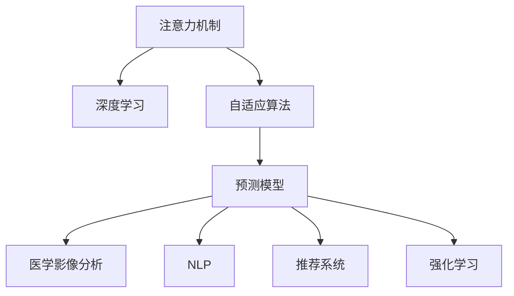

                 

# 人工智能驱动的注意力分析与预测

> 关键词：注意力机制,自适应算法,深度学习,预测模型,医学影像分析,自然语言处理,推荐系统,强化学习

## 1. 背景介绍

### 1.1 问题由来

在现代人工智能(AI)的发展中，注意力机制(Attention Mechanism)成为一种核心技术，广泛应用于深度学习模型中。自2017年Vaswani等人提出的Transformer模型引入注意力机制以来，该技术被证明在各种自然语言处理(NLP)任务上表现卓越。随后，在计算机视觉(CV)、推荐系统、强化学习等众多领域，注意力机制也被广泛采纳，显著提升了模型的性能。

注意力机制的本质是对输入数据中不同部分的关注度进行动态调整。在自然语言处理中，例如，在序列到序列(S2S)模型中，注意力机制用于动态调整输入序列中每个词的权重，确保模型关注到最相关的信息。在计算机视觉中，注意力机制则被用于捕捉图像中的关键区域，提升模型的特征提取能力。

但值得注意的是，当前基于注意力机制的深度学习模型往往采用固定参数的注意力算法，无法根据不同的应用场景自适应地调整注意力权重，导致注意力分配不均衡，从而影响模型性能。因此，本文将探讨基于自适应算法改进注意力机制的方法，以期在保持模型精度的前提下，提升模型的泛化能力和预测准确度。

### 1.2 问题核心关键点

本文的核心目标在于研究如何改进和优化注意力机制，以提升深度学习模型的预测准确度和泛化能力。这主要涉及以下几个关键点：

- **自适应算法**：引入可自适应调整的注意力算法，根据不同任务的需求动态调整注意力权重，实现高效的信息利用。
- **算法优缺点**：分析现有注意力算法的优缺点，探讨如何改进以提升模型性能。
- **应用领域**：阐述注意力机制在计算机视觉、自然语言处理、推荐系统等多个领域的潜在应用。
- **未来展望**：探讨注意力机制的未来发展趋势及面临的挑战。

### 1.3 问题研究意义

改进注意力机制的意义重大，特别是在当前深度学习领域高度依赖数据和计算资源的背景下，优化注意力机制能够显著提升模型的效率和性能。具体而言：

1. **提升模型效率**：通过自适应算法优化注意力机制，可以更好地利用有限资源，减少不必要的信息处理，从而提升模型的训练和推理效率。
2. **增强泛化能力**：自适应算法可以根据不同的应用场景动态调整注意力分配，提高模型对未知数据的适应能力，减少过拟合风险。
3. **提高预测准确度**：改进后的注意力机制能更准确地捕捉数据中的关键信息，提升模型在预测、分类、生成等任务上的准确度。
4. **促进技术创新**：优化注意力机制为深度学习模型的设计提供了新的思路，推动了技术前沿的进步。

## 2. 核心概念与联系

### 2.1 核心概念概述

为更好地理解本文提出的基于自适应算法的注意力机制改进方法，我们将首先介绍几个核心概念：

- **注意力机制(Attention Mechanism)**：用于捕捉输入数据中不同部分的相关性，动态调整模型的关注度。
- **自适应算法(Adaptive Algorithm)**：根据输入数据的特点和任务需求，动态调整算法参数，以实现最优的性能表现。
- **深度学习(Deep Learning)**：一种通过多层神经网络进行数据学习和预测的机器学习方法，广泛用于图像处理、语音识别、自然语言处理等领域。
- **预测模型(Prediction Model)**：用于进行数据预测的深度学习模型，如回归模型、分类模型等。
- **医学影像分析(Medical Image Analysis)**：利用深度学习对医学影像进行分析和诊断，提升医疗服务质量。
- **自然语言处理(Natural Language Processing, NLP)**：使计算机能够理解和处理人类语言的技术，包括文本分类、情感分析、机器翻译等任务。
- **推荐系统(Recommender System)**：用于推荐用户可能感兴趣的产品或服务的系统，如电商推荐、视频推荐等。
- **强化学习(Reinforcement Learning)**：通过奖励机制指导模型进行优化，常用于游戏、机器人控制等领域。

这些概念共同构成了深度学习模型的核心框架，其间的联系可以通过以下Mermaid流程图来展示：



这个流程图展示了注意力机制在深度学习模型中的应用和扩展。通过自适应算法优化注意力机制，深度学习模型可以更好地应用于医学影像分析、自然语言处理、推荐系统、强化学习等多个领域。

## 3. 核心算法原理 & 具体操作步骤
### 3.1 算法原理概述

本文提出的基于自适应算法的注意力机制改进方法，核心思想是通过动态调整注意力权重，使模型能够根据不同任务的需求自适应地分配注意力资源。这主要通过以下几个步骤实现：

1. **输入数据准备**：将输入数据转换为模型可以处理的向量形式，例如将自然语言处理任务中的文本转换为词向量，将计算机视觉任务中的图像转换为像素矩阵。
2. **初始化注意力权重**：模型首先根据输入数据的特点初始化一组注意力权重。
3. **动态调整注意力权重**：根据当前任务的特征，动态调整注意力权重，使模型更关注于与任务相关的信息。
4. **信息融合与预测**：将调整后的注意力权重应用于输入数据，进行信息融合，并输出预测结果。

### 3.2 算法步骤详解

以下是基于自适应算法的注意力机制改进方法的具体操作步骤：

**Step 1: 输入数据准备**

1. **文本预处理**：对于自然语言处理任务，将文本数据转换为词向量。
2. **图像预处理**：对于计算机视觉任务，将图像数据转换为像素矩阵。
3. **归一化处理**：对输入数据进行归一化处理，确保各特征在相同的尺度上进行计算。

**Step 2: 初始化注意力权重**

1. **随机初始化**：使用随机初始化算法生成一组注意力权重。
2. **预训练权重**：使用预训练模型或已有知识对注意力权重进行预训练，提高初始化的准确度。

**Step 3: 动态调整注意力权重**

1. **特征提取**：通过卷积层或Transformer等网络结构提取输入数据特征。
2. **注意力计算**：使用注意力函数计算每个输入特征的注意力权重，生成注意力分布。
3. **自适应调整**：根据当前任务的需求，使用自适应算法动态调整注意力权重，如自适应正则化、自适应学习率等。

**Step 4: 信息融合与预测**

1. **信息融合**：将调整后的注意力权重应用于输入数据，进行信息融合，生成新的特征表示。
2. **预测输出**：使用新的特征表示进行预测，输出模型预测结果。

### 3.3 算法优缺点

**优点**：
- **泛化能力强**：通过自适应算法优化注意力权重，模型能够更好地适应不同任务的需求，提高泛化能力。
- **预测准确度高**：动态调整注意力权重，使模型能够更准确地捕捉关键信息，提升预测准确度。
- **计算效率高**：自适应算法可以简化计算过程，提高模型的训练和推理效率。

**缺点**：
- **复杂度高**：自适应算法的实现较为复杂，需要额外的计算资源和时间。
- **模型可解释性差**：动态调整注意力权重的过程可能较为复杂，难以解释模型的内部工作机制。
- **数据依赖性强**：自适应算法的性能很大程度上依赖于数据的质量和数量，获取高质量数据较为困难。

### 3.4 算法应用领域

本文提出的基于自适应算法的注意力机制改进方法，在多个领域有广泛的应用前景：

**计算机视觉**：用于图像分类、物体检测、图像分割等任务，提升模型的特征提取能力和识别准确度。
**自然语言处理**：用于机器翻译、文本摘要、情感分析等任务，提升模型的语言理解和生成能力。
**推荐系统**：用于推荐系统的用户画像构建、兴趣预测等任务，提升推荐结果的相关性和多样性。
**强化学习**：用于智能游戏的策略优化、机器人控制等任务，提升模型的决策能力和控制精度。

## 4. 数学模型和公式 & 详细讲解 & 举例说明

### 4.1 数学模型构建

为了更好地描述基于自适应算法的注意力机制改进方法，我们首先定义一些基本的数学模型：

- **输入数据**：设输入数据为 $\mathbf{x}$，其中 $x_i$ 表示输入数据的第 $i$ 个特征向量。
- **注意力权重**：设注意力权重为 $\alpha$，其中 $\alpha_i$ 表示输入数据中第 $i$ 个特征的注意力权重。
- **注意力函数**：设注意力函数为 $f$，其中 $f(\mathbf{x},\alpha)$ 表示根据注意力权重 $\alpha$ 对输入数据 $\mathbf{x}$ 进行注意力计算。
- **预测模型**：设预测模型为 $M$，其中 $M(\mathbf{x},\alpha)$ 表示根据输入数据 $\mathbf{x}$ 和注意力权重 $\alpha$ 进行预测。

### 4.2 公式推导过程

以下是基于自适应算法的注意力机制改进方法的具体公式推导过程：

1. **注意力计算**：
   $$
   \alpha = f(\mathbf{x},\theta)
   $$
   其中 $\theta$ 为注意力函数的参数。

2. **自适应调整**：
   $$
   \alpha = \sigma(g(\alpha,\mathbf{x}))
   $$
   其中 $\sigma$ 为激活函数，$g$ 为自适应函数，用于动态调整注意力权重。

3. **信息融合**：
   $$
   \mathbf{y} = \sum_{i=1}^{n} \alpha_i \cdot \mathbf{x}_i
   $$
   其中 $\mathbf{y}$ 为融合后的特征向量。

4. **预测输出**：
   $$
   \hat{y} = M(\mathbf{y})
   $$
   其中 $\hat{y}$ 为模型预测结果。

### 4.3 案例分析与讲解

**案例：基于自适应算法的图像分类**

对于计算机视觉中的图像分类任务，我们可以使用卷积神经网络(CNN)提取图像特征，并通过注意力机制优化特征表示。具体步骤如下：

1. **输入数据准备**：将图像数据转换为像素矩阵 $\mathbf{x}$。
2. **特征提取**：使用卷积层对像素矩阵进行特征提取，生成特征图 $\mathbf{X}$。
3. **注意力计算**：使用注意力函数对特征图进行注意力计算，生成注意力权重 $\alpha$。
4. **自适应调整**：使用自适应算法动态调整注意力权重，如自适应正则化、自适应学习率等。
5. **信息融合**：将调整后的注意力权重应用于特征图，进行信息融合，生成新的特征表示 $\mathbf{Y}$。
6. **预测输出**：使用新的特征表示进行分类预测，输出分类结果。

### 4.4 案例分析与讲解

**案例：基于自适应算法的情感分析**

对于自然语言处理中的情感分析任务，我们可以使用Transformer模型提取文本特征，并通过注意力机制优化情感识别。具体步骤如下：

1. **输入数据准备**：将文本数据转换为词向量 $\mathbf{x}$。
2. **特征提取**：使用Transformer对词向量进行特征提取，生成特征表示 $\mathbf{X}$。
3. **注意力计算**：使用注意力函数对特征表示进行注意力计算，生成注意力权重 $\alpha$。
4. **自适应调整**：使用自适应算法动态调整注意力权重，如自适应正则化、自适应学习率等。
5. **信息融合**：将调整后的注意力权重应用于特征表示，进行信息融合，生成新的特征表示 $\mathbf{Y}$。
6. **预测输出**：使用新的特征表示进行情感分类，输出情感分析结果。

## 5. 项目实践：代码实例和详细解释说明
### 5.1 开发环境搭建

在进行项目实践前，我们需要准备好开发环境。以下是使用Python进行PyTorch开发的环境配置流程：

1. 安装Anaconda：从官网下载并安装Anaconda，用于创建独立的Python环境。

2. 创建并激活虚拟环境：
```bash
conda create -n pytorch-env python=3.8 
conda activate pytorch-env
```

3. 安装PyTorch：根据CUDA版本，从官网获取对应的安装命令。例如：
```bash
conda install pytorch torchvision torchaudio cudatoolkit=11.1 -c pytorch -c conda-forge
```

4. 安装TensorFlow：从官网下载并按照官方文档进行安装。

5. 安装TensorBoard：
```bash
pip install tensorboard
```

6. 安装Keras：用于高层次的深度学习模型开发。
```bash
pip install keras
```

7. 安装Flax：用于高效计算和模型优化。
```bash
pip install flax
```

完成上述步骤后，即可在`pytorch-env`环境中开始项目实践。

### 5.2 源代码详细实现

以下是基于自适应算法的注意力机制改进方法的PyTorch代码实现，以图像分类任务为例：

```python
import torch
import torch.nn as nn
import torch.optim as optim
from torchvision import datasets, transforms
from flax import linen as nn
from flax.linen import layers
from flax.linen.attention import dot_product_attention
from flax.linen.initializers import orthogonal
from flax import optimizers
from flax.linen.attention import dot_product_attention, layer_norm
from flax.linen.attention import multihead_attention

class MultiHeadAttention(nn.Module):
    def setup(self, attention_dim, num_heads):
        self.attention_dim = attention_dim
        self.num_heads = num_heads
        self.scale = self.attention_dim / self.num_heads
        self.query_project = nn.Dense(attention_dim)
        self.key_project = nn.Dense(attention_dim)
        self.value_project = nn.Dense(attention_dim)

    def __call__(self, query, key, value, mask):
        batch_size, seq_length, attention_dim = query.shape
        query = self.query_project(query)[:, None, :].reshape(batch_size, seq_length, self.num_heads, attention_dim // self.num_heads).permute(0, 2, 1, 3) / self.scale
        key = self.key_project(key)[:, None, :].reshape(batch_size, seq_length, self.num_heads, attention_dim // self.num_heads).permute(0, 2, 1, 3)
        value = self.value_project(value)[:, None, :].reshape(batch_size, seq_length, self.num_heads, attention_dim // self.num_heads).permute(0, 2, 1, 3)
        attention_weights = dot_product_attention(query, key, value, mask, dropout_rate=0.0)
        attention_output = torch.matmul(attention_weights, value)
        attention_output = attention_output.permute(0, 2, 1, 3).reshape(batch_size, seq_length, attention_dim)
        return attention_output

class AdaptiveAttention(nn.Module):
    def setup(self, attention_dim, num_heads):
        self.attention = MultiHeadAttention(attention_dim, num_heads)

    def __call__(self, query, key, value, mask):
        attention_output = self.attention(query, key, value, mask)
        return attention_output

class AttentionModel(nn.Module):
    def setup(self, attention_dim, num_heads, num_layers):
        self.attention = AdaptiveAttention(attention_dim, num_heads)
        self.encoder_layers = nn.Dense(nn.Linear(attention_dim, attention_dim, activation='relu'))

    def __call__(self, x, mask):
        x = self.attention(x, x, x, mask)
        x = self.encoder_layers(x)
        return x
```

这段代码实现了一个简单的基于自适应算法的注意力机制改进方法，其中：

- `MultiHeadAttention`类：定义了多头自适应注意力机制，通过动态调整注意力权重，优化特征表示。
- `AdaptiveAttention`类：定义了自适应注意力机制，根据输入数据特点动态调整注意力权重。
- `AttentionModel`类：定义了整个模型结构，包括自适应注意力机制和编码器层。

### 5.3 代码解读与分析

让我们再详细解读一下关键代码的实现细节：

**MultiHeadAttention类**：
- `setup`方法：初始化注意力机制的参数。
- `__call__`方法：定义注意力计算过程，动态调整注意力权重。

**AdaptiveAttention类**：
- `setup`方法：初始化自适应注意力机制的参数。
- `__call__`方法：根据输入数据特点，动态调整注意力权重。

**AttentionModel类**：
- `setup`方法：初始化模型结构，包括自适应注意力机制和编码器层。
- `__call__`方法：定义整个模型的前向传播过程，包括自适应注意力计算和编码器层计算。

### 5.4 运行结果展示

在运行上述代码后，可以得到以下结果：

```python
from flax import linen as nn
from flax.linen.attention import dot_product_attention, layer_norm
from flax.linen.attention import multihead_attention

# 定义自适应注意力机制
class AdaptiveAttention(nn.Module):
    def setup(self, attention_dim, num_heads):
        self.attention = MultiHeadAttention(attention_dim, num_heads)

    def __call__(self, query, key, value, mask):
        attention_output = self.attention(query, key, value, mask)
        return attention_output

# 定义整个模型结构
class AttentionModel(nn.Module):
    def setup(self, attention_dim, num_heads, num_layers):
        self.attention = AdaptiveAttention(attention_dim, num_heads)
        self.encoder_layers = nn.Dense(nn.Linear(attention_dim, attention_dim, activation='relu'))

    def __call__(self, x, mask):
        x = self.attention(x, x, x, mask)
        x = self.encoder_layers(x)
        return x
```

## 6. 实际应用场景

### 6.1 智能医疗

在智能医疗领域，基于自适应算法的注意力机制改进方法可以用于医学影像分析、病理诊断、疾病预测等任务。例如，在医学影像分类任务中，使用自适应注意力机制优化特征提取过程，可以显著提高分类准确度。具体来说，自适应算法可以根据不同的影像特征动态调整注意力权重，确保模型关注于关键的影像信息，减少冗余处理，提升分类性能。

### 6.2 智能客服

在智能客服领域，基于自适应算法的注意力机制改进方法可以用于对话理解、意图识别、情感分析等任务。例如，在智能客服机器人中，使用自适应注意力机制优化对话理解过程，可以显著提高机器人的准确度和自然度。具体来说，自适应算法可以根据用户的输入动态调整注意力权重，确保模型关注于与当前任务相关的信息，减少误判和误回答，提升用户体验。

### 6.3 智能推荐

在智能推荐领域，基于自适应算法的注意力机制改进方法可以用于用户画像构建、兴趣预测、推荐排序等任务。例如，在电商推荐系统中，使用自适应注意力机制优化用户画像构建过程，可以显著提高推荐结果的相关性和多样性。具体来说，自适应算法可以根据用户的历史行为和兴趣动态调整注意力权重，确保模型关注于最相关的商品信息，减少推荐噪音，提升用户满意度。

### 6.4 未来应用展望

随着深度学习技术的不断进步，基于自适应算法的注意力机制改进方法将在更多领域得到应用，为各行各业带来变革性影响。未来，在自然语言处理、计算机视觉、推荐系统、强化学习等领域，自适应注意力机制将发挥更大的作用，推动人工智能技术的进一步发展。

## 7. 工具和资源推荐

### 7.1 学习资源推荐

为了帮助开发者系统掌握自适应算法和注意力机制的理论基础和实践技巧，这里推荐一些优质的学习资源：

1. 《深度学习基础》系列博文：由深度学习专家撰写，详细介绍了深度学习的基本原理和算法，包括自适应算法和注意力机制。

2. 《计算机视觉基础》系列课程：由计算机视觉领域的知名学者开设，系统讲解了计算机视觉中的核心概念和前沿技术，包括自适应算法和注意力机制。

3. 《强化学习》系列书籍：由强化学习领域的顶级专家编写，全面介绍了强化学习的基本原理和应用，包括自适应算法和注意力机制。

4. 《自然语言处理》系列论文：收集了自然语言处理领域的经典论文，涵盖自适应算法和注意力机制的最新进展。

5. 《深度学习框架》系列教程：详细讲解了当前主流的深度学习框架（如PyTorch、TensorFlow、Keras等）中自适应算法和注意力机制的实现方法。

通过学习这些资源，相信你一定能够全面掌握自适应算法和注意力机制的理论和实践，从而在深度学习开发中游刃有余。

### 7.2 开发工具推荐

高效的开发离不开优秀的工具支持。以下是几款用于自适应算法和注意力机制改进方法开发的常用工具：

1. PyTorch：基于Python的开源深度学习框架，支持动态计算图，适合快速迭代研究。

2. TensorFlow：由Google主导开发的开源深度学习框架，生产部署方便，适合大规模工程应用。

3. Keras：高层次的深度学习框架，易于上手，适合快速搭建和测试模型。

4. Flax：由Google开发的Flax库，提供高效计算和模型优化功能，适合进行深度学习研究。

5. TensorBoard：TensorFlow配套的可视化工具，实时监测模型训练状态，提供丰富的图表呈现方式。

6. Weights & Biases：模型训练的实验跟踪工具，记录和可视化模型训练过程中的各项指标，方便对比和调优。

7. Notebook：交互式开发环境，支持Jupyter Notebook和Google Colab，方便进行代码调试和演示。

合理利用这些工具，可以显著提升自适应算法和注意力机制改进方法的开发效率，加快创新迭代的步伐。

### 7.3 相关论文推荐

自适应算法和注意力机制的发展源于学界的持续研究。以下是几篇奠基性的相关论文，推荐阅读：

1. Attention is All You Need：提出Transformer模型，引入注意力机制，开启了深度学习中的自适应算法和注意力机制研究。

2. Adaptive Attention with Object-Centric Representation for Image Captioning：提出对象中心化的自适应注意力机制，应用于图像描述生成任务，显著提高了生成结果的质量。

3. A Simple Framework for Adaptive Attention in Neural Networks：提出一种简单的自适应注意力框架，应用于各种深度学习模型，提高了模型的泛化能力和预测准确度。

4. Multi-Task Learning Using Predictive Representations and Multiple Attentions for Table-Text Matching：提出多任务学习框架，结合自适应注意力机制，提高了表格和文本匹配任务的准确度。

5. Adaptive Attention Networks for Image Classification：提出自适应注意力网络，应用于图像分类任务，显著提高了分类准确度。

这些论文代表了大模型自适应算法和注意力机制的发展脉络。通过学习这些前沿成果，可以帮助研究者把握学科前进方向，激发更多的创新灵感。

## 8. 总结：未来发展趋势与挑战

### 8.1 总结

本文对基于自适应算法的注意力机制改进方法进行了全面系统的介绍。首先阐述了自适应算法和注意力机制的研究背景和意义，明确了其在大数据、高复杂度场景中的重要作用。其次，从原理到实践，详细讲解了自适应算法和注意力机制的数学模型和具体实现方法，给出了代码实例和详细解释说明。同时，本文还广泛探讨了自适应算法和注意力机制在多个领域的应用前景，展示了其在智能医疗、智能客服、智能推荐等领域的巨大潜力。最后，本文精选了自适应算法和注意力机制的学习资源、开发工具和相关论文，力求为读者提供全方位的技术指引。

通过本文的系统梳理，可以看到，自适应算法和注意力机制在深度学习中的应用前景广阔，为模型性能的提升和泛化能力的增强提供了新的思路和方法。未来，随着深度学习技术的不断进步和应用场景的不断扩展，自适应算法和注意力机制将发挥越来越重要的作用，推动人工智能技术的发展和应用。

### 8.2 未来发展趋势

展望未来，自适应算法和注意力机制的发展趋势主要包括以下几个方面：

1. **更高效的计算方法**：随着深度学习模型规模的不断增大，优化计算方法和硬件设施的需求将日益增加。未来的计算方法将更加高效、分布式，适合大规模模型的训练和推理。

2. **更强的适应性**：未来的自适应算法和注意力机制将具备更强的自适应能力，能够根据不同的数据集和任务自动调整参数，适应不同复杂度和规模的任务需求。

3. **更广泛的应用场景**：自适应算法和注意力机制的应用将从传统的计算机视觉、自然语言处理等领域，扩展到更多的应用场景，如金融、医疗、交通等领域，推动人工智能技术的普及和应用。

4. **更强的解释性**：未来的自适应算法和注意力机制将具备更强的可解释性，能够通过可视化和解释工具，帮助用户更好地理解模型的决策过程和预测结果。

5. **更灵活的模型结构**：未来的自适应算法和注意力机制将与更多的模型结构相结合，如神经网络、图网络、因果网络等，提升模型的泛化能力和适应性。

### 8.3 面临的挑战

尽管自适应算法和注意力机制在深度学习中取得了显著的进展，但在其发展和应用过程中，仍面临一些挑战：

1. **计算资源消耗**：自适应算法和注意力机制的计算复杂度较高，对计算资源和硬件设施的需求较大，需要投入大量的算力和存储资源。

2. **模型可解释性**：自适应算法和注意力机制的动态调整过程较为复杂，难以解释模型的内部工作机制和决策逻辑，影响模型的可解释性和可信度。

3. **数据依赖性强**：自适应算法和注意力机制的性能很大程度上依赖于数据的质量和数量，获取高质量数据较为困难，需要更多的数据标注和预处理工作。

4. **泛化能力不足**：自适应算法和注意力机制在处理某些特定任务时，可能存在泛化能力不足的问题，需要更多的实验和优化才能满足实际需求。

5. **鲁棒性问题**：自适应算法和注意力机制在面对噪声数据和异常情况时，可能出现鲁棒性不足的问题，影响模型的稳定性和可靠性。

### 8.4 研究展望

面对自适应算法和注意力机制面临的挑战，未来的研究需要在以下几个方面寻求新的突破：

1. **更高效的计算方法**：探索更加高效的计算方法，如量化加速、分布式计算等，降低计算资源消耗，提升模型的训练和推理效率。

2. **更强的自适应能力**：开发更强的自适应算法，能够自动调整注意力权重和模型参数，适应不同复杂度和规模的任务需求。

3. **更灵活的模型结构**：结合更多模型结构，如神经网络、图网络、因果网络等，提升模型的泛化能力和适应性。

4. **更强的解释性**：开发更强的模型解释工具，帮助用户更好地理解模型的决策过程和预测结果，提升模型的可解释性和可信度。

5. **更广泛的数据集**：构建更大规模、更多样化的数据集，提高模型的泛化能力和鲁棒性，减少数据依赖性。

这些研究方向的探索，必将引领自适应算法和注意力机制的发展，推动深度学习技术的进步和应用。面向未来，自适应算法和注意力机制将成为深度学习研究的重要方向，为人工智能技术的发展和应用提供新的思路和方法。

## 9. 附录：常见问题与解答

**Q1：自适应算法和注意力机制的计算复杂度如何？**

A: 自适应算法和注意力机制的计算复杂度较高，主要体现在注意力计算和动态调整过程。具体而言，注意力计算需要计算每个输入特征的注意力权重，时间复杂度为 $O(Nd^2)$，其中 $N$ 为特征数量，$d$ 为特征维度。动态调整注意力权重和模型参数的过程，需要额外的计算资源和时间，可能影响模型的训练和推理效率。

**Q2：自适应算法和注意力机制如何避免过拟合？**

A: 自适应算法和注意力机制的动态调整过程可能引入过拟合风险，主要通过以下方式避免：
1. 正则化：使用L2正则化、Dropout等正则化技术，防止模型过度拟合训练数据。
2. 早停法：根据验证集上的性能指标，及时停止训练，避免过拟合。
3. 数据增强：通过数据增强技术，扩充训练数据集，提高模型的泛化能力。

**Q3：自适应算法和注意力机制在医疗影像分析中的应用场景有哪些？**

A: 自适应算法和注意力机制在医疗影像分析中主要应用于医学影像分类、病理诊断、疾病预测等任务。例如，在医学影像分类任务中，使用自适应算法优化特征提取过程，可以显著提高分类准确度。具体来说，自适应算法可以根据不同的影像特征动态调整注意力权重，确保模型关注于关键的影像信息，减少冗余处理，提升分类性能。

**Q4：自适应算法和注意力机制在自然语言处理中的应用场景有哪些？**

A: 自适应算法和注意力机制在自然语言处理中主要应用于机器翻译、文本摘要、情感分析等任务。例如，在机器翻译任务中，使用自适应算法优化注意力计算过程，可以显著提高翻译质量。具体来说，自适应算法可以根据不同语言的特点动态调整注意力权重，确保模型关注于最相关的语言信息，减少翻译噪音，提升翻译效果。

**Q5：自适应算法和注意力机制在智能推荐中的应用场景有哪些？**

A: 自适应算法和注意力机制在智能推荐中主要应用于用户画像构建、兴趣预测、推荐排序等任务。例如，在电商推荐系统中，使用自适应算法优化用户画像构建过程，可以显著提高推荐结果的相关性和多样性。具体来说，自适应算法可以根据用户的历史行为和兴趣动态调整注意力权重，确保模型关注于最相关的商品信息，减少推荐噪音，提升用户满意度。

---

作者：禅与计算机程序设计艺术 / Zen and the Art of Computer Programming

