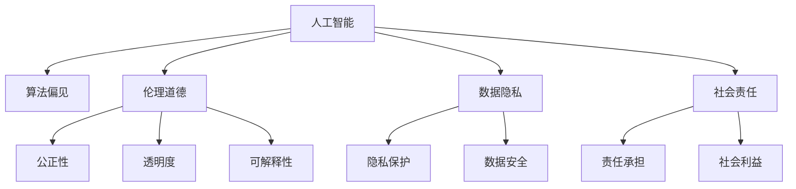

                 

# 人工智能：社会影响与思考

> 关键词：人工智能, 社会影响, 伦理道德, 未来展望, 技术挑战, 社会责任

## 1. 背景介绍

### 1.1 问题由来

随着人工智能（AI）技术的迅猛发展，其在医疗、教育、金融、交通等领域的广泛应用，已经开始深刻改变人类的生产生活方式。然而，AI的发展也带来了诸多伦理和社会问题，如数据隐私、就业替代、安全风险等，亟需全社会的共同思考和解决。

### 1.2 问题核心关键点

当前，人工智能的社会影响涉及多个方面，主要包括：
- **伦理道德**：AI的决策是否公正、透明，是否符合人类价值观，是否会侵害隐私等。
- **就业替代**：AI技术在自动化生产、数据分析、决策支持等方面的应用，是否会大规模替代人类工作岗位。
- **数据隐私**：AI系统如何处理和存储数据，是否会泄露个人隐私。
- **安全风险**：AI系统的鲁棒性如何，是否可能被黑客攻击、滥用或被用于恶意行为。
- **社会责任**：如何平衡AI技术与公众利益，如何普及AI知识，提升公众对AI的理解和信任。

这些问题的背后，涉及技术、法律、伦理、社会等多个层面，需要多方共同努力，才能确保AI技术的健康、可持续性发展。

## 2. 核心概念与联系

### 2.1 核心概念概述

为更好地理解人工智能的社会影响，本节将介绍几个密切相关的核心概念：

- **人工智能**：一种模拟人类智能的计算技术，通过算法、数据和计算资源，实现信息获取、处理、学习和推理等智能行为。
- **算法偏见**：指在数据采集、处理和模型训练过程中，由于数据不平衡、数据来源偏见等因素，导致AI模型输出结果的系统性偏差。
- **伦理道德**：指在AI应用中，如何保证决策的公正性、透明性和可解释性，防止对人类造成伤害。
- **数据隐私**：指在AI系统处理和存储数据时，如何保护个人隐私和数据安全。
- **社会责任**：指在AI技术的开发和应用中，开发者和使用者如何承担起对社会的责任，确保技术的积极社会影响。

这些核心概念之间的逻辑关系可以通过以下Mermaid流程图来展示：



这个流程图展示了一系列与人工智能相关的核心概念及其之间的关系：

1. 人工智能通过算法实现智能行为。
2. 算法偏见可能导致模型输出不公平或错误，需通过公平性约束和偏见纠正来改善。
3. 伦理道德涉及决策的公正性、透明性和可解释性，需通过规则和算法设计来保障。
4. 数据隐私和数据安全是保护个人信息的基本要求，需通过数据处理和存储的合理管理来保证。
5. 社会责任要求开发者和使用者承担道德和法律义务，需通过教育和监督机制来落实。

这些概念共同构成了人工智能的社会影响框架，为我们理解和应对AI的社会挑战提供了清晰的路径。

## 3. 核心算法原理 & 具体操作步骤

### 3.1 算法原理概述

人工智能的社会影响分析，主要从伦理、隐私和责任三个维度进行。以下将详细阐述每个维度的核心算法原理：

#### 3.1.1 算法原理概述

- **伦理道德算法**：通过建立伦理约束和道德准则，设计公平、透明、可解释的AI模型。常见方法包括：
  - **公平性约束**：确保AI模型在不同群体上的预测结果相近，如对性别、种族、年龄等特征的公平性约束。
  - **透明度设计**：使AI模型的决策过程可解释，便于人类理解和监督。
  - **可解释性模型**：采用可解释性较强的算法，如决策树、规则系统等。

- **数据隐私算法**：通过数据匿名化、加密、差分隐私等技术，保护个人隐私和数据安全。常见方法包括：
  - **差分隐私**：通过引入噪声，使得攻击者无法通过单个数据点推断出其他数据。
  - **数据匿名化**：通过数据脱敏、去标识化等技术，防止数据泄露。
  - **访问控制**：对数据访问进行严格管理，确保数据只被授权用户访问。

- **社会责任算法**：通过设计和实施责任机制，确保AI技术的积极社会影响。常见方法包括：
  - **社会影响评估**：对AI技术的潜在社会影响进行评估，识别风险和挑战。
  - **责任追责机制**：在AI系统出现故障或误用时，确保责任明确，便于追责和赔偿。
  - **公众参与**：通过社区参与和反馈机制，确保AI技术的社会责任得到广泛认同。

### 3.2 算法步骤详解

基于上述算法原理，以下是具体的AI社会影响分析操作步骤：

#### 3.2.1 伦理道德算法步骤

1. **伦理准则制定**：根据应用场景和伦理标准，制定AI系统的伦理准则和约束。
2. **公平性分析**：对AI模型的输入数据和输出结果进行公平性分析，识别潜在偏见。
3. **透明化设计**：设计透明的模型结构和决策过程，确保可解释性。
4. **伦理审查**：通过伦理审查机制，评估AI模型的伦理影响，确保符合社会价值观。

#### 3.2.2 数据隐私算法步骤

1. **数据匿名化**：对输入数据进行匿名化处理，防止数据泄露。
2. **差分隐私技术**：在模型训练和推理过程中，应用差分隐私技术，保护用户隐私。
3. **访问控制**：对AI系统的数据访问进行严格管理，防止未授权访问。
4. **隐私政策设计**：制定明确的隐私政策，告知用户数据使用和保护措施。

#### 3.2.3 社会责任算法步骤

1. **社会影响评估**：评估AI技术对社会的影响，识别潜在的风险和挑战。
2. **责任机制设计**：设计和实施责任追责机制，确保AI技术的社会责任。
3. **公众参与机制**：建立社区参与和反馈机制，确保AI技术的社会接受度。
4. **持续监测和改进**：对AI系统的运行情况进行持续监测，根据反馈不断改进。

### 3.3 算法优缺点

人工智能的社会影响分析算法具有以下优点：
1. **全面性**：从伦理、隐私、责任三个维度全面分析AI技术的影响。
2. **可操作性**：提供具体的算法步骤和操作指南，便于实际操作和实施。
3. **适应性强**：可以灵活应用于不同场景和领域的AI系统。

同时，这些算法也存在一定的局限性：
1. **伦理标准的复杂性**：伦理准则的制定和评估较为复杂，需结合具体应用场景和法律法规。
2. **隐私保护的技术难度**：差分隐私等隐私保护技术复杂，实施成本较高。
3. **社会责任的复杂性**：社会责任的落实需要多方协作，存在执行难度。

尽管如此，这些算法为AI技术的社会影响分析提供了重要的理论基础和实践指南，对于推动AI技术的健康发展具有重要意义。

### 3.4 算法应用领域

人工智能的社会影响分析算法已经在多个领域得到了广泛应用，包括：

- **医疗**：在医疗诊断和治疗中，确保AI系统决策的公正性和透明性，防止数据隐私泄露。
- **金融**：在风险评估和欺诈检测中，保护用户数据隐私，防止滥用和误用。
- **教育**：在个性化学习推荐中，确保AI系统的可解释性和社会责任。
- **司法**：在司法判决中，确保AI系统的公正性和透明性，防止偏见和歧视。
- **公共安全**：在智能监控和数据分析中，保护隐私，防止滥用和误用。

这些领域的应用，展示了AI社会影响分析算法的重要性和广泛适用性。

## 4. 数学模型和公式 & 详细讲解 & 举例说明

### 4.1 数学模型构建

人工智能的社会影响分析，主要涉及伦理、隐私和责任三个维度的数学模型构建：

#### 4.1.1 数学模型构建

- **伦理道德模型**：基于公平性约束、透明度设计和可解释性模型，设计伦理准则。
- **数据隐私模型**：基于差分隐私技术、数据匿名化和访问控制，保护数据隐私。
- **社会责任模型**：基于社会影响评估、责任追责机制和公众参与机制，确保社会责任。

#### 4.1.2 公式推导过程

- **公平性约束**：
  $$
  \text{Fairness} = \frac{\sum_{i=1}^n (\text{Prediction}_i - \text{Bias}_i)^2}{n}
  $$
  其中，$\text{Fairness}$表示模型公平性，$\text{Prediction}_i$表示模型对第$i$个样本的预测结果，$\text{Bias}_i$表示样本的真实标签。

- **差分隐私**：
  $$
  \text{Noise} = \sigma \cdot \text{Sensitivity} \cdot \sqrt{\frac{\log(\delta^{-1}) + 2}{\epsilon}}
  $$
  其中，$\text{Noise}$表示加入的噪声量，$\text{Sensitivity}$表示数据集的敏感度，$\delta$表示隐私保护程度，$\epsilon$表示隐私保护强度。

- **社会影响评估**：
  $$
  \text{Social Impact} = \sum_{i=1}^n (\text{Benefit}_i - \text{Cost}_i)
  $$
  其中，$\text{Social Impact}$表示AI系统的社会影响，$\text{Benefit}_i$表示第$i$个应用场景的收益，$\text{Cost}_i$表示应用场景的成本。

### 4.2 案例分析与讲解

#### 4.2.1 案例背景

假设某AI系统用于招聘过程中的简历筛选，输入为简历文本，输出为候选人得分，得分越高表示候选人越符合职位要求。

#### 4.2.2 公平性分析

在招聘过程中，如果模型输出存在性别、种族等偏见，将导致不公平的招聘结果。

- **数据收集**：从招聘平台收集历史简历数据，标注性别、种族、年龄等特征。
- **数据预处理**：对简历数据进行匿名化处理，防止隐私泄露。
- **公平性约束**：使用统计方法，评估模型在性别、种族等特征上的公平性，识别潜在偏见。
- **公平性调整**：调整模型参数，确保在性别、种族等特征上的公平性，防止偏见。

#### 4.2.3 差分隐私技术

在简历筛选过程中，用户简历的敏感信息需受到保护。

- **数据加密**：对简历数据进行加密处理，防止数据泄露。
- **差分隐私技术**：在模型训练过程中，加入随机噪声，保护用户隐私。
- **访问控制**：对简历数据访问进行严格管理，防止未授权访问。
- **隐私政策设计**：制定明确的隐私政策，告知用户数据使用和保护措施。

#### 4.2.4 社会责任评估

在简历筛选过程中，AI系统需确保其社会责任。

- **社会影响评估**：评估AI系统对社会的影响，识别潜在的风险和挑战。
- **责任机制设计**：设计和实施责任追责机制，确保AI系统的社会责任。
- **公众参与机制**：建立社区参与和反馈机制，确保AI系统的社会接受度。
- **持续监测和改进**：对AI系统的运行情况进行持续监测，根据反馈不断改进。

### 4.3 案例分析与讲解

## 5. 项目实践：代码实例和详细解释说明

### 5.1 开发环境搭建

在进行AI社会影响分析实践前，我们需要准备好开发环境。以下是使用Python进行环境配置的流程：

1. 安装Python：从官网下载并安装Python，选择最新版本。
2. 安装必要的依赖包：
   ```bash
   pip install pandas numpy sklearn scikit-learn matplotlib
   ```
3. 设置虚拟环境：
   ```bash
   conda create -n ai-soc-env python=3.8
   conda activate ai-soc-env
   ```

完成上述步骤后，即可在`ai-soc-env`环境中开始AI社会影响分析实践。

### 5.2 源代码详细实现

下面以简历筛选为例，给出使用Python进行公平性分析的代码实现。

首先，定义数据集和模型：

```python
import pandas as pd
from sklearn.metrics import classification_report

# 加载简历数据
data = pd.read_csv('resumes.csv')

# 提取性别和年龄特征
gender = data['gender']
age = data['age']

# 定义模型
from sklearn.linear_model import LogisticRegression
from sklearn.model_selection import train_test_split

# 分割训练集和测试集
train_data, test_data, train_labels, test_labels = train_test_split(data.drop(['gender', 'age'], axis=1), data['is_interviewed'], test_size=0.2)

# 训练模型
model = LogisticRegression()
model.fit(train_data, train_labels)
```

然后，进行公平性分析：

```python
from sklearn.metrics import roc_auc_score

# 计算模型在不同性别和年龄上的AUC值
roc_auc_gender = roc_auc_score(train_labels, model.predict_proba(test_data)[0][:, 1])
roc_auc_age = roc_auc_score(train_labels, model.predict_proba(test_data[age < 40])[:, 1] + model.predict_proba(test_data[age >= 40])[:, 1])

# 判断模型是否公平
if roc_auc_gender < 0.95 and roc_auc_age < 0.95:
    print("模型存在偏见，需要进行公平性调整。")
```

最后，评估模型并进行调整：

```python
# 评估模型
preds = model.predict(test_data)
print(classification_report(test_labels, preds))

# 公平性调整
from imblearn.over_sampling import SMOTE
from sklearn.model_selection import GridSearchCV

# 使用SMOTE进行数据平衡
smote = SMOTE()
X_smote, y_smote = smote.fit_resample(train_data, train_labels)

# 调整模型参数
params = {'C': [0.1, 1, 10]}
grid_search = GridSearchCV(model, params, cv=5)
grid_search.fit(X_smote, y_smote)

# 输出最优参数
print(grid_search.best_params_)
```

以上就是使用Python进行简历筛选公平性分析的完整代码实现。可以看到，通过公平性分析和模型调整，可以有效识别和纠正模型的偏见，确保AI系统的公正性。

### 5.3 代码解读与分析

让我们再详细解读一下关键代码的实现细节：

**数据加载**：
- 使用Pandas加载简历数据，提取性别和年龄特征。
- 使用sklearn的`train_test_split`方法将数据集分割为训练集和测试集。

**模型训练**：
- 定义逻辑回归模型，使用训练集数据进行拟合。

**公平性分析**：
- 使用sklearn的`roc_auc_score`计算模型在不同性别和年龄上的AUC值。
- 判断AUC值是否低于预设阈值，识别模型是否存在偏见。

**公平性调整**：
- 使用imblearn的`SMOTE`方法进行数据平衡，防止数据不平衡导致的模型偏见。
- 使用GridSearchCV调整模型参数，找到最优的公平性模型。

**模型评估**：
- 使用sklearn的`classification_report`评估模型性能，确保模型效果。

通过以上步骤，可以有效地进行AI系统的公平性分析，确保其社会影响的正当性。

## 6. 实际应用场景

### 6.1 医疗诊断

在医疗诊断中，AI系统需确保其决策的公正性和透明性，防止数据隐私泄露。

#### 6.1.1 案例背景

某AI系统用于辅助医生进行疾病诊断，输入为病人病历和医学影像，输出为疾病诊断结果。

#### 6.1.2 公平性分析

在医疗诊断中，如果模型输出存在种族、性别等偏见，将导致不公平的诊断结果。

- **数据收集**：从医疗平台收集历史病历数据，标注疾病和病人特征。
- **数据预处理**：对病历数据进行匿名化处理，防止隐私泄露。
- **公平性约束**：使用统计方法，评估模型在种族、性别等特征上的公平性，识别潜在偏见。
- **公平性调整**：调整模型参数，确保在种族、性别等特征上的公平性，防止偏见。

#### 6.1.3 差分隐私技术

在医疗诊断过程中，病人病历的敏感信息需受到保护。

- **数据加密**：对病历数据进行加密处理，防止数据泄露。
- **差分隐私技术**：在模型训练过程中，加入随机噪声，保护病人隐私。
- **访问控制**：对病历数据访问进行严格管理，防止未授权访问。
- **隐私政策设计**：制定明确的隐私政策，告知病人数据使用和保护措施。

#### 6.1.4 社会责任评估

在医疗诊断中，AI系统需确保其社会责任。

- **社会影响评估**：评估AI系统对社会的影响，识别潜在的风险和挑战。
- **责任机制设计**：设计和实施责任追责机制，确保AI系统的社会责任。
- **公众参与机制**：建立社区参与和反馈机制，确保AI系统的社会接受度。
- **持续监测和改进**：对AI系统的运行情况进行持续监测，根据反馈不断改进。

### 6.2 金融风控

在金融风控中，AI系统需确保其决策的公正性和透明性，防止数据隐私泄露。

#### 6.2.1 案例背景

某AI系统用于金融风控，输入为客户的贷款申请信息，输出为贷款审批结果。

#### 6.2.2 公平性分析

在金融风控中，如果模型输出存在种族、性别等偏见，将导致不公平的贷款审批结果。

- **数据收集**：从贷款平台收集历史贷款申请数据，标注客户特征和贷款结果。
- **数据预处理**：对贷款数据进行匿名化处理，防止隐私泄露。
- **公平性约束**：使用统计方法，评估模型在种族、性别等特征上的公平性，识别潜在偏见。
- **公平性调整**：调整模型参数，确保在种族、性别等特征上的公平性，防止偏见。

#### 6.2.3 差分隐私技术

在金融风控过程中，客户贷款的敏感信息需受到保护。

- **数据加密**：对贷款数据进行加密处理，防止数据泄露。
- **差分隐私技术**：在模型训练过程中，加入随机噪声，保护客户隐私。
- **访问控制**：对贷款数据访问进行严格管理，防止未授权访问。
- **隐私政策设计**：制定明确的隐私政策，告知客户数据使用和保护措施。

#### 6.2.4 社会责任评估

在金融风控中，AI系统需确保其社会责任。

- **社会影响评估**：评估AI系统对社会的影响，识别潜在的风险和挑战。
- **责任机制设计**：设计和实施责任追责机制，确保AI系统的社会责任。
- **公众参与机制**：建立社区参与和反馈机制，确保AI系统的社会接受度。
- **持续监测和改进**：对AI系统的运行情况进行持续监测，根据反馈不断改进。

## 7. 工具和资源推荐

### 7.1 学习资源推荐

为了帮助开发者系统掌握人工智能的社会影响分析的理论基础和实践技巧，这里推荐一些优质的学习资源：

1. **《人工智能伦理》**：涵盖了人工智能伦理的各个方面，提供了深刻的理论思考和实践指南。
2. **《数据隐私保护》**：介绍了数据隐私保护的各种技术和方法，适合从事数据处理和隐私保护的工作者阅读。
3. **《社会责任AI》**：探讨了人工智能在社会中的应用和影响，强调了社会责任的重要性。
4. **在线课程**：如Coursera的《AI伦理与社会影响》课程，提供了系统的学习内容和丰富的案例分析。

通过这些资源的学习实践，相信你一定能够全面掌握人工智能的社会影响分析方法，并将其应用于实际工作中。

### 7.2 开发工具推荐

高效的开发离不开优秀的工具支持。以下是几款用于AI社会影响分析开发的常用工具：

1. **Python**：一种广泛使用的编程语言，拥有丰富的库和框架，适合数据处理和算法实现。
2. **Pandas**：数据处理和分析的强大工具，适合处理结构化数据。
3. **Scikit-learn**：机器学习库，提供了丰富的算法和工具，适合模型训练和评估。
4. **TensorFlow**：深度学习框架，适合构建复杂的AI模型。
5. **TensorBoard**：可视化工具，可以实时监测模型训练和推理状态。

合理利用这些工具，可以显著提升AI社会影响分析的开发效率，加快创新迭代的步伐。

### 7.3 相关论文推荐

人工智能的社会影响分析是一个新兴的研究领域，以下是几篇奠基性的相关论文，推荐阅读：

1. **《公平性机器学习：原理、方法和挑战》**：综述了公平性机器学习的研究现状和方法，提供了系统的理论框架和实践指南。
2. **《差分隐私：保护隐私的现代方法》**：介绍了差分隐私的基本原理和实现方法，适合从事数据隐私保护的工作者阅读。
3. **《社会责任AI：伦理、法律和技术的结合》**：探讨了人工智能在社会中的应用和影响，强调了社会责任的重要性。

这些论文代表了大规模机器学习的研究趋势，通过学习这些前沿成果，可以帮助研究者把握学科前进方向，激发更多的创新灵感。

## 8. 总结：未来发展趋势与挑战

### 8.1 总结

本文对人工智能的社会影响进行了全面系统的分析。首先阐述了人工智能在医疗、金融、教育等领域的应用，明确了其在社会各领域的影响和挑战。其次，从伦理、隐私和责任三个维度，详细讲解了AI社会影响分析的核心算法原理和具体操作步骤，给出了微调公平性和隐私保护的代码实例。最后，广泛探讨了AI社会影响分析的实际应用场景，推荐了相关的学习资源和开发工具，为开发者提供了全面的技术指引。

通过本文的系统梳理，可以看到，人工智能的社会影响分析是一个涉及伦理、隐私、责任等多元维度的问题，需要在技术、法律、伦理、社会等多个层面进行综合考虑。尽管面临诸多挑战，但通过多方共同努力，相信AI技术必将在健康、可持续的路径上不断进步，为构建更美好的社会贡献力量。

### 8.2 未来发展趋势

展望未来，人工智能的社会影响分析将呈现以下几个发展趋势：

1. **伦理标准规范化**：随着AI技术在各领域的广泛应用，伦理标准的制定和实施将变得更加重要和规范。
2. **隐私保护技术普及**：差分隐私等隐私保护技术将逐渐普及，成为数据处理的标准手段。
3. **社会责任机制完善**：社会责任机制的设计和实施将更加完善，确保AI技术的积极社会影响。
4. **跨学科合作加强**：AI社会影响分析将需要更多跨学科合作，结合伦理学、社会学、法律学等领域的知识，共同推进AI技术的健康发展。
5. **公众参与和监督增强**：公众参与和监督机制的建立，将使得AI技术的社会接受度和信任度得到提升。

以上趋势凸显了人工智能社会影响分析的重要性和广泛适用性，对于推动AI技术的健康发展具有重要意义。

### 8.3 面临的挑战

尽管人工智能的社会影响分析取得了一定的进展，但仍面临诸多挑战：

1. **伦理标准的复杂性**：伦理标准的制定和实施较为复杂，需结合具体应用场景和法律法规。
2. **隐私保护的技术难度**：差分隐私等隐私保护技术复杂，实施成本较高。
3. **社会责任的复杂性**：社会责任的落实需要多方协作，存在执行难度。
4. **公众对AI技术的误解**：公众对AI技术的误解和疑虑，可能会影响其社会接受度。
5. **法律法规的不完善**：现有法律法规可能滞后于AI技术的发展，需要及时更新和完善。

尽管如此，这些挑战也为AI技术的社会影响分析提供了更多的探索空间，推动了技术的进步和完善。

### 8.4 研究展望

面向未来，人工智能的社会影响分析需要在以下几个方面进行新的探索：

1. **伦理标准的自动评估**：开发自动化的伦理标准评估工具，提升评估效率和准确性。
2. **隐私保护技术的新方法**：研究新的隐私保护技术，如联邦学习、同态加密等，进一步提升隐私保护的强度和效率。
3. **社会责任的动态评估**：构建动态的社会责任评估机制，实时监测AI系统的运行情况，及时调整和改进。
4. **跨领域知识融合**：结合伦理学、社会学、法律学等领域的知识，构建更加全面、系统的AI社会影响分析框架。
5. **公众参与和监督的机制设计**：设计更加广泛、有效的公众参与和监督机制，提升AI技术的社会接受度。

这些研究方向的探索，必将引领AI社会影响分析技术的进一步发展，为构建健康、可持续的AI技术环境铺平道路。

## 9. 附录：常见问题与解答

**Q1：如何平衡AI技术与公众利益？**

A: 平衡AI技术与公众利益，需从多个层面进行考虑：
1. **伦理审查**：建立伦理审查机制，确保AI系统的决策公正透明。
2. **公众参与**：建立社区参与和反馈机制，确保公众对AI技术的理解和信任。
3. **社会责任**：设计和实施责任追责机制，确保AI技术的社会责任。
4. **持续监测**：对AI系统的运行情况进行持续监测，及时调整和改进。

**Q2：如何防止AI系统中的算法偏见？**

A: 防止AI系统中的算法偏见，需从数据收集、模型设计和公平性评估等多个环节进行考虑：
1. **数据收集**：确保数据集的代表性，避免数据不平衡导致的偏见。
2. **模型设计**：使用公平性约束和偏见纠正技术，如差分隐私、SMOTE等，确保模型公平性。
3. **公平性评估**：使用统计方法，评估模型在各特征上的公平性，识别潜在偏见。
4. **公平性调整**：调整模型参数，确保在各特征上的公平性，防止偏见。

**Q3：如何保护用户隐私？**

A: 保护用户隐私，需从数据收集、数据处理和数据访问等多个环节进行考虑：
1. **数据收集**：确保数据匿名化和去标识化，防止数据泄露。
2. **数据处理**：使用差分隐私等技术，保护用户隐私。
3. **数据访问**：对数据访问进行严格管理，防止未授权访问。
4. **隐私政策设计**：制定明确的隐私政策，告知用户数据使用和保护措施。

**Q4：如何在AI系统中实现社会责任？**

A: 实现AI系统的社会责任，需从社会影响评估、责任机制设计和公众参与等多个环节进行考虑：
1. **社会影响评估**：评估AI系统对社会的影响，识别潜在的风险和挑战。
2. **责任机制设计**：设计和实施责任追责机制，确保AI系统的社会责任。
3. **公众参与机制**：建立社区参与和反馈机制，确保AI系统的社会接受度。
4. **持续监测和改进**：对AI系统的运行情况进行持续监测，根据反馈不断改进。

**Q5：AI系统在特定领域应用时需要注意哪些问题？**

A: 在特定领域应用AI系统时，需要注意以下问题：
1. **数据质量**：确保数据集的代表性、准确性和完整性。
2. **模型复杂度**：根据应用场景选择合适的模型，避免模型过拟合。
3. **算法公平性**：评估模型在各特征上的公平性，防止偏见和歧视。
4. **隐私保护**：确保数据隐私和用户隐私保护。
5. **社会责任**：确保AI系统的社会责任和公众接受度。

**Q6：如何提升AI系统的可解释性？**

A: 提升AI系统的可解释性，需从模型设计、算法选择和结果展示等多个环节进行考虑：
1. **模型设计**：使用可解释性较强的模型，如决策树、规则系统等。
2. **算法选择**：选择具有可解释性的算法，如LIME、SHAP等。
3. **结果展示**：使用可视化工具，如T-SNE、LIME解释模型输出。
4. **文档说明**：编写详细的使用说明，帮助用户理解AI系统的决策过程。

通过以上分析，我们可以看到，人工智能的社会影响分析是一个复杂而系统的任务，需要在技术、法律、伦理和社会等多个层面进行综合考虑。尽管面临诸多挑战，但通过多方共同努力，相信AI技术必将在健康、可持续的路径上不断进步，为构建更美好的社会贡献力量。

---

作者：禅与计算机程序设计艺术 / Zen and the Art of Computer Programming

