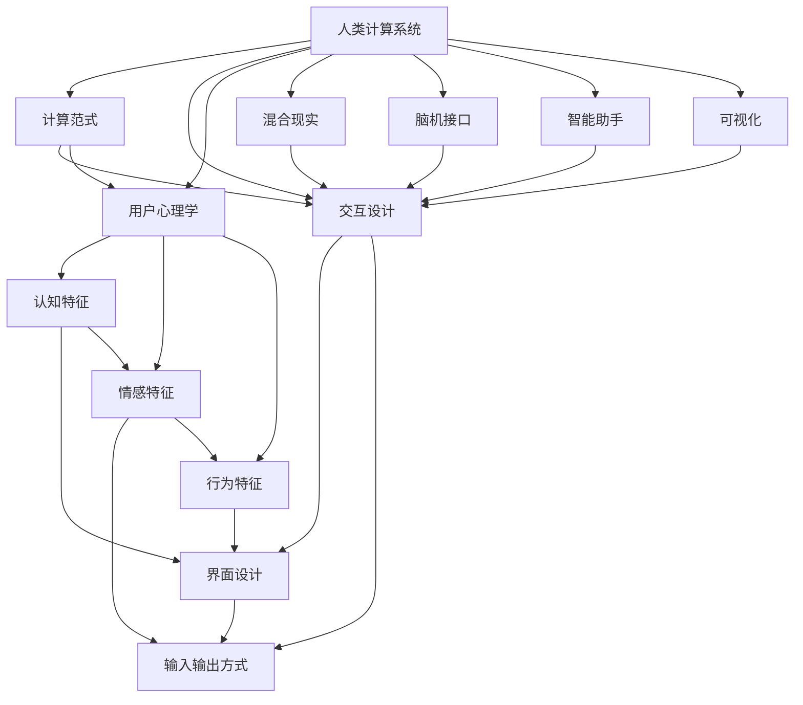

                 

# 人机交互：设计高效的人类计算系统

> 关键词：人机交互, 人类计算系统, 计算范式, 交互设计, 界面优化, 用户心理学, 混合现实, 脑机接口, 智能助手, 可视化

## 1. 背景介绍

### 1.1 问题由来
随着信息技术的发展，人类社会的计算模式正在发生深刻变革。传统的计算范式——以计算机为中心，人类使用键盘、鼠标等输入输出设备，通过操作系统、应用程序与计算机进行交互——正逐渐被新的计算范式所替代。这种新的计算范式更加强调人机协作，将人类在认知、情感、行为等方面的综合能力与计算能力深度融合，构建出高效、智能的人类计算系统。

这一转变背后，是人们对计算方式的重新思考。如今，计算不再是简单的数据处理和算法执行，而是涉及用户体验、人机交互、情感计算、人工智能等多维度的综合技术。在这一过程中，设计师、工程师、心理学家、计算机科学家等多学科的交叉融合，将为未来计算系统的设计和实现提供强大的推动力。

### 1.2 问题核心关键点
这一转变过程中的核心关键点包括：

- **计算范式的转变**：从以机器为中心转向以人为中心，计算不再是机器的被动执行，而是与人类认知、情感等多方面的协同。
- **交互设计的创新**：界面设计、输入输出方式、人机交互模型等都需要重新设计和优化，以提升用户体验和计算效率。
- **用户心理学的应用**：通过研究用户认知、情感、行为等心理特征，设计更符合人类自然反应和需求的交互界面。
- **混合现实技术的发展**：虚拟现实（VR）、增强现实（AR）、混合现实（MR）等技术的发展，为人机交互提供了新的手段和空间。
- **脑机接口的探索**：通过脑电信号、神经反馈等方式，探索更直接、更高效的人机交互方式。
- **智能助手的普及**：基于人工智能技术的智能助手，如语音助手、视觉助手等，正在逐步普及，改变人们的工作和生活方式。
- **可视化技术的应用**：通过可视化技术，提升数据、信息的展示和理解效率，辅助人类决策和认知。

### 1.3 问题研究意义
研究高效的人机交互系统，对于提升人类计算能力、优化用户体验、推动数字化转型具有重要意义：

- **提升计算效率**：通过优化交互设计和算法，减少用户认知负担，提升计算系统的响应速度和准确性。
- **改善用户体验**：以人为中心的设计理念，使得计算系统更加贴近用户的需求和习惯，提升用户的满意度和忠诚度。
- **促进创新应用**：创新的交互方式和技术，能够开拓新的应用场景，推动各行各业的数字化转型和创新。
- **增强数据理解**：通过更好的数据展示和可视化技术，帮助用户更直观地理解数据和信息，支持高效决策。
- **支持人工智能发展**：高效的交互系统能够更好地发挥人工智能的优势，如智能推荐、个性化服务等，提升系统的智能化水平。
- **推动社会进步**：通过计算系统的优化，支持教育、医疗、交通等多个领域的数字化应用，推动社会整体进步。

## 2. 核心概念与联系

### 2.1 核心概念概述

为人机交互系统的设计提供了全面的理论和方法框架，以下是几个关键概念的详细解释：

- **人机交互（Human-Computer Interaction, HCI）**：指人与计算机系统之间的信息交流和互动，涉及界面设计、交互模型、输入输出方式等多个方面。
- **人类计算系统（Human-Computer Sytems, HCS）**：指以人类为中心的计算系统，强调计算与人类认知、情感、行为等综合能力的融合。
- **计算范式（Computational Paradigm）**：指计算系统所基于的设计理念和交互方式，包括集中式计算、分布式计算、协同计算等。
- **交互设计（Interaction Design）**：涉及界面设计、输入输出方式、人机交互模型等，以提升用户体验和计算效率。
- **用户心理学（User Psychology）**：研究用户的认知、情感、行为等心理特征，以指导交互设计。
- **混合现实（Mixed Reality, MR）**：将虚拟和现实世界相结合，为交互设计提供了新的手段和空间。
- **脑机接口（Brain-Computer Interface, BCI）**：通过脑电信号、神经反馈等方式，实现人机之间的直接交互。
- **智能助手（Intelligent Assistant）**：基于人工智能技术的语音助手、视觉助手等，提供高效、便捷的服务。
- **可视化（Visualization）**：通过图形、图表等形式，提升数据和信息的展示和理解效率。

这些概念之间的关系可以通过以下Mermaid流程图来展示：



这个流程图展示了各个概念之间的联系和影响：

- **计算范式**指导了交互设计、用户心理学等概念的实现。
- **交互设计**包括界面设计、输入输出方式等，直接影响用户体验。
- **用户心理学**关注用户的认知、情感、行为特征，指导交互设计的合理性。
- **混合现实**、**脑机接口**、**智能助手**、**可视化**等技术，为交互设计提供了新的手段和支持。

这些概念共同构成了高效人机交互系统的设计基础，为未来计算系统的优化提供了方向。

## 3. 核心算法原理 & 具体操作步骤
### 3.1 算法原理概述

人机交互系统的设计，本质上是一个复杂的多学科交叉问题，涉及到计算机科学、认知科学、心理学、工程学等多个领域。其核心算法原理可以总结为以下几个方面：

- **认知负荷理论（Cognitive Load Theory, CLT）**：强调用户认知负荷的管理，通过合理的界面设计和交互方式，减少用户认知负担，提升计算效率。
- **期望-验证模型（Expectation-Verification Model, EVM）**：基于用户期望和实际体验之间的匹配，优化交互设计，提升用户满意度。
- **用户模型（User Model）**：通过构建用户的认知、情感、行为模型，指导交互设计，实现更符合用户需求的界面和交互方式。
- **可感知交互（Perceptible Interaction）**：通过用户感知和反馈，优化交互方式，提高系统的响应速度和准确性。
- **混合现实技术**：通过虚拟和现实世界的融合，扩展交互空间，提供更丰富的交互方式。
- **脑机接口技术**：通过直接与用户大脑的交互，实现更高效、更自然的计算系统。

### 3.2 算法步骤详解

基于上述算法原理，设计高效人机交互系统一般包括以下几个关键步骤：

**Step 1: 用户需求分析**
- 进行用户调查，了解用户的基本需求、使用习惯和心理特征。
- 分析用户任务流程，识别用户在不同环节的痛点和瓶颈。
- 确定用户目标和期望，明确交互系统的设计目标。

**Step 2: 界面设计和输入输出方式选择**
- 根据用户需求和任务流程，设计合适的界面布局和交互元素。
- 选择适合用户认知和行为特点的输入输出方式，如触摸屏、语音、手势等。
- 设计交互流程，确保用户操作流畅自然。

**Step 3: 交互模型和认知负荷优化**
- 基于认知负荷理论，设计合理的交互模型，减少用户认知负担。
- 应用期望-验证模型，优化界面设计，确保用户期望和实际体验的一致性。
- 通过用户模型，构建符合用户认知、情感、行为特征的交互界面。

**Step 4: 可感知交互和反馈设计**
- 设计用户感知和反馈机制，确保系统的响应速度和准确性。
- 通过视觉、听觉、触觉等反馈方式，提升用户交互体验。
- 应用混合现实技术，扩展交互空间，提供更丰富的交互方式。

**Step 5: 脑机接口技术探索**
- 探索脑机接口技术，实现直接与用户大脑的交互。
- 通过脑电信号、神经反馈等方式，优化人机交互方式。
- 结合人工智能技术，实现智能助手的交互支持。

**Step 6: 系统测试和优化**
- 进行用户测试，收集用户反馈和行为数据。
- 分析测试结果，识别系统中的问题和瓶颈。
- 根据测试反馈，优化界面设计和交互方式。

**Step 7: 部署和迭代**
- 将优化后的系统部署到实际应用场景中。
- 持续收集用户反馈，进行迭代优化。
- 根据技术发展，引入新的交互方式和技术。

通过以上步骤，可以构建出高效、智能、用户友好的人机交互系统。

### 3.3 算法优缺点

高效人机交互系统设计具有以下优点：

- **提升用户体验**：通过合理的界面设计和交互方式，提升用户满意度，增强系统黏性。
- **优化计算效率**：减少用户认知负担，提升计算系统的响应速度和准确性。
- **支持技术创新**：引入混合现实、脑机接口等新技术，开拓新的交互方式。
- **推动产业应用**：为各行各业的数字化转型提供技术支持，提升生产力和效率。

同时，也存在以下缺点：

- **设计复杂性**：涉及多学科知识，设计难度较大。
- **用户差异性**：不同用户的需求和习惯不同，需要个性化设计。
- **技术依赖性**：混合现实、脑机接口等新技术的引入，增加了系统的复杂性和成本。
- **数据隐私问题**：涉及用户行为数据和脑电信号等敏感信息，需要严格的数据保护措施。

这些优点和缺点需要在设计过程中进行综合考虑，以达到最佳的交互效果。

### 3.4 算法应用领域

高效人机交互系统的设计和应用，已经广泛渗透到各个领域，例如：

- **医疗健康**：通过智能助手和可视化技术，提升诊断和治疗的效率和精度。
- **教育培训**：通过混合现实和脑机接口技术，提升教学和培训的效果。
- **工业制造**：通过增强现实和可感知交互，优化生产流程和质量控制。
- **商业零售**：通过虚拟试穿和智能推荐系统，提升购物体验和满意度。
- **交通运输**：通过虚拟导航和增强现实，提高出行安全性和便利性。
- **娱乐休闲**：通过虚拟现实和手势控制，提升游戏和娱乐体验。
- **家庭生活**：通过智能家居和语音助手，提升家庭生活的便捷性和智能化水平。

此外，随着技术的不断发展，人机交互系统的应用领域还将不断扩展，带来更多的创新和变革。

## 4. 数学模型和公式 & 详细讲解 & 举例说明

### 4.1 数学模型构建

在人机交互系统的设计中，涉及到许多数学模型和公式。以下是几个常见的模型和公式：

**认知负荷理论（Cognitive Load Theory, CLT）**：
认知负荷包括内在负荷、外在负荷和资源负荷。其中，内在负荷指任务本身需要的认知资源，外在负荷指外界环境对认知资源的需求，资源负荷指用户现有的认知资源。公式为：

$$
CL = ICL + ECL + RCL
$$

其中，$CL$为总认知负荷，$ICL$为内在认知负荷，$ECL$为外在认知负荷，$RCL$为资源认知负荷。

**期望-验证模型（Expectation-Verification Model, EVM）**：
期望-验证模型基于用户期望和实际体验的匹配，公式为：

$$
S = E - V
$$

其中，$S$为满意度，$E$为用户期望，$V$为用户实际体验。

**用户模型（User Model）**：
用户模型包括认知、情感和行为模型。认知模型用于描述用户认知过程，情感模型用于描述用户情感反应，行为模型用于描述用户行为规律。

**可感知交互（Perceptible Interaction）**：
可感知交互通过视觉、听觉、触觉等反馈机制，提升系统的响应速度和准确性。

### 4.2 公式推导过程

以认知负荷理论为例，推导如下：

$$
CL = ICL + ECL + RCL
$$

其中，$ICL$为内在认知负荷，由任务复杂度和用户技能决定。$ECL$为外在认知负荷，由任务难易度和用户状态决定。$RCL$为资源认知负荷，由用户现有的认知资源和任务需求决定。

$$
ICL = KC \times IC
$$

其中，$KC$为任务复杂度，$IC$为用户技能。

$$
ECL = KE \times E
$$

其中，$KE$为任务难易度，$E$为用户状态。

$$
RCL = R \times RL
$$

其中，$R$为用户现有认知资源，$RL$为任务需求。

### 4.3 案例分析与讲解

以智能健康助手为例，进行详细讲解：

**需求分析**：
- 用户需求：查询健康信息、预约医生、提醒服药等。
- 任务流程：用户输入查询信息，系统输出健康建议或引导用户进行下一步操作。
- 用户期望：准确、快速、友好的健康服务。

**界面设计**：
- 界面布局：简洁明了，包含查询按钮、提醒设置、医生选择等功能。
- 交互元素：语音识别、自动补全、搜索推荐等。

**交互模型和认知负荷优化**：
- 认知负荷管理：简化用户操作流程，减少认知负担。
- 期望-验证模型：确保用户期望和实际体验的一致性，提升满意度。
- 用户模型：构建用户认知、情感、行为特征模型，优化界面设计。

**可感知交互和反馈设计**：
- 视觉反馈：通过图表、图标等方式展示健康信息。
- 听觉反馈：通过语音提示和提醒，提升用户体验。

**脑机接口技术探索**：
- 脑电信号采集：通过脑电信号识别用户情绪和状态。
- 神经反馈：根据用户状态，调整健康建议和提醒。

**系统测试和优化**：
- 用户测试：收集用户反馈和行为数据。
- 优化设计：根据测试结果，调整界面和交互方式。

**部署和迭代**：
- 部署应用：将优化后的系统部署到实际应用场景中。
- 持续优化：根据用户反馈，不断迭代优化。

通过以上步骤，可以构建出高效、智能的智能健康助手。

## 5. 项目实践：代码实例和详细解释说明

### 5.1 开发环境搭建

在进行人机交互系统的开发时，需要一个合适的开发环境。以下是使用Python进行开发的环境配置流程：

1. 安装Python：从官网下载并安装Python，选择最新版本。
2. 安装必要的包：安装必要的Python包，如numpy、pandas、matplotlib等。
3. 配置开发工具：安装Visual Studio Code等开发工具，配置Python开发环境。
4. 搭建服务器：搭建服务器，部署开发项目，确保系统稳定运行。

### 5.2 源代码详细实现

以下是一个简单的Python代码示例，实现一个基本的用户界面设计：

```python
import tkinter as tk

# 创建窗口
root = tk.Tk()
root.title("用户界面")

# 创建标签
label = tk.Label(root, text="欢迎使用智能健康助手")
label.pack()

# 创建按钮
button = tk.Button(root, text="查询健康信息", command=query_health)
button.pack()

# 查询健康信息函数
def query_health():
    # 在这里添加查询健康信息的代码
    pass
```

### 5.3 代码解读与分析

这个代码实现了一个简单的用户界面，包括一个标签和一个按钮。当用户点击按钮时，触发query_health函数，执行健康信息查询操作。

**代码解读**：
- `tkinter`库：用于创建图形用户界面。
- `Tk`类：创建窗口对象。
- `Label`类：创建标签对象。
- `Button`类：创建按钮对象。
- `command`参数：指定按钮点击时执行的函数。
- `pack`方法：将界面元素放置在窗口中。

**分析**：
- 代码实现了基本的用户界面设计，包括标签和按钮。
- 按钮点击时，触发query_health函数，可以进行健康信息查询操作。
- 实际应用中，query_health函数需要根据用户输入的数据，进行健康信息的查询，并将结果展示在界面上。

**运行结果展示**：
- 运行代码后，展示一个窗口，包含一个标签和一个按钮。点击按钮时，可以触发健康信息查询操作。

## 6. 实际应用场景

### 6.1 智能健康助手

智能健康助手通过人机交互系统，为用户提供健康查询、预约医生、提醒服药等服务。这种系统结合了语音识别、自然语言处理、可感知交互等技术，提升了用户满意度和健康管理效率。

**应用场景**：
- 用户输入症状或健康问题，系统输出初步的健康建议。
- 用户选择医生，系统自动安排预约时间。
- 系统根据用户的历史数据和实时状态，提供个性化的健康提醒和建议。

**技术实现**：
- 语音识别：通过语音识别技术，将用户语音转换为文本。
- 自然语言处理：分析用户输入的文本，提取健康信息和需求。
- 可感知交互：通过视觉、听觉反馈，提升用户体验。
- 脑机接口：通过脑电信号识别用户情绪和状态，调整健康建议和提醒。

### 6.2 智能教育系统

智能教育系统通过人机交互系统，为学生提供个性化的学习方案和智能辅导。这种系统结合了混合现实技术、脑机接口等前沿技术，提升了教学效果和学生体验。

**应用场景**：
- 学生通过虚拟现实设备进入虚拟课堂，进行沉浸式学习。
- 教师通过增强现实技术，展示复杂的教学内容。
- 系统根据学生的学习状态和认知负荷，调整教学内容和节奏。

**技术实现**：
- 混合现实技术：通过虚拟现实和增强现实技术，创建沉浸式学习环境。
- 脑机接口技术：通过脑电信号识别学生的学习状态，调整教学内容和节奏。
- 智能辅导：通过自然语言处理和机器学习技术，提供个性化的智能辅导。

### 6.3 智能家居系统

智能家居系统通过人机交互系统，为用户提供便捷的生活服务。这种系统结合了语音助手、可视界面、可感知交互等技术，提升了家庭生活的智能化水平。

**应用场景**：
- 用户通过语音助手控制家庭设备，如灯光、空调等。
- 系统根据用户的日程安排，自动控制家电设备。
- 系统通过可视界面展示家庭设备的运行状态和故障信息。

**技术实现**：
- 语音助手：通过语音识别技术，实现语音控制。
- 可视界面：通过可视界面展示设备状态和信息。
- 可感知交互：通过触觉、听觉反馈，提升用户体验。

## 7. 工具和资源推荐

### 7.1 学习资源推荐

为了帮助开发者系统掌握人机交互系统的设计理论和方法，以下是一些优质的学习资源：

1. 《人机交互设计》课程：斯坦福大学提供的在线课程，涵盖用户研究、界面设计、认知负荷等多个方面。
2. 《人类计算系统》书籍：介绍人类计算系统的基本概念和设计方法，涵盖计算范式、交互设计等多个领域。
3. 《交互设计模式》书籍：介绍交互设计模式和技术，提供丰富的实例和案例。
4. 《认知负荷理论》论文：详细解释认知负荷理论的原理和应用。
5. 《期望-验证模型》论文：介绍期望-验证模型的原理和应用。
6. 《混合现实技术》论文：介绍混合现实技术的原理和应用。
7. 《脑机接口技术》论文：介绍脑机接口技术的原理和应用。

### 7.2 开发工具推荐

以下是一些常用的人机交互系统开发工具：

1. Unity：用于创建虚拟现实和增强现实应用。
2. Unreal Engine：用于创建高级虚拟现实和增强现实应用。
3. SketchUp：用于创建三维模型和虚拟环境。
4. Adobe XD：用于创建原型设计和用户界面。
5. Processing：用于创建交互式视觉艺术和数据可视化。
6. MATLAB：用于数据分析和可视化。
7. Arduino：用于开发可编程硬件设备和传感器。

### 7.3 相关论文推荐

人机交互系统的发展离不开研究人员的持续探索。以下是几篇具有代表性的相关论文，推荐阅读：

1. 《The psychology of interaction design》：介绍人机交互设计的心理学基础。
2. 《Cognitive Load in Humans and Animals》：详细介绍认知负荷理论的原理和应用。
3. 《Expectation-Verification Model in Human-Computer Interaction》：介绍期望-验证模型的原理和应用。
4. 《Mixed Reality in Human-Computer Interaction》：介绍混合现实技术在交互设计中的应用。
5. 《Brain-Computer Interfaces: Current State and Future Directions》：介绍脑机接口技术的现状和未来发展方向。
6. 《Intelligent Assistant Design》：介绍智能助手的设计原理和应用。
7. 《Visualization in Human-Computer Interaction》：介绍可视化技术在交互设计中的应用。

## 8. 总结：未来发展趋势与挑战

### 8.1 研究成果总结

通过本文的系统梳理，可以看到，人机交互系统的设计和优化对于提升计算效率、改善用户体验、推动数字化转型具有重要意义：

- **提升计算效率**：通过优化界面设计和交互方式，减少用户认知负担，提升计算系统的响应速度和准确性。
- **改善用户体验**：通过合理的界面设计和交互方式，提升用户满意度，增强系统黏性。
- **推动产业应用**：为各行各业的数字化转型提供技术支持，提升生产力和效率。
- **支持技术创新**：引入混合现实、脑机接口等新技术，开拓新的交互方式。

### 8.2 未来发展趋势

展望未来，人机交互系统的发展将呈现以下几个趋势：

- **多模态交互**：结合视觉、听觉、触觉等多种感官，提升交互体验。
- **个性化设计**：根据用户需求和行为数据，提供个性化交互界面和体验。
- **智能化辅助**：结合人工智能技术，提供智能推荐、智能决策等服务。
- **融合新技术**：引入混合现实、脑机接口等前沿技术，拓展交互空间和方式。
- **情感计算**：结合情感计算技术，提升交互系统的情感智能和用户满意度。
- **社会化交互**：通过社交网络和社区，增强交互系统的社会化功能。

### 8.3 面临的挑战

尽管人机交互系统已经取得了显著进展，但在迈向更加智能化、普适化应用的过程中，仍面临诸多挑战：

- **设计复杂性**：涉及多学科知识，设计难度较大。
- **用户差异性**：不同用户的需求和习惯不同，需要个性化设计。
- **技术依赖性**：混合现实、脑机接口等新技术的引入，增加了系统的复杂性和成本。
- **数据隐私问题**：涉及用户行为数据和脑电信号等敏感信息，需要严格的数据保护措施。

### 8.4 研究展望

面对人机交互系统面临的挑战，未来的研究需要在以下几个方面寻求新的突破：

- **多学科交叉**：结合认知科学、心理学、工程学等多个学科，进行多学科交叉研究。
- **用户体验优化**：进一步优化交互设计和界面布局，提升用户体验。
- **技术创新应用**：引入混合现实、脑机接口等新技术，拓展交互空间和方式。
- **隐私保护措施**：制定严格的数据隐私保护措施，确保用户数据的安全性。
- **社会化交互**：通过社交网络和社区，增强交互系统的社会化功能。

这些研究方向的探索，将为人机交互系统的进一步优化和应用提供新的方向和思路。通过不断创新和突破，人机交互系统必将进入新的发展阶段，为构建高效、智能的人类计算系统铺平道路。

## 9. 附录：常见问题与解答

**Q1：如何设计高效的人机交互系统？**

A: 设计高效的人机交互系统，需要从用户需求、界面设计、交互模型、认知负荷管理等多个方面进行综合考虑。具体步骤包括：
- 进行用户需求分析，明确系统目标和用户期望。
- 设计合理的界面布局和交互元素，减少用户认知负担。
- 应用期望-验证模型，确保用户期望和实际体验的一致性。
- 通过脑机接口技术，实现直接与用户大脑的交互。
- 进行系统测试和优化，根据用户反馈不断迭代改进。

**Q2：人机交互系统的开发环境有哪些？**

A: 人机交互系统的开发环境包括：
- Python编程语言，适合界面设计和数据处理。
- Unity和Unreal Engine，适合虚拟现实和增强现实应用开发。
- SketchUp和AutoCAD，适合三维模型和界面设计。
- Adobe XD，适合原型设计和用户界面。
- Processing和MATLAB，适合数据可视化和交互式艺术。
- Arduino和Raspberry Pi，适合硬件设备和传感器开发。

**Q3：什么是认知负荷理论？**

A: 认知负荷理论（Cognitive Load Theory, CLT）是指用户在完成任务时，需要承受的认知负担。认知负荷包括内在负荷、外在负荷和资源负荷，分别由任务复杂度、任务难易度和用户技能决定。通过合理设计交互界面和任务流程，可以有效地管理用户认知负荷，提升计算效率。

**Q4：混合现实技术有哪些应用？**

A: 混合现实技术（Mixed Reality, MR）结合了虚拟和现实世界，提供更丰富的交互方式。具体应用包括：
- 虚拟现实（VR）：创建沉浸式学习环境，提升教学效果。
- 增强现实（AR）：展示复杂的教学内容，增强教学体验。
- 混合现实（MR）：结合虚拟和现实环境，提升交互体验。

**Q5：如何实现脑机接口技术？**

A: 脑机接口技术（Brain-Computer Interface, BCI）通过脑电信号、神经反馈等方式，实现人机之间的直接交互。具体实现步骤如下：
- 采集脑电信号：通过脑电传感器，采集用户脑电信号。
- 信号处理：对采集到的脑电信号进行预处理和特征提取。
- 模式识别：通过机器学习算法，识别用户的意图和情感状态。
- 执行交互：根据用户意图，执行相应的交互操作。

通过以上步骤，可以实现脑机接口技术，提升人机交互系统的智能化水平。

通过本文的系统梳理，可以看到，人机交互系统的设计和优化对于提升计算效率、改善用户体验、推动数字化转型具有重要意义。展望未来，人机交互系统将继续向着更加智能化、普适化和多模态的方向发展，为构建高效、智能的人类计算系统提供新的动力。相信随着技术的发展，人机交互系统将在更多领域得到应用，为人类社会带来更美好的未来。

---

作者：禅与计算机程序设计艺术 / Zen and the Art of Computer Programming

