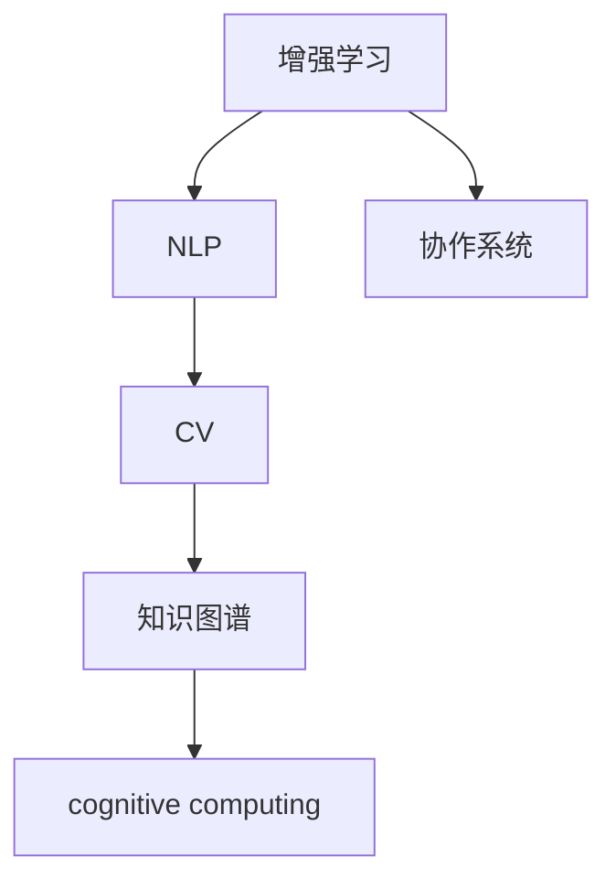

                 

## 1. 背景介绍

在数字化转型快速发展的今天，人工智能(AI)技术正在成为塑造未来社会结构和经济活力的关键力量。人机协作，即人机系统在智能决策、信息处理和任务执行中相互配合，正逐渐成为未来智能系统的核心模式。这一模式不仅提高了工作效率，还增强了系统的智能化水平，为各行各业带来了深远的变革。

人机协作的驱动力来自两方面：

### 1.1 人类与机器各自的优势互补
- **人类优势**：人类具有情感理解、创造力、多模态感知和跨领域知识等独特能力，能够从更高层次上分析和决策。
- **机器优势**：机器具有强大的数据处理能力、模式识别能力和快速反应能力，能够高效处理海量数据和复杂任务。

### 1.2 智能化系统的需求提升
随着大数据、物联网和云服务的普及，各行各业对智能化系统的需求日益增长。无论是金融、医疗、教育还是制造业，智能化系统的引入都能显著提高运营效率和服务质量。

## 2. 核心概念与联系

### 2.1 核心概念概述

在人机协作的过程中，涉及多个关键概念和技术，包括：

- **增强学习**：一种通过交互和经验学习来优化策略的机器学习方法，用于训练机器在与人类协作中做出最优决策。
- **自然语言处理(NLP)**：使机器能理解、处理和生成人类语言的AI技术，为人机协作提供了重要的沟通桥梁。
- **计算机视觉(CV)**：使机器能“看”和理解图像、视频等视觉数据的AI技术，为视觉任务提供了基础。
- **知识图谱**：一种结构化的知识表示方法，用于整合多源异构数据，增强机器的常识推理能力。
- **认知计算**：研究如何使机器模拟人类认知过程，实现深度理解和智能决策。
- **协作系统**：集成了多种AI技术，实现人机无缝协作的系统架构。

这些核心概念和技术通过合理的架构设计，能够协同工作，形成高效、智能的人机协作系统。

### 2.2 核心概念原理和架构的 Mermaid 流程图



该流程图展示了各核心概念之间的联系：

- 增强学习通过NLP和CV技术获取数据和反馈，不断优化决策策略。
- NLP技术处理文本数据，为增强学习提供理解和语义信息。
- CV技术处理视觉数据，为增强学习提供视觉感知能力。
- 知识图谱整合多源数据，提供全面的知识背景。
- 认知计算模拟人类认知过程，提升智能推理能力。
- 协作系统集成多种AI技术，实现人机无缝协作。

## 3. 核心算法原理 & 具体操作步骤

### 3.1 算法原理概述

人机协作的核心算法原理基于分布式决策和多智能体协同。具体而言，包括以下几个关键步骤：

1. **数据获取与预处理**：获取来自不同源的多模态数据，并进行清洗、归一化和特征提取。
2. **决策模型构建**：使用增强学习、深度学习和认知计算等技术，构建决策模型。
3. **多智能体协同**：设计多智能体协同协议，确保各智能体之间信息共享和协调一致。
4. **反馈与优化**：收集用户反馈和系统行为数据，不断优化决策模型和协作协议。

### 3.2 算法步骤详解

以下是人机协作的核心算法步骤：

**Step 1: 数据获取与预处理**
- 收集多模态数据，包括文本、图像、视频、传感器数据等。
- 进行数据清洗、去噪和标准化，以确保数据质量。
- 对文本和图像等数据进行特征提取，如TF-IDF、CNN、RNN等，以供模型训练。

**Step 2: 决策模型构建**
- 选择适合的决策模型，如强化学习、深度神经网络、认知模型等。
- 设计模型架构，如多层感知器、循环神经网络、卷积神经网络等。
- 进行模型训练，使用历史数据和用户反馈进行优化。

**Step 3: 多智能体协同**
- 设计多智能体协同协议，确保各智能体之间的信息共享和协作。
- 实现通信机制，如消息传递、状态共享、分布式优化等。
- 处理冲突和异常情况，确保协同一致性。

**Step 4: 反馈与优化**
- 收集用户反馈和系统行为数据，如满意度、任务完成度、系统运行状态等。
- 分析数据，识别问题点和改进点。
- 根据反馈信息，调整模型参数和协同协议，进行迭代优化。

### 3.3 算法优缺点

人机协作的算法具有以下优点：
- **多模态数据融合**：能够处理和融合不同模态的数据，提供更全面的信息。
- **智能协同优化**：通过多智能体协同，优化决策过程，提升整体性能。
- **动态自适应**：能够根据环境和任务的变化，动态调整策略和行为。

同时，该算法也存在一些局限性：
- **复杂度高**：需要处理多模态数据和多智能体协同，计算复杂度高。
- **数据依赖强**：模型性能依赖于高质量、多样化的数据。
- **实时性挑战**：在实时应用中，需要高效处理和反馈，保证系统响应速度。

### 3.4 算法应用领域

人机协作的算法在多个领域中有着广泛的应用，例如：

- **金融风控**：利用多模态数据和智能决策模型，实时监控和预警金融风险。
- **智能医疗**：结合医学知识图谱和认知计算，辅助医生诊断和治疗。
- **自动驾驶**：通过增强学习与计算机视觉的结合，实现车辆自主导航和决策。
- **智能客服**：利用NLP和协作系统，提供智能客服解决方案。
- **智能家居**：通过多种传感器和AI技术，实现家庭自动化和智能化管理。
- **供应链管理**：使用多智能体协同和决策优化，提升供应链效率和灵活性。

## 4. 数学模型和公式 & 详细讲解 & 举例说明

### 4.1 数学模型构建

在人机协作中，数学模型主要用于描述和优化决策过程。以下是一个简化的数学模型示例：

**目标函数**：
$$
\min_{\theta} J(\theta) = \sum_{i=1}^{N} w_i \ell(f_{\theta}(x_i), y_i)
$$
其中，$J(\theta)$ 为模型损失函数，$w_i$ 为样本权重，$\ell$ 为损失函数，$f_{\theta}(x_i)$ 为模型预测输出，$y_i$ 为真实标签。

**约束条件**：
$$
\begin{aligned}
& \theta \in \Theta \\
& g_i(\theta) \leq 0, i=1,2,\dots,m \\
& h_j(\theta) = 0, j=1,2,\dots,p
\end{aligned}
$$
其中，$\Theta$ 为参数空间，$g_i(\theta)$ 为不等式约束，$h_j(\theta)$ 为等式约束。

### 4.2 公式推导过程

以线性回归为例，目标函数为均方误差损失：
$$
J(\theta) = \frac{1}{2N} \sum_{i=1}^{N} (y_i - f_{\theta}(x_i))^2
$$
其中，$f_{\theta}(x_i) = \theta^T x_i$，$\theta$ 为线性回归系数。

对 $J(\theta)$ 求偏导数，得到：
$$
\frac{\partial J(\theta)}{\partial \theta} = - \frac{1}{N} \sum_{i=1}^{N} (y_i - f_{\theta}(x_i)) x_i = - \frac{1}{N} (X^T X)^{-1} X^T (y - f_{\theta}(X))
$$

将偏导数代入梯度下降公式：
$$
\theta \leftarrow \theta - \eta \frac{\partial J(\theta)}{\partial \theta}
$$

### 4.3 案例分析与讲解

假设有一个智能推荐系统的案例，目标函数为交叉熵损失：
$$
J(\theta) = -\frac{1}{N} \sum_{i=1}^{N} \sum_{j=1}^{M} y_{ij} \log p_{\theta}(x_i, y_j)
$$
其中，$y_{ij}$ 为样本 $i$ 的标签 $j$ 是否出现，$p_{\theta}(x_i, y_j)$ 为模型预测概率。

假设 $p_{\theta}(x_i, y_j) = \sigma(\theta^T f_{\phi}(x_i))$，其中 $f_{\phi}(x_i)$ 为特征提取函数，$\sigma$ 为激活函数。

## 5. 项目实践：代码实例和详细解释说明

### 5.1 开发环境搭建

在开发环境搭建阶段，需要考虑以下关键要素：

**5.1.1 硬件设备**：选择高性能CPU、GPU或TPU等设备，确保足够的计算能力。
**5.1.2 软件环境**：安装和配置Python、TensorFlow、PyTorch等开发框架和工具。
**5.1.3 数据管理**：建立数据仓库，实现数据存储、管理和预处理。
**5.1.4 系统集成**：搭建系统架构，集成各种AI组件和接口。

### 5.2 源代码详细实现

以下是一个简单的强化学习实验示例，用于训练智能体在模拟环境中导航：

```python
import tensorflow as tf
from tensorflow.keras import layers, models
from tensorflow.keras.optimizers import Adam

# 定义模型结构
model = models.Sequential([
    layers.Dense(64, activation='relu', input_shape=(4,)),
    layers.Dense(64, activation='relu'),
    layers.Dense(1, activation='sigmoid')
])

# 定义优化器和损失函数
optimizer = Adam(lr=0.001)
loss = 'binary_crossentropy'

# 定义数据集
data = tf.data.Dataset.from_tensor_slices((inputs, labels))
data = data.batch(batch_size).repeat().shuffle(buffer_size)

# 定义训练过程
model.compile(optimizer=optimizer, loss=loss)
model.fit(data, epochs=num_epochs)
```

### 5.3 代码解读与分析

以上代码展示了使用TensorFlow构建并训练一个简单的强化学习模型。具体解读如下：

**模型结构**：
- 第一层为64个神经元的全连接层，使用ReLU激活函数。
- 第二层为64个神经元的全连接层，使用ReLU激活函数。
- 输出层为1个神经元，使用Sigmoid激活函数，输出概率。

**优化器和损失函数**：
- 使用Adam优化器，学习率为0.001。
- 使用二元交叉熵损失函数，用于训练二分类任务。

**数据集构建**：
- 使用TensorFlow的数据集API，从TensorSlice中创建数据集。
- 将数据集分为批处理和重复操作，设置缓冲区大小为128，以便数据随机打乱。

**训练过程**：
- 使用compile方法，设置优化器和损失函数。
- 使用fit方法，在数据集上进行模型训练，设置迭代轮数为1000。

### 5.4 运行结果展示

训练完成后，可以通过以下代码对模型进行评估：

```python
# 定义评估数据集
test_data = tf.data.Dataset.from_tensor_slices((test_inputs, test_labels))
test_data = test_data.batch(batch_size).repeat().shuffle(buffer_size)

# 评估模型性能
model.evaluate(test_data)
```

通过观察训练和测试损失的变化，可以评估模型性能和稳定性。

## 6. 实际应用场景

### 6.1 金融风控

在金融风控领域，人机协作可以显著提升风险评估和预警的准确性和及时性。例如，通过增强学习算法，利用多维数据（如用户行为、交易记录、市场动态等）训练风险评估模型。模型可以对每个交易进行实时评估，识别潜在欺诈和异常行为，实现快速预警和风险控制。

### 6.2 智能医疗

智能医疗是人机协作的典型应用场景之一。通过集成医疗知识图谱和认知计算技术，构建智能诊断和决策支持系统。系统可以辅助医生进行疾病诊断、治疗方案推荐和药物筛选等任务，提升诊疗效率和效果。

### 6.3 自动驾驶

自动驾驶技术通过计算机视觉和增强学习实现车辆的自主导航和决策。车辆可以实时感知周围环境，分析交通状况，做出最优驾驶决策。在复杂路况下，系统能够通过多智能体协同，确保行驶安全和效率。

### 6.4 未来应用展望

未来，人机协作技术将在更多领域得到广泛应用，成为推动智能系统发展的重要力量。以下是几个潜在的应用场景：

**智能制造**：通过人机协作优化生产流程，提升制造效率和质量。智能系统可以实时监控生产数据，预测设备故障，优化生产调度。

**智慧城市**：在城市管理中，通过集成多种AI技术，实现交通管理、环境监测、公共安全等多方面的智能化。智能系统可以实时分析数据，优化资源配置，提升城市运行效率。

**智能家居**：通过多智能体协同，实现家庭设备的智能化控制和管理。智能系统可以感知用户行为，自动调整室内环境，提升居住体验。

## 7. 工具和资源推荐

### 7.1 学习资源推荐

为了帮助开发者掌握人机协作的技术和应用，以下是一些优质的学习资源：

**1. 深度学习框架教程**
- TensorFlow官方文档：详细介绍了TensorFlow的API和使用方法。
- PyTorch官方文档：提供了PyTorch的深入介绍和实践指南。

**2. 人工智能课程**
- 斯坦福大学《CS224n: 自然语言处理与深度学习》：介绍了NLP和深度学习的基础知识和前沿技术。
- Coursera《Machine Learning》：由Andrew Ng教授授课，涵盖了机器学习的理论和实践。

**3. 开源项目**
- OpenAI GPT-3：展示了预训练语言模型的强大能力，适用于多模态任务的微调和应用。
- OpenPilot：自动驾驶开源项目，提供了多智能体协同的实时导航和决策系统。

### 7.2 开发工具推荐

**7.2.1 TensorFlow**
- 用于深度学习模型的构建、训练和部署，支持多种硬件和平台。
- 提供了丰富的API和工具，如TensorBoard、TensorFlow Serving等。

**7.2.2 PyTorch**
- 灵活的动态计算图和丰富的优化器选择，适用于快速迭代和研究。
- 提供了OnnxRuntime和PyTorch Serving等工具，方便模型部署和优化。

**7.2.3 Transformers**
- 用于自然语言处理任务的模型构建和微调，支持多种预训练模型。
- 提供了丰富的API和示例代码，方便开发和应用。

### 7.3 相关论文推荐

**1. AlphaGo**
- DeepMind的AlphaGo论文，展示了人工智能在策略游戏中的突破性应用。

**2. GANs for Unsupervised Generation of Natural Text**
- 使用生成对抗网络(GANs)生成自然语言文本的创新方法。

**3. Towards AI-Driven Connected Care**
- 关于智能医疗系统的未来发展方向和应用场景的深入探讨。

## 8. 总结：未来发展趋势与挑战

### 8.1 研究成果总结

人机协作技术已经取得了显著进展，应用于多个实际场景。未来，该技术将在更多领域发挥重要作用，成为推动智能化发展的重要引擎。

### 8.2 未来发展趋势

1. **多模态融合**：未来的系统将融合多种模态数据，实现更全面和精准的信息处理和决策。
2. **自适应学习**：系统将具备自适应学习能力，能够根据环境变化动态调整策略。
3. **协同决策**：多智能体协同将成为主流，实现更高效和可靠的决策过程。
4. **隐私保护**：在数据驱动的应用中，隐私保护将成为重要研究方向，确保数据安全和用户隐私。

### 8.3 面临的挑战

1. **数据隐私和安全**：在数据驱动的应用中，隐私保护和数据安全问题尤为突出，需要建立严格的数据治理和隐私保护机制。
2. **计算资源限制**：多模态融合和复杂决策模型对计算资源有较高要求，需要不断优化算法和硬件设备。
3. **跨领域应用挑战**：将人机协作技术应用于跨领域场景时，需要考虑特定领域的需求和约束。
4. **伦理和社会问题**：人工智能技术在带来便利的同时，也引发了伦理和社会问题，如算法偏见、就业影响等，需要多方协作解决。

### 8.4 研究展望

未来，人机协作技术将在以下几个方向进一步发展：

**1. 联邦学习**
- 通过分布式协同计算，保护数据隐私的同时，提高模型性能。

**2. 因果推断**
- 通过因果推断技术，增强决策模型的解释性和可靠性。

**3. 人机交互界面**
- 开发更加自然、高效的人机交互界面，提升用户体验。

**4. 伦理和社会研究**
- 深入研究人工智能的伦理和社会影响，推动健康发展。

## 9. 附录：常见问题与解答

### 9.1 常见问题

**Q1: 人机协作的算法原理是什么？**
**A:** 人机协作的算法原理基于分布式决策和多智能体协同，通过多种AI技术构建智能系统，实现人机无缝协作。

**Q2: 人机协作在哪些领域有应用？**
**A:** 人机协作在金融风控、智能医疗、自动驾驶、智能家居、智能制造和智慧城市等多个领域有广泛应用。

**Q3: 如何进行人机协作的模型训练？**
**A:** 人机协作的模型训练需要选择合适的算法和优化器，进行多智能体协同，并不断收集反馈和优化模型。

**Q4: 人机协作技术面临的挑战有哪些？**
**A:** 数据隐私和安全、计算资源限制、跨领域应用挑战和伦理和社会问题是人机协作技术面临的主要挑战。

**Q5: 未来人机协作技术的发展趋势是什么？**
**A:** 多模态融合、自适应学习、协同决策、隐私保护和联邦学习等人机协作技术的发展趋势将推动智能化系统的发展。

