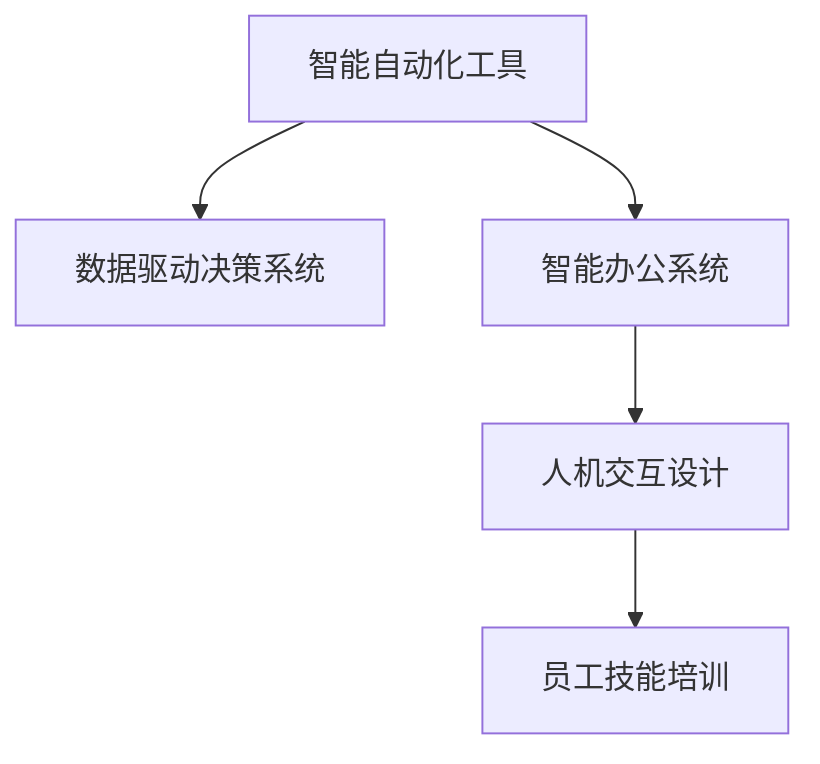

                 

# 人机协作：重塑未来工作模式

> 关键词：人机协作,智能自动化,智能办公系统,工业4.0,数字转型,员工技能提升

## 1. 背景介绍

### 1.1 问题由来

随着技术的快速发展，人工智能(AI)技术正在全面改变我们的工作和生活方式。从制造业到金融业，从医疗保健到教育，AI正在各个领域发挥着越来越重要的作用。与此同时，AI技术与人类的协作也在不断深化，带来了全新的工作模式和生产效率提升。

在工业4.0时代，人机协作已成为推动工业发展和企业竞争力的重要动力。智能自动化和智能化办公系统的大规模应用，使得企业在降低成本、提高生产效率和产品质量的同时，也对员工的技能提出了新的要求。如何让人类与AI技术更好地协同工作，成为当前面临的重要课题。

### 1.2 问题核心关键点

人机协作的本质在于：通过人工智能技术提升人类工作的智能化和自动化水平，同时最大化发挥人类在创造性、决策和情感处理等方面的优势。

人机协作的核心关键点包括：
- 智能自动化工具的应用，如机器学习、自然语言处理、计算机视觉等技术。
- 数据驱动的决策支持系统，通过分析历史数据，提供智能化的业务建议。
- 跨部门协作平台的构建，促进不同部门间的数据共享和协同工作。
- 人机交互设计，优化界面和流程，提高用户体验。
- 员工技能培训与再教育，提升员工适应新的工作环境和工具的能力。

这些关键点共同构成了人机协作的基本框架，为AI技术在企业中的应用奠定了基础。

### 1.3 问题研究意义

研究人机协作技术，对于提升企业的智能化水平，增强企业的市场竞争力，推动产业升级和经济社会发展，具有重要意义：

1. 降低成本。智能自动化工具能够自动完成重复性高、劳动强度大的工作，减少人力成本。
2. 提高效率。数据驱动的决策支持系统能够快速响应市场变化，优化生产流程，提高生产效率。
3. 增强灵活性。智能办公系统能够实现跨部门、跨地域的协作，提升企业的应变能力和反应速度。
4. 促进创新。人机协作使得人类能够专注于创造性和决策性工作，释放出更多时间和精力进行创新。
5. 提升用户体验。优化的人机交互设计能够提高用户的工作满意度和效率，增强用户粘性。

## 2. 核心概念与联系

### 2.1 核心概念概述

为了更好地理解人机协作的原理和实践，我们引入几个关键概念：

- **智能自动化工具**：利用AI技术自动化完成重复性高、耗时长的任务，如机器人流程自动化(RPA)、机器学习、自然语言处理等。
- **数据驱动决策系统**：基于历史数据和实时数据，通过机器学习、统计分析等方法，提供智能化的业务建议和决策支持。
- **智能办公系统**：融合了多个智能自动化工具的集成办公平台，提供跨部门、跨地域的协作和数据共享。
- **人机交互设计**：优化界面和流程，提高用户与系统之间的交互体验，使得用户能够更高效、更自然地使用AI工具。
- **员工技能培训**：通过再教育和持续培训，提升员工对新工具和新技术的掌握能力，适应新的工作环境。

这些概念共同构成了人机协作的完整框架，使得AI技术能够在企业和社会的各个领域发挥作用。

### 2.2 核心概念原理和架构的 Mermaid 流程图



这个流程图展示了人机协作的核心概念之间的联系和交互：智能自动化工具提供自动化功能，数据驱动决策系统提供智能决策支持，智能办公系统提供跨部门协作平台，人机交互设计优化用户体验，员工技能培训提升员工适应性。

## 3. 核心算法原理 & 具体操作步骤

### 3.1 算法原理概述

人机协作的核心算法原理可以总结为以下几个方面：

1. **数据采集与预处理**：通过传感器、监控系统、交互界面等手段，收集数据，并对其进行清洗、标注和归一化处理，以便后续分析。
2. **模型训练与部署**：基于采集到的数据，使用机器学习算法训练模型，并将其部署到生产环境中。
3. **决策与反馈**：根据实时数据，通过智能决策系统提供建议，并根据反馈不断优化模型。
4. **用户交互与反馈**：通过优化人机交互设计，提高用户对系统的接受度和满意度，并根据用户反馈不断改进系统。

### 3.2 算法步骤详解

以下是人机协作系统的具体算法步骤：

**Step 1: 数据采集与预处理**
- 通过传感器、监控系统等设备，采集生产环境、供应链、客户反馈等数据。
- 对采集到的数据进行清洗，去除噪声和异常值。
- 对数据进行标注，如标记事件时间、位置、对象等。
- 对数据进行归一化处理，如将温度、压力等转换为标准单位。

**Step 2: 模型训练与部署**
- 根据采集到的数据，选择合适的算法进行模型训练，如回归、分类、聚类等。
- 使用训练好的模型进行测试和验证，确保模型的准确性和鲁棒性。
- 将模型部署到生产环境中，通过API接口提供服务。

**Step 3: 决策与反馈**
- 根据实时数据，使用模型进行预测和决策。
- 将决策结果反馈给生产系统，如自动调整生产线参数、优化库存等。
- 根据生产系统的反馈，不断优化模型和算法。

**Step 4: 用户交互与反馈**
- 通过用户界面展示决策结果和建议。
- 收集用户反馈，如满意度、建议等。
- 根据用户反馈，不断优化人机交互设计和算法模型。

### 3.3 算法优缺点

人机协作算法的优点包括：
- 自动化程度高。智能自动化工具能够自动完成大量重复性任务，提高工作效率。
- 数据驱动决策。通过数据分析和模型预测，提供科学的决策支持。
- 实时响应。实时数据和模型决策，使得系统能够快速响应市场变化。
- 跨部门协作。智能办公系统实现跨部门、跨地域的数据共享和协同工作。

同时，人机协作算法也存在一些局限性：
- 数据质量和多样性。数据采集和处理的准确性直接影响到系统的性能。
- 模型泛化能力。模型的泛化能力决定了其在不同场景下的适用性。
- 用户接受度。人机交互设计需要考虑用户的使用习惯和接受度。
- 技术复杂性。实现复杂的人机协作系统需要多学科的协同合作。

### 3.4 算法应用领域

人机协作技术已经在多个领域得到了广泛应用，如：

- 制造业：通过智能自动化工具和数据驱动决策系统，实现智能生产、质量控制和供应链管理。
- 金融业：使用AI进行风险评估、投资建议和客户服务。
- 医疗保健：使用AI进行诊断、治疗方案推荐和患者管理。
- 教育领域：通过智能教学系统和个性化学习平台，提升教育质量和学习效果。
- 零售业：利用AI进行库存管理、客户推荐和营销活动优化。

## 4. 数学模型和公式 & 详细讲解 & 举例说明

### 4.1 数学模型构建

人机协作系统的数学模型可以基于统计学、机器学习和控制论等学科的理论构建。

假设有一个智能自动化系统，用于控制生产线上的机器设备。该系统采集到的实时数据包括机器的运行状态、能源消耗、生产效率等。系统基于历史数据和实时数据，使用线性回归模型预测未来的能源消耗和生产效率。

**线性回归模型**：
$$ y = \beta_0 + \beta_1 x_1 + \beta_2 x_2 + ... + \beta_n x_n + \epsilon $$
其中，$y$ 表示预测结果，$\beta$ 表示模型参数，$x$ 表示输入特征，$\epsilon$ 表示随机误差。

### 4.2 公式推导过程

对于线性回归模型，其最小二乘估计公式为：
$$ \hat{\beta} = (X^TX)^{-1}X^Ty $$
其中，$\hat{\beta}$ 表示模型参数的最小二乘估计，$X$ 表示输入特征矩阵，$y$ 表示输出数据向量。

使用梯度下降算法更新模型参数：
$$ \theta^{(k+1)} = \theta^{(k)} - \eta \nabla_{\theta} L $$
其中，$\theta$ 表示模型参数，$\eta$ 表示学习率，$L$ 表示损失函数。

### 4.3 案例分析与讲解

假设有一个智能工厂，需要预测未来生产线的能耗和效率。系统采集到以下数据：

| 时间 | 能耗(kW) | 生产效率(件/小时) |
|------|----------|------------------|
| 8:00  | 500      | 80               |
| 9:00  | 550      | 75               |
| 10:00 | 600      | 70               |
| ...  | ...      | ...              |

系统使用线性回归模型进行预测，得到以下模型参数：
$$ \hat{y} = 500 + 0.2x_1 + 0.1x_2 $$

在t=12:00时，输入能耗为650kW，生产效率为50件/小时，系统预测能耗为680kW，生产效率为45件/小时。

## 5. 项目实践：代码实例和详细解释说明

### 5.1 开发环境搭建

在进行人机协作系统的开发前，我们需要准备好开发环境。以下是使用Python进行PyTorch开发的环境配置流程：

1. 安装Anaconda：从官网下载并安装Anaconda，用于创建独立的Python环境。

2. 创建并激活虚拟环境：
```bash
conda create -n pytorch-env python=3.8 
conda activate pytorch-env
```

3. 安装PyTorch：根据CUDA版本，从官网获取对应的安装命令。例如：
```bash
conda install pytorch torchvision torchaudio cudatoolkit=11.1 -c pytorch -c conda-forge
```

4. 安装TensorFlow：由Google主导开发的开源深度学习框架，生产部署方便，适合大规模工程应用。同样有丰富的预训练语言模型资源。

5. 安装TensorFlow：
```bash
pip install tensorflow
```

6. 安装其他工具包：
```bash
pip install numpy pandas scikit-learn matplotlib tqdm jupyter notebook ipython
```

完成上述步骤后，即可在`pytorch-env`环境中开始开发。

### 5.2 源代码详细实现

以下是使用PyTorch对生产设备能耗预测模型进行训练的完整代码实现：

```python
import torch
import torch.nn as nn
import torch.optim as optim
from sklearn.model_selection import train_test_split

# 导入数据
data = {
    'x1': [500, 550, 600],
    'x2': [80, 75, 70],
    'y': [680, 750, 800]
}

# 划分训练集和测试集
X_train, X_test, y_train, y_test = train_test_split(data['x1'], data['x2'], data['y'], test_size=0.2)

# 构建模型
class RegressionModel(nn.Module):
    def __init__(self):
        super(RegressionModel, self).__init__()
        self.linear = nn.Linear(2, 1)

    def forward(self, x):
        return self.linear(x)

# 定义损失函数和优化器
model = RegressionModel()
criterion = nn.MSELoss()
optimizer = optim.SGD(model.parameters(), lr=0.01)

# 训练模型
for epoch in range(100):
    model.train()
    optimizer.zero_grad()
    predictions = model(X_train)
    loss = criterion(predictions, y_train)
    loss.backward()
    optimizer.step()

# 测试模型
model.eval()
with torch.no_grad():
    predictions = model(X_test)
    loss = criterion(predictions, y_test)
    print('Test Loss:', loss.item())

# 预测新数据
new_data = torch.tensor([[650, 50]])
predictions = model(new_data)
print('Predicted Consumption:', predictions.item())
```

### 5.3 代码解读与分析

让我们再详细解读一下关键代码的实现细节：

**数据预处理**：
- 通过`train_test_split`函数将数据集划分为训练集和测试集。

**模型定义**：
- 使用PyTorch的`nn.Linear`定义线性回归模型，输入特征为两个，输出特征为一个。

**损失函数和优化器**：
- 使用均方误差损失函数`nn.MSELoss`。
- 使用随机梯度下降优化器`optim.SGD`，学习率为0.01。

**模型训练**：
- 循环迭代100次，每次前向传播计算预测值，反向传播更新模型参数。

**模型测试**：
- 在测试集上计算损失，评估模型性能。

**模型预测**：
- 使用训练好的模型对新数据进行预测。

## 6. 实际应用场景

### 6.1 智能制造

智能制造是人机协作技术的重要应用场景之一。通过智能自动化和数据驱动的决策系统，智能制造能够实现生产线的自动化和智能化管理，提高生产效率和产品质量。

例如，某智能工厂使用AI进行生产线设备的预测性维护。系统通过采集设备的运行状态、传感器数据等，使用时间序列模型预测设备的故障概率。系统根据预测结果，提前进行维护和检修，避免设备故障对生产造成影响。

### 6.2 智慧医疗

智慧医疗是另一个典型的应用场景。AI技术在医疗领域的应用已经非常广泛，包括影像诊断、治疗方案推荐、患者管理等。

例如，某医院使用AI进行病历数据分析和诊断。系统采集患者的病历数据，包括病史、检查结果、治疗记录等，使用机器学习模型分析病人的健康状况和疾病风险，提供个性化的治疗方案。

### 6.3 智能客服

智能客服系统也是人机协作技术的重要应用。通过智能自动化和自然语言处理技术，智能客服能够提供24小时不间断的客户服务，提升用户体验和满意度。

例如，某电商平台使用AI进行智能客服的部署。系统通过收集客户的咨询记录和历史数据，使用机器学习模型分析客户的提问意图和行为模式，提供个性化的服务建议。

## 7. 工具和资源推荐

### 7.1 学习资源推荐

为了帮助开发者系统掌握人机协作技术，这里推荐一些优质的学习资源：

1. 《深度学习》课程：斯坦福大学开设的深度学习经典课程，涵盖了机器学习、深度学习的基础理论和方法。
2. 《Python数据科学手册》：由Jake VanderPlas撰写，详细介绍了Python在数据科学中的应用，包括机器学习、数据可视化和自然语言处理。
3. 《自然语言处理入门》课程：由吴恩达教授主讲，涵盖了自然语言处理的基本概念和经典模型。
4. 《机器学习实战》书籍：由Peter Harrington撰写，提供了丰富的机器学习实践案例和代码实现。

通过对这些资源的学习实践，相信你一定能够快速掌握人机协作技术的精髓，并用于解决实际的业务问题。

### 7.2 开发工具推荐

高效的开发离不开优秀的工具支持。以下是几款用于人机协作开发的常用工具：

1. PyTorch：基于Python的开源深度学习框架，灵活动态的计算图，适合快速迭代研究。大部分预训练语言模型都有PyTorch版本的实现。
2. TensorFlow：由Google主导开发的开源深度学习框架，生产部署方便，适合大规模工程应用。同样有丰富的预训练语言模型资源。
3. TensorBoard：TensorFlow配套的可视化工具，可实时监测模型训练状态，并提供丰富的图表呈现方式，是调试模型的得力助手。
4. Weights & Biases：模型训练的实验跟踪工具，可以记录和可视化模型训练过程中的各项指标，方便对比和调优。
5. Jupyter Notebook：交互式开发环境，支持多种编程语言和科学计算库，方便开发和交流。

合理利用这些工具，可以显著提升人机协作任务的开发效率，加快创新迭代的步伐。

### 7.3 相关论文推荐

人机协作技术的研究涉及多个学科，包括计算机科学、工程学、经济学等。以下是几篇奠基性的相关论文，推荐阅读：

1. "Human-Computer Collaboration: A Survey of Current Trends and Future Directions"：由Cunnigham等撰写，全面综述了人机协作技术的研究进展和应用现状。
2. "The Role of Artificial Intelligence in Manufacturing: A Review"：由Meyer等撰写，介绍了AI在制造业中的应用，包括智能制造、预测性维护等。
3. "Deep Learning for Healthcare: A Review"：由Lamontagne等撰写，综述了AI在医疗领域的应用，包括影像诊断、治疗方案推荐等。
4. "Natural Language Processing: Past, Present, and Future"：由Jurafsky等撰写，详细介绍了自然语言处理的发展历程和前沿技术。

这些论文代表了人机协作技术的发展脉络，有助于理解该领域的核心问题和研究趋势。

## 8. 总结：未来发展趋势与挑战

### 8.1 总结

本文对人机协作技术进行了全面系统的介绍。首先阐述了人机协作的战略意义和关键点，明确了该技术在提升生产效率、优化决策支持等方面的独特价值。其次，从原理到实践，详细讲解了人机协作的数学模型和关键步骤，给出了具体的数据处理和模型训练代码。同时，本文还广泛探讨了人机协作在智能制造、智慧医疗、智能客服等多个行业领域的应用前景，展示了人机协作技术的广泛适用性。最后，本文精选了学习资源、开发工具和相关论文，力求为读者提供全方位的技术指引。

通过本文的系统梳理，可以看到，人机协作技术正在成为推动企业智能化和自动化发展的核心动力。其涉及的智能自动化、数据驱动决策、智能办公系统等多个方面，共同构建了一个全面、高效的人机协作框架，为企业带来巨大的生产力和市场竞争优势。

### 8.2 未来发展趋势

展望未来，人机协作技术的发展将呈现以下几个趋势：

1. 自动化程度的提升。随着技术的发展，智能自动化工具的智能化水平将进一步提升，能够处理更加复杂和灵活的任务。
2. 数据驱动决策的深化。基于实时数据和历史数据的决策系统将变得更加精准和智能，能够提供更科学的决策支持。
3. 跨部门协作的增强。智能办公系统将更加灵活和开放，实现跨部门、跨地域的协作和数据共享。
4. 人机交互设计的优化。人机交互设计将更加注重用户体验，提升系统的易用性和友好性。
5. 员工技能培训的普及。通过再教育和持续培训，员工能够更好地适应新的工作环境和工具，提升工作效率和质量。

这些趋势将推动人机协作技术向更加智能化、普适化方向发展，为各行各业带来新的变革和机遇。

### 8.3 面临的挑战

尽管人机协作技术已经取得了瞩目成就，但在迈向更加智能化、普适化应用的过程中，仍面临诸多挑战：

1. 数据质量和多样性。数据采集和处理的准确性直接影响到系统的性能，需要在不同环境和条件下进行全面的数据收集和预处理。
2. 模型的泛化能力。模型的泛化能力决定了其在不同场景下的适用性，需要通过更多的数据和算法优化来提高模型的鲁棒性。
3. 人机交互设计。人机交互设计需要考虑用户的使用习惯和接受度，需要经过多轮迭代和优化。
4. 技术复杂性。实现复杂的人机协作系统需要多学科的协同合作，需要跨部门的沟通和协作。

正视这些挑战，积极应对并寻求突破，将是人机协作技术迈向成熟的必由之路。相信随着学界和产业界的共同努力，这些挑战终将一一被克服，人机协作技术必将在构建智能化工作环境方面发挥更大的作用。

### 8.4 研究展望

未来，人机协作技术的研究需要在以下几个方面寻求新的突破：

1. 探索更加高效的机器学习算法和优化方法。开发更加参数高效、计算高效的算法，提高人机协作系统的实时性和鲁棒性。
2. 引入更多先验知识。将符号化的先验知识，如知识图谱、逻辑规则等，与神经网络模型进行巧妙融合，增强系统的可解释性和可靠性。
3. 优化人机交互设计。引入更多的设计原则和方法，如认知心理学、人因工程等，提高系统的易用性和用户体验。
4. 融合更多技术领域。将人机协作技术与其他技术进行深入融合，如知识表示、因果推理、强化学习等，多路径协同发力，共同推动智能化的发展。

这些研究方向将进一步推动人机协作技术的进步，为构建安全、可靠、高效、智能的协作系统铺平道路。

## 9. 附录：常见问题与解答

**Q1：人机协作技术在实际应用中存在哪些挑战？**

A: 人机协作技术在实际应用中面临的主要挑战包括：
1. 数据质量和多样性。数据采集和处理的准确性直接影响到系统的性能，需要在不同环境和条件下进行全面的数据收集和预处理。
2. 模型的泛化能力。模型的泛化能力决定了其在不同场景下的适用性，需要通过更多的数据和算法优化来提高模型的鲁棒性。
3. 人机交互设计。人机交互设计需要考虑用户的使用习惯和接受度，需要经过多轮迭代和优化。
4. 技术复杂性。实现复杂的人机协作系统需要多学科的协同合作，需要跨部门的沟通和协作。

**Q2：人机协作技术如何提高生产效率？**

A: 人机协作技术通过智能自动化和数据驱动的决策系统，提高生产效率的方式包括：
1. 智能自动化工具。利用AI技术自动化完成重复性高、耗时长的任务，提高工作效率。
2. 数据驱动决策。通过数据分析和模型预测，提供科学的决策支持，优化生产流程和资源配置。
3. 实时响应。实时数据和模型决策，使得系统能够快速响应市场变化，调整生产计划和参数。
4. 跨部门协作。智能办公系统实现跨部门、跨地域的数据共享和协同工作，提高生产协调性和效率。

**Q3：如何提高人机协作系统的鲁棒性和可解释性？**

A: 提高人机协作系统的鲁棒性和可解释性需要从多个方面入手：
1. 数据预处理。通过数据清洗和归一化，去除噪声和异常值，提高数据质量。
2. 模型优化。引入更多的正则化技术、对抗训练等方法，提高模型的泛化能力和鲁棒性。
3. 解释性模型。使用可解释性强的模型，如决策树、线性回归等，提升模型的可解释性和透明度。
4. 跨学科研究。引入符号化的先验知识，如知识图谱、逻辑规则等，增强系统的可解释性。

**Q4：人机协作技术在未来的发展方向是什么？**

A: 人机协作技术在未来的发展方向包括：
1. 自动化程度的提升。随着技术的发展，智能自动化工具的智能化水平将进一步提升，能够处理更加复杂和灵活的任务。
2. 数据驱动决策的深化。基于实时数据和历史数据的决策系统将变得更加精准和智能，能够提供更科学的决策支持。
3. 跨部门协作的增强。智能办公系统将更加灵活和开放，实现跨部门、跨地域的协作和数据共享。
4. 人机交互设计的优化。人机交互设计将更加注重用户体验，提升系统的易用性和友好性。
5. 员工技能培训的普及。通过再教育和持续培训，员工能够更好地适应新的工作环境和工具，提升工作效率和质量。

**Q5：人机协作技术在各行业的应用前景是什么？**

A: 人机协作技术在各行业的应用前景包括：
1. 智能制造。通过智能自动化和数据驱动的决策系统，实现生产线的自动化和智能化管理，提高生产效率和产品质量。
2. 智慧医疗。利用AI进行诊断、治疗方案推荐、患者管理等，提升医疗质量和效率。
3. 智能客服。提供24小时不间断的客户服务，提升用户体验和满意度。
4. 金融服务。使用AI进行风险评估、投资建议、客户服务等，提升金融服务水平。
5. 零售业。利用AI进行库存管理、客户推荐、营销活动优化等，提升零售业务效率和客户体验。

总之，人机协作技术将在各个领域带来新的变革和机遇，推动经济社会的数字化转型升级。

