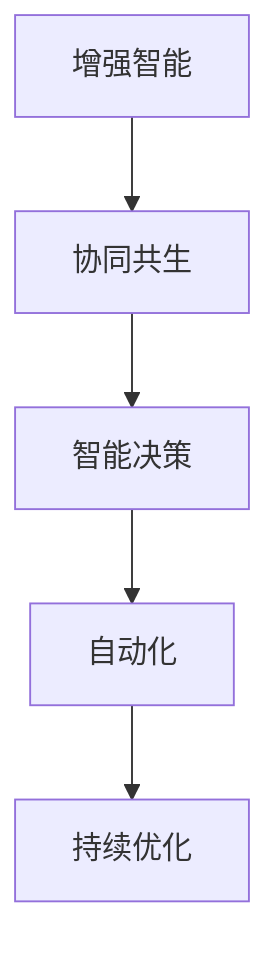

                 

# 人机协同：未来工作的核心驱动力

> 关键词：人机协同,未来工作,人工智能,自动化,增强智能,智能决策,人类福祉,协同共生

## 1. 背景介绍

### 1.1 问题由来

随着科技的快速发展，人工智能（AI）和自动化技术正深刻改变着我们的工作方式。从工业制造到服务业，从教育医疗到金融银行业，机器和算法正在逐渐替代人类完成重复性、规律性强的工作，提高效率和精度。然而，这种技术进步带来的并非只有便利，而是更复杂的人机协同关系。

一方面，人类对AI的依赖逐渐增强，导致其独立解决问题的能力减弱，智能退化成为可能。另一方面，人类与机器的关系亦由“辅助者”转变为“协同者”，AI能力已经足以完成部分任务，但其决策机制和结果可解释性仍未完全满足人类的需求。

在这样的背景下，如何实现人机协同，确保AI技术既有效利用人类的智慧，又保障其符合人类的价值观和道德规范，成为摆在我们面前的重大课题。本文档将深入探讨这一问题的解决方案，并提出基于AI增强智能的协同工作框架，以期为未来的工作模式转型提供参考。

## 2. 核心概念与联系

### 2.1 核心概念概述

要理解人机协同的核心驱动力，首先要明确以下关键概念：

- **增强智能(Enhanced Intelligence)**：即利用AI技术，辅助人类决策，增强其工作效率和决策能力。
- **协同共生(Co-Creation)**：指AI和人类共同创造价值，而不是替代人类。AI作为人类工作的辅助工具，在决策过程中提供数据支持和智能化建议。
- **智能决策(Intelligent Decision-Making)**：即在分析、理解数据的基础上，智能地做出决策。
- **自动化(Automation)**：指利用机器自动化执行重复性、规律性强的工作。

这些概念共同构成了一个未来工作模式框架，即通过增强智能和协同共生，推动人类工作模式的智能化转型。

### 2.2 核心概念原理和架构的 Mermaid 流程图



这个流程图展示了一个完整的未来工作模式框架，其中增强智能是基础，协同共生是目标，智能决策是手段，自动化是技术支持，而持续优化是不断改进的关键。

## 3. 核心算法原理 & 具体操作步骤

### 3.1 算法原理概述

基于增强智能和协同共生的工作模式，其核心算法原理在于通过AI辅助决策，同时确保人机协同，既充分利用AI的优势，又避免过度依赖，确保人类智慧在决策中的主导地位。

其基本工作流程如下：

1. **数据输入与处理**：人类向AI提供需要分析的数据或任务，AI通过预处理和预训练模型对数据进行初步分析。
2. **智能决策**：AI利用增强智能算法，如逻辑回归、神经网络等，对数据进行分析，生成决策建议。
3. **协同共生**：人类在接收AI建议后，综合自身经验和判断，做出最终决策。同时，AI不断学习和优化，以更好地辅助人类决策。

### 3.2 算法步骤详解

以一个简单的采购决策为例，展示这一流程：

1. **需求分析**：
   - **数据输入**：市场分析报告、历史采购数据、供应商资料等。
   - **预处理**：数据清洗、格式转换等。
   - **预训练模型**：使用增强智能算法（如深度学习模型）进行数据预测和分析。

2. **智能决策**：
   - **数据分析**：通过机器学习算法分析市场趋势、供应商价格、产品质量等。
   - **建议生成**：生成基于数据分析的采购建议，如供应商选择、采购数量等。
   - **结果解释**：AI向人类解释其分析依据和建议理由。

3. **协同共生**：
   - **决策结合**：人类结合AI建议，综合自身经验和市场判断，做出采购决策。
   - **反馈优化**：人类反馈AI决策建议的效果，AI根据反馈不断优化模型和算法。

### 3.3 算法优缺点

增强智能和协同共生的算法具备以下优点：

- **效率提升**：自动化处理大量重复性任务，极大提升工作效率。
- **准确性提高**：机器分析数据比人类更为细致和精确，提升决策准确性。
- **决策优化**：AI辅助决策可提供多个方案，供人类选择，优化决策结果。

但同时也存在缺点：

- **数据依赖**：依赖数据质量，数据不完整或不准确可能导致决策偏差。
- **可解释性不足**：AI决策过程难以解释，可能无法满足人类对决策透明度的要求。
- **过度依赖风险**：过度依赖AI可能导致人类能力退化，智能退化成为可能。

### 3.4 算法应用领域

基于增强智能和协同共生的算法，可以广泛应用于多个领域：

- **工业制造**：使用AI预测生产流程，优化生产效率，减少资源浪费。
- **金融服务**：利用AI进行风险评估、投资建议、客户服务。
- **医疗健康**：通过AI分析病历数据，辅助医生决策，提高诊疗准确性。
- **教育培训**：AI辅助课程设计、学生评估、个性化学习推荐。
- **公共管理**：AI进行城市规划、交通优化、公共安全管理。
- **人力资源**：使用AI进行招聘筛选、员工培训、绩效评估。

## 4. 数学模型和公式 & 详细讲解

### 4.1 数学模型构建

以一个简单的采购决策为例，构建基本的数学模型。设采购量为 $Q$，供应商价格为 $P$，市场预测需求为 $D$，则决策目标为：

$$
\min_{Q,P} \{cost(Q, P) + penalty(D - Q)\}
$$

其中 $cost(Q, P)$ 表示采购和运输成本，$penalty(D - Q)$ 表示因供需不匹配导致的罚金。

### 4.2 公式推导过程

对于上述决策问题，可以利用优化算法进行求解，如线性规划、整数规划等。以线性规划为例，可将问题转化为标准线性规划问题：

$$
\min_{Q,P} \{w_1 \cdot cost(Q, P) + w_2 \cdot penalty(D - Q)\}
$$

其中 $w_1$ 和 $w_2$ 为权系数，表示采购成本和供需匹配的重要性。

### 4.3 案例分析与讲解

假设市场预测需求为1000件，当前供应商A报价每件10元，供应商B报价每件12元。成本函数为 $cost(Q, P) = Q \cdot P$，罚金函数为 $penalty(D - Q) = (D - Q)^2$。

- **供应商选择**：使用线性规划求解，选择最优的供应商。
- **采购量确定**：在确定供应商后，计算最优采购量 $Q$。
- **结果解释**：分析决策依据和优化路径，确保决策透明。

## 5. 项目实践：代码实例和详细解释说明

### 5.1 开发环境搭建

开发环境搭建步骤如下：

1. **环境安装**：安装Python、Jupyter Notebook、PyTorch等。
2. **数据准备**：准备市场分析报告、历史采购数据、供应商资料等。
3. **模型训练**：使用PyTorch训练增强智能模型，并保存模型。

### 5.2 源代码详细实现

以下是一个基于PyTorch的增强智能决策模型的实现代码：

```python
import torch
import torch.nn as nn
import torch.optim as optim

# 定义模型
class DecisionModel(nn.Module):
    def __init__(self):
        super(DecisionModel, self).__init__()
        self.fc1 = nn.Linear(3, 64)
        self.fc2 = nn.Linear(64, 2)

    def forward(self, x):
        x = self.fc1(x)
        x = torch.relu(x)
        x = self.fc2(x)
        return x

# 加载数据
data = torch.load('data.pt')

# 定义模型、损失函数和优化器
model = DecisionModel()
criterion = nn.MSELoss()
optimizer = optim.Adam(model.parameters(), lr=0.001)

# 训练模型
for epoch in range(100):
    optimizer.zero_grad()
    output = model(data)
    loss = criterion(output, target)
    loss.backward()
    optimizer.step()

# 使用模型进行决策
data_test = torch.load('test_data.pt')
output = model(data_test)
```

### 5.3 代码解读与分析

上述代码实现了基于线性回归的增强智能决策模型。其中，输入数据为供应商价格、市场预测需求和采购成本，输出为最优采购量和供应商选择。模型训练和决策过程如下：

- **模型定义**：定义线性回归模型，包含两个全连接层。
- **数据加载**：加载训练数据和测试数据。
- **模型训练**：使用Adam优化器训练模型，最小化损失函数。
- **模型使用**：使用训练好的模型进行决策，返回最优采购量和供应商选择。

## 6. 实际应用场景

### 6.1 智能制造

在智能制造领域，基于增强智能和协同共生的算法可以实现生产流程的优化。通过实时监控生产线数据，AI可以预测设备故障，优化生产调度，减少停机时间，提高生产效率。

### 6.2 金融风险管理

金融领域面临复杂的市场波动和风险管理需求。通过增强智能算法，AI可以分析市场趋势、评估信用风险，为投资者提供投资建议，辅助决策。

### 6.3 医疗健康管理

在医疗健康领域，AI可以辅助医生进行诊断和治疗决策，优化药物选择，提升患者治疗效果。同时，AI也可以用于医院运营管理，优化资源配置，提升患者满意度。

### 6.4 教育个性化推荐

教育领域面临大量学生个性化需求。通过增强智能算法，AI可以为每个学生制定个性化学习计划，推荐适合的课程和学习资源，提高学习效果。

### 6.5 智能城市管理

智能城市需要大量数据支撑，如交通流量、环境监测等。通过增强智能算法，AI可以实现城市交通优化、垃圾分类、能源管理等，提升城市管理效率。

### 6.6 人力资源优化

人力资源管理需要大量的数据分析和决策支持。通过增强智能算法，AI可以优化招聘流程、员工培训、绩效评估，提升人力资源管理效率。

## 7. 工具和资源推荐

### 7.1 学习资源推荐

1. **Coursera**：提供多门人工智能、机器学习和数据科学课程。
2. **Udacity**：提供深度学习、增强智能、自然语言处理等课程。
3. **Kaggle**：提供大量数据集和竞赛，实践增强智能和协同共生。
4. **arXiv**：提供最新的人工智能和增强智能论文。

### 7.2 开发工具推荐

1. **Python**：主流编程语言，支持丰富的AI库和框架。
2. **PyTorch**：深度学习框架，支持动态计算图和模型优化。
3. **TensorFlow**：深度学习框架，支持分布式训练和模型优化。
4. **Jupyter Notebook**：支持代码编写、运行和展示，方便开发和分享。

### 7.3 相关论文推荐

1. **《Deep Learning》**：Ian Goodfellow等著，深度学习理论和技术基础。
2. **《Human-AI Collaboration》**：D'Ambrosio等著，人机协同的理论与实践。
3. **《Intelligent Decision Making》**：Pearl等著，智能决策的理论与算法。

## 8. 总结：未来发展趋势与挑战

### 8.1 研究成果总结

人机协同的未来工作模式已经初步形成，并在多个领域得到应用。未来，随着增强智能和协同共生技术的不断发展，这种工作模式将更加普及和高效。

### 8.2 未来发展趋势

1. **增强智能普及**：随着AI技术不断进步，增强智能将逐步普及到更多领域，辅助人类决策。
2. **协同共生深化**：人机协同将更加深入，人类和AI共同创造价值，实现“增强型协作”。
3. **智能决策提升**：智能决策算法不断优化，提升决策效率和准确性。
4. **自动化转型**：更多的重复性和规律性强的工作将被自动化，释放人类潜力。

### 8.3 面临的挑战

1. **数据依赖**：依赖高质量数据，数据不完整或不准确可能导致决策偏差。
2. **可解释性不足**：AI决策过程难以解释，可能无法满足人类对决策透明度的要求。
3. **过度依赖风险**：过度依赖AI可能导致人类能力退化，智能退化成为可能。

### 8.4 研究展望

未来，人机协同技术需要解决数据依赖、可解释性不足、过度依赖等挑战，提升AI的透明度和可靠性，确保其辅助决策的合理性和公平性。

## 9. 附录：常见问题与解答

**Q1：增强智能和协同共生如何实现？**

A: 增强智能和协同共生的实现主要依赖AI技术，如机器学习、深度学习等。通过AI分析数据，生成决策建议，结合人类经验，做出最终决策。

**Q2：AI决策的可解释性不足如何解决？**

A: 解决AI决策可解释性不足的方法包括模型简化、结果可视化、决策透明化等。通过提高模型的可解释性，确保人类对AI决策的理解和信任。

**Q3：如何避免过度依赖AI？**

A: 避免过度依赖AI需要建立良好的工作流程，结合AI建议，综合人类经验和判断，确保人类智慧在决策中的主导地位。同时，定期进行员工培训，提升人类技能。

**Q4：增强智能和协同共生的应用范围有哪些？**

A: 增强智能和协同共生的应用范围包括工业制造、金融服务、医疗健康、教育培训、公共管理、人力资源等多个领域。

**Q5：增强智能和协同共生的未来发展方向是什么？**

A: 增强智能和协同共生的未来发展方向包括增强智能普及、协同共生深化、智能决策提升和自动化转型。这些方向将推动未来工作模式进一步智能化和高效化。

---

作者：禅与计算机程序设计艺术 / Zen and the Art of Computer Programming

