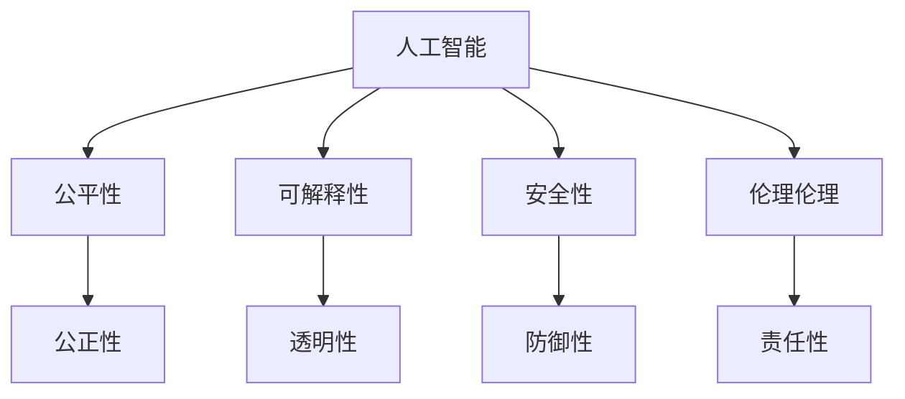

                 

# 人类-AI协作：为人类服务的设计

## 1. 背景介绍

在过去几十年里，人工智能(AI)技术迅猛发展，从最初的算法研究到深度学习、自然语言处理、计算机视觉等领域的突破，AI已渗透到各行各业，成为驱动创新和经济增长的新引擎。然而，伴随AI技术能力的提升，关于其伦理、公平、安全性等问题也愈发凸显。如何在追求技术进步的同时，确保AI为人类服务的初心不变，成为当下AI领域亟需解决的重大课题。本文将围绕人类-AI协作这一核心主题，深入探讨如何构建为人类服务的设计理念，并结合具体应用场景，提出可行的解决方案。

## 2. 核心概念与联系

### 2.1 核心概念概述

为了更好地理解人类-AI协作的核心理念，本节将介绍几个密切相关的核心概念：

- 人工智能(AI)：通过计算机算法和计算资源，使机器具备一定程度的智能行为，能够处理复杂问题、进行自主决策等。
- 人类-AI协作：指在实现AI功能的同时，确保其行为和决策过程对人类有益，服务于人类福祉和社会发展的合作模式。
- 公平性(Fairness)：AI系统在处理各类数据时，应遵循公正、不歧视的原则，确保不同群体之间的平等权益。
- 可解释性(Explainability)：AI系统的决策过程应能够被人类理解，揭示其内部逻辑和推理路径，增强系统的可信度。
- 安全性(Security)：AI系统在运行过程中应保证数据和模型的安全性，防止被恶意攻击或滥用，保障人机交互的安全性。
- 伦理伦理(Ethics)：AI系统在设计、开发和应用中应遵循伦理道德原则，确保技术应用符合人类价值观和社会规范。

这些核心概念之间的逻辑关系可以通过以下Mermaid流程图来展示：



这个流程图展示了大语言模型的核心概念及其之间的关系：

1. 人工智能通过各种算法和模型实现智能功能。
2. 公平性、可解释性、安全性、伦理伦理是构建人类-AI协作的重要考量。
3. 通过合理设计和应用这些原则，AI系统可以更好地服务于人类。

## 3. 核心算法原理 & 具体操作步骤

### 3.1 算法原理概述

人类-AI协作的核心在于构建一个既能发挥AI优势，又能兼顾人类价值需求的系统架构。算法的关键在于如何设计合理的目标函数，同时确保系统的透明度和可解释性。一个典型的协作系统包含以下几个关键步骤：

1. 数据收集：收集与任务相关的数据，包括文本、图像、视频等多种类型。
2. 数据预处理：清洗数据，标准化格式，增加数据多样性，减少噪声和偏差。
3. 模型训练：选择合适的模型，设置合适的超参数，利用标注数据进行有监督训练。
4. 模型评估：在验证集上评估模型性能，调整超参数以优化效果。
5. 模型部署：将训练好的模型集成到实际应用中，进行持续优化。
6. 反馈机制：收集用户反馈，持续改进模型，提升用户体验。

### 3.2 算法步骤详解

以一个医疗诊断系统为例，详细介绍人类-AI协作的具体操作步骤：

**Step 1: 数据收集与预处理**
- 收集医学影像、患者病历、实验室检查结果等医疗数据。
- 对数据进行去标识化处理，保护患者隐私。
- 标注数据，生成训练集、验证集和测试集。

**Step 2: 选择模型**
- 根据任务特性，选择适当的模型，如卷积神经网络(CNN)、长短期记忆网络(LSTM)等。
- 预训练模型的选择，如BERT、ResNet等，或者使用迁移学习的方式，在特定任务上微调预训练模型。

**Step 3: 模型训练**
- 在训练集上进行模型训练，设置合适的损失函数和优化器。
- 进行超参数调优，选择学习率、批大小等。
- 引入正则化技术，防止过拟合。

**Step 4: 模型评估**
- 在验证集上评估模型性能，如准确率、召回率、F1值等。
- 根据评估结果调整模型结构或超参数。

**Step 5: 模型部署**
- 将训练好的模型部署到实际医疗系统中，进行线上服务。
- 持续收集患者反馈，实时调整模型。

**Step 6: 反馈机制**
- 收集患者和医生的反馈，识别系统性能瓶颈。
- 根据反馈不断优化模型，提高诊断准确性和用户体验。

### 3.3 算法优缺点

人类-AI协作方法具有以下优点：
1. 充分利用AI高效计算和复杂处理能力，提升诊断和治疗效率。
2. 通过合作，减少人为错误和偏误，提高诊断和治疗的准确性。
3. 合理应用AI技术，确保数据隐私和伦理安全。
4. 优化用户界面，提高医疗系统的易用性和接受度。

同时，该方法也存在一定的局限性：
1. 对标注数据质量依赖较大，标注成本较高。
2. AI模型的决策过程可解释性不足，难以满足医疗领域的高要求。
3. 系统需要不断维护和更新，确保实时性和准确性。
4. 不同文化背景、伦理道德观可能影响AI系统应用效果。

尽管存在这些局限性，但就目前而言，人类-AI协作是实现AI在实际应用中的理想范式，具有广泛的应用前景。未来相关研究的重点在于如何进一步降低对标注数据的依赖，提高系统的可解释性和伦理性，同时兼顾系统安全性和实效性。

### 3.4 算法应用领域

人类-AI协作技术在医疗、金融、教育、智能客服等多个领域得到广泛应用，具体如下：

- **医疗诊断**：利用AI辅助医生诊断疾病，减少误诊和漏诊，提高诊断准确性。
- **金融风控**：运用AI分析市场趋势，识别风险因素，辅助决策制定。
- **智能客服**：通过AI进行自然语言处理，提升客户服务体验和效率。
- **教育辅助**：AI辅助个性化学习，提供智能推荐和反馈，提升学习效果。
- **智能交通**：AI辅助智能导航，优化交通流量，提升道路安全。

这些领域的应用展示了人类-AI协作的广泛潜力，为各行各业的数字化转型提供了新方向。

## 4. 数学模型和公式 & 详细讲解 & 举例说明

### 4.1 数学模型构建

以下以医疗诊断系统为例，介绍模型构建的数学基础。

设医生对病历的诊断结果为 $y \in \{0,1\}$，其中 $y=1$ 表示患有某种疾病，$y=0$ 表示未患有。将病历数据 $x$ 输入到AI模型，输出诊断结果 $\hat{y}$。为了评估模型的诊断性能，可以使用二分类交叉熵损失函数：

$$
\ell(y,\hat{y})=-y\log \hat{y}-(1-y)\log (1-\hat{y})
$$

其中，$y$ 为真实诊断结果，$\hat{y}$ 为模型预测结果。

### 4.2 公式推导过程

根据交叉熵损失函数的定义，可以将其推导为：

$$
\mathcal{L}=\frac{1}{N}\sum_{i=1}^N \ell(y_i,\hat{y}_i)
$$

其中 $N$ 为样本总数，$(y_i,\hat{y}_i)$ 为第 $i$ 个样本的真实标签和预测标签。

### 4.3 案例分析与讲解

以一个简单的文本分类任务为例，说明模型训练的具体过程。

**数据准备**
- 收集1000篇文本，其中500篇为正样本，500篇为负样本。
- 将文本数据转化为模型所需的输入格式，如将文本转化为词向量。

**模型训练**
- 选择合适的模型，如BERT模型，设置合适的超参数。
- 利用交叉熵损失函数训练模型，在验证集上调整模型参数。

**模型评估**
- 在测试集上评估模型性能，如准确率、召回率、F1值等。
- 根据评估结果，优化模型结构或超参数。

**模型部署**
- 将训练好的模型集成到实际应用中，进行线上服务。
- 持续收集用户反馈，实时调整模型。

## 5. 项目实践：代码实例和详细解释说明

### 5.1 开发环境搭建

在进行人类-AI协作系统开发前，我们需要准备好开发环境。以下是使用Python进行TensorFlow开发的环境配置流程：

1. 安装Anaconda：从官网下载并安装Anaconda，用于创建独立的Python环境。

2. 创建并激活虚拟环境：
```bash
conda create -n tf-env python=3.8 
conda activate tf-env
```

3. 安装TensorFlow：根据CUDA版本，从官网获取对应的安装命令。例如：
```bash
conda install tensorflow -c tf
```

4. 安装各类工具包：
```bash
pip install numpy pandas scikit-learn matplotlib tqdm jupyter notebook ipython
```

完成上述步骤后，即可在`tf-env`环境中开始协作系统开发。

### 5.2 源代码详细实现

这里以一个简单的文本分类任务为例，给出使用TensorFlow实现人类-AI协作系统的代码实现。

```python
import tensorflow as tf
from tensorflow.keras.preprocessing.text import Tokenizer
from tensorflow.keras.preprocessing.sequence import pad_sequences

# 定义模型结构
def build_model(input_shape):
    model = tf.keras.Sequential([
        tf.keras.layers.Embedding(input_dim=10000, output_dim=16, input_length=100),
        tf.keras.layers.LSTM(32),
        tf.keras.layers.Dense(1, activation='sigmoid')
    ])
    return model

# 加载数据
train_texts = ['This is a positive text', 'This is a negative text'] * 500
train_labels = [1, 0] * 1000

# 分词和编码
tokenizer = Tokenizer(num_words=10000)
tokenizer.fit_on_texts(train_texts)
word_index = tokenizer.word_index

train_sequences = tokenizer.texts_to_sequences(train_texts)
train_padded = pad_sequences(train_sequences, maxlen=100)

# 定义模型并编译
model = build_model(input_shape=100)
model.compile(loss='binary_crossentropy', optimizer='adam', metrics=['accuracy'])

# 训练模型
model.fit(train_padded, train_labels, epochs=10, batch_size=32)

# 评估模型
test_texts = ['This is a test text']
test_sequences = tokenizer.texts_to_sequences(test_texts)
test_padded = pad_sequences(test_sequences, maxlen=100)
model.evaluate(test_padded, test_labels)

# 部署模型
# 将训练好的模型集成到实际应用中，进行线上服务
```

### 5.3 代码解读与分析

让我们再详细解读一下关键代码的实现细节：

**模型定义**
- `build_model`方法：定义模型的结构，包括嵌入层、LSTM层和输出层。嵌入层将文本转化为向量，LSTM层处理序列信息，输出层进行二分类。

**数据准备**
- 定义训练集，包含1000篇文本和对应的标签。
- 使用Tokenizer将文本分词，并将文本转化为模型所需的向量格式。

**模型训练**
- 利用交叉熵损失函数训练模型，设置合适的超参数，如epoch数、batch size等。
- 在训练集上拟合模型，逐步调整模型参数以优化性能。

**模型评估**
- 在测试集上评估模型性能，如准确率、召回率、F1值等。
- 根据评估结果，进一步优化模型结构或超参数。

**模型部署**
- 将训练好的模型集成到实际应用中，进行线上服务。
- 持续收集用户反馈，实时调整模型。

## 6. 实际应用场景

### 6.1 智能医疗

在智能医疗领域，人类-AI协作可以显著提高医疗诊断的准确性和效率。通过AI辅助诊断，医生可以更快地识别疾病、制定治疗方案，提升患者治疗效果和满意度。具体应用包括：

- **辅助诊断**：利用AI分析医学影像，识别肿瘤、感染等病变，辅助医生进行诊断。
- **治疗方案**：根据患者的病历数据，AI可以推荐合适的治疗方案，减少误诊和漏诊。
- **药物研发**：AI辅助药物设计，通过大数据分析筛选候选药物，加速新药研发进程。

### 6.2 金融风险管理

在金融领域，人类-AI协作可以优化风险管理策略，提高决策的准确性和时效性。AI技术可以分析市场趋势、识别风险因素，帮助金融机构制定更加精准的决策方案。具体应用包括：

- **信用评估**：利用AI分析借款人信用记录，评估其还款能力，降低违约风险。
- **市场预测**：通过AI预测市场趋势，帮助投资者做出合理的投资决策。
- **欺诈检测**：利用AI分析交易数据，识别潜在的欺诈行为，保障金融安全。

### 6.3 智能客服

在智能客服领域，人类-AI协作可以提升客户服务体验和效率。通过AI辅助自然语言处理，机器人可以理解用户需求，提供精准的服务，减少人工客服的负担。具体应用包括：

- **客户咨询**：利用AI识别用户意图，提供精准的咨询服务。
- **问题解答**：通过AI处理常见问题，快速响应用户需求，提升用户体验。
- **情感分析**：利用AI分析用户情感，提升服务质量。

### 6.4 未来应用展望

随着人类-AI协作技术的发展，其在更多领域的应用前景愈发广阔。未来，AI将深度融入各行各业，成为推动社会进步和经济发展的新动力。

在智慧城市治理中，AI辅助城市事件监测、舆情分析、应急指挥等环节，提升城市管理效率和安全水平。在智慧教育领域，AI辅助个性化学习，提升教育公平性，促进学生全面发展。

此外，在企业生产、社会治理、文娱传媒等众多领域，人类-AI协作技术也将不断涌现，为各行各业带来新的变革。相信随着技术的不断成熟，人类-AI协作将成为未来AI应用的重要范式，推动人工智能技术的广泛普及。

## 7. 工具和资源推荐

### 7.1 学习资源推荐

为了帮助开发者系统掌握人类-AI协作的理论基础和实践技巧，这里推荐一些优质的学习资源：

1. 《深度学习》系列书籍：由多位著名专家编写，全面介绍深度学习算法和应用，涵盖监督学习、无监督学习、强化学习等多个方向。
2. Coursera《人工智能导论》课程：斯坦福大学开设的AI入门课程，涵盖AI的基本概念和应用，适合初学者系统学习。
3. 《Python深度学习》书籍：深入介绍使用Python进行深度学习开发的实战技巧和案例，帮助开发者快速上手。
4. Kaggle竞赛平台：提供丰富的数据集和竞赛机会，是学习和应用AI技术的重要平台。

通过对这些资源的学习实践，相信你一定能够快速掌握人类-AI协作的精髓，并用于解决实际的AI问题。

### 7.2 开发工具推荐

高效的开发离不开优秀的工具支持。以下是几款用于人类-AI协作开发的常用工具：

1. TensorFlow：基于Python的开源深度学习框架，生产部署方便，适合大规模工程应用。
2. PyTorch：基于Python的开源深度学习框架，灵活便捷，适合快速迭代研究。
3. Scikit-learn：Python机器学习库，提供多种算法和模型，适合数据处理和分析。
4. Jupyter Notebook：交互式编程环境，支持Python、R等多种语言，适合开发和协作。
5. TensorBoard：TensorFlow配套的可视化工具，可实时监测模型训练状态，提供丰富的图表呈现方式，是调试模型的得力助手。

合理利用这些工具，可以显著提升人类-AI协作任务的开发效率，加快创新迭代的步伐。

### 7.3 相关论文推荐

人类-AI协作技术的发展源于学界的持续研究。以下是几篇奠基性的相关论文，推荐阅读：

1. 《On the Importance of Being Fair and Responsible》：探讨了AI系统的公平性和责任性问题，提出了多方面考虑伦理道德的设计思路。
2. 《Explainable AI: Interpretable Machine Learning, Counterfactual Reasoning, and Human Explainability》：介绍了可解释AI的概念和实现方法，强调了AI系统的透明性和可解释性。
3. 《Ensuring Privacy and Fairness in Machine Learning Models》：介绍了AI系统在隐私保护和公平性方面的挑战和解决方案，为实际应用提供了重要指导。
4. 《AI Ethics: What It Is, Why It Matters, and How to Practice It》：全面介绍了AI伦理的概念和实践，强调了技术应用中的人文关怀和社会责任。

这些论文代表了大语言模型微调技术的发展脉络。通过学习这些前沿成果，可以帮助研究者把握学科前进方向，激发更多的创新灵感。

## 8. 总结：未来发展趋势与挑战

### 8.1 总结

本文对人类-AI协作这一核心主题进行了全面系统的介绍。首先阐述了人类-AI协作的核心理念和实现目标，明确了协作系统在提升人类福祉和社会发展中的重要作用。其次，从原理到实践，详细讲解了协作系统的构建过程，给出了具体应用场景的代码实现。同时，本文还探讨了协作技术在各个领域的应用前景，展示了其广阔的发展潜力。最后，本文精选了学习资源、开发工具和相关论文，力求为开发者提供全方位的技术指引。

通过本文的系统梳理，可以看到，人类-AI协作技术正在成为AI应用的重要范式，极大地拓展了AI系统的应用边界，提升了系统的可解释性和伦理安全性。未来，伴随技术的持续演进和应用实践的不断深入，人类-AI协作必将在更多领域大放异彩，为人类的福祉和社会进步注入新的动力。

### 8.2 未来发展趋势

展望未来，人类-AI协作技术将呈现以下几个发展趋势：

1. 技术能力持续提升。伴随算力增强和数据量的增长，AI系统的能力和表现将持续提升，能够处理更加复杂、多样化的任务。
2. 应用场景不断拓展。AI技术将深入各行各业，从医疗、金融、教育到智能交通、智慧城市等，带来更多的创新应用和改进空间。
3. 伦理道德成为核心考量。未来AI系统的设计和应用，将更加注重公平性、责任性、透明性等伦理道德问题，确保技术应用符合人类价值观和社会规范。
4. 可解释性和可解释性不断加强。AI系统将具备更强的可解释性和透明性，帮助用户理解系统的决策过程和推理路径，增强系统的可信度和接受度。
5. 数据隐私和安全成为重要保障。未来AI系统将更加注重数据隐私和安全，确保用户数据的安全性和模型的鲁棒性。
6. 跨领域、跨模态协作增强。AI系统将更加注重跨领域、跨模态的协作，融合视觉、语音、文本等多种信息源，提升系统的综合能力和应用效果。

以上趋势凸显了人类-AI协作技术的广阔前景。这些方向的探索发展，必将进一步提升AI系统的性能和应用范围，为人类社会带来更大的福祉和进步。

### 8.3 面临的挑战

尽管人类-AI协作技术已经取得了瞩目成就，但在迈向更加智能化、普适化应用的过程中，它仍面临诸多挑战：

1. 数据隐私和安全问题。AI系统在处理用户数据时，如何保护用户隐私，防止数据泄露和滥用，仍是一个重要挑战。
2. 伦理道德问题的复杂性。AI系统的决策过程可能涉及伦理道德，如何确保系统决策符合人类价值观和社会规范，仍需深入研究。
3. 算力需求和资源限制。AI系统在处理复杂任务时，需要高性能计算资源，如何平衡算力需求和资源限制，仍需进一步探索。
4. 系统可解释性的挑战。AI系统的决策过程复杂，如何设计可解释性强的模型，提高系统的透明性和可信度，仍需深入研究。
5. 跨领域协作的复杂性。AI系统在跨领域应用时，需要考虑不同领域的专业知识，如何实现高效协作，仍需进一步探索。

尽管存在这些挑战，但通过学术界和工业界的共同努力，这些挑战终将一一被克服，人类-AI协作技术必将在构建人机协同的智能时代中扮演越来越重要的角色。

### 8.4 研究展望

未来，人类-AI协作技术需要在以下几个方面进行深入研究：

1. 探索公平、透明、可解释的AI系统设计。如何构建符合伦理道德的AI系统，提高系统的公平性和透明性，增强系统的可解释性，将是大规模应用的关键。
2. 研究跨领域、跨模态协作的机制。如何实现不同模态和领域之间的有效融合和协作，提升系统的综合能力和应用效果，将是未来研究的重要方向。
3. 开发高性能、可扩展的AI系统。如何设计高效、可扩展的AI系统架构，提升系统的性能和扩展性，将是大规模应用的重要保障。
4. 研究AI系统的持续学习机制。如何设计能够持续学习、适应新数据和新任务的AI系统，保持系统的时效性和适应性，将是未来研究的重要课题。
5. 研究AI系统在实际应用中的伦理道德问题。如何在实际应用中处理伦理道德问题，确保技术应用符合人类价值观和社会规范，将是未来研究的重要方向。

这些研究方向和探索，将推动人类-AI协作技术迈向更高的台阶，为构建安全、可靠、可解释、可控的智能系统铺平道路。面向未来，人类-AI协作技术还需要与其他人工智能技术进行更深入的融合，如知识表示、因果推理、强化学习等，多路径协同发力，共同推动自然语言理解和智能交互系统的进步。只有勇于创新、敢于突破，才能不断拓展人工智能技术的边界，让智能技术更好地造福人类社会。

## 9. 附录：常见问题与解答

**Q1: 人类-AI协作如何处理数据隐私和安全问题？**

A: 在处理数据隐私和安全问题时，AI系统需要采用多种技术手段。例如：
1. 数据去标识化：对数据进行去标识化处理，保护个人隐私。
2. 数据加密：对敏感数据进行加密，防止数据泄露。
3. 访问控制：采用访问控制机制，限制对数据的访问权限。
4. 差分隐私：使用差分隐私技术，在保护隐私的同时提供有用的统计信息。
5. 安全审计：定期进行安全审计，发现和修复潜在的安全漏洞。

通过这些技术手段，AI系统可以在保护数据隐私和安全的前提下，高效利用数据进行模型训练和推理。

**Q2: 如何构建公平、透明、可解释的AI系统？**

A: 构建公平、透明、可解释的AI系统，需要从模型设计和应用过程中全面考虑。例如：
1. 公平性：使用公平性约束技术，如对抗样本训练、均衡数据集等，确保模型输出对所有群体公平。
2. 透明性：设计透明可解释的模型，如决策树、规则集等，帮助用户理解模型的决策过程。
3. 可解释性：引入可解释性技术，如特征重要性、模型可视化等，帮助用户理解模型预测。

这些技术手段需要根据具体应用场景进行灵活选择和组合，确保系统符合伦理道德要求，满足用户需求。

**Q3: 如何处理跨领域、跨模态协作的复杂性？**

A: 处理跨领域、跨模态协作的复杂性，需要采用多种技术手段。例如：
1. 数据融合：将不同模态的数据进行融合，提升系统对复杂问题的理解能力。
2. 多模态表示学习：设计多模态表示学习模型，提升系统在多模态数据上的表现。
3. 跨领域知识图谱：建立跨领域的知识图谱，帮助系统在不同领域之间进行知识共享和推理。

通过这些技术手段，AI系统可以更好地实现跨领域、跨模态的协作，提升系统的综合能力和应用效果。

**Q4: 如何设计高效的AI系统架构？**

A: 设计高效的AI系统架构，需要从模型设计、训练、推理等多个环节进行全面优化。例如：
1. 模型裁剪：去除不必要的层和参数，减小模型尺寸，加快推理速度。
2. 量化加速：将浮点模型转为定点模型，压缩存储空间，提高计算效率。
3. 服务化封装：将模型封装为标准化服务接口，便于集成调用。
4. 弹性伸缩：根据请求流量动态调整资源配置，平衡服务质量和成本。

这些技术手段需要根据具体应用场景进行灵活选择和组合，确保系统高效、稳定、可靠。

通过本文的系统梳理，可以看到，人类-AI协作技术正在成为AI应用的重要范式，极大地拓展了AI系统的应用边界，提升了系统的可解释性和伦理安全性。未来，伴随技术的持续演进和应用实践的不断深入，人类-AI协作必将在更多领域大放异彩，为人类的福祉和社会进步注入新的动力。

---

作者：禅与计算机程序设计艺术 / Zen and the Art of Computer Programming

