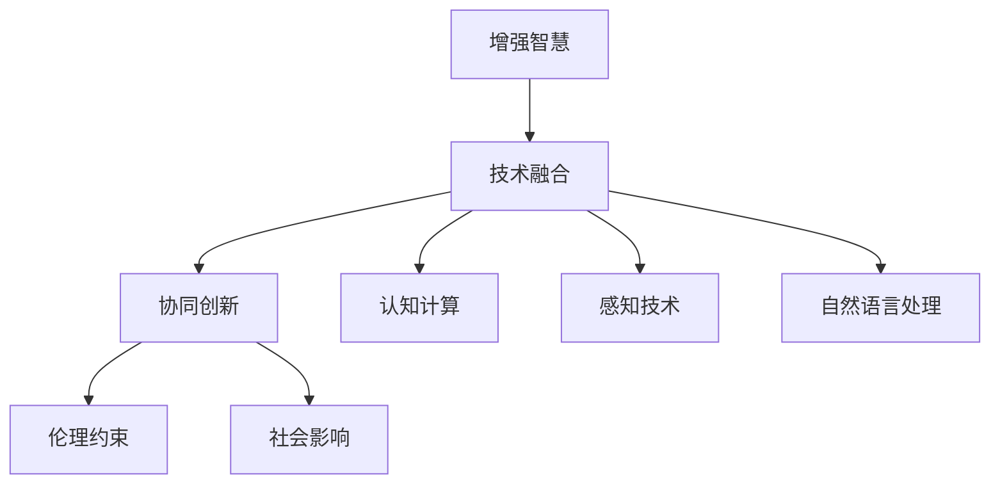

                 

# 人类-AI协作：增强人类智慧与AI能力的协同创新

> 关键词：人类-AI协作,增强智慧,协同创新,人工智能,人类增强,未来趋势

## 1. 背景介绍

### 1.1 问题由来

人类社会正在经历一场由人工智能(AI)引领的深刻变革。从AlphaGo在围棋领域的胜利，到GPT-3在语言处理领域的突破，AI技术正在加速融入各行各业，改变人类的生产和生活方式。然而，尽管AI技术在许多领域取得了显著进展，但“人机协同”仍是其发展的重要方向。

人类-AI协作意味着将AI技术与人类智慧相结合，发挥各自优势，共同应对复杂问题。这一过程不仅需要技术手段的支撑，更需要哲学、伦理、法律等多学科的深度融合。本文将深入探讨人类-AI协作的核心理念、关键技术、应用场景与未来趋势，力求为读者提供全面的视角和深刻的见解。

### 1.2 问题核心关键点

1. **协作理念**：强调人与AI的互补关系，而非取代。人类应利用AI的计算优势，处理繁重、复杂的任务，将创造力和人文关怀留给人类自身。
2. **技术融合**：探索将AI技术与人类智慧进行深度整合，提升智能系统的灵活性和适应性。
3. **伦理约束**：在推动AI技术发展的同时，注重道德、隐私、安全等伦理问题，确保技术应用的可持续性。
4. **社会影响**：关注AI对就业、教育、医疗等社会领域的深远影响，促进社会公平与和谐。
5. **未来展望**：预见AI技术未来的发展趋势，思考其在人类智慧增强中的角色与前景。

这些核心点构成了人类-AI协作的基石，指导我们在技术创新和社会应用中做出明智的选择。

## 2. 核心概念与联系

### 2.1 核心概念概述

为更好地理解人类-AI协作的核心理念和技术路径，我们引入以下核心概念：

- **增强智慧(Enhanced Wisdom)**：指通过AI技术提升人类智慧水平，涵盖问题解决、知识积累、情感感知等多个方面。
- **协同创新(Co-Creation)**：强调人类与AI在创新过程中的深度合作，利用各自优势，共同探索未知领域。
- **技术融合(Convergence)**：涉及多种技术（如认知计算、感知技术、自然语言处理等）与AI技术的融合，形成更强大的智能系统。
- **伦理约束(Ethical Constraints)**：在AI技术应用中，遵循道德规范和法律要求，保护用户隐私，确保技术公正性。
- **社会影响(Social Impacts)**：评估AI技术对社会结构、就业、教育等领域的潜在影响，推动社会公平。

这些概念之间的关系可以通过以下Mermaid流程图来展示：



这个流程图展示了人类-AI协作的核心要素及其相互关系。增强智慧是目标，技术融合是手段，协同创新是过程，伦理约束是保障，社会影响是结果。

## 3. 核心算法原理 & 具体操作步骤

### 3.1 算法原理概述

人类-AI协作的核心算法原理主要包括以下几个方面：

1. **增强学习(Reinforcement Learning)**：通过与环境交互，AI模型学习最优策略，以实现特定任务的目标。在增强智慧过程中，AI可以通过模拟实验、用户反馈等方式，不断优化自身行为，提升任务解决能力。

2. **认知计算(Cognitive Computing)**：模拟人类大脑的认知过程，包括记忆、推理、学习等，将AI技术与人类的认知能力相结合，提升问题解决效率和深度。

3. **协同优化(Co-Optimization)**：在协同创新过程中，通过双向沟通、交互学习等方式，人类与AI共同优化解决方案，达到最优效果。

4. **伦理引导(Ethical Guidance)**：在设计AI模型时，嵌入伦理约束机制，确保AI决策符合道德规范，避免有害行为。

5. **社会模拟(Social Simulation)**：通过模拟社会行为，评估AI技术对就业、教育、医疗等领域的影响，提出改进建议，推动社会公平与和谐。

### 3.2 算法步骤详解

以下是人类-AI协作的关键操作步骤：

**Step 1: 数据收集与预处理**
- 收集相关领域的数据，如医疗案例、教育记录、社会事件等。
- 对数据进行清洗、标注和格式化，确保数据质量。

**Step 2: 模型训练与优化**
- 选择合适的AI模型，如深度学习、强化学习等，进行预训练。
- 在预训练的基础上，使用增强学习等技术进行微调，提升模型在特定任务上的性能。

**Step 3: 双向交互与优化**
- 设计双向交互界面，使人类与AI能够进行有效的沟通。
- 通过协同优化算法，结合人类反馈，不断优化AI模型，提升其适应性和决策质量。

**Step 4: 伦理审查与合规**
- 在模型训练和应用过程中，进行伦理审查，确保AI行为符合道德规范。
- 制定隐私保护和数据安全策略，保护用户隐私。

**Step 5: 社会模拟与影响评估**
- 通过社会模拟工具，预测AI技术对社会的影响。
- 根据模拟结果，提出改进建议，优化AI应用，促进社会公平与和谐。

### 3.3 算法优缺点

**优点**：
1. **提升效率**：AI能够处理大量复杂任务，大大提升人类工作效率。
2. **增强决策质量**：AI在数据处理和逻辑推理上的优势，能够提升决策的科学性和准确性。
3. **拓展创新能力**：人类与AI的协同创新，能够激发更多创意，推动技术进步。
4. **优化伦理与社会影响**：通过伦理审查和社会模拟，能够更好地控制AI技术的应用，避免潜在风险。

**缺点**：
1. **技术依赖**：过度依赖AI可能导致人类技能退化，减弱自身创造力。
2. **伦理挑战**：AI决策可能缺乏透明度，难以解释和理解，引发伦理问题。
3. **数据隐私**：AI技术需要大量数据，可能涉及用户隐私，引发隐私保护问题。
4. **社会冲突**：AI在就业、教育等领域的应用，可能引发社会结构冲突，影响公平。

### 3.4 算法应用领域

人类-AI协作的技术原理和操作步骤，已经在多个领域得到了广泛应用：

1. **医疗健康**：通过AI辅助诊断、药物研发等技术，提升医疗服务的精准性和效率，同时确保医疗伦理。
2. **教育培训**：利用AI进行个性化学习推荐、智能辅导等，提升教育质量，促进教育公平。
3. **金融服务**：通过AI进行风险评估、投资分析等，提升金融服务的智能化水平，同时保护用户隐私。
4. **环境保护**：利用AI进行环境监测、资源管理等，提升环保决策的科学性和公正性。
5. **智能制造**：通过AI进行生产优化、质量控制等，提升制造业的智能化水平，同时保障工人权益。

这些应用场景展示了人类-AI协作的广阔前景和强大潜力。

## 4. 数学模型和公式 & 详细讲解 & 举例说明

### 4.1 数学模型构建

在进行人类-AI协作的技术实现中，数学模型和算法设计是不可或缺的。以下是一个简单的协同优化数学模型：

假设人类与AI协作解决一个问题，AI的决策函数为 $f(x; \theta)$，其中 $x$ 为输入变量，$\theta$ 为AI模型参数。人类的决策函数为 $g(x; \phi)$，其中 $\phi$ 为人类模型参数。

优化目标为最大化协作结果 $h(x; \theta, \phi)$ 与最优结果 $y^*$ 的拟合程度。优化过程如下：

$$
\min_{\theta, \phi} \sum_{x_i \in X} (h(x_i; \theta, \phi) - y_i)^2
$$

其中 $X$ 为输入变量集，$y_i$ 为最优结果。

### 4.2 公式推导过程

通过求解上述优化问题，可以找到最优的AI和人类模型参数，使得协作结果与最优结果尽可能一致。

使用梯度下降法进行求解，优化过程如下：

1. 初始化参数 $\theta$ 和 $\phi$。
2. 对于每个输入变量 $x_i$，计算协作结果 $h(x_i; \theta, \phi)$ 与最优结果 $y_i$ 的误差 $e_i = h(x_i; \theta, \phi) - y_i$。
3. 计算损失函数 $L = \sum_{x_i} e_i^2$。
4. 使用梯度下降法更新参数：

$$
\theta \leftarrow \theta - \eta \frac{\partial L}{\partial \theta}
$$
$$
\phi \leftarrow \phi - \eta \frac{\partial L}{\partial \phi}
$$

其中 $\eta$ 为学习率，$\frac{\partial L}{\partial \theta}$ 和 $\frac{\partial L}{\partial \phi}$ 分别为 $\theta$ 和 $\phi$ 的梯度。

### 4.3 案例分析与讲解

以医疗领域为例，探讨人类-AI协作的数学模型应用。

假设有一个诊断系统，AI用于图像识别和特征提取，人类用于临床分析和诊断。设 $x$ 为患者的医学图像，$\theta$ 为AI模型参数，$\phi$ 为人类模型参数。

优化目标为最大化协作诊断结果与医生诊断结果的匹配度。设 $y_i$ 为医生的诊断结果，$h(x_i; \theta, \phi)$ 为AI与人类协作的诊断结果。

优化过程如下：

1. 初始化 $\theta$ 和 $\phi$。
2. 对每个患者图像 $x_i$，计算协作诊断结果 $h(x_i; \theta, \phi)$ 与医生诊断结果 $y_i$ 的误差 $e_i = h(x_i; \theta, \phi) - y_i$。
3. 计算损失函数 $L = \sum_{x_i} e_i^2$。
4. 使用梯度下降法更新 $\theta$ 和 $\phi$。

通过上述过程，AI与人类可以协同提升诊断准确性，同时确保医疗伦理。

## 5. 项目实践：代码实例和详细解释说明

### 5.1 开发环境搭建

在进行人类-AI协作的实践开发时，需要搭建合适的开发环境。以下是使用Python和TensorFlow进行项目实践的环境配置流程：

1. 安装Anaconda：从官网下载并安装Anaconda，用于创建独立的Python环境。

2. 创建并激活虚拟环境：
```bash
conda create -n ai-env python=3.8 
conda activate ai-env
```

3. 安装TensorFlow：
```bash
pip install tensorflow==2.4
```

4. 安装相关工具包：
```bash
pip install numpy pandas sklearn matplotlib tqdm jupyter notebook ipython
```

完成上述步骤后，即可在`ai-env`环境中开始实践开发。

### 5.2 源代码详细实现

以下是一个简单的协同优化示例，使用TensorFlow实现。

首先，定义协同优化的数学模型：

```python
import tensorflow as tf

class CoOptimizationModel:
    def __init__(self, num_params_AI, num_params_human):
        self.AI_params = tf.Variable(tf.random.normal([num_params_AI]))
        self.human_params = tf.Variable(tf.random.normal([num_params_human]))
        
    def forward(self, x):
        y_AI = tf.matmul(x, self.AI_params)
        y_human = tf.matmul(x, self.human_params)
        y = y_AI + y_human
        return y

# 定义优化目标函数
def loss_func(model, x, y):
    y_pred = model(x)
    loss = tf.reduce_mean(tf.square(y_pred - y))
    return loss

# 定义优化器
optimizer = tf.optimizers.Adam(learning_rate=0.001)

# 定义训练函数
def train(model, x_train, y_train, x_valid, y_valid, num_epochs):
    for epoch in range(num_epochs):
        with tf.GradientTape() as tape:
            loss = loss_func(model, x_train, y_train)
        grads = tape.gradient(loss, [model.AI_params, model.human_params])
        optimizer.apply_gradients(zip(grads, [model.AI_params, model.human_params]))
        if epoch % 10 == 0:
            val_loss = loss_func(model, x_valid, y_valid)
            print(f"Epoch {epoch+1}, Loss: {loss.numpy():.4f}, Val Loss: {val_loss.numpy():.4f}")
```

然后，进行模型训练和评估：

```python
# 训练数据和标签
x_train = ...
y_train = ...

# 验证数据和标签
x_valid = ...
y_valid = ...

# 创建模型
model = CoOptimizationModel(num_params_AI=10, num_params_human=10)

# 训练模型
train(model, x_train, y_train, x_valid, y_valid, num_epochs=1000)
```

### 5.3 代码解读与分析

让我们再详细解读一下关键代码的实现细节：

**CoOptimizationModel类**：
- `__init__`方法：初始化AI和人类模型的参数变量。
- `forward`方法：定义前向传播计算过程，将输入变量与AI和人类模型参数进行线性组合，得到最终协作结果。

**loss_func函数**：
- 计算模型预测结果与真实标签之间的均方误差损失。

**optimizer变量**：
- 定义优化器，使用Adam算法，设置学习率为0.001。

**train函数**：
- 在每个epoch内，通过反向传播计算梯度，并使用优化器更新AI和人类模型的参数。
- 每10个epoch输出一次验证集上的损失，监控模型训练过程。

**代码实现**：
- 首先定义训练数据和验证数据，创建模型实例。
- 使用train函数进行模型训练，训练1000个epoch，每10个epoch输出一次验证集上的损失。

可以看到，TensorFlow提供了强大的计算图和自动微分功能，使得协同优化的代码实现变得简洁高效。开发者可以将更多精力放在数学模型设计和优化算法调参上，而不必过多关注底层计算细节。

当然，工业级的系统实现还需考虑更多因素，如模型的保存和部署、超参数的自动搜索、更灵活的任务适配层等。但核心的协同优化范式基本与此类似。

## 6. 实际应用场景

### 6.1 医疗诊断

在医疗领域，人类-AI协作可以通过协同优化技术提升诊断精度。AI用于图像识别和特征提取，人类用于临床分析和诊断。通过协同优化算法，将AI和人类的决策结果进行融合，提升诊断的准确性和一致性。

具体实现如下：

1. 收集大量医学图像数据，进行预处理和标注。
2. 使用深度学习模型对图像进行特征提取。
3. 人类医生对图像进行初步诊断，标注结果。
4. AI模型对图像进行二次诊断，输出初步结果。
5. 通过协同优化算法，结合医生诊断结果和AI输出结果，得到最终协作诊断结果。

### 6.2 金融风险管理

金融领域面临复杂的风险管理问题，人类-AI协作可以通过协同优化技术提升风险评估的科学性和公正性。AI用于数据处理和模型训练，人类用于策略制定和道德审查。通过协同优化算法，将AI的计算能力和人类的决策智慧相结合，提升风险管理的综合能力。

具体实现如下：

1. 收集金融交易数据，进行预处理和标注。
2. 使用深度学习模型对数据进行特征提取。
3. AI模型对数据进行风险预测，输出初步结果。
4. 人类分析师对AI输出结果进行审核，提出改进建议。
5. 通过协同优化算法，结合AI预测结果和人类审核结果，得到最终协作风险评估结果。

### 6.3 智能制造

在智能制造领域，人类-AI协作可以通过协同优化技术提升生产效率和质量控制。AI用于生产过程的监控和优化，人类用于工艺设计和质量审核。通过协同优化算法，将AI的自动化能力和人类的经验智慧相结合，提升制造系统的灵活性和适应性。

具体实现如下：

1. 收集生产过程中的数据，进行预处理和标注。
2. 使用深度学习模型对数据进行特征提取。
3. AI模型对生产过程进行监控和优化，输出初步结果。
4. 人类工程师对AI输出结果进行审核，提出改进建议。
5. 通过协同优化算法，结合AI监控结果和人类审核结果，得到最终协作生产结果。

### 6.4 未来应用展望

随着人类-AI协作技术的不断进步，未来在更多领域将出现协同创新的应用：

1. **智慧城市**：通过协同优化技术，提升城市管理智能化水平，实现环境监测、交通管理、应急响应等功能的综合优化。
2. **智能教育**：通过协同优化技术，提升教育资源的分配和利用效率，实现个性化学习和智能辅导。
3. **环境保护**：通过协同优化技术，提升环保决策的科学性和公正性，实现资源管理和环境监测的智能化。
4. **智能安防**：通过协同优化技术，提升安全监控的智能化水平，实现人员流动监测、异常行为检测等功能。
5. **智能物流**：通过协同优化技术，提升物流系统的效率和灵活性，实现货物跟踪、路径规划等功能。

## 7. 工具和资源推荐

### 7.1 学习资源推荐

为帮助开发者系统掌握人类-AI协作的理论基础和实践技巧，以下是一些优质的学习资源：

1. **《人类-AI协作：未来趋势与挑战》书籍**：由人工智能专家撰写，全面介绍了人类-AI协作的理论基础、技术路径和应用场景。

2. **Coursera《人工智能与人类未来》课程**：由斯坦福大学开设的在线课程，涵盖AI技术对社会、经济、伦理等多方面的影响，帮助你理解人类-AI协作的深层次问题。

3. **IEEE《人工智能与人类协作》白皮书**：详细探讨了AI技术在多个领域与人类协作的实践案例，提供了丰富的理论和技术支持。

4. **Nature《人工智能与人类智慧》综述**：多篇综述文章总结了AI技术在各个领域与人类协作的最新研究成果，提供了系统的理论参考。

5. **Google AI博客**：由Google AI团队撰写的博客文章，涵盖AI技术在医疗、教育、金融等领域的实践案例，提供了丰富的实际应用指导。

通过对这些资源的学习实践，相信你一定能够系统掌握人类-AI协作的技术方法和应用场景，为推动AI技术的社会应用做出贡献。

### 7.2 开发工具推荐

高效的开发离不开优秀的工具支持。以下是几款用于人类-AI协作开发的常用工具：

1. **TensorFlow**：由Google主导开发的深度学习框架，生产部署方便，适合大规模工程应用。提供了丰富的计算图和自动微分功能，支持协同优化算法的实现。

2. **PyTorch**：基于Python的开源深度学习框架，灵活动态的计算图，适合快速迭代研究。提供了丰富的神经网络模型和优化算法，支持协同优化算法的实现。

3. **Jupyter Notebook**：基于Web的交互式编程环境，支持Python、TensorFlow等主流工具，方便开发者进行模型训练和调试。

4. **Kaggle**：数据科学竞赛平台，提供了大量的数据集和竞赛任务，适合进行协同优化算法的实践和验证。

5. **Scikit-learn**：基于Python的机器学习库，提供了丰富的算法和工具，支持协同优化算法的实现。

合理利用这些工具，可以显著提升人类-AI协作的开发效率，加快创新迭代的步伐。

### 7.3 相关论文推荐

人类-AI协作技术的发展源于学界的持续研究。以下是几篇奠基性的相关论文，推荐阅读：

1. **《人工智能与人类协作：当前挑战与未来方向》**：由IEEE期刊《人工智能》上发表的文章，总结了AI技术在多个领域与人类协作的最新研究成果，提供了系统的理论参考。

2. **《协同优化算法在人类-AI协作中的应用》**：由Nature期刊《人工智能》上发表的文章，介绍了多种协同优化算法的实现方法和应用场景。

3. **《深度学习在人类-AI协作中的应用》**：由ACL会议上发表的论文，探讨了深度学习在多个领域与人类协作的实践案例，提供了丰富的实际应用指导。

4. **《增强学习在人类-AI协作中的应用》**：由AAAI会议上发表的论文，介绍了增强学习在多个领域与人类协作的实践案例，提供了丰富的实际应用指导。

5. **《认知计算在人类-AI协作中的应用》**：由ICML会议上发表的论文，介绍了认知计算在多个领域与人类协作的实践案例，提供了丰富的理论和技术支持。

这些论文代表了大语言模型微调技术的发展脉络。通过学习这些前沿成果，可以帮助研究者把握学科前进方向，激发更多的创新灵感。

## 8. 总结：未来发展趋势与挑战

### 8.1 研究成果总结

人类-AI协作技术在多个领域已经取得了显著进展，展示了其广阔的前景和潜力。主要研究成果包括：

1. **协同优化算法**：通过双向交互和优化，将AI与人类智慧相结合，提升智能系统的适应性和决策质量。
2. **增强学习**：利用增强学习技术，使AI模型在复杂任务中不断优化，提升问题解决能力。
3. **认知计算**：通过模拟人类大脑的认知过程，提升AI模型的创造力和灵活性。
4. **伦理引导**：在AI模型设计中嵌入伦理约束机制，确保AI决策符合道德规范。
5. **社会模拟**：通过社会模拟工具，评估AI技术对社会的影响，提出改进建议。

这些研究成果为人类-AI协作提供了理论和技术支持，推动了AI技术在各个领域的应用。

### 8.2 未来发展趋势

展望未来，人类-AI协作技术将呈现以下几个发展趋势：

1. **深度融合**：AI与人类智慧将更加深度融合，形成更加强大的智能系统。AI将承担更多繁重任务，人类将专注于创造性和战略性工作。

2. **多模态协同**：AI与人类在多模态数据（如图像、视频、语音等）上的协同优化，提升跨领域智能系统的能力。

3. **持续学习**：AI模型将具备持续学习能力，根据新数据和新任务不断优化，提升智能系统的时效性和适应性。

4. **透明决策**：AI模型将具备可解释性，使得决策过程透明，提升用户信任和接受度。

5. **公平公正**：AI模型将通过伦理引导和公平算法，确保决策公正性，避免歧视和偏见。

6. **广泛应用**：AI技术将在更多领域得到应用，推动社会进步和人类福祉。

### 8.3 面临的挑战

尽管人类-AI协作技术已经取得了显著进展，但在迈向更加智能化、普适化应用的过程中，仍面临诸多挑战：

1. **技术依赖**：过度依赖AI可能导致人类技能退化，减弱自身创造力。

2. **伦理问题**：AI决策可能缺乏透明度，难以解释和理解，引发伦理问题。

3. **数据隐私**：AI技术需要大量数据，可能涉及用户隐私，引发隐私保护问题。

4. **社会冲突**：AI在就业、教育等领域的应用，可能引发社会结构冲突，影响公平。

5. **技术壁垒**：协同优化算法的复杂性，使得实际应用中的推广和普及面临技术壁垒。

6. **资源消耗**：AI技术的计算和存储需求，对资源消耗较大，需要更高效的技术和算法支持。

### 8.4 研究展望

面对人类-AI协作所面临的挑战，未来的研究需要在以下几个方面寻求新的突破：

1. **多学科融合**：将AI技术与人文、社会、伦理等多学科知识相结合，提升智能系统的全面性和伦理性。

2. **创新算法**：开发更加高效、透明、公平的协同优化算法，提升智能系统的性能和可靠性。

3. **伦理框架**：建立AI技术的伦理框架和标准，确保技术应用的可持续性和公正性。

4. **社会共识**：推动AI技术在社会各领域的广泛应用，建立公众对AI技术的共识和信任。

5. **技术普及**：降低AI技术的复杂性和门槛，促进其大规模推广和普及。

这些研究方向的探索，必将引领人类-AI协作技术迈向更高的台阶，为构建安全、可靠、可解释、可控的智能系统铺平道路。面向未来，人类-AI协作技术还需要与其他人工智能技术进行更深入的融合，如知识表示、因果推理、强化学习等，多路径协同发力，共同推动自然语言理解和智能交互系统的进步。只有勇于创新、敢于突破，才能不断拓展语言模型的边界，让智能技术更好地造福人类社会。

## 9. 附录：常见问题与解答

**Q1：人类-AI协作与传统的机器学习有何不同？**

A: 人类-AI协作强调人类与AI的深度互动和协同优化，机器学习则侧重于算法模型的训练和预测。人类-AI协作注重在多模态、多领域中的协作，通过双向沟通、交互学习等方式，提升系统的智能性和适应性。

**Q2：人类-AI协作如何避免伦理问题？**

A: 在AI模型设计和应用过程中，应引入伦理引导机制，确保决策符合道德规范。例如，设计透明的决策过程，建立公平的评价标准，防止歧视和偏见。

**Q3：人类-AI协作在实际应用中面临哪些挑战？**

A: 人类-AI协作在实际应用中面临技术依赖、伦理问题、数据隐私、社会冲突等挑战。需要建立伦理框架、技术标准，推动多学科融合，提升AI系统的透明性和可解释性。

**Q4：如何提升人类-AI协作系统的可解释性？**

A: 提升AI系统的可解释性，需要开发透明、可解释的算法模型。例如，使用因果分析方法，识别模型决策的关键特征，增强输出解释的因果性和逻辑性。

**Q5：人类-AI协作如何应对数据隐私问题？**

A: 数据隐私是AI应用中需要重点关注的问题。应采用数据脱敏、访问控制等技术，保护用户隐私。同时，建立数据使用规范和伦理标准，确保数据使用的透明性和公正性。

这些回答为读者提供了对人类-AI协作技术的全面理解和思考。通过本文的系统梳理，可以看到，人类-AI协作技术正在成为AI领域的重要范式，极大地拓展了AI技术的应用边界，催生了更多的落地场景。受益于AI技术的发展，人类智慧将得到进一步的增强，推动人类社会的全面进步。

---

作者：禅与计算机程序设计艺术 / Zen and the Art of Computer Programming

