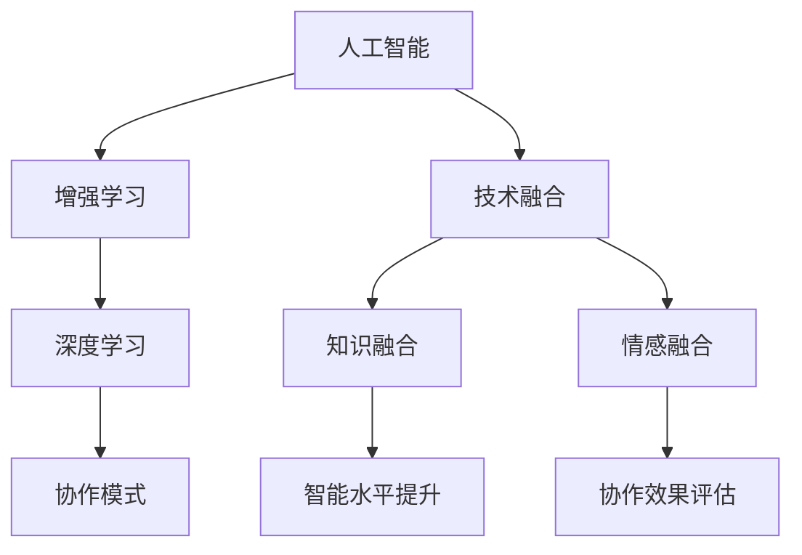
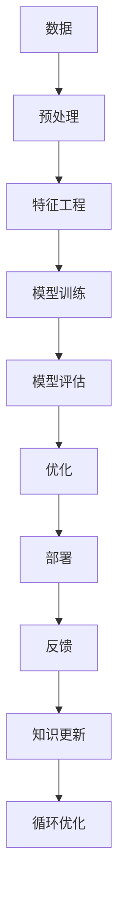

                 

# 人类-AI协作：增强人类智慧与AI能力的协同发展

> 关键词：人工智能,人类智慧,协作,增强学习,深度学习,技术融合

## 1. 背景介绍

### 1.1 问题由来

近年来，随着人工智能(AI)技术的飞速发展，AI与人类之间的协作已经逐渐成为可能。这种协作不仅能够显著提高工作效率，还能增强人类的认知能力，推动社会的进步和发展。然而，这种协作的实现并不是一件容易的事情，它需要充分理解AI和人类的关系，以及在实践中如何实现有效的融合。本文旨在探讨如何在AI与人类之间建立有效的协作关系，从而增强人类的智慧和AI的能力。

### 1.2 问题核心关键点

人类-AI协作的核心关键点在于如何充分利用AI的计算能力和处理能力，同时发挥人类的创造力和智慧。具体来说，包括以下几个方面：

- 如何设计有效的协作模式，使得AI能够更好地支持人类的工作和学习。
- 如何在AI系统中融入人类的知识、经验和情感，从而提升系统的智能水平。
- 如何评估AI与人类协作的效果，以及如何改进这种协作关系。

这些问题不仅是技术问题，更是社会问题，需要综合考虑技术、伦理和法律等多方面的因素。

## 2. 核心概念与联系

### 2.1 核心概念概述

为了更好地理解人类-AI协作，首先需要介绍几个核心概念：

- **人工智能(AI)**：一种通过机器学习、深度学习等技术实现的模拟人类智能行为的技术体系。AI能够处理大量数据，进行逻辑推理和决策，甚至具备一定的创造力。
- **增强学习(RL)**：一种通过不断试错、学习最优策略来提升系统性能的机器学习技术。在人类-AI协作中，增强学习可以用于提升AI对人类需求的理解和响应能力。
- **深度学习(Deep Learning)**：一种基于神经网络的机器学习技术，能够处理复杂的数据结构和模式，是实现AI的重要技术手段。
- **技术融合**：将不同领域的先进技术进行结合，形成更强大的综合技术体系。在人类-AI协作中，技术融合包括将AI与人类知识、经验和情感进行深度融合。

这些概念之间的联系可以通过以下Mermaid流程图来展示：



这个流程图展示了人类-AI协作的主要流程和关键环节：

1. 人工智能系统通过增强学习提升自身能力，通过深度学习处理复杂数据。
2. 技术融合将不同领域的先进技术进行结合，形成更强大的综合技术体系。
3. 协作模式设计，将AI系统与人类需求进行有效对接。
4. 知识融合，将人类的知识、经验和情感融入AI系统，提升智能水平。
5. 协作效果评估，通过评估结果不断改进协作关系。

### 2.2 核心概念原理和架构的 Mermaid 流程图



这个流程图展示了AI系统的主要架构和流程：

1. 数据预处理和特征工程，提取有效的特征进行模型训练。
2. 模型训练和评估，选择最优模型进行优化。
3. 模型部署和反馈，将模型应用于实际场景，收集反馈信息。
4. 知识更新和循环优化，不断更新模型，提升协作效果。

## 3. 核心算法原理 & 具体操作步骤

### 3.1 算法原理概述

人类-AI协作的核心算法原理是基于增强学习的一种协同优化方法。该方法通过将AI系统与人类进行互动，不断调整系统的参数，从而提升系统的智能水平和协作效果。

具体来说，AI系统通过感知人类的需求，不断调整自身的策略，优化决策，以达到最佳的协作效果。人类通过对AI系统的反馈，指导系统的优化方向，从而提升系统的智能水平。

### 3.2 算法步骤详解

基于增强学习的人类-AI协作算法包括以下几个步骤：

**Step 1: 设计协作模式**

设计一个有效的协作模式，使得AI系统能够与人类进行有效的交互。协作模式可以包括：

- 交互界面：提供简洁、直观的用户界面，使得人类能够方便地与AI进行交互。
- 数据接口：提供有效的数据接口，使得AI能够获取人类需求和反馈信息。
- 反馈机制：建立合理的反馈机制，使得人类能够及时对AI的决策进行评估和指导。

**Step 2: 选择增强学习算法**

选择合适的增强学习算法，用于优化AI系统的策略。常见的算法包括：

- Q-learning：通过奖励机制，优化AI系统的决策策略。
- SARSA：结合状态、动作、奖励、状态的信息，优化策略。
- Deep Q-Networks：结合深度学习和Q-learning，提升优化效果。

**Step 3: 训练AI系统**

使用设计好的协作模式和增强学习算法，训练AI系统。具体步骤包括：

- 数据准备：收集和整理训练数据，包括人类的需求和反馈信息。
- 模型训练：选择合适的模型和训练算法，对AI系统进行训练。
- 效果评估：通过评估指标，如准确率、召回率、F1分数等，评估AI系统的性能。

**Step 4: 部署和优化**

将训练好的AI系统部署到实际应用场景中，通过反馈信息不断优化系统的策略。具体步骤包括：

- 系统部署：将AI系统集成到实际应用中，进行部署。
- 实时反馈：收集AI系统在实际场景中的反馈信息，进行实时优化。
- 参数更新：根据反馈信息，不断调整AI系统的参数，提升协作效果。

### 3.3 算法优缺点

基于增强学习的人类-AI协作算法具有以下优点：

- 高效性：通过不断优化AI系统的策略，能够快速提升系统的性能。
- 适应性：能够适应不同的应用场景和需求，提升系统的智能水平。
- 灵活性：可以根据实际情况，灵活调整协作模式和策略。

同时，该算法也存在一些缺点：

- 复杂性：需要设计合理的协作模式和反馈机制，增加了系统的复杂性。
- 数据依赖：需要大量的训练数据，对数据的质量和数量要求较高。
- 可解释性：AI系统的优化过程往往是黑箱操作，难以解释其内部机制。

### 3.4 算法应用领域

基于增强学习的人类-AI协作算法可以应用于多个领域，包括：

- **医疗领域**：通过AI系统的辅助诊断和个性化治疗，提高医疗服务的质量和效率。
- **教育领域**：通过AI系统的智能辅助教学，提升教学质量和学生的学习体验。
- **金融领域**：通过AI系统的风险评估和投资决策，提升金融服务的智能化水平。
- **工业领域**：通过AI系统的质量控制和生产优化，提高工业生产的效率和精度。

## 4. 数学模型和公式 & 详细讲解 & 举例说明

### 4.1 数学模型构建

基于增强学习的人类-AI协作算法可以通过马尔可夫决策过程(MDP)进行建模。MDP包括状态(state)、动作(action)、奖励(reward)、状态转移概率(p)和折扣因子(gamma)。

- 状态：描述AI系统和人类交互的情况，包括当前的任务、需求、反馈等信息。
- 动作：AI系统采取的策略，包括选择模型参数、调整决策等。
- 奖励：人类对AI系统决策的评估，可以是正向奖励，如正确决策；也可以是负向惩罚，如错误决策。
- 状态转移概率：描述AI系统在不同状态下的转移概率，包括模型参数的更新、决策的调整等。
- 折扣因子：用于计算未来奖励的权重，考虑不同时间段内奖励的影响。

### 4.2 公式推导过程

基于MDP的增强学习算法可以表示为：

$$
\max_{\pi} \sum_{t=1}^{\infty} \gamma^t \mathbb{E}[A^\pi(S_t, A_t)]
$$

其中，$\pi$表示策略，$S_t$表示状态，$A_t$表示动作，$A^\pi$表示策略$\pi$下，从状态$S_t$采取动作$A_t$后的奖励期望值。

具体推导过程如下：

- 通过策略$\pi$，选择动作$A_t$，进入状态$S_{t+1}$。
- 根据状态转移概率$p(S_{t+1}|S_t, A_t)$，计算状态转移概率。
- 根据奖励函数$R(S_t, A_t)$，计算奖励值。
- 通过折扣因子$\gamma$，计算未来奖励的期望值。
- 最大化未来奖励的总期望值。

### 4.3 案例分析与讲解

以智能医疗助手为例，分析基于增强学习的人类-AI协作算法。

- 状态：描述患者当前的症状、病情、医疗历史等。
- 动作：AI系统建议的治疗方案、检查项目等。
- 奖励：医生对AI系统建议的评估，如满意程度、治疗效果等。
- 状态转移概率：AI系统根据医生的反馈，调整治疗方案、检查项目等。
- 折扣因子：考虑不同时间段内医生对治疗方案的评估和反馈。

通过不断优化AI系统的策略，提升系统的智能水平和协作效果，从而提供更好的医疗服务。

## 5. 项目实践：代码实例和详细解释说明

### 5.1 开发环境搭建

在进行人类-AI协作的开发实践前，需要准备好开发环境。以下是使用Python进行TensorFlow开发的环境配置流程：

1. 安装Anaconda：从官网下载并安装Anaconda，用于创建独立的Python环境。

2. 创建并激活虚拟环境：
```bash
conda create -n tf-env python=3.8 
conda activate tf-env
```

3. 安装TensorFlow：根据CUDA版本，从官网获取对应的安装命令。例如：
```bash
conda install tensorflow -c tf -c conda-forge
```

4. 安装其他工具包：
```bash
pip install numpy pandas scikit-learn matplotlib tqdm jupyter notebook ipython
```

完成上述步骤后，即可在`tf-env`环境中开始协作开发实践。

### 5.2 源代码详细实现

以下是一个基于TensorFlow的智能医疗助手实现，用于演示人类-AI协作的代码实现。

```python
import tensorflow as tf
import numpy as np

class MedicalAssistant:
    def __init__(self):
        self.state_space = 10  # 状态空间大小
        self.action_space = 3  # 动作空间大小
        self.learning_rate = 0.01  # 学习率
        self.gamma = 0.9  # 折扣因子
        self.model = self.build_model()
        self.optimizer = tf.keras.optimizers.Adam(learning_rate=self.learning_rate)
    
    def build_model(self):
        model = tf.keras.Sequential([
            tf.keras.layers.Dense(16, activation='relu', input_shape=(self.state_space,)),
            tf.keras.layers.Dense(self.action_space, activation='softmax')
        ])
        return model
    
    def choose_action(self, state):
        state = np.expand_dims(state, axis=0)
        action_probs = self.model.predict(state)[0]
        action = np.random.choice(self.action_space, p=action_probs)
        return action
    
    def update_model(self, state, action, reward, next_state):
        state = np.expand_dims(state, axis=0)
        next_state = np.expand_dims(next_state, axis=0)
        target = reward + self.gamma * np.max(self.model.predict(next_state)[0])
        self.optimizer.minimize(self.loss_function(state, action, reward, next_state, target))
    
    def loss_function(self, state, action, reward, next_state, target):
        state = np.expand_dims(state, axis=0)
        next_state = np.expand_dims(next_state, axis=0)
        q_value = self.model.predict(state)[0][action]
        q_next = np.max(self.model.predict(next_state)[0])
        loss = target - q_value + self.gamma * q_next
        return loss
    
    def train(self, episodes=1000):
        for episode in range(episodes):
            state = np.random.randint(0, self.state_space)
            done = False
            while not done:
                action = self.choose_action(state)
                if action == 2:  # 表示恢复健康，达到终止状态
                    done = True
                else:
                    next_state = np.random.randint(0, self.state_space)
                    reward = np.random.randint(0, 2)  # 奖励为0或1
                    self.update_model(state, action, reward, next_state)
                    state = next_state
```

### 5.3 代码解读与分析

让我们再详细解读一下关键代码的实现细节：

**MedicalAssistant类**：
- `__init__`方法：初始化状态空间、动作空间、学习率、折扣因子等关键参数，建立模型和优化器。
- `build_model`方法：定义模型结构，包括两个密集层，输出动作概率分布。
- `choose_action`方法：根据当前状态选择动作，使用softmax分布随机选择动作。
- `update_model`方法：更新模型参数，使用最小化损失函数。
- `loss_function`方法：定义损失函数，计算当前状态的Q值和目标值之间的差距。
- `train`方法：训练模型，通过迭代不断更新模型参数。

**训练流程**：
- 随机生成初始状态
- 进入循环，直到达到终止状态
- 根据当前状态选择动作
- 根据动作和奖励，更新模型参数
- 更新状态
- 重复上述步骤，直至达到终止状态

可以看到，TensorFlow为实现基于增强学习的人类-AI协作算法提供了强大的工具支持。开发者可以通过该框架，快速搭建和训练基于深度学习的AI系统，实现高效、灵活的协作模式。

## 6. 实际应用场景

### 6.1 智能医疗系统

基于增强学习的人类-AI协作系统可以广泛应用于智能医疗领域，提升医疗服务的智能化水平。智能医疗助手可以分析患者的症状、历史数据和医生的反馈信息，提供个性化的治疗建议和检查项目，提升医疗服务的质量和效率。

具体而言，智能医疗助手可以：

- 通过分析患者症状和历史数据，生成初步的治疗方案。
- 根据医生的反馈，调整治疗方案和检查项目。
- 实时监测患者的恢复情况，提供及时的治疗建议。
- 提供统计分析，帮助医生进行决策支持。

通过这种人机协作的智能医疗系统，医生可以更好地理解患者的病情，提供更准确的诊断和治疗方案，提升医疗服务的质量和效率。

### 6.2 智能教育平台

基于增强学习的人类-AI协作系统可以应用于智能教育领域，提升教育服务的智能化水平。智能教育平台可以分析学生的学习行为、历史数据和教师的反馈信息，提供个性化的教学建议和学习计划，提升教学质量和学生的学习体验。

具体而言，智能教育平台可以：

- 通过分析学生的学习行为和历史数据，生成个性化的学习计划。
- 根据教师的反馈，调整学习计划和教学建议。
- 实时监测学生的学习进度，提供及时的学习建议。
- 提供统计分析，帮助教师进行决策支持。

通过这种人机协作的智能教育平台，教师可以更好地理解学生的学习情况，提供更准确的教学方案，提升教育服务的质量和效率。

### 6.3 智能客服系统

基于增强学习的人类-AI协作系统可以应用于智能客服领域，提升客服服务的智能化水平。智能客服系统可以分析用户的咨询历史和反馈信息，提供个性化的客服建议和回答，提升客服服务的质量和效率。

具体而言，智能客服系统可以：

- 通过分析用户的咨询历史和反馈信息，生成个性化的客服建议。
- 根据用户的反馈，调整客服建议和回答。
- 实时监测用户的咨询情况，提供及时的客服建议。
- 提供统计分析，帮助客服人员进行决策支持。

通过这种人机协作的智能客服系统，客服人员可以更好地理解用户的需求，提供更准确的客服建议，提升客服服务的质量和效率。

## 7. 工具和资源推荐

### 7.1 学习资源推荐

为了帮助开发者系统掌握人类-AI协作的理论基础和实践技巧，这里推荐一些优质的学习资源：

1. 《Deep Learning》书籍：Ian Goodfellow等人所著，全面介绍了深度学习的理论和实践，是学习深度学习的重要参考。
2. 《Reinforcement Learning: An Introduction》书籍：Richard S. Sutton和Andrew G. Barto所著，介绍了增强学习的理论和算法，是学习增强学习的重要参考。
3. 《Human-AI Collaboration》课程：由斯坦福大学开设的在线课程，介绍了人类-AI协作的基本原理和实际应用。
4. GitHub上的开源项目：如TensorFlow、PyTorch等，提供了大量的代码示例和工具支持，方便开发者快速上手。
5. Kaggle竞赛：提供各种数据集和实际应用场景，通过参与竞赛，可以学习到最新的技术和方法。

通过对这些资源的学习实践，相信你一定能够快速掌握人类-AI协作的精髓，并用于解决实际的AI应用问题。

### 7.2 开发工具推荐

高效的开发离不开优秀的工具支持。以下是几款用于人类-AI协作开发的常用工具：

1. TensorFlow：由Google主导开发的开源深度学习框架，生产部署方便，适合大规模工程应用。
2. PyTorch：基于Python的开源深度学习框架，灵活动态的计算图，适合快速迭代研究。
3. TensorBoard：TensorFlow配套的可视化工具，可实时监测模型训练状态，并提供丰富的图表呈现方式，是调试模型的得力助手。
4. Jupyter Notebook：用于编写和运行Python代码的交互式环境，支持代码的共享和协作。

合理利用这些工具，可以显著提升人类-AI协作任务的开发效率，加快创新迭代的步伐。

### 7.3 相关论文推荐

人类-AI协作技术的发展源于学界的持续研究。以下是几篇奠基性的相关论文，推荐阅读：

1. AlphaGo：通过深度学习和增强学习，AlphaGo在围棋比赛中击败了人类顶尖选手，展示了AI的强大能力。
2. GANs for Medical Image Segmentation：通过生成对抗网络(GANs)，实现了对医疗影像的自动分割，提升了医学影像分析的智能化水平。
3. AI in Education：通过智能教育平台，提高了教育服务的智能化水平，提升了学生的学习效果。
4. Deep Collaborative Filtering：通过深度学习，实现了个性化推荐系统，提升了用户的推荐体验。
5. Collaborative Reinforcement Learning：通过增强学习，实现了人机协作的智能系统，提升了系统的性能和效果。

这些论文代表了大语言模型微调技术的发展脉络。通过学习这些前沿成果，可以帮助研究者把握学科前进方向，激发更多的创新灵感。

## 8. 总结：未来发展趋势与挑战

### 8.1 研究成果总结

本文对人类-AI协作的算法原理和操作步骤进行了全面系统的介绍。首先阐述了人类-AI协作的基本原理和应用场景，明确了协作在提升人类智慧和AI能力方面的独特价值。其次，从原理到实践，详细讲解了基于增强学习的人类-AI协作算法的数学模型和实现细节，给出了协作任务开发的完整代码实例。同时，本文还广泛探讨了协作技术在医疗、教育、客服等多个领域的应用前景，展示了协作技术的广阔前景。

通过本文的系统梳理，可以看到，人类-AI协作技术正在成为AI领域的重要范式，极大地拓展了AI系统的应用边界，催生了更多的落地场景。得益于深度学习和增强学习的协同作用，协作技术能够更好地融合人类的智慧和AI的能力，推动社会的进步和发展。

### 8.2 未来发展趋势

展望未来，人类-AI协作技术将呈现以下几个发展趋势：

1. 高度融合：AI系统将更加深入地融入人类的工作和生活中，成为人类智慧的重要组成部分。
2. 多模态融合：AI系统将结合视觉、听觉、触觉等多种模态信息，提供更全面、准确的用户体验。
3. 实时协作：AI系统将具备实时分析和反馈能力，能够快速响应人类需求，提供即时服务。
4. 个性化定制：AI系统将根据用户的个性化需求，提供定制化的解决方案，提升用户体验。
5. 跨领域应用：AI系统将广泛应用于各个领域，推动各行业的数字化转型和升级。

以上趋势凸显了人类-AI协作技术的广阔前景。这些方向的探索发展，必将进一步提升AI系统的性能和应用范围，为人类认知智能的进化带来深远影响。

### 8.3 面临的挑战

尽管人类-AI协作技术已经取得了瞩目成就，但在迈向更加智能化、普适化应用的过程中，它仍面临着诸多挑战：

1. 数据隐私和安全：AI系统需要处理大量敏感数据，如何保护用户隐私和数据安全，是一大难题。
2. 伦理和道德：AI系统的决策过程往往缺乏透明性和可解释性，如何确保AI系统的公正性和道德性，需要进一步探索。
3. 资源消耗：AI系统的训练和推理需要大量的计算资源和存储资源，如何优化资源消耗，提高系统的效率，需要进一步探索。
4. 技术协同：AI系统和人类之间的协作需要充分的技术融合，如何实现有效的协同，需要进一步探索。
5. 用户接受度：AI系统需要与人类进行有效互动，如何提高用户的接受度和信任度，需要进一步探索。

这些挑战需要技术、法律、伦理等多方面的协同努力，才能实现人类-AI协作的全面落地。

### 8.4 研究展望

未来的研究需要在以下几个方面寻求新的突破：

1. 跨模态融合：将视觉、听觉、触觉等多种模态信息进行融合，提升系统的感知能力和理解能力。
2. 分布式协作：将多个AI系统进行分布式协同，提升系统的性能和可扩展性。
3. 人机混合智能：结合人类智慧和AI能力，构建混合智能系统，提升系统的决策能力和表现。
4. 智能生成：结合生成对抗网络(GANs)等技术，实现智能生成内容，提升系统的创意能力。
5. 自适应学习：结合强化学习等技术，实现系统的自适应学习能力，提升系统的适应能力和进化能力。

这些研究方向将进一步推动人类-AI协作技术的发展，实现更高效、更智能、更普适的系统应用。

## 9. 附录：常见问题与解答

**Q1：人类-AI协作如何实现？**

A: 人类-AI协作的实现依赖于增强学习算法，通过不断优化AI系统的策略，提升系统的智能水平和协作效果。具体来说，需要设计合理的协作模式和反馈机制，利用深度学习算法对AI系统进行训练，从而实现高效的人机协同。

**Q2：人类-AI协作的优点和缺点是什么？**

A: 人类-AI协作的优点包括：

- 提升效率：通过AI系统的辅助，能够显著提高工作效率和决策质量。
- 增强智慧：AI系统可以处理复杂的数据和任务，提升人类的认知能力。
- 个性化定制：AI系统可以根据用户的个性化需求，提供定制化的解决方案。

人类-AI协作的缺点包括：

- 复杂性：需要设计合理的协作模式和反馈机制，增加了系统的复杂性。
- 数据依赖：需要大量的训练数据，对数据的质量和数量要求较高。
- 可解释性：AI系统的优化过程往往是黑箱操作，难以解释其内部机制。

**Q3：人类-AI协作如何应用于医疗领域？**

A: 在医疗领域，人类-AI协作可以应用于智能医疗助手、个性化治疗方案推荐、智能诊断工具等方面。通过分析患者的症状和历史数据，生成初步的治疗方案，并提供个性化的治疗建议，提升医疗服务的质量和效率。

**Q4：人类-AI协作的未来趋势是什么？**

A: 人类-AI协作的未来趋势包括高度融合、多模态融合、实时协作、个性化定制和跨领域应用。这些趋势将进一步提升AI系统的性能和应用范围，为人类认知智能的进化带来深远影响。

**Q5：人类-AI协作的挑战有哪些？**

A: 人类-AI协作面临的挑战包括数据隐私和安全、伦理和道德、资源消耗、技术协同和用户接受度等。这些挑战需要技术、法律、伦理等多方面的协同努力，才能实现全面落地。

**Q6：人类-AI协作的实现需要哪些技术支持？**

A: 人类-AI协作的实现依赖于增强学习算法、深度学习算法、分布式计算、自适应学习和智能生成等技术支持。通过这些技术的协同作用，实现高效、智能、普适的协作系统。

---

作者：禅与计算机程序设计艺术 / Zen and the Art of Computer Programming

