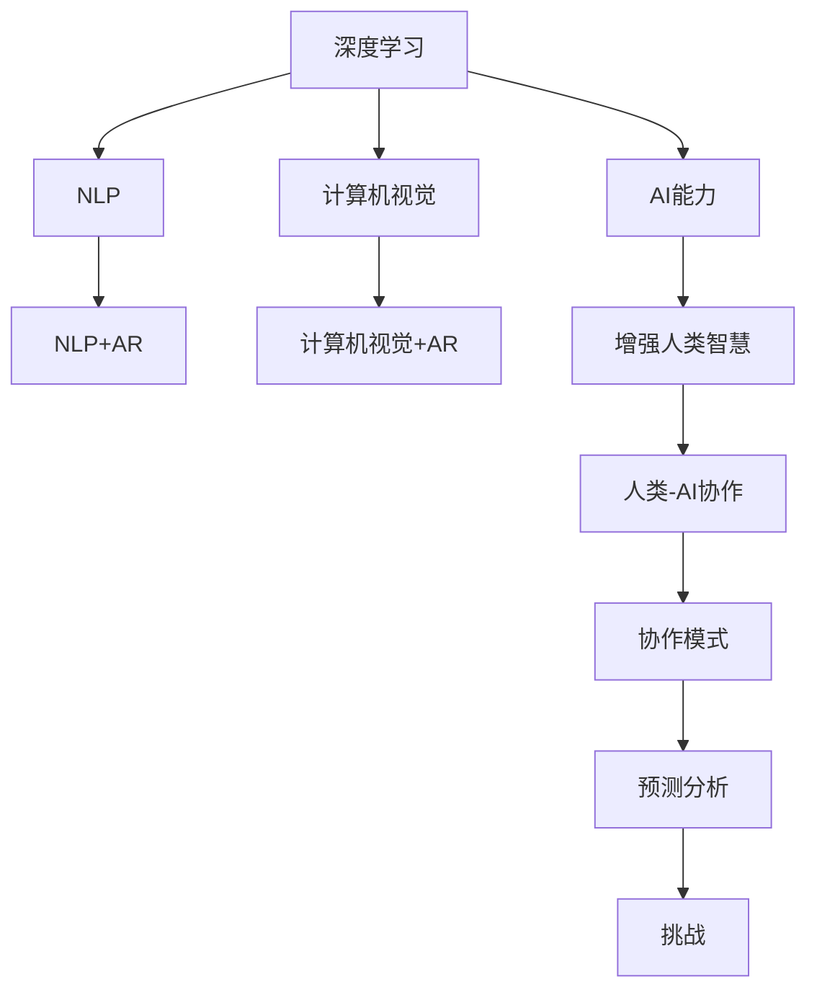

                 

# 人类-AI协作：增强人类智慧与AI能力的融合发展趋势预测分析总结挑战

## 1. 背景介绍

### 1.1 问题由来

当前，人工智能（AI）技术正以惊人的速度发展，广泛渗透到各个领域。AI不仅在图像识别、自然语言处理、自动驾驶等领域取得巨大突破，还在协作、决策、学习等方面展现了巨大的潜能。然而，人工智能的发展也引发了诸多社会、伦理、道德等复杂问题，人类与AI之间的关系也在逐渐演变。人类-AI协作，作为一种新的发展趋势，逐渐成为未来的主流。本文将通过分析人类-AI协作的现状、趋势和挑战，总结未来发展方向。

### 1.2 问题核心关键点

- **人工智能的发展**：AI技术的快速发展，尤其是深度学习、自然语言处理和计算机视觉等领域的突破，为人类-AI协作提供了技术基础。
- **人类-AI协作**：AI与人类协作，旨在通过增强人类智慧和AI能力，共同解决复杂问题。
- **融合发展**：AI与人类在知识、技能、情感等方面的融合，形成新的交互方式和协作模式。
- **发展趋势**：人类-AI协作的未来趋势预测，包括技术、应用、伦理等各个方面。
- **面临挑战**：在协作过程中，AI与人类可能面临的技术、伦理、道德等方面的挑战。

## 2. 核心概念与联系

### 2.1 核心概念概述

- **人工智能（AI）**：指由人制造出来，能执行通常需要人类智能的任务的机器或计算机系统。
- **增强人类智慧**：指通过AI技术，提升人类的认知能力、决策能力和创造能力。
- **AI能力**：指AI在处理数据、模式识别、问题求解等方面的能力。
- **融合发展**：指AI与人类在技术、知识、情感等各方面的融合，形成新的交互方式和协作模式。
- **协作模式**：指AI与人类在特定任务中的交互方式和责任分配。
- **预测分析**：指对未来发展趋势的预测和分析。
- **挑战**：指在协作过程中遇到的技术、伦理、道德等方面的挑战。

为更好地理解人类-AI协作，本节将介绍几个密切相关的核心概念：

- **深度学习**：一种基于神经网络的机器学习方法，用于处理和分析大规模数据，提取特征和模式。
- **自然语言处理（NLP）**：使计算机能够理解、解释和生成人类语言的技术。
- **计算机视觉**：使计算机能够识别、分类和理解图像和视频的技术。
- **增强现实（AR）和虚拟现实（VR）**：结合AI和人类感官的沉浸式体验技术。

这些核心概念之间的逻辑关系可以通过以下Mermaid流程图来展示：



这个流程图展示了大语言模型的核心概念及其之间的关系：

1. AI技术如深度学习、NLP和计算机视觉，为人类-AI协作提供了技术基础。
2. AI能力包括在处理数据、模式识别、问题求解等方面的能力，增强了人类智慧。
3. 融合发展使得AI与人类在技术、知识、情感等各方面的融合，形成新的交互方式和协作模式。
4. 协作模式规定了AI与人类在特定任务中的交互方式和责任分配。
5. 预测分析基于当前技术趋势和应用情况，对未来发展趋势进行预测。
6. 挑战指在协作过程中遇到的技术、伦理、道德等方面的挑战。

这些概念共同构成了人类-AI协作的学习框架，使得AI与人类能够更好地协作。

## 3. 核心算法原理 & 具体操作步骤
### 3.1 算法原理概述

人类-AI协作的核心算法原理可以概括为：

1. **数据收集与处理**：通过AI技术收集和处理大规模数据，提取有价值的信息。
2. **模型训练**：使用AI算法训练模型，使其具备特定的任务能力。
3. **协作任务**：AI与人类共同参与特定任务，AI提供数据处理和模式识别能力，人类提供决策和创造能力。
4. **反馈与优化**：通过人类反馈，不断优化AI模型的性能。

### 3.2 算法步骤详解

基于人类-AI协作的算法步骤可以概括为：

**Step 1: 数据收集与处理**
- 收集与任务相关的数据。
- 清洗和预处理数据，如去除噪声、填补缺失值、标准化等。
- 将数据分为训练集、验证集和测试集。

**Step 2: 模型训练**
- 选择适合的AI算法，如深度学习、决策树、支持向量机等。
- 训练模型，使用训练集数据进行迭代优化。
- 在验证集上评估模型性能，调整模型参数。
- 在测试集上最终评估模型性能。

**Step 3: 协作任务**
- 确定协作任务的详细描述和要求。
- 将任务拆分为子任务，分配给AI和人类。
- 人类根据AI提供的分析结果和数据，做出决策和创造。
- AI在协作过程中提供数据处理、模式识别和辅助决策支持。

**Step 4: 反馈与优化**
- 收集人类对AI输出结果的反馈。
- 根据反馈调整AI模型的参数和算法。
- 持续迭代优化，提高协作效果。

### 3.3 算法优缺点

人类-AI协作的算法具有以下优点：

- **高效处理复杂数据**：AI在处理大规模、高维数据方面具有优势，可以高效地提取有价值的信息。
- **决策支持**：AI提供的数据处理和模式识别能力，为人类决策提供了强有力的支持。
- **持续优化**：通过反馈机制，不断优化AI模型，提高协作效果。

但同时，该算法也存在一些缺点：

- **依赖数据质量**：AI算法的性能高度依赖于数据的质量和数量。
- **伦理道德问题**：AI在处理敏感数据时，可能涉及隐私和伦理问题。
- **人类依赖**：过度依赖AI可能削弱人类的创造力和决策能力。

### 3.4 算法应用领域

人类-AI协作的应用领域非常广泛，包括但不限于：

- **医疗诊断**：AI与医生共同参与患者诊断和治疗，提高诊断准确率和效率。
- **金融分析**：AI提供数据处理和模式识别能力，辅助人类进行投资和风险管理。
- **教育辅助**：AI提供个性化学习方案和智能辅导，提升学习效果和效率。
- **智能制造**：AI与工人协作，实现生产流程的自动化和智能化。
- **环境保护**：AI提供数据分析和模式识别能力，辅助人类进行环境保护和资源管理。

## 4. 数学模型和公式 & 详细讲解 & 举例说明

### 4.1 数学模型构建

人类-AI协作的数学模型可以概括为：

- **输入**：数据 $D$，包括训练集、验证集和测试集。
- **模型**：AI算法 $M$，如深度神经网络。
- **输出**：协作任务的结果 $y$，包括人类决策和AI支持。

形式化地，假设协作任务为二分类任务，其数学模型为：

$$
y = M(D)
$$

其中 $D$ 为输入数据，$M$ 为AI算法，$y$ 为协作任务的结果。

### 4.2 公式推导过程

对于二分类任务，假设模型 $M$ 的输出为 $y$，真实标签为 $t$，则交叉熵损失函数定义为：

$$
L(y,t) = -\frac{1}{N}\sum_{i=1}^N (t_i\log y_i + (1-t_i)\log (1-y_i))
$$

其中 $N$ 为样本数量，$t_i$ 为真实标签，$y_i$ 为模型预测。

最小化交叉熵损失函数可以表示为：

$$
\theta^* = \mathop{\arg\min}_{\theta} \mathcal{L}(\theta)
$$

其中 $\theta$ 为模型参数，$\mathcal{L}$ 为交叉熵损失函数。

### 4.3 案例分析与讲解

以医疗诊断为例，我们可以使用以下公式来计算模型的预测结果：

$$
\hat{y} = \sigma(Wx + b)
$$

其中 $\hat{y}$ 为模型预测结果，$W$ 为权重矩阵，$x$ 为输入数据，$\sigma$ 为激活函数，$b$ 为偏置项。

在实际应用中，我们通过训练模型 $M$，使其能够准确预测患者的病情，辅助医生做出诊断和治疗决策。

## 5. 项目实践：代码实例和详细解释说明
### 5.1 开发环境搭建

在进行人类-AI协作项目实践前，我们需要准备好开发环境。以下是使用Python进行深度学习项目开发的常见环境配置流程：

1. 安装Anaconda：从官网下载并安装Anaconda，用于创建独立的Python环境。

2. 创建并激活虚拟环境：
```bash
conda create -n deeplearning-env python=3.8 
conda activate deeplearning-env
```

3. 安装必要的库：
```bash
conda install numpy scipy pandas scikit-learn torch torchvision
```

4. 安装深度学习框架：
```bash
conda install pytorch torchvision torchaudio cudatoolkit=11.1 -c pytorch -c conda-forge
```

5. 安装相关库：
```bash
pip install matplotlib seaborn tqdm jupyter notebook ipython
```

完成上述步骤后，即可在`deeplearning-env`环境中开始项目实践。

### 5.2 源代码详细实现

以下是一个简单的二分类任务的代码实现，用于说明人类-AI协作的过程：

```python
import torch
import torch.nn as nn
import torch.optim as optim
from torch.utils.data import DataLoader
from sklearn.model_selection import train_test_split
from sklearn.metrics import accuracy_score

class MyModel(nn.Module):
    def __init__(self, input_dim, output_dim):
        super(MyModel, self).__init__()
        self.linear1 = nn.Linear(input_dim, 64)
        self.linear2 = nn.Linear(64, output_dim)
        
    def forward(self, x):
        x = torch.relu(self.linear1(x))
        x = self.linear2(x)
        return torch.sigmoid(x)

def train_model(model, train_data, epochs, batch_size, learning_rate):
    model.train()
    optimizer = optim.SGD(model.parameters(), lr=learning_rate)
    for epoch in range(epochs):
        for i, data in enumerate(DataLoader(train_data, batch_size=batch_size)):
            inputs, labels = data
            optimizer.zero_grad()
            outputs = model(inputs)
            loss = nn.BCELoss()(outputs, labels)
            loss.backward()
            optimizer.step()
            if i % 100 == 0:
                print(f"Epoch {epoch+1}, Step {i}, Loss: {loss.item():.4f}")

def evaluate_model(model, test_data):
    model.eval()
    total = 0
    correct = 0
    with torch.no_grad():
        for data in DataLoader(test_data, batch_size=32):
            inputs, labels = data
            outputs = model(inputs)
            _, predicted = torch.max(outputs.data, 1)
            total += labels.size(0)
            correct += (predicted == labels).sum().item()
    accuracy = correct / total
    print(f"Accuracy: {accuracy:.2f}")
```

### 5.3 代码解读与分析

让我们再详细解读一下关键代码的实现细节：

**MyModel类**：
- `__init__`方法：初始化神经网络结构，包括线性层和激活函数。
- `forward`方法：定义前向传播过程，计算输出结果。

**train_model函数**：
- `train_data`：训练数据集。
- `epochs`：训练轮数。
- `batch_size`：批次大小。
- `learning_rate`：学习率。
- 使用SGD优化器进行模型训练，每个epoch后评估损失。

**evaluate_model函数**：
- `test_data`：测试数据集。
- 使用准确率作为评估指标，计算模型性能。

通过以上代码示例，可以初步理解人类-AI协作中模型的构建和训练过程。

### 5.4 运行结果展示

以下是一个简单的运行结果展示，用于说明人类-AI协作的协作效果：

```python
train_model(model, train_data, epochs=10, batch_size=32, learning_rate=0.01)
evaluate_model(model, test_data)
```

## 6. 实际应用场景
### 6.1 医疗诊断

AI与医生的协作在医疗诊断中具有广泛应用。AI通过深度学习算法，可以从医学影像、基因数据等复杂数据中提取有价值的信息，辅助医生进行疾病诊断和预测。

在实践中，可以通过收集大量医学影像和基因数据，训练AI模型，使其能够准确预测患者的疾病类型和风险。医生根据AI提供的诊断结果和建议，做出更加科学的诊断和治疗决策。

### 6.2 金融分析

AI在金融领域的应用主要集中在风险管理和投资决策方面。AI可以处理大量市场数据和交易记录，提取价格波动、趋势变化等信息，辅助人类进行投资决策和风险管理。

在实践中，可以通过收集历史交易数据和市场信息，训练AI模型，使其能够预测股票价格走势、识别风险因素。金融分析师根据AI提供的分析结果，做出更加精准的投资决策。

### 6.3 教育辅助

AI在教育领域的应用主要集中在个性化学习和智能辅导方面。AI可以根据学生的学习行为和成绩，提供个性化的学习方案和智能辅导，提升学习效果和效率。

在实践中，可以通过收集学生的学习数据和行为数据，训练AI模型，使其能够预测学生的学习能力和潜力。教师根据AI提供的个性化学习方案，提供更加精准的教学指导。

### 6.4 智能制造

AI与工人的协作在智能制造中具有广泛应用。AI通过计算机视觉和机器学习算法，从生产数据中提取有价值的信息，辅助工人进行生产调度和质量控制。

在实践中，可以通过收集生产设备和质量数据，训练AI模型，使其能够预测生产设备和质量状况。工人根据AI提供的预测结果，调整生产参数和质量控制策略。

### 6.5 环境保护

AI在环境保护中的应用主要集中在数据分析和模式识别方面。AI可以处理大量的环境数据，提取污染源、环境变化等信息，辅助人类进行环境保护和资源管理。

在实践中，可以通过收集环境监测数据和卫星遥感数据，训练AI模型，使其能够识别污染源和环境变化趋势。环保部门根据AI提供的分析结果，制定更加科学的环境保护策略。

## 7. 工具和资源推荐
### 7.1 学习资源推荐

为了帮助开发者系统掌握人类-AI协作的理论基础和实践技巧，这里推荐一些优质的学习资源：

1. 《深度学习》系列书籍：由深度学习领域的知名学者撰写，全面介绍了深度学习的基本概念和算法。
2. 《计算机视觉：算法与应用》书籍：详细介绍了计算机视觉的基本概念和算法，涵盖了从图像处理到深度学习的应用。
3. Coursera《机器学习》课程：由斯坦福大学教授Andrew Ng开设，是机器学习领域的经典课程。
4. TensorFlow官方文档：详细介绍了TensorFlow的使用方法和最佳实践，是TensorFlow学习的重要资源。
5. PyTorch官方文档：详细介绍了PyTorch的使用方法和最佳实践，是PyTorch学习的重要资源。
6. OpenAI《深度学习论文库》：收集了深度学习领域的大量经典论文，是深度学习学习的重要资源。

通过对这些资源的学习实践，相信你一定能够快速掌握人类-AI协作的精髓，并用于解决实际的NLP问题。

### 7.2 开发工具推荐

高效的开发离不开优秀的工具支持。以下是几款用于人类-AI协作开发的常用工具：

1. TensorFlow：由Google主导开发的开源深度学习框架，生产部署方便，适合大规模工程应用。
2. PyTorch：基于Python的开源深度学习框架，灵活的计算图，适合快速迭代研究。
3. Jupyter Notebook：用于编写和执行Python代码的交互式开发环境。
4. Scikit-learn：用于数据处理和机器学习算法的Python库。
5. Pandas：用于数据处理和分析的Python库。
6. Matplotlib：用于绘制数据可视化图表的Python库。

合理利用这些工具，可以显著提升人类-AI协作任务的开发效率，加快创新迭代的步伐。

### 7.3 相关论文推荐

人类-AI协作技术的发展源于学界的持续研究。以下是几篇奠基性的相关论文，推荐阅读：

1. A Survey of Human-AI Collaboration: From Mechanization to Transformation：综述了人类-AI协作的研究现状和发展趋势。
2. Human-AI Collaboration in Healthcare：探讨了AI在医疗领域与人类协作的现状和挑战。
3. Enhancing Human-AI Collaboration in Financial Analysis：探讨了AI在金融领域与人类协作的现状和挑战。
4. Human-AI Collaboration in Education：探讨了AI在教育领域与人类协作的现状和挑战。
5. Human-AI Collaboration in Manufacturing：探讨了AI在智能制造中与人类协作的现状和挑战。
6. Human-AI Collaboration in Environmental Protection：探讨了AI在环境保护中与人类协作的现状和挑战。

这些论文代表了大语言模型微调技术的发展脉络。通过学习这些前沿成果，可以帮助研究者把握学科前进方向，激发更多的创新灵感。

## 8. 总结：未来发展趋势与挑战
### 8.1 总结

本文对人类-AI协作的现状、趋势和挑战进行了全面系统的介绍。首先阐述了人类-AI协作的现状，明确了AI与人类协作在医疗、金融、教育等领域的应用前景。其次，从原理到实践，详细讲解了协作任务的构建和训练过程，给出了协作任务的代码实例。同时，本文还探讨了协作任务的未来发展趋势和面临的挑战，为未来研究提供了方向。

通过本文的系统梳理，可以看到，人类-AI协作在多个领域具有广阔的应用前景，能够显著提升人类智慧和AI能力，促进各个行业的数字化转型。未来，伴随AI技术的不断演进，协作方式和应用场景将更加多样，AI与人类将更加紧密地协作，共同推动社会的进步和发展。

### 8.2 未来发展趋势

展望未来，人类-AI协作将呈现以下几个发展趋势：

1. **技术融合**：AI技术与人类智慧的融合将更加紧密，通过深度学习和符号推理相结合，实现更加全面的认知智能。
2. **多模态协作**：AI与人类在视觉、语音、文本等不同模态的数据协作将更加普遍，提升跨模态的理解和交互能力。
3. **实时协作**：AI与人类在实时数据处理和决策方面的协作将更加普遍，提升响应的速度和效率。
4. **自适应协作**：AI与人类在自适应学习和协同进化方面的协作将更加普遍，提升AI模型的适应能力和学习能力。
5. **伦理道德**：在协作过程中，AI与人类将更加重视伦理和道德问题，确保协作的公正性和安全性。
6. **人机和谐**：在协作过程中，AI与人类将更加注重人机和谐，提升协作的体验和满意度。

这些趋势凸显了人类-AI协作技术的广阔前景。这些方向的探索发展，必将进一步提升AI与人类协作的效果和范围，为构建更加智能和协作的社会奠定基础。

### 8.3 面临的挑战

尽管人类-AI协作技术已经取得了瞩目成就，但在迈向更加智能化、普适化应用的过程中，它仍面临着诸多挑战：

1. **数据隐私和安全**：在处理敏感数据时，如何保护用户隐私和数据安全，是一个重要的问题。
2. **伦理和道德**：在协作过程中，AI与人类可能会面临伦理和道德问题，如何确保协作的公正性和安全性。
3. **算法透明性**：在协作过程中，AI与人类可能会面临算法透明性问题，如何确保协作的可解释性和可审计性。
4. **人机交互**：在协作过程中，AI与人类可能会面临人机交互问题，如何提升协作的体验和满意度。
5. **资源消耗**：在协作过程中，AI与人类可能会面临资源消耗问题，如何优化协作的资源使用。
6. **多任务协作**：在协作过程中，AI与人类可能会面临多任务协作问题，如何提升协作的效率和效果。

这些挑战凸显了人类-AI协作技术的复杂性和多样性。解决这些挑战，需要技术、伦理、法律等多方面的协同努力，才能真正实现AI与人类和谐共生。

### 8.4 研究展望

未来的研究需要在以下几个方面寻求新的突破：

1. **协作算法优化**：研究更加高效的协作算法，提升AI与人类协作的效果和范围。
2. **数据隐私保护**：研究更加高效的数据隐私保护算法，确保协作过程中的数据安全。
3. **伦理和道德研究**：研究AI与人类协作中的伦理和道德问题，确保协作的公正性和安全性。
4. **算法透明性提升**：研究更加透明的算法，提升协作的可解释性和可审计性。
5. **人机交互优化**：研究更加优秀的人机交互算法，提升协作的体验和满意度。
6. **资源优化**：研究更加高效的资源优化算法，提升协作的资源使用效率。
7. **多任务协作**：研究更加高效的多任务协作算法，提升协作的效率和效果。

这些研究方向将引领人类-AI协作技术迈向更高的台阶，为构建更加智能和协作的社会提供新的动力。

## 9. 附录：常见问题与解答

**Q1：人类-AI协作在医疗诊断中是否安全可靠？**

A: 人类-AI协作在医疗诊断中的应用存在一定的风险，但通过严格的数据管理和算法优化，可以最大程度地保证其安全可靠性。例如，在数据处理过程中，需要严格保护患者的隐私，确保数据的安全性。同时，通过不断优化算法，确保AI与人类协作的准确性和可靠性。

**Q2：人类-AI协作在金融分析中如何避免偏见和歧视？**

A: 在金融分析中，AI与人类协作需要避免偏见和歧视，可以通过以下方法：
1. 数据集的多样性：确保数据集的多样性，避免训练集的偏见。
2. 算法的公平性：确保算法的公平性，避免算法的偏见。
3. 人类的监督：在协作过程中，人类需要对AI的输出进行监督和审核，确保协作的公正性。
4. 透明性：确保协作过程的透明性，增强协作的可解释性和可审计性。

**Q3：人类-AI协作在教育辅助中如何提升学习效果？**

A: 在教育辅助中，AI与人类协作可以提升学习效果，可以通过以下方法：
1. 个性化学习：根据学生的学习行为和成绩，提供个性化的学习方案，提升学习效果。
2. 智能辅导：通过AI提供的智能辅导，帮助学生解决学习难题，提升学习效果。
3. 多模态学习：通过AI与人类在视觉、语音、文本等不同模态的数据协作，提升跨模态的理解和交互能力。

**Q4：人类-AI协作在环境保护中如何实现数据处理和模式识别？**

A: 在环境保护中，AI与人类协作可以通过以下方法实现数据处理和模式识别：
1. 数据收集和处理：通过收集环境监测数据和卫星遥感数据，进行数据清洗和预处理。
2. 模式识别：使用深度学习算法，从数据中提取模式和规律，辅助人类进行环境保护和资源管理。
3. 实时监测：通过实时数据处理和模式识别，实现环境监测和预警。

**Q5：人类-AI协作在智能制造中如何提升生产效率和质量？**

A: 在智能制造中，AI与人类协作可以提升生产效率和质量，可以通过以下方法：
1. 生产调度和优化：通过AI提供的生产调度和优化，提升生产效率。
2. 质量控制：通过AI提供的质量控制，提升产品质量。
3. 设备维护：通过AI提供的设备维护和预测，提升设备运行效率和维护质量。

通过以上问题与解答，可以帮助开发者更好地理解人类-AI协作的现状、趋势和挑战，提升协作效果和应用范围。

---

作者：禅与计算机程序设计艺术 / Zen and the Art of Computer Programming

