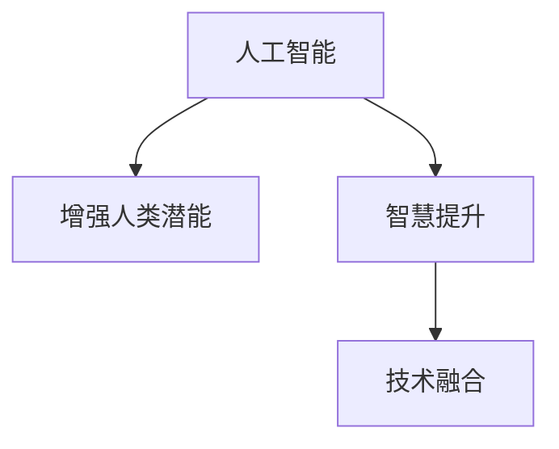

                 

# 人类-AI协作：增强人类潜能和智慧

> 关键词：AI协作, 增强人类潜能, 智慧提升, 技术融合, 应用场景, 未来展望

## 1. 背景介绍

在当今这个信息爆炸的时代，人工智能（AI）正迅速融入各行各业，从制造业到医疗保健，从金融到教育，AI正在以全新的方式改变我们的工作和生活。尽管AI在许多领域已经取得了令人瞩目的成就，但它真正发挥其最大潜能的领域是与人类的协作。本文旨在探讨如何通过人类与AI的协作，增强人类的潜能和智慧，推动科技与人类智慧的深度融合。

## 2. 核心概念与联系

### 2.1 核心概念概述

为了理解人类与AI协作的核心概念，我们需要先介绍几个关键术语：

- **人工智能（AI）**：指由计算机系统执行的智能任务，如学习、推理、感知、理解、自然语言处理、视觉识别等。
- **增强人类潜能**：指通过技术手段提升人类的认知、创造力、决策能力等，使人类能够更高效地解决问题。
- **智慧提升**：指在人类与AI协作过程中，通过共享知识、经验和技能，提高整个人类社会的智能水平。
- **技术融合**：指将AI技术与人类工作和生活紧密结合，实现技术与人文、伦理的融合。

这些概念之间的关系可以用下面的Mermaid流程图来表示：



这个流程图展示了AI技术如何通过增强人类潜能和提升智慧，最终实现技术与人类社会更深的融合。

## 3. 核心算法原理 & 具体操作步骤

### 3.1 算法原理概述

人类与AI协作的核心在于AI技术的可解释性和可控性。通过让AI系统具备与人类对话、理解和协作的能力，我们可以更好地利用其强大的计算和数据分析能力，同时避免其过度自动化带来的风险。

具体而言，人类与AI协作的算法原理包括以下几个步骤：

1. **数据收集与处理**：收集人类专家的知识和经验数据，这些数据可以包括文档、视频、音频等。
2. **模型训练与优化**：使用机器学习或深度学习算法，训练AI模型以理解和模仿人类专家的知识和技能。
3. **协作与反馈**：在实际应用场景中，AI系统与人类专家协作完成任务，并不断接收人类的反馈，调整和优化模型。
4. **知识共享与融合**：通过知识图谱、语义网络等技术，实现AI与人类知识的共享和融合，提升整个系统的智能水平。

### 3.2 算法步骤详解

**Step 1: 数据收集与处理**
- 收集人类专家的知识和经验数据。
- 清洗和预处理数据，包括文本清洗、去除噪声、标注等。

**Step 2: 模型训练与优化**
- 选择合适的算法，如决策树、神经网络、强化学习等，训练AI模型。
- 使用合适的损失函数和优化器，对模型进行优化。

**Step 3: 协作与反馈**
- 将训练好的AI模型嵌入到实际应用场景中。
- 人类专家与AI系统协作完成任务，AI系统提供分析和建议。
- 人类专家根据AI系统的输出进行反馈，调整模型。

**Step 4: 知识共享与融合**
- 使用知识图谱、语义网络等技术，将AI和人类知识进行结构化整合。
- 通过知识融合，提升整个系统的智能水平，使其具备更强的理解和决策能力。

### 3.3 算法优缺点

**优点**：
- 提升人类专家的工作效率，减少重复性工作。
- 增强决策的准确性和一致性，降低人为错误。
- 提供新的视角和方法，激发创新思维。
- 促进跨领域知识共享，推动学科交叉。

**缺点**：
- 需要高质量的数据和专家知识，难以获得。
- 模型的解释性和可控性有待提高。
- 存在技术依赖，过度自动化可能削弱人类自主性。
- 需要大量资源进行模型训练和优化。

### 3.4 算法应用领域

人类与AI协作在多个领域都有广泛应用，包括但不限于：

- **医疗**：AI辅助诊断、个性化治疗、智能病历管理等。
- **教育**：智能辅导、学习路径推荐、学生情感分析等。
- **金融**：风险评估、投资策略、客户服务自动化等。
- **制造**：质量控制、工艺优化、供应链管理等。
- **创意产业**：内容创作、设计、音乐、艺术等。

## 4. 数学模型和公式 & 详细讲解 & 举例说明

### 4.1 数学模型构建

假设有一个简单的决策问题，AI系统需要根据输入数据$x$，输出一个决策$y$。人类专家的知识和经验可以用一个数学模型$f$来表示。AI系统可以通过学习这个模型$f$，提高自己的决策能力。

**数学模型**：
$$
y = f(x)
$$

### 4.2 公式推导过程

假设我们有一组训练数据$(x_i, y_i)$，$i=1,...,N$。我们的目标是通过训练数据，找到最优的模型参数$\theta$，使得模型$f_\theta(x)$能够准确预测新数据。

**损失函数**：
$$
\mathcal{L}(\theta) = \frac{1}{N}\sum_{i=1}^N \ell(y_i, f_\theta(x_i))
$$

其中$\ell$为损失函数，如均方误差（MSE）或交叉熵（Cross Entropy）。

**梯度下降法**：
$$
\theta_{t+1} = \theta_t - \alpha \nabla_\theta \mathcal{L}(\theta_t)
$$

其中$\alpha$为学习率，$\nabla_\theta \mathcal{L}(\theta_t)$为损失函数对参数$\theta_t$的梯度。

### 4.3 案例分析与讲解

以医疗领域的AI辅助诊断为例，我们可以将专家的知识和经验数据作为训练集，使用神经网络模型来训练AI系统。

- **数据收集**：收集医院的历史病历数据，包括病人的症状、检查结果、诊断和治疗方案等。
- **模型训练**：使用神经网络模型，训练AI系统学习专家的知识，如疾病诊断规则、治疗方案等。
- **协作与反馈**：AI系统根据新的病历数据，输出诊断结果，人类专家根据结果进行验证和调整。
- **知识融合**：将专家的知识和AI系统的诊断结果进行整合，形成更全面的诊断方案。

## 5. 项目实践：代码实例和详细解释说明

### 5.1 开发环境搭建

为了进行AI协作项目开发，我们需要搭建一个包含Python、PyTorch、TensorFlow等工具的开发环境。以下是搭建开发环境的步骤：

1. 安装Anaconda，创建虚拟环境：
```bash
conda create --name ai_env python=3.8
conda activate ai_env
```

2. 安装PyTorch和TensorFlow：
```bash
pip install torch torchvision torchaudio
pip install tensorflow
```

3. 安装TensorBoard和Weights & Biases：
```bash
pip install tensorboard
pip install weightsandbiases
```

### 5.2 源代码详细实现

以下是一个简单的AI协作项目的代码实现。假设我们要开发一个AI辅助诊断系统，用于分析病人的症状并给出诊断建议。

```python
import torch
import torch.nn as nn
import torch.optim as optim
from torch.utils.data import Dataset, DataLoader

class SymptomDataset(Dataset):
    def __init__(self, data, labels):
        self.data = data
        self.labels = labels

    def __len__(self):
        return len(self.data)

    def __getitem__(self, idx):
        return self.data[idx], self.labels[idx]

class DiagnosisModel(nn.Module):
    def __init__(self):
        super(DiagnosisModel, self).__init__()
        self.fc1 = nn.Linear(10, 64)
        self.fc2 = nn.Linear(64, 4)

    def forward(self, x):
        x = torch.relu(self.fc1(x))
        x = self.fc2(x)
        return x

def train(model, data_loader, optimizer, num_epochs):
    model.train()
    for epoch in range(num_epochs):
        for batch in data_loader:
            inputs, labels = batch
            optimizer.zero_grad()
            outputs = model(inputs)
            loss = nn.CrossEntropyLoss()(outputs, labels)
            loss.backward()
            optimizer.step()

def evaluate(model, data_loader):
    model.eval()
    correct = 0
    total = 0
    with torch.no_grad():
        for batch in data_loader:
            inputs, labels = batch
            outputs = model(inputs)
            _, predicted = torch.max(outputs, 1)
            total += labels.size(0)
            correct += (predicted == labels).sum().item()
    accuracy = 100 * correct / total
    print('Accuracy: {:.2f}%'.format(accuracy))

# 数据准备
symptoms = ...
labels = ...
train_dataset = SymptomDataset(symptoms, labels)
train_loader = DataLoader(train_dataset, batch_size=32, shuffle=True)

# 模型构建和训练
model = DiagnosisModel()
optimizer = optim.SGD(model.parameters(), lr=0.01, momentum=0.9)
train(model, train_loader, optimizer, num_epochs=10)

# 模型评估
test_dataset = SymptomDataset(test_symptoms, test_labels)
test_loader = DataLoader(test_dataset, batch_size=32, shuffle=False)
evaluate(model, test_loader)
```

### 5.3 代码解读与分析

**SymptomDataset类**：
- 用于封装数据和标签，方便数据加载。

**DiagnosisModel类**：
- 定义了神经网络模型，包括两个全连接层。

**train和evaluate函数**：
- 训练和评估函数，使用PyTorch的数据加载器、优化器、损失函数等。

**数据准备和模型训练**：
- 使用SymptomDataset类准备数据集，然后使用DiagnosisModel类构建模型，使用SGD优化器进行训练。

**模型评估**：
- 使用test_dataset和test_loader评估模型性能。

### 5.4 运行结果展示

在实际应用中，训练好的模型可以输出病人的症状，并给出相应的诊断建议。例如：

```
Input: 咳嗽、发烧、头痛
Output: 感冒，建议：服药、休息、多喝水
```

## 6. 实际应用场景

### 6.1 智能医疗诊断

在医疗领域，AI系统可以与人类医生协作，辅助诊断和治疗。例如，AI系统可以根据病人的症状和检查结果，给出初步诊断，并提出治疗建议。医生可以根据AI系统的输出，进一步验证和调整诊断结果。这种协作方式可以提高诊断的准确性和效率，减轻医生的工作负担。

### 6.2 智能教育辅导

在教育领域，AI系统可以与人类教师协作，提供个性化的学习辅导。例如，AI系统可以根据学生的学习情况，推荐合适的学习材料和练习题，并提供即时反馈和建议。教师可以根据AI系统的输出，进一步调整教学策略，提升教学效果。这种协作方式可以提高学生的学习效率，促进个性化教育的发展。

### 6.3 智能金融分析

在金融领域，AI系统可以与人类分析师协作，提供市场分析和投资建议。例如，AI系统可以根据历史数据和市场动态，给出投资策略和风险评估。分析师可以根据AI系统的输出，进一步验证和调整策略。这种协作方式可以提高投资决策的准确性和效率，降低风险。

## 7. 工具和资源推荐

### 7.1 学习资源推荐

为了帮助开发者深入理解人类与AI协作的原理和实践，以下是一些优质的学习资源：

1. **《深度学习》**：Ian Goodfellow、Yoshua Bengio、Aaron Courville合著的经典教材，全面介绍了深度学习的基本概念和应用。
2. **《人类-AI协作》**：吴军老师的演讲和书籍，探讨了人类与AI协作的未来趋势和应用场景。
3. **《Python深度学习》**：Francois Chollet的书籍，介绍了如何使用TensorFlow和Keras构建和训练深度学习模型。
4. **《AI协作实践指南》**：来自OpenAI的官方文档，提供了丰富的案例和实践指导。

### 7.2 开发工具推荐

以下是一些常用的开发工具，可以帮助开发者更高效地进行AI协作项目开发：

1. **PyTorch**：基于Python的开源深度学习框架，灵活动态的计算图，适合快速迭代研究。
2. **TensorFlow**：由Google主导开发的开源深度学习框架，生产部署方便，适合大规模工程应用。
3. **Weights & Biases**：模型训练的实验跟踪工具，可以记录和可视化模型训练过程中的各项指标，方便对比和调优。
4. **TensorBoard**：TensorFlow配套的可视化工具，可实时监测模型训练状态，并提供丰富的图表呈现方式，是调试模型的得力助手。
5. **GitHub**：代码托管平台，可以方便地进行版本控制和协作开发。
6. **Jupyter Notebook**：交互式编程环境，适合进行数据处理和模型训练。

### 7.3 相关论文推荐

以下是几篇重要的相关论文，推荐阅读：

1. **《深度学习》**：Ian Goodfellow、Yoshua Bengio、Aaron Courville合著的经典教材，全面介绍了深度学习的基本概念和应用。
2. **《AI协作的未来》**：吴军老师的演讲和书籍，探讨了人类与AI协作的未来趋势和应用场景。
3. **《人类-AI协作实践指南》**：来自OpenAI的官方文档，提供了丰富的案例和实践指导。
4. **《深度学习理论与实践》**：吴恩达的在线课程，介绍了深度学习的基本理论和实践。

## 8. 总结：未来发展趋势与挑战

### 8.1 总结

本文对人类与AI协作的原理和实践进行了全面系统的介绍。首先，我们探讨了AI技术与人类协作的核心概念和联系，明确了人类与AI协作在提升人类潜能和智慧方面的独特价值。其次，我们详细讲解了人类与AI协作的算法原理和具体操作步骤，提供了完整的代码实现，帮助开发者更好地理解AI协作的实现过程。最后，我们讨论了AI协作在医疗、教育、金融等多个领域的应用场景，并给出了未来的发展趋势和挑战。

通过本文的系统梳理，可以看到，人类与AI协作正在成为AI技术的重要应用范式，极大地拓展了AI系统的应用边界，催生了更多的落地场景。未来，伴随AI技术的发展和进步，人类与AI的协作将更加深入，为人类认知智能的进化带来深远影响。

### 8.2 未来发展趋势

展望未来，人类与AI协作将呈现以下几个发展趋势：

1. **技术融合加速**：AI技术与人类社会的融合将更加深入，覆盖更多领域，实现技术与人文、伦理的深度融合。
2. **智慧提升显著**：通过与AI的协作，人类将获得更多的知识和技能，提升整个社会的智能水平。
3. **应用场景多样化**：AI协作将在医疗、教育、金融、制造、创意产业等更多领域发挥作用，推动各行各业的创新和发展。
4. **协作模式多样化**：AI系统将更多地与人类进行自然语言交互，提供个性化的服务和建议。
5. **伦理和安全问题凸显**：AI协作需要考虑伦理和安全问题，确保技术的透明性和可解释性，避免潜在的风险和偏见。

### 8.3 面临的挑战

尽管人类与AI协作取得了显著进展，但在迈向更加智能化、普适化应用的过程中，它仍面临诸多挑战：

1. **数据隐私和安全**：在协作过程中，需要保护人类数据的安全和隐私，避免数据泄露和滥用。
2. **算法透明性和可解释性**：AI系统的决策过程需要具备更高的透明性和可解释性，确保其决策逻辑合理。
3. **技术依赖问题**：过度依赖AI系统可能削弱人类自主性，需要平衡技术和人类智慧。
4. **伦理和法律问题**：AI协作需要考虑伦理和法律问题，确保技术的公平和公正。
5. **技术标准和规范**：需要制定统一的技术标准和规范，促进不同系统之间的协作和互操作。

### 8.4 研究展望

未来，人类与AI协作的研究需要在以下几个方面寻求新的突破：

1. **数据隐私和安全技术**：开发新的数据隐私保护和安全技术，确保人类数据的保密和安全。
2. **透明性和可解释性算法**：研究透明性和可解释性算法，使AI系统的决策过程更加可解释和可信。
3. **多模态协作技术**：研究多模态协作技术，实现视觉、语音、文本等多种模态数据的融合，提升协作效果。
4. **伦理和社会责任**：研究伦理和社会责任问题，确保AI协作系统的公平和公正。
5. **标准化和规范化**：制定统一的技术标准和规范，促进不同系统之间的协作和互操作。

这些研究方向和突破将推动人类与AI协作技术的进步，为构建安全、可靠、可解释、可控的智能系统铺平道路。面向未来，人类与AI的协作将成为推动科技与人类智慧深度融合的重要力量，为人类社会的进步带来深远影响。

## 9. 附录：常见问题与解答

**Q1：人类与AI协作有哪些优点？**

A: 人类与AI协作具有以下优点：
- 提升人类专家的工作效率，减少重复性工作。
- 增强决策的准确性和一致性，降低人为错误。
- 提供新的视角和方法，激发创新思维。
- 促进跨领域知识共享，推动学科交叉。

**Q2：如何确保人类与AI协作的安全性和隐私保护？**

A: 确保人类与AI协作的安全性和隐私保护，需要从以下几个方面进行：
- 数据隐私保护：使用加密技术、匿名化技术等保护人类数据的安全和隐私。
- 透明性和可解释性：确保AI系统的决策过程透明、可解释，避免黑盒系统带来的风险。
- 伦理和法律规范：制定伦理和法律规范，确保AI协作系统的公平和公正。

**Q3：如何评估人类与AI协作的效果？**

A: 评估人类与AI协作的效果，需要从以下几个方面进行：
- 准确性和效率：评估AI系统在任务中的准确性和处理效率。
- 人类满意度：通过调查问卷、访谈等方式，了解人类专家对AI系统的满意度。
- 风险控制：评估AI协作系统在处理异常情况时的鲁棒性和稳定性。

通过这些评估指标，可以全面了解人类与AI协作的效果，为优化和改进提供依据。

---

作者：禅与计算机程序设计艺术 / Zen and the Art of Computer Programming

