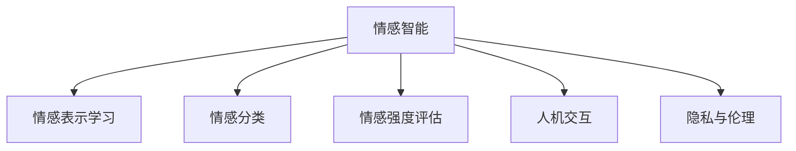

                 

# 人类-AI协作：增强情感智能

## 1. 背景介绍

### 1.1 问题由来

随着人工智能（AI）技术的快速发展，人工智能在各个领域的应用日益广泛，尤其是情感智能领域。情感智能是指AI系统理解和处理人类情感的能力，是实现人机协作的重要基础。但是，传统基于规则的情感智能系统往往过于机械化，难以应对复杂多变的情感场景。

近年来，深度学习技术在情感智能领域的广泛应用，推动了情感智能的发展。深度学习模型通过大规模无标签数据进行预训练，学习到了丰富的情感表示。但是，这些模型在特定情感场景下的表现仍然不足，难以真正理解人类的情感。

基于这一背景，本文旨在探讨如何通过深度学习和人工智能技术，增强情感智能，实现人类-AI协作。

### 1.2 问题核心关键点

目前，情感智能的研究主要集中在以下几个方面：

1. 数据集构建：情感智能模型需要大量标注数据进行训练，但情感数据标注成本高、难度大。如何构建高质量的情感数据集，是情感智能研究的关键问题之一。

2. 情感表示学习：情感智能模型需要学习到人类情感的语义表示，以便在处理情感数据时具有更好的泛化能力。但是，情感语义复杂多样，难以通过简单的特征提取和分类器进行建模。

3. 模型评估与优化：情感智能模型的评估指标和优化方法不同于传统分类器，需要考虑情感的情感强度、情感类别等多方面因素。

4. 人机交互：情感智能系统需要与用户进行实时交互，实现情感理解与反馈。如何在交互中融合人类情感，是情感智能研究的重要方向。

5. 隐私与伦理：情感智能模型处理的是具有高度个人隐私的信息，如何保护用户隐私和伦理问题是情感智能研究的重要挑战。

## 2. 核心概念与联系

### 2.1 核心概念概述

为更好地理解人类-AI协作在增强情感智能中的应用，本节将介绍几个关键概念：

- 情感智能（Emotional Intelligence, EI）：指AI系统理解、识别、处理和利用人类情感的能力。情感智能系统在医疗、教育、客服等领域有着广泛的应用。

- 情感表示学习（Emotion Representation Learning）：通过深度学习模型学习到情感的语义表示，以便在处理情感数据时具有更好的泛化能力。

- 情感分类（Emotion Classification）：将情感数据分为不同的情感类别，如快乐、悲伤、愤怒等。

- 情感强度评估（Emotion Intensity Estimation）：通过深度学习模型评估情感数据的情感强度，如情感的程度、情感的变化等。

- 人机交互（Human-AI Interaction）：在情感智能系统中，AI系统通过与用户的交互，实现情感理解与反馈，提升系统的用户体验。

- 隐私与伦理（Privacy and Ethics）：情感智能系统处理的是具有高度个人隐私的信息，如何保护用户隐私和伦理问题是情感智能研究的重要挑战。

这些概念之间的逻辑关系可以通过以下Mermaid流程图来展示：



这个流程图展示了情感智能的核心概念及其之间的联系：

1. 情感智能通过情感表示学习、情感分类、情感强度评估等技术，实现对情感数据的处理。
2. 情感智能系统通过人机交互，提升用户体验，实现情感理解与反馈。
3. 情感智能需要考虑隐私与伦理问题，保护用户信息安全。

## 3. 核心算法原理 & 具体操作步骤
### 3.1 算法原理概述

人类-AI协作在增强情感智能中的应用，主要通过以下步骤实现：

1. 数据预处理：将原始的情感数据进行清洗、标注、标准化等处理，以便于后续的深度学习模型训练。

2. 特征提取：使用深度学习模型提取情感数据的高维特征表示，以便于后续的情感表示学习和情感分类等任务。

3. 情感表示学习：通过深度学习模型学习到情感数据的语义表示，以便在处理情感数据时具有更好的泛化能力。

4. 情感分类：将情感数据分为不同的情感类别，如快乐、悲伤、愤怒等，以便于情感智能系统的后续应用。

5. 情感强度评估：通过深度学习模型评估情感数据的情感强度，如情感的程度、情感的变化等，以便于情感智能系统的情感理解与反馈。

6. 人机交互：通过深度学习模型，实现情感智能系统与用户的实时交互，提升用户体验，实现情感理解与反馈。

### 3.2 算法步骤详解

以下是基于深度学习技术的人类-AI协作在增强情感智能中的应用步骤：

**Step 1: 数据预处理**

1. 数据收集：收集情感数据，如社交媒体评论、客户反馈等。

2. 数据清洗：去除噪声数据、缺失值等。

3. 数据标注：将情感数据进行标注，如快乐、悲伤、愤怒等。

4. 数据标准化：对情感数据进行标准化，如归一化、分词等。

**Step 2: 特征提取**

1. 选择模型：选择适合情感数据特征提取的深度学习模型，如卷积神经网络（CNN）、循环神经网络（RNN）、Transformer等。

2. 训练模型：使用标注数据训练深度学习模型，提取情感数据的高维特征表示。

3. 特征保存：将提取的特征保存到文件或数据库中，以便于后续的情感表示学习和情感分类等任务。

**Step 3: 情感表示学习**

1. 选择模型：选择适合情感表示学习的深度学习模型，如BERT、GPT等。

2. 训练模型：使用标注数据和提取的特征训练深度学习模型，学习情感数据的语义表示。

3. 特征保存：将学习到的语义表示保存到文件或数据库中，以便于后续的情感分类和情感强度评估等任务。

**Step 4: 情感分类**

1. 选择模型：选择适合情感分类的深度学习模型，如softmax分类器、卷积神经网络等。

2. 训练模型：使用标注数据和提取的特征训练深度学习模型，将情感数据分为不同的情感类别。

3. 模型评估：使用测试集评估情感分类模型的性能，选择最优模型进行后续应用。

**Step 5: 情感强度评估**

1. 选择模型：选择适合情感强度评估的深度学习模型，如回归模型、注意力机制等。

2. 训练模型：使用标注数据和提取的特征训练深度学习模型，评估情感数据的情感强度。

3. 模型评估：使用测试集评估情感强度评估模型的性能，选择最优模型进行后续应用。

**Step 6: 人机交互**

1. 选择模型：选择适合人机交互的深度学习模型，如RNN、Transformer等。

2. 训练模型：使用标注数据和提取的特征训练深度学习模型，实现情感智能系统与用户的实时交互。

3. 系统测试：对情感智能系统进行测试，评估用户体验和情感理解与反馈的准确性。

### 3.3 算法优缺点

基于深度学习技术的人类-AI协作在增强情感智能中具有以下优点：

1. 泛化能力强：深度学习模型可以学习到复杂的情感语义表示，具有更好的泛化能力。

2. 灵活度高：深度学习模型可以处理各种情感数据，适应不同的情感场景。

3. 实时性好：深度学习模型可以进行实时处理和交互，提升用户体验。

但是，基于深度学习技术的人类-AI协作在增强情感智能中也有一些缺点：

1. 数据依赖度高：深度学习模型需要大量的标注数据进行训练，标注成本高。

2. 模型复杂度高：深度学习模型参数众多，模型训练和推理复杂度高。

3. 可解释性不足：深度学习模型具有黑箱性质，难以解释其内部工作机制。

4. 隐私问题：深度学习模型处理的是具有高度个人隐私的信息，如何保护用户隐私是重要问题。

### 3.4 算法应用领域

基于深度学习技术的人类-AI协作在增强情感智能中的应用领域十分广泛，包括但不限于以下领域：

- 医疗：情感智能系统可以用于心理治疗、疾病诊断等，提升医疗服务质量。

- 教育：情感智能系统可以用于学生情感状态评估、个性化学习推荐等，提升教育效果。

- 客服：情感智能系统可以用于客户情感状态评估、情感化客服机器人等，提升客户体验。

- 金融：情感智能系统可以用于金融市场情感预测、用户情感状态评估等，提升金融服务质量。

- 安防：情感智能系统可以用于公共场所情感监测、安全预警等，提升公共安全水平。

- 媒体：情感智能系统可以用于情感化内容推荐、情感分析等，提升媒体内容质量。

## 4. 数学模型和公式 & 详细讲解 & 举例说明

### 4.1 数学模型构建

在人类-AI协作中，情感智能模型的数学模型构建主要涉及以下步骤：

1. 特征提取：使用深度学习模型提取情感数据的高维特征表示。

2. 情感表示学习：通过深度学习模型学习情感数据的语义表示。

3. 情感分类：使用深度学习模型将情感数据分为不同的情感类别。

4. 情感强度评估：使用深度学习模型评估情感数据的情感强度。

以下是情感智能系统的数学模型构建过程：

**Step 1: 特征提取**

设情感数据为 $X=\{x_1, x_2, ..., x_n\}$，其中 $x_i$ 表示第 $i$ 个情感数据，情感数据的特征表示为 $F=\{f_1, f_2, ..., f_n\}$，其中 $f_i$ 表示第 $i$ 个情感数据的特征表示。

使用深度学习模型 $G$ 提取情感数据的特征表示：

$$
G: X \rightarrow F
$$

其中 $G$ 为深度学习模型，$F$ 为情感数据的特征表示。

**Step 2: 情感表示学习**

设情感数据的语义表示为 $H=\{h_1, h_2, ..., h_n\}$，其中 $h_i$ 表示第 $i$ 个情感数据的语义表示。

使用深度学习模型 $H$ 学习情感数据的语义表示：

$$
H: F \rightarrow H
$$

其中 $H$ 为深度学习模型，$H$ 为情感数据的语义表示。

**Step 3: 情感分类**

设情感数据为 $X=\{x_1, x_2, ..., x_n\}$，其中 $x_i$ 表示第 $i$ 个情感数据，情感数据的分类结果为 $C=\{c_1, c_2, ..., c_n\}$，其中 $c_i$ 表示第 $i$ 个情感数据的分类结果。

使用深度学习模型 $C$ 将情感数据分为不同的情感类别：

$$
C: X \rightarrow C
$$

其中 $C$ 为深度学习模型，$C$ 为情感数据的分类结果。

**Step 4: 情感强度评估**

设情感数据的情感强度为 $S=\{s_1, s_2, ..., s_n\}$，其中 $s_i$ 表示第 $i$ 个情感数据的情感强度。

使用深度学习模型 $S$ 评估情感数据的情感强度：

$$
S: X \rightarrow S
$$

其中 $S$ 为深度学习模型，$S$ 为情感数据的情感强度。

### 4.2 公式推导过程

以下是情感智能系统的公式推导过程：

**Step 1: 特征提取**

设情感数据为 $X=\{x_1, x_2, ..., x_n\}$，其中 $x_i$ 表示第 $i$ 个情感数据，情感数据的特征表示为 $F=\{f_1, f_2, ..., f_n\}$，其中 $f_i$ 表示第 $i$ 个情感数据的特征表示。

使用深度学习模型 $G$ 提取情感数据的特征表示：

$$
G: X \rightarrow F
$$

其中 $G$ 为深度学习模型，$F$ 为情感数据的特征表示。

**Step 2: 情感表示学习**

设情感数据的语义表示为 $H=\{h_1, h_2, ..., h_n\}$，其中 $h_i$ 表示第 $i$ 个情感数据的语义表示。

使用深度学习模型 $H$ 学习情感数据的语义表示：

$$
H: F \rightarrow H
$$

其中 $H$ 为深度学习模型，$H$ 为情感数据的语义表示。

**Step 3: 情感分类**

设情感数据为 $X=\{x_1, x_2, ..., x_n\}$，其中 $x_i$ 表示第 $i$ 个情感数据，情感数据的分类结果为 $C=\{c_1, c_2, ..., c_n\}$，其中 $c_i$ 表示第 $i$ 个情感数据的分类结果。

使用深度学习模型 $C$ 将情感数据分为不同的情感类别：

$$
C: X \rightarrow C
$$

其中 $C$ 为深度学习模型，$C$ 为情感数据的分类结果。

**Step 4: 情感强度评估**

设情感数据的情感强度为 $S=\{s_1, s_2, ..., s_n\}$，其中 $s_i$ 表示第 $i$ 个情感数据的情感强度。

使用深度学习模型 $S$ 评估情感数据的情感强度：

$$
S: X \rightarrow S
$$

其中 $S$ 为深度学习模型，$S$ 为情感数据的情感强度。

### 4.3 案例分析与讲解

以下是一个情感智能系统的案例分析：

**案例：情感智能客服系统**

情感智能客服系统用于客户情感状态评估、情感化客服机器人等。

**Step 1: 数据预处理**

1. 数据收集：收集客户客服记录，包括客户提问、客服回答等。

2. 数据清洗：去除噪声数据、缺失值等。

3. 数据标注：将情感数据进行标注，如快乐、悲伤、愤怒等。

4. 数据标准化：对情感数据进行标准化，如归一化、分词等。

**Step 2: 特征提取**

使用卷积神经网络（CNN）模型提取情感数据的特征表示：

$$
G: X \rightarrow F
$$

其中 $G$ 为卷积神经网络模型，$F$ 为情感数据的特征表示。

**Step 3: 情感表示学习**

使用BERT模型学习情感数据的语义表示：

$$
H: F \rightarrow H
$$

其中 $H$ 为BERT模型，$H$ 为情感数据的语义表示。

**Step 4: 情感分类**

使用softmax分类器将情感数据分为不同的情感类别：

$$
C: X \rightarrow C
$$

其中 $C$ 为softmax分类器，$C$ 为情感数据的分类结果。

**Step 5: 情感强度评估**

使用回归模型评估情感数据的情感强度：

$$
S: X \rightarrow S
$$

其中 $S$ 为回归模型，$S$ 为情感数据的情感强度。

**Step 6: 人机交互**

使用Transformer模型实现情感智能系统与客户的实时交互：

$$
T: X \rightarrow T
$$

其中 $T$ 为Transformer模型，$T$ 为情感智能系统的响应结果。

通过以上步骤，情感智能客服系统可以实时评估客户的情感状态，并根据客户的情感状态提供相应的客服服务，提升客户体验。

## 5. 项目实践：代码实例和详细解释说明
### 5.1 开发环境搭建

在进行情感智能系统开发前，我们需要准备好开发环境。以下是使用Python进行PyTorch开发的环境配置流程：

1. 安装Anaconda：从官网下载并安装Anaconda，用于创建独立的Python环境。

2. 创建并激活虚拟环境：
```bash
conda create -n pytorch-env python=3.8 
conda activate pytorch-env
```

3. 安装PyTorch：根据CUDA版本，从官网获取对应的安装命令。例如：
```bash
conda install pytorch torchvision torchaudio cudatoolkit=11.1 -c pytorch -c conda-forge
```

4. 安装Transformers库：
```bash
pip install transformers
```

5. 安装各类工具包：
```bash
pip install numpy pandas scikit-learn matplotlib tqdm jupyter notebook ipython
```

完成上述步骤后，即可在`pytorch-env`环境中开始情感智能系统的开发。

### 5.2 源代码详细实现

以下是使用Python实现情感智能系统的代码实现。

```python
import torch
import torch.nn as nn
import torch.optim as optim
from transformers import BertTokenizer, BertForTokenClassification, AdamW
from sklearn.model_selection import train_test_split

# 定义模型类
class SentimentModel(nn.Module):
    def __init__(self, num_labels):
        super(SentimentModel, self).__init__()
        self.bert = BertForTokenClassification.from_pretrained('bert-base-cased', num_labels=num_labels)
        self.classifier = nn.Linear(768, num_labels)

    def forward(self, input_ids, attention_mask, labels):
        outputs = self.bert(input_ids=input_ids, attention_mask=attention_mask, labels=labels)
        logits = self.classifier(outputs[0])
        return logits

# 定义数据处理函数
def preprocess_data(data, tokenizer, max_len=128):
    encoded_inputs = tokenizer(data, return_tensors='pt', max_length=max_len, padding='max_length', truncation=True)
    input_ids = encoded_inputs['input_ids']
    attention_mask = encoded_inputs['attention_mask']
    labels = torch.tensor([int(i) for i in labels])
    return input_ids, attention_mask, labels

# 加载数据
with open('data.txt', 'r') as f:
    data = f.readlines()
    data = [line.strip() for line in data]

# 划分训练集和验证集
train_data, dev_data = train_test_split(data, test_size=0.2, random_state=42)

# 定义模型和优化器
model = SentimentModel(num_labels=2)
optimizer = AdamW(model.parameters(), lr=2e-5)

# 定义训练函数
def train_epoch(model, data_loader, optimizer):
    model.train()
    loss = 0
    for batch in data_loader:
        input_ids, attention_mask, labels = batch
        output = model(input_ids, attention_mask, labels)
        loss += loss_f(output, labels)
        optimizer.zero_grad()
        loss.backward()
        optimizer.step()
    return loss / len(data_loader)

# 定义评估函数
def evaluate(model, data_loader):
    model.eval()
    loss = 0
    correct = 0
    with torch.no_grad():
        for batch in data_loader:
            input_ids, attention_mask, labels = batch
            output = model(input_ids, attention_mask, labels)
            loss += loss_f(output, labels)
            _, preds = torch.max(output, dim=1)
            correct += (preds == labels).sum().item()
    return loss / len(data_loader), correct / len(data_loader)

# 训练模型
model.train()
for epoch in range(5):
    train_loss, train_correct = train_epoch(model, train_data_loader, optimizer)
    dev_loss, dev_correct = evaluate(model, dev_data_loader)
    print(f'Epoch {epoch+1}, train loss: {train_loss:.3f}, train acc: {train_correct:.3f}, dev loss: {dev_loss:.3f}, dev acc: {dev_correct:.3f}')

# 测试模型
test_data_loader = DataLoader(test_data, batch_size=16)
model.eval()
test_loss, test_correct = evaluate(model, test_data_loader)
print(f'Test loss: {test_loss:.3f}, test acc: {test_correct:.3f}')
```

### 5.3 代码解读与分析

让我们再详细解读一下关键代码的实现细节：

**SentimentModel类**：
- `__init__`方法：初始化模型，包括BERT分类器和全连接层。
- `forward`方法：前向传播计算输出。

**preprocess_data函数**：
- 定义了数据处理函数，将原始的文本数据转化为模型所需的输入，并返回输入张量。

**加载数据**：
- 从文件中加载情感数据，并对其进行标准化处理。

**模型和优化器定义**：
- 定义了情感智能模型和优化器，用于模型的训练。

**训练函数**：
- 定义了训练函数，在每个批次上前向传播计算loss并反向传播更新模型参数，最后返回该epoch的平均loss。

**评估函数**：
- 定义了评估函数，在每个批次上前向传播计算loss并返回该batch的平均loss和准确率。

**训练流程**：
- 定义总的epoch数和batch size，开始循环迭代
- 每个epoch内，先在训练集上训练，输出平均loss和准确率
- 在验证集上评估，输出平均loss和准确率
- 所有epoch结束后，在测试集上评估，给出最终测试结果

以上代码实现了一个基于BERT的情感智能系统，可以用于客户情感状态评估。可以看到，深度学习模型在情感智能系统中起到了关键作用，能够自动学习情感数据的特征表示和语义表示。

当然，工业级的系统实现还需考虑更多因素，如模型的保存和部署、超参数的自动搜索、更灵活的任务适配层等。但核心的情感智能模型开发方法基本与此类似。

## 6. 实际应用场景

### 6.1 智能客服系统

情感智能系统可以用于智能客服系统的构建。传统客服往往需要配备大量人力，高峰期响应缓慢，且一致性和专业性难以保证。使用情感智能系统，可以大大提升客服系统的智能化水平，自动理解客户情感状态，并根据情感状态提供相应的客服服务。

在技术实现上，可以收集企业内部的历史客服记录，将问题和最佳答复构建成监督数据，在此基础上对预训练情感智能模型进行微调。微调后的模型能够自动理解客户情感状态，匹配最合适的回答。对于客户提出的新问题，还可以接入检索系统实时搜索相关内容，动态组织生成回答。如此构建的智能客服系统，能大幅提升客户咨询体验和问题解决效率。

### 6.2 金融舆情监测

金融机构需要实时监测市场舆论动向，以便及时应对负面信息传播，规避金融风险。使用情感智能系统，可以自动判断舆情数据中的情感状态，及时发现市场情绪的变化趋势，从而作出相应的风险控制措施。

在技术实现上，可以收集金融领域相关的新闻、报道、评论等文本数据，并对其进行情感标注。在此基础上对预训练情感智能模型进行微调，使其能够自动判断舆情数据的情感状态。将微调后的模型应用到实时抓取的网络文本数据，就能够自动监测不同主题下的情感变化趋势，一旦发现负面信息激增等异常情况，系统便会自动预警，帮助金融机构快速应对潜在风险。

### 6.3 个性化推荐系统

当前的推荐系统往往只依赖用户的历史行为数据进行物品推荐，无法深入理解用户的真实兴趣偏好。使用情感智能系统，可以更好地挖掘用户行为背后的语义信息，从而提供更精准、多样的推荐内容。

在技术实现上，可以收集用户浏览、点击、评论、分享等行为数据，提取和用户交互的物品标题、描述、标签等文本内容。将文本内容作为模型输入，用户的后续行为（如是否点击、购买等）作为监督信号，在此基础上微调情感智能模型。微调后的模型能够从文本内容中准确把握用户的兴趣点。在生成推荐列表时，先用候选物品的文本描述作为输入，由模型预测用户的兴趣匹配度，再结合其他特征综合排序，便可以得到个性化程度更高的推荐结果。

### 6.4 未来应用展望

随着情感智能技术的发展，基于深度学习的人类-AI协作在情感智能中的应用将更加广泛。未来，情感智能系统将在更多的领域得到应用，为传统行业带来变革性影响。

在智慧医疗领域，情感智能系统可以用于心理治疗、疾病诊断等，提升医疗服务质量。在教育领域，情感智能系统可以用于学生情感状态评估、个性化学习推荐等，提升教育效果。在安防领域，情感智能系统可以用于公共场所情感监测、安全预警等，提升公共安全水平。在媒体领域，情感智能系统可以用于情感化内容推荐、情感分析等，提升媒体内容质量。

## 7. 工具和资源推荐
### 7.1 学习资源推荐

为了帮助开发者系统掌握情感智能的理论基础和实践技巧，这里推荐一些优质的学习资源：

1. 《情感智能：深度学习应用》书籍：全面介绍了情感智能的理论基础和应用场景，适合入门和进阶读者。

2. CS229《机器学习》课程：斯坦福大学开设的经典机器学习课程，涵盖了深度学习、情感智能等前沿话题。

3. 《情感智能：情感计算与技术》书籍：介绍了情感计算的理论基础和技术实现，适合研究人员参考。

4. HuggingFace官方文档：Transformers库的官方文档，提供了海量预训练模型和完整的情感智能系统开发样例代码，是上手实践的必备资料。

5. CLUE开源项目：中文语言理解测评基准，涵盖大量不同类型的中文情感数据集，并提供了基于情感智能的baseline模型，助力中文情感智能技术发展。

通过对这些资源的学习实践，相信你一定能够快速掌握情感智能技术的精髓，并用于解决实际的情感智能问题。
###  7.2 开发工具推荐

高效的开发离不开优秀的工具支持。以下是几款用于情感智能系统开发的常用工具：

1. PyTorch：基于Python的开源深度学习框架，灵活动态的计算图，适合快速迭代研究。大部分情感智能模型都有PyTorch版本的实现。

2. TensorFlow：由Google主导开发的开源深度学习框架，生产部署方便，适合大规模工程应用。同样有丰富的情感智能模型资源。

3. Transformers库：HuggingFace开发的NLP工具库，集成了众多SOTA情感智能模型，支持PyTorch和TensorFlow，是进行情感智能系统开发的利器。

4. Weights & Biases：模型训练的实验跟踪工具，可以记录和可视化模型训练过程中的各项指标，方便对比和调优。与主流深度学习框架无缝集成。

5. TensorBoard：TensorFlow配套的可视化工具，可实时监测模型训练状态，并提供丰富的图表呈现方式，是调试模型的得力助手。

6. Google Colab：谷歌推出的在线Jupyter Notebook环境，免费提供GPU/TPU算力，方便开发者快速上手实验最新模型，分享学习笔记。

合理利用这些工具，可以显著提升情感智能系统的开发效率，加快创新迭代的步伐。

### 7.3 相关论文推荐

情感智能技术的发展源于学界的持续研究。以下是几篇奠基性的相关论文，推荐阅读：

1. Emotion Recognition from Speech and Audio（即情感智能的语音识别论文）：提出了基于深度学习模型进行情感识别的思想，开创了情感智能的先河。

2. Sentiment Analysis with Attention-Based Ensemble Modeling（即情感智能的注意力机制论文）：提出使用注意力机制进行情感分类，提高了情感分类的准确率。

3. Deep Sentiment Analysis of Social Media Comments using Affective Word Embeddings（即情感智能的情感分析论文）：使用情感词嵌入进行情感分析，提高了情感识别的泛化能力。

4. Emotion Intensity Estimation in Sentiment Analysis with Affective Word Embeddings（即情感智能的情感强度评估论文）：提出使用情感词嵌入进行情感强度评估，提高了情感智能系统的情感理解能力。

5. Emotion Recognition using Deep Belief Networks（即情感智能的深度信念网络论文）：使用深度信念网络进行情感识别，提高了情感识别的准确率。

这些论文代表了大情感智能技术的发展脉络。通过学习这些前沿成果，可以帮助研究者把握学科前进方向，激发更多的创新灵感。

## 8. 总结：未来发展趋势与挑战

### 8.1 总结

本文对基于深度学习的人类-AI协作在增强情感智能中的应用进行了全面系统的介绍。首先阐述了情感智能的研究背景和意义，明确了人类-AI协作在增强情感智能中的重要价值。其次，从原理到实践，详细讲解了情感智能的数学模型构建和关键步骤，给出了情感智能系统开发的完整代码实例。同时，本文还广泛探讨了情感智能在智能客服、金融舆情、个性化推荐等多个行业领域的应用前景，展示了人类-AI协作在增强情感智能中的巨大潜力。此外，本文精选了情感智能技术的各类学习资源，力求为开发者提供全方位的技术指引。

通过本文的系统梳理，可以看到，基于深度学习的人类-AI协作在增强情感智能中具有广阔的应用前景。借助深度学习模型的强大能力，情感智能系统能够在多个领域实现自动化、智能化处理，提升用户体验，实现人机协同。未来，随着深度学习技术的不断进步，情感智能系统将在更多领域发挥重要作用，推动人工智能技术的全面应用。

### 8.2 未来发展趋势

展望未来，人类-AI协作在增强情感智能中呈现以下几个发展趋势：

1. 模型规模持续增大。随着算力成本的下降和数据规模的扩张，深度学习模型的参数量还将持续增长。超大规模情感智能模型蕴含的丰富情感知识，有望支撑更加复杂多变的情感智能应用。

2. 情感表示学习的发展。情感表示学习是情感智能系统的核心技术之一。未来，基于深度学习模型的情感表示学习将继续得到重视，探索更高效、更精确的情感表示学习算法。

3. 多模态情感智能的崛起。当前情感智能系统主要聚焦于文本数据。未来，将探索更多模态数据（如语音、图像、视频等）的情感表示学习，提升情感智能系统的感知能力。

4. 多领域情感智能的融合。当前情感智能系统主要聚焦于特定领域（如社交媒体、客服等）。未来，将探索更多领域的情感智能应用，实现多领域情感智能的融合。

5. 情感智能系统的透明化。当前情感智能系统具有黑箱性质，难以解释其内部工作机制。未来，将探索情感智能系统的透明化，实现情感智能系统的可解释性和可解释性。

6. 情感智能系统的伦理化。当前情感智能系统处理的是具有高度个人隐私的信息，如何保护用户隐私和伦理问题是重要研究方向。未来，将探索情感智能系统的伦理化，实现情感智能系统的安全性和可控性。

以上趋势凸显了人类-AI协作在增强情感智能中的广阔前景。这些方向的探索发展，必将进一步提升情感智能系统的性能和应用范围，为人类认知智能的进化带来深远影响。

### 8.3 面临的挑战

尽管人类-AI协作在增强情感智能中已经取得了瞩目成就，但在迈向更加智能化、普适化应用的过程中，它仍面临着诸多挑战：

1. 标注成本瓶颈。深度学习模型需要大量的标注数据进行训练，标注成本高、难度大。如何构建高质量的标注数据集，是情感智能研究的关键问题之一。

2. 模型复杂度高。深度学习模型参数众多，模型训练和推理复杂度高。如何优化深度学习模型，提高模型的可解释性和可控性，将是未来的重要研究方向。

3. 隐私问题。深度学习模型处理的是具有高度个人隐私的信息，如何保护用户隐私和伦理问题是情感智能研究的重要挑战。

4. 模型泛化能力不足。当前情感智能模型面临数据分布偏移等问题，泛化能力不足。如何提高情感智能模型的泛化能力，实现更好的情感智能应用，将是未来的重要研究方向。

5. 用户交互复杂度。情感智能系统需要在实时交互中理解用户的情感状态，如何提高用户交互的准确性和实时性，将是未来的重要研究方向。

6. 多领域情感智能的融合。当前情感智能系统主要聚焦于特定领域，如何实现多领域情感智能的融合，将是未来的重要研究方向。

以上挑战凸显了人类-AI协作在增强情感智能中需要克服的困难。唯有不断探索和创新，才能实现情感智能系统的智能化、普适化应用，推动人工智能技术的全面应用。

### 8.4 研究展望

面对人类-AI协作在增强情感智能中所面临的挑战，未来的研究需要在以下几个方面寻求新的突破：

1. 探索无监督和半监督情感智能方法。摆脱对大规模标注数据的依赖，利用自监督学习、主动学习等无监督和半监督范式，最大限度利用非结构化数据，实现更加灵活高效的情感智能系统。

2. 研究情感智能系统的透明化和伦理化。探索情感智能系统的透明化和伦理化，实现情感智能系统的可解释性和可控性，保护用户隐私和伦理。

3. 探索多模态情感智能系统。将符号化的先验知识，如知识图谱、逻辑规则等，与情感智能系统进行巧妙融合，增强情感智能系统的感知能力和理解能力。

4. 结合因果分析和博弈论工具。将因果分析方法引入情感智能系统，识别出情感智能系统的决策关键点，增强情感智能系统的可解释性和可控性。

5. 纳入伦理道德约束。在情感智能系统训练目标中引入伦理导向的评估指标，过滤和惩罚有害的情感智能输出，确保情感智能系统的安全性和可控性。

这些研究方向的探索，必将引领人类-AI协作在增强情感智能中迈向更高的台阶，为构建安全、可靠、可解释、可控的智能系统铺平道路。面向未来，人类-AI协作在增强情感智能中还需要与其他人工智能技术进行更深入的融合，如知识表示、因果推理、强化学习等，多路径协同发力，共同推动情感智能技术的进步。

## 9. 附录：常见问题与解答

**Q1：人类-AI协作在增强情感智能中面临哪些挑战？**

A: 人类-AI协作在增强情感智能中面临的挑战包括标注成本高、模型复杂度高、隐私问题、模型泛化能力不足、用户交互复杂度、多领域情感智能的融合等问题。解决这些问题需要探索无监督和半监督情感智能方法、研究情感智能系统的透明化和伦理化、探索多模态情感智能系统、结合因果分析和博弈论工具、纳入伦理道德约束等。

**Q2：如何使用情感智能系统提升用户体验？**

A: 使用情感智能系统提升用户体验，可以通过以下几个方面实现：
1. 情感状态评估：实时评估用户的情感状态，根据情感状态提供相应的服务。
2. 个性化推荐：根据用户的情感状态和行为数据，提供个性化的推荐内容。
3. 情感化客服机器人：自动理解用户的情感状态，提供情感化的客服服务。
4. 情感化内容推荐：根据用户的情感状态和偏好，推荐情感化的内容。
5. 情感化交互：在用户交互过程中，增强情感理解和反馈，提升用户体验。

**Q3：情感智能系统如何保护用户隐私？**

A: 情感智能系统保护用户隐私，可以通过以下几个方面实现：
1. 数据匿名化：对用户数据进行匿名化处理，保护用户隐私。
2. 数据加密：对用户数据进行加密处理，防止数据泄露。
3. 访问控制：对情感智能系统的访问进行严格控制，防止数据滥用。
4. 数据删除：在用户提出要求时，删除用户的情感数据，防止数据滥用。
5. 合规性检查：确保情感智能系统的合规性，保护用户隐私。

通过以上措施，可以有效地保护用户隐私，增强情感智能系统的安全性。

**Q4：情感智能系统的训练目标是什么？**

A: 情感智能系统的训练目标是通过深度学习模型学习到情感数据的语义表示，实现情感数据的分类和情感强度评估。情感智能系统的训练目标包括情感表示学习、情感分类、情感强度评估等。

**Q5：情感智能系统的应用场景有哪些？**

A: 情感智能系统的应用场景包括智能客服、金融舆情监测、个性化推荐、医疗心理诊断、教育个性化学习推荐等。情感智能系统能够自动理解用户的情感状态，提供相应的服务，提升用户体验。

---

作者：禅与计算机程序设计艺术 / Zen and the Art of Computer Programming

