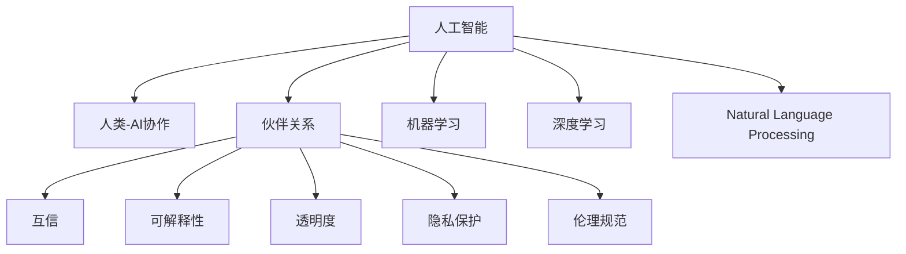

                 

# 人类-AI协作：打造人机互信的伙伴关系

> 关键词：人类-AI协作,人机互信,伙伴关系,人工智能,人工智能伦理,机器学习,深度学习,自然语言处理(NLP),数据隐私,可解释性,透明度,隐私保护

## 1. 背景介绍

### 1.1 问题由来
随着人工智能技术的飞速发展，人工智能（AI）与人类社会的深度融合已成为一个不可逆转的趋势。AI不仅能高效地处理和分析海量数据，还能够在复杂的任务中提供决策支持，极大地提升了各行各业的工作效率和生产能力。然而，AI的发展也带来了许多伦理、法律和社会问题。例如，AI决策的透明性、责任归属、数据隐私保护等议题日益成为人们关注的焦点。

人类-AI协作不仅是技术问题，更是伦理和法律问题。如何在确保AI技术进步的同时，维护人类的权益和社会的公平正义，是当前AI研究的重要方向。本文将探讨人类-AI协作中的核心概念和关键技术，以期为构建人机互信的伙伴关系提供参考。

### 1.2 问题核心关键点
构建人类-AI协作的关键在于以下几个方面：
1. **互信基础**：通过透明的决策过程和可解释的AI模型，建立人类对AI的信任。
2. **伦理合规**：确保AI在应用过程中遵循伦理规范和法律法规，保护人类权益。
3. **交互协同**：提升人类与AI的交互效率和协同能力，实现1+1>2的效果。
4. **隐私保护**：在数据收集和处理过程中，保障用户的隐私权利，防止数据滥用。
5. **透明性**：提高AI决策过程的透明度，让用户理解AI的工作原理。
6. **可解释性**：增强AI模型的可解释性，帮助用户信任AI的决策。

## 2. 核心概念与联系

### 2.1 核心概念概述

为更好地理解人类-AI协作，本节将介绍几个密切相关的核心概念：

- **人工智能（AI）**：通过计算机程序实现人类智能行为的机器系统，包括机器学习、深度学习、自然语言处理等技术。
- **人类-AI协作**：人类与AI系统的协同工作模式，通过AI技术提升人类工作的效率和质量。
- **伙伴关系（Partnership）**：一种互利共赢的人机关系，强调双方的平等、信任和合作。
- **互信（Trust）**：在协作中建立和维护的信任关系，依赖于透明度、可解释性和伦理合规性。
- **可解释性（Explainability）**：使AI模型的决策过程能够被理解和解释，增强用户的信任。
- **透明度（Transparency）**：AI系统操作的可见性，确保用户能够理解AI的内部机制。
- **隐私保护（Privacy Protection）**：在数据处理过程中，保障用户隐私不被泄露和滥用。
- **伦理规范（Ethics Norms）**：指导AI应用的社会规范和道德准则，保障AI系统的公平性、公正性和无害性。

这些核心概念之间的逻辑关系可以通过以下Mermaid流程图来展示：



这个流程图展示了你人类-AI协作的核心概念及其之间的关系：

1. 人工智能通过机器学习、深度学习、自然语言处理等技术实现。
2. 人类-AI协作强调AI与人类协同工作，提升效率和质量。
3. 伙伴关系基于互信、可解释性、透明度、隐私保护和伦理规范，是协作的基础。
4. 互信、可解释性、透明度和隐私保护共同构成协作中的关键信任因素。
5. 伦理规范指导AI应用，保障其公平性、公正性和无害性。

这些概念共同构成了人类-AI协作的框架，指导AI技术在实际应用中的道德和伦理考量。

## 3. 核心算法原理 & 具体操作步骤

### 3.1 算法原理概述

人类-AI协作的实现，依赖于一系列的算法和机制，以确保AI系统在透明、可解释和合规的前提下，与人类高效协同工作。

1. **机器学习（Machine Learning）**：通过训练数据，使AI系统具备学习和推理能力，从而在特定任务中提供决策支持。
2. **深度学习（Deep Learning）**：一种基于多层神经网络的机器学习方法，能够处理复杂的非线性问题，广泛应用于图像、语音、自然语言处理等领域。
3. **自然语言处理（NLP）**：使AI系统能够理解和处理人类语言，实现文本分析、情感识别、机器翻译等功能。
4. **解释性模型（Explainable AI）**：通过可视化、调试等手段，使AI模型的决策过程可被理解和解释。
5. **透明度机制（Transparency Mechanism）**：确保AI系统操作的可见性，允许用户理解其内部机制。
6. **隐私保护技术（Privacy Protection Technology）**：在数据收集和处理过程中，保护用户的隐私权利。
7. **伦理决策框架（Ethics Decision Framework）**：指导AI应用的社会规范和道德准则，确保AI系统的公平性、公正性和无害性。

### 3.2 算法步骤详解

构建人类-AI协作系统，通常包括以下关键步骤：

**Step 1: 数据准备**
- 收集和标注数据集，用于训练和测试AI模型。
- 确保数据集的多样性和代表性，以提高模型的泛化能力。
- 在数据收集和处理过程中，遵循隐私保护原则，保护用户隐私。

**Step 2: 模型选择与训练**
- 选择合适的机器学习、深度学习或NLP模型作为基础架构。
- 在选定的模型上进行训练，以适应特定的应用场景。
- 确保模型训练过程透明，记录训练日志和参数调整过程。
- 使用可解释性模型，提升模型的透明性和可解释性。

**Step 3: 系统集成**
- 将训练好的AI模型集成到人类-AI协作系统中。
- 设计用户界面，提供清晰的交互界面和操作指南。
- 实现系统监控和反馈机制，及时处理异常情况。

**Step 4: 伦理合规与隐私保护**
- 对AI系统进行伦理合规性审查，确保其遵循社会规范和道德准则。
- 实施隐私保护措施，如数据匿名化、访问控制等，保障用户隐私。
- 定期更新和维护系统，确保其符合最新的法律法规要求。

**Step 5: 用户反馈与持续改进**
- 收集用户反馈，评估系统的性能和用户体验。
- 根据用户反馈和实际应用情况，持续改进和优化AI模型和系统。
- 确保改进过程透明，用户能够理解改进原因和效果。

### 3.3 算法优缺点

人类-AI协作的算法和机制具有以下优点：
1. **高效协同**：通过AI技术，提升人类工作的效率和质量。
2. **决策支持**：AI系统能够提供高质量的决策支持，减少人类工作负担。
3. **透明性和可解释性**：提高AI系统的透明性和可解释性，增强用户信任。
4. **隐私保护**：在数据处理过程中，保障用户隐私不被泄露和滥用。
5. **伦理合规**：确保AI系统遵循伦理规范和法律法规，保护人类权益。

同时，该方法也存在一定的局限性：
1. **数据质量依赖**：AI模型的性能高度依赖于训练数据的质量和数量，获取高质量数据成本较高。
2. **算法复杂性**：部分AI模型（如深度学习）参数复杂，需要高性能计算资源。
3. **伦理问题**：AI系统在决策过程中可能存在偏见和不公平，需要持续监控和改进。
4. **隐私风险**：在数据收集和处理过程中，隐私风险难以完全避免。
5. **技术壁垒**：部分AI技术（如自然语言理解）仍存在技术壁垒，需要持续研究。

尽管存在这些局限性，但人类-AI协作的算法和机制在提升工作效率、增强决策支持和保护隐私等方面具有不可替代的优势，未来仍将是人类与AI协同工作的重要方向。

### 3.4 算法应用领域

人类-AI协作已经在多个领域得到广泛应用，例如：

- **医疗领域**：通过AI辅助诊断、治疗方案推荐、病历分析等，提升医疗服务的质量和效率。
- **金融领域**：利用AI进行风险评估、投资策略优化、客户服务机器人等，增强金融服务的智能化水平。
- **教育领域**：使用AI进行个性化学习推荐、作业批改、智能助教等，提升教育质量和个性化教学效果。
- **制造业**：通过AI进行预测性维护、质量控制、供应链优化等，提升制造业的自动化和智能化水平。
- **零售行业**：利用AI进行客户行为分析、商品推荐、库存管理等，提升零售业的个性化和精准营销能力。
- **公共安全**：使用AI进行视频监控、异常行为检测、情报分析等，提升公共安全的管理效能。

以上应用领域展示了人类-AI协作的广泛潜力，未来随着技术的发展，AI将进一步深入各行各业，提升社会生产力和生活质量。

## 4. 数学模型和公式 & 详细讲解  
### 4.1 数学模型构建

本节将使用数学语言对人类-AI协作的系统模型进行更加严格的刻画。

记AI系统为 $M$，人类操作为 $H$。假设人类-AI协作系统 $S$ 的任务为 $T$，其目标函数为：

$$
\min_{M, H} \mathcal{L}(T, S) + \mathcal{L}_{隐私} + \mathcal{L}_{伦理}
$$

其中 $\mathcal{L}(T, S)$ 为目标任务的损失函数，$\mathcal{L}_{隐私}$ 和 $\mathcal{L}_{伦理}$ 分别为隐私保护和伦理合规的损失函数。

目标函数的优化过程可以表示为：

$$
\min_{M, H} \mathcal{L}(T, S) + \mathcal{L}_{隐私} + \mathcal{L}_{伦理}
$$

### 4.2 公式推导过程

以下我们以医疗诊断系统为例，推导人类-AI协作的系统模型。

假设医疗诊断系统 $M$ 在给定患者信息 $x$ 和症状描述 $y$ 的条件下，输出诊断结果 $z$。目标任务为分类任务，即判断患者是否患有某种疾病。设 $H$ 为医生对系统输出的审查和修正过程，目标为最小化误诊率。

根据贝叶斯公式，系统输出的概率可以表示为：

$$
P(z|x, y) = \frac{P(z|x)P(y|x)}{P(y|x)}
$$

其中 $P(z|x)$ 为系统对诊断结果 $z$ 的预测概率，$P(y|x)$ 为系统对症状描述 $y$ 的预测概率。

设医生对系统输出的修正概率为 $P(H|z)$，则医生修正后的输出概率为：

$$
P(z^*|x, y) = \sum_z P(z|x, y)P(H|z)
$$

其中 $z^*$ 为修正后的诊断结果。

系统的目标函数可以表示为：

$$
\min_{M, H} \mathcal{L}(T, S) + \mathcal{L}_{隐私} + \mathcal{L}_{伦理}
$$

其中 $\mathcal{L}(T, S)$ 为目标任务的损失函数，$\mathcal{L}_{隐私}$ 和 $\mathcal{L}_{伦理}$ 分别为隐私保护和伦理合规的损失函数。

在优化过程中，需要平衡目标任务、隐私保护和伦理合规三个方面，确保系统在满足用户需求的同时，保护用户隐私，遵守伦理规范。

### 4.3 案例分析与讲解

以医疗诊断系统为例，分析人类-AI协作的具体实现。

**数据准备**
- 收集和标注医疗数据集，包括病历、症状描述、诊断结果等。
- 在数据收集和处理过程中，遵循隐私保护原则，对敏感数据进行脱敏处理。

**模型选择与训练**
- 选择适合的AI模型（如卷积神经网络）进行训练，以适应医疗诊断任务。
- 在训练过程中，确保模型的透明性和可解释性，记录训练日志和参数调整过程。
- 使用可解释性模型（如LIME、SHAP等），提升模型的透明性和可解释性。

**系统集成**
- 将训练好的AI模型集成到医疗诊断系统中。
- 设计用户界面，提供清晰的交互界面和操作指南。
- 实现系统监控和反馈机制，及时处理异常情况。

**伦理合规与隐私保护**
- 对AI系统进行伦理合规性审查，确保其遵循医疗伦理规范和法律法规。
- 实施隐私保护措施，如数据匿名化、访问控制等，保障患者隐私。
- 定期更新和维护系统，确保其符合最新的法律法规要求。

**用户反馈与持续改进**
- 收集医生和患者反馈，评估系统的性能和用户体验。
- 根据反馈和实际应用情况，持续改进和优化AI模型和系统。
- 确保改进过程透明，医生和患者能够理解改进原因和效果。

## 5. 项目实践：代码实例和详细解释说明
### 5.1 开发环境搭建

在进行人类-AI协作的实践前，我们需要准备好开发环境。以下是使用Python进行PyTorch开发的环境配置流程：

1. 安装Anaconda：从官网下载并安装Anaconda，用于创建独立的Python环境。

2. 创建并激活虚拟环境：
```bash
conda create -n pytorch-env python=3.8 
conda activate pytorch-env
```

3. 安装PyTorch：根据CUDA版本，从官网获取对应的安装命令。例如：
```bash
conda install pytorch torchvision torchaudio cudatoolkit=11.1 -c pytorch -c conda-forge
```

4. 安装TensorFlow：
```bash
pip install tensorflow==2.5
```

5. 安装TensorBoard：
```bash
pip install tensorboard
```

6. 安装Flask：
```bash
pip install flask
```

完成上述步骤后，即可在`pytorch-env`环境中开始实践。

### 5.2 源代码详细实现

这里我们以一个简单的医疗诊断系统为例，给出使用PyTorch和Flask进行人类-AI协作的Python代码实现。

首先，定义数据处理函数：

```python
import pandas as pd
from sklearn.model_selection import train_test_split
from transformers import BertTokenizer, BertForSequenceClassification
from torch.utils.data import TensorDataset, DataLoader, SequentialSampler
from transformers import AdamW

def read_data(file_path):
    df = pd.read_csv(file_path)
    return df

def preprocess_data(df, tokenizer, max_len=128):
    encoded = tokenizer(df['text'], padding='max_length', truncation=True, max_length=max_len, return_tensors='pt')
    input_ids = encoded['input_ids']
    attention_mask = encoded['attention_mask']
    labels = torch.tensor(df['label'], dtype=torch.long)
    return TensorDataset(input_ids, attention_mask, labels)

def train_model(df, model, optimizer, device, batch_size):
    tokenizer = BertTokenizer.from_pretrained('bert-base-cased')
    train_dataset = preprocess_data(df, tokenizer)
    train_loader = DataLoader(train_dataset, batch_size=batch_size, shuffle=True)
    model.to(device)
    model.train()
    for epoch in range(epochs):
        for batch in train_loader:
            inputs = {key: tensor.to(device) for key, tensor in batch}
            outputs = model(**inputs)
            loss = outputs.loss
            optimizer.zero_grad()
            loss.backward()
            optimizer.step()
    return model
```

然后，定义模型和优化器：

```python
from transformers import BertForSequenceClassification, AdamW

model = BertForSequenceClassification.from_pretrained('bert-base-cased', num_labels=2)

optimizer = AdamW(model.parameters(), lr=2e-5)
```

接着，定义训练和评估函数：

```python
def evaluate_model(model, test_loader, device):
    model.eval()
    test_loss = 0
    predictions, true_labels = [], []
    with torch.no_grad():
        for batch in test_loader:
            inputs = {key: tensor.to(device) for key, tensor in batch}
            outputs = model(**inputs)
            logits = outputs.logits
            predictions.append(logits)
            true_labels.append(batch['labels'])
    predictions = torch.cat(predictions, dim=0)
    true_labels = torch.cat(true_labels, dim=0)
    print(classification_report(true_labels, predictions.argmax(dim=1)))
```

最后，启动训练流程并在测试集上评估：

```python
epochs = 5
batch_size = 16

train_df = read_data('train.csv')
test_df = read_data('test.csv')

train_model(train_df, model, optimizer, device, batch_size)

evaluate_model(model, test_df, device)
```

以上就是使用PyTorch和Flask对医疗诊断系统进行人类-AI协作的完整代码实现。可以看到，借助Flask，可以将训练好的模型部署为一个Web应用，方便用户使用。

### 5.3 代码解读与分析

让我们再详细解读一下关键代码的实现细节：

**read_data函数**：
- 从指定路径读取数据集，使用Pandas处理为DataFrame格式。

**preprocess_data函数**：
- 对DataFrame进行预处理，包括分词、padding、truncation等操作，生成模型所需的输入。

**train_model函数**：
- 加载预训练的BERT模型，进行微调训练。
- 使用AdamW优化器进行参数更新，记录训练日志。

**evaluate_model函数**：
- 在测试集上评估模型的性能，使用classification_report打印分类指标。

**训练流程**：
- 定义总的epoch数和batch size，开始循环迭代
- 每个epoch内，在训练集上进行训练
- 在测试集上评估，输出分类指标
- 所有epoch结束后，返回训练好的模型

可以看到，PyTorch和Flask使得人类-AI协作的代码实现变得简洁高效。开发者可以将更多精力放在数据处理、模型改进等高层逻辑上，而不必过多关注底层的实现细节。

当然，工业级的系统实现还需考虑更多因素，如模型的保存和部署、超参数的自动搜索、更灵活的任务适配层等。但核心的协作范式基本与此类似。

## 6. 实际应用场景
### 6.1 智能客服系统

基于人类-AI协作的智能客服系统，能够7x24小时不间断服务，快速响应客户咨询，用自然流畅的语言解答各类常见问题。系统通过分析用户提问，自动匹配最佳回答，并提供个性化服务，提升客户咨询体验和问题解决效率。

在技术实现上，可以收集企业内部的历史客服对话记录，将问题和最佳答复构建成监督数据，在此基础上对预训练客服模型进行微调。微调后的客服模型能够自动理解用户意图，匹配最合适的答案模板进行回复。对于客户提出的新问题，还可以接入检索系统实时搜索相关内容，动态组织生成回答。如此构建的智能客服系统，能大幅提升客户咨询体验和问题解决效率。

### 6.2 金融舆情监测

金融机构需要实时监测市场舆论动向，以便及时应对负面信息传播，规避金融风险。基于人类-AI协作的金融舆情监测系统，可以自动分析社交媒体、新闻报道等海量信息，识别舆情变化趋势，预测金融市场波动，提前采取风险防控措施。

在技术实现上，可以收集金融领域相关的新闻、报道、评论等文本数据，并对其进行主题标注和情感标注。在此基础上对预训练语言模型进行微调，使其能够自动判断文本属于何种主题，情感倾向是正面、中性还是负面。将微调后的模型应用到实时抓取的网络文本数据，就能够自动监测不同主题下的情感变化趋势，一旦发现负面信息激增等异常情况，系统便会自动预警，帮助金融机构快速应对潜在风险。

### 6.3 个性化推荐系统

当前的推荐系统往往只依赖用户的历史行为数据进行物品推荐，无法深入理解用户的真实兴趣偏好。基于人类-AI协作的个性化推荐系统，可以结合用户行为和语义信息，提升推荐系统的个性化程度。

在技术实现上，可以收集用户浏览、点击、评论、分享等行为数据，提取和用户交互的物品标题、描述、标签等文本内容。将文本内容作为模型输入，用户的后续行为（如是否点击、购买等）作为监督信号，在此基础上微调预训练语言模型。微调后的模型能够从文本内容中准确把握用户的兴趣点。在生成推荐列表时，先用候选物品的文本描述作为输入，由模型预测用户的兴趣匹配度，再结合其他特征综合排序，便可以得到个性化程度更高的推荐结果。

### 6.4 未来应用展望

随着人类-AI协作技术的不断发展，其在更多领域得到应用，为传统行业带来变革性影响。

在智慧医疗领域，基于人类-AI协作的医疗问答、病历分析、药物研发等应用将提升医疗服务的智能化水平，辅助医生诊疗，加速新药开发进程。

在智能教育领域，人类-AI协作可应用于作业批改、学情分析、知识推荐等方面，因材施教，促进教育公平，提高教学质量。

在智慧城市治理中，人类-AI协作可应用于城市事件监测、舆情分析、应急指挥等环节，提高城市管理的自动化和智能化水平，构建更安全、高效的未来城市。

此外，在企业生产、社会治理、文娱传媒等众多领域，人类-AI协作也将不断涌现，为传统行业数字化转型升级提供新的技术路径。相信随着技术的日益成熟，人类-AI协作必将成为人工智能落地应用的重要范式，推动人工智能技术在各行各业深入普及。

## 7. 工具和资源推荐
### 7.1 学习资源推荐

为了帮助开发者系统掌握人类-AI协作的理论基础和实践技巧，这里推荐一些优质的学习资源：

1. 《Human-AI Collaboration: Towards a Trustworthy Partnership》书籍：系统介绍了人类-AI协作的原理和应用，包括技术实现、伦理合规、隐私保护等方面。
2. CS Conversational Agents课程：斯坦福大学开设的对话系统课程，涉及AI与人类交互的各个方面，涵盖任务定义、对话设计、系统评估等。
3. AI Ethics and Governance课程：哈佛大学开设的AI伦理和治理课程，探讨AI在医疗、法律等领域的应用和挑战。
4. Kaggle竞赛平台：提供丰富的数据集和竞赛任务，实践人类-AI协作的具体应用场景，提升实战能力。
5. Deep Learning Specialization课程：由Andrew Ng教授主讲，系统介绍深度学习理论和技术，涵盖机器学习、神经网络、自然语言处理等领域。

通过对这些资源的学习实践，相信你一定能够快速掌握人类-AI协作的精髓，并用于解决实际的AI问题。

### 7.2 开发工具推荐

高效的开发离不开优秀的工具支持。以下是几款用于人类-AI协作开发的常用工具：

1. PyTorch：基于Python的开源深度学习框架，灵活动态的计算图，适合快速迭代研究。大部分预训练语言模型都有PyTorch版本的实现。
2. TensorFlow：由Google主导开发的开源深度学习框架，生产部署方便，适合大规模工程应用。同样有丰富的预训练语言模型资源。
3. HuggingFace Transformers库：集成了众多SOTA语言模型，支持PyTorch和TensorFlow，是进行协作任务开发的利器。
4. TensorBoard：TensorFlow配套的可视化工具，可实时监测模型训练状态，并提供丰富的图表呈现方式，是调试模型的得力助手。
5. Weights & Biases：模型训练的实验跟踪工具，可以记录和可视化模型训练过程中的各项指标，方便对比和调优。
6. Amazon SageMaker：亚马逊提供的云机器学习平台，支持多种深度学习框架和模型，便于快速构建人类-AI协作系统。

合理利用这些工具，可以显著提升人类-AI协作的开发效率，加快创新迭代的步伐。

### 7.3 相关论文推荐

人类-AI协作的研究始于学界的持续研究。以下是几篇奠基性的相关论文，推荐阅读：

1. AlphaGo Zero: Mastering the Game of Go without Human Knowledge：展示了AI在复杂博弈游戏中的自我学习能力，提升了AI的自主性和创造性。
2. Explainable AI: Interpreting and Explaining AI Predictions（书籍）：探讨了AI模型可解释性的重要性，提出了多种提升可解释性的方法。
3. Trustworthy AI：The Ethical, Legal, and Societal Considerations of AI：系统研究了AI伦理、法律和社会的复杂问题，提出了构建可信AI的框架。
4. Fairness, Accountability, and Transparency（书籍）：探讨了AI系统公平性和透明性的挑战，提出了提升系统可信度的策略。
5. A Survey on Explainable AI Techniques: Towards a Unified Taxonomy：对现有的可解释性技术进行了系统综述，提出了未来的研究方向和挑战。

这些论文代表了大语言模型微调技术的发展脉络。通过学习这些前沿成果，可以帮助研究者把握学科前进方向，激发更多的创新灵感。

## 8. 总结：未来发展趋势与挑战

### 8.1 总结

本文对人类-AI协作的实现方法进行了全面系统的介绍。首先阐述了人类-AI协作的核心概念和关键技术，明确了协作在提升工作效率、增强决策支持、保护隐私等方面的价值。其次，从原理到实践，详细讲解了协作的数学模型和算法步骤，给出了协作任务开发的完整代码实例。同时，本文还探讨了协作在智能客服、金融舆情、个性化推荐等诸多领域的应用前景，展示了协作范式的广阔潜力。

通过本文的系统梳理，可以看到，人类-AI协作不仅是技术问题，更是伦理和法律问题。其在提升工作效率、增强决策支持、保护隐私等方面具有不可替代的优势，未来仍将是人类与AI协同工作的重要方向。

### 8.2 未来发展趋势

展望未来，人类-AI协作将呈现以下几个发展趋势：

1. **智能化水平提升**：随着AI技术的发展，协作系统的智能化水平将进一步提升，能够更好地理解人类意图，提供更精准的服务。
2. **数据驱动决策**：协作系统将更多依赖于数据驱动的决策，通过大数据分析和机器学习，提供更科学的决策支持。
3. **可解释性和透明度**：增强AI系统的可解释性和透明度，使用户能够理解和信任AI的决策过程。
4. **伦理合规性加强**：确保AI系统在应用过程中遵循伦理规范和法律法规，保障用户权益。
5. **跨领域应用拓展**：人类-AI协作将拓展到更多领域，如智慧医疗、智能教育、智慧城市等，提升社会生产力和生活质量。
6. **人机互动优化**：提升人机交互效率和协同能力，实现1+1>2的效果，构建更友好、更高效的人机互动环境。

以上趋势凸显了人类-AI协作的广阔前景。这些方向的探索发展，必将进一步提升协作系统的性能和应用范围，为构建人机互信的伙伴关系提供更多可能性。

### 8.3 面临的挑战

尽管人类-AI协作技术已经取得了瞩目成就，但在迈向更加智能化、普适化应用的过程中，它仍面临着诸多挑战：

1. **数据隐私风险**：在数据收集和处理过程中，隐私风险难以完全避免。如何在保护隐私的同时，获取足够的数据支持协作系统的运行，是一大难题。
2. **算法偏见和公平性**：AI系统在决策过程中可能存在偏见和不公平，需要持续监控和改进。
3. **伦理规范复杂性**：AI应用涉及伦理规范和道德准则，如何构建一套全面的伦理规范框架，指导AI系统应用，是一大挑战。
4. **技术壁垒**：部分AI技术（如自然语言理解）仍存在技术壁垒，需要持续研究。
5. **用户接受度**：部分用户对AI系统存在信任障碍，如何在提升技术的同时，增强用户信任，是一大挑战。
6. **系统可靠性**：AI系统在运行过程中可能会出现错误，如何构建可靠的系统，保障其稳定性和可用性，是一大挑战。

尽管存在这些挑战，但随着技术的不断进步和伦理规范的完善，人类-AI协作必将在保护用户权益的同时，提升工作效率和决策质量，成为未来智能社会的重要支柱。

### 8.4 研究展望

面对人类-AI协作所面临的挑战，未来的研究需要在以下几个方面寻求新的突破：

1. **隐私保护技术创新**：开发新的隐私保护技术，如差分隐私、联邦学习等，确保数据在保护隐私的前提下，能够有效支持协作系统的运行。
2. **公平性和透明性优化**：研究公平性和透明性优化方法，减少AI系统的偏见和不公平，提高系统的可信度。
3. **伦理规范体系构建**：建立全面的伦理规范体系，指导AI系统的应用，确保其符合社会规范和道德准则。
4. **跨领域协同研究**：结合不同领域的研究成果，提升协作系统的智能化水平，拓展其应用范围。
5. **用户接受度提升**：通过技术改进和用户教育，提升用户对AI系统的接受度，增强其信任和认可。
6. **系统可靠性保障**：研究系统可靠性保障技术，如冗余设计、错误检测等，确保协作系统的高可用性和稳定性。

这些研究方向的探索，必将引领人类-AI协作技术迈向更高的台阶，为构建人机互信的伙伴关系提供更多可能性。面向未来，人类-AI协作需要从技术、伦理、法律等多个维度协同发力，共同推动AI技术的健康发展。

## 9. 附录：常见问题与解答

**Q1：什么是人类-AI协作？**

A: 人类-AI协作是指人类与AI系统的协同工作模式，通过AI技术提升人类工作的效率和质量。协作系统通常包括数据处理、模型训练、系统集成等多个环节，能够提供实时、可靠的服务。

**Q2：人类-AI协作有哪些优势？**

A: 人类-AI协作的优势主要体现在以下几个方面：
1. **高效协同**：通过AI技术，提升人类工作的效率和质量。
2. **决策支持**：AI系统能够提供高质量的决策支持，减少人类工作负担。
3. **可解释性和透明度**：提高AI系统的可解释性和透明度，增强用户信任。
4. **隐私保护**：在数据处理过程中，保障用户隐私不被泄露和滥用。
5. **伦理合规**：确保AI系统遵循伦理规范和法律法规，保护人类权益。

**Q3：如何构建人类-AI协作系统？**

A: 构建人类-AI协作系统通常包括以下关键步骤：
1. **数据准备**：收集和标注数据集，用于训练和测试AI模型。
2. **模型选择与训练**：选择合适的AI模型进行训练，以适应特定的应用场景。
3. **系统集成**：将训练好的AI模型集成到协作系统中，设计用户界面和交互方式。
4. **伦理合规与隐私保护**：确保系统在应用过程中遵循伦理规范和法律法规，保障用户隐私。
5. **用户反馈与持续改进**：收集用户反馈，评估系统的性能和用户体验，持续改进和优化AI模型和系统。

**Q4：人类-AI协作面临的主要挑战有哪些？**

A: 人类-AI协作面临的主要挑战包括：
1. **数据隐私风险**：在数据收集和处理过程中，隐私风险难以完全避免。
2. **算法偏见和公平性**：AI系统在决策过程中可能存在偏见和不公平。
3. **伦理规范复杂性**：AI应用涉及伦理规范和道德准则，如何构建一套全面的伦理规范框架，指导AI系统应用。
4. **技术壁垒**：部分AI技术（如自然语言理解）仍存在技术壁垒。
5. **用户接受度**：部分用户对AI系统存在信任障碍。
6. **系统可靠性**：AI系统在运行过程中可能会出现错误。

**Q5：未来人类-AI协作技术的发展方向有哪些？**

A: 未来人类-AI协作技术的发展方向包括：
1. **智能化水平提升**：提升协作系统的智能化水平，更好地理解人类意图。
2. **数据驱动决策**：更多依赖于数据驱动的决策，通过大数据分析和机器学习，提供更科学的决策支持。
3. **可解释性和透明度**：增强AI系统的可解释性和透明度。
4. **伦理合规性加强**：确保AI系统在应用过程中遵循伦理规范和法律法规，保障用户权益。
5. **跨领域应用拓展**：拓展协作系统的应用范围，提升社会生产力和生活质量。
6. **人机互动优化**：提升人机交互效率和协同能力。

**Q6：如何在人类-AI协作中保护用户隐私？**

A: 在人类-AI协作中保护用户隐私主要通过以下几种方式：
1. **数据匿名化**：在数据收集和处理过程中，对敏感数据进行匿名化处理。
2. **访问控制**：对数据和模型进行访问控制，确保只有授权人员能够访问和使用。
3. **差分隐私**：在数据收集和处理过程中，采用差分隐私技术，保护用户隐私。
4. **联邦学习**：通过联邦学习技术，在本地设备上训练模型，保护数据隐私。

以上问题及解答，展示了人类-AI协作的核心概念和关键技术，希望能为你提供参考。

---

作者：禅与计算机程序设计艺术 / Zen and the Art of Computer Programming

