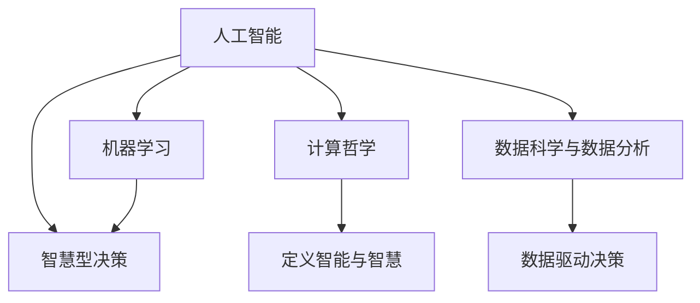

                 

# 人类智慧：AI 时代的新力量

> 关键词：人工智能, 智慧型决策, 计算哲学, 数据分析, 机器学习, 数据科学

## 1. 背景介绍

### 1.1 问题由来

随着人工智能（AI）技术的不断进步，人工智能已经从单纯的计算能力提升，逐步走向了智慧型决策的时代。从图像识别、语音处理、自然语言处理等传统任务，到医疗诊断、金融风险评估、智能客服等复杂任务，AI正在以独特的方式重塑人类生活。但与此同时，AI的迅猛发展也引发了一系列哲学、伦理、道德和社会的思考和探讨。

面对这些问题，人们开始重新审视AI的本质与作用。人类的智慧与AI的关系、如何定义AI、AI的边界与潜力等，成为了研究者与从业者亟需回答的问题。本文将从人工智能与人类智慧的角度出发，深入探讨AI如何在多领域中扮演新的角色，并致力于提供一种对未来AI发展方向的深刻见解。

### 1.2 问题核心关键点

随着AI技术的发展，人们已经认识到AI不仅仅是计算能力的增强，它更多地表现为对人类智慧的借鉴和模拟。AI技术通过大量数据分析和模型训练，能够基于已知数据预测未知，进行逻辑推理和决策。因此，AI能够辅助甚至替代人类进行复杂决策，从而提升效率、优化决策质量，甚至开拓出新的智慧型应用领域。

然而，AI的智慧型决策并非完全自主，而是通过不断学习人机交互的智慧，从而实现其智能化的过程。其核心关键点如下：

- **数据与知识**：AI的智慧来源于数据和知识，对数据的学习和处理是其基础。
- **逻辑与推理**：AI的智慧型决策能力，源于其具备的逻辑推理能力。
- **伦理与道德**：AI的智慧型决策需遵循一定的伦理道德原则。
- **人类智慧的借鉴**：AI通过对人类智慧的学习和借鉴，逐步走向智慧型决策。

## 2. 核心概念与联系

### 2.1 核心概念概述

为更好地理解AI与人类智慧的关系，本节将介绍几个核心概念：

- **人工智能（AI）**：基于计算与数据分析技术，通过算法模拟人类智慧能力的技术体系。
- **智慧型决策**：基于已知数据与知识，进行逻辑推理与预测，实现高效与准确决策的能力。
- **计算哲学**：涉及如何定义智能与智慧，计算能力与人类智慧之间的关系。
- **数据科学与数据分析**：利用数据进行科学分析与数据驱动的决策支持。
- **机器学习与深度学习**：利用算法模型，通过大量数据训练，使机器具备自主学习与智能化的能力。

这些概念之间的逻辑关系可以通过以下Mermaid流程图来展示：



这个流程图展示了核心概念之间的联系：

1. 人工智能通过数据分析与机器学习，具备了智慧型决策的能力。
2. 计算哲学为智能与智慧的界定提供了理论基础。
3. 数据科学提供了数据支持，辅助智慧型决策。
4. 机器学习实现了数据驱动的智能化。

## 3. 核心算法原理 & 具体操作步骤

### 3.1 算法原理概述

基于数据的AI智慧型决策过程主要通过以下步骤实现：

1. **数据收集**：从各种数据源收集样本数据，如互联网数据、传感器数据、社会经济数据等。
2. **数据预处理**：对数据进行清洗、转换与标准化处理，确保数据的质量。
3. **模型训练**：利用机器学习算法，对数据进行建模，并使用训练集进行模型训练。
4. **模型评估**：通过验证集评估模型性能，优化模型参数。
5. **模型应用**：使用训练好的模型对新数据进行预测，辅助决策。

形式化地，假设数据集为 $D=\{(x_i, y_i)\}_{i=1}^N$，其中 $x_i \in \mathcal{X}, y_i \in \mathcal{Y}$。模型的目标是学习一个函数 $f: \mathcal{X} \rightarrow \mathcal{Y}$，使得 $f(x_i)$ 尽可能接近 $y_i$。常见的机器学习算法包括线性回归、决策树、支持向量机、深度学习等。

### 3.2 算法步骤详解

以线性回归算法为例，进行详细说明：

1. **数据收集**：
    - 收集包含 $N$ 个样本的训练数据集，每个样本由输入 $x_i$ 和输出 $y_i$ 组成。
    - 对于二维数据，$x_i = (x_{i1}, x_{i2}), y_i$。

2. **数据预处理**：
    - 对数据进行清洗，剔除异常值、噪声数据。
    - 标准化数据，使得各特征量级相同。

3. **模型训练**：
    - 利用训练集 $D=\{(x_i, y_i)\}_{i=1}^N$，构造损失函数 $J(\theta) = \frac{1}{2N} \sum_{i=1}^N (y_i - \hat{y}_i)^2$。
    - 利用梯度下降算法，计算参数 $\theta$ 的梯度 $\nabla_{\theta}J(\theta)$。
    - 更新参数 $\theta$：$\theta \leftarrow \theta - \eta \nabla_{\theta}J(\theta)$。
    - 重复以上过程，直至收敛。

4. **模型评估**：
    - 利用验证集 $D_{val}$ 评估模型，计算均方误差 $MSE = \frac{1}{N} \sum_{i=1}^N (y_i - \hat{y}_i)^2$。
    - 利用交叉验证或保留法，进一步验证模型泛化能力。

5. **模型应用**：
    - 使用训练好的模型对新数据 $x'$ 进行预测：$\hat{y}' = f(x')$。
    - 辅助决策，优化人类智慧型决策过程。

### 3.3 算法优缺点

基于数据的AI智慧型决策算法具有以下优点：

- **高效性**：算法能够处理大规模数据集，通过并行计算大幅提升决策效率。
- **普适性**：算法适用于多种数据类型与任务场景，具有广泛应用性。
- **可解释性**：算法模型透明，便于解释与验证。

同时，该算法也存在一定局限：

- **依赖数据质量**：算法对数据质量要求高，数据偏差可能影响模型决策。
- **复杂性高**：复杂算法如深度学习模型，训练过程复杂，调参困难。
- **可解释性差**：深度学习等模型黑盒化严重，难以理解其内部工作机制。

### 3.4 算法应用领域

基于数据的AI智慧型决策算法在多个领域中得到了广泛应用：

- **金融风险评估**：利用历史金融数据，构建风险预测模型，辅助投资决策。
- **医疗诊断**：通过医学影像与病人数据，训练诊断模型，辅助医生决策。
- **智能推荐**：基于用户行为数据，训练推荐模型，提高产品推荐质量。
- **智能客服**：利用自然语言处理技术，构建智能客服系统，提升客户服务效率。
- **智能交通**：通过交通数据，训练交通预测模型，优化交通管理。

## 4. 数学模型和公式 & 详细讲解 & 举例说明

### 4.1 数学模型构建

在线性回归中，我们假设模型 $f(x)$ 为一个线性函数，$y_i = \theta_0 + \sum_{j=1}^p \theta_j x_{ij}$。其中 $\theta_0$ 为截距，$\theta_j$ 为系数，$x_{ij}$ 为特征。

形式化地，设训练集为 $D=\{(x_i, y_i)\}_{i=1}^N$，目标为寻找最优参数 $\theta$，使得损失函数 $J(\theta)$ 最小化。损失函数为：

$$
J(\theta) = \frac{1}{2N} \sum_{i=1}^N (y_i - f(x_i))^2 = \frac{1}{2N} \sum_{i=1}^N (y_i - (\theta_0 + \sum_{j=1}^p \theta_j x_{ij}))^2
$$

### 4.2 公式推导过程

利用梯度下降算法，最小化损失函数 $J(\theta)$：

1. **求偏导**：

$$
\nabla_{\theta}J(\theta) = \frac{1}{N} \sum_{i=1}^N (y_i - f(x_i)) \nabla f(x_i)
$$

其中 $\nabla f(x_i) = (1, x_{i1}, ..., x_{ip})$。

2. **梯度更新**：

$$
\theta \leftarrow \theta - \eta \nabla_{\theta}J(\theta)
$$

其中 $\eta$ 为学习率。

### 4.3 案例分析与讲解

**案例分析：基于线性回归的房价预测**

某地区房地产市场数据集包含 $N=1000$ 个样本，特征包括房屋面积、楼层、地理位置等，目标变量为房屋价格 $y_i$。

- **数据收集**：从房地产交易平台获取样本数据。
- **数据预处理**：剔除异常数据，标准化数据。
- **模型训练**：利用训练集，最小化损失函数 $J(\theta)$，得到最优参数 $\theta$。
- **模型评估**：利用验证集，计算均方误差，评估模型。
- **模型应用**：使用训练好的模型，对新样本进行预测，辅助房价评估。

## 5. 项目实践：代码实例和详细解释说明

### 5.1 开发环境搭建

在进行AI项目实践前，需要准备以下开发环境：

1. **安装Python与相关库**：
    ```bash
    # 安装Python 3.7及以上版本
    sudo apt-get update && sudo apt-get install python3.7 python3-pip

    # 安装相关库
    pip install numpy pandas scikit-learn matplotlib scikit-image
    ```

2. **安装机器学习库**：
    ```bash
    pip install scikit-learn pandas
    ```

3. **安装可视化工具**：
    ```bash
    pip install matplotlib seaborn
    ```

### 5.2 源代码详细实现

以下是一个基于线性回归的房价预测项目示例，代码使用Python与Scikit-learn库实现：

```python
# 导入相关库
import numpy as np
import pandas as pd
from sklearn.linear_model import LinearRegression
from sklearn.model_selection import train_test_split
from sklearn.metrics import mean_squared_error
import matplotlib.pyplot as plt

# 读取数据
data = pd.read_csv('house_prices.csv')

# 特征处理
X = data[['area', 'floor', 'location']]
y = data['price']

# 划分数据集
X_train, X_test, y_train, y_test = train_test_split(X, y, test_size=0.2, random_state=42)

# 训练模型
reg = LinearRegression()
reg.fit(X_train, y_train)

# 预测房价
y_pred = reg.predict(X_test)

# 评估模型
mse = mean_squared_error(y_test, y_pred)
print(f"Mean Squared Error: {mse}")

# 可视化结果
plt.scatter(y_test, y_pred)
plt.xlabel('Actual Prices')
plt.ylabel('Predicted Prices')
plt.show()
```

### 5.3 代码解读与分析

- **数据读取**：使用Pandas库读取数据文件，创建DataFrame对象。
- **特征处理**：从DataFrame中提取特征变量与目标变量，进行标准化处理。
- **数据划分**：利用train_test_split方法，将数据集划分为训练集和测试集。
- **模型训练**：使用LinearRegression模型进行训练，最小化损失函数。
- **模型预测**：利用训练好的模型对测试集进行预测，并计算均方误差。
- **结果可视化**：使用Matplotlib库绘制预测结果的散点图，展示预测与实际房价的拟合情况。

## 6. 实际应用场景

### 6.1 金融风险评估

金融行业是AI智慧型决策的重要应用领域。利用历史金融数据，训练风险预测模型，辅助银行、保险公司等机构进行风险评估和决策：

- **数据收集**：收集金融市场数据、信贷记录、保险理赔记录等。
- **数据预处理**：数据清洗、特征选择、缺失值处理。
- **模型训练**：利用金融数据训练逻辑回归、随机森林、支持向量机等模型，进行信用评分、违约预测等。
- **模型评估**：利用验证集评估模型性能，优化模型参数。
- **模型应用**：将模型集成到风控系统中，实时监控客户风险，进行智能决策。

### 6.2 医疗诊断

医疗行业利用AI智慧型决策，提升诊断效率与精准度：

- **数据收集**：收集医学影像、病历数据、基因数据等。
- **数据预处理**：数据清洗、标准化处理。
- **模型训练**：利用医学数据训练深度学习模型，如卷积神经网络（CNN），进行肿瘤检测、病灶识别等。
- **模型评估**：利用验证集评估模型性能，优化模型参数。
- **模型应用**：将模型集成到诊断系统中，辅助医生进行病理分析、手术规划等。

### 6.3 智能推荐

电商、视频、音乐等行业，利用AI智慧型决策，进行个性化推荐：

- **数据收集**：收集用户行为数据、商品信息、用户画像等。
- **数据预处理**：数据清洗、特征提取。
- **模型训练**：利用协同过滤、矩阵分解等算法训练推荐模型。
- **模型评估**：利用验证集评估模型性能，优化模型参数。
- **模型应用**：将模型集成到推荐系统中，实时推荐商品、视频、歌曲等。

## 7. 工具和资源推荐

### 7.1 学习资源推荐

为了帮助开发者深入学习AI智慧型决策，这里推荐以下学习资源：

1. **《机器学习》课程**：由Andrew Ng教授在Coursera上开设，涵盖机器学习基础与应用。
2. **《深度学习》课程**：由Ian Goodfellow等在Coursera上开设，深入讲解深度学习理论及应用。
3. **《Python机器学习》书籍**：由Sebastian Raschka撰写，全面介绍Python在机器学习中的应用。
4. **《TensorFlow官方文档》**：TensorFlow官方文档，提供详细API和使用指南。
5. **《Kaggle机器学习竞赛》**：Kaggle平台上有大量数据集和竞赛任务，帮助开发者提升实践能力。

### 7.2 开发工具推荐

以下是几款常用的开发工具，用于AI项目实践：

1. **Jupyter Notebook**：开源的Python交互式编程环境，便于编写、测试和分享代码。
2. **TensorFlow**：由Google开发的深度学习框架，支持分布式训练与部署。
3. **PyTorch**：Facebook开发的深度学习框架，灵活高效，支持动态图与静态图。
4. **Anaconda**：开源的数据科学平台，包含大量Python库与科学计算工具。
5. **GitHub**：全球最大的代码托管平台，便于版本控制与协作开发。

### 7.3 相关论文推荐

以下是几篇具有代表性的AI智慧型决策研究论文，推荐阅读：

1. **"Deep Learning" by Ian Goodfellow, Yoshua Bengio, and Aaron Courville**：深度学习领域的经典教材，涵盖深度学习理论及应用。
2. **"Convolutional Neural Networks for Medical Image Analysis" by Murat Cetinoglu et al.**：利用卷积神经网络进行医学影像分析的论文，展示了AI在医疗诊断中的潜力。
3. **"Machine Learning: A Probabilistic Perspective" by Kevin Murphy**：机器学习领域的经典教材，全面讲解机器学习理论与应用。
4. **"Adaptive Boosting" by Yoav Freund and Robert E. Schapire**：提出了Adaboost算法，并展示了其应用于分类任务的效果。
5. **"Neural Networks and Deep Learning" by Michael Nielsen**：介绍了神经网络与深度学习的基本原理与实现方法。

## 8. 总结：未来发展趋势与挑战

### 8.1 研究成果总结

本文探讨了AI智慧型决策的本质及其应用，并通过具体案例说明了其实现过程与效果。AI智慧型决策具有高效、普适、可解释性强的优点，能够辅助人类进行复杂决策，提升决策质量。

### 8.2 未来发展趋势

未来AI智慧型决策将呈现以下几个发展趋势：

1. **自适应学习**：未来AI将具备自适应学习能力，能够根据环境变化快速调整模型参数。
2. **多模态融合**：未来的AI将能够融合多模态数据，如文本、图像、语音等，进行全面分析与决策。
3. **深度学习与强化学习的结合**：深度学习与强化学习的结合将使得AI具备更强的决策自主性。
4. **计算哲学与伦理道德的探讨**：计算哲学将指导AI智慧型决策的边界与本质，伦理道德将确保其安全与应用范围。
5. **跨领域应用**：AI智慧型决策将在更多领域得到应用，如金融、医疗、交通等。

### 8.3 面临的挑战

尽管AI智慧型决策具有巨大潜力，但也面临以下挑战：

1. **数据隐私与安全**：AI决策依赖大量数据，数据隐私与安全问题需要严格保障。
2. **模型可解释性**：复杂模型如深度学习难以解释，需要提高模型的可解释性。
3. **计算资源限制**：大型AI模型对计算资源需求高，需要进一步优化算法与硬件。
4. **伦理与道德问题**：AI决策可能存在偏见，需要遵循伦理道德原则。
5. **数据偏差**：数据偏差可能导致模型决策不公平，需要优化数据收集与处理。

### 8.4 研究展望

未来，AI智慧型决策研究将进一步拓展，探讨更多前沿问题：

1. **计算哲学与AI伦理**：结合计算哲学与伦理道德，确保AI决策的透明性与公正性。
2. **跨领域数据融合**：研究多模态数据融合方法，提高AI的全面分析能力。
3. **自适应学习算法**：开发自适应学习算法，使AI具备环境适应能力。
4. **人机协同决策**：研究人机协同决策方法，使AI更好地辅助人类决策。
5. **深度学习与强化学习的结合**：进一步探索深度学习与强化学习在AI决策中的应用。

## 9. 附录：常见问题与解答

**Q1: 什么是AI智慧型决策？**

A: AI智慧型决策是基于大量数据分析与建模，通过逻辑推理与预测，辅助人类进行复杂决策的技术。

**Q2: AI智慧型决策的优势有哪些？**

A: AI智慧型决策具有高效、普适、可解释性强的优点，能够辅助人类进行复杂决策，提升决策质量。

**Q3: 如何避免AI决策中的数据偏差？**

A: 数据偏差可能导致模型决策不公平，需要优化数据收集与处理，确保数据代表性。

**Q4: 如何提高AI模型的可解释性？**

A: 复杂模型如深度学习难以解释，需要采用多种技术，如模型简化、可视化分析等。

**Q5: AI智慧型决策的未来发展趋势是什么？**

A: 自适应学习、多模态融合、深度学习与强化学习结合、计算哲学与伦理道德探讨、跨领域应用等。

---

作者：禅与计算机程序设计艺术 / Zen and the Art of Computer Programming

