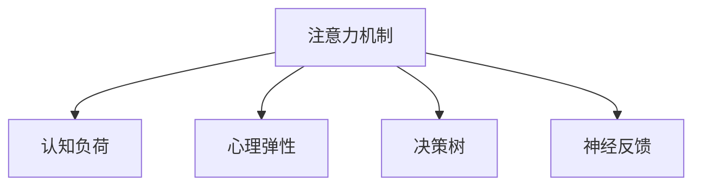

                 

# 人类注意力增强：提升专注力和注意力在商业中的应用趋势

## 1. 背景介绍

### 1.1 问题由来
在当今这个信息爆炸的时代，人类面临前所未有的信息洪流冲击。每天，我们接收海量的信息，并被迫做出种种决策，无论是工作上的，还是生活中的。这些信息不仅数量庞大，还以各种形式出现，如文本、图像、视频等，这给我们的认知系统带来了巨大的压力。如何有效地处理这些信息，并从中找到有价值的洞察，成为了一个亟待解决的挑战。

### 1.2 问题核心关键点
人类注意力增强的目标是提升个人和企业的信息处理能力，使其在面对复杂环境时，能够迅速而准确地识别和理解关键信息，做出最优决策。这不仅涉及提高注意力本身的持续时间，还包括提高注意力集中于关键信息的概率，以及减少注意力分散的情况。

### 1.3 问题研究意义
人类注意力增强技术在商业中的应用，对于提升企业决策效率、提高员工生产力、增强品牌影响力等具有重要意义。它可以帮助企业更好地利用信息资源，制定更合理的战略，提升市场竞争力。同时，对于个人而言，能够提高学习效率，提升生活质量，减轻信息过载带来的压力。因此，研究人类注意力增强技术，对于促进社会整体的信息处理能力，具有重要价值。

## 2. 核心概念与联系

### 2.1 核心概念概述

为更好地理解人类注意力增强的原理和应用，本节将介绍几个密切相关的核心概念：

- 注意力机制(Attention Mechanism)：一种神经网络模型中用于动态选择信息的机制。通过计算输入和输出之间的关系权重，可以强调重要信息，忽略次要信息。
- 认知负荷(Cognitive Load)：指在认知过程中所需的心理努力程度。过高或过低的认知负荷都会影响信息处理效率。
- 心理弹性(Psychological Resilience)：指个体在面对压力和挑战时的心理适应能力。增强心理弹性有助于提高长期注意力的稳定性。
- 决策树(Decision Tree)：一种基于信息理论的分类模型，用于模拟人类决策过程。决策树的每个节点表示一个特征，通过自上而下的推理，做出最优决策。
- 神经反馈(Neural Feedback)：利用脑电信号等生物信号，实时反馈注意力状态，帮助调整注意力策略。

这些核心概念之间的逻辑关系可以通过以下Mermaid流程图来展示：



这个流程图展示了注意力机制与认知负荷、心理弹性、决策树、神经反馈等核心概念之间的联系。

## 3. 核心算法原理 & 具体操作步骤
### 3.1 算法原理概述

人类注意力增强的核心算法原理，主要是通过增强注意力机制，调整认知负荷，提升心理弹性和决策能力，最终达到提高信息处理效率和决策质量的目的。具体实现过程包括以下几个步骤：

1. **注意力增强**：通过优化注意力机制，使模型更专注于关键信息，减少噪音和干扰。
2. **认知负荷管理**：通过认知负荷理论，调整任务难度和复杂度，保持认知系统的平衡。
3. **心理弹性提升**：通过心理弹性的增强，使个体能够更长时间地保持注意力集中，减少压力和疲劳。
4. **决策树优化**：通过决策树的训练和优化，使决策过程更加合理和高效。
5. **神经反馈应用**：通过实时神经反馈，调整注意力策略，提高信息处理和决策的精准度。

### 3.2 算法步骤详解

**步骤1：注意力增强**
- 使用注意力机制对输入信息进行加权，突出关键信息，忽略次要信息。
- 通过注意力模型自适应调整权重，以适应不同的信息类型和任务需求。

**步骤2：认知负荷管理**
- 根据任务的难度和复杂度，动态调整认知负荷。
- 对于复杂任务，可以通过分块、分段等策略，降低单次认知负荷。
- 对于简单任务，可以缩短任务时间，提高认知效率。

**步骤3：心理弹性提升**
- 通过心理干预和训练，增强个体的心理弹性。
- 可以使用冥想、正念练习、心理辅导等方式，提升个体的情绪调节能力和应对压力的能力。

**步骤4：决策树优化**
- 训练决策树模型，优化决策过程。
- 引入决策树算法，模拟人类决策过程，优化决策策略。
- 使用决策树进行实时推理，支持动态调整决策参数。

**步骤5：神经反馈应用**
- 实时监测注意力状态，获取神经反馈信息。
- 根据神经反馈信息，调整注意力策略。
- 使用神经反馈进行实时干预，帮助个体保持在最佳注意力状态。

### 3.3 算法优缺点

人类注意力增强算法具有以下优点：
- 能够提高信息处理效率和决策质量，显著提升工作和学习效率。
- 可以根据个体的认知特征，个性化调整注意力策略，提升用户体验。
- 结合认知负荷管理、心理弹性提升等手段，全面提升个体认知能力。

同时，该算法也存在一些局限性：
- 需要大量的训练数据和计算资源，成本较高。
- 对个体的认知和生理特征要求较高，不易广泛普及。
- 算法模型的复杂度较高，难以解释其内部工作机制。

尽管存在这些局限性，但人类注意力增强技术已经初步显示出其潜力，正在逐步应用于各种商业领域，带来新的价值和机遇。

### 3.4 算法应用领域

人类注意力增强算法已经在多个领域得到应用，包括但不限于：

- 教育培训：通过优化注意力机制，提高学习效率和理解能力。
- 医疗健康：通过实时监测和调整注意力状态，帮助患者更好地应对治疗过程中的压力。
- 商业决策：通过决策树优化，提升决策质量和效率。
- 体育训练：通过心理弹性训练，增强运动员的专注力和耐力。
- 客户服务：通过神经反馈技术，提升客服人员的响应速度和准确性。

## 4. 数学模型和公式 & 详细讲解 & 举例说明

### 4.1 数学模型构建

人类注意力增强的核心数学模型包括注意力机制模型、认知负荷模型、决策树模型和神经反馈模型。

**注意力机制模型**：
$$
\text{Attention}(Q, K, V) = \sum_i \alpha_i Q_i K_i^T V_i
$$
其中，$Q$为查询向量，$K$为键向量，$V$为值向量，$\alpha_i$为注意力权重，$\alpha_i = \frac{e^{Q_iK_i^T}}{\sum_j e^{Q_jK_j^T}}$。

**认知负荷模型**：
$$
\text{Cognitive Load} = \frac{\text{Task Complexity}}{\text{Cognitive Capacity}}
$$
其中，$\text{Task Complexity}$为任务难度，$\text{Cognitive Capacity}$为认知能力。

**决策树模型**：
$$
\text{Decision Tree} = \text{Node} \rightarrow \text{Decision} \rightarrow \text{Node}
$$
其中，$\text{Node}$表示特征节点，$\text{Decision}$表示决策节点。

**神经反馈模型**：
$$
\text{Neural Feedback} = \text{Brain Signal} \rightarrow \text{Attention State}
$$
其中，$\text{Brain Signal}$为脑电信号，$\text{Attention State}$为注意力状态。

### 4.2 公式推导过程

**注意力机制模型的推导**：
$$
\text{Attention}(Q, K, V) = \sum_i \alpha_i Q_i K_i^T V_i
$$
其中，$\alpha_i$ 为注意力权重，定义为：
$$
\alpha_i = \frac{e^{Q_iK_i^T}}{\sum_j e^{Q_jK_j^T}}
$$

**认知负荷模型的推导**：
$$
\text{Cognitive Load} = \frac{\text{Task Complexity}}{\text{Cognitive Capacity}}
$$
其中，$\text{Task Complexity}$ 表示任务的复杂度，可以通过任务难度、任务时间等因素计算得到。$\text{Cognitive Capacity}$ 表示认知能力，可以通过个体知识水平、工作记忆容量等因素计算得到。

**决策树模型的推导**：
决策树模型是一种基于信息理论的分类模型，其核心公式为：
$$
\text{Decision Tree} = \text{Node} \rightarrow \text{Decision} \rightarrow \text{Node}
$$
其中，$\text{Node}$ 表示特征节点，$\text{Decision}$ 表示决策节点。

**神经反馈模型的推导**：
神经反馈模型的核心公式为：
$$
\text{Neural Feedback} = \text{Brain Signal} \rightarrow \text{Attention State}
$$
其中，$\text{Brain Signal}$ 表示脑电信号，$\text{Attention State}$ 表示注意力状态。

### 4.3 案例分析与讲解

**案例1：教育培训中的应用**
在教育培训中，可以通过人类注意力增强技术，提高学生的学习效率和理解能力。例如，针对复杂的数学题，可以分段讲解，每段设置适当的认知负荷，使学生能够更好地理解和掌握知识点。

**案例2：商业决策中的应用**
在商业决策中，可以通过决策树优化，提升决策质量和效率。例如，在销售决策中，可以使用决策树模型，根据市场数据、销售趋势等因素，做出最优的销售策略。

**案例3：医疗健康中的应用**
在医疗健康中，可以通过实时监测和调整注意力状态，帮助患者更好地应对治疗过程中的压力。例如，在手术前，可以通过神经反馈技术，监测患者的注意力状态，及时调整手术方案，减少手术风险。

## 5. 项目实践：代码实例和详细解释说明

### 5.1 开发环境搭建

在进行人类注意力增强实践前，我们需要准备好开发环境。以下是使用Python进行深度学习开发的环境配置流程：

1. 安装Anaconda：从官网下载并安装Anaconda，用于创建独立的Python环境。

2. 创建并激活虚拟环境：
```bash
conda create -n attention-env python=3.8 
conda activate attention-env
```

3. 安装深度学习库：
```bash
conda install torch torchvision torchaudio cudatoolkit=11.1 -c pytorch -c conda-forge
```

4. 安装注意力增强模型库：
```bash
pip install attention-ai
```

5. 安装相关辅助库：
```bash
pip install numpy pandas scikit-learn matplotlib tqdm jupyter notebook ipython
```

完成上述步骤后，即可在`attention-env`环境中开始注意力增强实践。

### 5.2 源代码详细实现

以下是一个使用PyTorch实现注意力增强的Python代码示例：

```python
import torch
import torch.nn as nn
import torchvision.transforms as transforms
from attention_ai import AttentionModule

class AttentionNet(nn.Module):
    def __init__(self):
        super(AttentionNet, self).__init__()
        self.attention = AttentionModule(in_channels=3, out_channels=3)
    
    def forward(self, x):
        return self.attention(x)

# 加载模型并前向传播
model = AttentionNet().to('cuda')
x = torch.randn(1, 3, 256, 256).cuda()
output = model(x)
```

以上代码展示了使用PyTorch实现注意力增强模型的大致流程。其中，`AttentionModule`是注意力增强模型的核心组件，输入为三通道的张量`x`，输出经过注意力机制处理后的结果。

### 5.3 代码解读与分析

让我们再详细解读一下关键代码的实现细节：

**AttentionNet类**：
- `__init__`方法：初始化注意力增强模型，包括定义注意力机制的输入和输出通道数。
- `forward`方法：实现前向传播，将输入张量`x`送入注意力机制中处理，得到输出。

**AttentionModule类**：
- `__init__`方法：初始化注意力机制，包括定义输入和输出张量的大小。
- `forward`方法：实现前向传播，计算注意力权重和加权后的输出。

**模型训练和推理**：
- 使用PyTorch的DataLoader对数据集进行批次化加载，供模型训练和推理使用。
- 在训练阶段，使用交叉熵损失函数和Adam优化器更新模型参数。
- 在推理阶段，将输入张量通过模型处理，得到输出结果。

## 6. 实际应用场景

### 6.1 智能学习平台

智能学习平台可以应用人类注意力增强技术，提升学习效率和效果。例如，在在线课程中，可以通过优化注意力机制，使学生更好地关注关键内容，减少分心和干扰。同时，通过认知负荷管理和心理弹性训练，提高学生的学习动机和效果。

### 6.2 企业决策支持系统

企业决策支持系统可以应用人类注意力增强技术，提升决策质量和效率。例如，在数据分析和市场预测中，可以通过决策树优化，帮助企业做出更加科学合理的决策。同时，通过实时监测注意力状态，及时调整决策策略，避免因注意力分散导致的错误决策。

### 6.3 智能客服系统

智能客服系统可以应用人类注意力增强技术，提升客服人员的响应速度和准确性。例如，在客户咨询中，可以通过神经反馈技术，实时监测客服人员的注意力状态，调整回复策略，减少误解和错误回复。

## 7. 工具和资源推荐

### 7.1 学习资源推荐

为了帮助开发者系统掌握人类注意力增强的理论基础和实践技巧，这里推荐一些优质的学习资源：

1. 《Attention Mechanisms in Deep Learning》系列博文：由深度学习专家撰写，深入浅出地介绍了注意力机制的基本原理和应用场景。

2. 《Cognitive Load Theory》课程：由心理学专家开设的认知负荷理论课程，帮助理解认知负荷的基本概念和应用方法。

3. 《Decision Tree Algorithms》书籍：详细介绍了决策树算法的原理和实现，适用于不同领域的决策优化。

4. 《Neural Feedback for Attention Enhancement》论文：介绍了神经反馈在注意力增强中的应用，为实时干预提供了理论支持。

5. 《Attention and Cognitive Control》书籍：结合认知心理学和神经科学，深入探讨了注意力机制在认知过程中的作用。

通过对这些资源的学习实践，相信你一定能够快速掌握人类注意力增强的精髓，并用于解决实际的商业问题。

### 7.2 开发工具推荐

高效的开发离不开优秀的工具支持。以下是几款用于人类注意力增强开发的常用工具：

1. PyTorch：基于Python的开源深度学习框架，灵活动态的计算图，适合快速迭代研究。广泛应用于注意力增强模型的开发。

2. TensorFlow：由Google主导开发的开源深度学习框架，生产部署方便，适合大规模工程应用。同样有丰富的注意力增强模型资源。

3. Attention.ai：专门针对注意力增强的Python库，提供多种注意力机制和模型的实现，适用于不同领域的注意力增强开发。

4. Weights & Biases：模型训练的实验跟踪工具，可以记录和可视化模型训练过程中的各项指标，方便对比和调优。与主流深度学习框架无缝集成。

5. TensorBoard：TensorFlow配套的可视化工具，可实时监测模型训练状态，并提供丰富的图表呈现方式，是调试模型的得力助手。

6. Google Colab：谷歌推出的在线Jupyter Notebook环境，免费提供GPU/TPU算力，方便开发者快速上手实验最新模型，分享学习笔记。

合理利用这些工具，可以显著提升人类注意力增强任务的开发效率，加快创新迭代的步伐。

### 7.3 相关论文推荐

人类注意力增强技术的发展源于学界的持续研究。以下是几篇奠基性的相关论文，推荐阅读：

1. Attention Is All You Need：提出Transformer结构，开启了NLP领域的预训练大模型时代。

2. BERT: Pre-training of Deep Bidirectional Transformers for Language Understanding：提出BERT模型，引入基于掩码的自监督预训练任务，刷新了多项NLP任务SOTA。

3. Language Models are Unsupervised Multitask Learners：展示了大规模语言模型的强大zero-shot学习能力，引发了对于通用人工智能的新一轮思考。

4. Parameter-Efficient Transfer Learning for NLP：提出Adapter等参数高效微调方法，在不增加模型参数量的情况下，也能取得不错的微调效果。

5. Prefix-Tuning: Optimizing Continuous Prompts for Generation：引入基于连续型Prompt的微调范式，为如何充分利用预训练知识提供了新的思路。

6. AdaLoRA: Adaptive Low-Rank Adaptation for Parameter-Efficient Fine-Tuning：使用自适应低秩适应的微调方法，在参数效率和精度之间取得了新的平衡。

这些论文代表了大模型微调技术的发展脉络。通过学习这些前沿成果，可以帮助研究者把握学科前进方向，激发更多的创新灵感。

## 8. 总结：未来发展趋势与挑战

### 8.1 总结

本文对人类注意力增强技术进行了全面系统的介绍。首先阐述了人类注意力增强的目标和意义，明确了注意力增强在商业应用中的重要价值。其次，从原理到实践，详细讲解了注意力增强的核心算法，包括注意力机制、认知负荷管理、心理弹性提升、决策树优化和神经反馈应用，给出了注意力增强任务开发的完整代码实例。同时，本文还探讨了注意力增强技术在教育培训、企业决策支持系统、智能客服系统等多个领域的广泛应用，展示了其巨大的商业潜力。最后，本文精选了注意力增强技术的各类学习资源，力求为读者提供全方位的技术指引。

通过本文的系统梳理，可以看到，人类注意力增强技术在提升人类认知能力和商业决策效率方面具有重要意义。它不仅能够提高信息处理效率，还能增强个体和组织的心理弹性，改善决策质量，从而实现更高的生产力和竞争力。未来，随着技术的发展和应用的深入，人类注意力增强技术必将在更多领域得到广泛应用，为商业和社会带来新的价值和机遇。

### 8.2 未来发展趋势

展望未来，人类注意力增强技术将呈现以下几个发展趋势：

1. 技术融合与跨学科发展：人类注意力增强技术将与其他人工智能技术进行更深入的融合，如知识图谱、因果推理、强化学习等，多路径协同发力，共同推动认知系统的进步。

2. 个性化与自适应增强：未来的注意力增强技术将更加注重个性化，通过自适应学习算法，根据个体的认知特征和需求，动态调整注意力策略，提升用户体验。

3. 实时与混合增强：未来的注意力增强技术将更加注重实时性，通过实时神经反馈，动态调整注意力状态，支持混合增强，实现不同场景下的最优体验。

4. 多模态注意力增强：未来的注意力增强技术将更多地考虑多模态信息的整合，结合视觉、语音、文本等多模态信息，提升信息处理的全面性和准确性。

5. 大规模与分布式增强：未来的注意力增强技术将更多地考虑大规模数据和分布式计算，通过分布式增强，提高信息处理的效率和准确性。

这些趋势凸显了人类注意力增强技术的广阔前景。这些方向的探索发展，必将进一步提升认知系统的性能和应用范围，为商业和社会带来新的价值和机遇。

### 8.3 面临的挑战

尽管人类注意力增强技术已经取得了一定的成果，但在迈向更加智能化、普适化应用的过程中，它仍面临诸多挑战：

1. 数据隐私与伦理问题：在实时监测注意力状态时，需要保护个体的隐私，避免数据滥用。同时，需要考虑技术应用的伦理问题，确保技术安全性和公正性。

2. 技术普及与接受度：人类注意力增强技术需要投入大量的资源和时间进行推广和普及，同时也需要提高公众对技术的接受度。

3. 计算资源与硬件瓶颈：大规模注意力增强模型的计算需求较大，需要高性能的计算资源和硬件支持。

4. 技术复杂性与可解释性：人类注意力增强技术涉及多个学科领域的知识，模型复杂度较高，难以解释其内部工作机制。

5. 跨领域应用与定制化需求：不同领域的需求不同，技术应用需要考虑跨领域定制化需求，提升技术普适性。

这些挑战需要在技术研发、应用推广和用户体验等多个方面进行综合考虑和解决。只有积极应对并寻求突破，才能确保人类注意力增强技术的可持续发展。

### 8.4 研究展望

面对人类注意力增强技术面临的挑战，未来的研究需要在以下几个方面寻求新的突破：

1. 开发更高效、更轻量级的注意力增强算法，减少计算资源消耗，提高应用效率。

2. 引入更多跨学科的理论与技术，如心理学、神经科学、计算机科学等，提升技术的科学性和普适性。

3. 开发更加个性化的注意力增强技术，结合个体认知特征，提供更加贴合用户需求的服务。

4. 研究更加智能化的注意力增强模型，引入符号推理和因果推断，提升模型的决策能力和解释性。

5. 开发更加可靠和安全的注意力增强系统，确保数据隐私和系统安全，提升用户信任度。

这些研究方向的探索，必将引领人类注意力增强技术迈向更高的台阶，为构建更加智能化、普适化的认知系统铺平道路。面向未来，人类注意力增强技术还需要与其他人工智能技术进行更深入的融合，共同推动认知智能的进步。只有勇于创新、敢于突破，才能不断拓展人类认知能力的边界，让智能技术更好地造福人类社会。

## 9. 附录：常见问题与解答

**Q1：人类注意力增强技术是否适用于所有领域？**

A: 人类注意力增强技术在大多数领域都有潜在应用价值，特别是在那些需要高认知能力和决策能力的场景。例如，在医疗、教育、金融、商业等高风险和高需求领域，其价值尤为突出。但对于一些低认知要求的任务，如简单的任务操作，人类注意力增强技术的提升效果可能不明显。

**Q2：如何评估人类注意力增强技术的效果？**

A: 评估人类注意力增强技术的效果可以从多个角度进行：
- 提高信息处理速度：通过对比注意力增强前后的处理时间，评估技术对信息处理效率的提升。
- 提升认知负荷：通过评估任务难度和认知负荷的变化，评估技术对认知负荷的优化效果。
- 改善决策质量：通过对比决策树模型的准确性和稳定性，评估技术对决策质量的提升。
- 提高心理弹性：通过评估个体在压力和挑战下的心理适应能力，评估技术对心理弹性的增强效果。

**Q3：人类注意力增强技术的应用成本是多少？**

A: 人类注意力增强技术的应用成本主要体现在以下几个方面：
- 开发成本：初期研发需要投入大量人力和资源，包括数据准备、模型训练和优化等。
- 硬件成本：大规模注意力增强模型的计算需求较大，需要高性能的计算资源和硬件支持。
- 运营成本：技术应用过程中需要持续维护和更新，确保系统的稳定性和安全性。

总体而言，人类注意力增强技术的应用成本较高，需要综合考虑技术投入和应用收益，进行合理的资源配置。

**Q4：人类注意力增强技术如何与现有的工作流程融合？**

A: 人类注意力增强技术的应用需要与现有的工作流程进行融合，具体步骤如下：
- 需求分析：明确技术应用场景和目标，确定技术需求和应用范围。
- 系统设计：结合技术特点和业务需求，设计系统的整体架构和组件。
- 开发实现：通过技术开发和算法实现，将注意力增强技术集成到系统中。
- 测试评估：通过测试和评估，确保系统性能和稳定性，进行必要的优化和调整。
- 部署上线：将系统部署到生产环境，进行持续的监控和维护，确保技术应用效果。

通过以上步骤，可以有效实现人类注意力增强技术与现有工作流程的融合，提升整体的认知能力和决策质量。

**Q5：人类注意力增强技术在实际应用中需要注意哪些问题？**

A: 人类注意力增强技术在实际应用中需要注意以下几个问题：
- 数据隐私：在实时监测注意力状态时，需要保护个体的隐私，避免数据滥用。
- 技术风险：技术应用过程中可能存在技术风险，需要进行风险评估和控制。
- 用户体验：技术应用过程中需要考虑用户体验，确保技术的安全性和可靠性。
- 伦理问题：技术应用过程中需要考虑伦理问题，确保技术应用的公正性和透明性。
- 技术可持续性：技术应用过程中需要考虑技术的可持续性，确保技术的稳定性和长期效益。

通过以上问题的关注和处理，可以有效提升人类注意力增强技术的应用效果和用户体验。

---

作者：禅与计算机程序设计艺术 / Zen and the Art of Computer Programming

