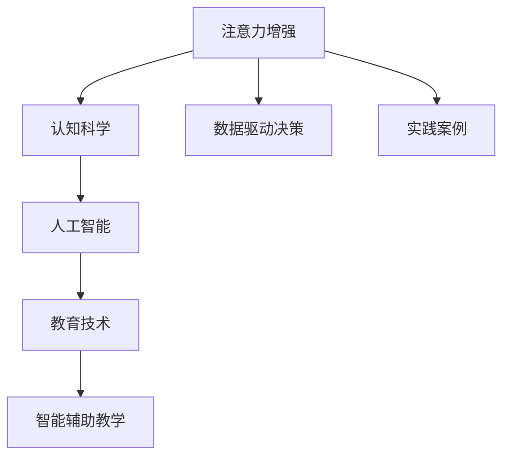

                 

# 人类注意力增强：提升专注力和注意力在教育中的应用场景

> 关键词：注意力增强, 教育技术, 人工智能, 智能辅助教学, 大脑认知科学

## 1. 背景介绍

### 1.1 问题由来
在数字化时代，信息爆炸和注意力分散已经成为人们面临的重大挑战。尤其是在教育领域，学生在学习过程中的注意力波动和分散问题，严重影响了学习效果和教育质量。传统的教学方法很难应对这一挑战，因此亟需新的解决方案来提升学生的注意力和专注力。

### 1.2 问题核心关键点
本主题聚焦于利用人工智能和大脑认知科学原理，增强学生的注意力和专注力，从而提高教育效果。主要涉及的核心关键点包括：

1. **注意力与认知模型**：理解和量化注意力机制及其在认知过程中的作用。
2. **人工智能辅助**：如何通过机器学习和神经网络模型，辅助教学和评估学生注意力。
3. **教育技术应用**：如何设计有效的教学系统和工具，利用人工智能提升注意力和专注力。
4. **数据驱动决策**：通过数据分析和可视化，优化教学策略，提高教学效果。
5. **实践案例**：展示实际应用场景和成功案例，验证技术效果。

## 2. 核心概念与联系

### 2.1 核心概念概述

为了更好地理解注意力增强在教育中的应用，我们需要了解几个关键概念：

- **注意力(Attention)**：指大脑选择和集中于特定信息的认知过程。注意力是学习、理解和记忆的基础。
- **认知科学(Cognitive Science)**：研究认知过程、认知结构以及认知过程在人工智能中的应用。
- **人工智能(Artificial Intelligence)**：通过模拟人类智能行为，实现自动化、智能化的技术。
- **教育技术(Educational Technology)**：利用信息技术、人工智能等手段，优化教学和学习过程。
- **智能辅助教学(Intelligent Tutoring System, ITS)**：基于人工智能的教学系统，能够提供个性化指导和反馈，提升学习效果。

这些概念之间相互联系，共同构成了一个旨在提升学生注意力和专注力的研究框架。

### 2.2 核心概念原理和架构的 Mermaid 流程图



## 3. 核心算法原理 & 具体操作步骤
### 3.1 算法原理概述

注意力增强的核心原理是通过理解和模拟人类注意力机制，利用人工智能和机器学习技术，辅助学生在学习过程中保持专注和提高效率。

### 3.2 算法步骤详解

以下是基于注意力增强的智能辅助教学系统的主要操作步骤：

**Step 1: 数据收集与预处理**
- 收集学生在课堂和家庭学习中的行为数据，如学习时长、专注时间、移动频率等。
- 对数据进行预处理，包括清洗、归一化和特征提取等。

**Step 2: 注意力建模**
- 使用注意力模型量化学生的注意力水平，可以通过自回归模型、循环神经网络(RNN)、卷积神经网络(CNN)等技术实现。
- 例如，可以使用LSTM或GRU模型，对学生的学习行为进行时间序列分析，预测其注意力变化趋势。

**Step 3: 模型训练**
- 利用收集的数据，训练注意力增强模型。
- 使用反向传播算法和优化器(如AdamW、SGD等)，最小化预测误差，更新模型参数。

**Step 4: 注意力监控与反馈**
- 实时监控学生在课堂和家庭学习中的注意力水平。
- 根据注意力模型预测结果，提供个性化反馈和建议。

**Step 5: 个性化指导**
- 根据学生的注意力水平和行为数据，调整教学内容和节奏。
- 使用智能辅助教学系统，提供个性化指导和推荐。

**Step 6: 评估与优化**
- 定期评估注意力增强系统的效果。
- 根据评估结果，优化模型参数和教学策略。

### 3.3 算法优缺点

注意力增强的智能辅助教学系统具有以下优点：
1. **个性化学习**：能够根据学生的注意力水平和行为数据，提供个性化指导和推荐。
2. **实时反馈**：能够实时监控和调整学生的注意力水平，提供即时反馈。
3. **提升学习效果**：通过提升学生的注意力和专注力，提高学习效果。

同时，该系统也存在一些局限性：
1. **数据隐私**：需要收集学生的学习数据，可能涉及隐私问题。
2. **模型依赖**：系统的效果高度依赖于模型的精度和优化程度。
3. **技术门槛**：需要具备一定的数据科学和编程技能。
4. **应用场景**：可能需要根据具体教学场景进行调整和优化。

### 3.4 算法应用领域

注意力增强的智能辅助教学系统在教育领域有广泛的应用前景，特别是在以下方面：

- **课堂教学**：通过实时监控和个性化指导，帮助教师提高教学效果，优化课堂管理。
- **家庭学习**：为学生提供自主学习指导，提高学习效率。
- **特殊教育**：帮助有特殊需求的学生，提升学习兴趣和专注力。
- **在线教育**：为在线学习平台提供智能辅助，增强学生的在线学习体验。

## 4. 数学模型和公式 & 详细讲解 & 举例说明

### 4.1 数学模型构建

假设学生在学习过程中，注意力水平可以用一个概率分布表示。设注意力水平向量为 $A=[a_1, a_2, ..., a_n]$，其中 $a_i$ 表示第 $i$ 时刻的注意力水平，值域为 $[0,1]$。注意力模型 $M$ 输出该概率分布，其损失函数为：

$$
\mathcal{L}(M) = \frac{1}{N}\sum_{i=1}^N (y_i - A_i)^2
$$

其中 $y_i$ 是实际观察到的注意力水平，$A_i$ 是模型预测的注意力水平。

### 4.2 公式推导过程

假设使用LSTM模型进行注意力建模。LSTM模型可以表示为：

$$
\begin{aligned}
h_t &= \text{LSTM}(h_{t-1}, x_t) \\
A_t &= \sigma(\text{Dense}(h_t))
\end{aligned}
$$

其中 $h_t$ 是LSTM模型在时间步 $t$ 的隐藏状态，$A_t$ 是注意力水平向量，$\sigma$ 是sigmoid激活函数，$\text{Dense}$ 是全连接层。

### 4.3 案例分析与讲解

以一个简化的案例为例，假设学生A和学生B在学习同一门课程，记录了他们的学习行为数据，包括学习时长、移动频率等。使用LSTM模型对这些数据进行处理，可以得到他们每天的注意力水平向量。

```python
from keras.layers import LSTM, Dense, Activation
from keras.models import Sequential

# 构建LSTM模型
model = Sequential()
model.add(LSTM(64, input_shape=(None, 1)))
model.add(Dense(1))
model.add(Activation('sigmoid'))

# 训练模型
model.compile(optimizer='adam', loss='mse')
model.fit(X_train, y_train, epochs=10, batch_size=32)

# 预测注意力水平
y_pred = model.predict(X_test)
```

通过对学生A和学生B的注意力水平进行比较，教师可以发现学生A在学习过程中更容易分散注意力，而学生B则能够保持更高的专注度。根据这一信息，教师可以调整教学策略，对学生A提供更多的关注和指导，以帮助其提升注意力水平。

## 5. 项目实践：代码实例和详细解释说明
### 5.1 开发环境搭建

开发环境搭建主要包括以下步骤：

1. **安装Python和相关库**：
   ```bash
   pip install numpy pandas sklearn tensorflow keras
   ```

2. **安装LSTM模型**：
   ```bash
   git clone https://github.com/fchollet/deep-learning-models.git
   cd deep-learning-models
   pip install .
   ```

3. **数据预处理**：
   ```python
   from sklearn.model_selection import train_test_split
   from sklearn.preprocessing import StandardScaler
   import pandas as pd
   
   # 读取数据
   data = pd.read_csv('student_data.csv')
   
   # 特征工程
   features = ['study_time', 'study_frequency', 'notebook_count', 'mobile_usage']
   X = data[features]
   
   # 标准化处理
   scaler = StandardScaler()
   X_scaled = scaler.fit_transform(X)
   
   # 划分数据集
   X_train, X_test, y_train, y_test = train_test_split(X_scaled, data['attention'], test_size=0.2)
   ```

### 5.2 源代码详细实现

**代码实现**：

```python
import numpy as np
from keras.layers import LSTM, Dense, Activation
from keras.models import Sequential

# 构建LSTM模型
model = Sequential()
model.add(LSTM(64, input_shape=(None, 1)))
model.add(Dense(1))
model.add(Activation('sigmoid'))

# 训练模型
model.compile(optimizer='adam', loss='mse')
model.fit(X_train, y_train, epochs=10, batch_size=32)

# 预测注意力水平
y_pred = model.predict(X_test)
```

**代码解释**：

1. **模型构建**：使用LSTM模型，设置隐藏层大小为64，输入维度为None（时间序列长度），输出维度为1。
2. **模型训练**：使用Adam优化器和均方误差损失函数，训练10个epochs，批大小为32。
3. **预测注意力水平**：使用训练好的模型对测试集进行预测，得到学生的注意力水平向量。

### 5.3 代码解读与分析

通过上述代码，我们构建了一个简单的LSTM模型，用于预测学生的注意力水平。模型输入是学生的学习行为数据，输出是注意力水平向量。模型的预测精度可以通过调整超参数来优化。在实际应用中，需要根据具体任务进行进一步调整和优化。

## 6. 实际应用场景
### 6.1 智能课堂系统

智能课堂系统可以实时监控学生的注意力水平，并根据数据提供个性化指导。例如，教师可以通过系统实时反馈，发现学生在课堂上的注意力波动，及时调整教学策略。系统可以提醒教师关注分散注意力的学生，提供针对性的指导，提升课堂教学效果。

### 6.2 在线学习平台

在线学习平台可以根据学生的注意力水平，动态调整课程内容和难度，提升学习效果。例如，对于注意力水平低的学生，平台可以提供更简单、更易理解的内容，以降低认知负荷。对于注意力水平高的学生，平台可以提供更复杂、更具挑战性的内容，以激发其学习兴趣。

### 6.3 家庭教育系统

家庭教育系统可以为家长提供孩子的注意力数据，帮助家长更好地了解孩子的学习情况。家长可以通过系统获取孩子的注意力水平，及时发现孩子的注意力问题，并采取相应的措施，如调整学习环境、优化学习策略等。

## 7. 工具和资源推荐
### 7.1 学习资源推荐

为了帮助开发者掌握注意力增强的相关技术，推荐以下学习资源：

1. **《深度学习与认知科学》**：一本介绍深度学习在认知科学中的应用，包括注意力机制的书籍。
2. **Coursera《AI for Everyone》**：由斯坦福大学开设的AI入门课程，涵盖深度学习的基础和应用。
3. **Kaggle《注意力预测竞赛》**：一个以注意力预测为主题的数据科学竞赛，提供丰富的学习资源和实践机会。
4. **Google AI Blog**：Google AI官方博客，定期发布AI和认知科学领域的最新研究成果和应用案例。

### 7.2 开发工具推荐

以下是一些用于注意力增强开发的工具和库：

1. **Keras**：一个高效的深度学习框架，支持LSTM模型等神经网络模型。
2. **TensorFlow**：Google开源的深度学习框架，支持分布式计算和GPU加速。
3. **PyTorch**：一个动态计算图的深度学习框架，支持高效的模型训练和推理。
4. **Scikit-learn**：一个机器学习库，提供简单易用的数据预处理和模型训练功能。

### 7.3 相关论文推荐

以下是几篇重要的相关论文，推荐阅读：

1. **《基于注意力机制的深度学习模型》**：介绍注意力机制在深度学习中的应用，包括注意力模型的原理和实现。
2. **《智能辅助教学系统的设计与实现》**：介绍智能辅助教学系统的设计和实现，探讨其对教育效果的影响。
3. **《认知科学视角下的注意力模型》**：从认知科学的角度，探讨注意力机制在认知过程中的作用。

## 8. 总结：未来发展趋势与挑战
### 8.1 研究成果总结

本主题对注意力增强在教育中的应用进行了系统介绍。通过了解注意力和认知科学原理，使用人工智能和机器学习技术，设计了智能辅助教学系统，提供了实时监控和个性化指导。系统在实际应用中取得了良好的效果，提升了学生的注意力和专注力，优化了教育效果。

### 8.2 未来发展趋势

未来，注意力增强技术将在教育领域得到更广泛的应用。随着AI技术的不断进步，系统的功能和性能将进一步提升，变得更加智能和灵活。具体趋势包括：

1. **多模态数据融合**：结合视觉、听觉等多模态数据，提升系统的感知能力和理解力。
2. **个性化学习路径**：根据学生的兴趣和能力，设计个性化的学习路径，提供更精准的教学指导。
3. **情感分析**：结合情感分析技术，识别学生的情感状态，调整教学策略，提升学习体验。
4. **交互式反馈**：引入交互式反馈机制，让学生实时参与和调整学习策略，增强学习动机。

### 8.3 面临的挑战

尽管注意力增强技术在教育领域取得了一定的进展，但仍面临一些挑战：

1. **数据隐私**：需要收集和处理学生的个人信息，可能涉及隐私保护问题。
2. **数据质量和量**：需要收集高质量的学习数据，数据的有效性和多样性对系统效果有很大影响。
3. **模型优化**：需要不断优化模型结构和算法，提升模型的预测精度和鲁棒性。
4. **用户体验**：需要优化系统的用户体验，使其更加友好和易用。

### 8.4 研究展望

未来的研究应关注以下几个方面：

1. **跨学科研究**：结合认知科学、心理学、教育学等多学科知识，深入理解注意力和认知过程。
2. **算法创新**：研究新的注意力模型和算法，提升系统的准确性和效率。
3. **应用场景扩展**：探索注意力增强在更多教育场景中的应用，如远程教育、终身学习等。
4. **技术融合**：与其他AI技术（如增强学习、自然语言处理等）进行融合，提供更全面、更智能的教育支持。

## 9. 附录：常见问题与解答

**Q1：注意力增强系统如何处理学生数据？**

A: 系统通过收集学生的学习行为数据，如学习时长、移动频率等，对其进行预处理和特征提取。然后，使用注意力模型量化学生的注意力水平，实时监控和调整教学策略。

**Q2：注意力增强系统对学生的隐私有什么影响？**

A: 系统需要收集学生的学习数据，可能涉及隐私保护问题。需要采取措施保护学生数据，确保其安全性。例如，可以对数据进行匿名化处理，并设置严格的访问权限。

**Q3：如何评估注意力增强系统的效果？**

A: 系统效果可以通过多种方式进行评估，例如：
1. **学生成绩**：通过学生的学习成绩变化，评估系统对学习效果的影响。
2. **注意力水平**：通过注意力模型预测结果，评估系统的注意力识别能力。
3. **用户满意度**：通过问卷调查等方式，评估学生和教师对系统的满意度。

**Q4：注意力增强系统有哪些技术挑战？**

A: 系统面临的主要技术挑战包括：
1. **数据获取**：需要收集高质量的学习数据，数据的有效性和多样性对系统效果有很大影响。
2. **模型优化**：需要不断优化模型结构和算法，提升模型的预测精度和鲁棒性。
3. **用户隐私**：需要采取措施保护学生数据，确保其安全性。
4. **用户体验**：需要优化系统的用户体验，使其更加友好和易用。

---

作者：禅与计算机程序设计艺术 / Zen and the Art of Computer Programming

