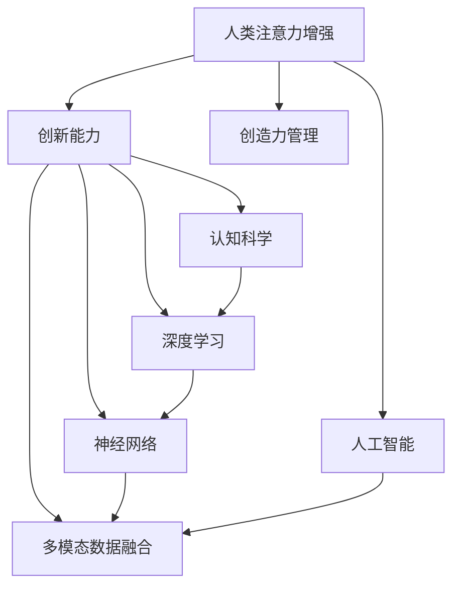

                 

# 人类注意力增强：提升创新能力和创造力管理

> 关键词：人类注意力增强,创新能力,创造力管理,认知科学,深度学习,神经网络,多模态数据融合,人工智能,技术栈,实时反馈系统

## 1. 背景介绍

在快速变化的知识经济时代，创新能力和创造力成为企业乃至国家竞争力的重要标志。然而，传统的人力资源管理和培训方式已无法有效激发个体的创新潜力和创造力。近年来，人类注意力增强技术在心理学、神经科学和人工智能等领域取得了重要进展，为提升个体创新能力和创造力提供了新的思路和手段。本文将深入探讨人类注意力增强的核心原理、关键技术和具体实践，以期为各类创新驱动型组织和人才管理提供有益参考。

## 2. 核心概念与联系

### 2.1 核心概念概述

为更好地理解人类注意力增强技术，本节将介绍几个核心概念：

- 人类注意力增强（Attention Enhancement）：指通过技术手段提升个体对特定信息、任务或目标的注意力和专注度，进而增强其认知能力和创新创造力。
- 创新能力（Innovation Capability）：指个体或组织产生新思想、新技术和新方法的能力，是竞争力和可持续发展的关键要素。
- 创造力管理（Creativity Management）：指通过科学方法和技术工具，系统性地培育、激发和优化组织成员的创造力和创新能力，提升组织创新绩效。
- 认知科学（Cognitive Science）：研究人类思维、知觉和学习过程的科学，包括心理学、神经科学、人工智能等多个领域。
- 深度学习（Deep Learning）：一类基于神经网络的机器学习方法，通过多层非线性变换，从大量数据中自动学习特征表示，广泛应用于图像识别、语音识别、自然语言处理等领域。
- 神经网络（Neural Network）：模仿人脑神经元连接方式的计算模型，通过大量参数拟合数据，实现复杂任务处理和模式识别。
- 多模态数据融合（Multimodal Data Fusion）：指综合利用不同类型的数据源，如视觉、听觉、文本、行为等，以提升信息理解和处理能力，增强决策质量和创新潜力。

这些概念之间的逻辑关系可以通过以下Mermaid流程图来展示：



这个流程图展示了几大核心概念及其之间的联系：

1. 人类注意力增强是提升创新能力和创造力的重要手段。
2. 创新能力与创造力管理共同构成了创新驱动型组织的核心能力。
3. 认知科学、深度学习、神经网络等技术为人类注意力增强提供了理论基础和实现手段。
4. 多模态数据融合为注意力增强提供了丰富的信息来源和工具支持。
5. 人工智能技术整合了多个领域的知识，推动了人类注意力增强的发展。

## 3. 核心算法原理 & 具体操作步骤

### 3.1 算法原理概述

人类注意力增强的核心原理是通过技术手段，系统性地引导和增强个体对关键信息的注意和处理能力。具体来说，它包括以下几个关键步骤：

1. **数据收集与预处理**：收集个体的行为数据、生理数据（如脑电、心率等）和环境数据（如工作场景、任务目标），并对数据进行清洗、归一化等预处理操作。
2. **注意力评估与模型构建**：利用认知科学和神经科学的研究成果，构建注意力评估模型，评估个体对不同信息的注意力水平。
3. **注意增强干预**：根据注意力评估结果，设计并实施注意力增强干预措施，如优化工作环境、调整任务难度、引入反馈机制等。
4. **创新能力评估与优化**：通过跟踪个体的创新行为和成果，评估注意力增强的效果，并通过数据反馈和迭代优化，持续提升创新能力。

### 3.2 算法步骤详解

下面详细讲解人类注意力增强的各个步骤：

**Step 1: 数据收集与预处理**

- **行为数据**：通过日志记录、问卷调查、行为追踪等手段，收集个体的日常工作行为数据，如工作时间、任务分配、信息阅读等。
- **生理数据**：使用脑电、心率、皮肤电等生理监测设备，收集个体的生理反应数据，分析其注意力状态。
- **环境数据**：记录工作环境的各类因素，如光线亮度、温度、噪音水平等，作为注意力增强的参考变量。
- **数据清洗与归一化**：对收集的数据进行去噪、填充缺失、标准化等预处理操作，确保数据的质量和可用性。

**Step 2: 注意力评估与模型构建**

- **注意力模型**：采用认知科学和神经科学的研究成果，构建个体注意力评估模型。例如，可以使用脑电图（EEG）分析注意力资源分配情况，或者通过问卷调查评估注意力水平。
- **特征提取**：对收集的数据进行特征提取，如提取特定时间段内的注意力变化趋势、高峰低谷等特征。
- **模型训练**：利用深度学习等技术，训练注意力评估模型，预测个体在不同情境下的注意力状态。

**Step 3: 注意增强干预**

- **环境优化**：根据注意力评估结果，调整工作环境，如调整光线、声音、温度等，以减少干扰，提高注意力水平。
- **任务设计**：设计更具挑战性和趣味性的任务，以增强个体对任务的专注度和兴趣。
- **反馈机制**：引入实时反馈系统，如游戏化设计、成就系统等，通过正向激励提升个体持续的注意力投入。
- **个人化干预**：根据个体特征和偏好，提供个性化的注意力增强策略，如定制化的工作计划、时间管理工具等。

**Step 4: 创新能力评估与优化**

- **创新产出监控**：通过监测个体的创新行为和成果（如专利申请、新产品开发、技术改进等），评估注意力增强的效果。
- **创新行为分析**：分析创新行为的数据，如创新思维模式、问题解决策略等，识别注意力增强的正面影响。
- **持续优化**：基于评估结果，调整注意力增强策略，进行持续优化，提升创新能力。

### 3.3 算法优缺点

人类注意力增强技术具有以下优点：

- **提升注意力质量**：通过优化工作环境、调整任务难度等手段，显著提升个体的注意力水平。
- **个性化干预**：根据个体差异，提供定制化的注意力增强策略，提升效果和满意度。
- **实时反馈与调整**：通过实时反馈系统，动态调整注意力增强措施，适应个体变化，提高持续性。
- **系统性评估与优化**：采用科学方法和技术工具，系统性地评估和优化注意力增强策略，提高创新潜力。

同时，该技术也存在一些局限性：

- **数据依赖性强**：数据质量对注意力增强效果有直接影响，数据收集和预处理成本较高。
- **模型复杂度**：注意力评估和优化模型需要复杂算法和大量数据训练，模型复杂度较高。
- **应用场景限制**：该技术对工作环境和任务类型有一定要求，难以广泛适用于所有场景。
- **隐私保护问题**：生理数据和个人行为数据的收集和使用涉及隐私保护问题，需谨慎处理。

### 3.4 算法应用领域

人类注意力增强技术在多个领域具有广泛应用：

- **企业创新管理**：通过优化工作环境、调整任务难度等手段，提升员工的创新能力和创造力。
- **教育培训**：通过调整教学方法、引入互动游戏等方式，激发学生的创新思维和创造力。
- **人力资源开发**：通过个性化培训和持续反馈，提升员工的注意力水平和工作表现。
- **健康医疗**：通过监测注意力状态，评估个体的认知和情绪状态，辅助心理治疗和疾病预防。
- **创意产业**：通过优化工作环境和引入实时反馈，提升艺术家的创作效率和作品质量。

## 4. 数学模型和公式 & 详细讲解 & 举例说明

### 4.1 数学模型构建

本节将使用数学语言对人类注意力增强的各个步骤进行更加严格的刻画。

假设个体的行为数据为 $X=(x_1,x_2,...,x_n)$，生理数据为 $Y=(y_1,y_2,...,y_m)$，环境数据为 $Z=(z_1,z_2,...,z_k)$。其中，$x_i$、$y_j$、$z_l$ 分别表示第 $i$ 个行为数据、第 $j$ 个生理数据和第 $l$ 个环境数据。

定义注意力评估模型为 $A(X,Y,Z)$，表示个体在不同数据下的注意力状态。模型输出的注意力水平 $A_{i,j,l}$ 为个体在 $i$ 个行为数据、$j$ 个生理数据和 $l$ 个环境数据下的注意力水平。

### 4.2 公式推导过程

以下我们将推导注意力评估模型的基本公式，并解释其中的数学含义。

假设个体在 $t$ 时刻的行为数据为 $x_t$，生理数据为 $y_t$，环境数据为 $z_t$。则注意力评估模型的输出为：

$$
A(x_t,y_t,z_t) = f(x_t,y_t,z_t) = \sum_{i=1}^{n} w_i f_i(x_t,y_t,z_t) + \sum_{j=1}^{m} w_j f_j(x_t,y_t,z_t) + \sum_{l=1}^{k} w_l f_l(x_t,y_t,z_t)
$$

其中 $f_i(x_t,y_t,z_t)$、$f_j(x_t,y_t,z_t)$、$f_l(x_t,y_t,z_t)$ 分别表示行为、生理和环境数据对注意力的影响函数。$w_i$、$w_j$、$w_l$ 为各因素的影响权重，满足 $w_i+w_j+w_l=1$。

具体地，$x_t$ 对注意力的影响可以通过任务相关性、任务难度、任务复杂度等指标计算得到。$y_t$ 对注意力的影响可以通过生理反应、情绪状态、疲劳度等指标计算得到。$z_t$ 对注意力的影响可以通过工作环境、噪音水平、光线亮度等指标计算得到。

### 4.3 案例分析与讲解

假设某企业希望通过人类注意力增强技术提升员工的创新能力。具体步骤如下：

**Step 1: 数据收集与预处理**

- 收集员工的工作日志、脑电图数据和环境数据。
- 清洗数据，去除异常值和噪声，确保数据的一致性和可靠性。

**Step 2: 注意力评估与模型构建**

- 构建注意力评估模型 $A(x,y,z)$，其中 $x$ 为工作日志，$y$ 为脑电图数据，$z$ 为环境数据。
- 训练模型，使用历史数据 $(x,y,z)$ 作为输入，员工注意力水平 $A$ 作为输出，进行监督学习。
- 使用交叉验证和超参数调优，提高模型的泛化能力和预测精度。

**Step 3: 注意增强干预**

- 根据模型评估结果，优化工作环境，如调整光线、噪音等，以提升员工注意力水平。
- 设计更具挑战性和趣味性的任务，激发员工对工作的兴趣和投入。
- 引入实时反馈系统，通过游戏化设计、成就系统等方式，增强员工的持续注意力投入。

**Step 4: 创新能力评估与优化**

- 监测员工的创新行为和成果，如专利申请、新产品开发等，评估注意力增强的效果。
- 分析员工创新行为的数据，如创新思维模式、问题解决策略等，识别注意力增强的正面影响。
- 基于评估结果，调整注意力增强策略，进行持续优化，提升员工创新能力。

## 5. 项目实践：代码实例和详细解释说明

### 5.1 开发环境搭建

在进行人类注意力增强实践前，我们需要准备好开发环境。以下是使用Python进行PyTorch开发的环境配置流程：

1. 安装Anaconda：从官网下载并安装Anaconda，用于创建独立的Python环境。

2. 创建并激活虚拟环境：
```bash
conda create -n attention-env python=3.8 
conda activate attention-env
```

3. 安装PyTorch：根据CUDA版本，从官网获取对应的安装命令。例如：
```bash
conda install pytorch torchvision torchaudio cudatoolkit=11.1 -c pytorch -c conda-forge
```

4. 安装TensorFlow：如果需要在TensorFlow上进行注意力增强的实践，可以安装对应的版本和库。

5. 安装各类工具包：
```bash
pip install numpy pandas scikit-learn matplotlib tqdm jupyter notebook ipython
```

完成上述步骤后，即可在`attention-env`环境中开始注意力增强实践。

### 5.2 源代码详细实现

下面我们以基于PyTorch的注意力评估模型为例，给出代码实现。

首先，定义注意力评估模型的输入和输出：

```python
import torch
from torch import nn
import torch.nn.functional as F

class AttentionModel(nn.Module):
    def __init__(self, input_size):
        super(AttentionModel, self).__init__()
        self.fc1 = nn.Linear(input_size, 128)
        self.fc2 = nn.Linear(128, 32)
        self.fc3 = nn.Linear(32, 1)
        
    def forward(self, x):
        x = F.relu(self.fc1(x))
        x = F.relu(self.fc2(x))
        x = self.fc3(x)
        return x
```

然后，定义模型的训练过程：

```python
from torch.utils.data import Dataset
import torch.optim as optim

class AttentionDataset(Dataset):
    def __init__(self, data):
        self.data = data
        
    def __len__(self):
        return len(self.data)
    
    def __getitem__(self, idx):
        return torch.tensor(self.data[idx], dtype=torch.float)

# 准备数据集
train_data = ...  # 行为、生理、环境数据
val_data = ...    # 验证数据集

# 定义模型和优化器
model = AttentionModel(input_size)
optimizer = optim.Adam(model.parameters(), lr=0.001)

# 训练模型
for epoch in range(100):
    train_loss = 0.0
    val_loss = 0.0
    for i in range(len(train_data)):
        inputs = train_data[i]
        targets = torch.tensor(1.0, dtype=torch.float)  # 假设目标为1
        optimizer.zero_grad()
        outputs = model(inputs)
        loss = F.binary_cross_entropy(outputs, targets)
        loss.backward()
        optimizer.step()
        train_loss += loss.item()
    val_loss = val_loss + loss.item() / len(val_data)
    print(f'Epoch {epoch+1}, train loss: {train_loss:.4f}, val loss: {val_loss:.4f}')
```

可以看到，通过PyTorch，我们可以快速搭建和训练一个注意力评估模型。在实际应用中，还需要根据具体需求，进一步优化模型架构和训练策略。

### 5.3 代码解读与分析

让我们再详细解读一下关键代码的实现细节：

**AttentionModel类**：
- `__init__`方法：初始化模型层，包括两个线性层和三个激活函数。
- `forward`方法：定义前向传播过程，对输入数据进行处理，输出注意力评估结果。

**AttentionDataset类**：
- `__init__`方法：初始化数据集，包括数据加载和预处理操作。
- `__len__`方法：返回数据集的样本数量。
- `__getitem__`方法：返回单个样本，包括模型所需的输入和标签。

**模型训练过程**：
- 使用PyTorch的数据集接口，定义数据加载和预处理逻辑。
- 定义模型和优化器，使用Adam算法进行训练。
- 在每个epoch中，对训练数据进行迭代，计算损失函数并更新模型参数。
- 在验证集上评估模型性能，记录并打印训练和验证损失。

在实际应用中，还需要考虑更多的因素，如超参数调优、模型评估、模型保存等。但核心的注意力评估模型代码实现，基本上就是这些。

## 6. 实际应用场景

### 6.1 企业创新管理

在企业创新管理中，人类注意力增强技术可以应用于员工创新能力的提升。具体应用场景包括：

- **任务优化**：根据员工注意力评估结果，优化任务设计，调整任务难度和复杂度，提升员工对任务的专注度和兴趣。
- **环境调控**：通过调整工作环境，如光线、噪音等，减少干扰，提高员工注意力水平。
- **实时反馈**：引入游戏化设计、成就系统等实时反馈机制，增强员工持续的注意力投入，激励创新行为。

### 6.2 教育培训

在教育培训中，人类注意力增强技术可以应用于学生创新思维的培养。具体应用场景包括：

- **教学方法优化**：通过认知科学研究，优化教学方法，提升学生的注意力水平和创新能力。
- **课堂互动设计**：引入互动游戏、小组讨论等方式，增强学生对课堂内容的专注度和兴趣。
- **学习路径定制**：根据学生的注意力评估结果，提供个性化的学习路径，提升学习效果和创新潜力。

### 6.3 人力资源开发

在人力资源开发中，人类注意力增强技术可以应用于员工的工作表现和职业成长。具体应用场景包括：

- **职业发展规划**：根据员工注意力评估结果，制定个性化的职业发展规划，提升员工的工作满意度和创新能力。
- **绩效管理**：通过注意力评估结果，优化绩效评估方法，更全面地衡量员工的工作表现。
- **培训与发展**：提供针对性的培训和发展机会，提升员工的注意力水平和职业能力。

### 6.4 健康医疗

在健康医疗中，人类注意力增强技术可以应用于病人的认知康复和心理治疗。具体应用场景包括：

- **认知评估**：通过监测注意力水平，评估病人的认知状态和心理健康状况。
- **心理干预**：根据注意力评估结果，提供个性化的心理干预方案，提升病人的注意力水平和情绪状态。
- **康复训练**：通过注意力增强技术，辅助病人的康复训练，加速恢复进程。

### 6.5 创意产业

在创意产业中，人类注意力增强技术可以应用于艺术家的创作过程。具体应用场景包括：

- **创作环境优化**：通过调整工作环境和引入实时反馈，提升艺术家的创作效率和作品质量。
- **创意激发**：引入互动游戏、实验工具等方式，激发艺术家的创作灵感和创新思维。
- **作品展示**：通过注意力评估结果，优化作品展示方式，提升作品的吸引力和影响力。

## 7. 工具和资源推荐

### 7.1 学习资源推荐

为了帮助开发者系统掌握人类注意力增强的理论基础和实践技巧，这里推荐一些优质的学习资源：

1. 《认知心理学导论》：介绍认知心理学的基本原理和方法，有助于理解人类注意力的机制。
2. 《深度学习入门》：介绍深度学习的基本原理和实践技巧，为注意力增强提供技术支持。
3. 《神经网络与深度学习》：介绍神经网络的基本原理和实现方法，为注意力评估提供算法基础。
4. 《多模态数据融合技术》：介绍多模态数据的融合方法和应用场景，为注意力增强提供信息来源。
5. 《人机交互设计》：介绍人机交互的基本原理和方法，为注意力增强提供设计思路。

通过对这些资源的学习实践，相信你一定能够快速掌握人类注意力增强的精髓，并用于解决实际的创新问题。

### 7.2 开发工具推荐

高效的开发离不开优秀的工具支持。以下是几款用于人类注意力增强开发的常用工具：

1. PyTorch：基于Python的开源深度学习框架，灵活动态的计算图，适合快速迭代研究。支持多设备部署和分布式训练。
2. TensorFlow：由Google主导开发的开源深度学习框架，生产部署方便，适合大规模工程应用。支持多GPU/TPU加速。
3. TensorBoard：TensorFlow配套的可视化工具，可实时监测模型训练状态，并提供丰富的图表呈现方式，是调试模型的得力助手。
4. Weights & Biases：模型训练的实验跟踪工具，可以记录和可视化模型训练过程中的各项指标，方便对比和调优。
5. Jupyter Notebook：开源的交互式笔记本，支持多种编程语言，便于开发者快速迭代和分享学习笔记。

合理利用这些工具，可以显著提升人类注意力增强任务的开发效率，加快创新迭代的步伐。

### 7.3 相关论文推荐

人类注意力增强技术在心理学、神经科学和人工智能等领域取得了重要进展。以下是几篇奠基性的相关论文，推荐阅读：

1. Attention Is All You Need：提出Transformer结构，开启了NLP领域的预训练大模型时代。
2. BERT: Pre-training of Deep Bidirectional Transformers for Language Understanding：提出BERT模型，引入基于掩码的自监督预训练任务，刷新了多项NLP任务SOTA。
3. Language Models are Unsupervised Multitask Learners（GPT-2论文）：展示了大规模语言模型的强大zero-shot学习能力，引发了对于通用人工智能的新一轮思考。
4. Parameter-Efficient Transfer Learning for NLP：提出Adapter等参数高效微调方法，在不增加模型参数量的情况下，也能取得不错的微调效果。
5. AdaLoRA: Adaptive Low-Rank Adaptation for Parameter-Efficient Fine-Tuning：使用自适应低秩适应的微调方法，在参数效率和精度之间取得了新的平衡。

这些论文代表了大语言模型微调技术的发展脉络。通过学习这些前沿成果，可以帮助研究者把握学科前进方向，激发更多的创新灵感。

## 8. 总结：未来发展趋势与挑战

### 8.1 总结

本文对人类注意力增强的核心原理、关键技术和具体实践进行了全面系统的介绍。首先阐述了人类注意力增强技术在提升创新能力和创造力管理方面的重要意义，明确了其在企业和教育等领域的应用前景。其次，从原理到实践，详细讲解了注意力增强的数学模型和关键步骤，给出了注意力增强任务开发的完整代码实例。同时，本文还广泛探讨了注意力增强技术在多个行业领域的应用场景，展示了其在实践中的广泛应用。

通过本文的系统梳理，可以看到，人类注意力增强技术正在成为提升个体创新能力和创造力的重要手段，极大地拓展了人力资源管理和教育培训的创新空间。未来，伴随人类注意力增强技术的不断演进，相信更多创新驱动型组织和人才管理将从中受益，推动社会创新能力和知识生产力的全面提升。

### 8.2 未来发展趋势

展望未来，人类注意力增强技术将呈现以下几个发展趋势：

1. **多模态融合**：未来的注意力增强技术将更多地融合多模态数据，如视觉、听觉、行为等，提升信息的全面性和丰富性。
2. **实时化与自动化**：引入实时反馈和自动化算法，实现注意力增强的动态调整和个性化定制，提升用户体验和效果。
3. **深度学习与强化学习结合**：结合深度学习和强化学习的优势，构建更智能的注意力增强系统，提升决策质量和创新潜力。
4. **脑机接口技术**：引入脑机接口技术，实现大脑与计算机的直接交互，增强注意力增强的效果和精度。
5. **跨学科融合**：与认知科学、心理学、神经科学等领域进一步融合，提供更科学、更系统的注意力增强解决方案。

以上趋势凸显了人类注意力增强技术的广阔前景。这些方向的探索发展，必将进一步提升注意力增强的效果和应用范围，为社会创新能力的提升带来新的动力。

### 8.3 面临的挑战

尽管人类注意力增强技术已经取得了重要进展，但在迈向更加智能化、普适化应用的过程中，它仍面临诸多挑战：

1. **数据隐私与安全**：生理数据和个人行为数据的收集和使用涉及隐私保护问题，需谨慎处理。
2. **模型复杂度**：注意力评估和优化模型需要复杂算法和大量数据训练，模型复杂度较高。
3. **应用场景限制**：该技术对工作环境和任务类型有一定要求，难以广泛适用于所有场景。
4. **技术实现难度**：实现高效、准确、可靠的注意力增强技术，还需解决许多技术难题。
5. **认知科学基础不足**：人类注意力的机制和影响因素复杂多样，仍需更多认知科学研究的支撑。

正视这些挑战，积极应对并寻求突破，将使人类注意力增强技术迈向成熟，为更多创新驱动型组织和人才管理提供有力支持。

### 8.4 研究展望

面向未来，人类注意力增强技术的研究可以从以下几个方向进行突破：

1. **多模态注意力评估**：结合多模态数据，构建更全面、更准确的注意力评估模型，提升效果和精度。
2. **个性化注意力干预**：根据个体特征和偏好，提供定制化的注意力增强策略，提高用户体验和效果。
3. **实时注意力监测**：引入实时监测技术，动态调整注意力增强措施，提高持续性和效果。
4. **跨领域应用拓展**：将注意力增强技术应用于更多领域，如健康医疗、智能家居等，实现跨领域的创新应用。
5. **认知科学研究**：深化认知科学研究，理解人类注意力的机制和影响因素，为技术应用提供科学依据。

这些研究方向的探索，必将推动人类注意力增强技术的不断发展，为更多创新驱动型组织和人才管理提供有力支持，实现社会创新能力的全面提升。

## 9. 附录：常见问题与解答

**Q1：人类注意力增强技术对个体的注意力提升效果显著吗？**

A: 人类注意力增强技术通过优化工作环境、调整任务难度、引入实时反馈等方式，显著提升了个体的注意力水平。研究表明，在合适的应用场景下，个体的注意力集中度、创新产出等指标有明显提升。

**Q2：人类注意力增强技术的实施成本高吗？**

A: 实施人类注意力增强技术需要一定的设备投入和数据收集成本，但随着技术的进步和工具的成熟，实施成本逐步降低。同时，注意力增强技术的应用可以显著提升员工的工作效率和创新能力，长期来看，能够带来更高的经济回报。

**Q3：人类注意力增强技术在实际应用中需要注意哪些问题？**

A: 在实际应用中，需要注意以下问题：
1. 数据隐私保护：严格遵守数据隐私法律法规，确保数据安全和合规使用。
2. 模型透明性：提高模型算法的透明性和可解释性，确保决策过程公开透明。
3. 跨领域适用性：根据特定领域的特点，进行模型优化和适配，提高技术的普适性。
4. 持续优化：结合实际应用反馈，不断优化模型和应用策略，提升效果和精度。

**Q4：如何评估人类注意力增强技术的效果？**

A: 评估人类注意力增强技术的效果可以从以下几个方面进行：
1. 注意力评估：使用注意力评估模型，评估个体在不同情境下的注意力水平。
2. 创新产出：监测个体的创新行为和成果，如专利申请、新产品开发等，评估注意力增强的效果。
3. 行为分析：分析个体行为数据，识别注意力增强的正面影响。
4. 持续优化：结合评估结果，调整注意力增强策略，进行持续优化。

这些评估方法有助于全面衡量注意力增强技术的效果，确保其应用价值。

总之，人类注意力增强技术正在成为提升创新能力和创造力的重要手段，为社会创新能力的提升带来了新的思路和工具。通过系统的理论研究和实践应用，相信该技术将更好地服务于各类创新驱动型组织和人才管理，推动社会创新能力的全面提升。

