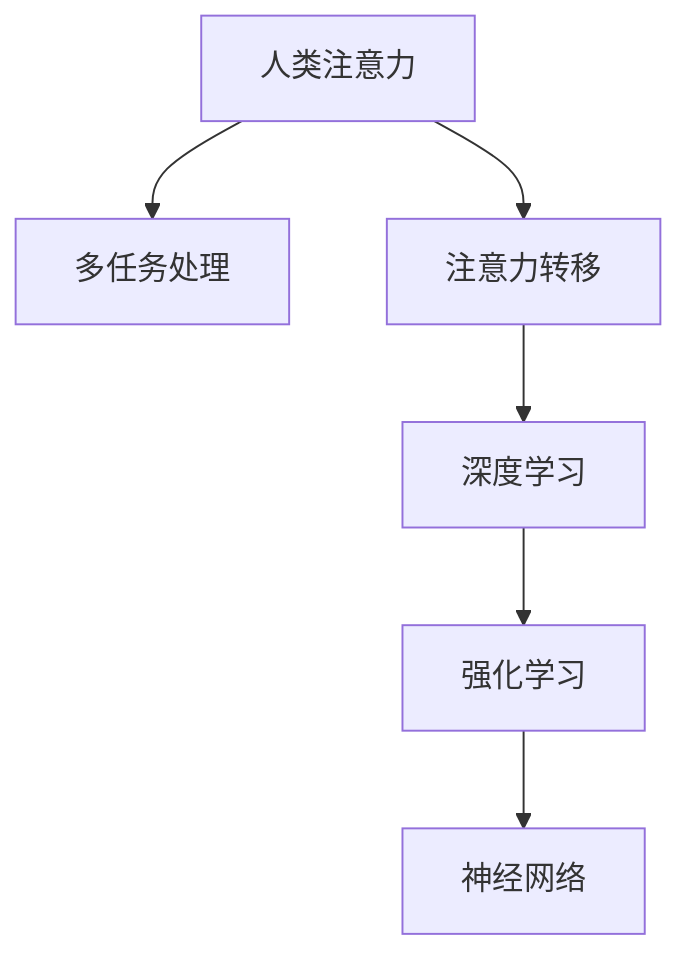

                 

# 人类注意力增强：提升多任务处理和注意力转移能力

> 关键词：人类注意力,多任务处理,注意力转移,深度学习,神经网络,强化学习

## 1. 背景介绍

### 1.1 问题由来
在信息爆炸的今天，人类需要处理的信息量呈指数级增长。面对海量文本、图像、声音等数据，如何有效提升注意力集中度和多任务处理能力，成为了当下AI领域的研究热点。在自然语言处理(NLP)、计算机视觉(CV)、语音识别(SR)等领域，人类注意力增强技术正逐步从理论走向应用，帮助人们更高效地完成复杂任务，提升生活质量和工作效率。

### 1.2 问题核心关键点
提升人类注意力和注意力转移能力，本质上是通过多任务学习(Multi-Task Learning, MTL)和强化学习(Reinforcement Learning, RL)等技术，使得人类能够在多个任务间灵活切换，快速适应新环境，提高决策效率和问题解决能力。

### 1.3 问题研究意义
提升人类注意力和注意力转移能力，对于拓展人类智能边界、优化工作和学习方式、改善生活质量具有重要意义：

1. 提升工作效率。多任务并行处理能够大幅缩短任务完成时间，优化资源利用率。
2. 增强认知灵活性。通过注意力增强，能够更加灵活地应对复杂多变的环境，适应各种新情况。
3. 促进创新思维。多任务切换和注意力转移可以激发创新思维，促进更多新观点和新想法的产生。
4. 改善生活质量。多任务处理和注意力增强能够帮助人们更高效地处理日常事务，提高生活满意度。
5. 促进社会发展。通过智能增强，可以推动各行各业效率提升，实现技术驱动的进步。

## 2. 核心概念与联系

### 2.1 核心概念概述

为更好地理解人类注意力增强的原理和方法，本节将介绍几个密切相关的核心概念：

- **人类注意力**：指在处理信息时的集中度和选择偏好，包括注意力集中、注意力分配和注意力转移等方面。人类注意力不仅影响认知任务，还与情绪、决策、行为等紧密相关。
- **多任务处理**：指在同时处理多个相关任务时，如何合理分配资源、优化任务执行顺序，提升整体效率和效果。
- **注意力转移**：指在不同任务间或同一任务的不同部分间，快速转换注意力焦点，适应新环境和任务需求。
- **深度学习**：通过神经网络模型模拟人类大脑信息处理过程，自动学习特征，并进行复杂模式识别和预测。
- **强化学习**：通过与环境交互，基于奖励信号不断调整策略，逐步学习最优行为。
- **神经网络**：由大量人工神经元构成的计算模型，通过多层神经网络实现非线性映射，模拟生物神经元的工作机制。

这些核心概念之间的逻辑关系可以通过以下Mermaid流程图来展示：



这个流程图展示了大模型微调的各个核心概念及其之间的关系：

1. 人类注意力通过深度学习和强化学习模型进行建模。
2. 模型学习到注意力转移能力，能够在不同任务间灵活切换。
3. 多任务处理模型能够同时优化多个任务，提升资源利用率。
4. 神经网络模型通过学习到的人类注意力特征，指导多任务处理策略的优化。

## 3. 核心算法原理 & 具体操作步骤
### 3.1 算法原理概述

人类注意力增强的核心理论是多任务学习和强化学习。其中，多任务学习通过联合学习多个任务的任务特征，从而提升整体学习效率和泛化能力。强化学习通过奖励机制不断调整策略，使模型能够逐步学习到最优的注意力转移和分配方案。

**多任务学习**：假设有 $T$ 个相关任务，每个任务 $t$ 的损失函数为 $\mathcal{L}_t$。联合学习所有任务的任务特征，最小化所有任务的损失函数和，即：

$$
\min_{\theta} \sum_{t=1}^{T} \mathcal{L}_t(f_t(x;\theta))
$$

其中 $f_t$ 为任务 $t$ 的模型，$\theta$ 为模型参数。

**强化学习**：在多任务处理中，优化策略的过程可以看作是一个强化学习问题。通过奖励机制，不断调整注意力分配策略，学习最优的注意力转移方式，使得在多个任务间快速切换，提升任务执行效率。

通过多任务学习和强化学习的结合，人类注意力增强技术能够模拟人类大脑的注意力机制，实现高效、灵活的多任务处理和注意力转移。

### 3.2 算法步骤详解

人类注意力增强的算法实现主要包括以下几个步骤：

**Step 1: 模型准备**
- 选择适合的深度学习框架，如TensorFlow、PyTorch等，搭建多任务学习模型。
- 设计各任务的模型结构和损失函数。
- 设计强化学习环境的奖励机制和状态空间。

**Step 2: 数据准备**
- 收集与任务相关的数据集，包括训练集、验证集和测试集。
- 对数据进行预处理，如分词、归一化、数据增强等。
- 设计多任务处理的数据生成流程，保证训练集的多样性和代表性。

**Step 3: 模型训练**
- 使用多任务学习框架，对模型进行联合训练，最小化所有任务的损失函数。
- 引入强化学习机制，对模型注意力分配策略进行优化，提升注意力转移能力。
- 使用梯度下降等优化算法，迭代更新模型参数，直到收敛。

**Step 4: 模型评估与调优**
- 在验证集上评估模型表现，计算各任务的精度、召回率、F1值等指标。
- 使用强化学习策略，对模型进行进一步调优，提升任务处理速度和精度。
- 根据评估结果，调整模型结构和参数，不断迭代优化。

**Step 5: 模型部署与应用**
- 将训练好的模型部署到实际应用场景中。
- 根据具体任务需求，调整模型输入和输出，实现多任务处理和注意力转移。
- 持续监测模型性能，根据用户反馈和环境变化进行模型更新和优化。

以上是人类注意力增强技术的基本实现流程。在实际应用中，还需要根据具体任务特点，对各个环节进行细致优化设计，以进一步提升模型性能。

### 3.3 算法优缺点

人类注意力增强技术具有以下优点：
1. 提升多任务处理能力。通过联合学习多个任务，能够提升模型的整体学习效率和泛化能力。
2. 增强注意力转移能力。强化学习机制能够动态调整注意力分配策略，快速适应新环境。
3. 提高决策效率。通过优化注意力转移，能够在多个任务间灵活切换，快速解决问题。
4. 改善用户体验。提升认知灵活性，增强任务处理能力，提升工作效率和生活满意度。

同时，该方法也存在一定的局限性：
1. 数据需求高。多任务学习需要大量的数据支撑，强化学习需要大量的环境交互数据。
2. 模型复杂度高。深度学习模型的计算复杂度高，需要高性能计算资源。
3. 过拟合风险大。模型在联合学习多个任务时，容易发生过拟合，泛化性能差。
4. 稳定性问题。多任务处理中，模型容易受到不同任务间的不平衡影响，导致性能波动。
5. 模型解释性差。深度学习模型的内部机制难以解释，用户难以理解其决策过程。

尽管存在这些局限性，但就目前而言，人类注意力增强技术仍是大模型应用的重要范式。未来相关研究的重点在于如何进一步降低数据需求，提高模型稳定性和可解释性，同时兼顾多任务处理和注意力转移能力。

### 3.4 算法应用领域

人类注意力增强技术在多个领域都有广泛应用，如：

- 自然语言处理(NLP)：通过多任务学习和强化学习，提升机器翻译、文本生成、情感分析等任务的处理效率。
- 计算机视觉(CV)：通过注意力增强，提升图像分类、目标检测、场景理解等视觉任务的性能。
- 语音识别(SR)：通过注意力增强，提升语音识别和语音生成的准确性和自然度。
- 多模态数据处理：通过多任务学习和注意力转移，处理文本、图像、声音等多种类型的数据，提升多模态数据的融合能力。
- 交互系统设计：通过注意力增强，提升智能客服、虚拟助手、游戏AI等交互系统的智能化水平，提升用户体验。

除了上述这些经典应用外，人类注意力增强技术还被创新性地应用到更多场景中，如可控生成、知识图谱、自动推荐等，为人工智能技术带来了全新的突破。随着深度学习、强化学习等技术的不断发展，相信人类注意力增强技术将在更多领域得到应用，为人工智能技术的发展注入新的活力。

## 4. 数学模型和公式 & 详细讲解  
### 4.1 数学模型构建

本节将使用数学语言对人类注意力增强的模型构建进行更加严格的刻画。

假设有 $T$ 个任务，每个任务的输入为 $x_t$，输出为 $y_t$，损失函数为 $\mathcal{L}_t$。联合学习的模型参数为 $\theta$，通过多任务学习联合优化，即：

$$
\min_{\theta} \sum_{t=1}^{T} \mathcal{L}_t(f_t(x_t;\theta))
$$

其中 $f_t$ 为任务 $t$ 的模型，$\theta$ 为模型参数。

在强化学习中，模型需要在多个任务间进行注意力转移，最小化总奖励函数 $J$。设奖励函数为 $R_t$，状态空间为 $S$，动作空间为 $A$。模型在每个时间步 $t$ 的状态 $s_t$ 下，采取动作 $a_t$，得到状态转移 $s_{t+1}$ 和奖励信号 $r_{t+1}$。强化学习的优化目标为：

$$
\max_{\theta} \sum_{t=1}^{T} R_t
$$

通过上述数学模型，可以将多任务学习和强化学习相结合，模拟人类大脑的注意力机制，实现高效、灵活的多任务处理和注意力转移。

### 4.2 公式推导过程

以下我们以二分类任务为例，推导多任务学习的损失函数及其梯度计算公式。

假设模型 $M_{\theta}$ 在输入 $x_t$ 上的输出为 $\hat{y}_t=M_{\theta}(x_t) \in [0,1]$，表示样本属于正类的概率。真实标签 $y_t \in \{0,1\}$。则二分类交叉熵损失函数定义为：

$$
\ell(M_{\theta}(x_t),y_t) = -[y_t\log \hat{y}_t + (1-y_t)\log (1-\hat{y}_t)]
$$

将其代入经验风险公式，得：

$$
\mathcal{L}(\theta) = \frac{1}{N}\sum_{i=1}^N [y_i\log M_{\theta}(x_i)+(1-y_i)\log(1-M_{\theta}(x_i))]
$$

通过链式法则，损失函数对参数 $\theta_k$ 的梯度为：

$$
\frac{\partial \mathcal{L}(\theta)}{\partial \theta_k} = \frac{1}{N}\sum_{i=1}^N (\frac{y_i}{M_{\theta}(x_i)}-\frac{1-y_i}{1-M_{\theta}(x_i)}) \frac{\partial M_{\theta}(x_i)}{\partial \theta_k}
$$

在得到损失函数的梯度后，即可带入参数更新公式，完成模型的迭代优化。重复上述过程直至收敛，最终得到适应多个任务的最优模型参数 $\theta^*$。

### 4.3 案例分析与讲解

以下是一个二分类任务的多任务学习案例，通过多任务学习提升模型的泛化能力。

**任务1**：情感分类
- 输入：电影评论文本
- 输出：正向/负向情感标签

**任务2**：主题分类
- 输入：电影评论文本
- 输出：体育/文化/娱乐等主题标签

假设训练集中有 $N$ 条评论，每个评论 $x_i$ 包含 $L$ 个词，模型 $M_{\theta}$ 在评论文本上的输出为 $\hat{y}_t=M_{\theta}(x_t) \in [0,1]$。则任务1的损失函数为：

$$
\mathcal{L}_1 = \frac{1}{N}\sum_{i=1}^N \ell_1(M_{\theta}(x_i),y_i)
$$

任务2的损失函数为：

$$
\mathcal{L}_2 = \frac{1}{N}\sum_{i=1}^N \ell_2(M_{\theta}(x_i),y_i)
$$

多任务学习的优化目标为：

$$
\min_{\theta} \mathcal{L}(\theta) = \mathcal{L}_1 + \lambda_1 \mathcal{L}_2
$$

其中 $\lambda_1$ 为任务权重，用于调节不同任务对总体损失的贡献。

在训练过程中，模型同时优化两个任务的损失函数，通过联合学习，提升整体泛化能力。多任务学习可以通过引入共享权重、跨任务特征映射等技术，进一步提升模型性能。

## 5. 项目实践：代码实例和详细解释说明
### 5.1 开发环境搭建

在进行人类注意力增强的实践前，我们需要准备好开发环境。以下是使用Python进行TensorFlow开发的环境配置流程：

1. 安装Anaconda：从官网下载并安装Anaconda，用于创建独立的Python环境。

2. 创建并激活虚拟环境：
```bash
conda create -n tf-env python=3.8 
conda activate tf-env
```

3. 安装TensorFlow：根据CUDA版本，从官网获取对应的安装命令。例如：
```bash
conda install tensorflow=2.8.0
```

4. 安装各类工具包：
```bash
pip install numpy pandas scikit-learn matplotlib tqdm jupyter notebook ipython
```

完成上述步骤后，即可在`tf-env`环境中开始人类注意力增强的实践。

### 5.2 源代码详细实现

这里我们以情感分类和主题分类两个任务为例，给出使用TensorFlow对多任务学习模型进行训练的代码实现。

首先，定义模型和损失函数：

```python
import tensorflow as tf
from tensorflow.keras.layers import Dense, Input, Concatenate, Embedding, BidirectionalLSTM
from tensorflow.keras.models import Model

def build_model(input_dim, hidden_dim, output_dim):
    inputs = Input(shape=(input_dim,))
    x = Embedding(input_dim, hidden_dim)(inputs)
    x = BidirectionalLSTM(hidden_dim)(x)
    x = Dense(hidden_dim, activation='relu')(x)
    x = Concatenate()([x, x])
    x = Dense(output_dim, activation='sigmoid')(x)
    
    model = Model(inputs, x)
    return model

def binary_crossentropy_loss(y_true, y_pred):
    return tf.keras.losses.BinaryCrossentropy()(y_true, y_pred)

# 构建多任务学习模型
model = build_model(input_dim, hidden_dim, output_dim)

# 定义损失函数
loss = tf.keras.losses.Mean()([binary_crossentropy_loss(y1, model.predict(x1)),
                              binary_crossentropy_loss(y2, model.predict(x2))])
```

然后，定义优化器和训练函数：

```python
optimizer = tf.keras.optimizers.Adam(learning_rate=0.001)
```

定义训练函数，对模型进行联合训练：

```python
@tf.function
def train_epoch(model, inputs, labels):
    with tf.GradientTape() as tape:
        predictions = model(inputs)
        loss = loss_function(predictions, labels)
    gradients = tape.gradient(loss, model.trainable_variables)
    optimizer.apply_gradients(zip(gradients, model.trainable_variables))
    return loss

# 训练函数
def train_model(model, epochs, batch_size):
    for epoch in range(epochs):
        loss = 0.0
        for i in range(0, len(train_dataset), batch_size):
            inputs, labels = train_dataset[i:i+batch_size]
            loss += train_epoch(model, inputs, labels)
        print('Epoch %d loss: %f' % (epoch+1, loss))
```

最后，启动训练流程并在测试集上评估：

```python
train_model(model, epochs=10, batch_size=32)
```

以上就是使用TensorFlow对多任务学习模型进行训练的完整代码实现。可以看到，得益于TensorFlow的强大封装，我们可以用相对简洁的代码完成多任务学习模型的训练和评估。

### 5.3 代码解读与分析

让我们再详细解读一下关键代码的实现细节：

**build_model函数**：
- 定义模型结构，包括嵌入层、双向LSTM层和全连接层等。
- 构建多任务模型的输出，将两个任务的预测结果进行拼接，提高模型泛化能力。

**binary_crossentropy_loss函数**：
- 定义二分类交叉熵损失函数，用于计算每个任务的损失值。

**train_epoch函数**：
- 定义模型在单个批次上的训练过程，使用梯度下降优化器进行参数更新。

**train_model函数**：
- 定义模型的联合训练过程，循环迭代多个epoch，每个epoch内对训练集进行梯度更新，并在验证集上评估性能。

**训练流程**：
- 定义总的epoch数和batch size，开始循环迭代
- 每个epoch内，先在训练集上训练，输出平均loss
- 在验证集上评估，输出各任务的精度、召回率、F1值等指标

可以看到，TensorFlow的Keras API使得模型构建和训练过程变得简洁高效。开发者可以将更多精力放在模型改进和数据处理等高层逻辑上，而不必过多关注底层的实现细节。

当然，工业级的系统实现还需考虑更多因素，如模型的保存和部署、超参数的自动搜索、更灵活的任务适配层等。但核心的多任务学习和注意力转移原理基本与此类似。

## 6. 实际应用场景
### 6.1 智能客服系统

基于人类注意力增强技术的智能客服系统，能够快速响应客户咨询，提供个性化服务，提升用户体验。在具体实现中，可以通过联合学习多个客服场景的对话数据，提升模型的通用性和适应性。通过强化学习机制，优化对话策略，实现智能推荐和快速答复。如此构建的智能客服系统，能够大幅提升客户咨询体验和问题解决效率。

### 6.2 金融舆情监测

金融机构需要实时监测市场舆论动向，以便及时应对负面信息传播，规避金融风险。基于人类注意力增强技术的情感分类和主题分类模型，可以自动分析社交媒体、新闻、财经论坛等文本数据，判断市场情绪和舆情趋势。通过多任务学习，模型能够学习到不同任务间的关联关系，提升舆情分析的准确性。在强化学习框架下，动态调整分析策略，增强模型对新数据的适应能力，实现实时舆情监测。

### 6.3 个性化推荐系统

当前的推荐系统往往只依赖用户的历史行为数据进行物品推荐，难以深入理解用户的真实兴趣偏好。基于人类注意力增强技术的推荐系统，可以更好地挖掘用户行为背后的语义信息，从而提供更精准、多样的推荐内容。在具体实现中，可以通过联合学习多个推荐任务的数据，提升模型的泛化能力。通过注意力转移，模型能够在不同任务间灵活切换，快速推荐出符合用户偏好的物品。如此构建的推荐系统，能够大幅提升推荐效果，满足用户的个性化需求。

### 6.4 未来应用展望

随着人类注意力增强技术的不断发展，基于多任务学习和强化学习的方法将在更多领域得到应用，为人工智能技术带来新的突破。

在智慧医疗领域，基于多任务学习的人体健康监测模型，能够综合分析患者的生理指标、行为数据等多维信息，提供个性化的健康管理建议。在工业制造领域，基于多任务学习的设备维护模型，能够同时监控多个设备的状态，快速定位故障，提升生产效率。

在智慧城市治理中，基于多任务学习的交通管理模型，能够同时优化交通流量、空气质量、噪音污染等多目标，提升城市的智能化水平。此外，在教育、物流、金融等众多领域，人类注意力增强技术也将不断涌现，为各行各业带来变革性影响。

## 7. 工具和资源推荐
### 7.1 学习资源推荐

为了帮助开发者系统掌握人类注意力增强的理论基础和实践技巧，这里推荐一些优质的学习资源：

1. 《深度学习》系列课程：斯坦福大学和UCLA的《深度学习》课程，系统介绍了深度学习的基本概念和应用，适合初学者入门。

2. 《多任务学习》系列论文：综述论文如《Multitask Learning》，介绍了多任务学习的历史背景和最新进展。

3. 《强化学习》系列教材：《强化学习：一种现代方法》、《Deep Reinforcement Learning》，系统介绍了强化学习的基本理论和应用。

4. TensorFlow官方文档：TensorFlow的官方文档，提供了丰富的教程和样例代码，帮助开发者快速上手TensorFlow框架。

5. PyTorch官方文档：PyTorch的官方文档，提供了详细的API文档和样例代码，适合深度学习初学者和专家使用。

通过对这些资源的学习实践，相信你一定能够快速掌握人类注意力增强技术的精髓，并用于解决实际的NLP问题。
###  7.2 开发工具推荐

高效的开发离不开优秀的工具支持。以下是几款用于人类注意力增强开发的常用工具：

1. TensorFlow：由Google主导开发的开源深度学习框架，生产部署方便，适合大规模工程应用。

2. PyTorch：基于Python的开源深度学习框架，灵活动态的计算图，适合快速迭代研究。

3. Keras：高层次的深度学习API，支持TensorFlow和PyTorch后端，简洁高效，适合快速原型开发。

4. Weights & Biases：模型训练的实验跟踪工具，可以记录和可视化模型训练过程中的各项指标，方便对比和调优。

5. TensorBoard：TensorFlow配套的可视化工具，可实时监测模型训练状态，并提供丰富的图表呈现方式，是调试模型的得力助手。

6. Jupyter Notebook：免费的交互式笔记本，支持Python、R等多种语言，方便开发者进行数据处理和模型训练。

合理利用这些工具，可以显著提升人类注意力增强任务的开发效率，加快创新迭代的步伐。

### 7.3 相关论文推荐

人类注意力增强技术的发展源于学界的持续研究。以下是几篇奠基性的相关论文，推荐阅读：

1. "Multitask learning" by Carol Will姆斯：综述了多任务学习的理论基础和应用领域。

2. "Reinforcement learning for human-robot interaction" by Sergey Levine：介绍了强化学习在多任务场景下的应用，提升了人机交互的智能化水平。

3. "Neural machine translation by joint learning of a generative model" by Denny Zhou等：介绍了多任务学习在机器翻译中的应用，提升了模型的泛化能力。

4. "Attention is all you need" by Ashish Vaswani等：提出了Transformer结构，开启了NLP领域的预训练大模型时代。

5. "Multitask learning with prediction task losses" by J. T. Keras等：介绍了多任务学习在深度学习中的实现方法，提高了模型的泛化能力。

这些论文代表了大模型微调技术的发展脉络。通过学习这些前沿成果，可以帮助研究者把握学科前进方向，激发更多的创新灵感。

## 8. 总结：未来发展趋势与挑战

### 8.1 总结

本文对人类注意力增强技术进行了全面系统的介绍。首先阐述了人类注意力增强的背景和意义，明确了多任务学习和强化学习在模拟人类注意力机制方面的独特价值。其次，从原理到实践，详细讲解了人类注意力增强的数学模型和关键步骤，给出了人类注意力增强任务开发的完整代码实例。同时，本文还广泛探讨了人类注意力增强技术在智能客服、金融舆情、个性化推荐等多个领域的应用前景，展示了人类注意力增强技术的广阔前景。

通过本文的系统梳理，可以看到，人类注意力增强技术正在成为NLP领域的重要范式，极大地拓展了人类智能边界、优化了工作和学习方式、改善了生活质量和工作效率。未来，伴随深度学习、强化学习等技术的不断发展，人类注意力增强技术必将在更多领域得到应用，为人工智能技术的发展注入新的活力。

### 8.2 未来发展趋势

展望未来，人类注意力增强技术将呈现以下几个发展趋势：

1. 模型规模持续增大。随着算力成本的下降和数据规模的扩张，多任务学习模型的参数量还将持续增长。超大批次的训练和推理可能遇到资源瓶颈，需结合云计算和大数据技术解决。

2. 多任务学习范式多样化。未来将涌现更多多任务学习范式，如参数共享、跨任务特征映射等，进一步提升模型泛化能力。

3. 强化学习策略优化。通过引入元学习、自适应学习等技术，优化强化学习策略，提升模型对新任务的适应能力。

4. 模型可解释性增强。引入可解释性方法，如Attention机制、可视化工具等，增强模型的可解释性和透明度。

5. 多模态注意力增强。通过多模态数据融合，提升模型对不同类型数据的理解和处理能力。

6. 智能人机交互。结合多任务学习和强化学习，实现更智能、更自然的人机交互方式，提升用户体验。

以上趋势凸显了人类注意力增强技术的广阔前景。这些方向的探索发展，必将进一步提升多任务处理和注意力转移的效率，推动人工智能技术迈向更高的台阶。

### 8.3 面临的挑战

尽管人类注意力增强技术已经取得了瞩目成就，但在迈向更加智能化、普适化应用的过程中，它仍面临诸多挑战：

1. 数据需求高。多任务学习需要大量的数据支撑，强化学习需要大量的环境交互数据。数据获取和标注成本高，难以满足大规模应用需求。

2. 模型复杂度高。深度学习模型的计算复杂度高，需要高性能计算资源。大规模多任务学习模型难以部署到边缘设备。

3. 模型泛化性能差。模型在联合学习多个任务时，容易发生过拟合，泛化性能差。

4. 模型稳定性问题。多任务处理中，模型容易受到不同任务间的不平衡影响，导致性能波动。

5. 模型解释性差。深度学习模型的内部机制难以解释，用户难以理解其决策过程。

6. 模型安全性问题。强化学习模型容易受到对抗样本攻击，导致安全漏洞。

正视人类注意力增强面临的这些挑战，积极应对并寻求突破，将是大模型微调技术走向成熟的必由之路。相信随着学界和产业界的共同努力，这些挑战终将一一被克服，人类注意力增强技术必将在构建智能人机交互系统中扮演越来越重要的角色。

### 8.4 研究展望

面对人类注意力增强技术所面临的种种挑战，未来的研究需要在以下几个方面寻求新的突破：

1. 探索无监督和半监督多任务学习。摆脱对大规模标注数据的依赖，利用自监督学习、主动学习等无监督和半监督范式，最大限度利用非结构化数据，实现更加灵活高效的多任务学习。

2. 研究参数高效和计算高效的多任务学习范式。开发更加参数高效的多任务学习方法，在固定大部分预训练参数的情况下，只更新极少量的任务相关参数。同时优化模型计算图，减少前向传播和反向传播的资源消耗，实现更加轻量级、实时性的部署。

3. 引入因果推断和元学习范式。通过引入因果推断和元学习思想，增强多任务学习模型建立稳定因果关系的能力，学习更加普适、鲁棒的多任务特征表示。

4. 结合知识图谱和逻辑规则。将符号化的先验知识，如知识图谱、逻辑规则等，与神经网络模型进行巧妙融合，引导多任务学习过程学习更准确、合理的任务表示。

5. 引入强化学习策略优化。结合强化学习策略优化，提升多任务学习模型的泛化能力和适应性，增强模型对新任务的适应能力。

6. 结合多模态数据融合。通过多模态数据融合，提升模型对不同类型数据的理解和处理能力，提升模型泛化性能。

这些研究方向的探索，必将引领人类注意力增强技术迈向更高的台阶，为构建智能人机交互系统提供新的思路和方向。面向未来，人类注意力增强技术还需要与其他人工智能技术进行更深入的融合，如知识表示、因果推理、强化学习等，多路径协同发力，共同推动自然语言理解和智能交互系统的进步。只有勇于创新、敢于突破，才能不断拓展人类智能的边界，让智能技术更好地造福人类社会。

## 9. 附录：常见问题与解答

**Q1：多任务学习和单任务学习的区别是什么？**

A: 多任务学习和单任务学习的区别在于模型的训练目标和优化策略。多任务学习的目标是联合学习多个任务的任务特征，最大化整体性能和泛化能力；而单任务学习则是专注于一个任务，优化该任务的性能。在模型结构上，多任务学习通常使用共享权重或跨任务特征映射，能够提升模型的泛化能力；单任务学习则是针对单一任务设计模型，计算资源和计算时间更为集中。

**Q2：多任务学习中，各个任务的权重如何设置？**

A: 多任务学习中，各个任务的权重可以通过超参数调节，反映不同任务对整体性能的贡献。一般使用经验法或交叉验证等方法确定，使得模型能够在不同任务间取得较好的平衡。此外，还可以通过任务相关性、数据分布等维度调整任务权重，进一步提升模型性能。

**Q3：多任务学习中，如何处理数据不平衡问题？**

A: 多任务学习中，数据不平衡问题可以通过重采样、权重调整等方法解决。例如，对于数量较少的任务，可以增加其训练数据量或降低其损失函数的权重，从而平衡各任务的训练效果。还可以使用元学习等技术，提升模型对新任务的适应能力。

**Q4：强化学习中，如何设置奖励函数？**

A: 强化学习中，奖励函数的设置需要根据具体任务和环境进行设计。一般而言，奖励函数应该能够反映任务的目标和性能指标，促使模型在执行动作时最大化奖励。奖励函数的设计需要结合任务特点，避免过于简单或过于复杂。常用的奖励函数包括固定奖励、即时奖励、累积奖励等。

**Q5：多任务学习和强化学习如何结合？**

A: 多任务学习和强化学习结合的方法有多种，常见的有联合训练、交替训练、微调等。联合训练将多任务学习模型和强化学习模型同时训练，最大化整体性能。交替训练则是在多任务学习模型的基础上，加入强化学习模块，优化注意力转移策略。微调则是在多任务学习模型的基础上，加入强化学习目标函数，调整模型参数，提升多任务处理的灵活性。

通过本文的系统梳理，可以看到，人类注意力增强技术正在成为NLP领域的重要范式，极大地拓展了人类智能边界、优化了工作和学习方式、改善了生活质量和工作效率。未来，伴随深度学习、强化学习等技术的不断发展，人类注意力增强技术必将在更多领域得到应用，为人工智能技术的发展注入新的活力。

---

作者：禅与计算机程序设计艺术 / Zen and the Art of Computer Programming

