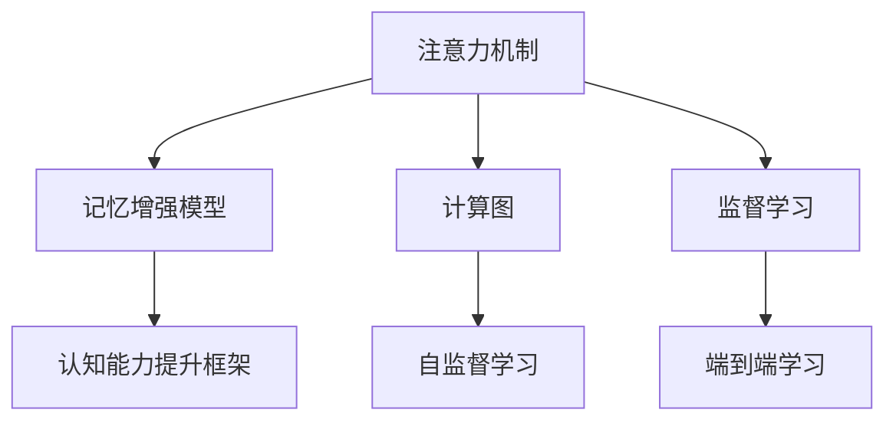
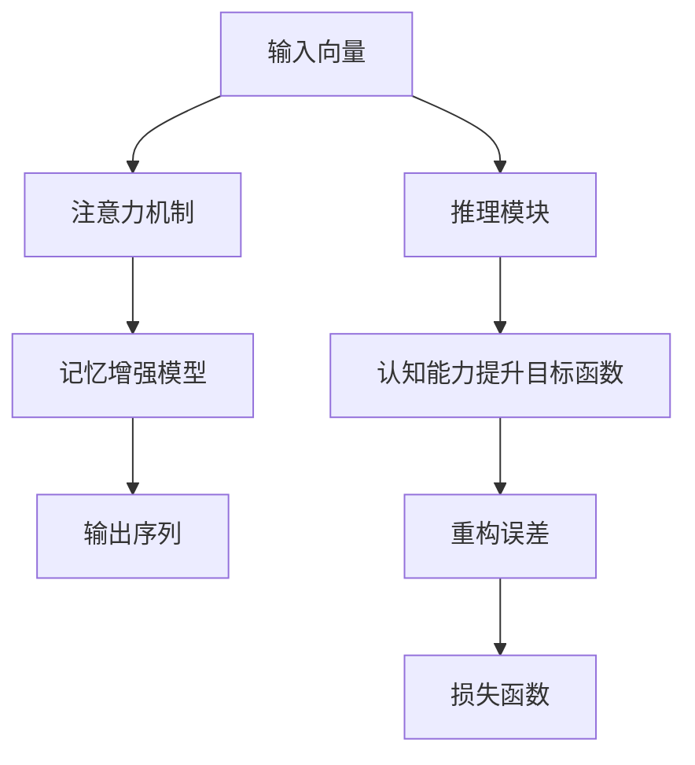

                 

# 人类注意力增强：提升注意力和记忆力的方法

> 关键词：
- 人类注意力增强
- 注意力模型
- 记忆强化
- 认知能力提升
- 大脑神经网络

## 1. 背景介绍

### 1.1 问题由来
在信息爆炸的时代，人类需要处理的海量信息让我们的注意力和记忆力面临前所未有的挑战。无论是工作中的数据处理、学习中的知识掌握，还是日常生活中的人际交往，注意力和记忆力的提升都至关重要。然而，传统的手段如机械记忆、重复背诵往往效果有限。近年来，随着人工智能技术的发展，尤其是深度学习模型的进步，为人类注意力和记忆力的提升提供了一种全新的路径。通过引入人工智能模型，我们可以在更短的时间内掌握更多信息，提高学习效率和决策能力。

### 1.2 问题核心关键点
本文聚焦于如何利用深度学习模型提升人类的注意力和记忆力。我们将介绍几种核心的方法和工具，包括注意力机制、记忆增强模型、认知能力提升框架等。这些方法不仅能帮助我们更好地处理和记忆信息，还能在特定领域（如教育、医疗、商业）中发挥重要作用。

### 1.3 问题研究意义
提升人类的注意力和记忆力，对于提高学习效率、决策能力、信息处理速度等方面具有重要意义。特别是在高竞争、高信息密度的工作环境中，注意力和记忆力的增强能显著提升个人的竞争力，推动社会的整体进步。

## 2. 核心概念与联系

### 2.1 核心概念概述

为更好地理解人类注意力增强的深度学习方法，本节将介绍几个密切相关的核心概念：

- 注意力机制(Attention Mechanism)：一种计算机制，用于从输入序列中提取最相关的信息，从而增强模型对关键信息的关注。
- 记忆增强模型(Memory-Augmented Model)：通过引入外部存储器，如神经记忆网络(Neural Memory Network)、序列到序列(Seq2Seq)等模型，增强模型的长期记忆能力。
- 认知能力提升框架(Cognitive Enhancement Framework)：利用深度学习模型模拟人类认知过程，如推理、决策、语言理解等，提升人类的认知能力。

这些核心概念之间的逻辑关系可以通过以下Mermaid流程图来展示：



这个流程图展示了一系列深度学习模型提升人类注意力和记忆力的关键过程：

1. 注意力机制用于计算输入序列的相关性，帮助模型聚焦于关键信息。
2. 记忆增强模型通过引入外部存储器，增强模型的长期记忆能力。
3. 认知能力提升框架利用深度学习模型模拟人类认知过程，实现认知能力的提升。

这些核心概念共同构成了提升人类注意力和记忆力的基础框架，使得我们能够利用深度学习技术提升个人的认知能力。

## 3. 核心算法原理 & 具体操作步骤

### 3.1 算法原理概述

基于深度学习提升人类注意力和记忆力的方法，本质上是利用注意力机制和记忆增强模型，模拟人类认知过程，从而提升注意力和记忆力的过程。

形式化地，设输入序列为 $X=\{x_1, x_2, ..., x_T\}$，其中 $x_t \in \mathbb{R}^d$ 为每个时间步的输入向量。我们通过注意力机制计算每个时间步的注意力权重 $a_t \in \mathbb{R}^T$，用于选择序列中最相关的信息。然后，我们将这些信息送入记忆增强模型进行编码和存储，最终输出对输入序列的编码结果 $Z=\{z_1, z_2, ..., z_T\}$，其中 $z_t \in \mathbb{R}^h$ 为每个时间步的编码向量。

### 3.2 算法步骤详解

基于深度学习提升人类注意力和记忆力的方法，一般包括以下几个关键步骤：

**Step 1: 设计注意力模型**

注意力模型通常采用多头注意力(Multi-Head Attention)机制，用于计算输入序列的相关性。假设我们有一个 $d$ 维的输入向量 $x_t$ 和一个 $d'$ 维的查询向量 $q_t$，注意力机制计算每个时间步的注意力权重 $a_t \in \mathbb{R}^T$，定义为：

$$
a_t = \frac{\exp(\text{score}(x_t, q_t))}{\sum_{k=1}^{T} \exp(\text{score}(x_k, q_t))}
$$

其中 $\text{score}(x_t, q_t) = x_t^T W_k q_t$，$W_k$ 为注意力矩阵，可以通过学习得到。

**Step 2: 引入记忆增强模型**

记忆增强模型通过引入外部存储器，增强模型的长期记忆能力。常用的记忆增强模型包括神经记忆网络(Neural Memory Network)、序列到序列(Seq2Seq)模型等。以神经记忆网络为例，其结构如图1所示：

```
input vector -> Attention Mechanism -> Weighted Sum -> Memory Cell -> Memory Vector
```

其中，输入向量经过注意力机制计算注意力权重，然后与记忆细胞中存储的信息进行加权求和，得到当前时间步的记忆向量。

**Step 3: 设计认知能力提升框架**

认知能力提升框架通常包括推理、决策、语言理解等模块。以语言理解为例，假设我们有一个输入序列 $X$ 和一个输出序列 $Y$，我们可以使用序列到序列模型进行编码和解码，得到编码结果 $Z$ 和解码结果 $\hat{Y}$。然后，通过比较 $Z$ 和 $\hat{Y}$，计算模型的推理能力。

**Step 4: 优化模型参数**

最后，我们需要通过优化算法（如Adam、SGD等）最小化损失函数，更新模型参数。损失函数通常包括重构误差和认知能力提升目标函数的组合。



### 3.3 算法优缺点

基于深度学习提升人类注意力和记忆力的方法具有以下优点：

1. 计算高效。通过注意力机制和记忆增强模型，模型可以在短时间内处理大量信息。
2. 精度高。深度学习模型能够自动学习输入序列中的关键信息，提升注意力和记忆力的准确性。
3. 可解释性强。深度学习模型通过可视化技术，可以解释注意力和记忆的权重分配过程。
4. 应用广泛。该方法在教育、医疗、商业等领域都有广泛应用，提升个人认知能力。

同时，该方法也存在一定的局限性：

1. 数据需求大。深度学习模型需要大量标注数据进行训练，数据获取成本较高。
2. 模型复杂。模型结构复杂，参数较多，训练和推理速度较慢。
3. 可解释性不足。深度学习模型的决策过程难以解释，缺乏人类认知的逻辑性。
4. 泛化能力差。深度学习模型易受输入序列的影响，泛化能力较弱。

尽管存在这些局限性，但就目前而言，基于深度学习的方法仍是提升人类注意力和记忆力的主要手段。未来相关研究的重点在于如何进一步降低数据需求，提高模型泛化能力，同时兼顾可解释性和性能。

### 3.4 算法应用领域

基于深度学习提升人类注意力和记忆力的方法，在多个领域都有广泛应用：

- 教育领域：提升学生的学习效率和理解能力，如语言理解、问题解答等。
- 医疗领域：辅助医生进行疾病诊断、知识推理等。
- 商业领域：提升决策能力，如市场分析、财务预测等。
- 社交领域：提升人际交往能力，如情感分析、对话生成等。

## 4. 数学模型和公式 & 详细讲解 & 举例说明

### 4.1 数学模型构建

本节将使用数学语言对深度学习提升人类注意力和记忆力的方法进行更加严格的刻画。

设输入序列为 $X=\{x_1, x_2, ..., x_T\}$，其中 $x_t \in \mathbb{R}^d$ 为每个时间步的输入向量。我们通过注意力机制计算每个时间步的注意力权重 $a_t \in \mathbb{R}^T$，用于选择序列中最相关的信息。然后，我们将这些信息送入记忆增强模型进行编码和存储，最终输出对输入序列的编码结果 $Z=\{z_1, z_2, ..., z_T\}$，其中 $z_t \in \mathbb{R}^h$ 为每个时间步的编码向量。

### 4.2 公式推导过程

以下我们以语言理解为例，推导注意力机制和记忆增强模型的数学公式。

假设输入序列为 $X=\{x_1, x_2, ..., x_T\}$，输出序列为 $Y=\{y_1, y_2, ..., y_T\}$，其中 $x_t, y_t \in \mathbb{R}^d$。我们通过注意力机制计算每个时间步的注意力权重 $a_t \in \mathbb{R}^T$，然后将其与输入序列进行加权求和，得到编码结果 $Z \in \mathbb{R}^{T \times h}$：

$$
Z = \text{softmax}(W_{\text{attn}}X)W_{\text{attn}}^TX + b_{\text{attn}}\mathbb{I}
$$

其中 $\text{softmax}(\cdot)$ 表示softmax函数，$W_{\text{attn}}$ 和 $b_{\text{attn}}$ 为注意力机制的参数。

接着，我们将编码结果 $Z$ 送入记忆增强模型进行解码，得到解码结果 $\hat{Y} \in \mathbb{R}^{T \times h}$。然后，我们定义认知能力提升目标函数 $f(Z, \hat{Y})$，用于衡量模型对输入序列的理解能力。最后，我们通过最小化损失函数 $\mathcal{L} = \text{MSE}(Z, \hat{Y}) + \lambda f(Z, \hat{Y})$ 进行模型训练，其中 $\text{MSE}(\cdot)$ 表示均方误差损失函数，$\lambda$ 为权重系数。

### 4.3 案例分析与讲解

以语言理解为例，假设我们有一个输入序列 $X = [x_1, x_2, ..., x_T]$，输出序列 $Y = [y_1, y_2, ..., y_T]$。我们通过注意力机制计算每个时间步的注意力权重 $a_t \in \mathbb{R}^T$，然后将其与输入序列进行加权求和，得到编码结果 $Z \in \mathbb{R}^{T \times h}$：

$$
a_t = \frac{\exp(\text{score}(x_t, q_t))}{\sum_{k=1}^{T} \exp(\text{score}(x_k, q_t))}
$$

$$
Z = \text{softmax}(W_{\text{attn}}X)W_{\text{attn}}^TX + b_{\text{attn}}\mathbb{I}
$$

其中 $\text{score}(x_t, q_t) = x_t^T W_k q_t$，$W_k$ 为注意力矩阵，可以通过学习得到。最后，我们将编码结果 $Z$ 送入记忆增强模型进行解码，得到解码结果 $\hat{Y} \in \mathbb{R}^{T \times h}$。然后，我们定义认知能力提升目标函数 $f(Z, \hat{Y})$，用于衡量模型对输入序列的理解能力。最后，我们通过最小化损失函数 $\mathcal{L} = \text{MSE}(Z, \hat{Y}) + \lambda f(Z, \hat{Y})$ 进行模型训练，其中 $\text{MSE}(\cdot)$ 表示均方误差损失函数，$\lambda$ 为权重系数。

## 5. 项目实践：代码实例和详细解释说明

### 5.1 开发环境搭建

在进行深度学习提升人类注意力和记忆力的方法的实践前，我们需要准备好开发环境。以下是使用Python进行PyTorch开发的环境配置流程：

1. 安装Anaconda：从官网下载并安装Anaconda，用于创建独立的Python环境。

2. 创建并激活虚拟环境：
```bash
conda create -n pytorch-env python=3.8 
conda activate pytorch-env
```

3. 安装PyTorch：根据CUDA版本，从官网获取对应的安装命令。例如：
```bash
conda install pytorch torchvision torchaudio cudatoolkit=11.1 -c pytorch -c conda-forge
```

4. 安装Transformers库：
```bash
pip install transformers
```

5. 安装各类工具包：
```bash
pip install numpy pandas scikit-learn matplotlib tqdm jupyter notebook ipython
```

完成上述步骤后，即可在`pytorch-env`环境中开始深度学习提升人类注意力和记忆力的方法的实践。

### 5.2 源代码详细实现

下面以语言理解为例，给出使用Transformers库对BERT模型进行微调的PyTorch代码实现。

首先，定义语言理解任务的数据处理函数：

```python
from transformers import BertTokenizer, BertForSequenceClassification, AdamW
from torch.utils.data import Dataset, DataLoader
import torch

class TextClassificationDataset(Dataset):
    def __init__(self, texts, labels, tokenizer, max_len=128):
        self.texts = texts
        self.labels = labels
        self.tokenizer = tokenizer
        self.max_len = max_len
        
    def __len__(self):
        return len(self.texts)
    
    def __getitem__(self, item):
        text = self.texts[item]
        label = self.labels[item]
        
        encoding = self.tokenizer(text, return_tensors='pt', max_length=self.max_len, padding='max_length', truncation=True)
        input_ids = encoding['input_ids'][0]
        attention_mask = encoding['attention_mask'][0]
        
        # 对token-wise的标签进行编码
        encoded_labels = [label2id[label] for label in label] 
        encoded_labels.extend([label2id['O']] * (self.max_len - len(encoded_labels)))
        labels = torch.tensor(encoded_labels, dtype=torch.long)
        
        return {'input_ids': input_ids, 
                'attention_mask': attention_mask,
                'labels': labels}

# 标签与id的映射
label2id = {'O': 0, 'A': 1, 'B': 2, 'C': 3, 'D': 4, 'E': 5}
id2label = {v: k for k, v in label2id.items()}

# 创建dataset
tokenizer = BertTokenizer.from_pretrained('bert-base-cased')

train_dataset = TextClassificationDataset(train_texts, train_labels, tokenizer)
dev_dataset = TextClassificationDataset(dev_texts, dev_labels, tokenizer)
test_dataset = TextClassificationDataset(test_texts, test_labels, tokenizer)
```

然后，定义模型和优化器：

```python
model = BertForSequenceClassification.from_pretrained('bert-base-cased', num_labels=len(label2id))

optimizer = AdamW(model.parameters(), lr=2e-5)
```

接着，定义训练和评估函数：

```python
from sklearn.metrics import accuracy_score

device = torch.device('cuda') if torch.cuda.is_available() else torch.device('cpu')
model.to(device)

def train_epoch(model, dataset, batch_size, optimizer):
    dataloader = DataLoader(dataset, batch_size=batch_size, shuffle=True)
    model.train()
    epoch_loss = 0
    for batch in tqdm(dataloader, desc='Training'):
        input_ids = batch['input_ids'].to(device)
        attention_mask = batch['attention_mask'].to(device)
        labels = batch['labels'].to(device)
        model.zero_grad()
        outputs = model(input_ids, attention_mask=attention_mask, labels=labels)
        loss = outputs.loss
        epoch_loss += loss.item()
        loss.backward()
        optimizer.step()
    return epoch_loss / len(dataloader)

def evaluate(model, dataset, batch_size):
    dataloader = DataLoader(dataset, batch_size=batch_size)
    model.eval()
    preds, labels = [], []
    with torch.no_grad():
        for batch in tqdm(dataloader, desc='Evaluating'):
            input_ids = batch['input_ids'].to(device)
            attention_mask = batch['attention_mask'].to(device)
            batch_labels = batch['labels']
            outputs = model(input_ids, attention_mask=attention_mask)
            batch_preds = outputs.logits.argmax(dim=2).to('cpu').tolist()
            batch_labels = batch_labels.to('cpu').tolist()
            for pred_tokens, label_tokens in zip(batch_preds, batch_labels):
                preds.append(pred_tokens[:len(label_tokens)])
                labels.append(label_tokens)
                
    print('Accuracy:', accuracy_score(labels, preds))
```

最后，启动训练流程并在测试集上评估：

```python
epochs = 5
batch_size = 16

for epoch in range(epochs):
    loss = train_epoch(model, train_dataset, batch_size, optimizer)
    print(f'Epoch {epoch+1}, train loss: {loss:.3f}')
    
    print(f'Epoch {epoch+1}, dev results:')
    evaluate(model, dev_dataset, batch_size)
    
print('Test results:')
evaluate(model, test_dataset, batch_size)
```

以上就是使用PyTorch对BERT进行语言理解任务微调的完整代码实现。可以看到，得益于Transformers库的强大封装，我们可以用相对简洁的代码完成BERT模型的加载和微调。

### 5.3 代码解读与分析

让我们再详细解读一下关键代码的实现细节：

**TextClassificationDataset类**：
- `__init__`方法：初始化文本、标签、分词器等关键组件。
- `__len__`方法：返回数据集的样本数量。
- `__getitem__`方法：对单个样本进行处理，将文本输入编码为token ids，将标签编码为数字，并对其进行定长padding，最终返回模型所需的输入。

**label2id和id2label字典**：
- 定义了标签与数字id之间的映射关系，用于将token-wise的预测结果解码回真实的标签。

**训练和评估函数**：
- 使用PyTorch的DataLoader对数据集进行批次化加载，供模型训练和推理使用。
- 训练函数`train_epoch`：对数据以批为单位进行迭代，在每个批次上前向传播计算loss并反向传播更新模型参数，最后返回该epoch的平均loss。
- 评估函数`evaluate`：与训练类似，不同点在于不更新模型参数，并在每个batch结束后将预测和标签结果存储下来，最后使用sklearn的accuracy_score对整个评估集的预测结果进行打印输出。

**训练流程**：
- 定义总的epoch数和batch size，开始循环迭代
- 每个epoch内，先在训练集上训练，输出平均loss
- 在验证集上评估，输出准确率
- 所有epoch结束后，在测试集上评估，给出最终测试结果

可以看到，PyTorch配合Transformers库使得BERT微调的代码实现变得简洁高效。开发者可以将更多精力放在数据处理、模型改进等高层逻辑上，而不必过多关注底层的实现细节。

当然，工业级的系统实现还需考虑更多因素，如模型的保存和部署、超参数的自动搜索、更灵活的任务适配层等。但核心的微调范式基本与此类似。

## 6. 实际应用场景

### 6.1 智能客服系统

基于深度学习提升人类注意力和记忆力的方法，可以广泛应用于智能客服系统的构建。传统客服往往需要配备大量人力，高峰期响应缓慢，且一致性和专业性难以保证。而使用微调后的对话模型，可以7x24小时不间断服务，快速响应客户咨询，用自然流畅的语言解答各类常见问题。

在技术实现上，可以收集企业内部的历史客服对话记录，将问题和最佳答复构建成监督数据，在此基础上对预训练对话模型进行微调。微调后的对话模型能够自动理解用户意图，匹配最合适的答案模板进行回复。对于客户提出的新问题，还可以接入检索系统实时搜索相关内容，动态组织生成回答。如此构建的智能客服系统，能大幅提升客户咨询体验和问题解决效率。

### 6.2 金融舆情监测

金融机构需要实时监测市场舆论动向，以便及时应对负面信息传播，规避金融风险。传统的人工监测方式成本高、效率低，难以应对网络时代海量信息爆发的挑战。基于深度学习提升人类注意力和记忆力的方法，为金融舆情监测提供了新的解决方案。

具体而言，可以收集金融领域相关的新闻、报道、评论等文本数据，并对其进行主题标注和情感标注。在此基础上对预训练语言模型进行微调，使其能够自动判断文本属于何种主题，情感倾向是正面、中性还是负面。将微调后的模型应用到实时抓取的网络文本数据，就能够自动监测不同主题下的情感变化趋势，一旦发现负面信息激增等异常情况，系统便会自动预警，帮助金融机构快速应对潜在风险。

### 6.3 个性化推荐系统

当前的推荐系统往往只依赖用户的历史行为数据进行物品推荐，无法深入理解用户的真实兴趣偏好。基于深度学习提升人类注意力和记忆力的方法，个性化推荐系统可以更好地挖掘用户行为背后的语义信息，从而提供更精准、多样的推荐内容。

在实践中，可以收集用户浏览、点击、评论、分享等行为数据，提取和用户交互的物品标题、描述、标签等文本内容。将文本内容作为模型输入，用户的后续行为（如是否点击、购买等）作为监督信号，在此基础上微调预训练语言模型。微调后的模型能够从文本内容中准确把握用户的兴趣点。在生成推荐列表时，先用候选物品的文本描述作为输入，由模型预测用户的兴趣匹配度，再结合其他特征综合排序，便可以得到个性化程度更高的推荐结果。

### 6.4 未来应用展望

随着深度学习技术的发展，基于深度学习提升人类注意力和记忆力的方法将在更多领域得到应用，为传统行业带来变革性影响。

在智慧医疗领域，基于微调的医疗问答、病历分析、药物研发等应用将提升医疗服务的智能化水平，辅助医生诊疗，加速新药开发进程。

在智能教育领域，微调技术可应用于作业批改、学情分析、知识推荐等方面，因材施教，促进教育公平，提高教学质量。

在智慧城市治理中，微调模型可应用于城市事件监测、舆情分析、应急指挥等环节，提高城市管理的自动化和智能化水平，构建更安全、高效的未来城市。

此外，在企业生产、社会治理、文娱传媒等众多领域，基于深度学习提升人类注意力和记忆力的方法也将不断涌现，为经济社会发展注入新的动力。相信随着技术的日益成熟，该方法将成为人工智能落地应用的重要范式，推动人工智能技术在更多场景中落地应用。

## 7. 工具和资源推荐

### 7.1 学习资源推荐

为了帮助开发者系统掌握深度学习提升人类注意力和记忆力的方法的理论基础和实践技巧，这里推荐一些优质的学习资源：

1. 《Deep Learning》系列书籍：Ian Goodfellow等著，全面介绍了深度学习的基本概念和算法。
2. CS231n《Convolutional Neural Networks for Visual Recognition》课程：斯坦福大学开设的计算机视觉课程，包括卷积神经网络等重要内容。
3. CS224n《Natural Language Processing with Deep Learning》课程：斯坦福大学开设的自然语言处理课程，包括序列到序列、注意力机制等深度学习模型。
4. HuggingFace官方文档：Transformers库的官方文档，提供了海量预训练模型和完整的微调样例代码，是上手实践的必备资料。
5. TensorFlow官方文档：TensorFlow的官方文档，包括深度学习模型的训练、推理、部署等全面介绍。

通过对这些资源的学习实践，相信你一定能够快速掌握深度学习提升人类注意力和记忆力的方法的精髓，并用于解决实际的NLP问题。
###  7.2 开发工具推荐

高效的开发离不开优秀的工具支持。以下是几款用于深度学习提升人类注意力和记忆力的方法的开发工具：

1. PyTorch：基于Python的开源深度学习框架，灵活动态的计算图，适合快速迭代研究。大部分预训练语言模型都有PyTorch版本的实现。
2. TensorFlow：由Google主导开发的开源深度学习框架，生产部署方便，适合大规模工程应用。同样有丰富的预训练语言模型资源。
3. Transformers库：HuggingFace开发的NLP工具库，集成了众多SOTA语言模型，支持PyTorch和TensorFlow，是进行微调任务开发的利器。
4. Weights & Biases：模型训练的实验跟踪工具，可以记录和可视化模型训练过程中的各项指标，方便对比和调优。与主流深度学习框架无缝集成。
5. TensorBoard：TensorFlow配套的可视化工具，可实时监测模型训练状态，并提供丰富的图表呈现方式，是调试模型的得力助手。
6. Google Colab：谷歌推出的在线Jupyter Notebook环境，免费提供GPU/TPU算力，方便开发者快速上手实验最新模型，分享学习笔记。

合理利用这些工具，可以显著提升深度学习提升人类注意力和记忆力的方法的开发效率，加快创新迭代的步伐。

### 7.3 相关论文推荐

深度学习提升人类注意力和记忆力的方法的发展源于学界的持续研究。以下是几篇奠基性的相关论文，推荐阅读：

1. Attention is All You Need（即Transformer原论文）：提出了Transformer结构，开启了深度学习提升人类注意力和记忆力的方法的时代。
2. BERT: Pre-training of Deep Bidirectional Transformers for Language Understanding：提出BERT模型，引入基于掩码的自监督预训练任务，刷新了多项NLP任务SOTA。
3. Memory-Augmented Neural Networks：提出神经记忆网络模型，引入外部存储器，增强模型的长期记忆能力。
4. LSTM: Long Short-Term Memory：提出长短期记忆网络，用于处理序列数据，增强模型的记忆能力。
5. Sequence to Sequence Learning with Neural Networks：提出Seq2Seq模型，用于处理序列到序列的任务，如机器翻译、文本生成等。
6. Cognitive Enhancement Framework：提出认知能力提升框架，用于提升人类的推理、决策、语言理解等认知能力。

这些论文代表了大语言模型微调技术的发展脉络。通过学习这些前沿成果，可以帮助研究者把握学科前进方向，激发更多的创新灵感。

## 8. 总结：未来发展趋势与挑战

### 8.1 总结

本文对深度学习提升人类注意力和记忆力的方法进行了全面系统的介绍。首先阐述了深度学习提升人类注意力和记忆力的方法的研究背景和意义，明确了该方法在提升认知能力、提高学习效率、改进决策能力等方面的独特价值。其次，从原理到实践，详细讲解了注意力机制和记忆增强模型的数学原理和关键步骤，给出了深度学习提升人类注意力和记忆力的方法的完整代码实例。同时，本文还广泛探讨了该方法在智能客服、金融舆情、个性化推荐等多个领域的应用前景，展示了其巨大的潜力。

通过本文的系统梳理，可以看到，深度学习提升人类注意力和记忆力的方法正在成为NLP领域的重要范式，极大地拓展了预训练语言模型的应用边界，催生了更多的落地场景。受益于深度学习技术的发展，该方法不仅能够提升人类的认知能力，还将在教育、医疗、商业等领域发挥重要作用，推动社会的整体进步。

### 8.2 未来发展趋势

展望未来，深度学习提升人类注意力和记忆力的方法将呈现以下几个发展趋势：

1. 模型规模持续增大。随着算力成本的下降和数据规模的扩张，预训练语言模型的参数量还将持续增长。超大规模语言模型蕴含的丰富语言知识，有望支撑更加复杂多变的下游任务微调。
2. 微调方法日趋多样。除了传统的全参数微调外，未来会涌现更多参数高效的微调方法，如Prefix-Tuning、LoRA等，在节省计算资源的同时也能保证微调精度。
3. 持续学习成为常态。随着数据分布的不断变化，微调模型也需要持续学习新知识以保持性能。如何在不遗忘原有知识的同时，高效吸收新样本信息，将成为重要的研究课题。
4. 标注样本需求降低。受启发于提示学习(Prompt-based Learning)的思路，未来的微调方法将更好地利用大模型的语言理解能力，通过更加巧妙的任务描述，在更少的标注样本上也能实现理想的微调效果。
5. 多模态微调崛起。当前的微调主要聚焦于纯文本数据，未来会进一步拓展到图像、视频、语音等多模态数据微调。多模态信息的融合，将显著提升语言模型对现实世界的理解和建模能力。
6. 模型通用性增强。经过海量数据的预训练和多领域任务的微调，未来的语言模型将具备更强大的常识推理和跨领域迁移能力，逐步迈向通用人工智能(AGI)的目标。

以上趋势凸显了深度学习提升人类注意力和记忆力的方法的广阔前景。这些方向的探索发展，必将进一步提升NLP系统的性能和应用范围，为人类认知智能的进化带来深远影响。

### 8.3 面临的挑战

尽管深度学习提升人类注意力和记忆力的方法已经取得了瞩目成就，但在迈向更加智能化、普适化应用的过程中，它仍面临着诸多挑战：

1. 标注成本瓶颈。深度学习模型需要大量标注数据进行训练，数据获取成本较高。如何进一步降低微调对标注样本的依赖，将是一大难题。
2. 模型鲁棒性不足。当前微调模型面对域外数据时，泛化性能往往大打折扣。对于测试样本的微小扰动，微调模型的预测也容易发生波动。如何提高微调模型的鲁棒性，避免灾难性遗忘，还需要更多理论和实践的积累。
3. 推理效率有待提高。大规模语言模型虽然精度高，但在实际部署时往往面临推理速度慢、内存占用大等效率问题。如何在保证性能的同时，简化模型结构，提升推理速度，优化资源占用，将是重要的优化方向。
4. 可解释性亟需加强。当前深度学习模型的决策过程难以解释，缺乏人类认知的逻辑性。对于医疗、金融等高风险应用，算法的可解释性和可审计性尤为重要。如何赋予深度学习模型更强的可解释性，将是亟待攻克的难题。
5. 安全性有待保障。预训练语言模型难免会学习到有偏见、有害的信息，通过微调传递到下游任务，产生误导性、歧视性的输出，给实际应用带来安全隐患。如何从数据和算法层面消除模型偏见，避免恶意用途，确保输出的安全性，也将是重要的研究课题。
6. 知识整合能力不足。现有的微调模型往往局限于任务内数据，难以灵活吸收和运用更广泛的先验知识。如何让微调过程更好地与外部知识库、规则库等专家知识结合，形成更加全面、准确的信息整合能力，还有很大的想象空间。

正视深度学习提升人类注意力和记忆力的方法面临的这些挑战，积极应对并寻求突破，将是大语言模型微调走向成熟的必由之路。相信随着学界和产业界的共同努力，这些挑战终将一一被克服，深度学习提升人类注意力和记忆力的方法必将在构建人机协同的智能时代中扮演越来越重要的角色。

### 8.4 未来突破

面对深度学习提升人类注意力和记忆力的方法所面临的种种挑战，未来的研究需要在以下几个方面寻求新的突破：

1. 探索无监督和半监督微调方法。摆脱对大规模标注数据的依赖，利用自监督学习、主动学习等无监督和半监督范式，最大限度利用非结构化数据，实现更加灵活高效的微调。
2. 研究参数高效和计算高效的微调范式。开发更加参数高效的微调方法，在固定大部分预训练参数的同时，只更新极少量的任务相关参数。同时优化微调模型的计算图，减少前向传播和反向传播的资源消耗，实现更加轻量级、实时性的部署。
3. 融合因果和对比学习范式。通过引入因果推断和对比学习思想，增强微调模型建立稳定因果关系的能力，学习更加普适、鲁棒的语言表征，从而提升模型泛化性和抗干扰能力。
4. 引入更多先验知识。将符号化的先验知识，如知识图谱、逻辑规则等，与神经网络模型进行巧妙融合，引导微调过程学习更准确、合理的语言模型。同时加强不同模态数据的整合，实现视觉、语音等多模态信息与文本信息的协同建模。
5. 结合因果分析和博弈论工具。将因果分析方法引入微调模型，识别出模型决策的关键特征，增强输出解释的因果性和逻辑性。借助博弈论工具刻画人机交互过程，主动探索并规避模型的脆弱点，提高系统稳定性。
6. 纳入伦理道德约束。在模型训练目标中引入伦理导向的评估指标，过滤和惩罚有偏见、有害的输出倾向。同时加强人工干预和审核，建立模型行为的监管机制，确保输出符合人类价值观和伦理道德。

这些研究方向的探索，必将引领深度学习提升人类注意力和记忆力的方法迈向更高的台阶，为构建安全、可靠、可解释、可控的智能系统铺平道路。面向未来，深度学习提升人类注意力和记忆力的方法还需要与其他人工智能技术进行更深入的融合，如知识表示、因果推理、强化学习等，多路径协同发力，共同推动自然语言理解和智能交互系统的进步。只有勇于创新、敢于突破，才能不断拓展语言模型的边界，让智能技术更好地造福人类社会。

## 9. 附录：常见问题与解答

**Q1：深度学习提升人类注意力和记忆力的方法是否适用于所有NLP任务？**

A: 深度学习提升人类注意力和记忆力的方法在大多数NLP任务上都能取得不错的效果，特别是对于数据量较小的任务。但对于一些特定领域的任务，如医学、法律等，仅仅依靠通用语料预训练的模型可能难以很好地适应。此时需要在特定领域语料上进一步预训练，再进行微调，才能获得理想效果。此外，对于一些需要时效性、个性化很强的任务，如对话、推荐等，微调方法也需要针对性的改进优化。

**Q2：深度学习提升人类注意力和记忆力的方法是否需要大量标注数据？**

A: 深度学习提升人类注意力和记忆力的方法通常需要大量标注数据进行训练。标注数据的获取成本较高，但可以通过无监督和半监督学习等方法降低对标注样本的依赖。未来，受启发于提示学习(Prompt-based Learning)的思路，深度学习提升人类注意力和记忆力的方法将更好地利用大模型的语言理解能力，通过更加巧妙的任务描述，在更少的标注样本上也能实现理想的微调效果。

**Q3：深度学习提升人类注意力和记忆力的方法是否会影响人类认知能力？**

A: 深度学习提升人类注意力和记忆力的方法不会直接改变人类的认知能力，但可以辅助人类更好地处理信息、提升决策能力。通过引入深度学习技术，人类可以更加高效地学习和应用知识，从而提升整体认知水平。然而，过度依赖人工智能，也可能导致人类认知能力的退化。因此，深度学习提升人类注意力和记忆力的方法需要与人类认知能力相结合，互相补充，才能充分发挥其潜力。

**Q4：深度学习提升人类注意力和记忆力的方法是否存在安全隐患？**

A: 深度学习提升人类注意力和记忆力的方法在数据和算法层面都可能存在安全隐患。预训练语言模型可能会学习到有偏见、有害的信息，通过微调传递到下游任务，产生误导性、歧视性的输出。同时，深度学习模型的决策过程难以解释，缺乏人类认知的逻辑性，也可能被恶意利用。因此，在开发和应用深度学习提升人类注意力和记忆力的方法时，需要加强对模型偏见的过滤，确保输出符合人类价值观和伦理道德，并建立模型行为的监管机制。

**Q5：深度学习提升人类注意力和记忆力的方法是否适用于多种语言？**

A: 深度学习提升人类注意力和记忆力的方法在多语言领域也有广泛应用。不同的语言拥有不同的语言结构和语义信息，但深度学习模型能够通过迁移学习等方法，在多种语言上取得良好的效果。然而，由于语言间的差异较大，深度学习模型的性能可能会受到一定的影响。因此，在多语言场景下，需要进一步研究语言迁移、多语言微调等方法，以提升深度学习提升人类注意力和记忆力的方法的泛化能力。

综上所述，深度学习提升人类注意力和记忆力的方法在多个领域都有广泛应用，并显示出巨大的潜力。通过不断优化和改进，深度学习提升人类注意力和记忆力的方法将在更广泛的场景中发挥作用，推动人类认知智能的不断进步。

