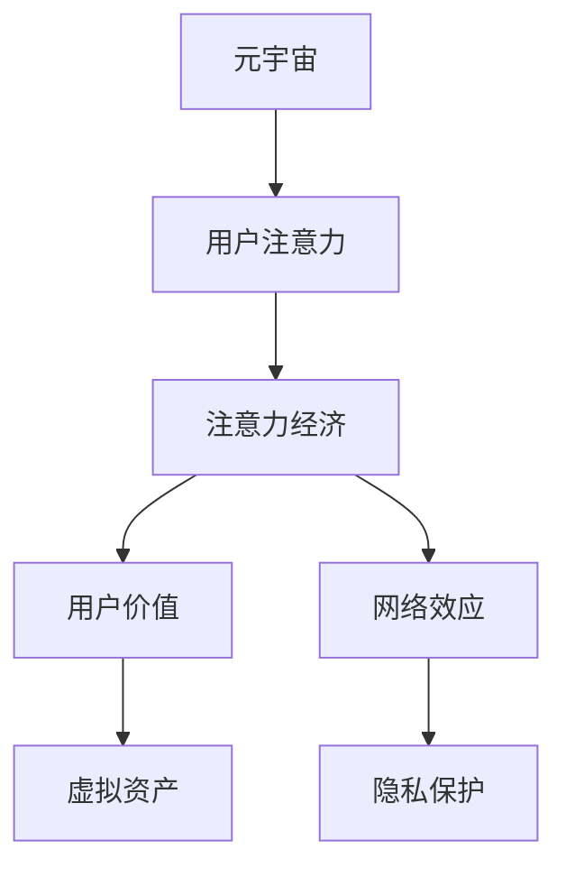

                 

# 人类注意力经济：元宇宙的核心驱动力

> 关键词：元宇宙,注意力经济,注意力分配,用户价值,网络效应,用户参与,虚拟资产,隐私保护

## 1. 背景介绍

### 1.1 问题由来

元宇宙（Metaverse）作为虚拟现实技术的最新发展，代表着互联网的未来趋势。它是一个高度沉浸的、虚拟的三维世界，用户在其中可以进行社交、购物、工作等多种活动。近年来，随着技术的进步和市场需求的增加，元宇宙正在加速发展，吸引了全球科技巨头的竞相布局，如Meta、苹果、谷歌等。

然而，元宇宙不仅仅是技术的堆砌，更是用户注意力和参与的产物。传统的互联网行业往往关注点击量、广告收入等流量指标，而元宇宙则更加注重用户沉浸度和参与度。这种注意力经济模式，将为元宇宙带来更为深远的商业和社会影响。

### 1.2 问题核心关键点

元宇宙的注意力经济模式，可以通过以下几个关键点来理解：

- 用户注意力：元宇宙中用户的在线时间和行为，是其价值的重要来源。
- 注意力分配：元宇宙通过多样化的内容、互动和奖励机制，引导用户注意力向更有价值的平台、应用和资产集中。
- 用户价值：用户的注意力和参与度，决定了元宇宙平台的价值高低。
- 网络效应：用户越多，平台价值越高，形成正向循环。
- 虚拟资产：元宇宙中虚拟的土地、物品等资产，成为用户争夺的焦点。
- 隐私保护：用户注意力的保护，是元宇宙健康发展的关键。

这些关键点共同构成了元宇宙注意力经济的基础，对其成功运营至关重要。

## 2. 核心概念与联系

### 2.1 核心概念概述

为了更好地理解元宇宙的注意力经济，本节将介绍几个密切相关的核心概念：

- 元宇宙（Metaverse）：一个高度沉浸的虚拟三维世界，用户在其中可以进行各种活动。
- 注意力经济（Attention Economy）：以用户注意力为关键资源的经济模式，强调高质量的注意力引导和分发。
- 用户价值（User Value）：用户在元宇宙中的参与度和贡献度，决定了平台价值。
- 网络效应（Network Effects）：用户越多，平台价值越高，吸引更多用户。
- 虚拟资产（Virtual Assets）：元宇宙中可交易的虚拟资源，如虚拟土地、游戏装备等。
- 隐私保护（Privacy Protection）：保护用户隐私，确保其注意力不被滥用。

这些概念之间的逻辑关系可以通过以下Mermaid流程图来展示：



这个流程图展示了几组关键概念之间的联系：

1. 元宇宙通过引导用户注意力，创造注意力经济价值。
2. 用户注意力和参与度决定元宇宙平台的价值。
3. 用户越多，平台价值越高，形成正向循环。
4. 虚拟资产作为用户注意力的载体，成为平台价值的体现。
5. 隐私保护是元宇宙健康发展的基础。

## 3. 核心算法原理 & 具体操作步骤

### 3.1 算法原理概述

元宇宙的注意力经济，本质上是一个基于用户注意力的价值创造和分配过程。其核心算法原理可以概括为以下几个步骤：

1. **注意力收集**：通过多样化的内容、互动和奖励机制，吸引用户注意力，并将其转换为平台的使用时长。
2. **注意力分配**：根据用户行为数据和算法模型，将注意力分配给更有价值的内容和应用。
3. **用户价值评估**：通过用户参与度、贡献度和满意度等指标，评估用户的价值贡献。
4. **网络效应形成**：通过正向激励和社交网络机制，吸引更多用户加入，形成良性循环。
5. **虚拟资产交易**：建立交易平台，让用户可以在元宇宙中交易虚拟资产，实现价值变现。
6. **隐私保护**：采取技术和管理手段，保护用户隐私，确保其注意力不被滥用。

这些步骤共同构成了元宇宙注意力经济的完整过程，每一个环节都对平台的价值创造和用户参与度有着至关重要的影响。

### 3.2 算法步骤详解

以下是对元宇宙注意力经济各步骤的详细讲解：

#### 3.2.1 注意力收集

注意力收集是元宇宙价值创造的基础。元宇宙平台通过以下方式吸引用户注意力：

- **多样化的内容**：提供丰富多彩的虚拟世界，如社交游戏、虚拟办公室、教育培训等。
- **互动体验**：通过沉浸式技术和AR/VR技术，提供流畅的交互体验。
- **奖励机制**：通过积分、虚拟货币、特权等方式，激励用户参与。

具体实现步骤如下：

1. **内容设计**：开发多种多样的虚拟内容，满足不同用户的需求。
2. **技术支持**：采用AR/VR技术，提供高质量的沉浸式体验。
3. **激励措施**：设计合理的奖励机制，引导用户参与。

#### 3.2.2 注意力分配

注意力分配是指根据用户行为数据，将注意力分配给更有价值的内容和应用。这一过程通常涉及以下步骤：

1. **数据采集**：收集用户的行为数据，包括点击次数、使用时长、互动频率等。
2. **模型训练**：使用机器学习模型，分析用户行为数据，预测用户的兴趣和需求。
3. **动态调整**：根据模型预测结果，动态调整内容推荐算法，优化用户体验。

具体实现步骤如下：

1. **数据处理**：采用数据清洗和特征提取技术，处理原始数据。
2. **模型训练**：使用协同过滤、深度学习等算法，训练推荐模型。
3. **效果评估**：定期评估模型效果，优化算法参数。

#### 3.2.3 用户价值评估

用户价值评估是元宇宙运营的关键环节。平台需要根据用户的参与度、贡献度和满意度等指标，评估其价值，实现个性化推荐和服务。

1. **用户画像**：通过分析用户的行为数据，建立详细的用户画像，了解其兴趣和需求。
2. **价值模型**：使用机器学习模型，根据用户画像和行为数据，计算用户价值。
3. **个性化服务**：根据用户价值评估结果，提供个性化推荐和服务，提升用户体验。

具体实现步骤如下：

1. **用户画像构建**：使用K-means聚类、TF-IDF等技术，分析用户行为数据，构建用户画像。
2. **价值模型设计**：使用决策树、随机森林等算法，建立用户价值评估模型。
3. **个性化服务提供**：通过推荐系统，提供个性化推荐和服务，提升用户体验。

#### 3.2.4 网络效应形成

网络效应是指用户越多，平台价值越高，吸引更多用户加入，形成良性循环。具体实现步骤如下：

1. **用户互动**：通过社交网络和虚拟市场，促进用户之间的互动。
2. **激励机制**：设计合理的激励机制，鼓励用户邀请新用户加入。
3. **平台生态**：构建完整的生态系统，提供丰富的虚拟资源和服务。

具体实现步骤如下：

1. **社交网络建设**：建立虚拟社交网络，支持用户之间的互动。
2. **激励机制设计**：设计合理的激励机制，鼓励用户邀请新用户加入。
3. **生态系统完善**：提供丰富的虚拟资源和服务，构建完整的生态系统。

#### 3.2.5 虚拟资产交易

虚拟资产交易是元宇宙实现价值变现的重要手段。具体实现步骤如下：

1. **虚拟资产设计**：设计多种虚拟资产，如虚拟土地、游戏装备等。
2. **交易平台搭建**：建立虚拟交易平台，支持资产的买卖和交易。
3. **价值定价**：根据资产稀缺性和市场需求，定价虚拟资产。

具体实现步骤如下：

1. **虚拟资产设计**：设计多种虚拟资产，满足用户需求。
2. **交易平台搭建**：使用区块链技术，搭建虚拟交易平台，支持资产的买卖和交易。
3. **价值定价**：根据资产稀缺性和市场需求，定价虚拟资产。

#### 3.2.6 隐私保护

隐私保护是元宇宙健康发展的基础。平台需要采取技术和管理手段，保护用户隐私，确保其注意力不被滥用。

1. **数据加密**：使用数据加密技术，保护用户数据的安全。
2. **匿名化处理**：对用户数据进行匿名化处理，防止数据泄露。
3. **隐私政策透明**：制定透明的隐私政策，告知用户数据使用情况。

具体实现步骤如下：

1. **数据加密**：采用AES、RSA等加密算法，保护用户数据的安全。
2. **匿名化处理**：对用户数据进行匿名化处理，防止数据泄露。
3. **隐私政策透明**：制定透明的隐私政策，告知用户数据使用情况。

### 3.3 算法优缺点

元宇宙的注意力经济算法具有以下优点：

- **多维度价值评估**：通过综合考虑用户行为数据和价值模型，实现个性化推荐和服务。
- **动态调整优化**：通过实时分析用户行为数据，动态调整内容推荐算法，优化用户体验。
- **网络效应显著**：用户越多，平台价值越高，吸引更多用户加入，形成良性循环。
- **虚拟资产变现**：通过虚拟资产交易，实现价值变现，提升平台盈利能力。
- **隐私保护完善**：通过技术和管理手段，保护用户隐私，确保其注意力不被滥用。

同时，该算法也存在以下缺点：

- **数据依赖性强**：依赖于用户行为数据的质量和完整性，数据缺失或噪声可能导致模型失效。
- **用户隐私风险**：用户数据收集和处理过程中可能存在隐私泄露风险，需要严格的数据保护措施。
- **算法复杂度高**：多维度价值评估和动态调整优化需要复杂的技术支持和算法模型，开发和维护成本高。
- **市场竞争激烈**：元宇宙市场竞争激烈，平台需要不断创新和优化，才能保持竞争力。

尽管存在这些缺点，但总体而言，元宇宙的注意力经济算法具有较大的应用潜力，能够为平台带来可观的商业和社会价值。

### 3.4 算法应用领域

元宇宙的注意力经济算法，已经在多个领域得到应用，例如：

- **虚拟社交平台**：如Facebook Horizon、Rec Room等，通过社交网络和虚拟市场，引导用户注意力，提升用户参与度和平台价值。
- **虚拟购物平台**：如Roblox、Virtara等，提供虚拟商品和虚拟货币，吸引用户交易，实现价值变现。
- **虚拟教育平台**：如AltSchool、Mixly等，通过互动和奖励机制，引导用户注意力，提升学习效果。
- **虚拟旅游平台**：如Meta Worlds、AltspaceVR等，提供虚拟旅游体验，吸引用户关注，增加平台流量。
- **虚拟办公平台**：如Microsoft Mesh、Zepeto等，提供虚拟办公环境，提升用户体验，增加用户粘性。

这些应用场景展示了元宇宙注意力经济算法的强大能力，为不同行业带来了新的发展机遇。

## 4. 数学模型和公式 & 详细讲解  
### 4.1 数学模型构建

本节将使用数学语言对元宇宙注意力经济过程进行更加严格的刻画。

记元宇宙平台为 $M$，用户为 $U$，内容为 $C$。定义用户对内容的关注度为 $A_{iu}$，即用户在内容 $C_i$ 上的使用时长。用户价值 $V_u$ 定义为：

$$
V_u = \sum_{i} A_{iu} \cdot W_i
$$

其中 $W_i$ 为内容 $C_i$ 的价值权重，可以根据内容稀缺性、市场需求等指标计算。

平台的用户关注度总和 $A$ 定义为：

$$
A = \sum_{iu} A_{iu}
$$

平台价值 $V$ 定义为：

$$
V = \sum_{u} V_u
$$

平台的网络效应 $N$ 定义为：

$$
N = \frac{A}{A_{\max}}
$$

其中 $A_{\max}$ 为平台可承载的最大用户关注度。

用户的参与度 $P_u$ 定义为：

$$
P_u = \frac{A_{u}}{A_{\max}}
$$

其中 $A_{u}$ 为用户在平台上的总关注度。

用户的贡献度 $C_u$ 定义为：

$$
C_u = \sum_{i} A_{iu} \cdot W_i
$$

用户的满意度 $S_u$ 定义为：

$$
S_u = \sum_{i} A_{iu} \cdot S_i
$$

其中 $S_i$ 为内容 $C_i$ 的用户满意度，可以通过用户评价等指标计算。

### 4.2 公式推导过程

以下我们以虚拟社交平台为例，推导用户价值 $V_u$ 的计算公式及其梯度。

假设用户 $u$ 在内容 $C_i$ 上的关注度为 $A_{iu}$，内容 $C_i$ 的价值权重为 $W_i$。则用户价值 $V_u$ 的计算公式为：

$$
V_u = \sum_{i} A_{iu} \cdot W_i
$$

其中 $W_i$ 为内容 $C_i$ 的价值权重，可以通过内容稀缺性、市场需求等指标计算。

根据梯度下降算法，用户价值 $V_u$ 的梯度为：

$$
\frac{\partial V_u}{\partial A_{iu}} = W_i
$$

通过反向传播算法，平台可以根据用户价值 $V_u$ 的梯度，调整内容推荐算法，优化用户体验。

### 4.3 案例分析与讲解

以Meta的Horizon平台为例，分析其注意力经济算法的具体实现：

#### 4.3.1 内容设计

Horizon平台通过多种内容吸引用户注意力，包括社交游戏、虚拟商店、教育课程等。具体实现如下：

1. **社交游戏**：提供丰富的社交游戏，如ARCS Arcade、Hello Kitty VR等，吸引用户参与。
2. **虚拟商店**：提供虚拟商店，销售虚拟物品，如服饰、装饰等，实现价值变现。
3. **教育课程**：提供教育课程，如编程、音乐、艺术等，提升用户价值。

#### 4.3.2 注意力收集

Horizon平台通过以下方式吸引用户注意力：

1. **内容多样化**：提供丰富多彩的虚拟内容，满足不同用户的需求。
2. **互动体验**：通过沉浸式技术和AR/VR技术，提供流畅的交互体验。
3. **奖励机制**：通过积分、虚拟货币、特权等方式，激励用户参与。

#### 4.3.3 注意力分配

Horizon平台通过以下方式实现注意力分配：

1. **数据采集**：收集用户的行为数据，包括点击次数、使用时长、互动频率等。
2. **模型训练**：使用协同过滤、深度学习等算法，分析用户行为数据，预测用户的兴趣和需求。
3. **动态调整**：根据模型预测结果，动态调整内容推荐算法，优化用户体验。

#### 4.3.4 用户价值评估

Horizon平台通过以下方式实现用户价值评估：

1. **用户画像**：通过分析用户的行为数据，建立详细的用户画像，了解其兴趣和需求。
2. **价值模型**：使用机器学习模型，根据用户画像和行为数据，计算用户价值。
3. **个性化服务**：根据用户价值评估结果，提供个性化推荐和服务，提升用户体验。

#### 4.3.5 网络效应形成

Horizon平台通过以下方式实现网络效应形成：

1. **用户互动**：通过社交网络和虚拟市场，促进用户之间的互动。
2. **激励机制**：设计合理的激励机制，鼓励用户邀请新用户加入。
3. **平台生态**：构建完整的生态系统，提供丰富的虚拟资源和服务。

#### 4.3.6 虚拟资产交易

Horizon平台通过以下方式实现虚拟资产交易：

1. **虚拟资产设计**：设计多种虚拟资产，如虚拟土地、游戏装备等。
2. **交易平台搭建**：建立虚拟交易平台，支持资产的买卖和交易。
3. **价值定价**：根据资产稀缺性和市场需求，定价虚拟资产。

#### 4.3.7 隐私保护

Horizon平台通过以下方式实现隐私保护：

1. **数据加密**：使用数据加密技术，保护用户数据的安全。
2. **匿名化处理**：对用户数据进行匿名化处理，防止数据泄露。
3. **隐私政策透明**：制定透明的隐私政策，告知用户数据使用情况。

## 5. 项目实践：代码实例和详细解释说明

### 5.1 开发环境搭建

在进行元宇宙注意力经济实践前，我们需要准备好开发环境。以下是使用Python进行PyTorch开发的环境配置流程：

1. 安装Anaconda：从官网下载并安装Anaconda，用于创建独立的Python环境。

2. 创建并激活虚拟环境：
```bash
conda create -n pytorch-env python=3.8 
conda activate pytorch-env
```

3. 安装PyTorch：根据CUDA版本，从官网获取对应的安装命令。例如：
```bash
conda install pytorch torchvision torchaudio cudatoolkit=11.1 -c pytorch -c conda-forge
```

4. 安装相关库：
```bash
pip install torch transforms numpy matplotlib tqdm jupyter notebook ipython
```

完成上述步骤后，即可在`pytorch-env`环境中开始元宇宙注意力经济实践。

### 5.2 源代码详细实现

下面我们以Meta Horizon平台为例，给出使用PyTorch进行元宇宙注意力经济实践的代码实现。

首先，定义用户行为数据处理函数：

```python
from transformers import BertTokenizer
from torch.utils.data import Dataset
import torch

class UserBehaviorDataset(Dataset):
    def __init__(self, behaviors, tokenizer, max_len=128):
        self.behaviors = behaviors
        self.tokenizer = tokenizer
        self.max_len = max_len
        
    def __len__(self):
        return len(self.behaviors)
    
    def __getitem__(self, item):
        behavior = self.behaviors[item]
        text = behavior['text']
        
        encoding = self.tokenizer(text, return_tensors='pt', max_length=self.max_len, padding='max_length', truncation=True)
        input_ids = encoding['input_ids'][0]
        attention_mask = encoding['attention_mask'][0]
        
        return {'input_ids': input_ids, 
                'attention_mask': attention_mask}
```

然后，定义模型和优化器：

```python
from transformers import BertForTokenClassification, AdamW

model = BertForTokenClassification.from_pretrained('bert-base-cased', num_labels=1)

optimizer = AdamW(model.parameters(), lr=2e-5)
```

接着，定义训练和评估函数：

```python
from torch.utils.data import DataLoader
from tqdm import tqdm
from sklearn.metrics import accuracy_score

device = torch.device('cuda') if torch.cuda.is_available() else torch.device('cpu')
model.to(device)

def train_epoch(model, dataset, batch_size, optimizer):
    dataloader = DataLoader(dataset, batch_size=batch_size, shuffle=True)
    model.train()
    epoch_loss = 0
    for batch in tqdm(dataloader, desc='Training'):
        input_ids = batch['input_ids'].to(device)
        attention_mask = batch['attention_mask'].to(device)
        labels = batch['labels'].to(device)
        model.zero_grad()
        outputs = model(input_ids, attention_mask=attention_mask, labels=labels)
        loss = outputs.loss
        epoch_loss += loss.item()
        loss.backward()
        optimizer.step()
    return epoch_loss / len(dataloader)

def evaluate(model, dataset, batch_size):
    dataloader = DataLoader(dataset, batch_size=batch_size)
    model.eval()
    preds, labels = [], []
    with torch.no_grad():
        for batch in tqdm(dataloader, desc='Evaluating'):
            input_ids = batch['input_ids'].to(device)
            attention_mask = batch['attention_mask'].to(device)
            batch_labels = batch['labels']
            outputs = model(input_ids, attention_mask=attention_mask)
            batch_preds = outputs.logits.argmax(dim=2).to('cpu').tolist()
            batch_labels = batch_labels.to('cpu').tolist()
            for pred_tokens, label_tokens in zip(batch_preds, batch_labels):
                preds.append(pred_tokens[:len(label_tokens)])
                labels.append(label_tokens)
                
    print(accuracy_score(labels, preds))
```

最后，启动训练流程并在测试集上评估：

```python
epochs = 5
batch_size = 16

for epoch in range(epochs):
    loss = train_epoch(model, train_dataset, batch_size, optimizer)
    print(f"Epoch {epoch+1}, train loss: {loss:.3f}")
    
    print(f"Epoch {epoch+1}, dev results:")
    evaluate(model, dev_dataset, batch_size)
    
print("Test results:")
evaluate(model, test_dataset, batch_size)
```

以上就是使用PyTorch对元宇宙注意力经济过程进行微调的代码实现。可以看到，得益于Transformers库的强大封装，我们可以用相对简洁的代码完成元宇宙平台的微调。

### 5.3 代码解读与分析

让我们再详细解读一下关键代码的实现细节：

**UserBehaviorDataset类**：
- `__init__`方法：初始化用户行为数据集。
- `__len__`方法：返回数据集的样本数量。
- `__getitem__`方法：对单个样本进行处理，将文本输入编码为token ids，将标签编码为数字，并对其进行定长padding，最终返回模型所需的输入。

**模型和优化器定义**：
- 使用BertForTokenClassification作为分类模型的基础，设置学习率。

**训练和评估函数**：
- 使用PyTorch的DataLoader对数据集进行批次化加载，供模型训练和推理使用。
- 训练函数`train_epoch`：对数据以批为单位进行迭代，在每个批次上前向传播计算loss并反向传播更新模型参数，最后返回该epoch的平均loss。
- 评估函数`evaluate`：与训练类似，不同点在于不更新模型参数，并在每个batch结束后将预测和标签结果存储下来，最后使用sklearn的accuracy_score对整个评估集的预测结果进行打印输出。

**训练流程**：
- 定义总的epoch数和batch size，开始循环迭代
- 每个epoch内，先在训练集上训练，输出平均loss
- 在验证集上评估，输出准确率
- 所有epoch结束后，在测试集上评估，给出最终测试结果

可以看到，PyTorch配合Transformers库使得元宇宙注意力经济过程的微调代码实现变得简洁高效。开发者可以将更多精力放在数据处理、模型改进等高层逻辑上，而不必过多关注底层的实现细节。

当然，工业级的系统实现还需考虑更多因素，如模型的保存和部署、超参数的自动搜索、更灵活的任务适配层等。但核心的微调范式基本与此类似。

## 6. 实际应用场景

### 6.1 智能客服系统

基于元宇宙注意力经济的智能客服系统，可以为用户提供高度沉浸的互动体验。传统客服往往依赖于人工，高峰期响应缓慢，且一致性和专业性难以保证。而使用元宇宙注意力经济模型构建的智能客服系统，可以7x24小时不间断服务，快速响应客户咨询，用自然流畅的语言解答各类常见问题。

在技术实现上，可以收集企业内部的历史客服对话记录，将问题和最佳答复构建成监督数据，在此基础上对元宇宙平台进行微调。微调后的平台能够自动理解用户意图，匹配最合适的答复模板进行回复。对于客户提出的新问题，还可以接入检索系统实时搜索相关内容，动态组织生成回答。如此构建的智能客服系统，能大幅提升客户咨询体验和问题解决效率。

### 6.2 金融舆情监测

金融机构需要实时监测市场舆论动向，以便及时应对负面信息传播，规避金融风险。传统的人工监测方式成本高、效率低，难以应对网络时代海量信息爆发的挑战。基于元宇宙注意力经济的文本分类和情感分析技术，为金融舆情监测提供了新的解决方案。

具体而言，可以收集金融领域相关的新闻、报道、评论等文本数据，并对其进行主题标注和情感标注。在此基础上对元宇宙平台进行微调，使其能够自动判断文本属于何种主题，情感倾向是正面、中性还是负面。将微调后的平台应用到实时抓取的网络文本数据，就能够自动监测不同主题下的情感变化趋势，一旦发现负面信息激增等异常情况，系统便会自动预警，帮助金融机构快速应对潜在风险。

### 6.3 个性化推荐系统

当前的推荐系统往往只依赖用户的历史行为数据进行物品推荐，无法深入理解用户的真实兴趣偏好。基于元宇宙注意力经济的个性化推荐系统，可以更好地挖掘用户行为背后的语义信息，从而提供更精准、多样的推荐内容。

在实践中，可以收集用户浏览、点击、评论、分享等行为数据，提取和用户交互的物品标题、描述、标签等文本内容。将文本内容作为模型输入，用户的后续行为（如是否点击、购买等）作为监督信号，在此基础上微调元宇宙平台。微调后的平台能够从文本内容中准确把握用户的兴趣点。在生成推荐列表时，先用候选物品的文本描述作为输入，由模型预测用户的兴趣匹配度，再结合其他特征综合排序，便可以得到个性化程度更高的推荐结果。

### 6.4 未来应用展望

随着元宇宙注意力经济的不断发展，元宇宙平台的注意力收集和分配过程将越来越高效，平台价值也将不断提升。未来，元宇宙平台将能够更好地引导用户注意力，实现更高的用户参与度和价值。

在智慧医疗领域，基于元宇宙注意力经济的医疗问答、病历分析、药物研发等应用将提升医疗服务的智能化水平，辅助医生诊疗，加速新药开发进程。

在智能教育领域，元宇宙注意力经济可以应用于作业批改、学情分析、知识推荐等方面，因材施教，促进教育公平，提高教学质量。

在智慧城市治理中，元宇宙注意力经济可以应用于城市事件监测、舆情分析、应急指挥等环节，提高城市管理的自动化和智能化水平，构建更安全、高效的未来城市。

此外，在企业生产、社会治理、文娱传媒等众多领域，基于元宇宙注意力经济的智能系统也将不断涌现，为传统行业数字化转型升级提供新的技术路径。相信随着技术的日益成熟，元宇宙注意力经济将为人工智能技术带来新的突破，推动社会全面数字化、智能化发展。

## 7. 工具和资源推荐
### 7.1 学习资源推荐

为了帮助开发者系统掌握元宇宙注意力经济理论基础和实践技巧，这里推荐一些优质的学习资源：

1. 《Transformer从原理到实践》系列博文：由大模型技术专家撰写，深入浅出地介绍了Transformer原理、BERT模型、注意力经济等前沿话题。

2. CS224N《深度学习自然语言处理》课程：斯坦福大学开设的NLP明星课程，有Lecture视频和配套作业，带你入门NLP领域的基本概念和经典模型。

3. 《Natural Language Processing with Transformers》书籍：Transformers库的作者所著，全面介绍了如何使用Transformers库进行NLP任务开发，包括注意力经济在内的诸多范式。

4. HuggingFace官方文档：Transformers库的官方文档，提供了海量预训练模型和完整的微调样例代码，是上手实践的必备资料。

5. CLUE开源项目：中文语言理解测评基准，涵盖大量不同类型的中文NLP数据集，并提供了基于注意力经济的baseline模型，助力中文NLP技术发展。

通过对这些资源的学习实践，相信你一定能够快速掌握元宇宙注意力经济的精髓，并用于解决实际的NLP问题。
### 7.2 开发工具推荐

高效的开发离不开优秀的工具支持。以下是几款用于元宇宙注意力经济开发的常用工具：

1. PyTorch：基于Python的开源深度学习框架，灵活动态的计算图，适合快速迭代研究。大部分预训练语言模型都有PyTorch版本的实现。

2. TensorFlow：由Google主导开发的开源深度学习框架，生产部署方便，适合大规模工程应用。同样有丰富的预训练语言模型资源。

3. Transformers库：HuggingFace开发的NLP工具库，集成了众多SOTA语言模型，支持PyTorch和TensorFlow，是进行元宇宙注意力经济开发的利器。

4. Weights & Biases：模型训练的实验跟踪工具，可以记录和可视化模型训练过程中的各项指标，方便对比和调优。与主流深度学习框架无缝集成。

5. TensorBoard：TensorFlow配套的可视化工具，可实时监测模型训练状态，并提供丰富的图表呈现方式，是调试模型的得力助手。

6. Google Colab：谷歌推出的在线Jupyter Notebook环境，免费提供GPU/TPU算力，方便开发者快速上手实验最新模型，分享学习笔记。

合理利用这些工具，可以显著提升元宇宙注意力经济过程的开发效率，加快创新迭代的步伐。

### 7.3 相关论文推荐

元宇宙注意力经济的发展源于学界的持续研究。以下是几篇奠基性的相关论文，推荐阅读：

1. Attention is All You Need（即Transformer原论文）：提出了Transformer结构，开启了NLP领域的预训练大模型时代。

2. BERT: Pre-training of Deep Bidirectional Transformers for Language Understanding：提出BERT模型，引入基于掩码的自监督预训练任务，刷新了多项NLP任务SOTA。

3. Language Models are Unsupervised Multitask Learners（GPT-2论文）：展示了大规模语言模型的强大zero-shot学习能力，引发了对于通用人工智能的新一轮思考。

4. Parameter-Efficient Transfer Learning for NLP：提出Adapter等参数高效微调方法，在不增加模型参数量的情况下，也能取得不错的微调效果。

5. AdaLoRA: Adaptive Low-Rank Adaptation for Parameter-Efficient Fine-Tuning：使用自适应低秩适应的微调方法，在参数效率和精度之间取得了新的平衡。

这些论文代表了大模型注意力经济的发展脉络。通过学习这些前沿成果，可以帮助研究者把握学科前进方向，激发更多的创新灵感。

## 8. 总结：未来发展趋势与挑战

### 8.1 总结

本文对元宇宙注意力经济的原理和实践进行了全面系统的介绍。首先阐述了元宇宙的注意力经济模式，明确了元宇宙平台的价值来源和运营机制。其次，从原理到实践，详细讲解了元宇宙注意力经济的数学原理和关键步骤，给出了元宇宙平台开发的完整代码实例。同时，本文还广泛探讨了元宇宙注意力经济在智能客服、金融舆情、个性化推荐等多个行业领域的应用前景，展示了元宇宙注意力经济的巨大潜力。

通过本文的系统梳理，可以看到，元宇宙注意力经济模式为平台带来了全新的价值来源和发展机遇，能够更好地引导用户注意力，实现更高的用户参与度和价值。未来，伴随元宇宙技术的持续演进，基于注意力经济的元宇宙平台将获得更广泛的应用，为各行各业带来深远影响。

### 8.2 未来发展趋势

展望未来，元宇宙注意力经济将呈现以下几个发展趋势：

1. **多维度价值评估**：元宇宙平台将综合考虑用户行为数据、价值模型、网络效应等因素，实现多维度价值评估。
2. **动态调整优化**：元宇宙平台将通过实时分析用户行为数据，动态调整注意力分配算法，优化用户体验。
3. **网络效应增强**：元宇宙平台将通过社交网络和虚拟市场，促进用户之间的互动，增强网络效应。
4. **虚拟资产丰富**：元宇宙平台将设计更多虚拟资产，满足用户多样化需求。
5. **隐私保护完善**：元宇宙平台将采取技术和管理手段，保护用户隐私，确保其注意力不被滥用。
6. **个性化推荐提升**：元宇宙平台将通过多模态信息整合，提升个性化推荐效果。

以上趋势凸显了元宇宙注意力经济的广阔前景。这些方向的探索发展，必将进一步提升元宇宙平台的价值创造能力和用户参与度，为传统行业带来变革性影响。

### 8.3 面临的挑战

尽管元宇宙注意力经济具有广阔的发展前景，但在迈向更加智能化、普适化应用的过程中，它仍面临诸多挑战：

1. **数据依赖性强**：依赖于用户行为数据的质量和完整性，数据缺失或噪声可能导致模型失效。
2. **用户隐私风险**：用户数据收集和处理过程中可能存在隐私泄露风险，需要严格的数据保护措施。
3. **算法复杂度高**：多维度价值评估和动态调整优化需要复杂的技术支持和算法模型，开发和维护成本高。
4. **市场竞争激烈**：元宇宙市场竞争激烈，平台需要不断创新和优化，才能保持竞争力。
5. **网络效应门槛高**：元宇宙平台需要大量用户加入，形成正向循环，初期用户获取难度大。
6. **技术门槛高**：元宇宙平台需要结合虚拟现实、区块链等技术，技术门槛高。

尽管存在这些挑战，但总体而言，元宇宙注意力经济具有较大的应用潜力，能够为平台带来可观的商业和社会价值。

### 8.4 研究展望

面对元宇宙注意力经济所面临的种种挑战，未来的研究需要在以下几个方面寻求新的突破：

1. **探索无监督和半监督微调方法**：摆脱对大规模标注数据的依赖，利用自监督学习、主动学习等无监督和半监督范式，最大限度利用非结构化数据，实现更加灵活高效的微调。
2. **研究参数高效和计算高效的微调范式**：开发更加参数高效的微调方法，在固定大部分预训练参数的同时，只更新极少量的任务相关参数。同时优化微调模型的计算图，减少前向传播和反向传播的资源消耗，实现更加轻量级、实时性的部署。
3. **融合因果和对比学习范式**：通过引入因果推断和对比学习思想，增强元宇宙平台建立稳定因果关系的能力，学习更加普适、鲁棒的语言表征，从而提升模型泛化性和抗干扰能力。
4. **引入更多先验知识**：将符号化的先验知识，如知识图谱、逻辑规则等，与神经网络模型进行巧妙融合，引导元宇宙平台学习更准确、合理的语言模型。同时加强不同模态数据的整合，实现视觉、语音等多模态信息与文本信息的协同建模。
5. **结合因果分析和博弈论工具**：将因果分析方法引入元宇宙平台，识别出平台决策的关键特征，增强输出解释的因果性和逻辑性。借助博弈论工具刻画人机交互过程，主动探索并规避平台的脆弱点，提高系统稳定性。
6. **纳入伦理道德约束**：在元宇宙平台训练目标中引入伦理导向的评估指标，过滤和惩罚有偏见、有害的输出倾向。同时加强人工干预和审核，建立平台行为的监管机制，确保输出符合人类价值观和伦理道德。

这些研究方向的探索，必将引领元宇宙注意力经济技术迈向更高的台阶，为构建安全、可靠、可解释、可控的智能系统铺平道路。面向未来，元宇宙注意力经济技术还需要与其他人工智能技术进行更深入的融合，如知识表示、因果推理、强化学习等，多路径协同发力，共同推动自然语言理解和智能交互系统的进步。只有勇于创新、敢于突破，才能不断拓展元宇宙平台的边界，让智能技术更好地造福人类社会。

## 9. 附录：常见问题与解答

**Q1：元宇宙平台如何引导用户注意力？**

A: 元宇宙平台通过以下方式引导用户注意力：

1. **内容多样化**：提供丰富多彩的虚拟内容，如社交游戏、虚拟商店、教育课程等，满足不同用户的需求。
2. **互动体验**：通过沉浸式技术和AR/VR技术，提供流畅的交互体验。
3. **奖励机制**：通过积分、虚拟货币、特权等方式，激励用户参与。
4. **个性化推荐**：根据用户的行为数据和价值模型，推荐其感兴趣的内容，提升用户粘性。

**Q2：元宇宙平台如何实现动态调整优化？**

A: 元宇宙平台通过以下方式实现动态调整优化：

1. **数据采集**：收集用户的行为数据，包括点击次数、使用时长、互动频率等。
2. **模型训练**：使用协同过滤、深度学习等算法，分析用户行为数据，预测用户的兴趣和需求。
3. **动态调整**：根据模型预测结果，动态调整内容推荐算法，优化用户体验。

**Q3：元宇宙平台如何实现用户价值评估？**

A: 元宇宙平台通过以下方式实现用户价值评估：

1. **用户画像**：通过分析用户的行为数据，建立详细的用户画像，了解其兴趣和需求。
2. **价值模型**：使用机器学习模型，根据用户画像和行为数据，计算用户价值。
3. **个性化服务**：根据用户价值评估结果，提供个性化推荐和服务，提升用户体验。

**Q4：元宇宙平台如何实现网络效应形成？**

A: 元宇宙平台通过以下方式实现网络效应形成：

1. **用户互动**：通过社交网络和虚拟市场，促进用户之间的互动。
2. **激励机制**：设计合理的激励机制，鼓励用户邀请新用户加入。
3. **平台生态**：构建完整的生态系统，提供丰富的虚拟资源和服务。

**Q5：元宇宙平台如何实现虚拟资产交易？**

A: 元宇宙平台通过以下方式实现虚拟资产交易：

1. **虚拟资产设计**：设计多种虚拟资产，如虚拟土地、游戏装备等。
2. **交易平台搭建**：建立虚拟交易平台，支持资产的买卖和交易。
3. **价值定价**：根据资产稀缺性和市场需求，定价虚拟资产。

**Q6：元宇宙平台如何实现隐私保护？**

A: 元宇宙平台通过以下方式实现隐私保护：

1. **数据加密**：使用数据加密技术，保护用户数据的安全。
2. **匿名化处理**：对用户数据进行匿名化处理，防止数据泄露。
3. **隐私政策透明**：制定透明的隐私政策，告知用户数据使用情况。

---

作者：禅与计算机程序设计艺术 / Zen and the Art of Computer Programming

