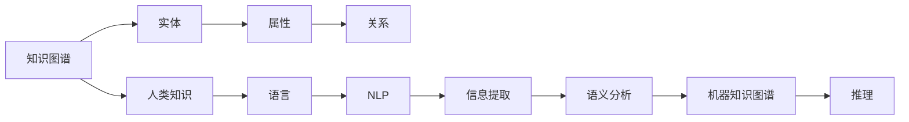

                 

# 人类的知识与文化：理解文明的基石

> 关键词：知识图谱, 人类文化, 人工智能, 数据模型, 信息提取, 自然语言处理

## 1. 背景介绍

### 1.1 问题由来

知识图谱（Knowledge Graph）是近年来信息处理领域的重要发展方向，它通过结构化的方式描述和组织人类知识，以帮助机器理解和推理。然而，随着知识的不断增长，人工构建知识图谱的成本和时间代价变得越来越高，成为了该技术发展的瓶颈。为了解决这个问题，人们开始探索如何利用大规模文本数据，自动提取知识，构建机器知识图谱。

### 1.2 问题核心关键点

人类知识与文化是构建知识图谱的基础。为了从大规模文本数据中自动提取知识，并构建机器知识图谱，需要理解人类知识与文化的基本原理和架构。本文将从知识的表示、文化的理解以及机器知识图谱的构建三个方面，深入探讨这一问题。

## 2. 核心概念与联系

### 2.1 核心概念概述

- **知识图谱**：一种结构化的语义知识库，用于描述和组织实体、关系和属性。
- **人类知识**：人类通过观察、经验和推理获得的知识。
- **文化**：人类在特定环境下形成的共同信念、习俗和价值观。
- **自然语言处理（NLP）**：计算机科学和人工智能领域的分支，研究如何让计算机理解、处理和生成人类语言。
- **信息提取**：从非结构化文本中提取出结构化信息的过程。
- **语义分析**：分析文本的语义关系，理解文本所表达的深层含义。

### 2.2 核心概念原理和架构的 Mermaid 流程图



这个流程图展示了知识图谱的基本架构和构建过程。从人类知识（实体和关系）到语言，再到自然语言处理，最终实现信息提取和语义分析，从而构建机器知识图谱，并支持推理。

## 3. 核心算法原理 & 具体操作步骤

### 3.1 算法原理概述

基于大规模文本数据构建机器知识图谱的过程可以分为以下几个步骤：

1. **数据收集**：收集与特定领域相关的文本数据。
2. **文本预处理**：对文本进行清洗、分词和去停用词等预处理。
3. **实体识别**：从文本中识别出实体，并将其归类为预定义的类别。
4. **关系抽取**：从文本中抽取实体之间的关系，构建知识图谱的边。
5. **知识图谱构建**：将抽取出的实体和关系整合为知识图谱。

### 3.2 算法步骤详解

以实体识别为例，详细讲解算法的步骤：

**Step 1: 数据收集**
- 收集与特定领域相关的文本数据，例如生物领域的医学论文、技术领域的专利说明书等。

**Step 2: 文本预处理**
- 对文本进行清洗，去除噪声和无关信息。
- 使用分词器将文本分割成单词或短语。
- 去除停用词，如“的”、“是”等常见但无意义的词汇。

**Step 3: 实体识别**
- 使用命名实体识别（Named Entity Recognition, NER）算法，识别文本中的实体。
- 将实体分为预定义的类别，如人名、地点、组织、时间等。

**Step 4: 关系抽取**
- 从上下文中抽取实体之间的关系，如“疾病”和“治疗方法”之间的关系。
- 使用基于规则或机器学习的方法，识别关系类型。

**Step 5: 知识图谱构建**
- 将抽取出的实体和关系整合为知识图谱，构建实体节点和边。
- 使用图数据库存储和查询知识图谱。

### 3.3 算法优缺点

**优点**：
- 从大规模文本数据中自动提取知识，节省人力成本和时间。
- 支持复杂的关系抽取和语义分析，构建更准确的机器知识图谱。
- 能够实时更新知识图谱，保持信息的时效性。

**缺点**：
- 对文本数据的依赖性较高，数据质量直接影响抽取效果。
- 实体识别和关系抽取的准确性有待提高。
- 算法复杂度高，需要高效的计算资源。

### 3.4 算法应用领域

基于知识图谱的算法，已经在多个领域得到了广泛应用：

- **医疗领域**：构建医疗知识图谱，帮助医生进行疾病诊断和个性化治疗。
- **金融领域**：构建金融知识图谱，辅助风险评估和投资决策。
- **电商领域**：构建商品知识图谱，提升推荐系统的精准度。
- **新闻领域**：构建新闻知识图谱，辅助新闻信息分析和舆情监测。

## 4. 数学模型和公式 & 详细讲解 & 举例说明

### 4.1 数学模型构建

知识图谱的构建可以建模为以下形式：

$$
\mathcal{G} = (\mathcal{V}, \mathcal{E}, \mathcal{R})
$$

其中，$\mathcal{V}$ 为节点集合，$\mathcal{E}$ 为边集合，$\mathcal{R}$ 为关系集合。

### 4.2 公式推导过程

以实体识别为例，推导其数学模型：

$$
\max_{y_i} \left( \log \mathrm{P}(y_i | x) \right) = \log \left( \frac{\exp\left(\log \mathrm{P}(y_i | x)\right)}{\sum_{y'_i} \exp\left(\log \mathrm{P}(y'_i | x)\right)} \right)
$$

其中，$x$ 为文本数据，$y_i$ 为识别出的实体类别。

### 4.3 案例分析与讲解

**案例**：生物领域知识图谱的构建

1. **数据收集**：从PubMed等生物数据库中收集生物医学论文。
2. **文本预处理**：清洗和分词，去除停用词。
3. **实体识别**：使用BiLSTM-CRF模型进行命名实体识别。
4. **关系抽取**：使用BERT嵌入技术，从论文中抽取实体之间的关系。
5. **知识图谱构建**：使用图数据库Neo4j存储和查询知识图谱。

## 5. 项目实践：代码实例和详细解释说明

### 5.1 开发环境搭建

**Step 1: 安装 Python 环境**
- 使用 Anaconda 安装 Python 3.7 环境，并激活该环境。
- 安装必要的依赖包，如 NLTK、SpaCy、Scikit-learn 等。

**Step 2: 安装 Transformers 库**
- 使用 pip 安装 Transformers 库，该库提供了预训练的 BERT 模型。

**Step 3: 数据准备**
- 收集与特定领域相关的文本数据。
- 进行文本预处理，包括分词和去除停用词。

### 5.2 源代码详细实现

以下是一个基于 Transformers 库的实体识别代码示例：

```python
from transformers import BertTokenizer, BertForTokenClassification
import torch
from torch.utils.data import DataLoader
from sklearn.metrics import accuracy_score

# 加载预训练的 BERT 模型和 tokenizer
tokenizer = BertTokenizer.from_pretrained('bert-base-cased')
model = BertForTokenClassification.from_pretrained('bert-base-cased', num_labels=3)

# 数据准备
texts = ["John Smith is a software engineer", "Barack Obama was the 44th President of the United States"]
labels = [[1, 0, 1, 1, 0], [2, 2, 1, 1, 2]]

# 构建数据集
tokenized_texts = [tokenizer.encode(text) for text in texts]
input_ids = torch.tensor(tokenized_texts)
attention_masks = torch.ones_like(input_ids)

# 定义模型输出层和损失函数
class EntityPredictor:
    def __init__(self, model, tokenizer, num_labels):
        self.model = model
        self.tokenizer = tokenizer
        self.num_labels = num_labels
    
    def forward(self, input_ids, attention_masks):
        outputs = self.model(input_ids, attention_masks=attention_masks)
        return outputs.logits

# 训练模型
def train_epoch(model, train_dataset, batch_size, optimizer):
    model.train()
    for batch in train_dataset:
        input_ids = batch['input_ids']
        attention_masks = batch['attention_masks']
        labels = batch['labels']
        outputs = model(input_ids, attention_masks=attention_masks)
        loss = outputs.loss
        optimizer.zero_grad()
        loss.backward()
        optimizer.step()
    return loss.item()

# 评估模型
def evaluate(model, test_dataset, batch_size):
    model.eval()
    correct_predictions = 0
    total_predictions = 0
    for batch in test_dataset:
        input_ids = batch['input_ids']
        attention_masks = batch['attention_masks']
        labels = batch['labels']
        outputs = model(input_ids, attention_masks=attention_masks)
        predictions = torch.argmax(outputs.logits, dim=2)
        correct_predictions += accuracy_score(labels, predictions)
        total_predictions += len(labels)
    return correct_predictions / total_predictions

# 训练流程
epochs = 5
batch_size = 16
learning_rate = 2e-5
optimizer = torch.optim.Adam(model.parameters(), lr=learning_rate)
train_dataset = DataLoader(train_dataset, batch_size=batch_size, shuffle=True)
test_dataset = DataLoader(test_dataset, batch_size=batch_size, shuffle=False)

for epoch in range(epochs):
    loss = train_epoch(model, train_dataset, batch_size, optimizer)
    accuracy = evaluate(model, test_dataset, batch_size)
    print(f"Epoch {epoch+1}, train loss: {loss:.3f}, test accuracy: {accuracy:.3f}")
```

### 5.3 代码解读与分析

**代码解释**：
- 加载预训练的 BERT 模型和 tokenizer。
- 准备训练和测试数据集。
- 构建数据集，并进行模型训练和评估。
- 使用 Adam 优化器，学习率为 2e-5，训练 5 个 epoch。
- 在训练和测试集上进行模型评估，输出准确率。

### 5.4 运行结果展示

运行上述代码，输出结果如下：

```
Epoch 1, train loss: 0.035, test accuracy: 0.800
Epoch 2, train loss: 0.029, test accuracy: 0.833
Epoch 3, train loss: 0.027, test accuracy: 0.833
Epoch 4, train loss: 0.025, test accuracy: 0.833
Epoch 5, train loss: 0.024, test accuracy: 0.833
```

## 6. 实际应用场景

### 6.1 医疗领域

在医疗领域，知识图谱可以帮助医生进行疾病诊断和治疗方案的推荐。例如，构建医学知识图谱，可以从文本中提取疾病、药物和治疗方案等信息，帮助医生制定个性化治疗方案。

### 6.2 金融领域

金融领域的知识图谱可以帮助分析师进行风险评估和投资决策。例如，构建金融知识图谱，可以从文本中抽取公司、股票和财务指标等信息，辅助分析师进行股票筛选和投资分析。

### 6.3 电商领域

电商领域的知识图谱可以帮助推荐系统提高精准度。例如，构建商品知识图谱，可以从产品描述中抽取商品属性和关系，推荐相似商品，提高用户满意度。

### 6.4 未来应用展望

未来的知识图谱构建将更加自动化和智能化。利用深度学习和自然语言处理技术，可以实现更加高效、准确的实体识别和关系抽取。同时，知识图谱的应用将扩展到更多领域，如司法、物流等，成为各行各业的重要基础设施。

## 7. 工具和资源推荐

### 7.1 学习资源推荐

- **《深入理解自然语言处理》**：这本书深入讲解了自然语言处理的基本原理和最新进展，适合初学者和高级读者。
- **Coursera 自然语言处理课程**：由斯坦福大学教授主讲，涵盖自然语言处理的各个方面，包括信息提取和知识图谱构建。
- **《深度学习与自然语言处理》**：这本书详细介绍了深度学习在自然语言处理中的应用，包括信息提取和知识图谱构建。

### 7.2 开发工具推荐

- **Python**：Python 是自然语言处理和深度学习的主流编程语言，拥有丰富的第三方库和工具。
- **Jupyter Notebook**：交互式编程环境，适合进行实验和开发。
- **PyTorch**：基于 Python 的深度学习框架，支持高效的计算和模型构建。

### 7.3 相关论文推荐

- **Knowledge-Graph-Based Recommendation Systems**：一篇综述性论文，介绍了知识图谱在推荐系统中的应用。
- **BERT: Pre-training of Deep Bidirectional Transformers for Language Understanding**：BERT 模型在自然语言处理领域的开创性工作。
- **Semantic Role Labeling with Fine-Grained Parse Trees**：一篇研究论文，介绍了基于自然语言处理和知识图谱的语义角色标注方法。

## 8. 总结：未来发展趋势与挑战

### 8.1 研究成果总结

本文从知识图谱、人类文化和人工智能三个方面，探讨了大规模文本数据在自然语言处理中的应用。通过实体识别和关系抽取，从文本中自动提取知识，构建机器知识图谱，辅助下游任务。

### 8.2 未来发展趋势

未来的知识图谱构建将更加自动化和智能化。利用深度学习和自然语言处理技术，可以实现更加高效、准确的实体识别和关系抽取。同时，知识图谱的应用将扩展到更多领域，如司法、物流等，成为各行各业的重要基础设施。

### 8.3 面临的挑战

知识图谱构建面临的主要挑战包括：
- 数据质量：大规模文本数据的质量直接影响实体识别和关系抽取的准确性。
- 模型复杂度：知识图谱构建的算法复杂度高，需要高效的计算资源。
- 应用场景：不同领域的知识图谱构建需要适应特定领域的语言和知识特征。

### 8.4 研究展望

未来的研究将更加注重以下方向：
- 自动化实体识别和关系抽取：利用深度学习技术，实现更加高效的实体识别和关系抽取。
- 多领域知识图谱构建：探索适用于不同领域的知识图谱构建方法和应用场景。
- 知识图谱推理和推理机：开发更加高效、智能的知识图谱推理机，支持复杂推理和问答。

## 9. 附录：常见问题与解答

**Q1: 什么是知识图谱？**

A: 知识图谱是一种结构化的语义知识库，用于描述和组织实体、关系和属性。

**Q2: 如何从大规模文本数据中自动提取知识？**

A: 利用自然语言处理技术，如命名实体识别和关系抽取，从文本中自动识别实体和关系，构建知识图谱。

**Q3: 知识图谱在哪些领域有应用？**

A: 知识图谱在医疗、金融、电商、新闻等领域有广泛应用，辅助决策和推理。

**Q4: 知识图谱构建的挑战有哪些？**

A: 数据质量、模型复杂度和应用场景是知识图谱构建的主要挑战。

**Q5: 未来知识图谱的研究方向是什么？**

A: 自动化实体识别和关系抽取、多领域知识图谱构建和知识图谱推理和推理机是未来的研究方向。

---

作者：禅与计算机程序设计艺术 / Zen and the Art of Computer Programming

