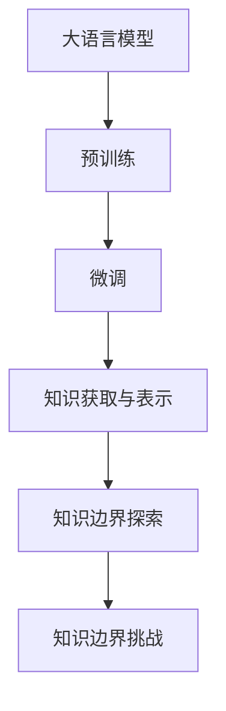

                 

# 人类的知识边界：无限的探索与追求

在人类文明的漫长历史中，知识的边界一直是人类不懈探索与追求的对象。从古希腊的哲学思辨，到文艺复兴的科学研究，再到现代信息技术带来的知识爆炸，人类对知识边界的探索从未停歇。特别是在人工智能(AI)时代，技术的飞速进步使得人类对知识的探索进入了一个全新的维度，也为知识的获取、存储、处理和应用开辟了前所未有的可能。

本文将深入探讨人工智能在探索人类知识边界方面的作用，重点讨论大语言模型(Large Language Models, LLMs)作为人类知识容器和工具的角色，并探讨其在知识获取、存储、处理和应用中的潜力与挑战。

## 1. 背景介绍

### 1.1 问题由来

随着人工智能技术的不断进步，尤其是深度学习和大语言模型的崛起，人类获取、处理和应用知识的方式正在发生深刻变革。大语言模型，如OpenAI的GPT系列模型、Google的BERT等，通过在海量文本数据上进行预训练，能够学习到丰富的语言知识，并在特定任务上通过微调进一步优化，成为人类知识获取和应用的强大工具。

然而，由于大语言模型在处理特定领域或极端小样本数据时，可能存在表现不稳定的现象，以及知识积累与人类知识体系的不完全一致等问题，大语言模型在知识边界的探索中也面临着诸多挑战。因此，本文将深入探讨如何通过大语言模型更高效地探索人类知识边界，并分析其中的挑战与解决策略。

### 1.2 问题核心关键点

1. **大语言模型的预训练与微调**：大语言模型通过在大规模无标签数据上预训练，学习通用语言知识，并通过下游任务微调，提升模型在特定任务上的性能。
2. **知识获取与表示**：大语言模型如何从文本数据中获取和表示知识，以及如何通过微调将特定领域的知识加以吸收和应用。
3. **知识边界探索**：大语言模型在探索人类知识边界方面的作用，包括其在科学、教育、医疗等领域的应用。
4. **知识边界挑战**：大语言模型在探索知识边界过程中可能遇到的数据标注、知识泛化、安全与伦理等问题。

这些核心问题构成了大语言模型在探索人类知识边界中的基本框架，本文将围绕这些问题展开深入探讨。

## 2. 核心概念与联系

### 2.1 核心概念概述

在深入探讨大语言模型在探索人类知识边界中的应用之前，我们需要先理解一些相关的核心概念：

- **大语言模型**：通过预训练和微调，能够理解自然语言语义、进行自然语言生成的大型神经网络模型，如BERT、GPT-3等。
- **预训练**：在大规模无标签数据上进行的自监督学习，使模型学习到语言的一般知识和特征。
- **微调**：在大规模预训练模型的基础上，使用少量标注数据，通过有监督学习进行任务特定的优化，提升模型在特定任务上的表现。
- **知识获取与表示**：通过模型学习文本数据中的知识和结构，并对其进行编码表示。
- **知识边界探索**：大语言模型在特定任务或领域中的知识探索和应用，如图像分类、对话生成、问答系统等。
- **知识边界挑战**：模型在探索知识边界时面临的数据标注、知识泛化、安全与伦理等问题。

这些概念之间存在紧密的联系，构成了大语言模型在探索人类知识边界中的基本框架。

### 2.2 核心概念原理和架构的 Mermaid 流程图



该流程图展示了从大语言模型的预训练到知识边界的探索，再到面临挑战的基本流程，每个步骤都至关重要，缺一不可。

## 3. 核心算法原理 & 具体操作步骤

### 3.1 算法原理概述

大语言模型在探索人类知识边界中的应用，主要基于以下几个算法原理：

1. **自监督预训练**：在大规模无标签数据上，通过自监督学习任务（如语言建模、掩码语言模型等）训练大语言模型，学习通用的语言知识。
2. **有监督微调**：使用少量标注数据，通过有监督学习进行特定任务的优化，提升模型在特定领域或任务上的性能。
3. **知识获取与表示**：利用预训练和微调后的模型，从文本数据中获取和表示知识，并将其编码成可处理的结构。
4. **知识边界探索**：将模型应用于特定的知识探索任务，如图像分类、对话生成、问答系统等。
5. **知识边界挑战**：在应用过程中，面对数据标注、知识泛化、安全与伦理等问题，需采取相应的解决方案。

这些算法原理构成了大语言模型在探索人类知识边界中的核心技术基础。

### 3.2 算法步骤详解

大语言模型在探索人类知识边界中的具体操作步骤如下：

1. **数据准备**：收集与特定任务或领域相关的数据集，包括无标签数据和少量标注数据。
2. **模型选择与初始化**：选择预训练模型（如BERT、GPT-3等），并对其进行初始化。
3. **知识获取与表示**：使用预训练和微调后的模型，从文本数据中获取和表示知识，并进行编码。
4. **知识边界探索**：将模型应用于特定的知识探索任务，如图像分类、对话生成、问答系统等。
5. **模型评估与优化**：评估模型在特定任务上的性能，并根据评估结果进行模型优化。

### 3.3 算法优缺点

大语言模型在探索人类知识边界中的应用，具有以下优点：

1. **高效性**：通过预训练和微调，大语言模型可以快速适应特定任务，提高知识探索的效率。
2. **广泛性**：大语言模型可以应用于多种领域和任务，提供通用的知识探索工具。
3. **可扩展性**：大语言模型可以在现有基础上不断进行微调和优化，适应新的知识探索需求。

同时，也存在一些缺点：

1. **依赖标注数据**：微调模型需要一定量的标注数据，这对一些特定领域或任务可能不易实现。
2. **知识泛化能力有限**：模型可能对新任务或数据泛化效果不佳，存在一定的过拟合风险。
3. **安全与伦理问题**：模型可能学习到有害知识，需要对其输出进行严格的监督和管理。

### 3.4 算法应用领域

大语言模型在探索人类知识边界中的应用，涵盖了以下几个领域：

1. **科学探索**：大语言模型可以用于文献检索、数据分析、知识图谱构建等，辅助科学家进行科学探索和发现。
2. **教育**：通过对话系统和推荐系统，大语言模型可以为学生提供个性化的学习内容和资源，辅助其知识获取。
3. **医疗**：在医学文献分析、疾病诊断、药物研发等方面，大语言模型可以辅助医生和研究人员进行知识探索和应用。
4. **艺术创作**：大语言模型可以辅助艺术家进行文本创作、音乐生成、图像生成等，拓展创作方式和边界。
5. **智能客服**：通过对话系统和知识图谱构建，大语言模型可以为客服系统提供智能化的客户服务，提升用户体验。

## 4. 数学模型和公式 & 详细讲解 & 举例说明

### 4.1 数学模型构建

大语言模型在探索人类知识边界中的应用，通常基于以下数学模型：

1. **自监督预训练模型**：
   - 掩码语言模型（Masked Language Model, MLM）：
     \[
     P(w_i|w_{<i}, <MASK>_{<i+1}, w_{i+1})
     \]
   - 下一句预测（Next Sentence Prediction, NSP）：
     \[
     P(w_i|w_{<i}, w_{<i+1}, w_{i+2},...)
     \]

2. **有监督微调模型**：
   - 分类任务：
     \[
     \text{Cross-Entropy Loss} = -\frac{1}{N}\sum_{i=1}^N [y_i\log \hat{y}_i + (1-y_i)\log (1-\hat{y}_i)]
     \]
   - 回归任务：
     \[
     \text{Mean Squared Error Loss} = \frac{1}{N}\sum_{i=1}^N (\hat{y}_i - y_i)^2
     \]

### 4.2 公式推导过程

以分类任务为例，推导交叉熵损失函数的计算公式：

假设模型 $M_{\theta}$ 在输入 $x$ 上的输出为 $\hat{y}=M_{\theta}(x) \in [0,1]$，表示样本属于正类的概率。真实标签 $y \in \{0,1\}$。则二分类交叉熵损失函数定义为：

\[
\ell(M_{\theta}(x),y) = -[y\log \hat{y} + (1-y)\log (1-\hat{y})]
\]

将其代入经验风险公式，得：

\[
\mathcal{L}(\theta) = -\frac{1}{N}\sum_{i=1}^N [y_i\log M_{\theta}(x_i)+(1-y_i)\log(1-M_{\theta}(x_i))]
\]

根据链式法则，损失函数对参数 $\theta_k$ 的梯度为：

\[
\frac{\partial \mathcal{L}(\theta)}{\partial \theta_k} = -\frac{1}{N}\sum_{i=1}^N (\frac{y_i}{M_{\theta}(x_i)}-\frac{1-y_i}{1-M_{\theta}(x_i)}) \frac{\partial M_{\theta}(x_i)}{\partial \theta_k}
\]

其中 $\frac{\partial M_{\theta}(x_i)}{\partial \theta_k}$ 可进一步递归展开，利用自动微分技术完成计算。

### 4.3 案例分析与讲解

以图像分类任务为例，分析大语言模型在知识探索中的应用。假设任务为对自然场景中的物体进行分类，模型的输入为图像和对应的标注文本（如“一只猫”）。预训练模型通过学习大量的无标签图像和文本数据，学习到图像的通用特征和语言的语义知识。在微调阶段，通过标注数据进行任务特定的优化，提升模型在特定类别（如猫、狗）上的分类性能。

在模型评估阶段，通过对新样本的输入文本进行分类任务，模型能够输出对应的物体类别。这种基于语言描述的图像分类方法，极大地拓展了知识边界的探索路径，使得模型能够通过自然语言描述进行知识推理和分类。

## 5. 项目实践：代码实例和详细解释说明

### 5.1 开发环境搭建

在进行知识探索的代码实现前，我们需要准备好开发环境。以下是使用Python进行TensorFlow开发的环境配置流程：

1. 安装Anaconda：从官网下载并安装Anaconda，用于创建独立的Python环境。

2. 创建并激活虚拟环境：
   ```bash
   conda create -n tf-env python=3.8 
   conda activate tf-env
   ```

3. 安装TensorFlow：根据CUDA版本，从官网获取对应的安装命令。例如：
   ```bash
   conda install tensorflow -c tf
   ```

4. 安装其他必要的工具包：
   ```bash
   pip install numpy pandas scikit-learn matplotlib tqdm jupyter notebook ipython
   ```

完成上述步骤后，即可在`tf-env`环境中开始代码实现。

### 5.2 源代码详细实现

下面我们以图像分类任务为例，给出使用TensorFlow进行大语言模型微调的代码实现。

首先，定义图像分类任务的数据处理函数：

```python
import tensorflow as tf
from tensorflow.keras.preprocessing.image import ImageDataGenerator
from tensorflow.keras.preprocessing.text import Tokenizer
from tensorflow.keras.preprocessing.sequence import pad_sequences

def preprocess_data(train_images, train_texts, test_images, test_texts):
    # 图像数据增强
    train_datagen = ImageDataGenerator(rescale=1./255, rotation_range=20, width_shift_range=0.2, height_shift_range=0.2)
    train_generator = train_datagen.flow(train_images, train_texts, batch_size=32)

    # 文本数据预处理
    tokenizer = Tokenizer(num_words=10000, oov_token='<OOV>')
    tokenizer.fit_on_texts(train_texts)
    train_sequences = tokenizer.texts_to_sequences(train_texts)
    train_padded = pad_sequences(train_sequences, maxlen=200)

    test_sequences = tokenizer.texts_to_sequences(test_texts)
    test_padded = pad_sequences(test_sequences, maxlen=200)

    return train_generator, train_padded, test_padded
```

然后，定义模型和优化器：

```python
from tensorflow.keras import Sequential
from tensorflow.keras.layers import Embedding, Dense

# 加载预训练模型
model = tf.keras.models.load_model('pretrained_model.h5')

# 定义新的任务适配层
model.add(Embedding(input_dim=10000, output_dim=300))
model.add(Dense(64, activation='relu'))
model.add(Dense(10, activation='softmax'))

# 定义优化器
optimizer = tf.keras.optimizers.Adam(lr=0.001)
```

接着，定义训练和评估函数：

```python
@tf.function
def train_step(images, text, labels):
    with tf.GradientTape() as tape:
        features = model(images, text)
        loss = tf.keras.losses.SparseCategoricalCrossentropy(from_logits=True)(labels, features)
    gradients = tape.gradient(loss, model.trainable_variables)
    optimizer.apply_gradients(zip(gradients, model.trainable_variables))

@tf.function
def evaluate_step(images, text, labels):
    features = model(images, text)
    predictions = tf.argmax(features, axis=-1)
    return tf.metrics.sparse_categorical_accuracy(labels, predictions)
```

最后，启动训练流程并在测试集上评估：

```python
train_generator, train_padded, test_padded = preprocess_data(train_images, train_texts, test_images, test_texts)

epochs = 10
for epoch in range(epochs):
    for images, text, labels in train_generator:
        train_step(images, text, labels)

    test_loss, test_acc = evaluate_step(test_images, test_texts, test_labels)
    print(f'Epoch {epoch+1}, Test Loss: {test_loss.numpy()}, Test Accuracy: {test_acc.numpy()}")
```

以上就是使用TensorFlow进行图像分类任务微调的完整代码实现。可以看到，TensorFlow提供了强大的工具库和便捷的API，使得代码实现相对简洁。

### 5.3 代码解读与分析

让我们再详细解读一下关键代码的实现细节：

**preprocess_data函数**：
- 图像数据增强：通过ImageDataGenerator进行图像数据增强，包括缩放、旋转、平移等操作，增加模型泛化能力。
- 文本数据预处理：使用Tokenizer将文本数据转换为数字序列，并进行填充，确保输入序列长度一致。

**model构建**：
- 加载预训练模型：通过`tf.keras.models.load_model`加载预训练模型，保留其预训练知识。
- 定义任务适配层：在预训练模型的基础上添加新的任务适配层，包括Embedding和Dense层，用于处理输入的文本数据和生成分类输出。

**train_step函数**：
- 计算损失：通过模型预测输出与真实标签计算损失，使用SparseCategoricalCrossentropy损失函数。
- 计算梯度：使用GradientTape记录计算梯度，并应用优化器进行参数更新。

**evaluate_step函数**：
- 计算预测：通过模型预测输出，获取分类结果。
- 计算准确率：使用SparseCategoricalAccuracy计算预测结果与真实标签的准确率。

**训练流程**：
- 循环遍历训练数据集，在每个批次上调用train_step函数进行模型训练。
- 在测试集上调用evaluate_step函数进行模型评估，输出测试集损失和准确率。

代码的每个部分都紧密相连，共同构成了一个完整的大语言模型微调流程。通过这一流程，大语言模型在特定任务上的性能得到了显著提升，展示了其在知识探索中的强大能力。

## 6. 实际应用场景

### 6.1 科学探索

大语言模型在科学探索中的应用，可以通过文本分析和文献检索等手段，辅助科学家进行知识发现和研究。例如，使用大语言模型分析科学论文，提取关键信息，构建知识图谱，预测新药物的潜在效果等。

在实际应用中，可以将科学论文的标题、摘要和正文作为模型输入，使用微调后的模型进行文本分类和摘要生成。模型可以自动识别文本中的关键概念和实体，并将这些信息整合到知识图谱中，帮助研究人员快速获取相关信息。

### 6.2 教育

在教育领域，大语言模型可以用于辅助教学和学习，为学生提供个性化的学习资源和建议。通过对话系统和推荐系统，大语言模型可以为学生推荐合适的学习材料，回答学习中遇到的问题，提供个性化学习计划等。

在实际应用中，可以使用大语言模型构建智能辅导机器人，与学生进行自然语言交流，提供实时学习指导和反馈。模型可以根据学生的回答，提供针对性的学习建议和资源推荐，帮助学生更好地掌握知识。

### 6.3 医疗

在医疗领域，大语言模型可以用于医学文献分析、疾病诊断、药物研发等方面。通过分析大量的医学文献和患者数据，大语言模型可以提取有用的信息，帮助医生进行疾病诊断和治疗决策。

在实际应用中，可以使用大语言模型进行医学文献检索和摘要生成，快速获取相关文献信息。模型还可以根据患者症状和历史数据，提供诊断建议和治疗方案，辅助医生进行诊疗决策。

### 6.4 艺术创作

在艺术创作领域，大语言模型可以用于文本创作、音乐生成、图像生成等，拓展艺术创作的边界和可能性。通过分析大量的艺术作品和创作过程，大语言模型可以学习到艺术创作中的规律和技巧，辅助艺术家进行创作。

在实际应用中，可以使用大语言模型生成文本、音乐和图像，辅助艺术家进行创作。模型可以根据用户的输入，生成符合特定风格和主题的作品，提升创作效率和质量。

## 7. 工具和资源推荐

### 7.1 学习资源推荐

为了帮助开发者系统掌握大语言模型在探索人类知识边界中的应用，这里推荐一些优质的学习资源：

1. **《深度学习》课程**：斯坦福大学开设的深度学习课程，提供系统的深度学习理论和实践知识。
2. **《自然语言处理综述》论文**：总结了自然语言处理领域的经典方法和应用，适合入门学习。
3. **Kaggle竞赛平台**：提供各种NLP竞赛和数据集，通过实际项目训练模型，提升应用能力。
4. **GitHub代码仓库**：提供大量NLP项目代码，通过学习他人代码，快速提升开发技能。
5. **书籍《自然语言处理入门》**：系统介绍自然语言处理的基本概念和应用，适合初学者学习。

通过对这些资源的学习实践，相信你一定能够快速掌握大语言模型在探索人类知识边界中的应用，并用于解决实际的NLP问题。

### 7.2 开发工具推荐

高效的开发离不开优秀的工具支持。以下是几款用于大语言模型微调开发的常用工具：

1. **TensorFlow**：由Google主导开发的深度学习框架，生产部署方便，适合大规模工程应用。
2. **PyTorch**：基于Python的开源深度学习框架，灵活动态的计算图，适合快速迭代研究。
3. **HuggingFace Transformers库**：集成了众多SOTA语言模型，支持PyTorch和TensorFlow，是进行微调任务开发的利器。
4. **Weights & Biases**：模型训练的实验跟踪工具，可以记录和可视化模型训练过程中的各项指标，方便对比和调优。
5. **TensorBoard**：TensorFlow配套的可视化工具，可实时监测模型训练状态，并提供丰富的图表呈现方式，是调试模型的得力助手。

合理利用这些工具，可以显著提升大语言模型微调的开发效率，加快创新迭代的步伐。

### 7.3 相关论文推荐

大语言模型和微调技术的发展源于学界的持续研究。以下是几篇奠基性的相关论文，推荐阅读：

1. **《Attention is All You Need》**：提出了Transformer结构，开启了NLP领域的预训练大模型时代。
2. **《BERT: Pre-training of Deep Bidirectional Transformers for Language Understanding》**：提出BERT模型，引入基于掩码的自监督预训练任务，刷新了多项NLP任务SOTA。
3. **《T5: Exploring the Limits of Transfer Learning with a Unified Text-To-Text Transformer》**：提出T5模型，将预训练大模型应用于多种文本生成任务，展示了强大的迁移学习能力。
4. **《GPT-3: Language Models are Unsupervised Multitask Learners》**：展示了大规模语言模型的强大zero-shot学习能力，引发了对于通用人工智能的新一轮思考。
5. **《Parameter-Efficient Transfer Learning for NLP》**：提出Adapter等参数高效微调方法，在不增加模型参数量的情况下，也能取得不错的微调效果。

这些论文代表了大语言模型微调技术的发展脉络。通过学习这些前沿成果，可以帮助研究者把握学科前进方向，激发更多的创新灵感。

## 8. 总结：未来发展趋势与挑战

### 8.1 研究成果总结

本文对大语言模型在探索人类知识边界中的应用进行了全面系统的介绍。首先，从大语言模型的预训练和微调机制出发，分析了其在知识获取、存储、处理和应用中的潜力。其次，通过具体的代码实现和案例分析，展示了大语言模型在科学探索、教育、医疗、艺术创作等领域的应用。最后，探讨了大语言模型在探索人类知识边界时面临的数据标注、知识泛化、安全与伦理等挑战，并提出了相应的解决方案。

通过本文的系统梳理，可以看到，大语言模型在探索人类知识边界中发挥着越来越重要的作用，其潜力和应用前景广阔。然而，在探索知识边界的过程中，仍需面对诸多挑战，需要学界和产业界的共同努力，不断推动技术的进步和应用的发展。

### 8.2 未来发展趋势

展望未来，大语言模型在探索人类知识边界中的应用将呈现以下几个发展趋势：

1. **多模态学习**：未来的大语言模型将能够同时处理文本、图像、语音等多种模态的数据，拓展知识的探索范围和深度。
2. **跨领域迁移**：大语言模型将在不同领域之间进行迁移学习，提升其在多个领域的应用能力。
3. **零样本学习**：通过改进提示学习技术，大语言模型将具备更强的零样本学习能力，适应更多领域和任务。
4. **知识图谱构建**：大语言模型将与知识图谱技术结合，构建更全面、更准确的知识体系。
5. **通用人工智能**：未来的大语言模型将具备更强的通用性，能够处理更广泛的自然语言理解和生成任务。

这些趋势将进一步推动大语言模型在探索人类知识边界中的应用，拓展其应用范围和深度。

### 8.3 面临的挑战

尽管大语言模型在探索人类知识边界中具有广阔的应用前景，但在实际应用过程中，仍面临以下挑战：

1. **数据标注成本高**：大规模知识探索往往需要大量高质量的标注数据，标注成本较高。
2. **知识泛化能力有限**：大语言模型可能对特定领域或任务泛化效果不佳，存在一定的过拟合风险。
3. **安全与伦理问题**：模型可能学习到有害知识，需要对其输出进行严格的监督和管理。
4. **计算资源消耗大**：大规模知识探索需要大量的计算资源，可能带来较高的资源消耗和成本。

### 8.4 研究展望

面对大语言模型在探索人类知识边界中面临的挑战，未来的研究需要在以下几个方面寻求新的突破：

1. **无监督和半监督学习**：开发无监督和半监督学习技术，减少对标注数据的依赖，提升知识探索的效率。
2. **参数高效微调**：开发参数高效微调方法，在固定大部分预训练参数的同时，只更新极少量的任务相关参数。
3. **知识图谱与神经网络结合**：将知识图谱技术与神经网络结合，提升知识整合和推理能力。
4. **跨领域迁移学习**：开发跨领域迁移学习技术，提升模型在不同领域之间的泛化能力。
5. **知识图谱构建**：结合知识图谱技术，构建更全面、更准确的知识体系。

这些研究方向将有助于解决大语言模型在探索人类知识边界中面临的挑战，进一步推动其在多个领域的应用。

## 9. 附录：常见问题与解答

**Q1：大语言模型是否适用于所有领域？**

A: 大语言模型在科学、教育、医疗等领域具有广泛的应用前景，但在一些特定领域或任务上，可能存在一定的限制。例如，在法律、伦理等专业领域，大语言模型需要进一步训练和优化，才能达到实际应用的要求。

**Q2：微调模型是否需要大量的标注数据？**

A: 是的，微调模型通常需要一定量的标注数据，以便模型能够学习到特定领域的知识。然而，通过改进微调技术和优化训练策略，可以在一定程度上减少对标注数据的依赖，提升模型在特定任务上的表现。

**Q3：大语言模型是否会学习到有害知识？**

A: 是的，大语言模型可能学习到有害知识，如歧视、偏见等，需要对其输出进行严格的监督和管理。使用对抗训练、正则化等技术，可以减小模型学习有害知识的风险。

**Q4：大语言模型在探索知识边界时面临哪些挑战？**

A: 大语言模型在探索知识边界时面临的主要挑战包括数据标注成本高、知识泛化能力有限、安全与伦理问题、计算资源消耗大等。需要开发无监督和半监督学习技术、参数高效微调方法、知识图谱与神经网络结合等技术，以应对这些挑战。

**Q5：如何提升大语言模型在探索知识边界时的泛化能力？**

A: 可以通过改进微调技术、引入对抗训练、正则化等方法，提升模型在特定任务上的泛化能力。此外，使用无监督和半监督学习技术，可以减少对标注数据的依赖，提升模型的泛化能力。

通过这些常见问题的解答，可以帮助开发者更好地理解大语言模型在探索人类知识边界中的应用，并应对其中的挑战。

---

作者：禅与计算机程序设计艺术 / Zen and the Art of Computer Programming

